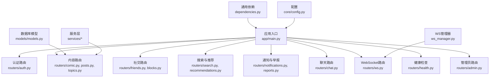
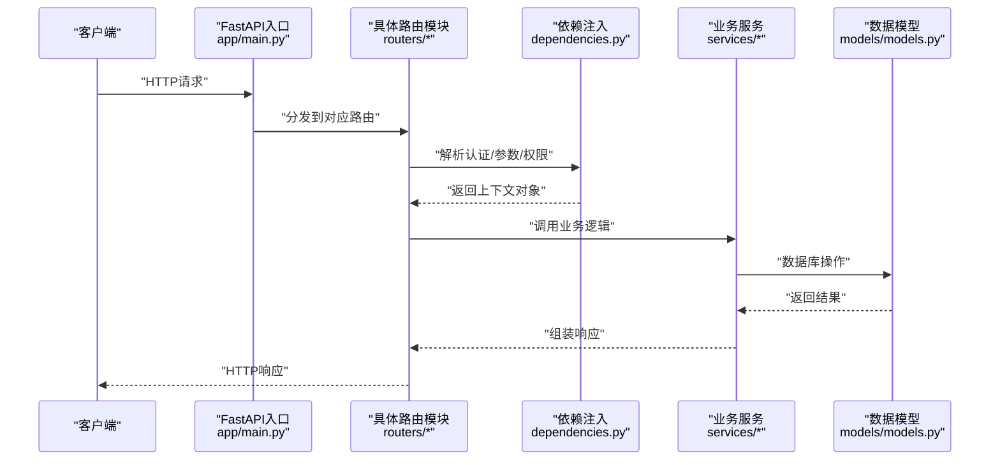
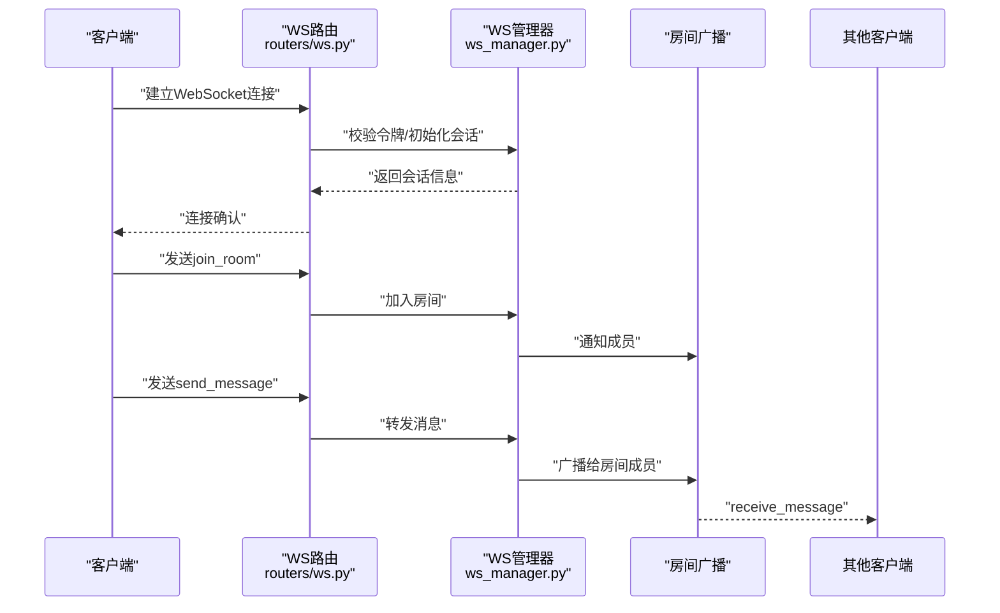
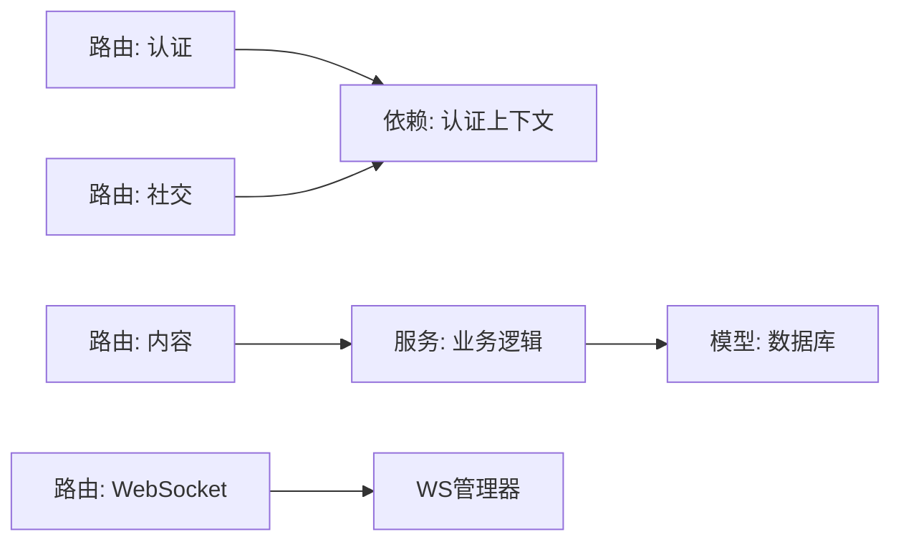

# API接口文档

<cite>
**本文档引用的文件**
- [app/main.py](file://app/main.py)
- [app/routers/auth.py](file://app/routers/auth.py)
- [app/routers/chat.py](file://app/routers/chat.py)
- [app/routers/comic.py](file://app/routers/comic.py)
- [app/routers/friends.py](file://app/routers/friends.py)
- [app/routers/posts.py](file://app/routers/posts.py)
- [app/routers/search.py](file://app/routers/search.py)
- [app/routers/recommendations.py](file://app/routers/recommendations.py)
- [app/routers/notifications.py](file://app/routers/notifications.py)
- [app/routers/admin.py](file://app/routers/admin.py)
- [app/routers/ws.py](file://app/routers/ws.py)
- [app/ws_manager.py](file://app/ws_manager.py)
- [app/models/models.py](file://app/models/models.py)
- [app/schemas/](file://app/schemas/)
- [app/services/](file://app/services/)
- [openapi.json](file://openapi.json)
- [websocket_api.json](file://websocket_api.json)
- [requirements.txt](file://requirements.txt)
- [app/core/config.py](file://app/core/config.py)
- [app/core/reset_password.py](file://app/core/reset_password.py)
- [app/dependencies.py](file://app/dependencies.py)
- [tests/test_websocket.py](file://tests/test_websocket.py)
- [tests/test_ws_connect.py](file://tests/test_ws_connect.py)
- [tests/test_ws_simple.py](file://tests/test_ws_simple.py)
- [tests/full_api_test.py](file://tests/full_api_test.py)
- [tests/test_search_api.py](file://tests/test_search_api.py)
- [tests/diagnose_websocket.py](file://tests/diagnose_websocket.py)
</cite>

## 目录
1. [简介](#简介)
2. [项目结构](#项目结构)
3. [核心组件](#核心组件)
4. [架构总览](#架构总览)
5. [详细组件分析](#详细组件分析)
6. [依赖关系分析](#依赖关系分析)
7. [性能考量](#性能考量)
8. [故障排除指南](#故障排除指南)
9. [结论](#结论)
10. [附录](#附录)

## 简介
本文件为 NanTuPy 项目的完整 API 接口文档，覆盖 RESTful HTTP API 与 WebSocket 实时通信 API。内容包含：
- 认证与会话管理
- 用户与社交功能（好友、屏蔽）
- 内容管理（漫画、帖子、话题）
- 搜索与推荐
- 通知与举报
- 聊天通信
- WebSocket 连接与消息协议
- 错误处理、安全、速率限制与版本信息
- 常见用例、客户端实现建议、性能优化与调试监控

## 项目结构
后端基于 FastAPI 构建，路由按功能模块划分在 app/routers 下，核心入口在 app/main.py 中注册各路由模块。数据库模型位于 app/models/models.py，服务层位于 app/services/，通用依赖与配置位于 app/dependencies.py 与 app/core/。

图表来源
- [app/main.py](file://app/main.py)
- [app/routers/auth.py](file://app/routers/auth.py)
- [app/routers/comic.py](file://app/routers/comic.py)
- [app/routers/posts.py](file://app/routers/posts.py)
- [app/routers/topics.py](file://app/routers/topics.py)
- [app/routers/friends.py](file://app/routers/friends.py)
- [app/routers/blocks.py](file://app/routers/blocks.py)
- [app/routers/search.py](file://app/routers/search.py)
- [app/routers/recommendations.py](file://app/routers/recommendations.py)
- [app/routers/notifications.py](file://app/routers/notifications.py)
- [app/routers/chat.py](file://app/routers/chat.py)
- [app/routers/ws.py](file://app/routers/ws.py)
- [app/ws_manager.py](file://app/ws_manager.py)
- [app/models/models.py](file://app/models/models.py)
- [app/dependencies.py](file://app/dependencies.py)
- [app/core/config.py](file://app/core/config.py)

章节来源
- [app/main.py](file://app/main.py)
- [app/routers/](file://app/routers/)

## 核心组件
- 应用入口与路由注册：在应用入口中注册所有子路由，并配置 OpenAPI 文档与根路径。
- 依赖注入：通过通用依赖模块提供认证上下文、数据库会话、权限校验等。
- 配置系统：支持开发与生产环境配置切换，包含安全与 SSL 设置。
- WS 管理：集中管理 WebSocket 连接、房间与广播逻辑。

章节来源
- [app/main.py](file://app/main.py)
- [app/dependencies.py](file://app/dependencies.py)
- [app/core/config.py](file://app/core/config.py)
- [app/ws_manager.py](file://app/ws_manager.py)

## 架构总览
下图展示从客户端到后端服务的整体调用链路，包括认证、业务处理与数据持久化。

图表来源
- [app/main.py](file://app/main.py)
- [app/dependencies.py](file://app/dependencies.py)
- [app/models/models.py](file://app/models/models.py)
- [app/services/](file://app/services/)

## 详细组件分析

### 认证与会话管理
- 终端点概览
  - 登录：POST /api/v1/auth/login
  - 注销：POST /api/v1/auth/logout
  - 刷新令牌：POST /api/v1/auth/refresh
  - 修改密码：POST /api/v1/auth/change-password
  - 忘记密码：POST /api/v1/auth/forgot-password
  - 重置密码：POST /api/v1/auth/reset-password
- 请求/响应要点
  - 登录成功返回访问令牌与刷新令牌；失败返回错误码与消息。
  - 刷新令牌需携带有效刷新令牌；失败返回未授权。
  - 修改/重置密码需邮箱验证与令牌校验。
- 安全与认证
  - 使用 JWT 令牌进行无状态认证；刷新令牌用于安全续期。
  - 密码修改与重置流程包含一次性令牌与过期时间控制。
- 版本与速率限制
  - 所有认证相关端点均在 /api/v1 下；建议对登录与忘记密码接口实施速率限制。

章节来源
- [app/routers/auth.py](file://app/routers/auth.py)
- [app/core/reset_password.py](file://app/core/reset_password.py)

### 用户与社交功能
- 好友管理
  - 发送好友请求：POST /api/v1/friends/request
  - 处理好友请求：POST /api/v1/friends/respond
  - 删除好友：DELETE /api/v1/friends/{user_id}
  - 获取好友列表：GET /api/v1/friends
- 屏蔽管理
  - 屏蔽用户：POST /api/v1/blocks/block
  - 取消屏蔽：POST /api/v1/blocks/unblock
  - 查询屏蔽列表：GET /api/v1/blocks
- 权限与错误
  - 需要已登录用户上下文；重复请求、目标不存在或权限不足将返回相应错误码。

章节来源
- [app/routers/friends.py](file://app/routers/friends.py)
- [app/routers/blocks.py](file://app/routers/blocks.py)

### 内容管理（漫画、帖子、话题）
- 漫画管理
  - 创建漫画：POST /api/v1/comic
  - 更新漫画：PUT /api/v1/comic/{id}
  - 删除漫画：DELETE /api/v1/comic/{id}
  - 获取漫画详情：GET /api/v1/comic/{id}
  - 分页查询漫画：GET /api/v1/comic
- 帖子管理
  - 创建帖子：POST /api/v1/posts
  - 更新帖子：PUT /api/v1/posts/{id}
  - 删除帖子：DELETE /api/v1/posts/{id}
  - 获取帖子详情：GET /api/v1/posts/{id}
  - 分页查询帖子：GET /api/v1/posts
- 话题管理
  - 创建话题：POST /api/v1/topics
  - 更新话题：PUT /api/v1/topics/{id}
  - 删除话题：DELETE /api/v1/topics/{id}
  - 获取话题详情：GET /api/v1/topics/{id}
  - 分页查询话题：GET /api/v1/topics
- 权限与审核
  - 需要作者或管理员权限；内容可能经过审核与过滤服务处理。

章节来源
- [app/routers/comic.py](file://app/routers/comic.py)
- [app/routers/posts.py](file://app/routers/posts.py)
- [app/routers/topics.py](file://app/routers/topics.py)
- [app/services/content_filter.py](file://app/services/content_filter.py)
- [app/services/content_moderation.py](file://app/services/content_moderation.py)

### 搜索与推荐
- 搜索
  - 关键词搜索：GET /api/v1/search?q={query}&type={type}&page={page}&size={size}
  - 邮箱搜索：GET /api/v1/search/email?email={email}
  - 空查询诊断：GET /api/v1/search/diagnose
- 推荐
  - 基于兴趣的推荐：GET /api/v1/recommendations
- 服务与算法
  - 搜索服务与推荐服务位于 app/services/，支持分页与排序。

章节来源
- [app/routers/search.py](file://app/routers/search.py)
- [app/routers/recommendations.py](file://app/routers/recommendations.py)
- [app/services/search_service.py](file://app/services/search_service.py)
- [app/services/recommendation_service.py](file://app/services/recommendation_service.py)

### 通知与举报
- 通知
  - 获取通知列表：GET /api/v1/notifications
  - 标记已读：POST /api/v1/notifications/read
- 举报
  - 提交举报：POST /api/v1/reports
  - 处理举报：POST /api/v1/reports/{id}/process
- 权限
  - 通知与举报通常需要登录用户上下文。

章节来源
- [app/routers/notifications.py](file://app/routers/notifications.py)
- [app/routers/reports.py](file://app/routers/reports.py)
- [app/services/notification_service.py](file://app/services/notification_service.py)

### 聊天通信
- 终端点
  - 发送消息：POST /api/v1/chat/send
  - 获取历史：GET /api/v1/chat/history?room={room}&limit={limit}
  - 加入房间：POST /api/v1/chat/join
  - 离开房间：POST /api/v1/chat/leave
- 权限
  - 需要登录用户上下文；房间访问需授权。

章节来源
- [app/routers/chat.py](file://app/routers/chat.py)

### WebSocket 实时通信
- 连接与握手
  - 协议：WebSocket；路径 /ws
  - 握手：携带认证令牌或会话标识
- 消息格式
  - JSON 结构：包含 type（事件类型）、payload（负载）、timestamp（时间戳）
- 事件类型
  - join_room：加入房间
  - leave_room：离开房间
  - send_message：发送消息
  - receive_message：接收消息
  - typing_start/typing_stop：输入状态
- 房间与广播
  - WS 管理器集中维护房间成员与消息广播
- 错误处理
  - 连接异常、消息格式错误、鉴权失败等场景返回错误事件

图表来源
- [app/routers/ws.py](file://app/routers/ws.py)
- [app/ws_manager.py](file://app/ws_manager.py)

章节来源
- [app/routers/ws.py](file://app/routers/ws.py)
- [app/ws_manager.py](file://app/ws_manager.py)
- [websocket_api.json](file://websocket_api.json)

### 管理员与后台
- 终端点
  - 内容审核：POST /api/v1/admin/content/moderate
  - 用户封禁：POST /api/v1/admin/users/ban
  - 数据统计：GET /api/v1/admin/stats
- 权限
  - 仅管理员可访问

章节来源
- [app/routers/admin.py](file://app/routers/admin.py)

### 健康检查与辅助
- 健康检查：GET /api/v1/health
- 上传：POST /api/v1/upload（图片/文件）

章节来源
- [app/routers/health.py](file://app/routers/health.py)
- [app/routers/upload.py](file://app/routers/upload.py)

## 依赖关系分析
- 路由到依赖：各路由通过依赖注入获取当前用户、数据库会话与权限校验。
- 服务到模型：服务层封装业务逻辑，调用数据模型进行持久化。
- WS 管理：WS 路由与 WS 管理器解耦，便于扩展房间与广播策略。

图表来源
- [app/dependencies.py](file://app/dependencies.py)
- [app/models/models.py](file://app/models/models.py)
- [app/services/](file://app/services/)
- [app/routers/ws.py](file://app/routers/ws.py)
- [app/ws_manager.py](file://app/ws_manager.py)

章节来源
- [app/dependencies.py](file://app/dependencies.py)
- [app/models/models.py](file://app/models/models.py)
- [app/services/](file://app/services/)

## 性能考量
- 分页与限制
  - 搜索与列表接口建议默认分页大小与最大页大小限制，避免超大数据集返回。
- 缓存策略
  - 对热门内容与推荐结果使用缓存，降低数据库压力。
- 图片优化
  - 使用图片优化服务减少带宽与加载时间。
- WS 广播
  - 控制房间成员数量与消息频率，避免广播风暴。
- 数据库索引
  - 为常用查询字段建立索引，如标题、关键词、时间戳等。

## 故障排除指南
- WebSocket 连接问题
  - 使用测试脚本诊断连接与消息收发：tests/test_ws_connect.py、tests/test_ws_simple.py、tests/test_websocket.py、tests/diagnose_websocket.py
  - 关注握手失败、消息格式错误、房间加入失败等日志
- API 测试
  - 使用全量 API 测试脚本 tests/full_api_test.py 与 tests/test_search_api.py 进行回归验证
- 常见错误
  - 未授权：检查令牌是否过期或无效
  - 参数错误：核对请求体与查询参数类型与范围
  - 服务器内部错误：查看服务日志与数据库异常

章节来源
- [tests/test_ws_connect.py](file://tests/test_ws_connect.py)
- [tests/test_ws_simple.py](file://tests/test_ws_simple.py)
- [tests/test_websocket.py](file://tests/test_websocket.py)
- [tests/diagnose_websocket.py](file://tests/diagnose_websocket.py)
- [tests/full_api_test.py](file://tests/full_api_test.py)
- [tests/test_search_api.py](file://tests/test_search_api.py)

## 结论
本接口文档覆盖了 NanTuPy 的主要 REST 与 WebSocket 能力，提供了认证、社交、内容、搜索、推荐、通知、聊天与管理等模块的端点说明与最佳实践。建议在生产环境中结合速率限制、缓存与监控体系，确保高可用与高性能。

## 附录
- 版本信息
  - API 根路径：/api/v1
  - OpenAPI 文档：/api/v1/openapi.json
- 安全与合规
  - 建议启用 HTTPS 与 CORS 策略；对敏感接口增加速率限制与审计日志
- 客户端实现建议
  - 使用统一的 HTTP 客户端封装，内置重试、超时与错误处理
  - WebSocket 客户端应实现断线重连、消息去重与本地队列
- 监控与调试
  - 使用 OpenAPI 文档自动生成 SDK 与测试用例
  - 集成日志与指标采集，关注错误率、延迟与并发