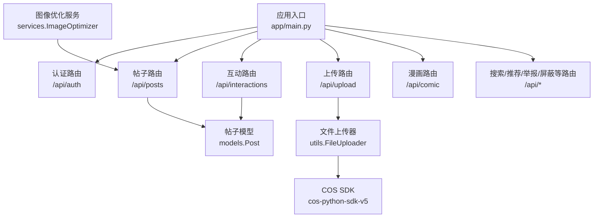
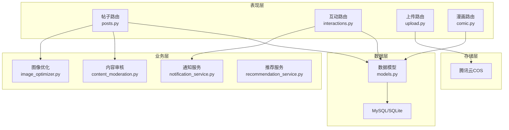
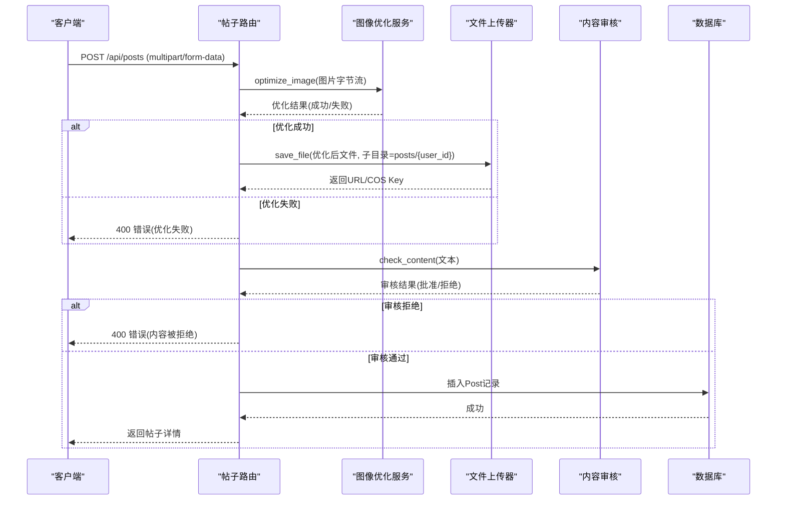
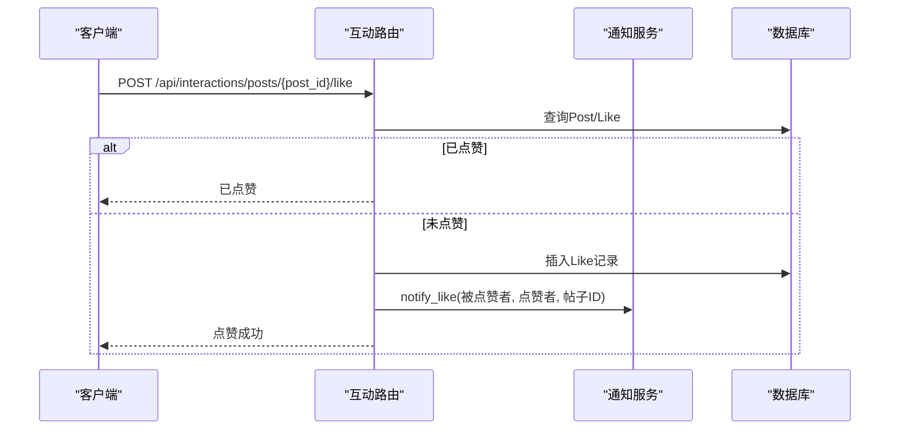
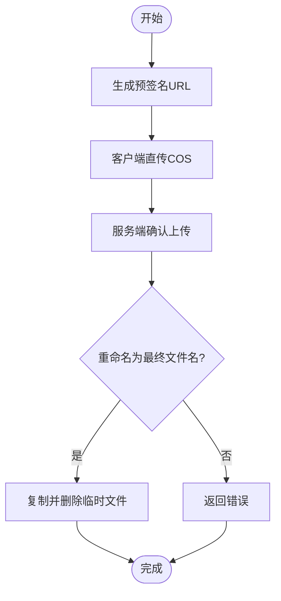
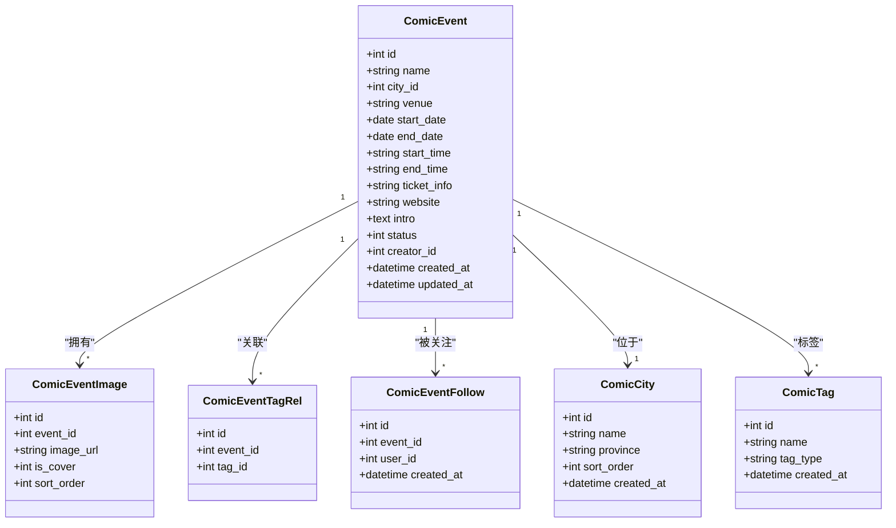
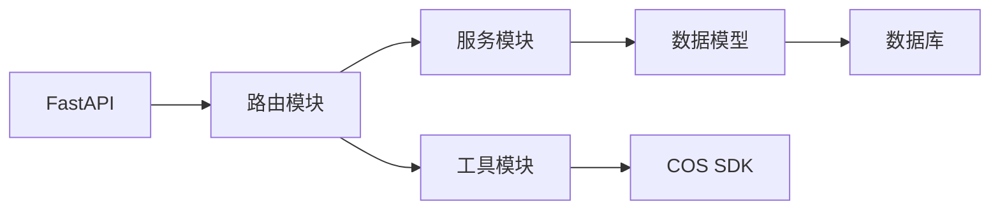

# 内容管理API

<cite>
**本文档引用的文件**
- [app/main.py](file://app/main.py)
- [app/routers/posts.py](file://app/routers/posts.py)
- [app/routers/interactions.py](file://app/routers/interactions.py)
- [app/routers/upload.py](file://app/routers/upload.py)
- [app/routers/comic.py](file://app/routers/comic.py)
- [app/utils.py](file://app/utils.py)
- [app/services/image_optimizer.py](file://app/services/image_optimizer.py)
- [app/models/models.py](file://app/models/models.py)
- [openapi.json](file://openapi.json)
- [requirements.txt](file://requirements.txt)
- [comic_tables.sql](file://comic_tables.sql)
</cite>

## 目录
1. [简介](#简介)
2. [项目结构](#项目结构)
3. [核心组件](#核心组件)
4. [架构总览](#架构总览)
5. [详细组件分析](#详细组件分析)
6. [依赖关系分析](#依赖关系分析)
7. [性能考虑](#性能考虑)
8. [故障排除指南](#故障排除指南)
9. [结论](#结论)
10. [附录](#附录)

## 简介
本文件为内容管理API的完整技术文档，涵盖帖子发布、编辑、删除、评论、点赞等社交内容相关接口；图片上传、压缩优化、存储管理的API规范；漫画内容的特殊处理接口；以及内容审核、标签管理、内容发现等功能的API使用方法。文档提供请求参数、响应格式与错误处理示例，并通过架构图与流程图帮助读者快速理解系统设计与实现。

## 项目结构
NanTuPy采用FastAPI框架，基于模块化路由组织功能模块，核心目录结构如下：
- app/main.py：应用入口与全局中间件、路由注册
- app/routers/*：各功能模块路由（posts、interactions、upload、comic等）
- app/services/*：业务服务（图像优化、内容审核、推荐等）
- app/models/models.py：数据模型定义（SQLAlchemy 2.x）
- app/utils.py：通用工具（文件上传、COS操作）
- comic_tables.sql：漫画相关数据库表结构
- openapi.json：自动生成的OpenAPI文档

**图表来源**
- [app/main.py:69-84](file://app/main.py#L69-L84)
- [app/routers/posts.py:19](file://app/routers/posts.py#L19)
- [app/routers/interactions.py:14](file://app/routers/interactions.py#L14)
- [app/routers/upload.py:16](file://app/routers/upload.py#L16)
- [app/utils.py:14](file://app/utils.py#L14)
- [app/services/image_optimizer.py:6](file://app/services/image_optimizer.py#L6)

**章节来源**
- [app/main.py:69-84](file://app/main.py#L69-L84)
- [requirements.txt:1-15](file://requirements.txt#L1-15)

## 核心组件
- 帖子管理：创建、读取、更新、删除、浏览统计、点赞/评论统计
- 互动系统：点赞、评论、回复、通知
- 上传与存储：预签名直传、确认重命名、删除、头像/封面确认
- 图像优化：压缩、缩放、缩略图生成
- 漫画内容：城市/标签、活动列表/详情、发布/编辑、关注/取消关注、评论系统
- 数据模型：用户、帖子、评论、点赞、好友、会话、消息、通知、话题、屏蔽、举报、浏览记录、搜索历史、敏感词、漫画相关实体

**章节来源**
- [app/routers/posts.py:22-405](file://app/routers/posts.py#L22-L405)
- [app/routers/interactions.py:54-433](file://app/routers/interactions.py#L54-L433)
- [app/routers/upload.py:50-224](file://app/routers/upload.py#L50-L224)
- [app/services/image_optimizer.py:16-230](file://app/services/image_optimizer.py#L16-L230)
- [app/routers/comic.py:23-832](file://app/routers/comic.py#L23-L832)
- [app/models/models.py:42-655](file://app/models/models.py#L42-L655)

## 架构总览
系统采用分层架构：
- 表现层：FastAPI路由与依赖注入
- 业务层：服务类（图像优化、内容审核、通知、推荐等）
- 数据访问层：SQLAlchemy ORM模型与数据库交互
- 存储层：腾讯云COS对象存储

**图表来源**
- [app/routers/posts.py:93-107](file://app/routers/posts.py#L93-L107)
- [app/routers/interactions.py:11-12](file://app/routers/interactions.py#L11-L12)
- [app/utils.py:14](file://app/utils.py#L14)
- [app/models/models.py:100-184](file://app/models/models.py#L100-L184)

## 详细组件分析

### 帖子管理API
- 创建帖子
  - 支持文本、单图URL、多图URL数组、视频URL输入
  - 图片上传时自动压缩优化（最大尺寸、质量、体积限制）
  - 视频直接上传存储
  - 内容审核：敏感词过滤与拒绝逻辑
  - 可见性控制：公开、好友可见、自定义可见用户
  - 自动话题链接与@提及处理
- 读取帖子
  - 动态流：仅展示已接受好友的帖子
  - 用户主页：仅展示公开帖子
  - 单个详情：包含是否点赞标记
- 更新帖子
  - 仅作者可更新，支持内容、视频URL、公开性切换
  - 更新后重新处理话题与@提及
- 删除帖子
  - 级联删除：评论、点赞、浏览记录、相关通知
  - 同步删除COS中的图片/视频资源
- 浏览统计
  - 记录首次浏览并增加浏览计数
- 统计查询
  - 查看点赞、评论、浏览数量

**图表来源**
- [app/routers/posts.py:22-140](file://app/routers/posts.py#L22-L140)
- [app/services/image_optimizer.py:16-112](file://app/services/image_optimizer.py#L16-L112)
- [app/utils.py:151-187](file://app/utils.py#L151-L187)

**章节来源**
- [app/routers/posts.py:22-405](file://app/routers/posts.py#L22-L405)
- [app/services/content_moderation.py](file://app/services/content_moderation.py)
- [app/services/topic_service.py](file://app/services/topic_service.py)
- [app/services/mention_service.py](file://app/services/mention_service.py)

### 互动系统API（点赞/评论）
- 点赞/取消点赞
  - 帖子点赞：重复点赞返回已点赞状态
  - 评论点赞：支持取消点赞
  - 点赞成功后触发通知
- 评论管理
  - 创建评论：支持回复他人，自动增加父评论回复计数
  - 获取评论：支持顶级评论分页与每条内嵌前若干回复
  - 更新/删除评论：仅作者或帖子作者可操作
  - 评论内容同样经过内容审核

**图表来源**
- [app/routers/interactions.py:54-99](file://app/routers/interactions.py#L54-L99)
- [app/routers/interactions.py:175-241](file://app/routers/interactions.py#L175-L241)

**章节来源**
- [app/routers/interactions.py:54-433](file://app/routers/interactions.py#L54-L433)

### 上传与存储API
- 预签名直传
  - 生成上传URL与访问URL，支持批量生成（1-20个）
  - 自动推断content-type与子目录（avatar/cover/post/comic/general）
- 确认上传
  - 将临时文件复制为最终文件并删除临时文件
  - 返回最终URL与COS Key
- 头像/封面确认
  - 更新用户头像/封面URL并持久化
- 删除文件
  - 支持通过URL删除COS文件
- 获取文件信息
  - 通过HEAD查询文件元信息

**图表来源**
- [app/routers/upload.py:50-129](file://app/routers/upload.py#L50-L129)
- [app/utils.py:37-121](file://app/utils.py#L37-L121)

**章节来源**
- [app/routers/upload.py:50-224](file://app/routers/upload.py#L50-L224)
- [app/utils.py:14-220](file://app/utils.py#L14-L220)

### 图像优化服务
- 压缩策略
  - 默认最大分辨率1920x1080，JPEG质量85，最大文件5MB
  - 超过阈值自动降质二次压缩
- 缩略图生成
  - 保持宽高比，输出JPEG缩略图
- 图片信息获取
  - 返回尺寸、格式、模式、大小等基础信息

**章节来源**
- [app/services/image_optimizer.py:16-230](file://app/services/image_optimizer.py#L16-L230)

### 漫画内容API
- 城市与标签
  - 获取城市列表与标签列表
- 活动管理
  - 列表：支持按城市筛选、分页、状态计算
  - 详情：包含封面图、标签、关注数、创建者信息
  - 发布/编辑：支持标签与图片集合
- 关注管理
  - 关注/取消关注，返回关注数
- 评论系统
  - 支持父子评论、回复他人、批量点赞/回复统计

**图表来源**
- [app/models/models.py:555-618](file://app/models/models.py#L555-L618)
- [comic_tables.sql:18-68](file://comic_tables.sql#L18-L68)

**章节来源**
- [app/routers/comic.py:23-832](file://app/routers/comic.py#L23-L832)
- [app/models/models.py:555-618](file://app/models/models.py#L555-L618)
- [comic_tables.sql:1-68](file://comic_tables.sql#L1-68)

### 内容审核与标签管理
- 内容审核
  - 文章与评论均进行敏感词检测
  - 审核拒绝时记录日志并返回拒绝原因
- 标签管理
  - 帖子自动话题链接与@提及处理
  - 漫画标签类型与关联

**章节来源**
- [app/routers/posts.py:93-107](file://app/routers/posts.py#L93-L107)
- [app/routers/interactions.py:191-197](file://app/routers/interactions.py#L191-L197)
- [app/services/topic_service.py](file://app/services/topic_service.py)
- [app/services/mention_service.py](file://app/services/mention_service.py)

### 内容发现与推荐
- 推荐服务
  - 批量加载帖子数据，减少N+1查询
  - 序列化时合并点赞/评论/浏览等聚合数据
- 搜索与历史
  - 搜索历史模型支持用户维度检索

**章节来源**
- [app/routers/posts.py:178-186](file://app/routers/posts.py#L178-L186)
- [app/models/models.py:489-511](file://app/models/models.py#L489-L511)

## 依赖关系分析
- 外部依赖
  - FastAPI、SQLAlchemy、Pillow、cos-python-sdk-v5等
- 内部依赖
  - 路由依赖服务与工具类
  - 服务依赖模型与数据库
  - 上传路由依赖COS SDK

**图表来源**
- [requirements.txt:1-15](file://requirements.txt#L1-L15)
- [app/main.py:13-14](file://app/main.py#L13-L14)

**章节来源**
- [requirements.txt:1-15](file://requirements.txt#L1-15)

## 性能考虑
- 批量查询与去N+1
  - 推荐服务批量加载帖子相关数据
  - 互动路由批量查询评论点赞状态
- 图像优化
  - 限制最大分辨率与文件大小，必要时降质二次压缩
- 存储直传
  - 使用预签名直传，减轻服务端压力
- 分页与索引
  - 评论与帖子查询使用分页与索引优化

**章节来源**
- [app/routers/interactions.py:26-48](file://app/routers/interactions.py#L26-L48)
- [app/services/image_optimizer.py:16-112](file://app/services/image_optimizer.py#L16-L112)

## 故障排除指南
- 上传失败
  - 检查COS配置（区域、密钥、桶名、域名）
  - 确认预签名URL有效时间与content-type
- 图像优化失败
  - 确认图片格式与大小限制
  - 检查Pillow依赖版本
- 内容审核拒绝
  - 查看审核日志与拒绝原因
  - 调整敏感词库或内容表述
- 权限错误
  - 确保Authorization头携带有效JWT
  - 检查帖子/评论的作者身份验证

**章节来源**
- [app/utils.py:20-28](file://app/utils.py#L20-L28)
- [app/routers/upload.py:82-96](file://app/routers/upload.py#L82-L96)
- [app/services/image_optimizer.py:108-112](file://app/services/image_optimizer.py#L108-L112)

## 结论
本内容管理API以模块化设计实现社交内容的全链路能力，结合图像优化与COS直传提升性能与可靠性；内置内容审核与标签管理增强内容治理；漫画模块提供完整的活动生命周期管理。通过OpenAPI文档与清晰的错误处理，便于前后端协作与问题定位。

## 附录

### API概览与认证
- 所有接口需携带Authorization: Bearer <jwt_token>（除注册/登录）
- OpenAPI文档自动生成，包含请求体与响应体Schema

**章节来源**
- [openapi.json:1-200](file://openapi.json#L1-L200)

### 数据模型概览
- 用户、帖子、评论、点赞、好友、会话、消息、通知、话题、屏蔽、举报、浏览记录、搜索历史、敏感词、漫画相关实体

**章节来源**
- [app/models/models.py:42-655](file://app/models/models.py#L42-L655)