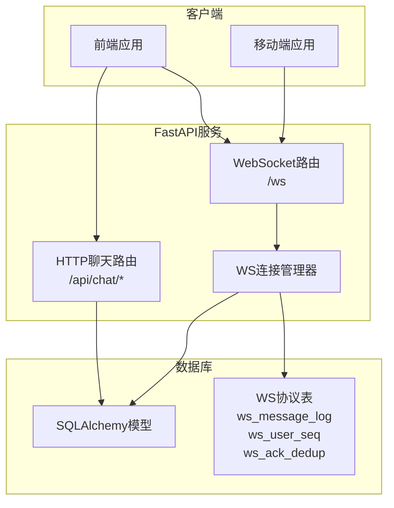
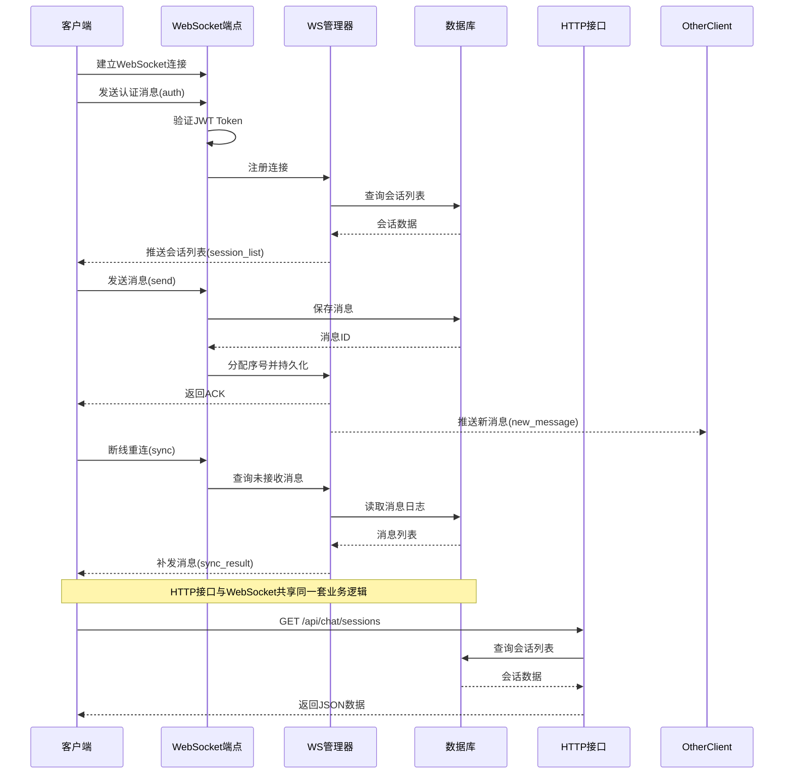
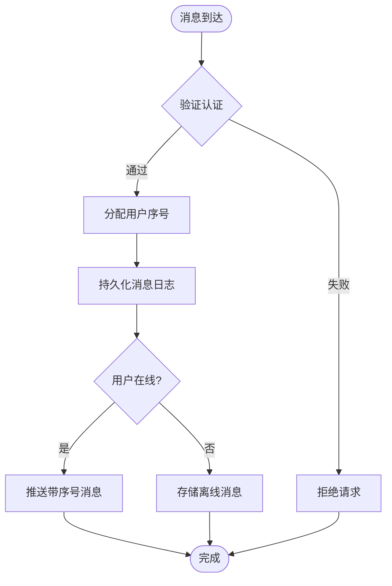
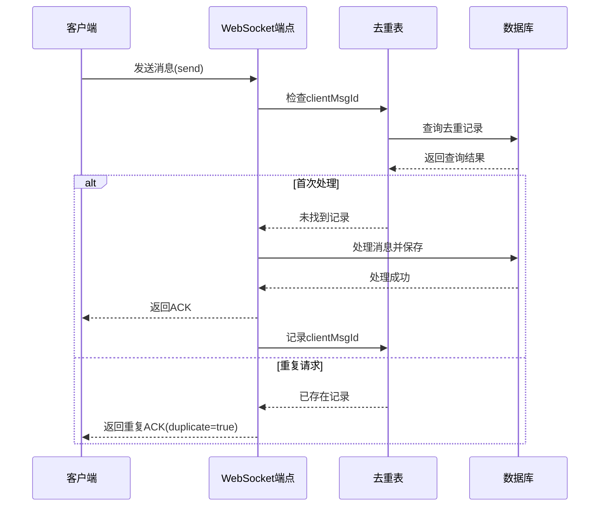
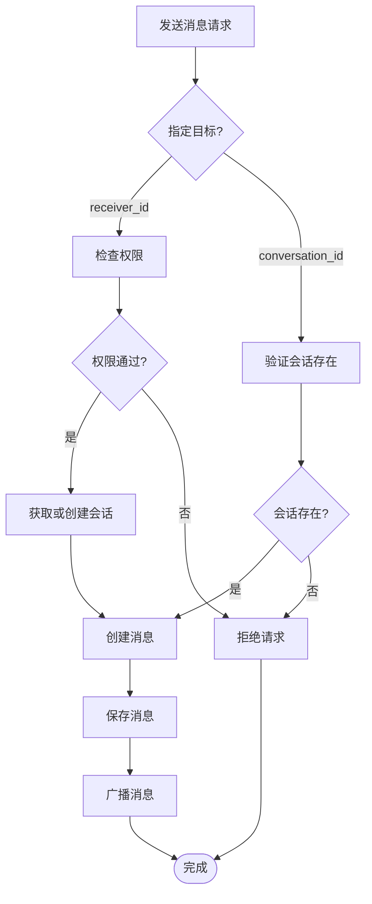
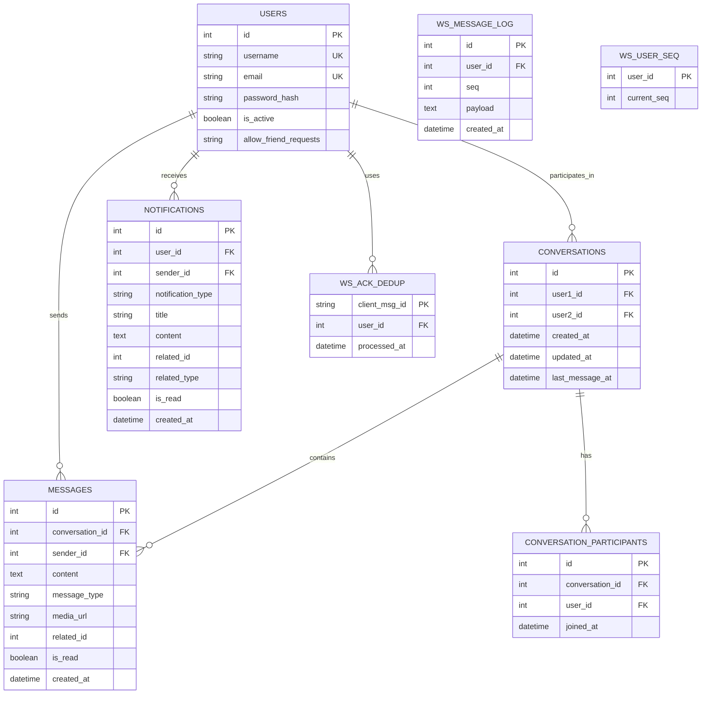
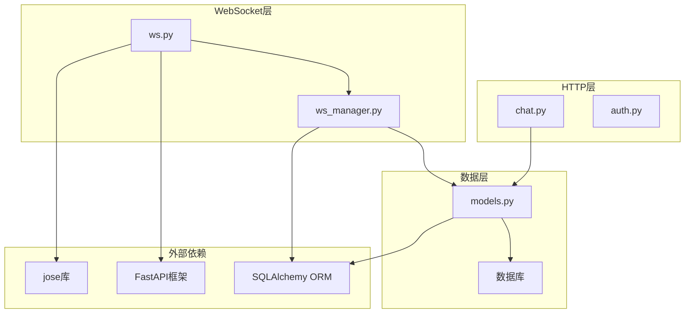

# 实时聊天API

<cite>
**本文档引用的文件**
- [app/routers/ws.py](file://app/routers/ws.py)
- [app/ws_manager.py](file://app/ws_manager.py)
- [app/routers/chat.py](file://app/routers/chat.py)
- [websocket_api.json](file://websocket_api.json)
- [openapi.json](file://openapi.json)
- [app/models/models.py](file://app/models/models.py)
- [migrations/add_ws_protocol_tables.sql](file://migrations/add_ws_protocol_tables.sql)
- [tests/test_ws_connect.py](file://tests/test_ws_connect.py)
- [tests/test_websocket.py](file://tests/test_websocket.py)
- [tests/diagnose_websocket.py](file://tests/diagnose_websocket.py)
</cite>

## 目录
1. [简介](#简介)
2. [项目结构](#项目结构)
3. [核心组件](#核心组件)
4. [架构总览](#架构总览)
5. [详细组件分析](#详细组件分析)
6. [依赖关系分析](#依赖关系分析)
7. [性能考虑](#性能考虑)
8. [故障排除指南](#故障排除指南)
9. [结论](#结论)

## 简介
本项目提供一套完整的实时聊天API，基于原生WebSocket实现v3.0序号协议，支持：
- 连接认证（JWT HS256）
- 消息序列化（每用户单调递增序号）
- 断线补发（sync + lastReceivedSeq）
- 幂等去重（clientMsgId）
- 在线状态跟踪
- 消息历史获取
- 会话房间管理（typing广播）

## 项目结构
项目采用FastAPI + SQLAlchemy架构，核心模块如下：
- 路由层：WebSocket端点与HTTP聊天接口
- 业务层：消息处理、会话管理、权限校验
- 传输层：WebSocket连接管理与消息序号系统
- 数据层：SQLAlchemy模型与WS协议专用表

**图表来源**
- [app/routers/ws.py:434-538](file://app/routers/ws.py#L434-L538)
- [app/routers/chat.py:16-538](file://app/routers/chat.py#L16-L538)
- [app/ws_manager.py:20-308](file://app/ws_manager.py#L20-L308)

**章节来源**
- [app/routers/ws.py:1-538](file://app/routers/ws.py#L1-L538)
- [app/routers/chat.py:1-538](file://app/routers/chat.py#L1-L538)
- [app/ws_manager.py:1-308](file://app/ws_manager.py#L1-L308)

## 核心组件
本系统的核心组件包括：

### WebSocket端点（/ws）
- 原生WebSocket实现，基于v3.0序号协议
- 支持认证、心跳、消息收发、会话房间管理
- 提供断线补发和ACK去重机制

### WS连接管理器（WSManager）
- 单例模式管理用户连接池
- 维护每用户消息序号（原子递增）
- 实现消息日志持久化
- 支持会话房间广播

### 聊天HTTP接口
- 会话列表查询
- 消息历史分页获取
- HTTP降级消息发送
- 在线状态查询

**章节来源**
- [app/routers/ws.py:434-538](file://app/routers/ws.py#L434-L538)
- [app/ws_manager.py:20-308](file://app/ws_manager.py#L20-L308)
- [app/routers/chat.py:23-538](file://app/routers/chat.py#L23-L538)

## 架构总览
系统采用分层架构，WebSocket与HTTP接口共享相同的业务逻辑和数据模型。

**图表来源**
- [app/routers/ws.py:434-538](file://app/routers/ws.py#L434-L538)
- [app/ws_manager.py:74-95](file://app/ws_manager.py#L74-L95)
- [app/routers/chat.py:23-131](file://app/routers/chat.py#L23-L131)

## 详细组件分析

### WebSocket协议设计
系统采用v3.0序号协议，所有下行推送消息均带有唯一序号，确保消息可靠传输。

#### 消息类型定义
- **上行消息（客户端→服务端）**：auth, send, ack_receive, sync, ping, join, leave, typing, stop_typing
- **下行消息（服务端→客户端）**：auth_result, message(seq+payload), ack, sync_result, pong, error

#### 序号机制

**图表来源**
- [app/ws_manager.py:170-213](file://app/ws_manager.py#L170-L213)
- [app/ws_manager.py:74-95](file://app/ws_manager.py#L74-L95)

#### 幂等去重机制
系统通过clientMsgId实现消息幂等，防止重复处理。

**图表来源**
- [app/ws_manager.py:265-303](file://app/ws_manager.py#L265-L303)
- [migrations/add_ws_protocol_tables.sql:21-26](file://migrations/add_ws_protocol_tables.sql#L21-L26)

**章节来源**
- [websocket_api.json:46-450](file://websocket_api.json#L46-L450)
- [app/ws_manager.py:170-303](file://app/ws_manager.py#L170-L303)

### 会话管理
系统支持一对一私聊和会话房间管理。

#### 会话创建与权限校验

**图表来源**
- [app/routers/ws.py:215-315](file://app/routers/ws.py#L215-L315)
- [app/routers/ws.py:47-108](file://app/routers/ws.py#L47-L108)

#### 会话房间管理
- join/leave：加入/离开会话房间
- typing/stop_typing：输入状态广播
- 房间内广播不持久化（seq=0）

**章节来源**
- [app/routers/ws.py:332-373](file://app/routers/ws.py#L332-L373)
- [app/ws_manager.py:136-164](file://app/ws_manager.py#L136-L164)

### 在线状态跟踪
系统提供多种在线状态查询方式：

#### 实时在线状态
- ws_manager.is_connected()：检查用户是否在线
- ws_manager.get_online_user_ids()：获取在线用户列表
- ws_manager.get_online_user_ids()：获取在线用户列表

#### HTTP在线状态查询
- GET /api/chat/users/online：获取在线用户列表
- GET /api/chat/users/{user_id}/status：获取指定用户在线状态

**章节来源**
- [app/routers/chat.py:483-509](file://app/routers/chat.py#L483-L509)
- [app/ws_manager.py:62-69](file://app/ws_manager.py#L62-L69)

### 消息历史获取
系统提供两种消息历史获取方式：

#### WebSocket会话列表
- 认证成功后自动推送session_list
- 包含每个会话的最后一条消息和未读计数

#### HTTP消息历史
- GET /api/chat/conversations/{conversation_id}/messages：分页获取消息历史
- GET /api/chat/messages/{conversation_id}：新版分页接口

**章节来源**
- [app/routers/ws.py:110-175](file://app/routers/ws.py#L110-L175)
- [app/routers/chat.py:277-348](file://app/routers/chat.py#L277-L348)

### 数据模型设计
系统使用SQLAlchemy ORM定义数据模型，WS协议使用专用表实现可靠传输。

**图表来源**
- [app/models/models.py:286-389](file://app/models/models.py#L286-L389)
- [migrations/add_ws_protocol_tables.sql:4-26](file://migrations/add_ws_protocol_tables.sql#L4-L26)

**章节来源**
- [app/models/models.py:286-655](file://app/models/models.py#L286-L655)
- [migrations/add_ws_protocol_tables.sql:1-32](file://migrations/add_ws_protocol_tables.sql#L1-L32)

## 依赖关系分析

**图表来源**
- [app/routers/ws.py:10-16](file://app/routers/ws.py#L10-L16)
- [app/ws_manager.py:11-15](file://app/ws_manager.py#L11-L15)
- [app/routers/chat.py:7-13](file://app/routers/chat.py#L7-L13)

### 关键依赖关系
- WebSocket端点依赖WS管理器进行连接管理和消息序号分配
- 业务逻辑共享SQLAlchemy模型，确保数据一致性
- JWT库用于认证消息的Token验证
- FastAPI提供WebSocket支持和路由管理

**章节来源**
- [app/routers/ws.py:10-16](file://app/routers/ws.py#L10-L16)
- [app/ws_manager.py:11-15](file://app/ws_manager.py#L11-L15)
- [app/routers/chat.py:7-13](file://app/routers/chat.py#L7-L13)

## 性能考虑
系统在设计时充分考虑了性能优化：

### 连接管理优化
- 单例WS管理器减少内存占用
- 连接池管理避免重复连接
- 自动清理离线用户连接

### 消息处理优化
- 异步消息处理提升吞吐量
- 原子序号分配保证数据一致性
- 消息日志异步持久化

### 数据库优化
- 索引优化：WS表使用(user_id, seq)复合索引
- 批量查询：会话列表使用批量查询减少数据库往返
- 连接池：SQLAlchemy连接池复用数据库连接

### 缓存策略
- 在线状态缓存在内存中
- 会话列表缓存在WS管理器中
- 定期清理过期数据（24小时去重记录，7天消息日志）

## 故障排除指南

### 常见问题诊断
1. **连接失败**
   - 检查服务器是否运行：`curl http://localhost:5000/health`
   - 验证端口监听：`netstat -an | grep 5000`
   - 检查防火墙设置

2. **认证失败**
   - 验证JWT Token格式和有效期
   - 检查用户是否存在
   - 确认Token签名算法（HS256）

3. **消息丢失**
   - 检查lastReceivedSeq同步
   - 验证clientMsgId唯一性
   - 查看消息日志表

### 测试工具
系统提供了完整的测试套件：

#### WebSocket协议测试
- 连接认证测试
- 心跳保活测试
- 断线补发测试
- 幂等去重测试
- 无效Token测试

#### 诊断工具
- 服务器状态检查
- 端口监听检查
- WebSocket端点检查
- 连接诊断报告

**章节来源**
- [tests/test_ws_connect.py:1-319](file://tests/test_ws_connect.py#L1-L319)
- [tests/diagnose_websocket.py:1-239](file://tests/diagnose_websocket.py#L1-L239)
- [tests/test_websocket.py:1-203](file://tests/test_websocket.py#L1-L203)

### 错误代码说明
- **4001**：JWT无效或过期
- **1000**：同用户新连接替换旧连接
- **4003**：用户不存在
- **4004**：会话不存在
- **4009**：权限不足

**章节来源**
- [websocket_api.json:66-70](file://websocket_api.json#L66-L70)
- [app/routers/ws.py:454-466](file://app/routers/ws.py#L454-L466)

## 结论
本实时聊天API系统具有以下特点：

### 技术优势
- **可靠性**：基于序号协议的消息传输，确保消息不丢失
- **可扩展性**：模块化设计，易于扩展新功能
- **性能**：异步处理和数据库优化，支持高并发
- **易用性**：清晰的API规范和完整的测试覆盖

### 功能完整性
- 支持一对一私聊和会话房间管理
- 提供完整的在线状态跟踪
- 实现消息历史获取和断线补发
- 支持HTTP和WebSocket双通道

### 最佳实践建议
1. 前端应实现心跳保活机制
2. 使用clientMsgId确保消息幂等
3. 实现lastReceivedSeq同步机制
4. 定期清理过期数据
5. 监控连接状态和消息传输质量

该系统为构建高性能的实时聊天应用提供了完整的技术解决方案。