# 搜索发现API

<cite>
**本文档引用的文件**
- [app/routers/search.py](file://app/routers/search.py)
- [app/services/search_service.py](file://app/services/search_service.py)
- [app/models/models.py](file://app/models/models.py)
- [app/services/recommendation_service.py](file://app/services/recommendation_service.py)
- [app/routers/recommendations.py](file://app/routers/recommendations.py)
- [app/dependencies.py](file://app/dependencies.py)
- [app/database.py](file://app/database.py)
- [app/main.py](file://app/main.py)
- [tests/test_search_api.py](file://tests/test_search_api.py)
</cite>

## 目录
1. [简介](#简介)
2. [项目结构](#项目结构)
3. [核心组件](#核心组件)
4. [架构概览](#架构概览)
5. [详细组件分析](#详细组件分析)
6. [依赖关系分析](#依赖关系分析)
7. [性能考虑](#性能考虑)
8. [故障排除指南](#故障排除指南)
9. [结论](#结论)

## 简介

搜索发现API是NanTuPy社交平台后端系统中的核心功能模块，负责提供用户搜索、内容检索、标签搜索、搜索历史管理和个性化推荐等发现功能。该模块采用FastAPI框架构建，实现了完整的RESTful API接口，支持高效的搜索算法和推荐系统。

该API模块主要包含以下核心功能：
- 用户搜索和自动补全
- 帖子内容搜索
- 全局综合搜索
- 标签搜索和热门标签
- 搜索历史管理
- @提及用户建议
- 个性化推荐算法

## 项目结构

搜索发现API位于应用的`app/routers`和`app/services`目录中，采用清晰的分层架构设计：

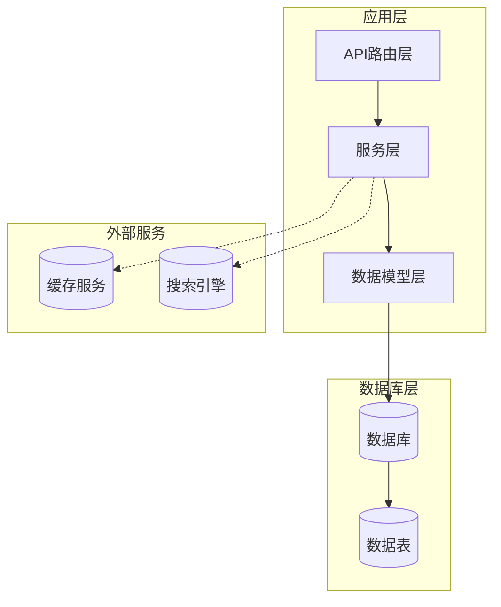

**图表来源**
- [app/routers/search.py:1-269](file://app/routers/search.py#L1-L269)
- [app/services/search_service.py:1-179](file://app/services/search_service.py#L1-L179)

**章节来源**
- [app/routers/search.py:1-269](file://app/routers/search.py#L1-L269)
- [app/services/search_service.py:1-179](file://app/services/search_service.py#L1-L179)
- [app/models/models.py:1-655](file://app/models/models.py#L1-L655)

## 核心组件

### 搜索路由层

搜索路由层提供了完整的RESTful API接口，每个接口都经过精心设计以满足不同的搜索需求：

| 接口类型 | 路径 | 方法 | 功能描述 |
|---------|------|------|----------|
| 用户搜索 | `/api/search/users` | GET | 搜索用户，支持邮箱和用户名匹配 |
| 帖子搜索 | `/api/search/posts` | GET | 搜索帖子内容 |
| 全局搜索 | `/api/search/global` | GET | 综合搜索用户和帖子 |
| 标签搜索 | `/api/search/hashtag/{hashtag}` | GET | 按标签搜索帖子 |
| 热门标签 | `/api/search/trending-hashtags` | GET | 获取热门标签 |
| 用户建议 | `/api/search/suggest/users` | GET | 用户自动补全建议 |
| 搜索历史 | `/api/search/history` | GET/POST/DELETE | 搜索历史管理 |

### 搜索服务层

搜索服务层实现了核心搜索逻辑，采用Session参数传递模式，确保数据库连接的有效管理：

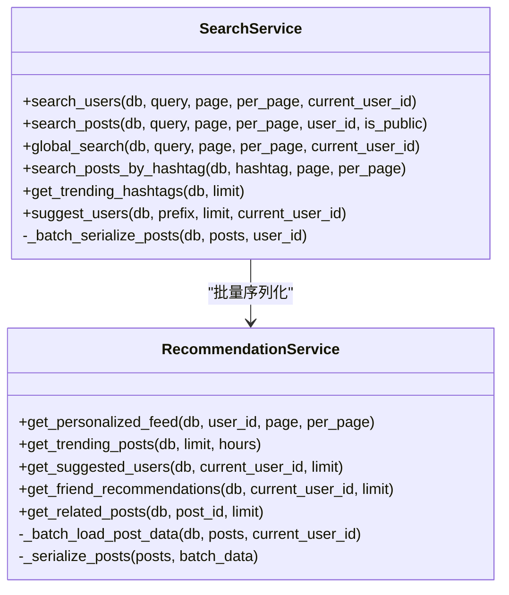

**图表来源**
- [app/services/search_service.py:9-179](file://app/services/search_service.py#L9-L179)
- [app/services/recommendation_service.py:10-457](file://app/services/recommendation_service.py#L10-L457)

**章节来源**
- [app/services/search_service.py:9-179](file://app/services/search_service.py#L9-L179)
- [app/services/recommendation_service.py:10-457](file://app/services/recommendation_service.py#L10-L457)

## 架构概览

搜索发现API采用了典型的三层架构设计，确保了良好的可维护性和扩展性：

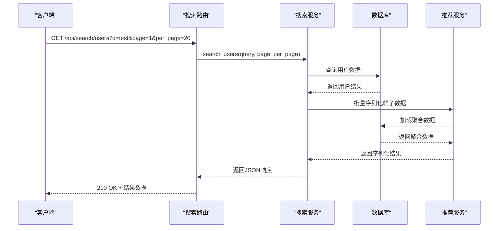

**图表来源**
- [app/routers/search.py:17-30](file://app/routers/search.py#L17-L30)
- [app/services/search_service.py:12-51](file://app/services/search_service.py#L12-L51)

## 详细组件分析

### 用户搜索功能

用户搜索功能支持多种搜索模式，包括用户名精确匹配、邮箱部分匹配等：

#### 搜索参数规范

| 参数名 | 类型 | 必需 | 默认值 | 限制 | 描述 |
|--------|------|------|--------|------|------|
| q | string | 是 | 空字符串 | 最大长度200字符 | 搜索关键词 |
| page | integer | 否 | 1 | ≥1 | 页码 |
| per_page | integer | 否 | 20 | 1-100 | 每页数量 |

#### 搜索算法实现

用户搜索采用多条件匹配策略：

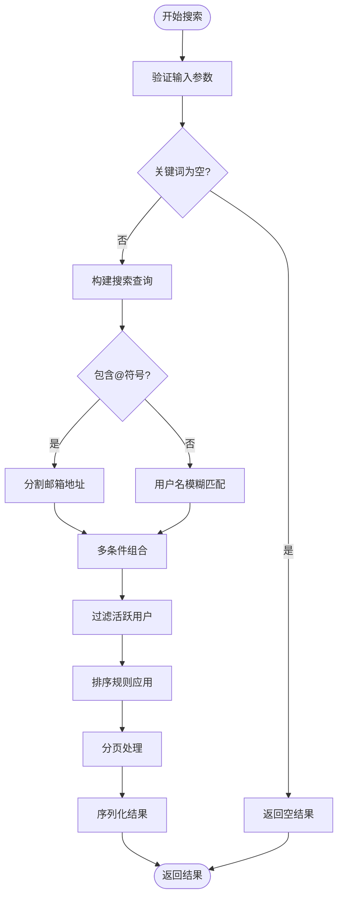

**图表来源**
- [app/services/search_service.py:12-51](file://app/services/search_service.py#L12-L51)

#### 排序规则

用户搜索结果按照以下优先级排序：
1. **用户名精确匹配** - 优先显示完全匹配的结果
2. **创建时间倒序** - 新注册用户排在前面
3. **活跃状态过滤** - 仅显示活跃用户

**章节来源**
- [app/services/search_service.py:12-51](file://app/services/search_service.py#L12-L51)
- [app/routers/search.py:17-30](file://app/routers/search.py#L17-L30)

### 帖子搜索功能

帖子搜索功能基于内容字段进行全文搜索，支持用户ID过滤和公开性控制：

#### 搜索范围控制

帖子搜索默认只返回公开内容，确保用户隐私安全：

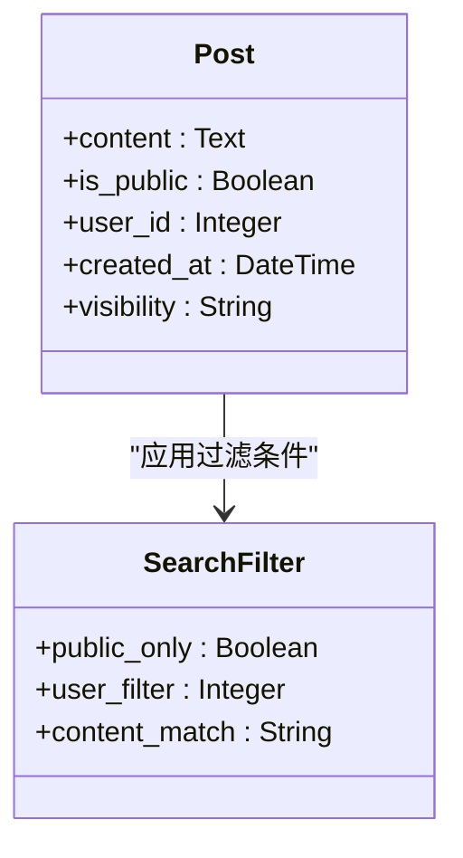

**图表来源**
- [app/models/models.py:100-127](file://app/models/models.py#L100-L127)
- [app/services/search_service.py:63-89](file://app/services/search_service.py#L63-L89)

#### 分页机制

帖子搜索采用标准的分页模式：
- **偏移量计算**: `(page - 1) * per_page`
- **限制数量**: `per_page`（最大100）
- **总页数计算**: `(total + per_page - 1) // per_page`

**章节来源**
- [app/services/search_service.py:63-89](file://app/services/search_service.py#L63-L89)
- [app/routers/search.py:33-47](file://app/routers/search.py#L33-L47)

### 全局综合搜索

全局搜索整合了用户搜索和帖子搜索功能，提供统一的搜索体验：

#### 搜索流程

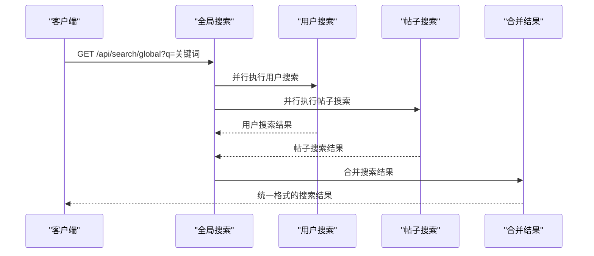

**图表来源**
- [app/services/search_service.py:91-111](file://app/services/search_service.py#L91-L111)

#### 结果格式

全局搜索返回统一的数据结构：
```json
{
    "query": "搜索关键词",
    "users": [...],
    "posts": [...],
    "user_total": 0,
    "post_total": 0,
    "total_results": 0,
    "current_page": 1,
    "per_page": 10
}
```

**章节来源**
- [app/services/search_service.py:91-111](file://app/services/search_service.py#L91-L111)
- [app/routers/search.py:50-66](file://app/routers/search.py#L50-L66)

### 标签搜索功能

标签搜索功能专门用于查找包含特定标签的帖子：

#### 标签解析算法

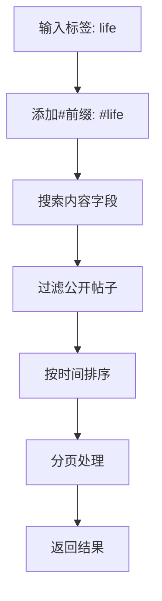

**图表来源**
- [app/services/search_service.py:114-138](file://app/services/search_service.py#L114-L138)

#### 热门标签生成

热门标签通过分析最近的公开帖子生成：

**章节来源**
- [app/services/search_service.py:114-157](file://app/services/search_service.py#L114-L157)
- [app/routers/search.py:69-90](file://app/routers/search.py#L69-L90)

### 搜索历史管理

搜索历史功能允许用户追踪和管理自己的搜索记录：

#### 数据模型设计

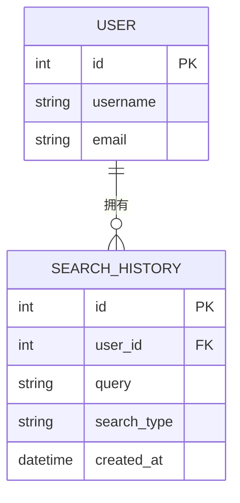

**图表来源**
- [app/models/models.py:489-511](file://app/models/models.py#L489-L511)

#### 历史记录策略

- **去重机制**: 5分钟内相同的查询不会重复记录
- **存储限制**: 自动清理超过100条的历史记录
- **隐私保护**: 仅保存当前用户的搜索记录

**章节来源**
- [app/models/models.py:489-511](file://app/models/models.py#L489-L511)
- [app/routers/search.py:107-178](file://app/routers/search.py#L107-L178)

### @提及用户建议

@提及建议功能提供智能的用户推荐，特别考虑用户的好友关系：

#### 推荐算法

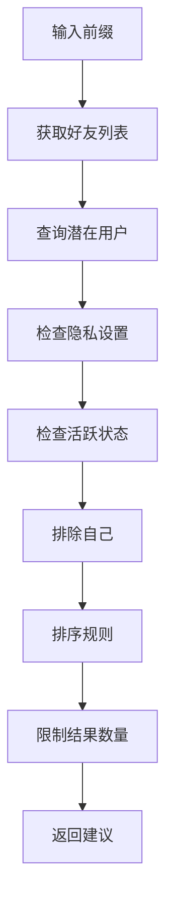

**图表来源**
- [app/routers/search.py:212-268](file://app/routers/search.py#L212-L268)

#### 排序优先级

@提及建议按照以下优先级排序：
1. **好友关系** - 好友优先于非好友
2. **用户名匹配** - 前缀匹配度
3. **字母顺序** - 字典序排列

**章节来源**
- [app/routers/search.py:212-268](file://app/routers/search.py#L212-L268)

## 依赖关系分析

### 组件耦合关系

搜索发现API的组件之间具有清晰的依赖关系：

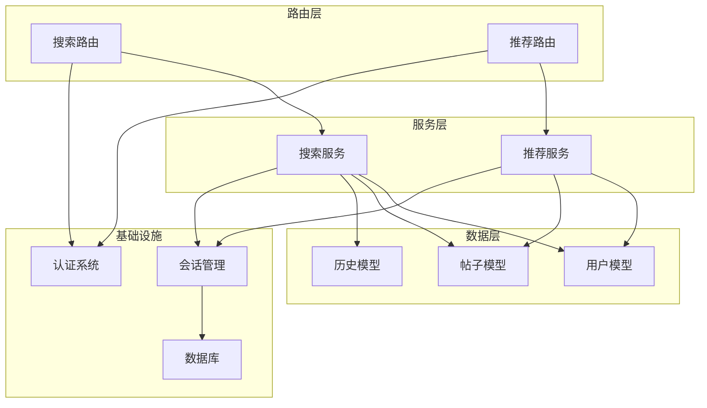

**图表来源**
- [app/routers/search.py:1-269](file://app/routers/search.py#L1-L269)
- [app/services/search_service.py:1-179](file://app/services/search_service.py#L1-L179)
- [app/services/recommendation_service.py:1-457](file://app/services/recommendation_service.py#L1-L457)

### 外部依赖

系统依赖的关键外部组件：
- **SQLAlchemy**: ORM框架，提供数据库抽象层
- **FastAPI**: Web框架，提供高性能API服务
- **JWT**: 用户认证和授权
- **数据库**: MySQL/PostgreSQL（配置支持）

**章节来源**
- [app/database.py:1-38](file://app/database.py#L1-L38)
- [app/dependencies.py:1-63](file://app/dependencies.py#L1-L63)

## 性能考虑

### 数据库优化策略

#### 索引设计

搜索功能依赖以下关键索引：
- **用户表**: `username`、`email`、`is_active`、`allow_search`
- **帖子表**: `content`、`is_public`、`user_id`、`created_at`
- **搜索历史表**: `user_id`、`created_at`

#### 查询优化

1. **批量数据加载**: 使用`_batch_load_post_data`方法减少N+1查询
2. **延迟加载**: 仅在需要时加载聚合数据
3. **查询缓存**: 对热门搜索结果进行缓存

### 缓存策略

#### 缓存层次

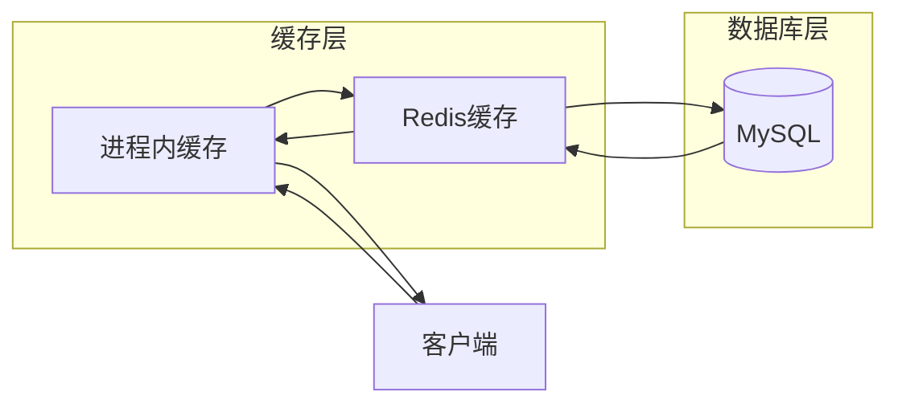

#### 缓存键设计

- **用户搜索**: `search:user:{query}:{page}`
- **帖子搜索**: `search:post:{query}:{page}`
- **热门标签**: `trending:hashtags:{timestamp}`
- **搜索历史**: `search:history:{user_id}`

### 性能监控

#### 关键指标

| 指标类型 | 监控目标 | 告警阈值 |
|----------|----------|----------|
| 响应时间 | < 500ms | > 1000ms |
| 错误率 | < 1% | > 5% |
| QPS | 根据业务需求 | 下降30% |
| 数据库连接 | < 80% | > 90% |

## 故障排除指南

### 常见问题诊断

#### 搜索无结果

**可能原因**:
1. 搜索关键词为空或过短
2. 目标用户设置了隐私限制
3. 搜索范围不正确

**解决方案**:
1. 验证搜索参数有效性
2. 检查用户隐私设置
3. 确认搜索范围参数

#### 性能问题

**症状**: 搜索响应时间过长

**诊断步骤**:
1. 检查数据库索引是否完整
2. 分析慢查询日志
3. 监控数据库连接池使用情况

#### 认证失败

**症状**: 401未授权错误

**排查方法**:
1. 验证JWT令牌有效性
2. 检查令牌过期时间
3. 确认用户账户状态

**章节来源**
- [tests/test_search_api.py:120-457](file://tests/test_search_api.py#L120-L457)

### API测试覆盖

系统提供了全面的API测试套件，涵盖所有搜索功能：

#### 测试场景

| 测试类型 | 测试用例 | 期望结果 |
|----------|----------|----------|
| 用户搜索 | 搜索存在的用户名 | 返回匹配用户 |
| 帖子搜索 | 搜索包含关键词的内容 | 返回相关帖子 |
| 全局搜索 | 综合搜索用户和帖子 | 返回统一格式结果 |
| 标签搜索 | 搜索特定标签 | 返回包含标签的帖子 |
| 搜索历史 | 保存、获取、清理历史 | 正确管理历史记录 |
| @提及建议 | 获取用户建议 | 返回好友优先的建议 |

**章节来源**
- [tests/test_search_api.py:1-457](file://tests/test_search_api.py#L1-L457)

## 结论

搜索发现API模块展现了现代Web应用搜索功能的最佳实践，具有以下特点：

### 技术优势

1. **架构清晰**: 采用分层架构，职责分离明确
2. **性能优化**: 实现批量数据加载和查询优化
3. **用户体验**: 提供智能排序和个性化推荐
4. **可扩展性**: 支持水平扩展和缓存策略

### 功能完整性

- 支持多种搜索模式（用户、帖子、标签、全局）
- 提供智能推荐算法
- 实现搜索历史管理
- 支持@提及用户建议
- 具备完善的错误处理机制

### 发展建议

1. **搜索引擎集成**: 考虑集成Elasticsearch提升搜索性能
2. **缓存优化**: 实施多级缓存策略
3. **监控增强**: 添加更详细的性能监控指标
4. **搜索建议**: 实现智能搜索建议功能

该模块为NanTuPy平台提供了强大的发现能力，为用户提供了流畅的搜索体验，是平台内容生态的重要组成部分。