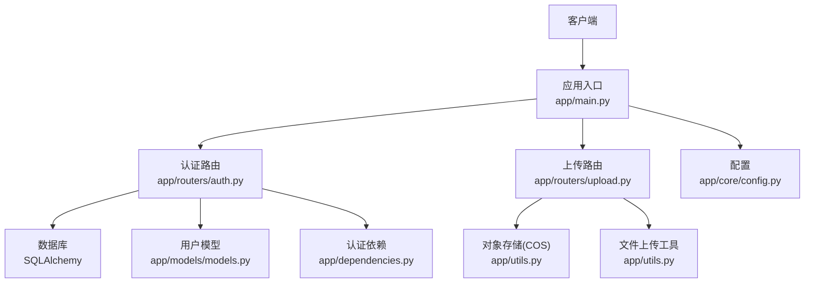
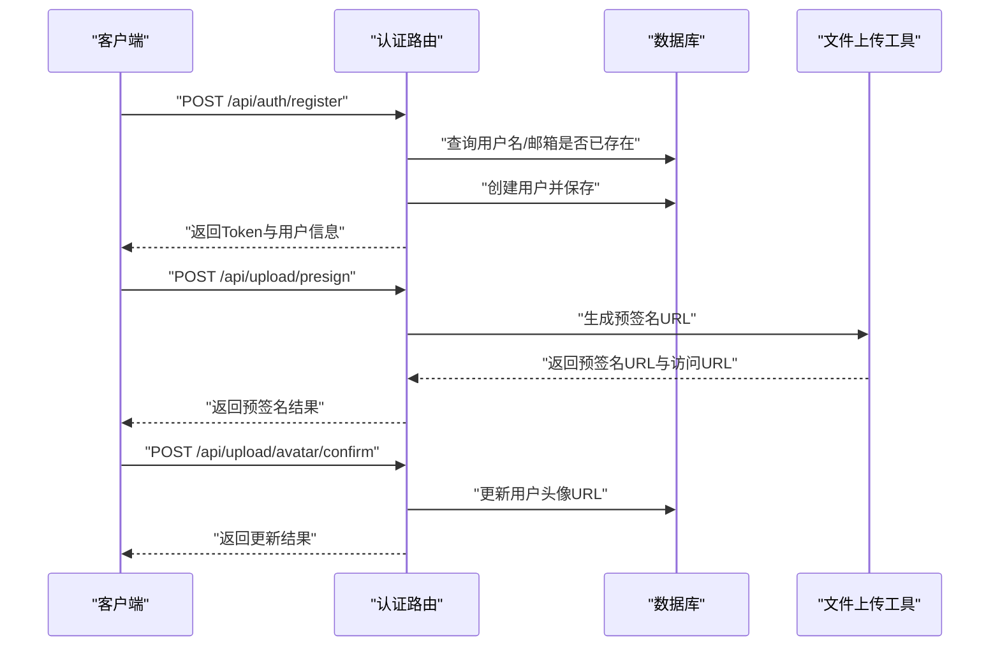
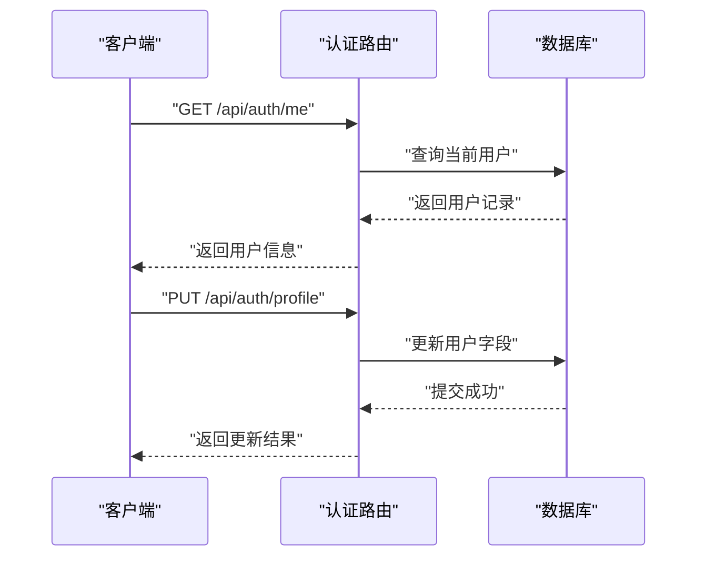
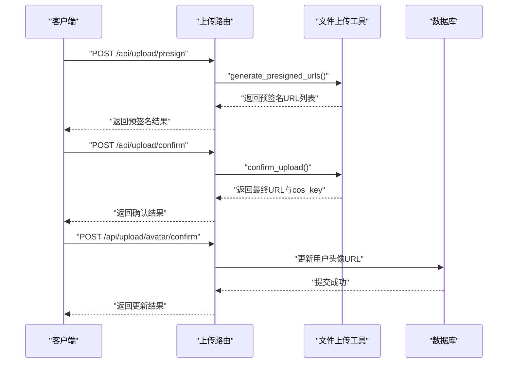
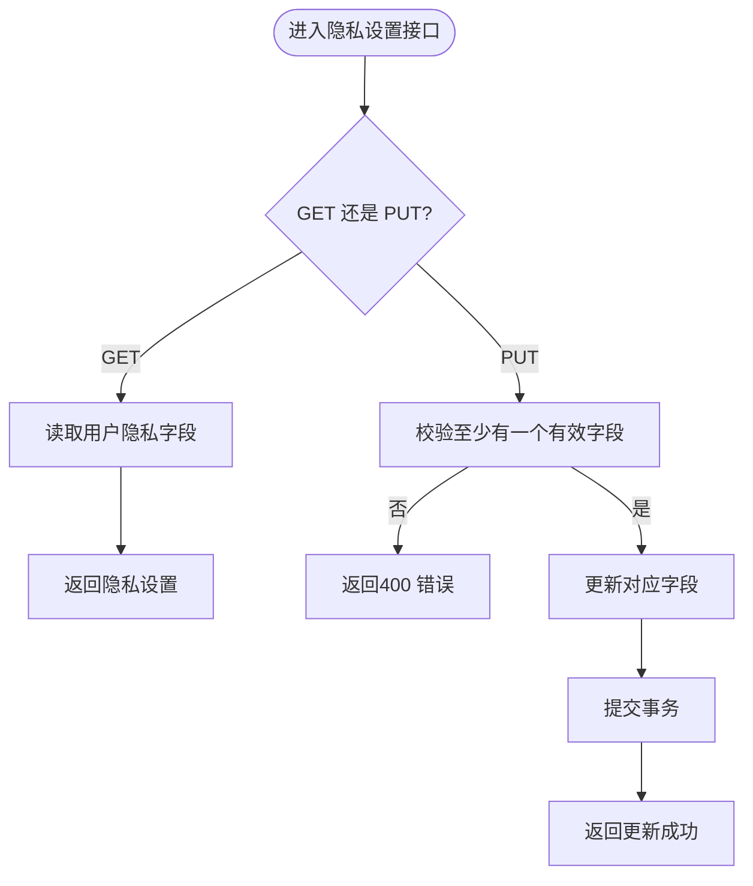
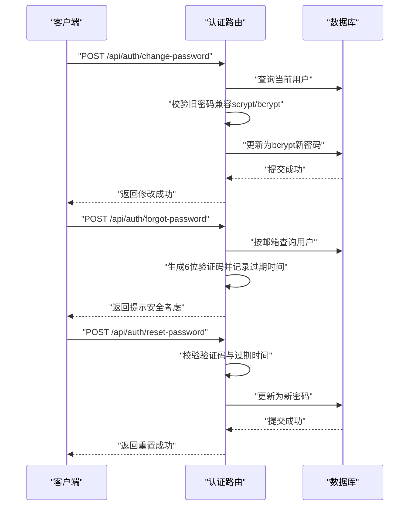
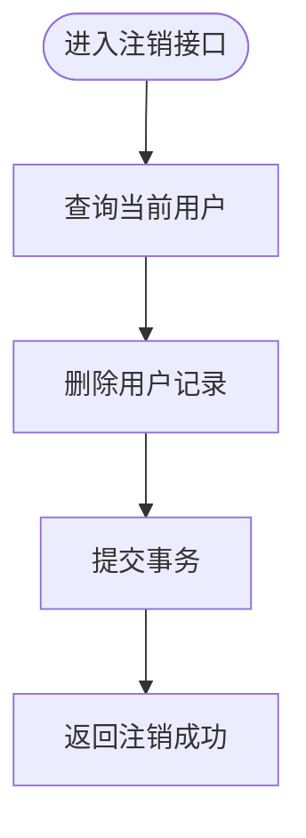
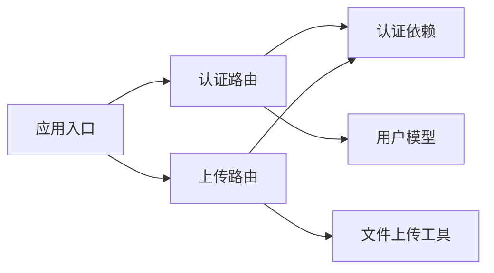

# 用户管理API

<cite>
**本文引用的文件**
- [app/main.py](file://app/main.py)
- [app/routers/auth.py](file://app/routers/auth.py)
- [app/routers/upload.py](file://app/routers/upload.py)
- [app/models/models.py](file://app/models/models.py)
- [app/dependencies.py](file://app/dependencies.py)
- [app/utils.py](file://app/utils.py)
- [app/core/config.py](file://app/core/config.py)
</cite>

## 目录
1. [简介](#简介)
2. [项目结构](#项目结构)
3. [核心组件](#核心组件)
4. [架构总览](#架构总览)
5. [详细组件分析](#详细组件分析)
6. [依赖分析](#依赖分析)
7. [性能考量](#性能考量)
8. [故障排查指南](#故障排查指南)
9. [结论](#结论)
10. [附录](#附录)

## 简介
本文件面向用户管理API，覆盖以下能力：
- 用户资料查看与编辑
- 头像与封面上传（含预签名直传与确认）
- 隐私设置管理
- 密码修改与忘记/重置密码流程
- 账号注销
- 权限控制与数据安全要点

所有接口均基于HTTP协议，采用JSON作为请求与响应格式；认证通过JWT Bearer Token实现，需在请求头携带Authorization: Bearer <token>。

## 项目结构
用户管理相关模块分布如下：
- 应用入口与路由挂载：app/main.py
- 认证与用户管理路由：app/routers/auth.py
- 上传与媒体资源处理：app/routers/upload.py
- 数据模型与隐私字段：app/models/models.py
- 认证依赖与权限校验：app/dependencies.py
- 云存储封装（COS）：app/utils.py
- 配置项（数据库、JWT、COS等）：app/core/config.py

图表来源
- [app/main.py:69-84](file://app/main.py#L69-L84)
- [app/routers/auth.py:25](file://app/routers/auth.py#L25)
- [app/routers/upload.py:16](file://app/routers/upload.py#L16)
- [app/models/models.py:42-98](file://app/models/models.py#L42-L98)
- [app/dependencies.py:16-50](file://app/dependencies.py#L16-L50)
- [app/utils.py:14-220](file://app/utils.py#L14-L220)
- [app/core/config.py:7-43](file://app/core/config.py#L7-L43)

章节来源
- [app/main.py:69-84](file://app/main.py#L69-L84)
- [app/routers/auth.py:25](file://app/routers/auth.py#L25)
- [app/routers/upload.py:16](file://app/routers/upload.py#L16)
- [app/models/models.py:42-98](file://app/models/models.py#L42-L98)
- [app/dependencies.py:16-50](file://app/dependencies.py#L16-L50)
- [app/utils.py:14-220](file://app/utils.py#L14-L220)
- [app/core/config.py:7-43](file://app/core/config.py#L7-L43)

## 核心组件
- 认证路由（/api/auth）
  - 提供注册、登录、刷新Token、忘记密码、重置密码、当前用户资料、他人公开资料、修改资料、修改密码、隐私设置、注销账号等接口。
- 上传路由（/api/upload）
  - 提供预签名URL生成、上传确认、头像/封面确认更新、删除文件、文件信息查询等接口。
- 数据模型（User）
  - 包含用户基本信息、隐私字段、通知偏好等；隐私字段用于控制资料可见性与搜索行为。
- 认证依赖
  - get_current_user：强制认证，解析JWT并加载当前用户
  - get_optional_user：可选认证，用于公开信息读取场景
- 云存储工具
  - FileUploader：封装COS预签名生成、复制重命名、删除、信息查询等操作

章节来源
- [app/routers/auth.py:184-486](file://app/routers/auth.py#L184-L486)
- [app/routers/upload.py:50-224](file://app/routers/upload.py#L50-L224)
- [app/models/models.py:42-98](file://app/models/models.py#L42-L98)
- [app/dependencies.py:16-50](file://app/dependencies.py#L16-L50)
- [app/utils.py:14-220](file://app/utils.py#L14-L220)

## 架构总览
用户管理API遵循“路由-依赖-模型-存储”的分层设计：
- 路由层负责HTTP接口定义与参数校验（Pydantic Schema）
- 依赖层负责认证与权限校验（JWT解码、数据库查询）
- 模型层负责数据持久化与关系映射
- 存储层负责文件直传与对象存储交互

图表来源
- [app/routers/auth.py:184-212](file://app/routers/auth.py#L184-L212)
- [app/routers/upload.py:50-107](file://app/routers/upload.py#L50-L107)
- [app/routers/upload.py:131-152](file://app/routers/upload.py#L131-L152)
- [app/models/models.py:42-98](file://app/models/models.py#L42-L98)
- [app/utils.py:37-77](file://app/utils.py#L37-L77)

## 详细组件分析

### 用户资料查看与编辑
- 接口概览
  - GET /api/auth/me 或 /api/auth/profile：获取当前登录用户资料
  - GET /api/auth/users/{user_id}：获取指定用户公开资料（可选认证）
  - PUT /api/auth/profile：修改当前用户资料（display_name、bio、avatar_url、cover_photo_url）

- 请求与响应
  - 认证：需要Bearer Token
  - 请求体（修改资料）：ProfileUpdateRequest（可选字段）
  - 响应体：包含用户信息字段（见下方“数据结构”）

- 处理逻辑
  - 当前用户资料：通过依赖get_current_user解析JWT并查询数据库
  - 公开资料：通过get_optional_user可选认证，返回公开字段集合
  - 修改资料：仅更新传入的非空字段，提交事务并返回结果

图表来源
- [app/routers/auth.py:253-262](file://app/routers/auth.py#L253-L262)
- [app/routers/auth.py:269-292](file://app/routers/auth.py#L269-L292)
- [app/routers/auth.py:327-337](file://app/routers/auth.py#L327-L337)
- [app/dependencies.py:16-36](file://app/dependencies.py#L16-L36)

章节来源
- [app/routers/auth.py:253-262](file://app/routers/auth.py#L253-L262)
- [app/routers/auth.py:269-292](file://app/routers/auth.py#L269-L292)
- [app/routers/auth.py:327-337](file://app/routers/auth.py#L327-L337)
- [app/dependencies.py:16-36](file://app/dependencies.py#L16-L36)

### 头像与封面上传
- 接口概览
  - POST /api/upload/presign：生成客户端直传COS的预签名URL（支持批量）
  - POST /api/upload/confirm：确认上传并重命名临时文件
  - POST /api/upload/avatar/confirm：确认头像上传并更新用户头像URL
  - POST /api/upload/cover/confirm：确认封面上传并更新用户封面URL
  - POST /api/upload/delete：删除COS文件
  - GET /api/upload/info：查询文件信息
  - GET /api/upload/uploads/{filename}：兼容旧URL重定向

- 请求与响应
  - 预签名：请求体包含filename、file_type、upload_type；响应包含presigned_url、public_url、cos_key、content_type等
  - 确认上传：请求体包含cos_key、final_filename；响应包含最终URL与cos_key
  - 头像/封面确认：请求体包含url；响应包含更新后的url

- 处理逻辑
  - 预签名：根据upload_type与user_id生成子目录，推断content_type，生成1~20个预签名URL
  - 确认上传：复制临时文件为正式文件并删除临时文件
  - 头像/封面确认：更新用户记录中的对应字段并提交事务

图表来源
- [app/routers/upload.py:50-107](file://app/routers/upload.py#L50-L107)
- [app/routers/upload.py:110-129](file://app/routers/upload.py#L110-L129)
- [app/routers/upload.py:131-152](file://app/routers/upload.py#L131-L152)
- [app/utils.py:37-77](file://app/utils.py#L37-L77)
- [app/utils.py:80-120](file://app/utils.py#L80-L120)

章节来源
- [app/routers/upload.py:50-107](file://app/routers/upload.py#L50-L107)
- [app/routers/upload.py:110-129](file://app/routers/upload.py#L110-L129)
- [app/routers/upload.py:131-152](file://app/routers/upload.py#L131-L152)
- [app/utils.py:37-77](file://app/utils.py#L37-L77)
- [app/utils.py:80-120](file://app/utils.py#L80-L120)

### 隐私设置
- 接口概览
  - GET /api/auth/privacy：获取当前用户隐私设置
  - PUT /api/auth/privacy：更新隐私设置（可部分更新）

- 隐私字段
  - profile_visibility：个人资料可见性（默认public）
  - post_default_visibility：帖子默认可见性（默认public）
  - show_email：是否显示邮箱（默认False）
  - allow_search：是否允许被搜索（默认True）
  - allow_friend_requests：是否允许好友申请（默认everyone）
  - notify_push/notify_message/notify_sound：通知偏好（默认True）

- 处理逻辑
  - GET：返回用户隐私字段的当前值（若为空则使用默认值）
  - PUT：仅对传入的非空字段进行更新，至少需要一个有效字段，提交事务并返回结果

图表来源
- [app/routers/auth.py:415-428](file://app/routers/auth.py#L415-L428)
- [app/routers/auth.py:431-458](file://app/routers/auth.py#L431-L458)
- [app/models/models.py:58-68](file://app/models/models.py#L58-L68)

章节来源
- [app/routers/auth.py:415-428](file://app/routers/auth.py#L415-L428)
- [app/routers/auth.py:431-458](file://app/routers/auth.py#L431-L458)
- [app/models/models.py:58-68](file://app/models/models.py#L58-L68)

### 密码管理
- 接口概览
  - POST /api/auth/change-password：修改当前用户密码
  - POST /api/auth/forgot-password：忘记密码（生成6位验证码，实际应发邮件）
  - POST /api/auth/reset-password：使用验证码重置密码

- 处理逻辑
  - 修改密码：兼容旧版scrypt与新版bcrypt哈希格式，验证旧密码后更新为bcrypt新哈希
  - 忘记密码：按邮箱查找用户，生成6位验证码并记录过期时间，返回提示（安全考虑：无论邮箱是否存在均提示）
  - 重置密码：校验验证码与过期时间，更新为新密码并删除验证码

图表来源
- [app/routers/auth.py:298-321](file://app/routers/auth.py#L298-L321)
- [app/routers/auth.py:365-382](file://app/routers/auth.py#L365-L382)
- [app/routers/auth.py:388-409](file://app/routers/auth.py#L388-L409)

章节来源
- [app/routers/auth.py:298-321](file://app/routers/auth.py#L298-L321)
- [app/routers/auth.py:365-382](file://app/routers/auth.py#L365-L382)
- [app/routers/auth.py:388-409](file://app/routers/auth.py#L388-L409)

### 账号注销
- 接口概览
  - DELETE /api/auth/account：注销当前用户账号及关联数据

- 处理逻辑
  - 查询当前用户并删除，提交事务后返回成功

图表来源
- [app/routers/auth.py:344-358](file://app/routers/auth.py#L344-L358)

章节来源
- [app/routers/auth.py:344-358](file://app/routers/auth.py#L344-L358)

### 数据结构与字段说明
- 用户信息（响应）
  - id：整数，用户唯一标识
  - username：字符串，用户名
  - email：字符串，邮箱
  - display_name：字符串或null，展示名称（默认与username一致）
  - bio：字符串或null，个人简介
  - avatar_url：字符串或null，头像URL
  - cover_photo_url：字符串或null，封面URL
  - created_at：字符串或null，ISO格式创建时间

- 公开用户信息（响应）
  - id、username、display_name、bio、avatar_url、cover_photo_url、created_at

- 修改资料请求
  - display_name、bio、avatar_url、cover_photo_url（均为可选）

- 隐私设置（响应/请求）
  - profile_visibility、post_default_visibility、show_email、allow_search、allow_friend_requests、notify_push、notify_message、notify_sound

- 上传相关
  - 预签名响应包含：presigned_url、public_url、cos_key、content_type、items（批量）

章节来源
- [app/routers/auth.py:93-111](file://app/routers/auth.py#L93-L111)
- [app/routers/auth.py:114-118](file://app/routers/auth.py#L114-L118)
- [app/routers/auth.py:135-148](file://app/routers/auth.py#L135-L148)
- [app/routers/upload.py:100-107](file://app/routers/upload.py#L100-L107)
- [app/models/models.py:42-98](file://app/models/models.py#L42-L98)

### 权限控制与安全
- 认证
  - 所有受保护接口均要求Authorization: Bearer <token>
  - get_current_user：强制认证，解析JWT并查询用户
  - get_optional_user：可选认证，用于公开信息读取

- 密码安全
  - 旧版scrypt与新版bcrypt兼容校验
  - 新密码统一使用bcrypt哈希存储

- 上传安全
  - 客户端通过预签名URL直传COS，服务端仅在确认阶段重命名与更新URL
  - 限制批量预签名数量（1~20），防止滥用

- 隐私与可见性
  - 隐私字段控制资料可见性、搜索与好友申请策略
  - 公开资料接口对未登录用户开放

章节来源
- [app/dependencies.py:16-36](file://app/dependencies.py#L16-L36)
- [app/dependencies.py:39-50](file://app/dependencies.py#L39-L50)
- [app/routers/auth.py:307-312](file://app/routers/auth.py#L307-L312)
- [app/routers/upload.py:79-80](file://app/routers/upload.py#L79-L80)
- [app/routers/auth.py:415-428](file://app/routers/auth.py#L415-L428)
- [app/routers/auth.py:327-337](file://app/routers/auth.py#L327-L337)

## 依赖分析
- 组件耦合
  - 认证路由依赖数据库模型与认证依赖
  - 上传路由依赖文件上传工具与认证依赖
  - 应用入口集中挂载路由并注入依赖

- 外部依赖
  - JWT：用于认证与授权
  - SQLAlchemy：ORM与数据库访问
  - Tencent Cloud COS SDK：对象存储直传与管理

图表来源
- [app/routers/auth.py:18-22](file://app/routers/auth.py#L18-L22)
- [app/routers/upload.py:9-13](file://app/routers/upload.py#L9-L13)
- [app/main.py:69-84](file://app/main.py#L69-L84)

章节来源
- [app/routers/auth.py:18-22](file://app/routers/auth.py#L18-L22)
- [app/routers/upload.py:9-13](file://app/routers/upload.py#L9-L13)
- [app/main.py:69-84](file://app/main.py#L69-L84)

## 性能考量
- 数据库连接池
  - 配置了连接池大小与回收策略，减少连接开销
- 上传直传
  - 使用预签名URL让客户端直传COS，降低服务端带宽压力
- 批量预签名限制
  - 控制一次最多生成20个预签名URL，避免资源滥用
- 日志与监控
  - 应用启动与关闭日志，便于问题定位

章节来源
- [app/core/config.py:20-21](file://app/core/config.py#L20-L21)
- [app/routers/upload.py:79-80](file://app/routers/upload.py#L79-L80)
- [app/main.py:17-26](file://app/main.py#L17-L26)

## 故障排查指南
- 认证失败
  - 检查Authorization头是否为Bearer Token
  - 确认JWT密钥配置正确
  - 核实用户是否存在且未被禁用

- 上传失败
  - 确认COS配置（ID、KEY、区域、Bucket、Domain）正确
  - 检查预签名URL是否过期
  - 确认确认上传时cos_key与final_filename正确

- 隐私设置更新失败
  - 确保至少传入一个有效字段
  - 检查字段类型与枚举值是否符合预期

- 密码修改失败
  - 确认旧密码正确（兼容旧哈希格式）
  - 检查新密码长度与复杂度要求

章节来源
- [app/dependencies.py:20-36](file://app/dependencies.py#L20-L36)
- [app/routers/upload.py:82-96](file://app/routers/upload.py#L82-L96)
- [app/routers/auth.py:451-452](file://app/routers/auth.py#L451-L452)
- [app/routers/auth.py:307-312](file://app/routers/auth.py#L307-L312)

## 结论
本用户管理API以清晰的路由分层、完善的认证与隐私控制、以及高效的直传上传机制，提供了完整的用户资料管理能力。建议在生产环境中：
- 强制HTTPS与安全头配置
- 完善邮件验证码流程（当前为简化实现）
- 加强上传内容审核与配额限制
- 定期轮换JWT密钥并监控异常登录

## 附录
- 接口清单（按功能分类）
  - 认证与账户
    - POST /api/auth/register
    - POST /api/auth/login
    - POST /api/auth/refresh
    - POST /api/auth/change-password
    - POST /api/auth/forgot-password
    - POST /api/auth/reset-password
    - DELETE /api/auth/account
  - 资料与隐私
    - GET /api/auth/me
    - GET /api/auth/profile
    - PUT /api/auth/profile
    - GET /api/auth/users/{user_id}
    - GET /api/auth/privacy
    - PUT /api/auth/privacy
  - 上传与媒体
    - POST /api/upload/presign
    - POST /api/upload/confirm
    - POST /api/upload/avatar/confirm
    - POST /api/upload/cover/confirm
    - POST /api/upload/delete
    - GET /api/upload/info
    - GET /api/upload/uploads/{filename}

- 请求与响应示例（路径参考）
  - 注册请求体：[RegisterRequest:36-66](file://app/routers/auth.py#L36-L66)
  - 登录请求体：[LoginRequest:68-76](file://app/routers/auth.py#L68-L76)
  - 修改资料请求体：[ProfileUpdateRequest:114-118](file://app/routers/auth.py#L114-L118)
  - 修改密码请求体：[ChangePasswordRequest:121-124](file://app/routers/auth.py#L121-L124)
  - 忘记密码请求体：[ForgotPasswordRequest:126-128](file://app/routers/auth.py#L126-L128)
  - 重置密码请求体：[ResetPasswordRequest:130-133](file://app/routers/auth.py#L130-L133)
  - 隐私设置请求体：[PrivacySettingsUpdateRequest:143-148](file://app/routers/auth.py#L143-L148)
  - 预签名请求体：[presign_upload:51-62](file://app/routers/upload.py#L51-L62)
  - 确认上传请求体：[confirm_upload:111-113](file://app/routers/upload.py#L111-L113)
  - 头像/封面确认请求体：[confirm_avatar/confirm_cover:132-141](file://app/routers/upload.py#L132-L141)