# 社交互动API

<cite>
**本文档引用的文件**
- [app/main.py](file://app/main.py)
- [app/routers/friends.py](file://app/routers/friends.py)
- [app/routers/interactions.py](file://app/routers/interactions.py)
- [app/routers/blocks.py](file://app/routers/blocks.py)
- [app/routers/chat.py](file://app/routers/chat.py)
- [app/routers/auth.py](file://app/routers/auth.py)
- [app/models/models.py](file://app/models/models.py)
- [app/services/notification_service.py](file://app/services/notification_service.py)
- [app/ws_manager.py](file://app/ws_manager.py)
- [requirements.txt](file://requirements.txt)
- [openapi.json](file://openapi.json)
</cite>

## 目录
1. [简介](#简介)
2. [项目结构](#项目结构)
3. [核心组件](#核心组件)
4. [架构概览](#架构概览)
5. [详细组件分析](#详细组件分析)
6. [依赖分析](#依赖分析)
7. [性能考虑](#性能考虑)
8. [故障排除指南](#故障排除指南)
9. [结论](#结论)
10. [附录](#附录)

## 简介

NanTuPy 是一个基于 FastAPI 构建的社交平台后端系统，专注于提供完整的社交互动功能。该系统实现了好友关系管理、互动行为处理、隐私设置控制以及实时通信等核心功能。

本项目采用现代化的架构设计，使用 SQLAlchemy 2.0+ 进行数据库操作，支持异步处理和实时通信。系统提供了 RESTful API 和 WebSocket 两种通信方式，确保用户能够获得流畅的社交体验。

## 项目结构

项目采用模块化的目录结构，按照功能领域进行组织：

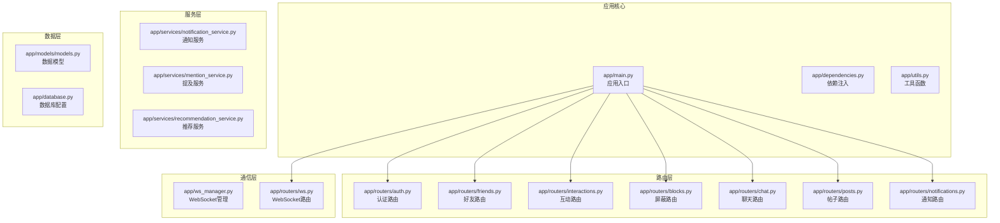

**图表来源**
- [app/main.py:1-110](file://app/main.py#L1-L110)
- [app/routers/friends.py:1-385](file://app/routers/friends.py#L1-L385)
- [app/routers/interactions.py:1-433](file://app/routers/interactions.py#L1-L433)

**章节来源**
- [app/main.py:1-110](file://app/main.py#L1-L110)

## 核心组件

### 数据模型架构

系统的核心数据模型围绕用户社交关系构建，主要包括以下关键实体：

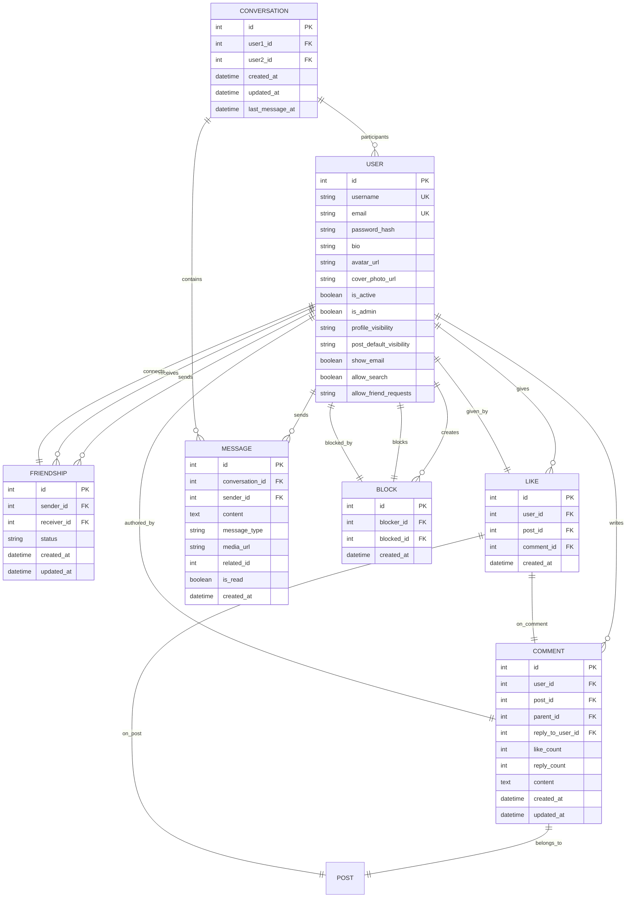

**图表来源**
- [app/models/models.py:42-444](file://app/models/models.py#L42-L444)

### WebSocket 通信架构

系统实现了完整的 WebSocket 通信机制，支持实时消息推送和状态同步：

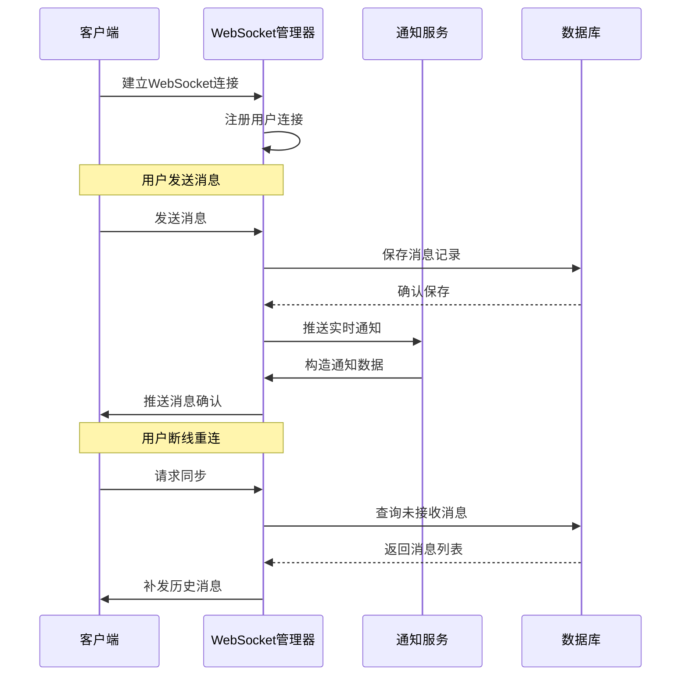

**图表来源**
- [app/ws_manager.py:20-308](file://app/ws_manager.py#L20-L308)
- [app/services/notification_service.py:14-233](file://app/services/notification_service.py#L14-L233)

**章节来源**
- [app/models/models.py:1-655](file://app/models/models.py#L1-L655)
- [app/ws_manager.py:1-308](file://app/ws_manager.py#L1-L308)

## 架构概览

### 系统架构图

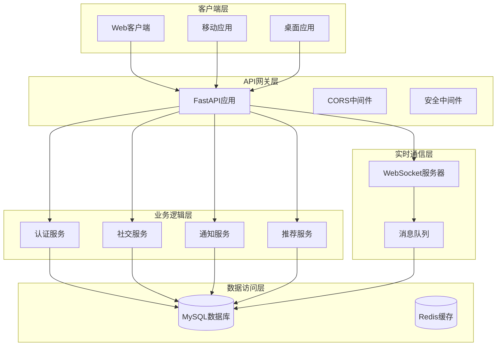

**图表来源**
- [app/main.py:29-84](file://app/main.py#L29-L84)

### API 路由架构

系统采用模块化路由设计，每个功能域都有独立的路由模块：

```mermaid
graph LR
subgraph "认证路由 (/api/auth)"
AUTH_LOGIN[POST /login<br/>用户登录]
AUTH_REGISTER[POST /register<br/>用户注册]
AUTH_PRIVACY[GET/PUT /privacy<br/>隐私设置]
AUTH_REFRESH[POST /refresh<br/>Token刷新]
end
subgraph "好友路由 (/api/friends)"
FRIEND_REQUEST[POST /request<br/>发送好友请求]
FRIEND_ACCEPT[POST /request/{id}/accept<br/>接受好友请求]
FRIEND_REJECT[POST /request/{id}/reject<br/>拒绝好友请求]
FRIEND_CANCEL[DELETE /request/{id}<br/>取消好友请求]
FRIEND_LIST[GET /<br/>获取好友列表]
FRIEND_STATUS[GET /status/{user_id}<br/>检查关系状态]
end
subgraph "互动路由 (/api)"
LIKE_POST[POST /posts/{id}/like<br/>点赞帖子]
UNLIKE_POST[DELETE /posts/{id}/like<br/>取消点赞]
LIKE_COMMENT[POST /comments/{id}/like<br/>点赞评论]
COMMENT_CREATE[POST /posts/{id}/comments<br/>创建评论]
COMMENT_GET[GET /posts/{id}/comments<br/>获取评论列表]
end
subgraph "屏蔽路由 (/api/blocks)"
BLOCK_USER[POST /<br/>屏蔽用户]
UNBLOCK_USER[DELETE /{user_id}<br/>取消屏蔽]
BLOCK_LIST[GET /<br/>获取屏蔽列表]
CHECK_BLOCK[GET /check/{user_id}<br/>检查屏蔽状态]
end
subgraph "聊天路由 (/api/chat)"
SESSION_LIST[GET /sessions<br/>会话列表]
MESSAGE_SEND[POST /conversations/{id}/messages<br/>发送消息]
MESSAGE_HISTORY[GET /messages/{conversation_id}<br/>消息历史]
MARK_READ[POST /conversations/{id}/mark-read<br/>标记已读]
end
```

**图表来源**
- [app/main.py:69-84](file://app/main.py#L69-L84)
- [app/routers/friends.py:19-385](file://app/routers/friends.py#L19-L385)
- [app/routers/interactions.py:54-433](file://app/routers/interactions.py#L54-L433)

**章节来源**
- [app/main.py:1-110](file://app/main.py#L1-L110)

## 详细组件分析

### 好友关系管理系统

#### 核心功能模块

好友关系管理系统提供了完整的好友生命周期管理：

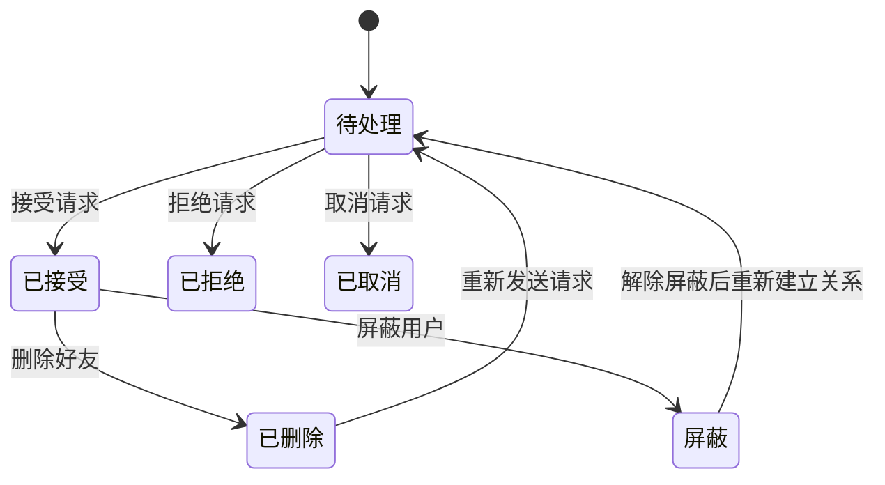

**图表来源**
- [app/routers/friends.py:19-385](file://app/routers/friends.py#L19-L385)

#### 好友请求流程

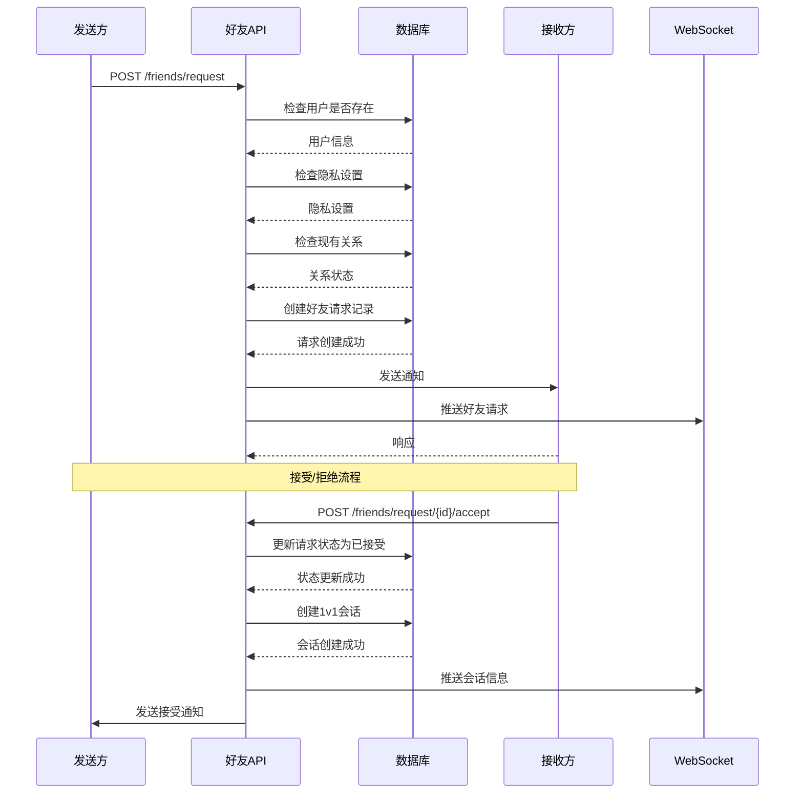

**图表来源**
- [app/routers/friends.py:19-182](file://app/routers/friends.py#L19-L182)
- [app/services/notification_service.py:144-184](file://app/services/notification_service.py#L144-L184)

#### 隐私控制机制

系统支持多种隐私控制选项：

| 隐私设置 | 可见性范围 | 默认值 | 影响范围 |
|---------|-----------|--------|----------|
| profile_visibility | 公开/好友/私密 | public | 个人资料可见性 |
| post_default_visibility | 公开/好友/私密/自定义 | public | 帖子默认可见性 |
| show_email | 开启/关闭 | false | 邮箱显示控制 |
| allow_search | 允许/仅好友/禁止 | true | 搜索可见性 |
| allow_friend_requests | 全体/好友的好友/禁止 | everyone | 好友请求接收 |

**章节来源**
- [app/routers/friends.py:19-385](file://app/routers/friends.py#L19-L385)
- [app/routers/auth.py:415-458](file://app/routers/auth.py#L415-L458)

### 互动行为处理系统

#### 点赞功能

点赞系统支持对帖子和评论的不同处理：

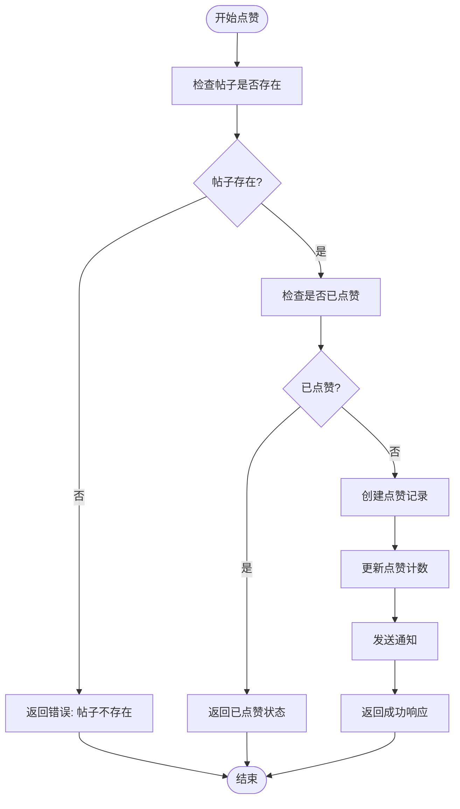

**图表来源**
- [app/routers/interactions.py:54-99](file://app/routers/interactions.py#L54-L99)

#### 评论系统

评论系统支持多级回复和内容审核：

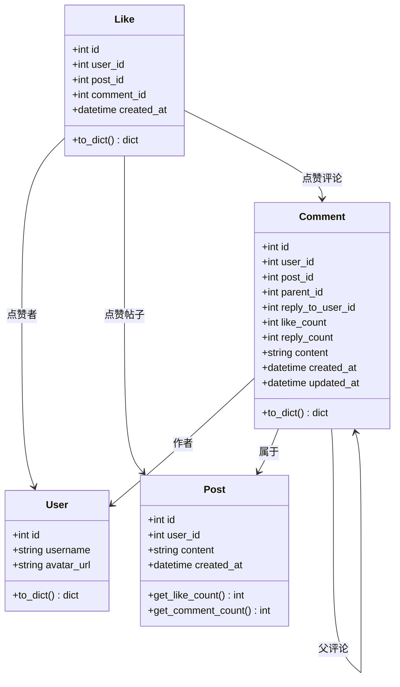

**图表来源**
- [app/models/models.py:187-232](file://app/models/models.py#L187-L232)
- [app/models/models.py:234-259](file://app/models/models.py#L234-L259)

**章节来源**
- [app/routers/interactions.py:175-433](file://app/routers/interactions.py#L175-L433)
- [app/models/models.py:187-259](file://app/models/models.py#L187-L259)

### 屏蔽管理功能

屏蔽系统提供了用户间的隔离机制：

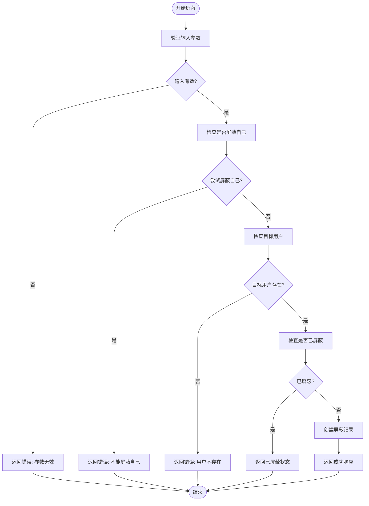

**图表来源**
- [app/routers/blocks.py:14-67](file://app/routers/blocks.py#L14-L67)

**章节来源**
- [app/routers/blocks.py:1-101](file://app/routers/blocks.py#L1-L101)

### 实时聊天系统

#### 会话管理

聊天系统支持一对一会话和消息历史管理：

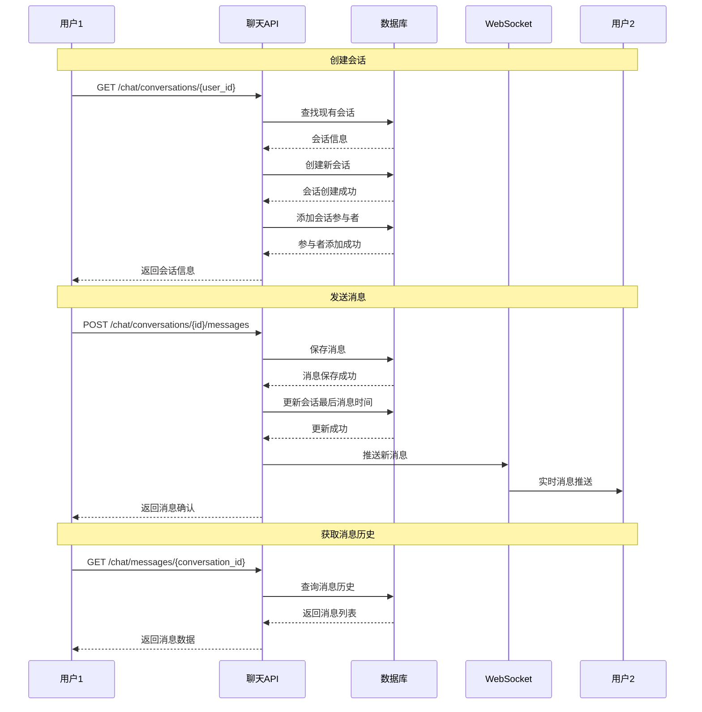

**图表来源**
- [app/routers/chat.py:234-429](file://app/routers/chat.py#L234-L429)
- [app/ws_manager.py:74-106](file://app/ws_manager.py#L74-L106)

#### 未读消息跟踪

系统实现了精确的未读消息跟踪机制：

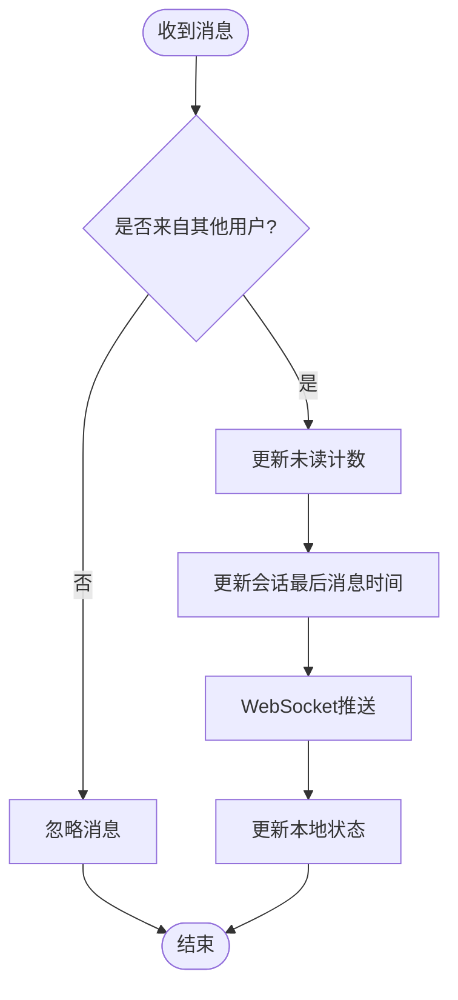

**图表来源**
- [app/routers/chat.py:351-429](file://app/routers/chat.py#L351-L429)

**章节来源**
- [app/routers/chat.py:1-538](file://app/routers/chat.py#L1-L538)
- [app/ws_manager.py:1-308](file://app/ws_manager.py#L1-L308)

## 依赖分析

### 技术栈依赖

系统采用现代化的技术栈，确保高性能和可维护性：

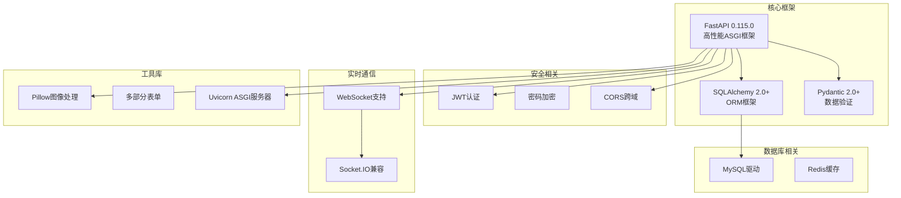

**图表来源**
- [requirements.txt:1-15](file://requirements.txt#L1-L15)

### 外部依赖关系

系统对外部依赖的管理遵循最小化原则：

| 依赖包 | 版本要求 | 用途 | 重要性 |
|--------|----------|------|--------|
| fastapi | 0.115.0 | 主框架 | 核心 |
| uvicorn | 0.30.0 | ASGI服务器 | 核心 |
| sqlalchemy | >=2.0.50 | ORM框架 | 核心 |
| python-jose | 3.3.0 | JWT处理 | 安全 |
| passlib[bcrypt] | 1.7.4 | 密码哈希 | 安全 |
| python-socketio | 5.10.0 | WebSocket支持 | 实时通信 |
| pillow | >=10.2.0 | 图像处理 | 功能 |

**章节来源**
- [requirements.txt:1-15](file://requirements.txt#L1-L15)

## 性能考虑

### 数据库优化策略

系统采用了多项数据库优化技术：

1. **索引优化**: 关键查询字段建立了适当的索引
2. **批量操作**: 评论列表采用批量查询减少数据库往返
3. **连接池**: 使用 SQLAlchemy 连接池管理数据库连接
4. **事务管理**: 合理的事务边界确保数据一致性

### 缓存策略

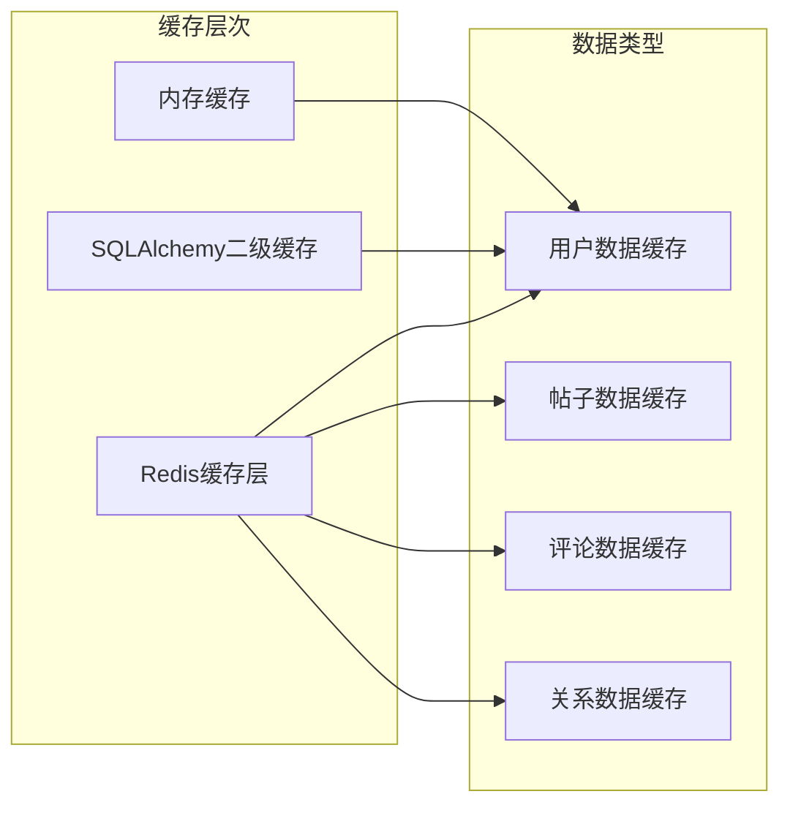

### 异步处理

系统充分利用异步特性提升性能：

- **WebSocket异步推送**: 使用 asyncio 确保实时通信
- **通知异步处理**: 通知服务采用异步队列处理
- **文件上传异步**: 图像处理和存储异步执行

## 故障排除指南

### 常见问题诊断

#### 数据库连接问题

**症状**: API调用时出现数据库连接错误

**解决方案**:
1. 检查数据库连接字符串配置
2. 验证数据库服务状态
3. 检查连接池配置
4. 查看数据库日志

#### WebSocket连接问题

**症状**: 用户无法接收实时消息

**解决方案**:
1. 检查WebSocket服务器状态
2. 验证客户端连接参数
3. 检查防火墙设置
4. 查看WebSocket日志

#### 权限验证问题

**症状**: 用户无法访问受保护资源

**解决方案**:
1. 验证JWT令牌有效性
2. 检查用户权限级别
3. 验证API端点权限
4. 查看认证日志

### 错误代码参考

| 错误代码 | 描述 | 可能原因 | 解决方案 |
|----------|------|----------|----------|
| 400 | 请求参数错误 | 缺少必要参数 | 验证请求格式 |
| 401 | 未授权 | 令牌无效或过期 | 重新登录 |
| 403 | 禁止访问 | 权限不足 | 检查用户权限 |
| 404 | 资源不存在 | ID错误或数据被删除 | 验证资源状态 |
| 500 | 服务器内部错误 | 代码异常或数据库错误 | 查看服务器日志 |

**章节来源**
- [app/routers/friends.py:31-73](file://app/routers/friends.py#L31-L73)
- [app/routers/interactions.py:61-98](file://app/routers/interactions.py#L61-L98)

## 结论

NanTuPy 社交互动API系统提供了完整的社交网络功能实现，具有以下特点：

### 技术优势
- **现代化架构**: 基于 FastAPI 和 SQLAlchemy 2.0+ 的现代技术栈
- **高性能设计**: 异步处理和连接池优化确保高并发性能
- **实时通信**: 完整的 WebSocket 支持实现实时社交体验
- **安全性**: 多层安全防护包括 JWT 认证、权限控制和数据验证

### 功能完整性
- **社交关系管理**: 完整的好友生命周期管理
- **互动行为**: 点赞、评论、分享等社交互动功能
- **隐私控制**: 细粒度的隐私设置和访问控制
- **实时通信**: 会话管理和消息推送系统

### 扩展性
- **模块化设计**: 清晰的功能模块划分便于扩展
- **插件架构**: 支持第三方服务集成
- **API标准化**: 符合 RESTful 设计原则

该系统为企业级社交应用提供了坚实的技术基础，具备良好的可维护性和扩展性。

## 附录

### API 使用示例

#### 好友关系操作

```bash
# 发送好友请求
curl -X POST "/api/friends/request" \
  -H "Authorization: Bearer YOUR_TOKEN" \
  -H "Content-Type: application/json" \
  -d '{"receiver_id": 123}'

# 接受好友请求
curl -X POST "/api/friends/request/456/accept" \
  -H "Authorization: Bearer YOUR_TOKEN"

# 获取好友列表
curl -X GET "/api/friends/" \
  -H "Authorization: Bearer YOUR_TOKEN"
```

#### 互动行为操作

```bash
# 点赞帖子
curl -X POST "/api/posts/789/like" \
  -H "Authorization: Bearer YOUR_TOKEN"

# 创建评论
curl -X POST "/api/posts/789/comments" \
  -H "Authorization: Bearer YOUR_TOKEN" \
  -H "Content-Type: application/json" \
  -d '{"content": "这是一个很好的帖子!", "parent_id": null}'
```

#### 隐私设置管理

```bash
# 获取隐私设置
curl -X GET "/api/auth/privacy" \
  -H "Authorization: Bearer YOUR_TOKEN"

# 更新隐私设置
curl -X PUT "/api/auth/privacy" \
  -H "Authorization: Bearer YOUR_TOKEN" \
  -H "Content-Type: application/json" \
  -d '{"allow_friend_requests": "friends_of_friends"}'
```

### 部署建议

1. **环境配置**: 使用 Docker 容器化部署
2. **数据库**: 生产环境使用 MySQL 8.0+
3. **缓存**: Redis 集群部署
4. **负载均衡**: Nginx + 多实例部署
5. **监控**: Prometheus + Grafana 监控系统