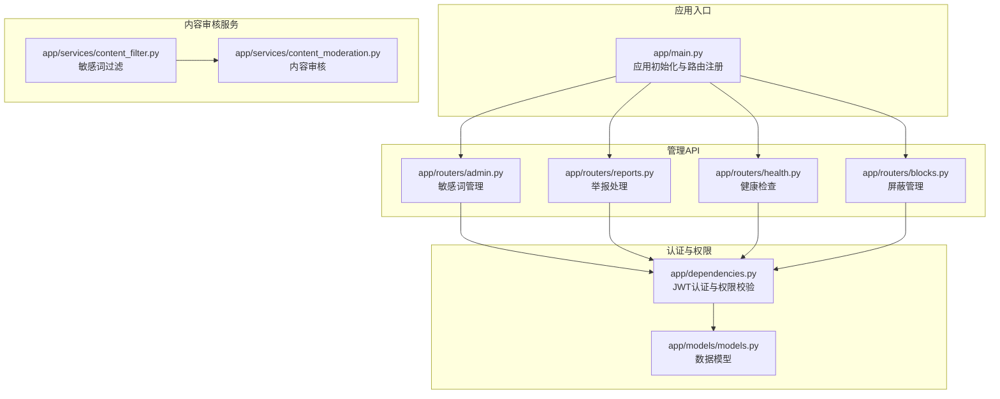
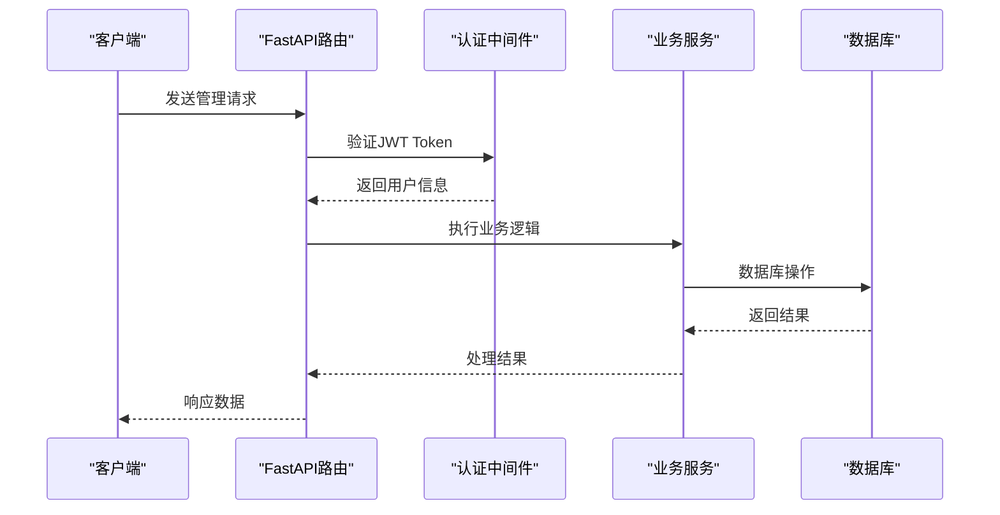
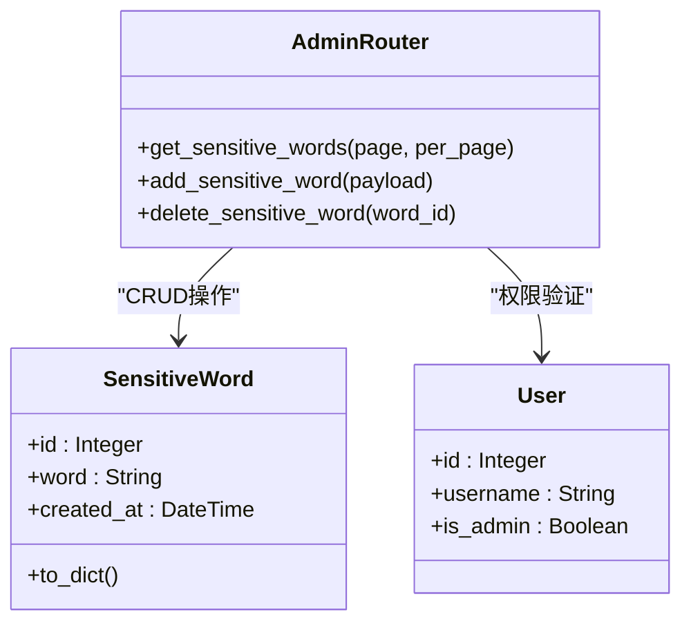
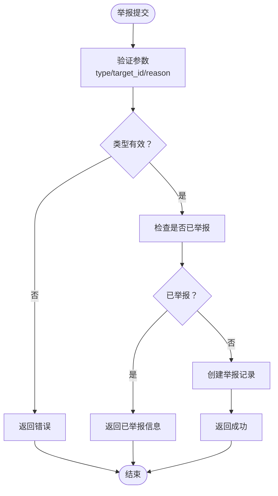
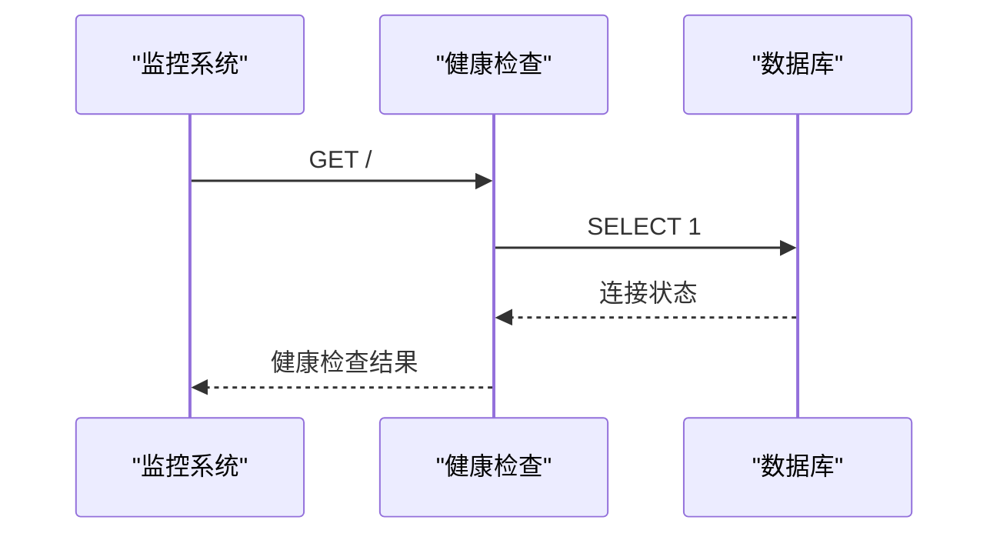
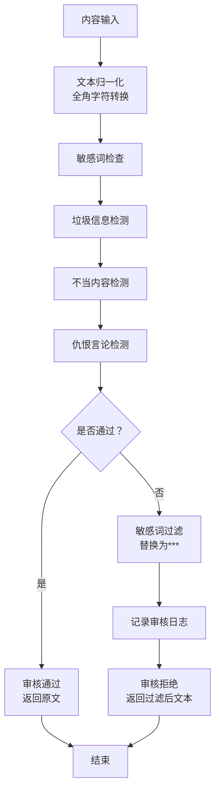
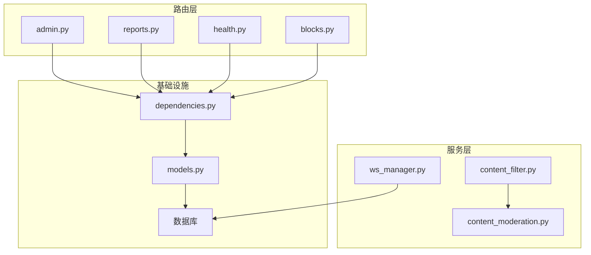

# 系统管理API

<cite>
**本文档引用的文件**
- [app/main.py](file://app/main.py)
- [app/routers/admin.py](file://app/routers/admin.py)
- [app/routers/reports.py](file://app/routers/reports.py)
- [app/routers/health.py](file://app/routers/health.py)
- [app/routers/blocks.py](file://app/routers/blocks.py)
- [app/dependencies.py](file://app/dependencies.py)
- [app/models/models.py](file://app/models/models.py)
- [app/services/content_moderation.py](file://app/services/content_moderation.py)
- [app/services/content_filter.py](file://app/services/content_filter.py)
- [app/ws_manager.py](file://app/ws_manager.py)
- [migrations/add_ws_protocol_tables.sql](file://migrations/add_ws_protocol_tables.sql)
- [openapi.json](file://openapi.json)
- [error_analysis.md](file://error_analysis.md)
</cite>

## 目录
1. [简介](#简介)
2. [项目结构](#项目结构)
3. [核心组件](#核心组件)
4. [架构概览](#架构概览)
5. [详细组件分析](#详细组件分析)
6. [依赖分析](#依赖分析)
7. [性能考虑](#性能考虑)
8. [故障排除指南](#故障排除指南)
9. [结论](#结论)

## 简介
本文件为 NanTuPy 社交平台系统的管理API技术文档，覆盖管理员功能、内容审核、举报处理、系统健康检查等管理相关接口。文档详细说明权限控制、审核流程、报告生成等功能的API规范，并提供系统监控、日志管理、配置更新等运维接口的使用方法，以及系统维护和故障排除的API操作指南。

## 项目结构
系统采用 FastAPI 架构，路由模块按功能划分，管理相关接口主要分布在以下模块：
- 管理员敏感词管理：`/admin` 路由组
- 举报处理：`/reports` 路由组  
- 系统健康检查：`/health` 路由组
- 屏蔽管理：`/blocks` 路由组
- 权限控制：依赖注入与JWT认证
- 内容审核：敏感词过滤与内容审核服务

**图表来源**
- [app/main.py:68-84](file://app/main.py#L68-L84)
- [app/routers/admin.py:11](file://app/routers/admin.py#L11)
- [app/routers/reports.py:11](file://app/routers/reports.py#L11)
- [app/routers/health.py:10](file://app/routers/health.py#L10)
- [app/routers/blocks.py:11](file://app/routers/blocks.py#L11)
- [app/dependencies.py:16-62](file://app/dependencies.py#L16-L62)

**章节来源**
- [app/main.py:13-84](file://app/main.py#L13-L84)

## 核心组件
本节概述系统管理API的核心组件及其职责：

### 权限控制与认证
- JWT Bearer Token 认证：通过 HTTP Authorization 头传递
- 用户认证：`get_current_user` 从Token解析用户信息
- 管理员权限：`admin_required` 仅允许管理员访问
- 可选用户认证：`get_optional_user` 支持未登录场景

### 数据模型
- User：用户基础信息与权限标识
- SensitiveWord：敏感词管理
- Report：举报记录
- Block：屏蔽关系
- WS*：WebSocket协议相关表

### 内容审核服务
- ContentFilter：敏感词过滤器，支持中英文敏感词检测
- ContentModeration：内容审核，包含垃圾信息、不当内容、仇恨言论检测

**章节来源**
- [app/dependencies.py:16-62](file://app/dependencies.py#L16-L62)
- [app/models/models.py:42-527](file://app/models/models.py#L42-L527)
- [app/services/content_filter.py:13-192](file://app/services/content_filter.py#L13-L192)
- [app/services/content_moderation.py:68-257](file://app/services/content_moderation.py#L68-L257)

## 架构概览
系统采用分层架构，管理API通过FastAPI路由层接收请求，经依赖注入完成认证与权限校验，再访问数据库模型进行数据操作。

**图表来源**
- [app/main.py:68-84](file://app/main.py#L68-L84)
- [app/dependencies.py:16-62](file://app/dependencies.py#L16-L62)

## 详细组件分析

### 管理员敏感词管理API
管理员可通过该接口管理敏感词库，实现内容安全防护。

#### 接口规范
- 获取敏感词列表
  - 方法：GET
  - 路径：`/sensitive-words`
  - 分页参数：page、per_page
  - 权限：管理员
  - 返回：敏感词列表及分页信息

- 添加敏感词
  - 方法：POST
  - 路径：`/sensitive-words`
  - 请求体：包含word字段
  - 权限：管理员
  - 返回：添加结果与敏感词详情

- 删除敏感词
  - 方法：DELETE
  - 路径：`/sensitive-words/{word_id}`
  - 权限：管理员
  - 返回：删除成功消息

**图表来源**
- [app/routers/admin.py:14-78](file://app/routers/admin.py#L14-L78)
- [app/models/models.py:514-527](file://app/models/models.py#L514-L527)

**章节来源**
- [app/routers/admin.py:14-78](file://app/routers/admin.py#L14-L78)
- [app/models/models.py:514-527](file://app/models/models.py#L514-L527)

### 举报处理API
系统提供统一的举报接口，支持帖子、评论、用户的举报功能。

#### 接口规范
- 统一举报接口
  - 方法：POST
  - 路径：`/`
  - 请求体：{type, target_id, reason}
  - 权限：登录用户
  - 返回：举报提交结果

- 帖子举报
  - 方法：POST
  - 路径：`/post`
  - 请求体：{post_id, reason}

- 评论举报
  - 方法：POST
  - 路径：`/comment`
  - 请求体：{comment_id, reason}

- 用户举报
  - 方法：POST
  - 路径：`/user`
  - 请求体：{user_id, reason}

- 获取我的举报记录
  - 方法：GET
  - 路径：`/`
  - 分页参数：page、per_page
  - 返回：举报历史记录

- 检查举报状态
  - 方法：GET
  - 路径：`/check`
  - 查询参数：report_type、target_id
  - 返回：是否已举报

**图表来源**
- [app/routers/reports.py:14-151](file://app/routers/reports.py#L14-L151)

**章节来源**
- [app/routers/reports.py:52-151](file://app/routers/reports.py#L52-L151)
- [app/models/models.py:446-473](file://app/models/models.py#L446-L473)

### 系统健康检查API
提供系统运行状态检查接口，便于运维监控。

#### 接口规范
- 数据库连接健康检查
  - 方法：GET
  - 路径：`/`
  - 返回：健康状态、时间戳、数据库连接状态

- 简单Ping检查
  - 方法：GET
  - 路径：`/ping`
  - 返回：pong响应

**图表来源**
- [app/routers/health.py:13-37](file://app/routers/health.py#L13-L37)

**章节来源**
- [app/routers/health.py:13-37](file://app/routers/health.py#L13-L37)

### 屏蔽管理API
用户可通过该接口管理屏蔽列表，保护个人使用体验。

#### 接口规范
- 屏蔽用户
  - 方法：POST
  - 路径：`/`
  - 请求体：{user_id}
  - 权限：登录用户
  - 返回：屏蔽结果

- 取消屏蔽
  - 方法：DELETE
  - 路径：`/{user_id}`
  - 权限：登录用户
  - 返回：取消屏蔽结果

- 获取屏蔽列表
  - 方法：GET
  - 路径：`/`
  - 分页参数：page、per_page
  - 返回：屏蔽用户列表

- 检查屏蔽状态
  - 方法：GET
  - 路径：`/check/{user_id}`
  - 权限：登录用户
  - 返回：是否屏蔽

**章节来源**
- [app/routers/blocks.py:14-101](file://app/routers/blocks.py#L14-L101)
- [app/models/models.py:424-443](file://app/models/models.py#L424-L443)

### 内容审核流程
系统提供多层次的内容审核机制，确保平台内容安全。

**图表来源**
- [app/services/content_moderation.py:74-126](file://app/services/content_moderation.py#L74-L126)
- [app/services/content_filter.py:104-142](file://app/services/content_filter.py#L104-L142)

**章节来源**
- [app/services/content_moderation.py:68-257](file://app/services/content_moderation.py#L68-L257)
- [app/services/content_filter.py:13-192](file://app/services/content_filter.py#L13-L192)

## 依赖分析
系统管理API的依赖关系清晰，遵循单一职责原则。

**图表来源**
- [app/routers/admin.py:8-9](file://app/routers/admin.py#L8-L9)
- [app/routers/reports.py:7-9](file://app/routers/reports.py#L7-L9)
- [app/dependencies.py:16-19](file://app/dependencies.py#L16-L19)
- [app/services/content_filter.py:95-96](file://app/services/content_filter.py#L95-L96)

**章节来源**
- [app/routers/admin.py:8-9](file://app/routers/admin.py#L8-L9)
- [app/routers/reports.py:7-9](file://app/routers/reports.py#L7-L9)
- [app/dependencies.py:16-19](file://app/dependencies.py#L16-L19)

## 性能考虑
- 分页查询：所有列表接口均支持分页，避免一次性加载大量数据
- 缓存策略：敏感词过滤器使用正则表达式缓存，提升匹配性能
- 数据库索引：关键查询字段建立索引，优化查询效率
- 异步处理：WebSocket消息管理采用原子操作，确保消息顺序一致性

## 故障排除指南

### 常见问题诊断
根据错误分析文档，系统存在以下关键问题需要重点关注：

#### 数据库模型不匹配
- `reports` 表与模型定义完全不一致，数据库使用 `target_type`+`target_id` 通用设计，而模型使用实体分离设计
- `topics` 表的 `icon_url` 与模型定义的 `cover_url` 不匹配
- `notifications` 表的 `related_id`/`related_type` 与模型定义冲突

#### 运行时错误
- `chat.py` 中使用了不存在的模型属性 `Message.is_read`
- `chat.py` 中调用了不存在的模型方法 `Message.to_dict()`
- 模型定义的 `image_url` 与数据库列名 `media_url` 不匹配

#### WebSocket协议问题
- 缺少 `comic_comments` 表的创建脚本
- 需要定期清理 `ws_ack_dedup` 和 `ws_message_log` 表的数据

**章节来源**
- [error_analysis.md:39-120](file://error_analysis.md#L39-L120)

### API调试建议
1. **权限验证**：确保所有管理接口都携带有效的JWT Bearer Token
2. **参数校验**：严格按照接口规范提供请求参数，特别是举报接口的 `type` 参数
3. **分页参数**：合理设置 `page` 和 `per_page` 参数，避免超大分页
4. **错误处理**：关注HTTP状态码和错误信息，及时定位问题

### 维护操作指南
1. **敏感词管理**：定期审查敏感词库，添加新出现的违规词汇
2. **举报处理**：建立举报处理流程，及时响应用户举报
3. **日志监控**：关注内容审核日志，分析违规趋势
4. **数据库维护**：定期清理过期数据，维护数据库性能

**章节来源**
- [app/services/content_moderation.py:230-249](file://app/services/content_moderation.py#L230-L249)
- [migrations/add_ws_protocol_tables.sql:1-31](file://migrations/add_ws_protocol_tables.sql#L1-L31)

## 结论
NanTuPy 的系统管理API提供了完整的管理员功能集合，包括敏感词管理、举报处理、系统健康检查和屏蔽管理。通过JWT认证和权限控制确保了接口的安全性，配合内容审核服务实现了多层次的内容安全保障。建议在生产环境中重点关注数据库模型一致性问题，建立完善的监控和维护流程，确保系统的稳定运行。