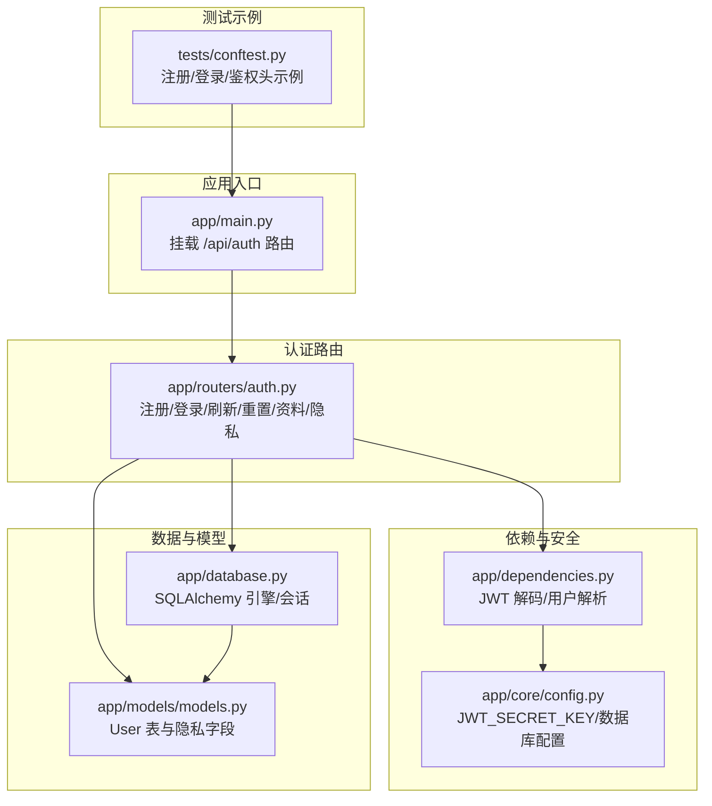
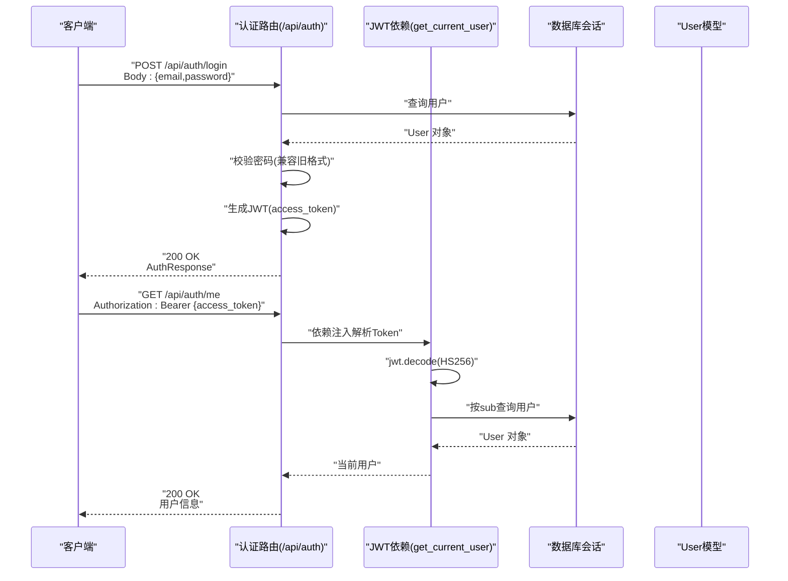
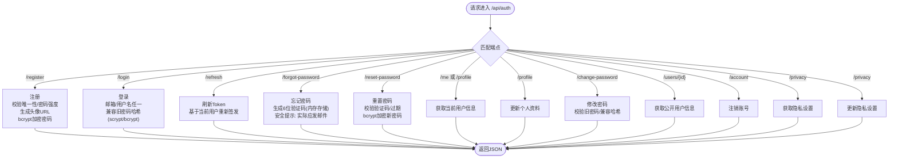
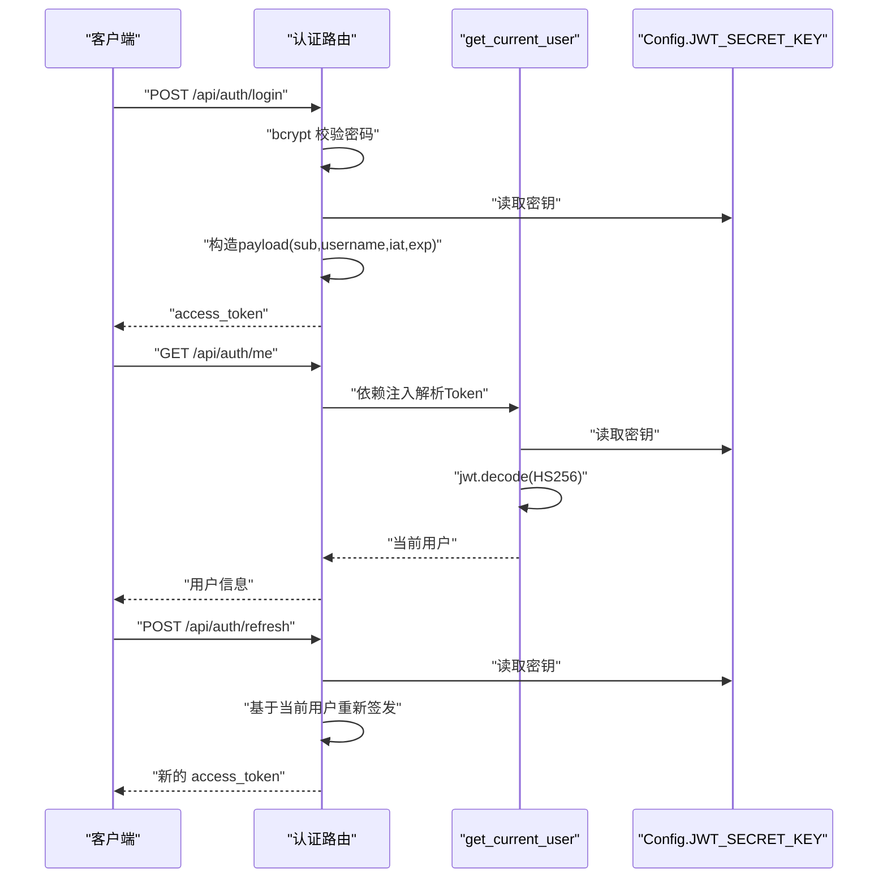
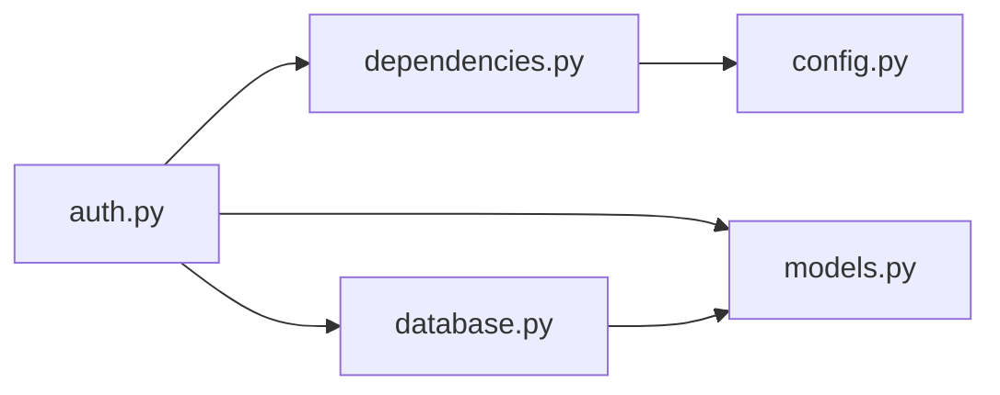

# 认证API

<cite>
**本文引用的文件**
- [app/routers/auth.py](file://app/routers/auth.py)
- [app/dependencies.py](file://app/dependencies.py)
- [app/models/models.py](file://app/models/models.py)
- [app/core/config.py](file://app/core/config.py)
- [app/main.py](file://app/main.py)
- [app/database.py](file://app/database.py)
- [tests/conftest.py](file://tests/conftest.py)
</cite>

## 目录
1. [简介](#简介)
2. [项目结构](#项目结构)
3. [核心组件](#核心组件)
4. [架构总览](#架构总览)
5. [详细组件分析](#详细组件分析)
6. [依赖分析](#依赖分析)
7. [性能考量](#性能考量)
8. [故障排查指南](#故障排查指南)
9. [结论](#结论)
10. [附录](#附录)

## 简介
本文件系统性记录 NanTuPy 项目的认证API，覆盖用户注册、登录、登出、密码重置、个人资料与隐私设置、以及JWT访问令牌的生成、验证与刷新机制。文档同时提供请求参数、响应格式、错误码与认证头使用方法，并给出完整代码示例路径，帮助前后端开发者快速集成与调试。

## 项目结构
认证相关功能集中在以下模块：
- 路由层：认证路由与端点定义
- 依赖层：JWT解码与用户解析
- 模型层：用户实体与隐私字段
- 配置层：JWT密钥与数据库连接
- 应用入口：路由挂载与中间件
- 数据库：会话管理与初始化
- 测试：认证流程示例与鉴权头使用

**图表来源**
- [app/main.py:69](file://app/main.py#L69)
- [app/routers/auth.py:25](file://app/routers/auth.py#L25)
- [app/dependencies.py:12](file://app/dependencies.py#L12)
- [app/core/config.py:10](file://app/core/config.py#L10)
- [app/database.py:9](file://app/database.py#L9)
- [app/models/models.py:42](file://app/models/models.py#L42)
- [tests/conftest.py:74](file://tests/conftest.py#L74)

**章节来源**
- [app/main.py:69](file://app/main.py#L69)
- [app/routers/auth.py:25](file://app/routers/auth.py#L25)

## 核心组件
- 认证路由模块：提供注册、登录、刷新、忘记/重置密码、个人资料、隐私设置等端点
- JWT依赖模块：负责从HTTP Authorization 头解析并验证JWT，解析当前用户
- 数据模型：User实体包含隐私字段与通知偏好
- 配置模块：JWT密钥、数据库连接与上传限制
- 数据库会话：统一的Session管理与初始化
- 测试夹具：演示注册、登录与鉴权头使用

**章节来源**
- [app/routers/auth.py:184](file://app/routers/auth.py#L184)
- [app/dependencies.py:16](file://app/dependencies.py#L16)
- [app/models/models.py:42](file://app/models/models.py#L42)
- [app/core/config.py:10](file://app/core/config.py#L10)
- [app/database.py:22](file://app/database.py#L22)
- [tests/conftest.py:63](file://tests/conftest.py#L63)

## 架构总览
认证API采用“路由-依赖-模型-配置-数据库”的分层设计。客户端通过HTTP Authorization 头携带Bearer Token访问受保护资源；服务端使用依赖注入解码JWT并解析当前用户，再执行业务逻辑。

**图表来源**
- [app/routers/auth.py:214](file://app/routers/auth.py#L214)
- [app/routers/auth.py:253](file://app/routers/auth.py#L253)
- [app/dependencies.py:16](file://app/dependencies.py#L16)
- [app/database.py:22](file://app/database.py#L22)
- [app/models/models.py:42](file://app/models/models.py#L42)

## 详细组件分析

### 1) 认证路由与端点
- 命名空间：/api/auth
- 主要端点：
  - POST /api/auth/register：注册
  - POST /api/auth/login：登录（支持邮箱/用户名）
  - POST /api/auth/refresh：刷新访问令牌
  - POST /api/auth/forgot-password：忘记密码（生成6位验证码）
  - POST /api/auth/reset-password：重置密码
  - GET /api/auth/me 或 /profile：获取当前用户信息
  - PUT /api/auth/profile：更新个人资料
  - POST /api/auth/change-password：修改密码
  - GET /api/auth/users/{user_id}：获取公开用户信息
  - DELETE /api/auth/account：注销账号
  - GET /api/auth/privacy：获取隐私设置
  - PUT /api/auth/privacy：更新隐私设置

**图表来源**
- [app/routers/auth.py:184](file://app/routers/auth.py#L184)
- [app/routers/auth.py:214](file://app/routers/auth.py#L214)
- [app/routers/auth.py:465](file://app/routers/auth.py#L465)
- [app/routers/auth.py:365](file://app/routers/auth.py#L365)
- [app/routers/auth.py:388](file://app/routers/auth.py#L388)
- [app/routers/auth.py:253](file://app/routers/auth.py#L253)
- [app/routers/auth.py:269](file://app/routers/auth.py#L269)
- [app/routers/auth.py:298](file://app/routers/auth.py#L298)
- [app/routers/auth.py:327](file://app/routers/auth.py#L327)
- [app/routers/auth.py:344](file://app/routers/auth.py#L344)
- [app/routers/auth.py:415](file://app/routers/auth.py#L415)
- [app/routers/auth.py:431](file://app/routers/auth.py#L431)

**章节来源**
- [app/routers/auth.py:184](file://app/routers/auth.py#L184)
- [app/routers/auth.py:214](file://app/routers/auth.py#L214)
- [app/routers/auth.py:465](file://app/routers/auth.py#L465)
- [app/routers/auth.py:365](file://app/routers/auth.py#L365)
- [app/routers/auth.py:388](file://app/routers/auth.py#L388)
- [app/routers/auth.py:253](file://app/routers/auth.py#L253)
- [app/routers/auth.py:269](file://app/routers/auth.py#L269)
- [app/routers/auth.py:298](file://app/routers/auth.py#L298)
- [app/routers/auth.py:327](file://app/routers/auth.py#L327)
- [app/routers/auth.py:344](file://app/routers/auth.py#L344)
- [app/routers/auth.py:415](file://app/routers/auth.py#L415)
- [app/routers/auth.py:431](file://app/routers/auth.py#L431)

### 2) 请求参数与响应格式
- 注册(RegisterRequest)
  - 参数：username, email, password
  - 校验：长度、字符集、邮箱格式、密码长度
  - 响应：AuthResponse(message, access_token, user_id, username, user)
- 登录(LoginRequest)
  - 参数：login(兼容)、email(推荐)、password
  - 响应：AuthResponse
- 刷新(TokenResponse)
  - 响应：access_token, token_type="bearer"
- 忘记密码(ForgotPasswordRequest)
  - 参数：email
  - 响应：消息与验证码(开发态)
- 重置密码(ResetPasswordRequest)
  - 参数：token, new_password
  - 响应：消息
- 个人资料(ProfileUpdateRequest)
  - 参数：display_name, bio, avatar_url, cover_photo_url
  - 响应：消息与更新后的用户信息
- 修改密码(ChangePasswordRequest)
  - 参数：old_password, new_password
  - 响应：消息
- 获取/更新隐私(PrivacySettingsResponse/PrivacySettingsUpdateRequest)
  - 字段：profile_visibility, post_default_visibility, show_email, allow_search, allow_friend_requests, notify_push, notify_message, notify_sound
  - 响应：消息或隐私设置对象

**章节来源**
- [app/routers/auth.py:36](file://app/routers/auth.py#L36)
- [app/routers/auth.py:68](file://app/routers/auth.py#L68)
- [app/routers/auth.py:78](file://app/routers/auth.py#L78)
- [app/routers/auth.py:126](file://app/routers/auth.py#L126)
- [app/routers/auth.py:130](file://app/routers/auth.py#L130)
- [app/routers/auth.py:114](file://app/routers/auth.py#L114)
- [app/routers/auth.py:121](file://app/routers/auth.py#L121)
- [app/routers/auth.py:135](file://app/routers/auth.py#L135)
- [app/routers/auth.py:143](file://app/routers/auth.py#L143)

### 3) JWT令牌生成、验证与刷新
- 生成
  - 载荷包含：sub(用户ID), username, iat(签发时间), exp(过期时间，默认7天)
  - 使用 HS256 算法与配置中的 JWT_SECRET_KEY 签发
- 验证
  - 依赖 HTTP Bearer 认证，从 Authorization 头提取凭证
  - 使用 HS256 与 JWT_SECRET_KEY 解码
  - 校验用户是否存在
- 刷新
  - 当前用户不变时，重新签发新的 access_token

**图表来源**
- [app/routers/auth.py:476](file://app/routers/auth.py#L476)
- [app/dependencies.py:16](file://app/dependencies.py#L16)
- [app/core/config.py:10](file://app/core/config.py#L10)

**章节来源**
- [app/routers/auth.py:476](file://app/routers/auth.py#L476)
- [app/dependencies.py:16](file://app/dependencies.py#L16)
- [app/core/config.py:10](file://app/core/config.py#L10)

### 4) 错误码与异常处理
- 400：缺少必要参数、无效字段、无有效字段更新
- 401：无效或过期令牌、用户不存在、旧密码不正确
- 404：用户不存在
- 409：用户名或邮箱已存在
- 500：数据库写入失败
- 令牌过期：依赖解码阶段抛出401

**章节来源**
- [app/routers/auth.py:188](file://app/routers/auth.py#L188)
- [app/routers/auth.py:190](file://app/routers/auth.py#L190)
- [app/routers/auth.py:219](file://app/routers/auth.py#L219)
- [app/routers/auth.py:228](file://app/routers/auth.py#L228)
- [app/routers/auth.py:309](file://app/routers/auth.py#L309)
- [app/routers/auth.py:396](file://app/routers/auth.py#L396)
- [app/routers/auth.py:398](file://app/routers/auth.py#L398)
- [app/routers/auth.py:452](file://app/routers/auth.py#L452)
- [app/dependencies.py:26](file://app/dependencies.py#L26)
- [app/dependencies.py:31](file://app/dependencies.py#L31)

### 5) 认证头使用方法
- 所有受保护端点需在 Authorization 头中携带 Bearer Token
- 示例：Authorization: Bearer {access_token}

**章节来源**
- [tests/conftest.py:142](file://tests/conftest.py#L142)
- [app/routers/auth.py:253](file://app/routers/auth.py#L253)

### 6) 安全最佳实践
- 生产环境务必设置强密钥：JWT_SECRET_KEY
- 使用 HTTPS 传输，防止令牌泄露
- 客户端妥善存储令牌，避免明文落盘
- 前端在每次请求时附带 Authorization 头
- 令牌过期后及时刷新，避免频繁登录
- 忘记密码流程建议改为邮件发送一次性令牌，而非直接返回验证码

**章节来源**
- [app/core/config.py:10](file://app/core/config.py#L10)
- [app/routers/auth.py:370](file://app/routers/auth.py#L370)

### 7) 代码示例（路径）
- 注册与登录获取令牌
  - [tests/conftest.py:74](file://tests/conftest.py#L74)
  - [tests/conftest.py:87](file://tests/conftest.py#L87)
- 使用令牌访问受保护端点
  - [tests/conftest.py:142](file://tests/conftest.py#L142)
- 获取当前用户信息
  - [app/routers/auth.py:253](file://app/routers/auth.py#L253)

**章节来源**
- [tests/conftest.py:74](file://tests/conftest.py#L74)
- [tests/conftest.py:87](file://tests/conftest.py#L87)
- [tests/conftest.py:142](file://tests/conftest.py#L142)
- [app/routers/auth.py:253](file://app/routers/auth.py#L253)

## 依赖分析
- 路由依赖配置与数据库
  - 路由使用依赖注入获取数据库会话
  - JWT密钥来自配置模块
- 依赖层负责令牌解析与用户查找
  - 解析失败或用户不存在均返回401
- 模型层提供用户隐私字段
  - 隐私设置影响公开信息与默认可见性

**图表来源**
- [app/routers/auth.py:18](file://app/routers/auth.py#L18)
- [app/dependencies.py:16](file://app/dependencies.py#L16)
- [app/database.py:22](file://app/database.py#L22)
- [app/models/models.py:42](file://app/models/models.py#L42)
- [app/core/config.py:10](file://app/core/config.py#L10)

**章节来源**
- [app/routers/auth.py:18](file://app/routers/auth.py#L18)
- [app/dependencies.py:16](file://app/dependencies.py#L16)
- [app/database.py:22](file://app/database.py#L22)
- [app/models/models.py:42](file://app/models/models.py#L42)
- [app/core/config.py:10](file://app/core/config.py#L10)

## 性能考量
- 令牌有效期：默认7天，平衡安全性与用户体验
- 数据库连接池：配置了池大小与回收策略，减少连接开销
- 密码哈希：bcrypt用于新用户，兼容旧版scrypt以保证迁移期可用性
- 事务控制：数据库写入失败自动回滚，避免脏数据

**章节来源**
- [app/core/config.py:22](file://app/core/config.py#L22)
- [app/database.py:9](file://app/database.py#L9)
- [app/routers/auth.py:231](file://app/routers/auth.py#L231)
- [app/routers/auth.py:314](file://app/routers/auth.py#L314)

## 故障排查指南
- 401 无效或过期令牌
  - 检查 Authorization 头是否正确携带 Bearer Token
  - 确认 JWT_SECRET_KEY 与签发端一致
  - 核对令牌是否过期
- 401 用户不存在
  - 确认用户ID在数据库中存在
- 400 旧密码不正确
  - 确认输入旧密码与哈希格式兼容
- 409 用户名/邮箱已存在
  - 更换用户名或邮箱
- 500 数据库写入失败
  - 检查数据库连接与权限
  - 查看回滚日志

**章节来源**
- [app/dependencies.py:26](file://app/dependencies.py#L26)
- [app/dependencies.py:31](file://app/dependencies.py#L31)
- [app/routers/auth.py:309](file://app/routers/auth.py#L309)
- [app/routers/auth.py:188](file://app/routers/auth.py#L188)
- [app/routers/auth.py:190](file://app/routers/auth.py#L190)
- [app/routers/auth.py:357](file://app/routers/auth.py#L357)

## 结论
NanTuPy 的认证API采用清晰的分层设计与标准的JWT流程，覆盖了用户生命周期中的关键环节。生产部署时需重点关注密钥管理、令牌传输安全与密码重置流程的完善。通过本文档提供的端点清单、参数说明、错误码与示例路径，前后端可高效完成集成与联调。

## 附录
- 端点一览（/api/auth）
  - 注册：POST /api/auth/register
  - 登录：POST /api/auth/login
  - 刷新：POST /api/auth/refresh
  - 忘记密码：POST /api/auth/forgot-password
  - 重置密码：POST /api/auth/reset-password
  - 获取当前用户：GET /api/auth/me 或 /profile
  - 更新个人资料：PUT /api/auth/profile
  - 修改密码：POST /api/auth/change-password
  - 获取公开用户信息：GET /api/auth/users/{user_id}
  - 注销账号：DELETE /api/auth/account
  - 获取隐私设置：GET /api/auth/privacy
  - 更新隐私设置：PUT /api/auth/privacy

**章节来源**
- [app/routers/auth.py:184](file://app/routers/auth.py#L184)
- [app/routers/auth.py:214](file://app/routers/auth.py#L214)
- [app/routers/auth.py:465](file://app/routers/auth.py#L465)
- [app/routers/auth.py:365](file://app/routers/auth.py#L365)
- [app/routers/auth.py:388](file://app/routers/auth.py#L388)
- [app/routers/auth.py:253](file://app/routers/auth.py#L253)
- [app/routers/auth.py:269](file://app/routers/auth.py#L269)
- [app/routers/auth.py:298](file://app/routers/auth.py#L298)
- [app/routers/auth.py:327](file://app/routers/auth.py#L327)
- [app/routers/auth.py:344](file://app/routers/auth.py#L344)
- [app/routers/auth.py:415](file://app/routers/auth.py#L415)
- [app/routers/auth.py:431](file://app/routers/auth.py#L431)