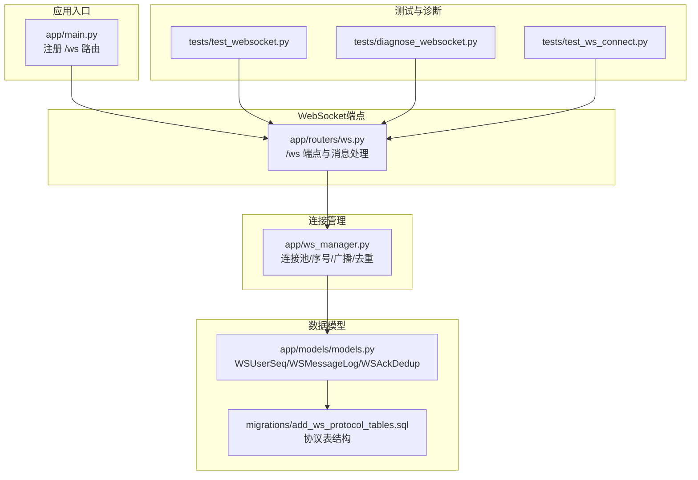
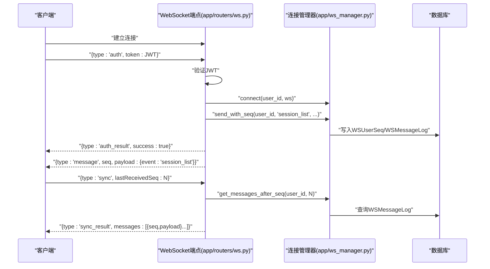
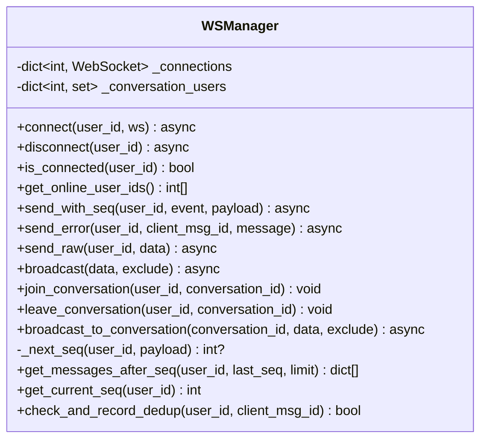
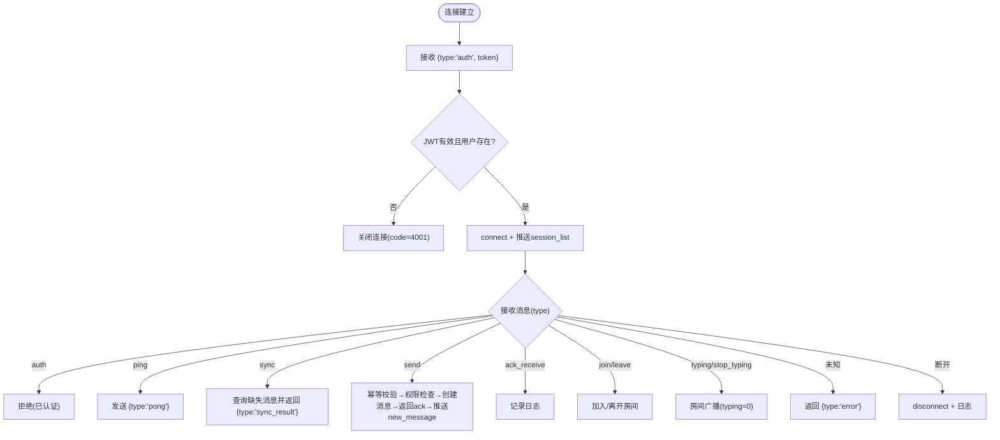
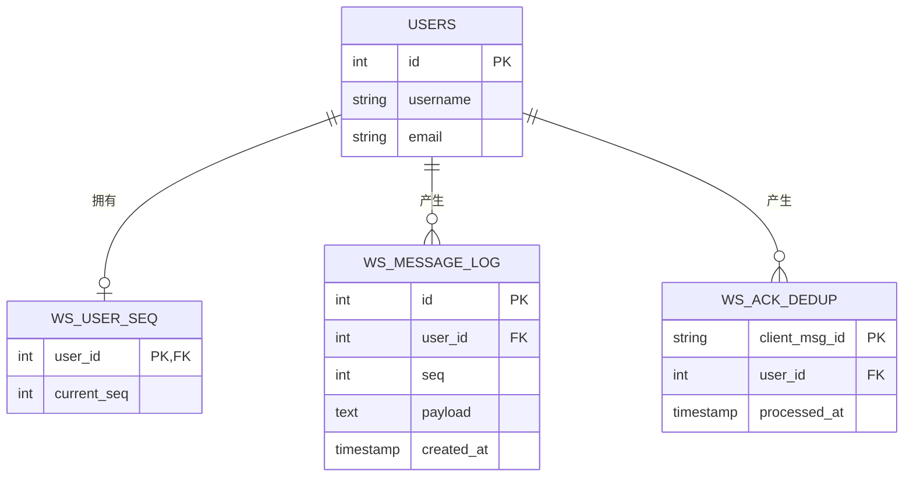
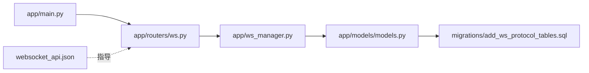

# WebSocket实时通信

<cite>
**本文档引用的文件**
- [app/main.py](file://app/main.py)
- [app/routers/ws.py](file://app/routers/ws.py)
- [app/ws_manager.py](file://app/ws_manager.py)
- [app/models/models.py](file://app/models/models.py)
- [migrations/add_ws_protocol_tables.sql](file://migrations/add_ws_protocol_tables.sql)
- [websocket_api.json](file://websocket_api.json)
- [tests/test_websocket.py](file://tests/test_websocket.py)
- [tests/diagnose_websocket.py](file://tests/diagnose_websocket.py)
- [tests/test_ws_connect.py](file://tests/test_ws_connect.py)
</cite>

## 目录
1. [简介](#简介)
2. [项目结构](#项目结构)
3. [核心组件](#核心组件)
4. [架构总览](#架构总览)
5. [详细组件分析](#详细组件分析)
6. [依赖关系分析](#依赖关系分析)
7. [性能考量](#性能考量)
8. [故障排查指南](#故障排查指南)
9. [结论](#结论)
10. [附录](#附录)

## 简介
本文件面向NanTuPy的WebSocket实时通信系统，提供从架构设计到实现细节的完整文档。系统采用原生WebSocket，基于“序号协议”的可靠消息投递模型，支持连接认证、消息持久化、断线补发(sync)、ACK去重(clientMsgId)、会话房间广播(typing/stop_typing)等能力。文档同时覆盖客户端集成指南、安全与速率限制、监控与排障，以及性能优化策略。

## 项目结构
WebSocket相关代码主要分布在以下模块：
- 应用入口与路由注册：app/main.py
- WebSocket端点与消息处理：app/routers/ws.py
- 连接管理与序号机制：app/ws_manager.py
- 数据模型与协议表：app/models/models.py
- 协议与API规范：websocket_api.json
- 数据库迁移脚本：migrations/add_ws_protocol_tables.sql
- 测试与诊断工具：tests/test_websocket.py、tests/diagnose_websocket.py、tests/test_ws_connect.py

**图表来源**
- [app/main.py:84](file://app/main.py#L84)
- [app/routers/ws.py:442-546](file://app/routers/ws.py#L442-L546)
- [app/ws_manager.py:20-308](file://app/ws_manager.py#L20-L308)
- [app/models/models.py:624-655](file://app/models/models.py#L624-L655)
- [migrations/add_ws_protocol_tables.sql:1-32](file://migrations/add_ws_protocol_tables.sql#L1-L32)

**章节来源**
- [app/main.py:84](file://app/main.py#L84)
- [app/routers/ws.py:442-546](file://app/routers/ws.py#L442-L546)
- [app/ws_manager.py:20-308](file://app/ws_manager.py#L20-L308)
- [app/models/models.py:624-655](file://app/models/models.py#L624-L655)
- [migrations/add_ws_protocol_tables.sql:1-32](file://migrations/add_ws_protocol_tables.sql#L1-L32)

## 核心组件
- WebSocket端点与消息处理：负责认证(auth)、消息发送(send)、断线补发(sync)、心跳(ping/pong)、会话房间(join/leave)、输入状态(typing/stop_typing)、ACK确认(ack_receive)等。
- 连接管理器：维护用户连接映射、会话房间集合、消息序号分配与持久化、ACK去重、广播与断线清理。
- 数据模型：WSUserSeq(用户序号计数器)、WSMessageLog(消息日志)、WSAckDedup(ACK去重表)。
- 应用入口：注册WebSocket路由，配置CORS与安全头。

**章节来源**
- [app/routers/ws.py:184-546](file://app/routers/ws.py#L184-L546)
- [app/ws_manager.py:20-308](file://app/ws_manager.py#L20-L308)
- [app/models/models.py:624-655](file://app/models/models.py#L624-L655)
- [app/main.py:84](file://app/main.py#L84)

## 架构总览
系统采用“原生WebSocket + 序号协议”模式：
- 客户端连接后发送auth消息完成JWT认证，认证成功后自动推送会话列表(session_list)，随后所有推送消息带有序号(seq)。
- 服务端通过WSManager维护连接池与房间，使用数据库表实现消息持久化与去重。
- 客户端断线重连后发送sync请求，服务端返回seq>lastReceivedSeq的消息列表进行补发。
- typing/stop_typing等实时事件通过房间广播，seq=0表示非持久化事件。

**图表来源**
- [app/routers/ws.py:442-546](file://app/routers/ws.py#L442-L546)
- [app/ws_manager.py:74-95](file://app/ws_manager.py#L74-L95)
- [app/ws_manager.py:214-247](file://app/ws_manager.py#L214-L247)

**章节来源**
- [app/routers/ws.py:442-546](file://app/routers/ws.py#L442-L546)
- [app/ws_manager.py:74-95](file://app/ws_manager.py#L74-L95)
- [app/ws_manager.py:214-247](file://app/ws_manager.py#L214-L247)

## 详细组件分析

### 连接管理器（WSManager）
- 单例模式，维护user_id到WebSocket的映射，以及conversation_id到在线用户集合的房间映射。
- 提供连接注册/断开、在线用户查询、带序号消息推送、原始消息推送、广播、房间加入/离开、断线补发查询、ACK去重检查等功能。
- 序号机制：
  - 原子递增WSUserSeq.current_seq，写入WSMessageLog，返回新序号。
  - 若序号分配失败，降级为raw_send（无序号）。
- ACK去重：
  - 使用WSAckDedup(client_msg_id)记录已处理请求，24小时TTL自动清理。
- 房间广播：
  - typing/stop_typing等非持久化事件通过broadcast_to_conversation广播至房间内除发送者外的所有在线用户。

**图表来源**
- [app/ws_manager.py:20-308](file://app/ws_manager.py#L20-L308)

**章节来源**
- [app/ws_manager.py:20-308](file://app/ws_manager.py#L20-L308)

### WebSocket端点（/ws）
- 认证流程：接收auth消息，验证JWT，检查用户存在性，成功后connect并推送session_list，随后进入消息循环。
- 消息处理：
  - send：幂等校验(clientMsgId)，权限检查，创建消息，返回ack，再向会话参与者推送new_message。
  - sync：根据lastReceivedSeq返回缺失消息列表。
  - ping/pong：心跳保活。
  - join/leave：订阅/取消会话房间。
  - typing/stop_typing：房间广播。
  - ack_receive：记录日志（可扩展为流量控制）。
- 异常处理：捕获WebSocketDisconnect与未知异常，断开连接并记录日志。

**图表来源**
- [app/routers/ws.py:442-546](file://app/routers/ws.py#L442-L546)

**章节来源**
- [app/routers/ws.py:184-546](file://app/routers/ws.py#L184-L546)

### 数据模型与协议表
- WSUserSeq：每用户序号计数器，主键user_id。
- WSMessageLog：消息日志，唯一索引(user_id, seq)，外键users(id)。
- WSAckDedup：ACK去重表，主键client_msg_id，外键users(id)。
- 迁移脚本定义了三张表的结构与约束，并给出定期清理建议。

**图表来源**
- [app/models/models.py:624-655](file://app/models/models.py#L624-L655)
- [migrations/add_ws_protocol_tables.sql:1-32](file://migrations/add_ws_protocol_tables.sql#L1-L32)

**章节来源**
- [app/models/models.py:624-655](file://app/models/models.py#L624-L655)
- [migrations/add_ws_protocol_tables.sql:1-32](file://migrations/add_ws_protocol_tables.sql#L1-L32)

### 消息格式、事件类型与状态管理
- 统一外层结构：
  - 上行消息：auth、send、sync、ack_receive、ping、join、leave、typing、stop_typing
  - 下行消息：auth_result、message(seq+payload)、ack、sync_result、pong、error
- 事件类型：
  - message.payload.event：new_message、session_list、typing、stop_typing、message_read、conversation_read、new_notification
- 状态管理：
  - 客户端维护lastReceivedSeq，断线重连时通过sync补发。
  - clientMsgId用于幂等去重，服务端记录24小时后自动清理。
  - typing/stop_typing为非持久化事件(seq=0)，仅房间广播。

**章节来源**
- [websocket_api.json:82-371](file://websocket_api.json#L82-L371)
- [websocket_api.json:453-552](file://websocket_api.json#L453-L552)

## 依赖关系分析
- app/main.py注册WebSocket路由，依赖app/routers/ws.py。
- app/routers/ws.py依赖app/ws_manager.py与数据库模型。
- app/ws_manager.py依赖数据库会话与协议表。
- websocket_api.json作为协议规范，指导客户端实现。

**图表来源**
- [app/main.py:84](file://app/main.py#L84)
- [app/routers/ws.py:16-18](file://app/routers/ws.py#L16-L18)
- [app/ws_manager.py:15](file://app/ws_manager.py#L15)
- [websocket_api.json:1-10](file://websocket_api.json#L1-L10)

**章节来源**
- [app/main.py:84](file://app/main.py#L84)
- [app/routers/ws.py:16-18](file://app/routers/ws.py#L16-L18)
- [app/ws_manager.py:15](file://app/ws_manager.py#L15)
- [websocket_api.json:1-10](file://websocket_api.json#L1-L10)

## 性能考量
- 序号分配与持久化：
  - 使用原子更新current_seq并写入日志，保证消息顺序与可追溯。
  - 建议对ws_user_seq与ws_message_log建立复合索引(user_id, seq)，减少查询成本。
- 广播与房间：
  - 房间内广播使用set存储在线用户，避免对全体用户遍历。
  - 房间广播为非持久化事件，seq=0，降低存储压力。
- 心跳与连接维护：
  - 建议客户端每30秒发送ping，服务端立即pong，维持长连接活性。
- 去重与清理：
  - ACK去重表24小时TTL，需定期清理历史记录，避免膨胀。
  - 建议保留7天消息日志，平衡补发需求与存储成本。

[本节为通用性能建议，不直接分析具体文件]

## 故障排查指南
- 服务器状态检查：
  - 使用健康检查端点确认服务运行。
  - 检查端口监听状态与防火墙设置。
- WebSocket端点可用性：
  - 确认WebSocket端点可达，必要时使用HTTP轮询握手验证。
- 连接与认证：
  - 若收到code=4001，检查JWT是否有效或过期。
  - 若收到code=1000，说明同用户新连接替换了旧连接。
- 断线与补发：
  - 客户端断线后重连，发送sync请求，核对lastReceivedSeq是否正确。
- 日志与监控：
  - 关注连接/断开/发送失败/广播失败等日志，定位异常。
  - 建议在生产环境开启更细粒度的指标采集（连接数、消息吞吐、延迟等）。

**章节来源**
- [tests/diagnose_websocket.py:1-239](file://tests/diagnose_websocket.py#L1-L239)
- [websocket_api.json:66-70](file://websocket_api.json#L66-L70)

## 结论
NanTuPy的WebSocket系统通过“序号协议+持久化日志+ACK去重+房间广播”的组合，实现了高可靠、可扩展的实时通信能力。配合明确的协议规范与完善的测试/诊断工具，既便于初学者理解实时通信的核心概念，也为有经验的开发者提供了实现细节与优化方向。

[本节为总结性内容，不直接分析具体文件]

## 附录

### 客户端集成指南（基于协议规范）
- 连接与认证：
  - 建立连接后发送auth消息，携带JWT token。
  - 认证成功后自动收到session_list（带序号）。
- 保活与补发：
  - 建议每30秒发送ping，服务端立即pong。
  - 断线重连后发送sync，传入lastReceivedSeq。
- 发送消息：
  - 使用send消息，携带clientMsgId与payload（event/new_message等）。
  - 收到ack后，再等待对方推送new_message。
- 房间与输入状态：
  - 进入会话页面发送join，离开时发送leave。
  - 输入时发送typing，停止时发送stop_typing。

**章节来源**
- [websocket_api.json:17-45](file://websocket_api.json#L17-L45)
- [websocket_api.json:434-440](file://websocket_api.json#L434-L440)

### 安全考虑与速率限制
- 安全：
  - 使用JWT HS256认证，token失效或用户不存在时服务端以code=4001关闭连接。
  - CORS与安全头配置，防止跨源风险。
- 速率限制与防护：
  - 建议在网关或应用层增加请求频率限制（如每分钟请求数）。
  - 对敏感操作（发送消息）增加权限校验与内容审核。
  - 对广播类高频事件（typing）可增加客户端侧节流。

**章节来源**
- [websocket_api.json:66-70](file://websocket_api.json#L66-L70)
- [app/main.py:46-67](file://app/main.py#L46-L67)

### 监控与可观测性
- 指标建议：
  - 连接数、在线用户数、消息吞吐量、平均延迟、错误率。
  - sync补发数量、去重命中率、广播失败次数。
- 日志建议：
  - 连接/断开、认证、消息发送、sync、广播、去重等关键路径日志。
  - 异常堆栈与上下文信息（user_id、conversation_id等）。

**章节来源**
- [app/ws_manager.py:56-61](file://app/ws_manager.py#L56-L61)
- [app/routers/ws.py:538-546](file://app/routers/ws.py#L538-L546)