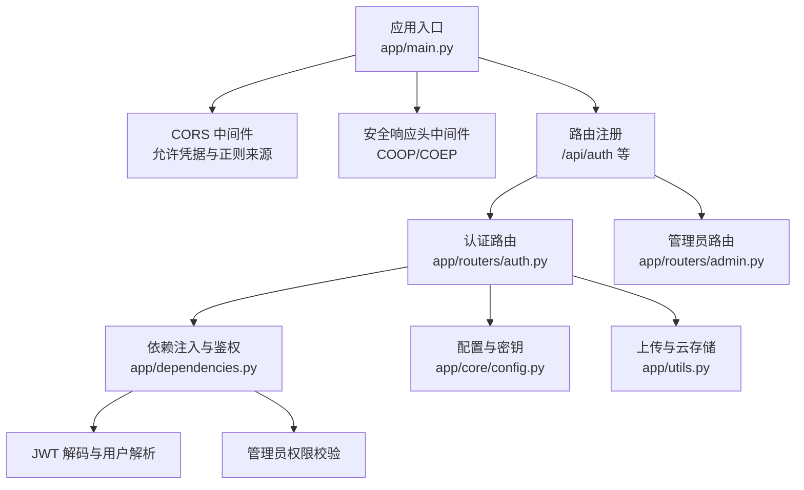
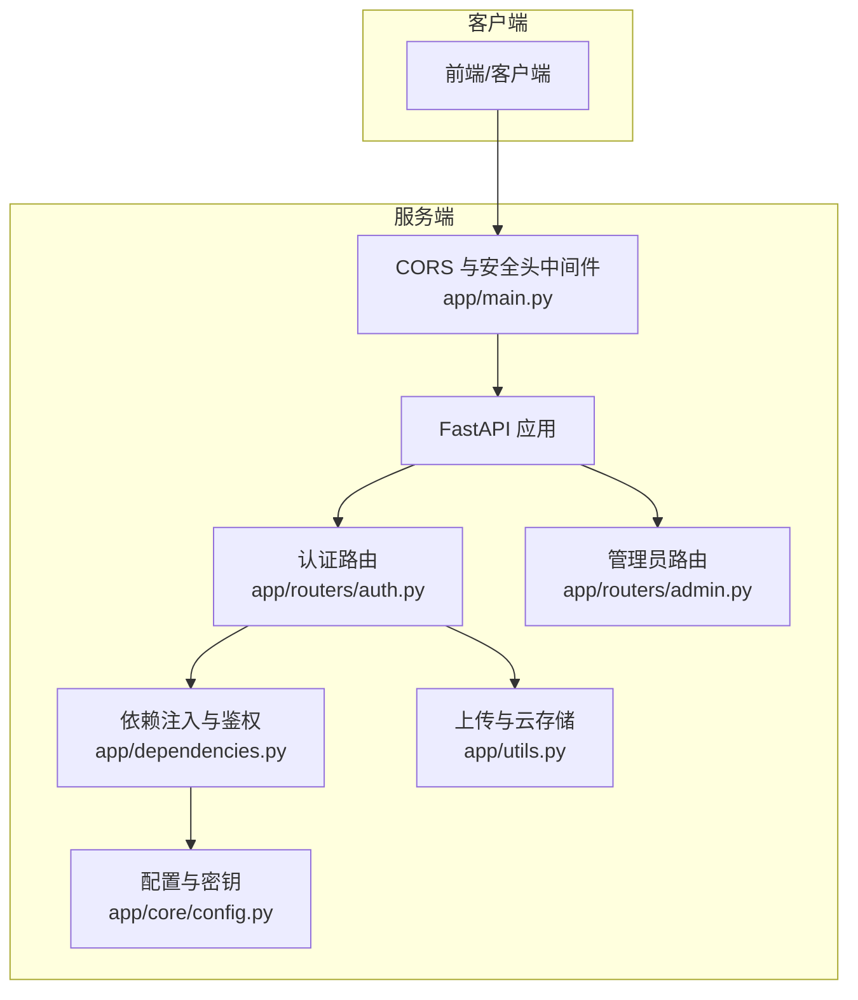
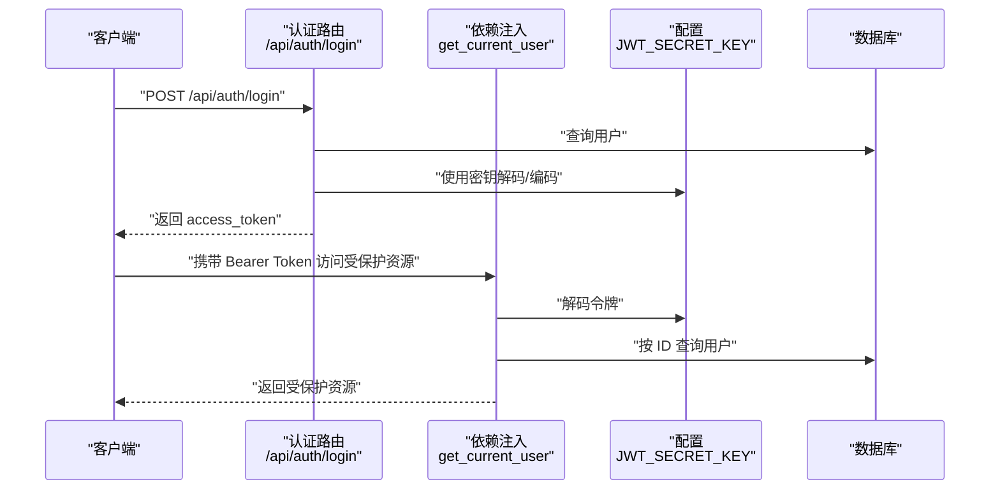
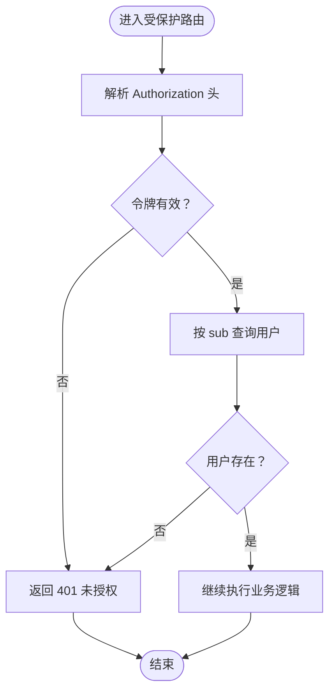
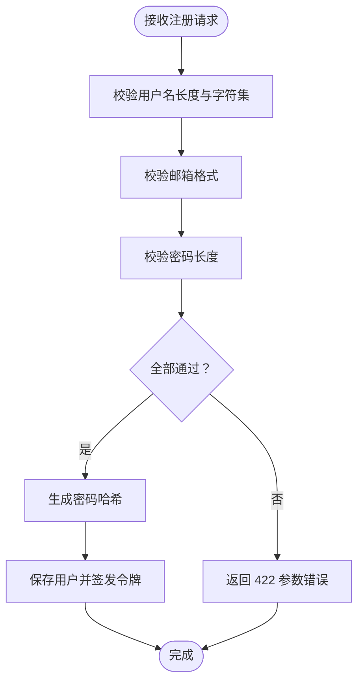
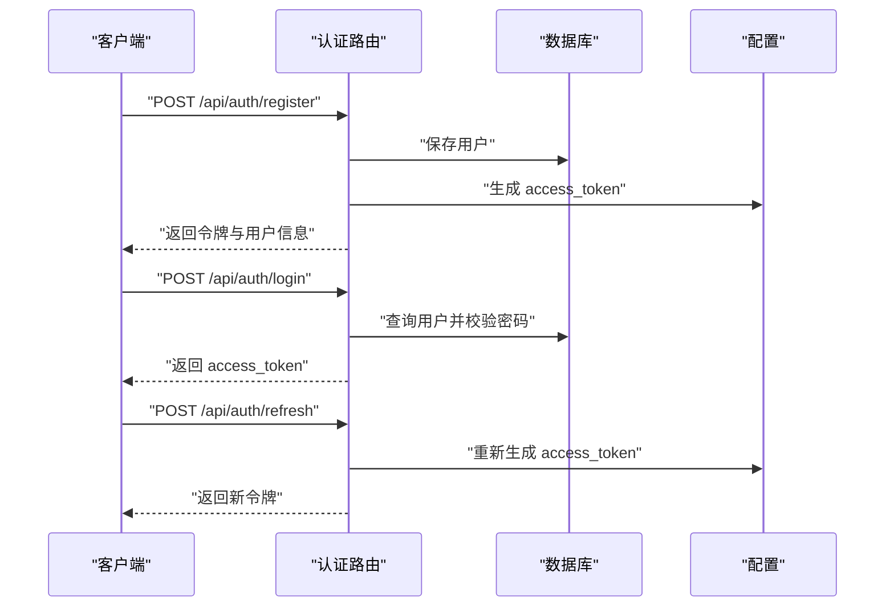
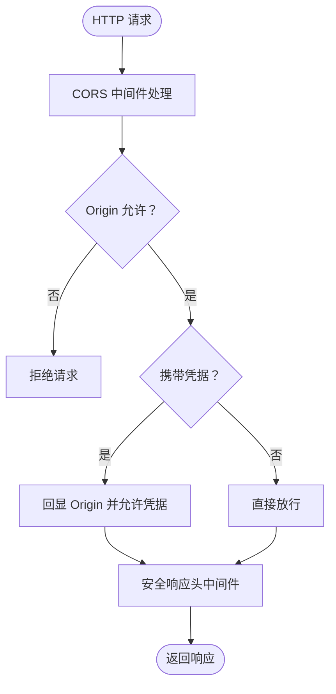
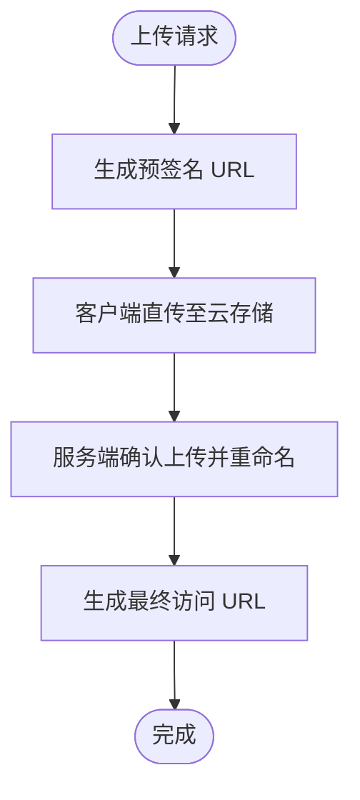
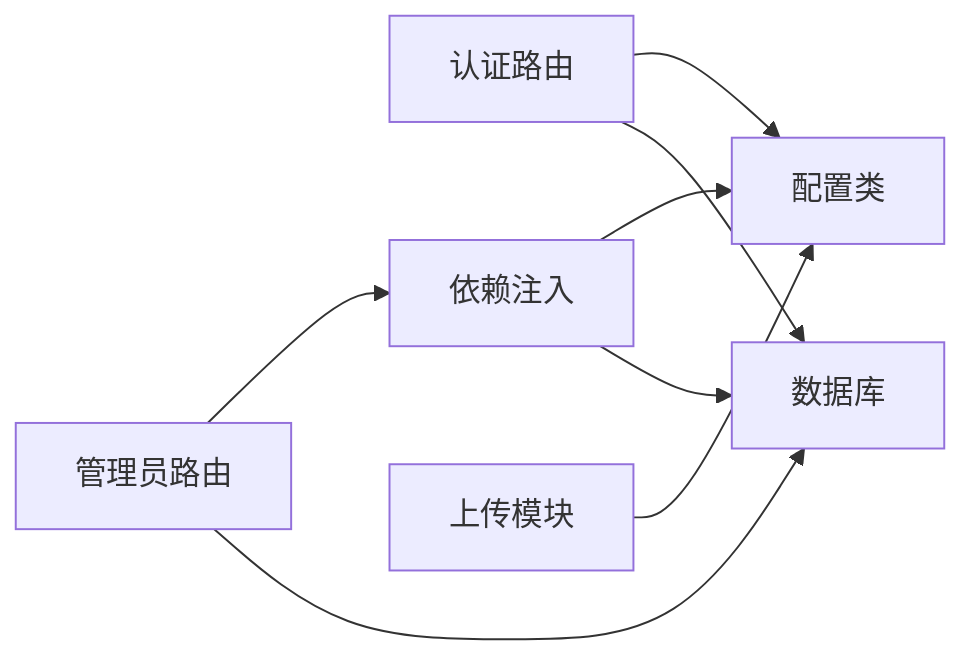

# 安全与权限

<cite>
**本文引用的文件**
- [app/main.py](file://app/main.py)
- [app/routers/auth.py](file://app/routers/auth.py)
- [app/dependencies.py](file://app/dependencies.py)
- [app/core/config.py](file://app/core/config.py)
- [app/utils.py](file://app/utils.py)
- [app/routers/admin.py](file://app/routers/admin.py)
</cite>

## 目录
1. [简介](#简介)
2. [项目结构](#项目结构)
3. [核心组件](#核心组件)
4. [架构总览](#架构总览)
5. [详细组件分析](#详细组件分析)
6. [依赖分析](#依赖分析)
7. [性能考量](#性能考量)
8. [故障排查指南](#故障排查指南)
9. [结论](#结论)
10. [附录](#附录)

## 简介
本文件面向开发者与运维人员，系统化梳理 NanTuPy 项目的“安全与权限”体系，覆盖认证与会话、授权与权限控制、输入验证、JWT 安全机制、令牌管理、CORS 与安全响应头、敏感数据与隐私保护、合规与审计、以及常见威胁的缓解策略。文档以代码为依据，结合架构图与流程图，帮助团队快速理解并落地安全实践。

## 项目结构
围绕安全与权限的关键模块如下：
- 应用入口与中间件：CORS、安全响应头、日志
- 认证与授权：JWT 解析、用户依赖注入、管理员权限
- 身份认证与会话：注册、登录、密码变更、忘记/重置密码、个人资料与隐私设置
- 配置与密钥：JWT 密钥、数据库连接、上传与云存储
- 上传与敏感数据：预签名上传、访问控制与最小暴露原则
- 管理员能力：敏感词管理等后台操作

图表来源
- [app/main.py:46-66](file://app/main.py#L46-L66)
- [app/routers/auth.py:184-246](file://app/routers/auth.py#L184-L246)
- [app/dependencies.py:16-62](file://app/dependencies.py#L16-L62)
- [app/core/config.py:8-11](file://app/core/config.py#L8-L11)
- [app/utils.py:14-78](file://app/utils.py#L14-L78)
- [app/routers/admin.py:14-45](file://app/routers/admin.py#L14-L45)

章节来源
- [app/main.py:46-66](file://app/main.py#L46-L66)
- [app/routers/auth.py:184-246](file://app/routers/auth.py#L184-L246)
- [app/dependencies.py:16-62](file://app/dependencies.py#L16-L62)
- [app/core/config.py:8-11](file://app/core/config.py#L8-L11)
- [app/utils.py:14-78](file://app/utils.py#L14-L78)
- [app/routers/admin.py:14-45](file://app/routers/admin.py#L14-L45)

## 核心组件
- JWT 安全机制与令牌管理
  - 使用 HS256 算法编码与解码，密钥来自环境变量；令牌包含 sub、username、iat、exp；默认有效期 7 天。
  - 依赖注入层负责解析令牌并加载用户对象，失败时统一返回未授权错误。
- 权限控制策略
  - 普通用户认证：通过依赖注入获取当前用户。
  - 可选认证：在匿名场景下尝试解析令牌，失败不报错。
  - 管理员权限：基于用户字段 is_admin 进行校验，未满足返回禁止访问。
- 输入验证
  - Pydantic 模型对注册/登录/密码等进行字段级校验，包含长度、格式、字符集限制。
  - 登录接口同时支持用户名与邮箱登录，兼容历史哈希格式。
- 会话与令牌刷新
  - 提供刷新接口，基于当前用户重新签发新令牌，保持会话连续性。
- CORS 与安全响应头
  - 使用正则来源替代通配符，避免与凭据冲突；设置 COOP/COEP 响应头以满足特定运行环境需求。
- 敏感数据与隐私
  - 个人资料与隐私设置接口支持按需更新；忘记密码流程采用内存令牌（生产需持久化与更严格过期策略）。
- 上传与访问控制
  - 通过云存储预签名 URL 实现客户端直传，限定过期时间与最小暴露范围；提供确认上传与删除能力。

章节来源
- [app/routers/auth.py:476-486](file://app/routers/auth.py#L476-L486)
- [app/dependencies.py:16-62](file://app/dependencies.py#L16-L62)
- [app/routers/auth.py:36-75](file://app/routers/auth.py#L36-L75)
- [app/routers/auth.py:215-246](file://app/routers/auth.py#L215-L246)
- [app/routers/auth.py:465-470](file://app/routers/auth.py#L465-L470)
- [app/main.py:46-66](file://app/main.py#L46-L66)
- [app/routers/auth.py:365-408](file://app/routers/auth.py#L365-L408)
- [app/utils.py:14-78](file://app/utils.py#L14-L78)

## 架构总览
下图展示认证与权限在系统中的交互关系：

图表来源
- [app/main.py:46-66](file://app/main.py#L46-L66)
- [app/routers/auth.py:184-246](file://app/routers/auth.py#L184-L246)
- [app/dependencies.py:16-62](file://app/dependencies.py#L16-L62)
- [app/core/config.py:8-11](file://app/core/config.py#L8-L11)
- [app/utils.py:14-78](file://app/utils.py#L14-L78)
- [app/routers/admin.py:14-45](file://app/routers/admin.py#L14-L45)

## 详细组件分析

### JWT 安全机制与令牌管理
- 编码与解码
  - 使用 HS256 算法，密钥来自配置类的环境变量；载荷包含用户标识、用户名、签发时间与过期时间。
  - 依赖注入层通过解码载荷提取用户 ID，并从数据库加载用户对象；异常统一转换为未授权错误。
- 令牌刷新
  - 提供刷新端点，基于当前用户重新签发新令牌，维持会话有效性。
- 生产建议
  - 密钥必须安全存储与轮换；令牌过期时间应根据业务场景调整；建议启用 HTTPS 与安全传输。

图表来源
- [app/routers/auth.py:215-246](file://app/routers/auth.py#L215-L246)
- [app/dependencies.py:16-36](file://app/dependencies.py#L16-L36)
- [app/core/config.py:8-11](file://app/core/config.py#L8-L11)

章节来源
- [app/routers/auth.py:476-486](file://app/routers/auth.py#L476-L486)
- [app/dependencies.py:16-36](file://app/dependencies.py#L16-L36)
- [app/core/config.py:8-11](file://app/core/config.py#L8-L11)

### 权限控制策略与授权机制
- 当前用户依赖
  - 未提供令牌或无效令牌时，统一返回未授权错误；用户不存在同样返回未授权。
- 可选用户依赖
  - 尝试解析令牌，失败返回空值，便于匿名场景使用。
- 管理员权限
  - 通过 is_admin 字段判断，非管理员访问受限。

图表来源
- [app/dependencies.py:16-36](file://app/dependencies.py#L16-L36)

章节来源
- [app/dependencies.py:16-62](file://app/dependencies.py#L16-L62)

### 输入验证与数据完整性
- 注册请求
  - 用户名长度与字符集限制；邮箱格式校验；密码长度校验。
- 登录请求
  - 支持用户名或邮箱登录，自动选择优先字段。
- 密码变更与重置
  - 旧密码校验兼容历史哈希格式；新密码进行长度校验。
- 隐私设置
  - 仅允许更新指定字段，未提供有效字段时报错。

图表来源
- [app/routers/auth.py:36-75](file://app/routers/auth.py#L36-L75)
- [app/routers/auth.py:184-212](file://app/routers/auth.py#L184-L212)

章节来源
- [app/routers/auth.py:36-75](file://app/routers/auth.py#L36-L75)
- [app/routers/auth.py:184-212](file://app/routers/auth.py#L184-L212)

### 认证流程与会话管理
- 注册与登录
  - 注册后立即签发令牌；登录时根据用户名或邮箱匹配用户并校验密码。
- 会话刷新
  - 基于当前用户重新签发新令牌，保持长期会话。
- 忘记/重置密码
  - 生成一次性验证码（内存令牌），设置过期时间；验证通过后更新密码哈希。

图表来源
- [app/routers/auth.py:184-246](file://app/routers/auth.py#L184-L246)
- [app/routers/auth.py:465-470](file://app/routers/auth.py#L465-L470)

章节来源
- [app/routers/auth.py:184-246](file://app/routers/auth.py#L184-L246)
- [app/routers/auth.py:465-470](file://app/routers/auth.py#L465-L470)

### CORS 配置与安全响应头
- CORS
  - 使用正则来源替代通配符，避免与凭据冲突；允许凭据、所有方法与头部。
- 安全响应头
  - 设置 COOP 与 COEP，满足特定运行环境（如 Flutter Web CanvasKit + WASM）对 SharedArrayBuffer 的要求。

图表来源
- [app/main.py:46-66](file://app/main.py#L46-L66)

章节来源
- [app/main.py:46-66](file://app/main.py#L46-L66)

### 敏感数据保护与隐私控制
- 个人资料与隐私设置
  - 提供公开/私有可见性、是否允许搜索、好友请求策略等配置项；仅允许更新有效字段。
- 上传与访问控制
  - 通过预签名 URL 实现客户端直传，限定过期时间与最小暴露范围；提供确认上传与删除能力，降低敏感数据泄露风险。

图表来源
- [app/utils.py:37-77](file://app/utils.py#L37-L77)
- [app/utils.py:80-120](file://app/utils.py#L80-L120)

章节来源
- [app/routers/auth.py:415-458](file://app/routers/auth.py#L415-L458)
- [app/utils.py:37-77](file://app/utils.py#L37-L77)
- [app/utils.py:80-120](file://app/utils.py#L80-L120)

### 管理员权限与后台能力
- 管理员路由
  - 通过管理员权限校验后，提供敏感词管理等后台功能；分页查询与参数校验保障稳定性。
- 合规与审计
  - 建议记录管理员操作日志，配合审计系统追踪敏感操作。

章节来源
- [app/routers/admin.py:14-45](file://app/routers/admin.py#L14-L45)
- [app/dependencies.py:53-62](file://app/dependencies.py#L53-L62)

## 依赖分析
- 组件耦合
  - 认证路由依赖配置类获取密钥；依赖注入层依赖配置类进行 JWT 解码；上传模块依赖配置类读取云存储参数。
- 外部依赖
  - JWT 编解码、数据库 ORM、云存储 SDK、CORS 中间件、安全响应头中间件。
- 潜在风险
  - 密钥硬编码或未轮换；令牌过期策略不当；CORS 配置不当导致跨域攻击面扩大。

图表来源
- [app/routers/auth.py:18-22](file://app/routers/auth.py#L18-L22)
- [app/dependencies.py:16-36](file://app/dependencies.py#L16-L36)
- [app/core/config.py:8-11](file://app/core/config.py#L8-L11)
- [app/utils.py:14-28](file://app/utils.py#L14-L28)
- [app/routers/admin.py:7-9](file://app/routers/admin.py#L7-L9)

章节来源
- [app/routers/auth.py:18-22](file://app/routers/auth.py#L18-L22)
- [app/dependencies.py:16-36](file://app/dependencies.py#L16-L36)
- [app/core/config.py:8-11](file://app/core/config.py#L8-L11)
- [app/utils.py:14-28](file://app/utils.py#L14-L28)
- [app/routers/admin.py:7-9](file://app/routers/admin.py#L7-L9)

## 性能考量
- 令牌解析成本低，主要为一次 JWT 解码与数据库查询；建议缓存热点用户信息以减少查询压力。
- 上传直传模式降低服务器带宽占用；合理设置预签名 URL 过期时间平衡安全性与用户体验。
- 日志级别与输出位置需结合生产环境吞吐量进行调优，避免 I/O 影响。

## 故障排查指南
- 401 未授权
  - 检查令牌是否过期或被篡改；确认密钥一致且未轮换；核对用户是否存在。
- 403 禁止访问
  - 确认用户 is_admin 字段；检查管理员路由权限校验逻辑。
- CORS 失败
  - 检查是否使用正则来源；确认请求头与凭据配置；避免通配符与凭据混用。
- 上传失败
  - 检查云存储配置与密钥；确认预签名 URL 是否过期；核对最终确认与删除流程。

章节来源
- [app/dependencies.py:25-36](file://app/dependencies.py#L25-L36)
- [app/dependencies.py:57-62](file://app/dependencies.py#L57-L62)
- [app/main.py:46-66](file://app/main.py#L46-L66)
- [app/utils.py:62-77](file://app/utils.py#L62-L77)

## 结论
NanTuPy 已具备较为完整的安全与权限基础：JWT 认证、依赖注入鉴权、CORS 与安全响应头、输入验证、上传直传与最小暴露、管理员权限等。建议在生产环境中进一步强化密钥轮换、令牌过期策略、日志审计与监控告警、以及敏感令牌持久化与更强的风控策略，以构建纵深防御体系。

## 附录
- 安全最佳实践清单
  - 强制 HTTPS 传输；定期轮换密钥；最小权限原则；日志审计与监控告警；输入与输出过滤；速率限制与防爆破；敏感操作二次确认。
- 合规与隐私
  - 明确隐私政策与数据处理规则；提供用户数据导出与删除能力；遵守数据本地化与跨境传输要求。