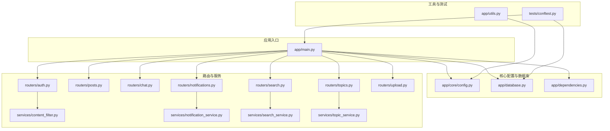
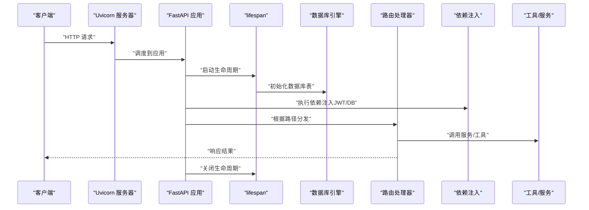
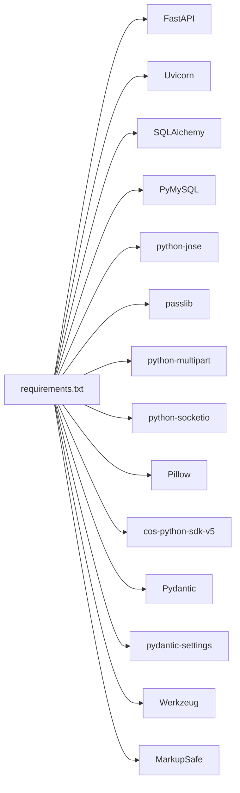

# 开发指南

<cite>
**本文引用的文件**
- [app/main.py](file://app/main.py)
- [requirements.txt](file://requirements.txt)
- [app/core/config.py](file://app/core/config.py)
- [app/database.py](file://app/database.py)
- [app/dependencies.py](file://app/dependencies.py)
- [app/utils.py](file://app/utils.py)
- [error_analysis.md](file://error_analysis.md)
- [tests/conftest.py](file://tests/conftest.py)
</cite>

## 目录
1. [简介](#简介)
2. [项目结构](#项目结构)
3. [核心组件](#核心组件)
4. [架构总览](#架构总览)
5. [详细组件分析](#详细组件分析)
6. [依赖分析](#依赖分析)
7. [性能考虑](#性能考虑)
8. [调试与故障排除](#调试与故障排除)
9. [结论](#结论)
10. [附录](#附录)

## 简介
本开发指南面向 NanTuPy 团队成员，目标是统一开发规范、提交流程与最佳实践，确保跨模块协作一致性与开发效率。内容涵盖代码规范、提交流程、开发工具与 IDE 设置、代码质量检查、新功能开发流程、代码审查标准、测试要求、调试技巧、错误分析与故障排除、性能分析与资源优化等。

## 项目结构
项目采用 FastAPI 架构，按功能域组织模块，核心目录如下：
- app/core：全局配置与安全配置
- app/database：数据库连接与会话管理
- app/dependencies：认证与权限依赖注入
- app/routers：各业务模块路由（如 auth、posts、chat、notifications、search、topics、upload、recommendations、blocks、reports、health、admin、comic）
- app/services：业务服务层（如 content_filter、content_moderation、image_optimizer、mention_service、notification_service、recommendation_service、search_service、topic_service）
- app/schemas：数据传输对象（Pydantic 模型）
- app/models：ORM 模型（SQLAlchemy）
- app/utils：工具类（如腾讯云 COS 文件上传）
- app/ws_manager.py：WebSocket 管理
- migrations：数据库迁移脚本
- tests：测试套件与测试配置
- 根目录：依赖声明、OpenAPI 文档、错误分析报告等

图表来源
- [app/main.py:1-110](file://app/main.py#L1-L110)
- [app/core/config.py:1-43](file://app/core/config.py#L1-L43)
- [app/database.py:1-38](file://app/database.py#L1-L38)
- [app/dependencies.py:1-63](file://app/dependencies.py#L1-L63)
- [app/utils.py:1-220](file://app/utils.py#L1-L220)
- [tests/conftest.py:1-155](file://tests/conftest.py#L1-L155)

章节来源
- [app/main.py:1-110](file://app/main.py#L1-L110)
- [requirements.txt:1-15](file://requirements.txt#L1-L15)

## 核心组件
- 应用入口与生命周期：通过 lifespan 管理数据库初始化与关闭；注册路由与中间件（CORS、COOP/COEP 安全头）。
- 配置系统：集中于 Config 类，包含安全密钥、数据库连接、上传限制、云存储配置、调试开关等。
- 数据库层：SQLAlchemy 引擎与 Session 管理，提供 get_db 依赖注入与 init_db 初始化。
- 认证与权限：基于 JWT 的 HTTP Bearer 认证，提供当前用户解析、可选用户解析与管理员权限校验。
- 工具与云存储：封装腾讯云 COS 客户端，提供预签名 URL、直接上传、确认上传、删除与文件信息查询。

章节来源
- [app/main.py:29-110](file://app/main.py#L29-L110)
- [app/core/config.py:7-43](file://app/core/config.py#L7-L43)
- [app/database.py:9-38](file://app/database.py#L9-L38)
- [app/dependencies.py:16-63](file://app/dependencies.py#L16-L63)
- [app/utils.py:14-220](file://app/utils.py#L14-L220)

## 架构总览
下图展示应用启动、中间件处理、路由分发与数据库交互的整体流程。

图表来源
- [app/main.py:29-110](file://app/main.py#L29-L110)
- [app/database.py:35-38](file://app/database.py#L35-L38)
- [app/dependencies.py:16-63](file://app/dependencies.py#L16-L63)

## 详细组件分析

### 应用入口与中间件
- 生命周期管理：在 lifespan 中进行数据库初始化与关闭日志记录。
- CORS 配置：使用正则允许来源以避免简单请求路径中的已知缺陷；同时设置 COOP/COEP 安全头以兼容 Flutter Web 的 SharedArrayBuffer。
- 路由注册：按模块注册 API 路由，并挂载 WebSocket 端点。

章节来源
- [app/main.py:29-110](file://app/main.py#L29-L110)

### 配置系统
- 安全与密钥：从环境变量读取 SECRET_KEY、JWT_SECRET_KEY。
- 数据库连接：构造 mysql+pymysql URI，配置连接池大小、溢出、回收与预检。
- 上传与扩展：定义上传目录、最大内容长度、允许的图片/视频扩展名集合。
- 云存储：COS_ID、COS_KEY、COS_REGION、COS_BUCKET、COS_BUCKET_NAME、COS_DOMAIN。
- 调试与测试：DEBUG、TESTING、CORS_HEADERS。

章节来源
- [app/core/config.py:7-43](file://app/core/config.py#L7-L43)

### 数据库层
- 引擎与会话：基于配置创建引擎，使用 sessionmaker 创建 SessionLocal，定义 Base。
- 依赖注入：get_db 提供数据库会话，自动 commit/rollback/关闭。
- 初始化：init_db 创建所有表。

章节来源
- [app/database.py:9-38](file://app/database.py#L9-L38)

### 认证与权限依赖
- 当前用户：从 Authorization Bearer 解析 JWT，校验失败抛出 401；查询用户并返回。
- 可选用户：解析失败返回 None。
- 管理员：校验 is_admin，否则 403。

章节来源
- [app/dependencies.py:16-63](file://app/dependencies.py#L16-L63)

### 工具与云存储
- 单例 COS 客户端：按需初始化，避免重复创建。
- 预签名 URL：生成上传 URL、访问 URL 与 COS Key。
- 确认上传：复制临时对象为最终对象并删除临时对象。
- 删除与查询：支持按 URL 删除与获取文件元信息。
- 直接上传：读取 UploadFile 内容并上传至 COS。

章节来源
- [app/utils.py:14-220](file://app/utils.py#L14-L220)

### 测试配置
- TestClient：提供 FastAPI 测试客户端。
- 会话服务器：在后台线程启动 uvicorn，等待健康检查成功。
- 认证令牌：注册/登录获取 JWT，回退策略与跳过条件。
- 数据库会话：SessionLocal 提供测试用会话。
- 上传图片：生成测试图片并上传，返回 URL。
- 默认搜索关键词：提供测试查询。

章节来源
- [tests/conftest.py:23-155](file://tests/conftest.py#L23-L155)

## 依赖分析
- 运行时依赖：FastAPI、Uvicorn、SQLAlchemy、PyMySQL、python-jose、passlib、python-multipart、python-socketio、Pillow、cos-python-sdk-v5、Pydantic、pydantic-settings、Werkzeug、MarkupSafe。
- 依赖注入与路由：FastAPI 提供依赖注入与路由注册；SQLAlchemy 提供 ORM 与会话管理；Pydantic 用于数据验证与序列化。

图表来源
- [requirements.txt:1-15](file://requirements.txt#L1-L15)

章节来源
- [requirements.txt:1-15](file://requirements.txt#L1-L15)

## 性能考虑
- 连接池配置：合理设置 pool_size、max_overflow、pool_recycle、pool_pre_ping，降低连接抖动与超时风险。
- 上传与存储：优先使用预签名直传，减少服务端带宽与 CPU；对大文件启用分片或断点续传策略（如需）。
- 日志与中间件：避免在生产开启过多 debug 日志；CORS 正则允许来源避免不必要的头部冲突。
- WebSocket：控制并发连接数与消息大小，及时清理无效连接。
- ORM 查询：批量操作与索引优化，避免 N+1 查询；必要时使用原生 SQL 或分页。

## 调试与故障排除

### 常见错误与定位
- 模型与数据库列不一致：导致 500（AttributeError）、列名不匹配、约束不一致等问题。详见“错误分析报告”。
- 缺少 to_dict 方法：多处路由调用 to_dict 导致 500。
- 路由与测试不匹配：测试脚本仍沿用 Flask 路径，FastAPI 已变更。
- Pydantic Schema 不匹配：RegisterRequest 缺少字段导致 422。
- db.case() 用法错误：db 为 Session，应导入 sqlalchemy.case。
- 评论模型缺少 reply_to_user_id：写入时报错。
- PostView 列名不匹配：viewed_at 与 created_at 不一致。

章节来源
- [error_analysis.md:8-304](file://error_analysis.md#L8-L304)

### 排查步骤
- 快速健康检查：访问 /health 确认服务可用。
- 查看日志：应用启动与关闭日志、文件日志与控制台日志。
- 数据库一致性核对：对照“错误分析报告”逐项修正模型与数据库列名、约束与方法。
- 依赖注入验证：确认 JWT 解码、用户查询与权限校验链路。
- 上传流程验证：先生成预签名 URL，再确认上传与删除流程。

章节来源
- [app/main.py:102-104](file://app/main.py#L102-L104)
- [app/database.py:22-32](file://app/database.py#L22-L32)
- [app/dependencies.py:20-36](file://app/dependencies.py#L20-L36)
- [app/utils.py:37-121](file://app/utils.py#L37-L121)

### 故障排除清单
- 模型列修正：Conversation、Message、Notification、Report、Topic、Comment、PostView。
- to_dict 方法补全：Friendship、Block、Like、Conversation、Message、Notification、Report。
- 代码逻辑修复：Comment.to_dict 参数、search.py 中 db.case()。
- 测试脚本与路由路径统一。

章节来源
- [error_analysis.md:256-275](file://error_analysis.md#L256-L275)

## 结论
本指南提供了从项目结构、核心组件到开发流程、测试与故障排除的完整实践框架。建议团队在开发中严格遵循命名约定与模块职责，持续完善模型与数据库一致性，强化依赖注入与中间件配置，结合测试与日志快速定位问题，并通过性能优化提升整体稳定性与用户体验。

## 附录

### 代码规范与命名约定
- 文件与模块：按功能域划分（core、routers、services、models、schemas、utils），文件名小写加下划线。
- 类与方法：类名使用 PascalCase，方法与变量使用 snake_case；私有成员以下划线前缀。
- 路由与依赖：路由前缀统一为 /api/{module}，依赖函数以 get_*、admin_required 命名。
- 配置：Config 类集中管理，环境变量键名全大写并带前缀（如 DB_、JWT_、COS_）。
- 错误处理：统一使用 HTTPException 抛出状态码与错误信息，避免裸异常。

### 提交流程与代码审查
- 分支策略：feature/* 开发分支，develop 合并基线，release/* 发布分支。
- 提交信息：type(scope): summary；例如 feat(auth): 新增 JWT 登录接口。
- 代码审查：至少一名 reviewer 通过，确保模型与数据库一致性、依赖注入正确性、测试覆盖与日志完整性。
- CI/CD：本地测试通过后推送，自动化运行 pytest 并检查覆盖率。

### 开发工具与 IDE 设置
- Python 版本：3.10+，虚拟环境隔离。
- IDE：VSCode（推荐），启用 Python 扩展、Pylance、Black、Ruff、Pytest 插件。
- Lint 与格式化：Ruff（lint）、Black（格式化）、isort（导入排序）。
- 调试：使用 FastAPI 的调试模式与 Uvicorn reload；为测试准备独立端口与配置。
- 数据库：本地 MySQL 与 Docker Compose（如需），保持与生产配置一致。

### 测试要求
- 单元测试：覆盖核心依赖（get_db、get_current_user）、工具类（FileUploader）。
- 集成测试：使用 TestClient 与真实数据库会话；使用 conftest 提供 token、client、db、image_url、search_query。
- 端到端测试：覆盖关键流程（注册/登录、上传、聊天、通知、搜索、话题、举报、好友、互动、帖子视图）。
- 覆盖率：关键路径覆盖率不低于 80%，模型与服务层不低于 90%。

### 新功能开发流程
- 需求评审：明确接口、数据模型与数据库变更。
- 设计阶段：定义 Pydantic Schema、ORM 模型、路由与服务层。
- 开发阶段：先实现模型与数据库迁移，再实现服务与路由，最后补充测试。
- 审查与合并：代码审查通过后合并至 develop，发布前回归测试。

### 性能分析与资源优化
- 数据库：连接池参数调优、索引优化、慢查询日志分析。
- 上传与存储：预签名直传、CDN 加速、压缩策略（图片/视频）。
- 日志：异步写入、滚动清理、采样与脱敏。
- 内存管理：及时关闭数据库会话与文件句柄，避免循环引用。
- WebSocket：限流、心跳检测、消息压缩与广播优化。