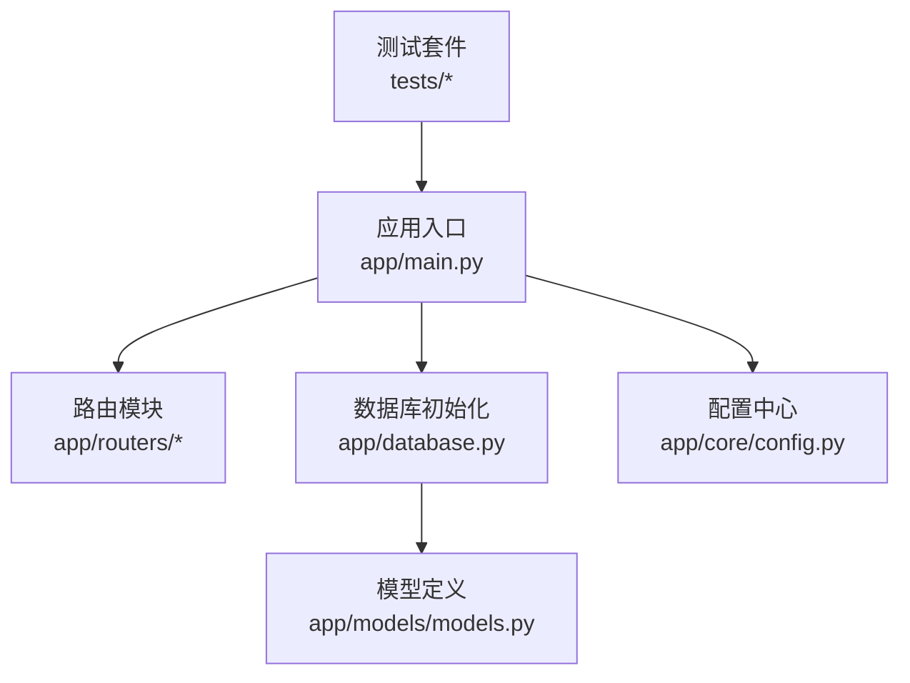
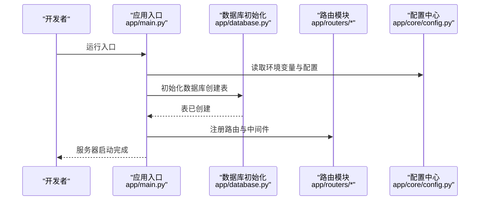
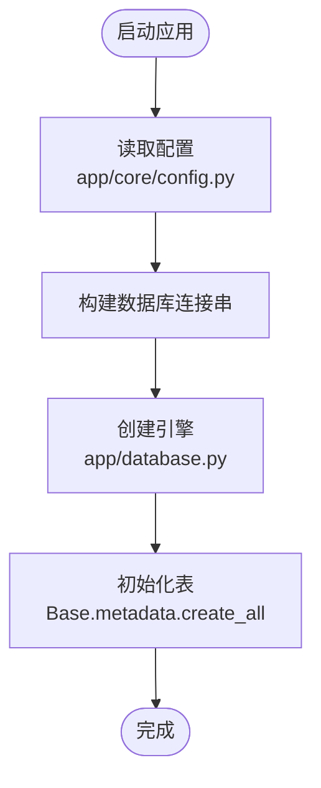
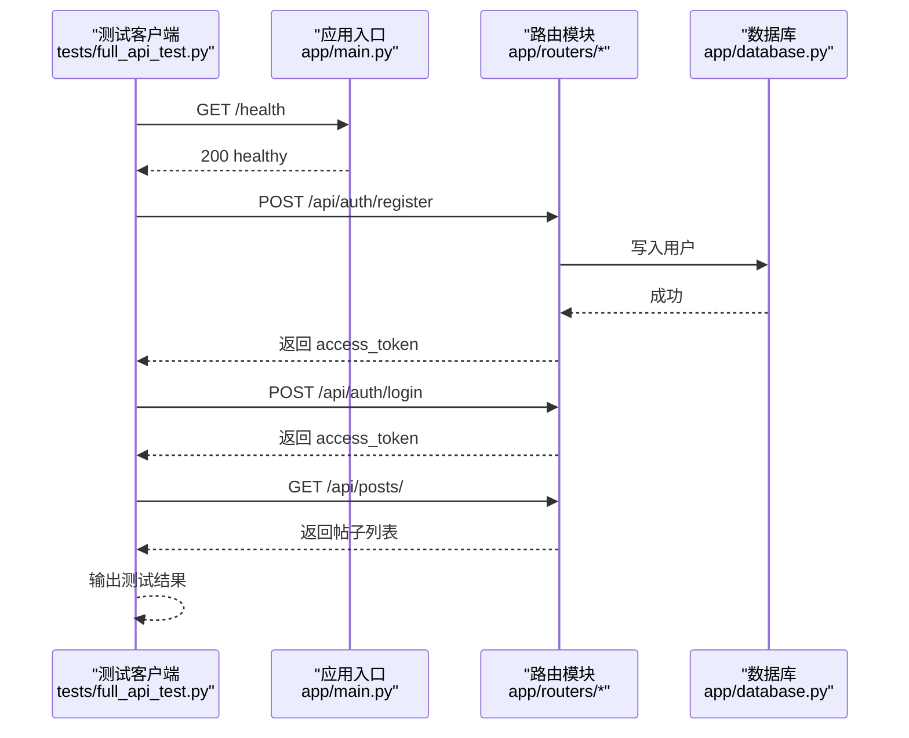
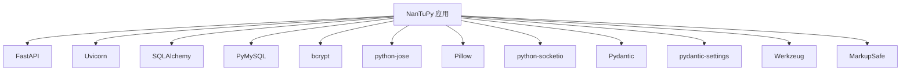

# 快速开始

<cite>
**本文引用的文件**   
- [requirements.txt](file://requirements.txt)
- [app/main.py](file://app/main.py)
- [app/core/config.py](file://app/core/config.py)
- [app/database.py](file://app/database.py)
- [app/models/models.py](file://app/models/models.py)
- [app/routers/auth.py](file://app/routers/auth.py)
- [app/routers/posts.py](file://app/routers/posts.py)
- [tests/README_TESTS.md](file://tests/README_TESTS.md)
- [tests/conftest.py](file://tests/conftest.py)
- [tests/full_api_test.py](file://tests/full_api_test.py)
- [comic_tables.sql](file://comic_tables.sql)
- [migrations/add_ws_protocol_tables.sql](file://migrations/add_ws_protocol_tables.sql)
</cite>

## 目录
1. [简介](#简介)
2. [项目结构](#项目结构)
3. [核心组件](#核心组件)
4. [架构总览](#架构总览)
5. [详细组件分析](#详细组件分析)
6. [依赖分析](#依赖分析)
7. [性能考虑](#性能考虑)
8. [故障排查指南](#故障排查指南)
9. [结论](#结论)
10. [附录](#附录)

## 简介
本指南面向新加入的开发者，帮助你在最短时间内完成环境搭建、数据库配置、依赖安装与开发服务器启动，并进行基础 API 功能验证。你将学会：
- 如何准备 Python 环境与依赖
- 如何配置数据库连接与环境变量
- 如何启动开发服务器
- 如何使用提供的测试脚本验证核心功能
- 常见环境问题与解决方案

## 项目结构
该项目采用 FastAPI 架构，核心模块包括：
- 应用入口与路由注册：app/main.py
- 配置中心：app/core/config.py
- 数据库与 ORM：app/database.py、app/models/models.py
- 路由模块：app/routers/*（认证、帖子、好友、通知、搜索、话题、上传、推荐、屏蔽、举报、漫画、健康检查、管理员等）
- 测试套件：tests/*（包含自动化测试与使用说明）

图表来源
- [app/main.py:1-110](file://app/main.py#L1-L110)
- [app/database.py:1-38](file://app/database.py#L1-L38)
- [app/core/config.py:1-43](file://app/core/config.py#L1-L43)
- [app/models/models.py:1-655](file://app/models/models.py#L1-L655)

章节来源
- [app/main.py:1-110](file://app/main.py#L1-L110)
- [app/core/config.py:1-43](file://app/core/config.py#L1-L43)
- [app/database.py:1-38](file://app/database.py#L1-L38)
- [app/models/models.py:1-655](file://app/models/models.py#L1-L655)

## 核心组件
- 应用入口与生命周期：负责加载环境变量、注册路由、设置 CORS 与安全响应头、数据库初始化与关闭。
- 配置中心：集中管理数据库连接、JWT 密钥、上传限制、云存储参数等。
- 数据库层：基于 SQLAlchemy 2.0+，提供同步引擎、Session 与表初始化。
- 路由模块：按功能划分，提供认证、帖子、好友、通知、搜索、话题、上传、推荐、屏蔽、举报、漫画、健康检查、管理员等接口。
- 测试套件：提供健康检查、认证、帖子、互动、好友、聊天、通知、搜索、话题、上传、推荐、屏蔽、举报、漫画、WebSocket 等全量测试。

章节来源
- [app/main.py:1-110](file://app/main.py#L1-L110)
- [app/core/config.py:1-43](file://app/core/config.py#L1-L43)
- [app/database.py:1-38](file://app/database.py#L1-L38)
- [app/routers/auth.py:1-200](file://app/routers/auth.py#L1-L200)
- [app/routers/posts.py:1-200](file://app/routers/posts.py#L1-L200)
- [tests/README_TESTS.md:1-189](file://tests/README_TESTS.md#L1-L189)

## 架构总览
下面的时序图展示了从启动应用到数据库初始化与路由注册的整体流程：

图表来源
- [app/main.py:29-84](file://app/main.py#L29-L84)
- [app/database.py:35-38](file://app/database.py#L35-L38)
- [app/core/config.py:12-20](file://app/core/config.py#L12-L20)

章节来源
- [app/main.py:29-84](file://app/main.py#L29-L84)
- [app/database.py:35-38](file://app/database.py#L35-L38)
- [app/core/config.py:12-20](file://app/core/config.py#L12-L20)

## 详细组件分析

### 环境与依赖准备
- Python 版本要求：请使用 Python 3.8 或以上版本以确保兼容 FastAPI 与相关依赖。
- 安装依赖：使用提供的依赖清单安装所有必要包。
- 依赖清单参考：[requirements.txt](file://requirements.txt)

章节来源
- [requirements.txt:1-15](file://requirements.txt#L1-L15)

### 数据库配置与初始化
- 连接字符串：配置中心提供基于环境变量的数据库连接串模板，支持用户名、密码、主机、端口与数据库名。
- 引擎与池化：数据库模块使用 SQLAlchemy 创建引擎，启用池大小、预热与回收策略。
- 表初始化：应用启动时自动创建所有表；同时提供漫画与 WebSocket 协议相关的迁移脚本。

图表来源
- [app/core/config.py:12-20](file://app/core/config.py#L12-L20)
- [app/database.py:9-19](file://app/database.py#L9-L19)
- [app/database.py:35-38](file://app/database.py#L35-L38)

章节来源
- [app/core/config.py:12-20](file://app/core/config.py#L12-L20)
- [app/database.py:9-19](file://app/database.py#L9-L19)
- [app/database.py:35-38](file://app/database.py#L35-L38)
- [comic_tables.sql:1-68](file://comic_tables.sql#L1-L68)
- [migrations/add_ws_protocol_tables.sql:1-32](file://migrations/add_ws_protocol_tables.sql#L1-L32)

### 环境变量与配置项
- 安全与 JWT：SECRET_KEY、JWT_SECRET_KEY
- 数据库：DB_USER、DB_PASS、DB_HOST、DB_PORT、DB_NAME
- 上传与扩展名：UPLOAD_FOLDER、ALLOWED_EXTENSIONS
- 云存储（COS）：COS_ID、COS_KEY、COS_REGION、COS_BUCKET、COS_BUCKET_NAME、COS_DOMAIN
- 其他：DEBUG、MAX_CONTENT_LENGTH

章节来源
- [app/core/config.py:7-43](file://app/core/config.py#L7-L43)

### 开发服务器启动
- 默认监听：0.0.0.0:5000
- 启动方式：直接运行应用入口文件或使用 Uvicorn 启动器
- 健康检查：根路径与 /health 均可验证服务可用性

章节来源
- [app/main.py:107-110](file://app/main.py#L107-L110)
- [app/main.py:87-104](file://app/main.py#L87-L104)

### API 基础测试与验证
- 使用测试套件进行全量验证，覆盖认证、帖子、互动、好友、聊天、通知、搜索、话题、上传、推荐、屏蔽、举报、漫画、WebSocket 等模块。
- 测试脚本会自动注册测试用户、登录获取 Token，并对各端点发起请求，最终输出测试结果统计。

图表来源
- [tests/full_api_test.py:141-213](file://tests/full_api_test.py#L141-L213)
- [tests/full_api_test.py:219-256](file://tests/full_api_test.py#L219-L256)
- [app/main.py:102-104](file://app/main.py#L102-L104)

章节来源
- [tests/README_TESTS.md:23-67](file://tests/README_TESTS.md#L23-L67)
- [tests/full_api_test.py:141-213](file://tests/full_api_test.py#L141-L213)
- [tests/full_api_test.py:219-256](file://tests/full_api_test.py#L219-L256)
- [app/main.py:102-104](file://app/main.py#L102-L104)

## 依赖分析
- 应用依赖：FastAPI、Uvicorn、SQLAlchemy、PyMySQL、bcrypt、JWE、Pillow、SocketIO、Pydantic、Werkzeug、MarkupSafe 等。
- 测试依赖：requests、pytest、websockets（WebSocket 测试）、Pillow（图片上传测试）。

图表来源
- [requirements.txt:1-15](file://requirements.txt#L1-L15)

章节来源
- [requirements.txt:1-15](file://requirements.txt#L1-L15)

## 性能考虑
- 数据库连接池：通过池大小与回收策略降低连接开销，提升并发能力。
- 图片优化：上传图片前进行压缩优化，减少存储与网络传输压力。
- 分页与批量加载：帖子列表与推荐模块采用分页与批量数据加载，避免一次性查询过多数据。
- WebSocket 序号与去重：提供消息序号、ACK 去重与日志清理策略，保障长连接稳定性。

章节来源
- [app/database.py:9-19](file://app/database.py#L9-L19)
- [app/routers/posts.py:59-78](file://app/routers/posts.py#L59-L78)
- [migrations/add_ws_protocol_tables.sql:1-32](file://migrations/add_ws_protocol_tables.sql#L1-L32)

## 故障排查指南
- 无法连接数据库
  - 检查环境变量 DB_HOST、DB_PORT、DB_USER、DB_PASS、DB_NAME 是否正确。
  - 确认数据库服务已启动且网络可达。
- 服务器启动后访问 404 或无响应
  - 确认应用在 0.0.0.0:5000 监听，或修改启动参数。
  - 使用 /health 或根路径 / 验证服务状态。
- 认证失败或 Token 无效
  - 确认注册与登录流程正常，检查邮箱与密码格式。
  - 检查 JWT_SECRET_KEY 与 SECRET_KEY 是否设置。
- 上传失败或图片过大
  - 确认 MAX_CONTENT_LENGTH 与 ALLOWED_EXTENSIONS 设置。
  - 使用优化后的图片尺寸与格式。
- WebSocket 连接失败
  - 确认已安装 websockets 库并具备有效 Token。
  - 检查 WebSocket 路由与认证逻辑。

章节来源
- [app/core/config.py:12-20](file://app/core/config.py#L12-L20)
- [app/main.py:107-110](file://app/main.py#L107-L110)
- [app/routers/auth.py:184-200](file://app/routers/auth.py#L184-L200)
- [app/routers/posts.py:54-78](file://app/routers/posts.py#L54-L78)
- [tests/full_api_test.py:568-615](file://tests/full_api_test.py#L568-L615)

## 结论
按照本指南完成环境与依赖准备、数据库配置与服务器启动后，你可以使用测试套件快速验证核心功能。建议在本地开发环境中先运行健康检查与认证流程，再逐步验证其他模块，以便快速定位问题并及时修复。

## 附录

### 快速操作清单
- 安装依赖：pip install -r requirements.txt
- 设置环境变量：DB_HOST、DB_PORT、DB_USER、DB_PASS、DB_NAME、JWT_SECRET_KEY、SECRET_KEY
- 启动服务器：python app/main.py 或 uvicorn 运行入口
- 健康检查：GET http://localhost:5000/health
- 运行测试：python tests/full_api_test.py

章节来源
- [requirements.txt:1-15](file://requirements.txt#L1-L15)
- [app/main.py:107-110](file://app/main.py#L107-L110)
- [tests/full_api_test.py:688-729](file://tests/full_api_test.py#L688-L729)