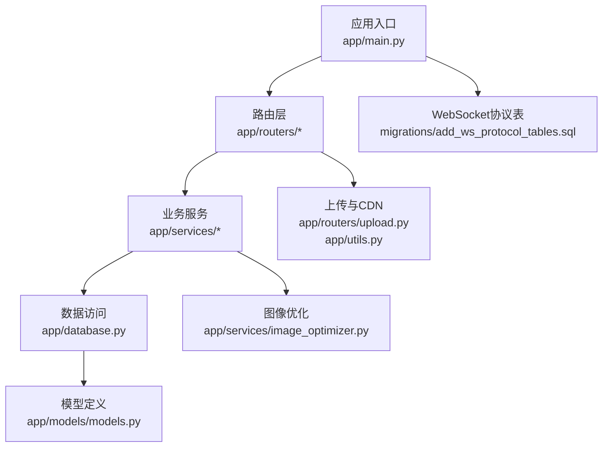
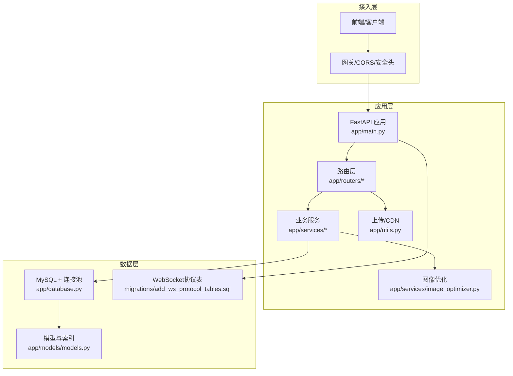
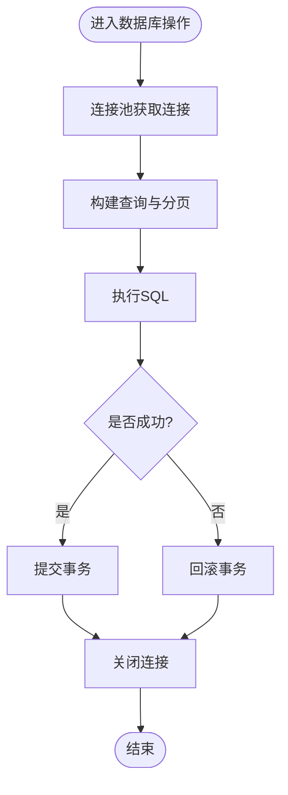
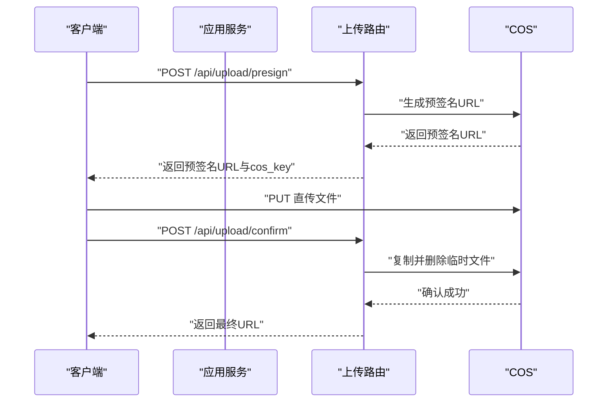
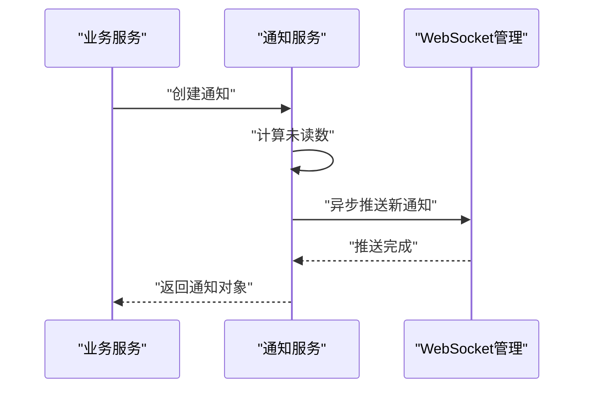
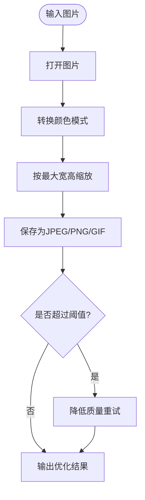
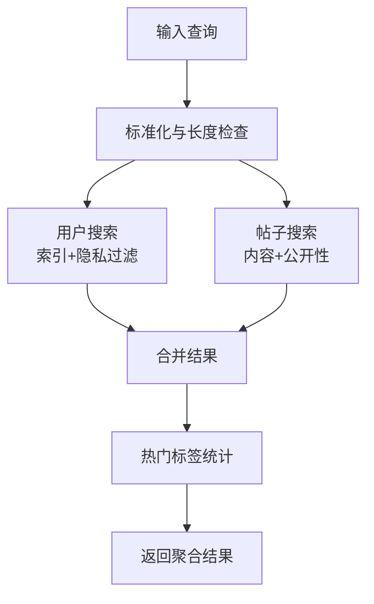
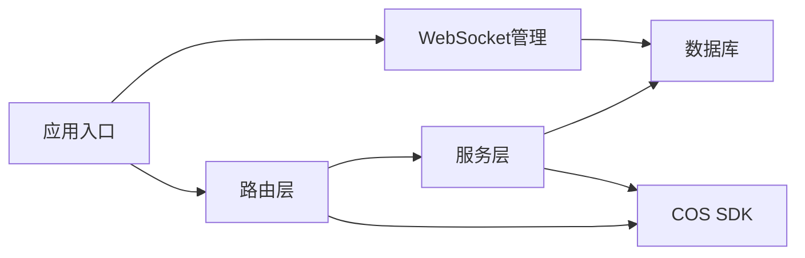

# 性能优化

<cite>
**本文引用的文件**
- [app/main.py](file://app/main.py)
- [app/database.py](file://app/database.py)
- [app/core/config.py](file://app/core/config.py)
- [app/models/models.py](file://app/models/models.py)
- [app/services/search_service.py](file://app/services/search_service.py)
- [app/routers/search.py](file://app/routers/search.py)
- [app/services/image_optimizer.py](file://app/services/image_optimizer.py)
- [app/routers/upload.py](file://app/routers/upload.py)
- [app/utils.py](file://app/utils.py)
- [app/services/notification_service.py](file://app/services/notification_service.py)
- [app/ws_manager.py](file://app/ws_manager.py)
- [migrations/add_ws_protocol_tables.sql](file://migrations/add_ws_protocol_tables.sql)
- [tests/diagnose_search.py](file://tests/diagnose_search.py)
- [tests/diagnose_websocket.py](file://tests/diagnose_websocket.py)
</cite>

## 目录
1. [简介](#简介)
2. [项目结构](#项目结构)
3. [核心组件](#核心组件)
4. [架构总览](#架构总览)
5. [详细组件分析](#详细组件分析)
6. [依赖分析](#依赖分析)
7. [性能考量](#性能考量)
8. [故障排查指南](#故障排查指南)
9. [结论](#结论)
10. [附录](#附录)

## 简介
本指南面向NanTuPy项目的性能优化，聚焦数据库查询优化、缓存策略、异步处理、图像优化服务、搜索性能调优、资源管理与CDN集成、WebSocket协议与队列管理、性能监控与瓶颈定位、以及持续优化流程。目标是在高并发与高负载场景下，保持系统稳定与高效。

## 项目结构
NanTuPy采用FastAPI + SQLAlchemy 2.x + MySQL的后端架构，核心模块包括：
- 应用入口与中间件：路由注册、CORS、安全头、生命周期管理
- 数据层：连接池配置、会话管理、模型定义与索引
- 业务服务：搜索、推荐、通知、图像优化、上传与CDN
- 路由层：API接口与参数校验
- WebSocket：协议表与去重、序号管理
- 测试诊断：搜索与WebSocket诊断脚本

**图表来源**
- [app/main.py:39-84](file://app/main.py#L39-L84)
- [app/database.py:9-38](file://app/database.py#L9-L38)
- [app/models/models.py:42-184](file://app/models/models.py#L42-L184)
- [app/routers/search.py:17-269](file://app/routers/search.py#L17-L269)
- [app/routers/upload.py:50-224](file://app/routers/upload.py#L50-L224)
- [app/services/image_optimizer.py:6-230](file://app/services/image_optimizer.py#L6-L230)
- [migrations/add_ws_protocol_tables.sql:1-31](file://migrations/add_ws_protocol_tables.sql#L1-L31)

**章节来源**
- [app/main.py:39-84](file://app/main.py#L39-L84)
- [app/database.py:9-38](file://app/database.py#L9-L38)
- [app/models/models.py:42-184](file://app/models/models.py#L42-L184)
- [app/routers/search.py:17-269](file://app/routers/search.py#L17-L269)
- [app/routers/upload.py:50-224](file://app/routers/upload.py#L50-L224)
- [app/services/image_optimizer.py:6-230](file://app/services/image_optimizer.py#L6-L230)
- [migrations/add_ws_protocol_tables.sql:1-31](file://migrations/add_ws_protocol_tables.sql#L1-L31)

## 核心组件
- 应用入口与中间件：注册路由、CORS、COOP/COEP安全头、健康检查
- 数据库连接池：池大小、溢出、回收、预检
- 搜索服务：用户/帖子/全局搜索、热门标签、自动补全
- 上传与CDN：预签名URL、确认上传、删除、信息查询
- 图像优化：压缩、缩放、缩略图、信息获取
- 通知与WebSocket：异步推送、去重、序号管理

**章节来源**
- [app/main.py:39-104](file://app/main.py#L39-L104)
- [app/database.py:9-38](file://app/database.py#L9-L38)
- [app/services/search_service.py:9-179](file://app/services/search_service.py#L9-L179)
- [app/routers/upload.py:50-224](file://app/routers/upload.py#L50-L224)
- [app/services/image_optimizer.py:6-230](file://app/services/image_optimizer.py#L6-L230)
- [app/services/notification_service.py:14-84](file://app/services/notification_service.py#L14-L84)
- [app/ws_manager.py:249-290](file://app/ws_manager.py#L249-L290)

## 架构总览
NanTuPy的性能相关架构要点：
- 使用SQLAlchemy同步引擎与Session，配合连接池参数控制并发与资源占用
- 搜索服务通过索引字段与分页避免全表扫描
- 上传采用客户端直传CDN，服务端仅负责预签名与确认重命名
- 图像优化在服务端进行，结合内存流与条件降质策略
- WebSocket协议表保障断线补发与幂等，减少重复处理

**图表来源**
- [app/main.py:39-84](file://app/main.py#L39-L84)
- [app/database.py:9-38](file://app/database.py#L9-L38)
- [app/models/models.py:42-184](file://app/models/models.py#L42-L184)
- [app/routers/upload.py:50-224](file://app/routers/upload.py#L50-L224)
- [app/utils.py:14-220](file://app/utils.py#L14-L220)
- [app/services/image_optimizer.py:6-230](file://app/services/image_optimizer.py#L6-L230)
- [migrations/add_ws_protocol_tables.sql:1-31](file://migrations/add_ws_protocol_tables.sql#L1-L31)

## 详细组件分析

### 数据库查询优化与连接池
- 连接池配置
  - 池大小、溢出、回收时间、连接前预检，减少连接创建开销与超时
  - 通过配置项集中管理，便于横向扩展
- 查询优化
  - 模型中大量使用索引字段（用户名、邮箱、时间戳、外键），减少排序与过滤成本
  - 分页查询避免一次性加载大量数据
  - 使用count替代昂贵统计时，注意在高并发下使用合适的隔离级别与锁策略
- 查询计划分析
  - 建议在生产环境开启慢查询日志与EXPLAIN分析，针对热点SQL制定索引策略
  - 对频繁组合条件的查询，考虑复合索引与覆盖索引

**图表来源**
- [app/database.py:22-32](file://app/database.py#L22-L32)
- [app/models/models.py:47-110](file://app/models/models.py#L47-L110)

**章节来源**
- [app/database.py:9-38](file://app/database.py#L9-L38)
- [app/core/config.py:12-20](file://app/core/config.py#L12-L20)
- [app/models/models.py:47-110](file://app/models/models.py#L47-L110)

### 缓存策略与CDN集成
- 缓存策略设计
  - 页面级缓存：对不常变的列表（如热门标签、话题列表）增加短期缓存
  - 结果集缓存：对热点搜索结果与推荐结果进行缓存，设置合理TTL
  - 去重与一致性：缓存失效策略与版本号/ETag结合，避免脏读
- CDN集成
  - 客户端直传：生成预签名URL，直接上传至COS，服务端仅做确认与重命名
  - 访问加速：通过域名或COS提供的访问域名提供静态资源
  - 清理策略：定期清理过期缓存与临时文件，控制存储成本

**图表来源**
- [app/routers/upload.py:50-107](file://app/routers/upload.py#L50-L107)
- [app/utils.py:37-77](file://app/utils.py#L37-L77)
- [app/utils.py:80-121](file://app/utils.py#L80-L121)

**章节来源**
- [app/routers/upload.py:50-107](file://app/routers/upload.py#L50-L107)
- [app/utils.py:14-220](file://app/utils.py#L14-L220)

### 异步处理与WebSocket
- 异步推送通知
  - 通知创建后异步推送至WebSocket，避免阻塞主流程
  - 使用事件循环检测与ensure_future/run适配不同运行环境
- WebSocket协议
  - 消息序号表与ACK去重表保障断线补发与幂等
  - 定时清理策略减少历史数据膨胀

**图表来源**
- [app/services/notification_service.py:20-53](file://app/services/notification_service.py#L20-L53)
- [app/ws_manager.py:249-290](file://app/ws_manager.py#L249-L290)
- [migrations/add_ws_protocol_tables.sql:1-31](file://migrations/add_ws_protocol_tables.sql#L1-L31)

**章节来源**
- [app/services/notification_service.py:14-84](file://app/services/notification_service.py#L14-L84)
- [app/ws_manager.py:249-290](file://app/ws_manager.py#L249-L290)
- [migrations/add_ws_protocol_tables.sql:1-31](file://migrations/add_ws_protocol_tables.sql#L1-L31)

### 图像优化服务
- 压缩与缩放
  - 自动转换颜色模式、按最大宽高缩放、JPEG渐进式与优化参数
  - 当超过文件大小阈值时动态降质，保证输出尺寸可控
- 缩略图生成
  - 保持纵横比，统一输出质量，适合列表与预览
- 图像信息获取
  - 读取尺寸、格式、模式与文件大小，便于前端展示与裁剪

**图表来源**
- [app/services/image_optimizer.py:16-112](file://app/services/image_optimizer.py#L16-L112)
- [app/services/image_optimizer.py:115-160](file://app/services/image_optimizer.py#L115-L160)
- [app/services/image_optimizer.py:199-230](file://app/services/image_optimizer.py#L199-L230)

**章节来源**
- [app/services/image_optimizer.py:6-230](file://app/services/image_optimizer.py#L6-L230)

### 搜索性能调优
- 用户搜索
  - 支持用户名与邮箱模糊匹配，结合隐私字段过滤
  - 使用索引字段与排序规则，避免全表扫描
- 帖子搜索
  - 内容模糊匹配与公开性过滤，分页与批量序列化减少N+1
- 全局搜索
  - 组合用户与帖子结果，聚合总数
- 热门标签
  - 基于最近帖子统计，内存内聚合与排序
- 自动补全
  - 前缀匹配与限制数量，避免高延迟

**图表来源**
- [app/services/search_service.py:13-51](file://app/services/search_service.py#L13-L51)
- [app/services/search_service.py:63-89](file://app/services/search_service.py#L63-L89)
- [app/services/search_service.py:92-111](file://app/services/search_service.py#L92-L111)
- [app/services/search_service.py:141-157](file://app/services/search_service.py#L141-L157)
- [app/routers/search.py:17-104](file://app/routers/search.py#L17-L104)

**章节来源**
- [app/services/search_service.py:9-179](file://app/services/search_service.py#L9-L179)
- [app/routers/search.py:17-269](file://app/routers/search.py#L17-L269)

### 资源管理最佳实践
- 文件上传
  - 严格扩展名与内容类型映射，防止恶意文件
  - 生成唯一文件名与日期目录结构，便于CDN缓存与清理
- 删除与重命名
  - 复制后删除临时文件，确保原子性
- 信息查询
  - HEAD请求获取元信息，避免下载大文件

**章节来源**
- [app/routers/upload.py:19-48](file://app/routers/upload.py#L19-L48)
- [app/utils.py:37-121](file://app/utils.py#L37-L121)
- [app/utils.py:190-220](file://app/utils.py#L190-L220)

## 依赖分析
- 组件耦合
  - 路由层依赖服务层；服务层依赖数据库会话；上传依赖COS SDK
  - WebSocket协议表独立于业务逻辑，通过管理器交互
- 外部依赖
  - PyMySQL/SQLAlchemy、腾讯云COS SDK、Pillow（图像处理）

**图表来源**
- [app/main.py:68-84](file://app/main.py#L68-L84)
- [app/routers/search.py:9-12](file://app/routers/search.py#L9-L12)
- [app/utils.py:14-28](file://app/utils.py#L14-L28)
- [app/ws_manager.py:249-290](file://app/ws_manager.py#L249-L290)

**章节来源**
- [app/main.py:68-84](file://app/main.py#L68-L84)
- [app/routers/search.py:9-12](file://app/routers/search.py#L9-L12)
- [app/utils.py:14-28](file://app/utils.py#L14-L28)
- [app/ws_manager.py:249-290](file://app/ws_manager.py#L249-L290)

## 性能考量
- 数据库
  - 连接池参数：根据QPS与峰值并发调整池大小与溢出
  - 索引策略：基于查询模式建立复合索引，避免全表扫描
  - 分页与COUNT：对高并发场景使用“多取一条判断has_more”减少昂贵统计
- 缓存与CDN
  - 对热点内容设置短TTL，结合ETag/版本号实现一致性
  - CDN缓存命中率与边缘节点选择影响响应时间
- 异步与并发
  - 通知与WebSocket推送异步化，避免阻塞请求链路
  - 事件循环适配不同运行环境，确保稳定性
- 图像优化
  - 控制最大宽高与质量阈值，避免过大图片导致内存压力
  - 缩略图与原图分离，提升列表渲染效率
- WebSocket
  - 序号与去重表减少重复处理，定期清理降低存储与查询压力

[本节为通用指导，无需列出具体文件来源]

## 故障排查指南
- 搜索异常
  - 使用诊断脚本定位慢查询与索引缺失
  - 检查分页参数与隐私过滤条件
- WebSocket问题
  - 核对序号与ACK去重表状态，确认断线补发逻辑
  - 观察管理器中的去重记录清理策略
- 上传失败
  - 检查COS配置、预签名URL有效期与权限
  - 确认确认上传的cos_key与最终URL映射

**章节来源**
- [tests/diagnose_search.py](file://tests/diagnose_search.py)
- [tests/diagnose_websocket.py](file://tests/diagnose_websocket.py)
- [app/ws_manager.py:249-290](file://app/ws_manager.py#L249-L290)

## 结论
通过合理的数据库索引与连接池配置、CDN直传与缓存策略、图像优化与异步推送、以及WebSocket协议表与定期清理，NanTuPy可在高负载下保持稳定与高效。建议持续进行性能监控、基准测试与回归验证，形成闭环优化流程。

[本节为总结，无需列出具体文件来源]

## 附录
- 性能监控指标建议
  - 数据库：连接池利用率、慢查询数、平均响应时间、锁等待
  - 应用：请求QPS、P95/P99延迟、错误率、GC频率
  - 上传与CDN：预签名成功率、直传失败率、带宽与对象数
  - WebSocket：消息吞吐、去重命中率、断线补发次数
- 基准测试与持续优化
  - 使用压测工具模拟峰值流量，观察指标变化
  - 建立A/B测试对比优化效果，逐步迭代

[本节为通用指导，无需列出具体文件来源]