# 扩展开发

<cite>
**本文引用的文件**
- [app/main.py](file://app/main.py)
- [app/database.py](file://app/database.py)
- [app/models/models.py](file://app/models/models.py)
- [app/dependencies.py](file://app/dependencies.py)
- [app/routers/admin.py](file://app/routers/admin.py)
- [app/routers/upload.py](file://app/routers/upload.py)
- [app/routers/auth.py](file://app/routers/auth.py)
- [app/routers/posts.py](file://app/routers/posts.py)
- [app/services/notification_service.py](file://app/services/notification_service.py)
- [app/services/content_filter.py](file://app/services/content_filter.py)
- [app/utils.py](file://app/utils.py)
- [app/ws_manager.py](file://app/ws_manager.py)
- [app/core/config.py](file://app/core/config.py)
- [requirements.txt](file://requirements.txt)
</cite>

## 目录
1. [简介](#简介)
2. [项目结构](#项目结构)
3. [核心组件](#核心组件)
4. [架构总览](#架构总览)
5. [详细组件分析](#详细组件分析)
6. [依赖分析](#依赖分析)
7. [性能考量](#性能考量)
8. [故障排查指南](#故障排查指南)
9. [结论](#结论)
10. [附录](#附录)

## 简介
本指南面向希望在 NanTuPy 上进行扩展开发的工程师，覆盖插件开发方法、新功能添加与第三方集成、服务模块扩展、API 接口扩展、数据库模型扩展、扩展点识别、接口设计与集成模式、管理员功能开发、文件上传处理、特殊服务实现、最佳实践、代码组织、测试策略、部署与版本管理、兼容性考虑、性能影响评估与安全建议。目标是帮助你在保证灵活性与可维护性的前提下，快速、安全地扩展系统能力。

## 项目结构
NanTuPy 基于 FastAPI 构建，采用分层清晰的目录组织：
- 应用入口与中间件：app/main.py
- 数据库与依赖注入：app/database.py、app/dependencies.py
- 数据模型：app/models/models.py
- 路由层：app/routers/*
- 服务层：app/services/*
- 工具与上传：app/utils.py
- WebSocket 管理：app/ws_manager.py
- 配置：app/core/config.py
- 依赖声明：requirements.txt

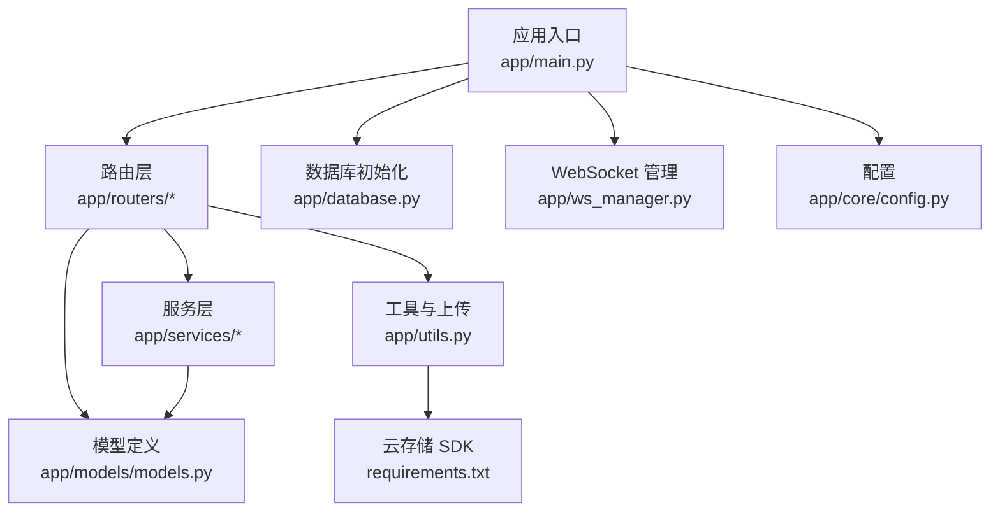

**图表来源**
- [app/main.py:1-110](file://app/main.py#L1-L110)
- [app/database.py:1-38](file://app/database.py#L1-L38)
- [app/models/models.py:1-655](file://app/models/models.py#L1-L655)
- [app/utils.py:1-220](file://app/utils.py#L1-L220)
- [app/ws_manager.py:1-308](file://app/ws_manager.py#L1-L308)
- [app/core/config.py:1-43](file://app/core/config.py#L1-L43)
- [requirements.txt:1-15](file://requirements.txt#L1-L15)

**章节来源**
- [app/main.py:1-110](file://app/main.py#L1-L110)
- [app/database.py:1-38](file://app/database.py#L1-L38)
- [app/models/models.py:1-655](file://app/models/models.py#L1-L655)
- [app/utils.py:1-220](file://app/utils.py#L1-L220)
- [app/ws_manager.py:1-308](file://app/ws_manager.py#L1-L308)
- [app/core/config.py:1-43](file://app/core/config.py#L1-L43)
- [requirements.txt:1-15](file://requirements.txt#L1-L15)

## 核心组件
- 应用入口与生命周期：负责初始化数据库、注册路由、设置中间件与安全头。
- 数据库与会话：基于 SQLAlchemy 2.x，提供依赖注入式 Session 获取与自动提交/回滚。
- 身份认证与权限：JWT 解析、可选认证、管理员权限校验。
- 路由与控制器：按功能域划分，如认证、帖子、上传、通知、推荐、搜索、漫展等。
- 服务层：封装业务逻辑，如通知推送、内容审核、话题/提及处理、推荐算法等。
- 工具与上传：统一的 FileUploader 封装 COS 预签名、确认、删除、直传等。
- WebSocket 管理：序号分配、断线补发、ACK 去重、会话广播。
- 配置中心：集中管理数据库、JWT、COS、文件上传等配置项。

**章节来源**
- [app/main.py:29-84](file://app/main.py#L29-L84)
- [app/database.py:22-38](file://app/database.py#L22-L38)
- [app/dependencies.py:16-62](file://app/dependencies.py#L16-L62)
- [app/core/config.py:7-43](file://app/core/config.py#L7-L43)

## 架构总览
NanTuPy 采用“路由-服务-模型-数据库”的分层架构，配合依赖注入与中间件，形成清晰的职责边界。WebSocket 作为实时通信扩展，通过独立管理器与服务层协作。

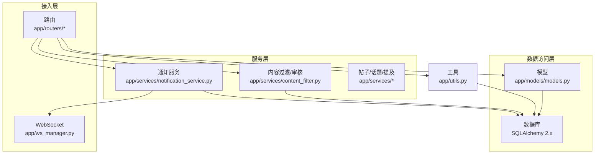

**图表来源**
- [app/routers/auth.py:1-486](file://app/routers/auth.py#L1-L486)
- [app/routers/posts.py:1-405](file://app/routers/posts.py#L1-L405)
- [app/routers/upload.py:1-224](file://app/routers/upload.py#L1-L224)
- [app/services/notification_service.py:14-233](file://app/services/notification_service.py#L14-L233)
- [app/services/content_filter.py:13-192](file://app/services/content_filter.py#L13-L192)
- [app/models/models.py:1-655](file://app/models/models.py#L1-L655)
- [app/utils.py:14-220](file://app/utils.py#L14-L220)
- [app/ws_manager.py:20-308](file://app/ws_manager.py#L20-L308)

## 详细组件分析

### 插件开发方法与扩展点识别
- 路由扩展：在 app/routers 下新增模块，定义 APIRouter 实例，使用依赖注入获取用户与数据库会话；在 app/main.py 中 include_router 注册。
- 服务扩展：在 app/services 下新增模块，封装业务逻辑，必要时通过依赖注入获取数据库会话；在路由中调用服务方法。
- 模型扩展：在 app/models/models.py 中新增 SQLAlchemy 模型，注意外键约束与索引；在 app/database.py 初始化时会自动创建表。
- 工具扩展：在 app/utils.py 中新增工具类或静态方法，统一接入第三方 SDK（如 COS）。
- 权限扩展：通过 app/dependencies.py 的依赖函数实现认证与授权，如 admin_required。

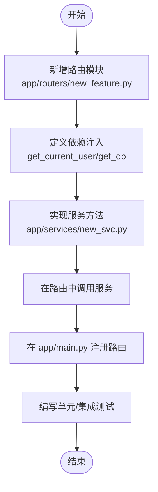

**章节来源**
- [app/main.py:68-84](file://app/main.py#L68-L84)
- [app/dependencies.py:16-62](file://app/dependencies.py#L16-L62)
- [app/models/models.py:1-655](file://app/models/models.py#L1-L655)
- [app/utils.py:14-220](file://app/utils.py#L14-L220)

### API 接口扩展（以认证为例）
- 新增路由：在 app/routers/auth.py 中添加新的 APIEndpoint。
- 参数校验：使用 Pydantic 模型进行输入校验。
- 依赖注入：使用 get_current_user、get_db 等依赖。
- 错误处理：抛出 HTTPException 并返回明确状态码与消息。
- 日志记录：对关键操作记录日志，便于审计与排障。

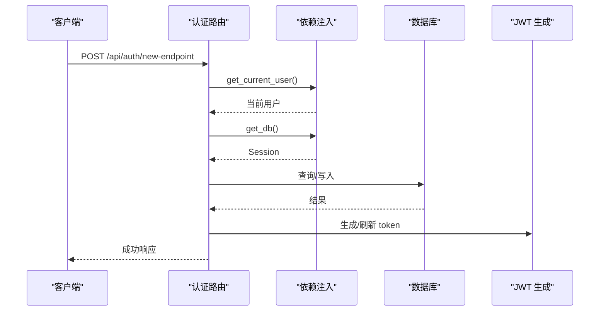

**图表来源**
- [app/routers/auth.py:184-486](file://app/routers/auth.py#L184-L486)
- [app/dependencies.py:16-62](file://app/dependencies.py#L16-L62)
- [app/database.py:22-38](file://app/database.py#L22-L38)

**章节来源**
- [app/routers/auth.py:184-486](file://app/routers/auth.py#L184-L486)
- [app/dependencies.py:16-62](file://app/dependencies.py#L16-L62)
- [app/database.py:22-38](file://app/database.py#L22-L38)

### 服务模块扩展（通知服务）
- 通知服务：封装通知创建、推送 WebSocket、统计未读数等逻辑。
- 异步推送：使用 asyncio 获取事件循环，异步推送消息。
- 数据持久化：通过 SessionLocal 创建本地会话，确保事务一致性。
- 与 WebSocket 协同：通过 ws_manager 统一推送。

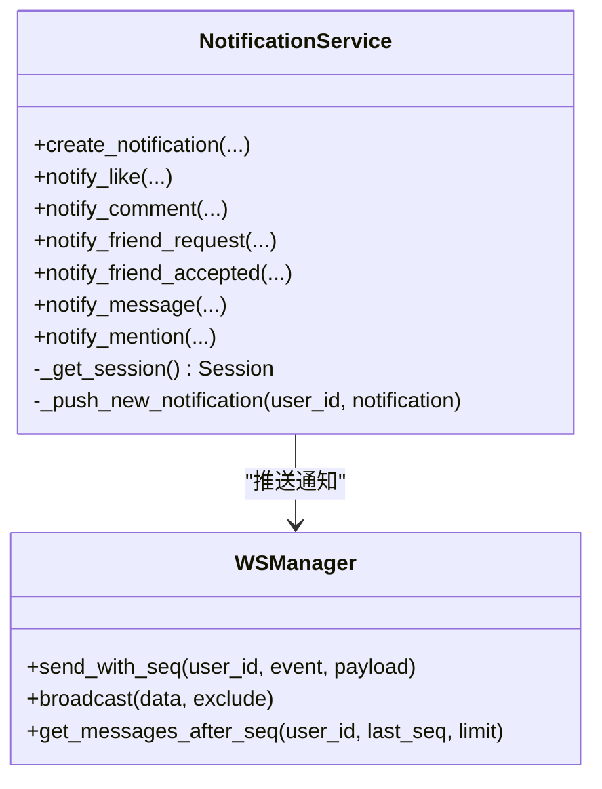

**图表来源**
- [app/services/notification_service.py:14-233](file://app/services/notification_service.py#L14-L233)
- [app/ws_manager.py:20-308](file://app/ws_manager.py#L20-L308)

**章节来源**
- [app/services/notification_service.py:14-233](file://app/services/notification_service.py#L14-L233)
- [app/ws_manager.py:20-308](file://app/ws_manager.py#L20-L308)

### 数据库模型扩展（以新实体为例）
- 在 app/models/models.py 中新增 SQLAlchemy 模型，定义字段与关系。
- 若涉及关联表，参考现有表结构（如 post_topics、topic_followers）。
- 在 app/database.py 的 Base.metadata.create_all 中自动创建表。
- 注意外键约束、索引与级联删除策略。

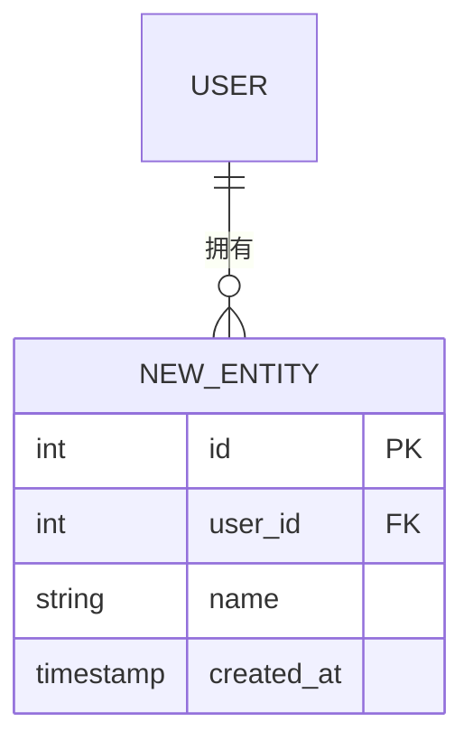

**图表来源**
- [app/models/models.py:1-655](file://app/models/models.py#L1-L655)
- [app/database.py:35-38](file://app/database.py#L35-L38)

**章节来源**
- [app/models/models.py:1-655](file://app/models/models.py#L1-L655)
- [app/database.py:35-38](file://app/database.py#L35-L38)

### 文件上传处理（COS 集成）
- 预签名上传：生成一次性上传 URL，前端直传 COS。
- 确认上传：服务端将临时文件重命名为最终文件名。
- 删除文件：支持按 URL 删除 COS 文件。
- 直传直传：支持直接将文件流上传到 COS。
- 文件信息：支持查询对象元信息。

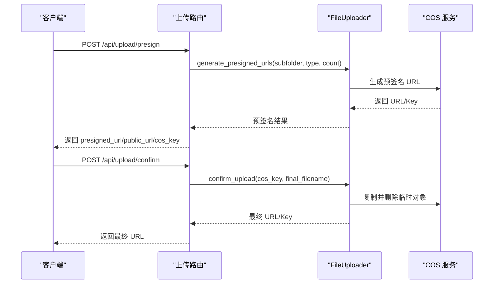

**图表来源**
- [app/routers/upload.py:50-130](file://app/routers/upload.py#L50-L130)
- [app/utils.py:37-121](file://app/utils.py#L37-L121)

**章节来源**
- [app/routers/upload.py:50-130](file://app/routers/upload.py#L50-L130)
- [app/utils.py:37-121](file://app/utils.py#L37-L121)

### 管理员功能开发
- 管理员权限：通过 admin_required 依赖校验当前用户是否为管理员。
- 敏感词管理：提供敏感词列表、添加、删除接口，支持分页与校验。

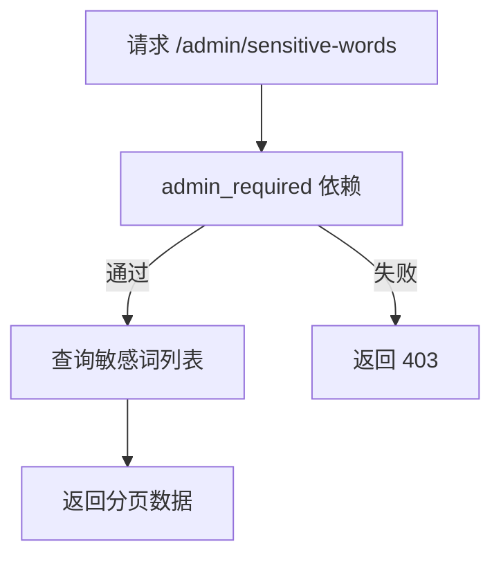

**图表来源**
- [app/routers/admin.py:14-78](file://app/routers/admin.py#L14-L78)
- [app/dependencies.py:53-62](file://app/dependencies.py#L53-L62)

**章节来源**
- [app/routers/admin.py:14-78](file://app/routers/admin.py#L14-L78)
- [app/dependencies.py:53-62](file://app/dependencies.py#L53-L62)

### 第三方集成（COS 与内容审核）
- COS 集成：通过配置项读取 COS_REGION/COS_ID/COS_KEY/COS_BUCKET 等，FileUploader 统一封装预签名、确认、删除、直传与信息查询。
- 内容审核：ContentFilter 提供敏感词过滤、字符变体归一化、动态词库管理与日志记录。

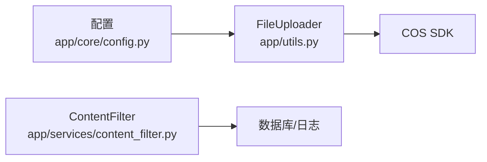

**图表来源**
- [app/core/config.py:32-39](file://app/core/config.py#L32-L39)
- [app/utils.py:14-220](file://app/utils.py#L14-L220)
- [app/services/content_filter.py:13-192](file://app/services/content_filter.py#L13-L192)

**章节来源**
- [app/core/config.py:32-39](file://app/core/config.py#L32-L39)
- [app/utils.py:14-220](file://app/utils.py#L14-L220)
- [app/services/content_filter.py:13-192](file://app/services/content_filter.py#L13-L192)

### WebSocket 特殊服务实现
- 序号机制：为每用户维护单调递增序号，持久化消息日志，支持断线补发。
- ACK 去重：基于 clientMsgId 去重，定期清理旧记录。
- 会话广播：按会话房间进行广播，支持 typing 等事件。

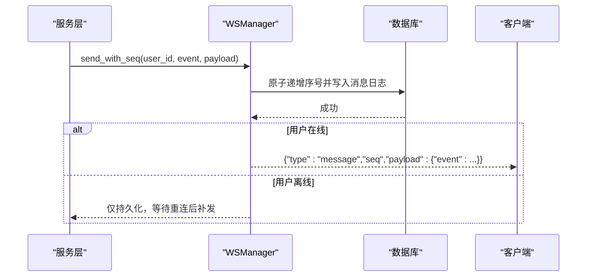

**图表来源**
- [app/ws_manager.py:74-95](file://app/ws_manager.py#L74-L95)
- [app/ws_manager.py:214-247](file://app/ws_manager.py#L214-L247)
- [app/ws_manager.py:265-303](file://app/ws_manager.py#L265-L303)

**章节来源**
- [app/ws_manager.py:74-95](file://app/ws_manager.py#L74-L95)
- [app/ws_manager.py:214-247](file://app/ws_manager.py#L214-L247)
- [app/ws_manager.py:265-303](file://app/ws_manager.py#L265-L303)

## 依赖分析
- FastAPI 与 Uvicorn：应用框架与 ASGI 服务器。
- SQLAlchemy 2.x：ORM 与数据库连接池配置。
- JWT 与密码散列：身份认证与密码存储。
- Python-Multipart：表单与文件上传解析。
- COS SDK：对象存储直传与管理。
- Pillow：图片优化（在上传流程中使用）。

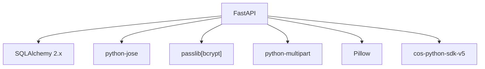

**图表来源**
- [requirements.txt:1-15](file://requirements.txt#L1-L15)

**章节来源**
- [requirements.txt:1-15](file://requirements.txt#L1-L15)

## 性能考量
- 数据库连接池：合理设置 pool_size、max_overflow、pool_recycle、pool_pre_ping，避免连接泄漏与超时。
- 批量查询：在服务层使用批量加载与序列化，减少 N+1 查询。
- 图片优化：在上传前进行压缩，降低存储与网络开销。
- WebSocket：控制并发与广播范围，避免过度推送。
- 缓存与索引：为高频查询字段建立索引，必要时引入缓存层。

[本节为通用指导，无需特定文件引用]

## 故障排查指南
- 身份认证失败：检查 JWT_SECRET_KEY、token 是否过期、用户是否存在。
- 数据库异常：查看 get_db 的 commit/rollback 逻辑，定位事务问题。
- 上传失败：检查 COS_REGION/COS_ID/COS_KEY/COS_BUCKET 配置，确认预签名 URL 生成与确认流程。
- WebSocket 推送失败：检查 ws_manager 的连接状态与去重逻辑。
- 内容审核：确认敏感词库与日志记录是否正常。

**章节来源**
- [app/dependencies.py:16-62](file://app/dependencies.py#L16-L62)
- [app/database.py:22-38](file://app/database.py#L22-L38)
- [app/utils.py:37-121](file://app/utils.py#L37-L121)
- [app/ws_manager.py:20-308](file://app/ws_manager.py#L20-L308)
- [app/services/content_filter.py:147-155](file://app/services/content_filter.py#L147-L155)

## 结论
通过明确的分层架构与依赖注入，NanTuPy 为扩展开发提供了清晰的路径：在路由层定义接口，在服务层封装业务，在模型层沉淀数据，在工具层对接第三方。结合管理员权限、文件上传、WebSocket 实时推送与内容审核等能力，开发者可以快速构建稳定、可维护的新功能，并在性能与安全方面获得良好保障。

[本节为总结，无需特定文件引用]

## 附录

### 扩展开发最佳实践
- 代码组织：按功能域划分路由与服务模块，保持单一职责。
- 依赖注入：统一使用 get_current_user、get_db 等依赖，避免在路由中直接操作数据库。
- 错误处理：规范抛出 HTTPException，提供明确的状态码与消息。
- 日志记录：对关键路径记录 INFO/WARNING/ERROR 级别日志。
- 测试策略：为路由与服务编写单元测试与集成测试，覆盖正常与异常场景。
- 文档与 OpenAPI：保持接口文档与 OpenAPI 规范一致。

[本节为通用指导，无需特定文件引用]

### 部署、版本管理与兼容性
- 部署：使用 Uvicorn 运行 app.main:app，配置环境变量（数据库、JWT、COS）。
- 版本管理：遵循语义化版本，迁移数据库结构时使用迁移脚本。
- 兼容性：对第三方 SDK（如 COS）进行版本锁定，确保升级可控。

**章节来源**
- [app/main.py:107-110](file://app/main.py#L107-L110)
- [requirements.txt:1-15](file://requirements.txt#L1-L15)