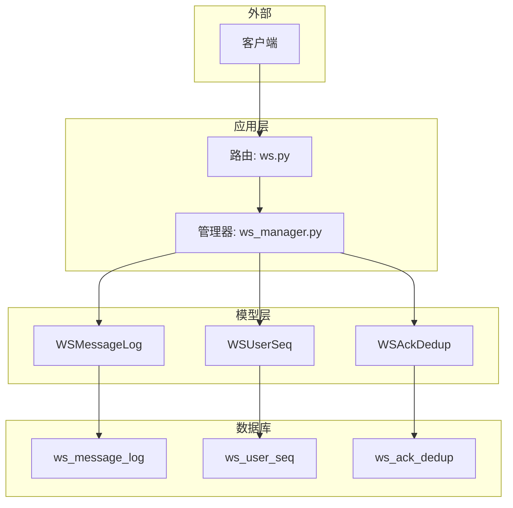
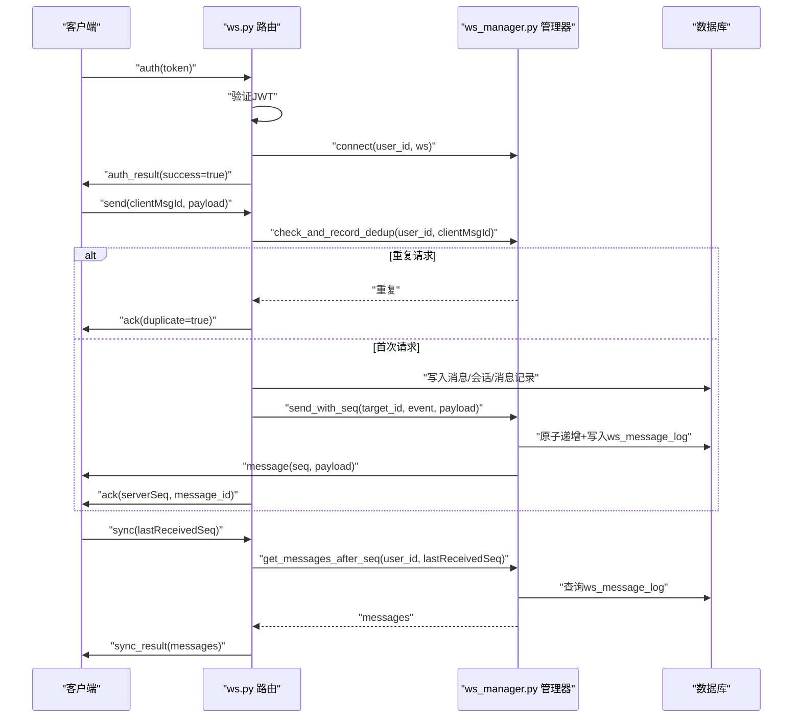
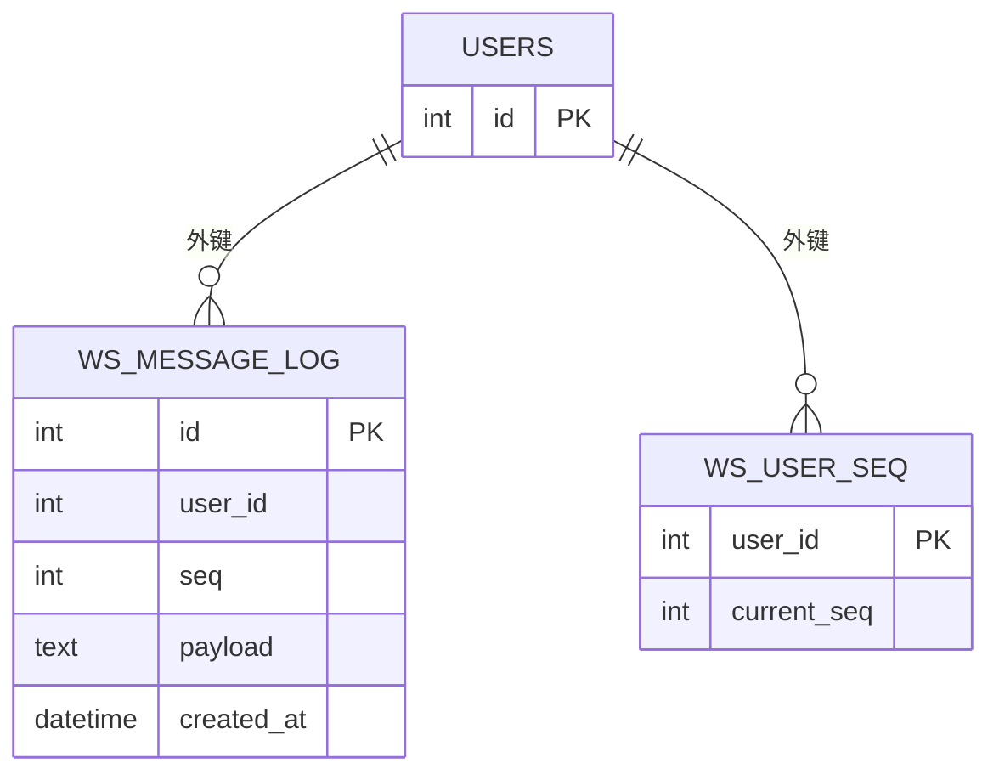
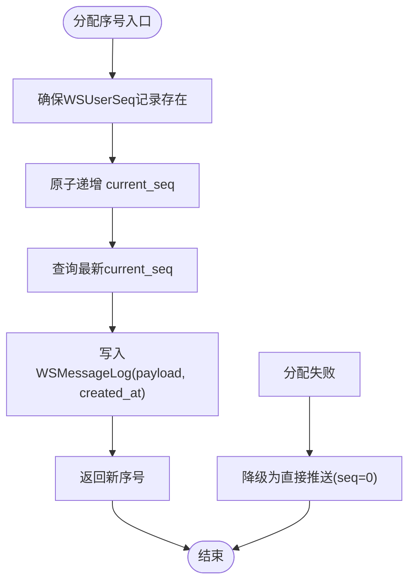
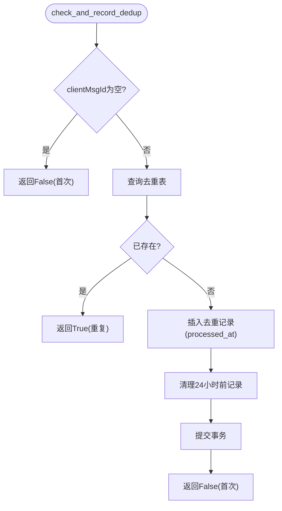
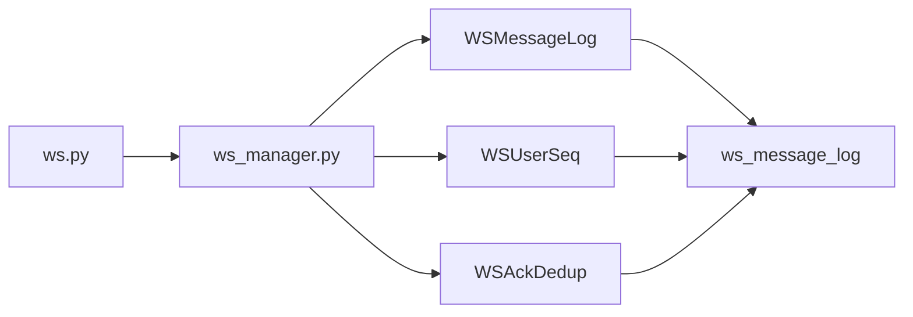

# WebSocket模型

<cite>
**本文引用的文件**
- [models.py](file://app/models/models.py)
- [ws.py](file://app/routers/ws.py)
- [ws_manager.py](file://app/ws_manager.py)
- [add_ws_protocol_tables.sql](file://migrations/add_ws_protocol_tables.sql)
- [websocket_api.json](file://websocket_api.json)
- [test_websocket.py](file://tests/test_websocket.py)
- [test_ws_connect.py](file://tests/test_ws_connect.py)
</cite>

## 目录
1. [简介](#简介)
2. [项目结构](#项目结构)
3. [核心组件](#核心组件)
4. [架构总览](#架构总览)
5. [详细组件分析](#详细组件分析)
6. [依赖关系分析](#依赖关系分析)
7. [性能考量](#性能考量)
8. [故障排查指南](#故障排查指南)
9. [结论](#结论)
10. [附录](#附录)

## 简介
本文件面向WebSocket实时通信模型，系统化梳理并文档化以下关键数据模型与协议机制：
- WSMessageLog 消息日志模型：序列号机制、payload负载存储、断线补发与去重策略
- WSUserSeq 用户序号计数器：并发控制、原子递增与消息顺序保证
- WSAckDedup ACK去重表：幂等性设计、定时清理机制
- WebSocket协议表在断线重连、消息补发与重复处理中的作用
- 各模型的索引策略与性能优化方案
- WebSocket数据模型与传统业务模型的区别与特殊考虑
- 最佳实践与故障排查指南

## 项目结构
WebSocket相关实现集中在以下模块：
- 数据模型定义：app/models/models.py（含WSMessageLog、WSUserSeq、WSAckDedup）
- WebSocket端点与消息处理：app/routers/ws.py
- 连接管理与序号系统：app/ws_manager.py
- 数据库迁移脚本：migrations/add_ws_protocol_tables.sql
- 协议规范与API文档：websocket_api.json
- 测试用例：tests/test_websocket.py、tests/test_ws_connect.py

图表来源
- [ws.py:434-538](file://app/routers/ws.py#L434-L538)
- [ws_manager.py:20-308](file://app/ws_manager.py#L20-L308)
- [models.py:625-655](file://app/models/models.py#L625-L655)
- [add_ws_protocol_tables.sql:4-26](file://migrations/add_ws_protocol_tables.sql#L4-L26)

章节来源
- [ws.py:1-538](file://app/routers/ws.py#L1-L538)
- [ws_manager.py:1-308](file://app/ws_manager.py#L1-L308)
- [models.py:625-655](file://app/models/models.py#L625-L655)
- [add_ws_protocol_tables.sql:1-32](file://migrations/add_ws_protocol_tables.sql#L1-L32)

## 核心组件
- WSMessageLog：持久化每用户的消息日志，支持断线补发。具备唯一约束(user_id, seq)与复合索引(user_id, seq)，payload以JSON字符串存储。
- WSUserSeq：每用户的序号计数器，确保原子递增与消息顺序一致性。
- WSAckDedup：ACK去重表，基于clientMsgId实现幂等，内置24小时TTL清理逻辑。

章节来源
- [models.py:625-655](file://app/models/models.py#L625-L655)
- [add_ws_protocol_tables.sql:4-26](file://migrations/add_ws_protocol_tables.sql#L4-L26)

## 架构总览
WebSocket v3.0序号协议的关键流程：
- 连接与认证：客户端连接后发送auth消息，服务端验证JWT并绑定用户
- 初始化推送：认证成功后自动推送会话列表（带序号）
- 发送消息：客户端发送send消息，服务端进行幂等检查、写入日志、分配序号并推送
- 断线补发：客户端重连后发送sync请求，服务端返回seq>lastReceivedSeq的消息
- 心跳保活：客户端定期发送ping，服务端返回pong
- 去重与清理：ACK去重表基于clientMsgId幂等，定期清理过期记录

图表来源
- [ws.py:182-330](file://app/routers/ws.py#L182-L330)
- [ws_manager.py:74-247](file://app/ws_manager.py#L74-L247)

章节来源
- [ws.py:434-538](file://app/routers/ws.py#L434-L538)
- [ws_manager.py:170-247](file://app/ws_manager.py#L170-L247)

## 详细组件分析

### WSMessageLog 消息日志模型
- 设计要点
  - 主键自增id，便于顺序扫描与清理
  - user_id+seq唯一约束，保证每用户序列号唯一
  - 复合索引(user_id, seq)支持高效查询seq>lastReceivedSeq
  - payload以JSON字符串存储，便于灵活承载不同事件类型
  - 外键约束到users表，确保用户存在性
- 断线补发机制
  - 客户端重连后发送sync请求，服务端按user_id过滤并返回seq>lastReceivedSeq的消息
  - 采用升序排序，确保补发顺序与发送顺序一致
- 存储与序列号
  - 序列号由WSUserSeq原子递增，WSMessageLog仅持久化payload与时间戳
  - 离线用户的消息仅持久化，不阻塞在线推送

图表来源
- [models.py:625-655](file://app/models/models.py#L625-L655)
- [add_ws_protocol_tables.sql:4-19](file://migrations/add_ws_protocol_tables.sql#L4-L19)

章节来源
- [models.py:625-655](file://app/models/models.py#L625-L655)
- [add_ws_protocol_tables.sql:4-13](file://migrations/add_ws_protocol_tables.sql#L4-L13)
- [ws_manager.py:214-247](file://app/ws_manager.py#L214-L247)

### WSUserSeq 用户序号计数器
- 并发控制与原子递增
  - 使用UPDATE语句原子性递增current_seq，避免竞态条件
  - 通过显式查询获取最新值，确保序列号单调递增
- 消息顺序保证
  - 每次发送消息前先分配seq，再写入日志，保证离线补发时的顺序一致性
  - 若分配失败，降级为直接推送（seq=0），避免阻塞
- 与WSMessageLog协作
  - WSUserSeq提供单调递增的序号，WSMessageLog持久化payload与时间戳
  - 二者共同实现“序号+日志”的可靠推送模型

图表来源
- [ws_manager.py:170-213](file://app/ws_manager.py#L170-L213)
- [models.py:640-646](file://app/models/models.py#L640-L646)

章节来源
- [ws_manager.py:170-213](file://app/ws_manager.py#L170-L213)
- [models.py:640-646](file://app/models/models.py#L640-L646)

### WSAckDedup ACK去重表
- 幂等性设计
  - 基于clientMsgId作为主键，天然幂等
  - 首次处理时插入记录，重复请求直接返回已有ACK（duplicate=true）
- 定时清理机制
  - 每次去重检查时顺带清理24小时前的记录
  - 提供SQL迁移脚本中的定期清理建议（24小时与7天）
- 与send流程集成
  - 客户端发送消息携带clientMsgId
  - 服务端在处理前检查去重表，若重复则直接返回ACK，不执行业务逻辑

图表来源
- [ws_manager.py:265-303](file://app/ws_manager.py#L265-L303)
- [models.py:648-655](file://app/models/models.py#L648-L655)
- [add_ws_protocol_tables.sql:21-26](file://migrations/add_ws_protocol_tables.sql#L21-L26)

章节来源
- [ws_manager.py:265-303](file://app/ws_manager.py#L265-L303)
- [models.py:648-655](file://app/models/models.py#L648-L655)
- [add_ws_protocol_tables.sql:28-31](file://migrations/add_ws_protocol_tables.sql#L28-L31)

### WebSocket协议表在断线重连、消息补发与重复处理中的作用
- 断线重连与补发
  - 客户端重连后发送sync请求，携带lastReceivedSeq
  - 服务端查询WSMessageLog中seq>lastReceivedSeq的消息，按升序返回
- 重复处理
  - 客户端发送send时携带clientMsgId
  - 服务端通过WSAckDedup检测重复，避免重复执行业务逻辑
- 实时事件与持久化事件
  - typing/stop_typing等实时事件seq=0，不持久化
  - 消息推送、通知等持久化事件seq>0，需持久化与补发

章节来源
- [ws.py:317-330](file://app/routers/ws.py#L317-L330)
- [ws_manager.py:214-247](file://app/ws_manager.py#L214-L247)
- [websocket_api.json:210-272](file://websocket_api.json#L210-L272)

## 依赖关系分析
- 组件耦合
  - ws.py依赖ws_manager.py进行连接管理、序号分配与消息补发
  - ws_manager.py依赖models.py中的WSMessageLog、WSUserSeq、WSAckDedup进行数据持久化
  - 数据库层面，三张表通过外键约束到users表，确保用户存在性
- 外部依赖
  - JWT验证依赖python-jose库
  - 心跳保活依赖客户端定时发送ping
- 潜在风险
  - 去重表增长导致查询变慢，需定期清理
  - 序号分配失败的降级路径需监控与告警

图表来源
- [ws.py:182-330](file://app/routers/ws.py#L182-L330)
- [ws_manager.py:170-303](file://app/ws_manager.py#L170-L303)
- [models.py:625-655](file://app/models/models.py#L625-L655)

章节来源
- [ws.py:1-538](file://app/routers/ws.py#L1-L538)
- [ws_manager.py:1-308](file://app/ws_manager.py#L1-L308)
- [models.py:625-655](file://app/models/models.py#L625-L655)

## 性能考量
- 索引策略
  - WSMessageLog：(user_id, seq)唯一约束+复合索引，支持高效补发查询
  - WSUserSeq：user_id主键，支持原子递增与查询
  - WSAckDedup：client_msg_id主键，支持幂等查询与插入
- 查询与写入优化
  - 补发查询限制返回数量（默认200），避免一次性返回过多数据
  - 去重检查与清理合并执行，减少事务次数
- 清理策略
  - 去重表：24小时TTL清理
  - 消息日志：迁移脚本建议7天清理
- 并发与一致性
  - 序号分配使用原子UPDATE+SELECT，避免竞态
  - 去重检查在事务内完成，保证一致性

章节来源
- [add_ws_protocol_tables.sql:10-13](file://migrations/add_ws_protocol_tables.sql#L10-L13)
- [ws_manager.py:214-247](file://app/ws_manager.py#L214-L247)
- [ws_manager.py:265-303](file://app/ws_manager.py#L265-L303)

## 故障排查指南
- 常见问题与定位
  - 认证失败：检查JWT是否有效、是否过期、用户是否存在
  - 重复发送：确认clientMsgId是否正确传递，去重表是否正常工作
  - 消息未补发：检查lastReceivedSeq是否正确、WSMessageLog中是否存在seq>lastReceivedSeq的消息
  - 序号分配失败：检查WSUserSeq表是否正常、数据库连接是否稳定
- 日志与监控
  - 关注ws_manager中的错误日志，特别是序号分配与去重检查失败
  - 监控去重表与消息日志的增长趋势，及时清理
- 测试验证
  - 使用测试脚本验证连接、认证、去重与补发流程
  - 通过测试用例观察ack与sync行为

章节来源
- [ws.py:446-470](file://app/routers/ws.py#L446-L470)
- [ws_manager.py:265-303](file://app/ws_manager.py#L265-L303)
- [test_websocket.py:1-203](file://tests/test_websocket.py#L1-L203)
- [test_ws_connect.py:141-281](file://tests/test_ws_connect.py#L141-L281)

## 结论
WebSocket v3.0序号协议通过“序号+日志+去重”三要素实现了可靠的实时通信：
- WSMessageLog确保消息持久化与断线补发
- WSUserSeq提供原子递增与顺序保证
- WSAckDedup实现幂等与重复处理
配合合理的索引与清理策略，可在高并发场景下保持稳定与高性能。

## 附录
- 协议特性与API概览参见websocket_api.json中的“key_features”、“statistics”与“database_tables”
- 测试用例覆盖认证、去重、补发等关键流程

章节来源
- [websocket_api.json:554-588](file://websocket_api.json#L554-L588)
- [test_ws_connect.py:141-281](file://tests/test_ws_connect.py#L141-L281)