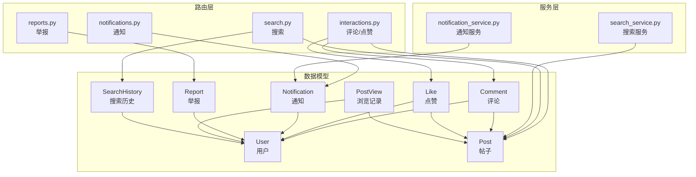
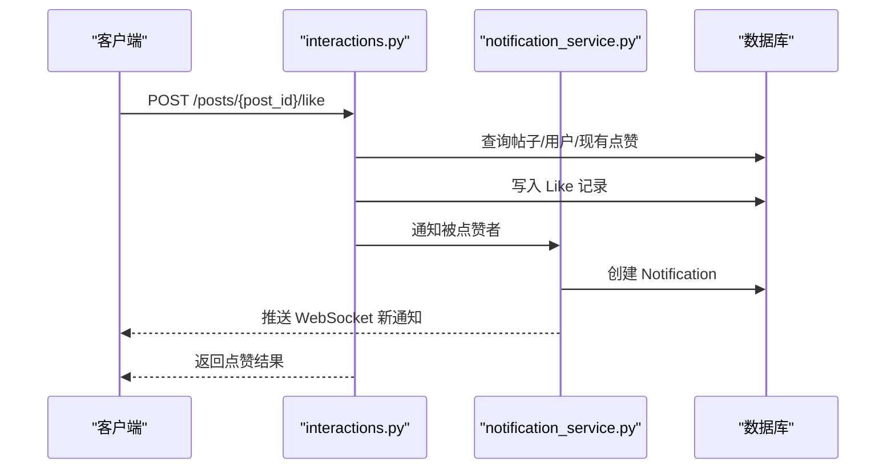
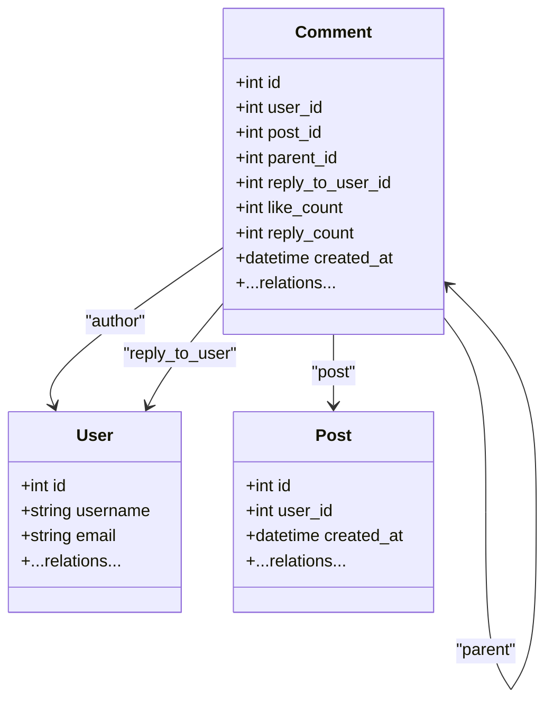
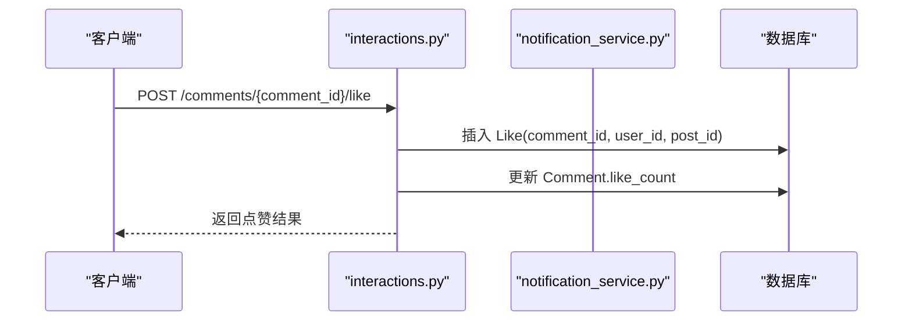
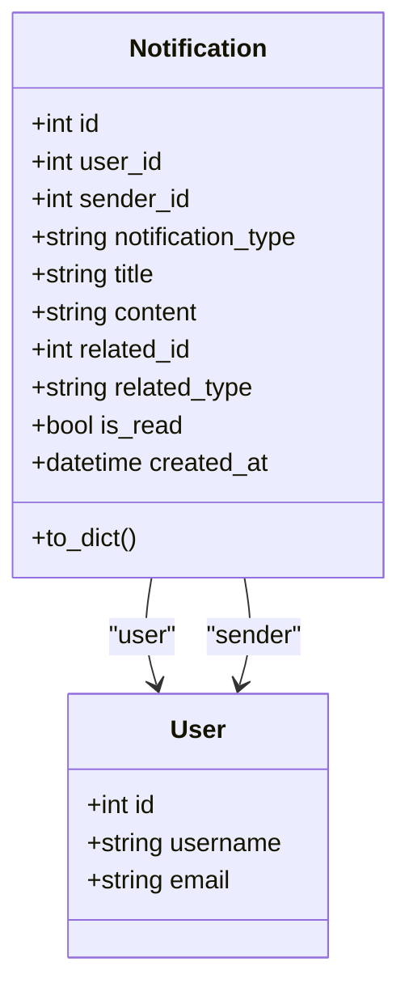
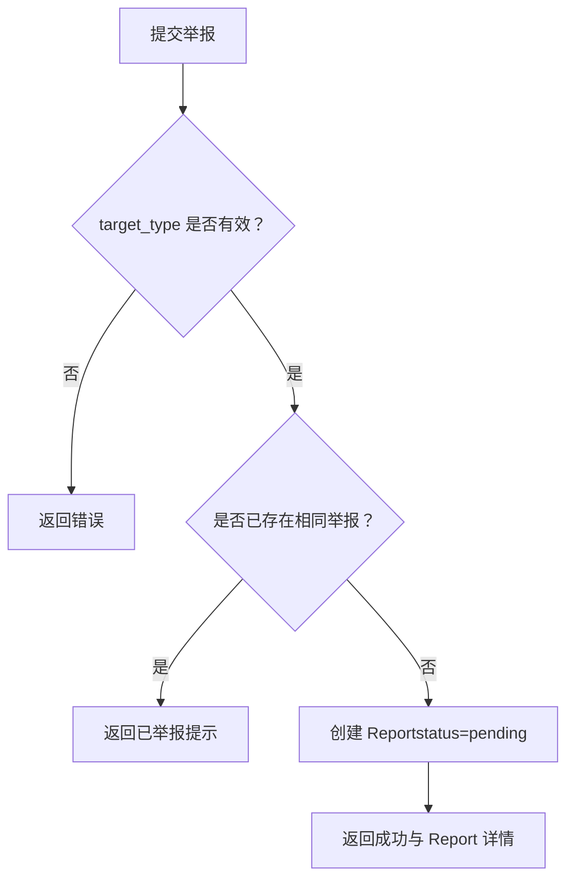
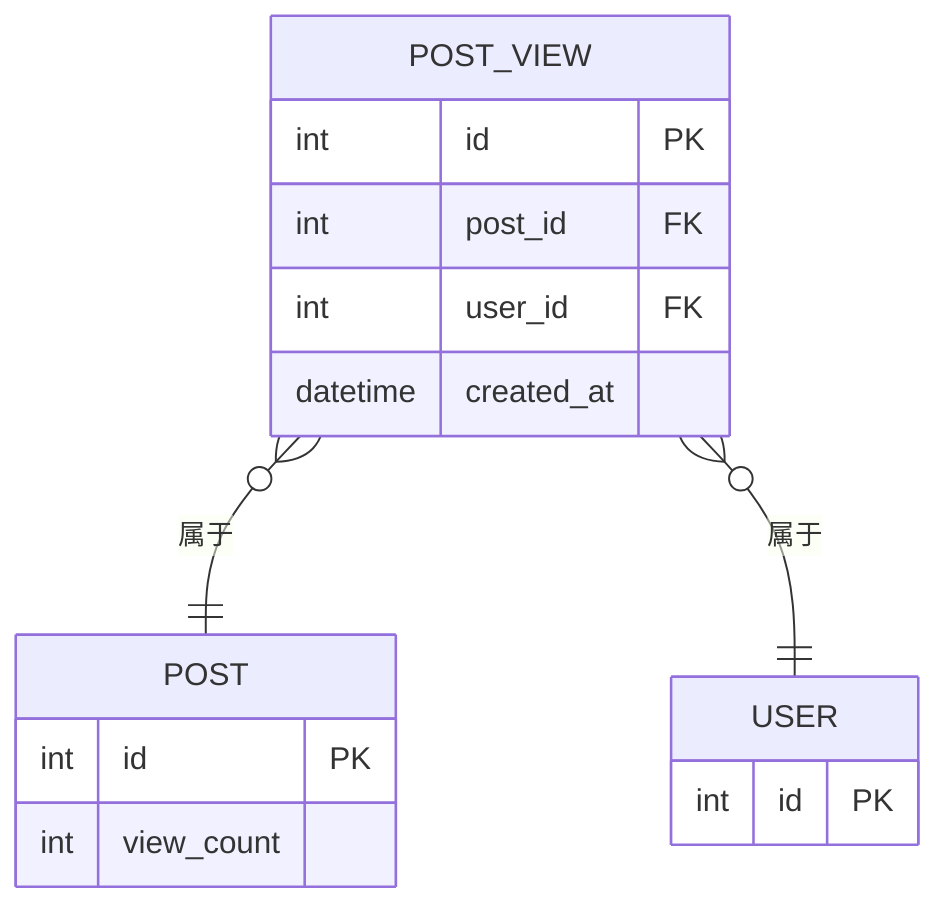
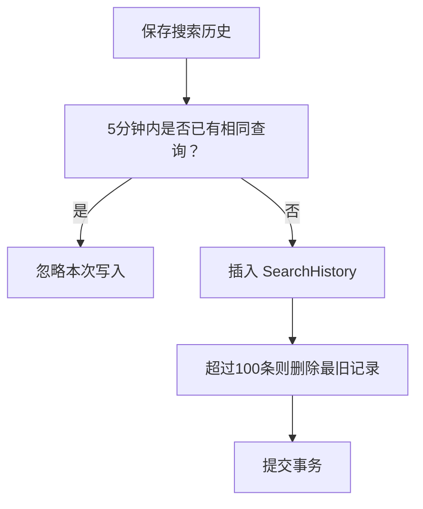
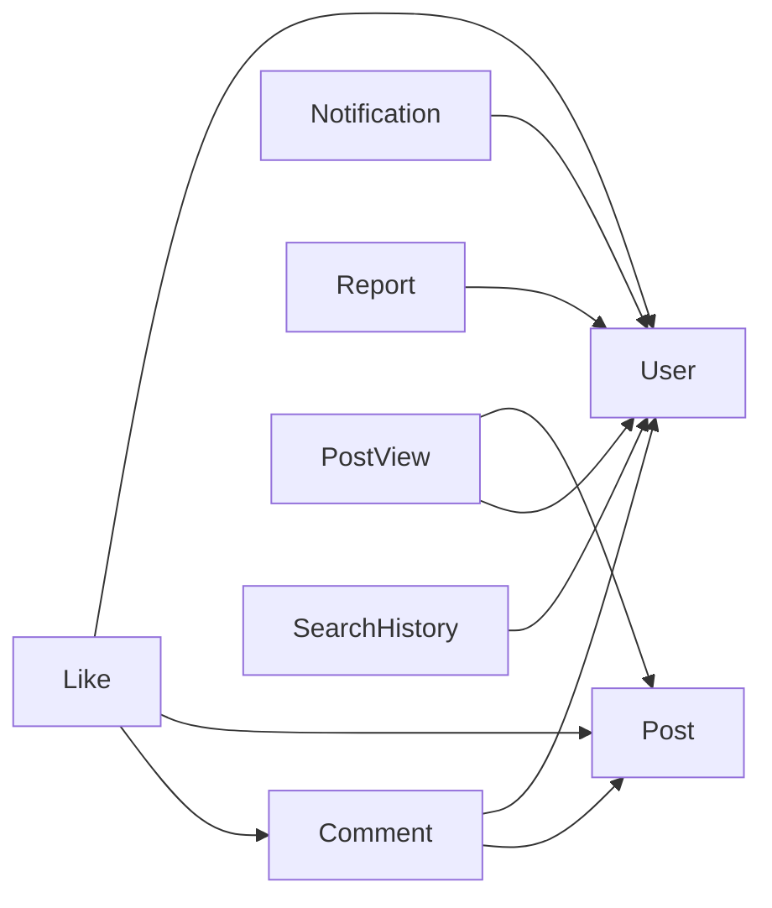

# 交互模型

<cite>
**本文引用的文件**
- [models.py](file://app/models/models.py)
- [interactions.py](file://app/routers/interactions.py)
- [notifications.py](file://app/routers/notifications.py)
- [reports.py](file://app/routers/reports.py)
- [search.py](file://app/routers/search.py)
- [notification_service.py](file://app/services/notification_service.py)
- [search_service.py](file://app/services/search_service.py)
- [database.py](file://app/database.py)
</cite>

## 目录
1. [简介](#简介)
2. [项目结构](#项目结构)
3. [核心组件](#核心组件)
4. [架构总览](#架构总览)
5. [详细组件分析](#详细组件分析)
6. [依赖分析](#依赖分析)
7. [性能考虑](#性能考虑)
8. [故障排查指南](#故障排查指南)
9. [结论](#结论)
10. [附录](#附录)

## 简介
本文件面向“交互模型”的数据层与业务层，系统性梳理以下模型与相关流程：
- 评论模型 Comment 的树形结构设计（parent_id 父子关系、reply_to_user_id 回复目标用户）
- 点赞模型 Like 的多态设计（支持帖子与评论点赞）
- 通知模型 Notification 的字段结构与通知类型分类
- 举报模型 Report 的处理流程与状态管理
- 帖子浏览记录 PostView 的去重策略与统计功能
- 搜索历史 SearchHistory 的用户关联与查询分析
- 交互模型的索引优化策略与查询性能分析

## 项目结构
围绕交互模型，主要涉及以下模块：
- 数据模型定义：app/models/models.py
- 交互路由：app/routers/interactions.py
- 通知路由与服务：app/routers/notifications.py、app/services/notification_service.py
- 举报路由：app/routers/reports.py
- 搜索路由与服务：app/routers/search.py、app/services/search_service.py
- 数据库配置：app/database.py

图表来源
- [models.py:100-512](file://app/models/models.py#L100-L512)
- [interactions.py:1-433](file://app/routers/interactions.py#L1-L433)
- [notifications.py:1-208](file://app/routers/notifications.py#L1-L208)
- [reports.py:1-151](file://app/routers/reports.py#L1-L151)
- [search.py:1-269](file://app/routers/search.py#L1-L269)
- [notification_service.py:1-233](file://app/services/notification_service.py#L1-L233)
- [search_service.py:1-179](file://app/services/search_service.py#L1-L179)

章节来源
- [models.py:100-512](file://app/models/models.py#L100-L512)
- [interactions.py:1-433](file://app/routers/interactions.py#L1-L433)
- [notifications.py:1-208](file://app/routers/notifications.py#L1-L208)
- [reports.py:1-151](file://app/routers/reports.py#L1-L151)
- [search.py:1-269](file://app/routers/search.py#L1-L269)
- [notification_service.py:1-233](file://app/services/notification_service.py#L1-L233)
- [search_service.py:1-179](file://app/services/search_service.py#L1-L179)

## 核心组件
本节聚焦交互模型的关键实体及其字段、关系与约束。

- 用户 User
  - 主键 id；唯一索引：username、email
  - 关系：posts、comments、likes、blocks、post_views、friendships
- 帖子 Post
  - 主键 id；外键 user_id；索引：user_id、created_at
  - 关系：author、comments、likes
  - 辅助方法：get_like_count、get_comment_count、get_topics、to_dict
- 评论 Comment
  - 主键 id；外键 user_id、post_id；索引：user_id、post_id、parent_id、reply_to_user_id
  - 自引用 parent_id；回复目标 reply_to_user_id
  - 关系：author、post、parent、reply_to_user
  - 方法：to_dict
- 点赞 Like
  - 主键 id；外键 user_id；索引：user_id、post_id、comment_id
  - 多态字段：post_id 或 comment_id 二选一（非空）
  - 关系：user、post
  - 方法：to_dict
- 通知 Notification
  - 主键 id；外键 user_id、sender_id；索引：user_id、sender_id、created_at
  - 字段：notification_type、title、content、related_id、related_type、is_read
  - 关系：user、sender
  - 方法：to_dict
- 举报 Report
  - 主键 id；外键 reporter_id；索引：reporter_id、created_at
  - 字段：target_type、target_id、reason、status、created_at、resolved_at
  - 关系：reporter
  - 方法：to_dict
- 浏览记录 PostView
  - 主键 id；外键 post_id、user_id；索引：post_id、user_id、created_at
  - 关系：post、viewer
- 搜索历史 SearchHistory
  - 主键 id；外键 user_id；索引：user_id、created_at
  - 字段：query、search_type、created_at
  - 关系：user
  - 方法：to_dict

章节来源
- [models.py:42-512](file://app/models/models.py#L42-L512)

## 架构总览
交互模型在应用中的职责划分如下：
- 数据模型层：定义实体、字段、索引与关系
- 路由层：暴露 REST 接口，编排业务流程
- 服务层：封装跨模型的复杂逻辑（如通知、搜索）

图表来源
- [interactions.py:54-99](file://app/routers/interactions.py#L54-L99)
- [notification_service.py:87-112](file://app/services/notification_service.py#L87-L112)

## 详细组件分析

### 评论模型 Comment 的树形结构设计
- 父子关系
  - 使用 parent_id 指向 comments 表自身的 id，形成自引用
  - 顶级评论 parent_id 为空；回复评论 parent_id 指向父评论
  - 通过索引 idx_comments_post_parent 和 idx_comments_parent_created 优化查询
- 回复目标用户
  - reply_to_user_id 指向被回复用户的 id，便于通知与展示
  - 若未显式提供，则默认继承父评论的作者
- 关系与方法
  - author、post、parent、reply_to_user
  - to_dict 输出包含 author、reply_to_user、like_count、reply_count 等字段

图表来源
- [models.py:187-232](file://app/models/models.py#L187-L232)

章节来源
- [models.py:187-232](file://app/models/models.py#L187-L232)
- [interactions.py:175-241](file://app/routers/interactions.py#L175-L241)

### 点赞模型 Like 的多态设计
- 设计要点
  - user_id 与 post_id、comment_id 三者构成多态点赞：同一用户对不同对象点赞时，分别填充对应 id
  - 通过索引 idx_likes_comment_user 优化按评论查询点赞
- 业务流程
  - 点赞帖子：写入 Like，通知被点赞者
  - 点赞评论：写入 Like，同时递增评论的 like_count
  - 取消点赞：删除记录，必要时回滚计数

图表来源
- [interactions.py:119-145](file://app/routers/interactions.py#L119-L145)
- [models.py:234-259](file://app/models/models.py#L234-L259)

章节来源
- [models.py:234-259](file://app/models/models.py#L234-L259)
- [interactions.py:54-99](file://app/routers/interactions.py#L54-L99)
- [interactions.py:119-170](file://app/routers/interactions.py#L119-L170)

### 通知模型 Notification 的字段结构与通知类型分类
- 字段结构
  - user_id、sender_id、notification_type、title、content、related_id、related_type、is_read、created_at
- 类型分类
  - like：点赞通知
  - comment：评论通知
  - friend_request / friend_accept：好友请求/接受
  - message：私信消息
  - mention：@提及
- 路由能力
  - 分页获取、未读计数、标记已读、批量已读、删除、清空
  - WebSocket 实时推送未读计数变化

图表来源
- [models.py:359-390](file://app/models/models.py#L359-L390)
- [notifications.py:15-157](file://app/routers/notifications.py#L15-L157)
- [notification_service.py:14-233](file://app/services/notification_service.py#L14-L233)

章节来源
- [models.py:359-390](file://app/models/models.py#L359-L390)
- [notifications.py:15-157](file://app/routers/notifications.py#L15-L157)
- [notification_service.py:14-233](file://app/services/notification_service.py#L14-L233)

### 举报模型 Report 的处理流程与状态管理
- 字段与状态
  - reporter_id、target_type（post/comment/user）、target_id、reason、status（默认 pending）、created_at、resolved_at
- 处理流程
  - 统一入口 /reports/ 与专用别名 /reports/post、/reports/comment、/reports/user
  - 防重复：同一用户对同一目标仅允许一次举报
  - 状态管理：创建时为 pending，后续由运营或系统处理后更新 resolved_at

图表来源
- [reports.py:14-50](file://app/routers/reports.py#L14-L50)
- [models.py:446-474](file://app/models/models.py#L446-L474)

章节来源
- [reports.py:14-151](file://app/routers/reports.py#L14-L151)
- [models.py:446-474](file://app/models/models.py#L446-L474)

### 帖子浏览记录 PostView 的去重策略与统计功能
- 去重策略
  - 以 (post_id, user_id) 作为联合主键，确保同一用户对同一帖子仅记录一次
- 统计功能
  - 通过聚合查询可统计某帖子的独立浏览人数
  - 与 Post.view_count 字段配合，用于展示与分析

图表来源
- [models.py:476-487](file://app/models/models.py#L476-L487)

章节来源
- [models.py:476-487](file://app/models/models.py#L476-L487)

### 搜索历史 SearchHistory 的用户关联与查询分析
- 用户关联
  - user_id 外键关联用户；按 user_id + created_at 建立复合索引
- 查询分析
  - 保存时：5 分钟内重复查询不重复写入
  - 清理：超过 100 条后按时间倒序清理超出部分
  - 路由：历史查询、保存、清空

图表来源
- [search.py:124-179](file://app/routers/search.py#L124-L179)
- [models.py:489-512](file://app/models/models.py#L489-L512)

章节来源
- [search.py:107-179](file://app/routers/search.py#L107-L179)
- [models.py:489-512](file://app/models/models.py#L489-L512)

## 依赖分析
- 模型间依赖
  - Comment 依赖 User、Post；Like 依赖 User、Post/Comment；Notification 依赖 User；Report 依赖 User；PostView、SearchHistory 依赖 User/Post
- 路由与服务依赖
  - interactions.py 依赖 notification_service.py 与 mention_service（在评论创建时触发）
  - notifications.py 依赖 ws_manager 进行 WebSocket 推送
  - search.py 依赖 search_service 进行检索与聚合

图表来源
- [models.py:187-512](file://app/models/models.py#L187-L512)
- [interactions.py:1-433](file://app/routers/interactions.py#L1-L433)
- [notifications.py:1-208](file://app/routers/notifications.py#L1-L208)
- [reports.py:1-151](file://app/routers/reports.py#L1-L151)
- [search.py:1-269](file://app/routers/search.py#L1-L269)

章节来源
- [models.py:187-512](file://app/models/models.py#L187-L512)
- [interactions.py:1-433](file://app/routers/interactions.py#L1-L433)
- [notifications.py:1-208](file://app/routers/notifications.py#L1-L208)
- [reports.py:1-151](file://app/routers/reports.py#L1-L151)
- [search.py:1-269](file://app/routers/search.py#L1-L269)

## 性能考虑
- 索引策略
  - Comment：idx_comments_post_parent、idx_comments_parent_created、user_id、post_id、parent_id、reply_to_user_id
  - Like：idx_likes_comment_user、user_id、post_id、comment_id
  - Notification：user_id、sender_id、created_at
  - Report：reporter_id、created_at
  - PostView：post_id、user_id、created_at
  - SearchHistory：user_id、created_at
- 查询优化
  - 评论列表：批量查询 is_liked，避免 N+1；按 parent_id + created_at 排序，利用复合索引
  - 通知列表：按 user_id + created_at 降序分页
  - 搜索历史：按 user_id + created_at 降序，限制返回条数
- 写入优化
  - 评论点赞：先写 Like，再原子性更新评论计数
  - 搜索历史：5 分钟内去重，超过阈值按时间倒序清理，降低写放大

章节来源
- [models.py:187-512](file://app/models/models.py#L187-L512)
- [interactions.py:26-48](file://app/routers/interactions.py#L26-L48)
- [search.py:124-179](file://app/routers/search.py#L124-L179)

## 故障排查指南
- 评论相关
  - 父评论不存在：返回 404；需校验 parent_id
  - 回复目标缺失：若未提供 reply_to_user_id，自动继承父评论作者
  - 删除评论：若为回复，需同步递减父评论 reply_count
- 点赞相关
  - 已点赞：返回提示与当前计数；取消点赞需存在记录
  - 评论点赞：写入后立即更新评论计数
- 通知相关
  - 标记已读：仅限本人操作；WebSocket 推送未读计数
  - 通知类型：确保 related_id/related_type 与 notification_type 匹配
- 举报相关
  - 防重复：同一用户对同一目标仅允许一次举报
  - 状态管理：pending 为初始状态，后续由运营处理
- 搜索历史
  - 保存失败：捕获异常并回滚；超过 100 条自动清理

章节来源
- [interactions.py:175-433](file://app/routers/interactions.py#L175-L433)
- [notifications.py:64-157](file://app/routers/notifications.py#L64-L157)
- [reports.py:52-151](file://app/routers/reports.py#L52-L151)
- [search.py:124-179](file://app/routers/search.py#L124-L179)

## 结论
交互模型围绕“用户—帖子—评论—点赞—通知—举报—浏览—搜索”构建完整闭环。通过合理的多态设计（Like）、树形结构（Comment）、索引策略与批量化查询，兼顾了功能完整性与性能稳定性。建议持续监控热点查询路径与写入峰值，结合业务增长迭代索引与缓存策略。

## 附录
- 数据库初始化与会话管理：通过 engine、SessionLocal、Base 与 get_db 提供统一连接池与依赖注入
- 服务层扩展：notification_service 与 search_service 作为横切关注点，解耦路由与业务逻辑

章节来源
- [database.py:1-38](file://app/database.py#L1-L38)