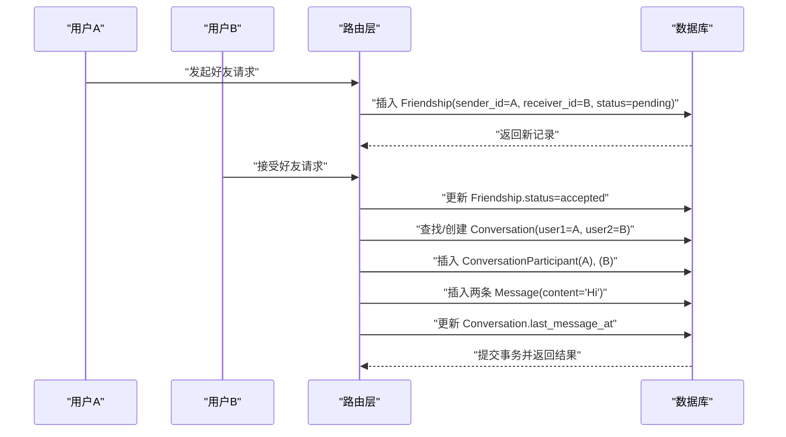
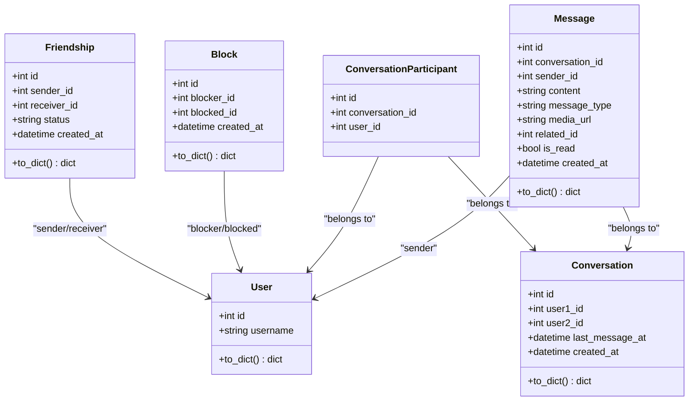

# 关系模型

<cite>
**本文引用的文件**
- [models.py](file://app/models/models.py)
- [friends.py](file://app/routers/friends.py)
- [chat.py](file://app/routers/chat.py)
- [error_analysis.md](file://error_analysis.md)
- [openapi.json](file://openapi.json)
</cite>

## 目录
1. [简介](#简介)
2. [项目结构](#项目结构)
3. [核心组件](#核心组件)
4. [架构总览](#架构总览)
5. [详细组件分析](#详细组件分析)
6. [依赖分析](#依赖分析)
7. [性能考虑](#性能考虑)
8. [故障排查指南](#故障排查指南)
9. [结论](#结论)
10. [附录](#附录)

## 简介
本文件聚焦于关系模型中的核心实体：Friendship（好友关系）、Block（屏蔽关系）、Conversation（会话）、Message（消息）。文档从数据结构、状态流转、时间戳管理、to_dict 输出格式、外键与级联策略、查询最佳实践与性能优化等方面进行系统化梳理，并结合路由层的实际使用场景，帮助开发者与前端实现稳定、可维护的集成。

## 项目结构
关系模型主要位于数据访问层的模型文件中，业务逻辑通过路由层进行编排，典型流程包括：
- 好友关系变更触发会话创建与初始消息写入
- 屏蔽关系影响消息可见性与交互行为
- 会话与消息采用多对多关联（通过中间表参与者表）

```mermaid
graph TB
subgraph "数据模型层"
F["Friendship<br/>好友关系"]
B["Block<br/>屏蔽关系"]
C["Conversation<br/>会话"]
M["Message<br/>消息"]
CP["ConversationParticipant<br/>会话参与者"]
end
subgraph "路由层"
RF["friends.py<br/>好友路由"]
RC["chat.py<br/>聊天路由"]
end
RF --> F
RF --> C
RF --> M
RC --> C
RC --> M
C <- --> CP
F --> B
```

图表来源
- [models.py:260-459](file://app/models/models.py#L260-L459)
- [friends.py:40-159](file://app/routers/friends.py#L40-L159)
- [chat.py:234-390](file://app/routers/chat.py#L234-L390)

章节来源
- [models.py:260-459](file://app/models/models.py#L260-L459)
- [friends.py:40-159](file://app/routers/friends.py#L40-L159)
- [chat.py:234-390](file://app/routers/chat.py#L234-L390)

## 核心组件
本节概述四个核心关系模型的职责、字段与行为要点。

- Friendship（好友关系）
  - 角色：记录用户间的好友申请与接受状态
  - 关键字段：sender_id、receiver_id、status、created_at
  - 状态枚举：pending、accepted、rejected、blocked
  - 时间戳：created_at 默认当前时间
  - to_dict 输出：包含基础字段与时间戳的 ISO 字符串形式

- Block（屏蔽关系）
  - 角色：记录用户对另一用户的屏蔽
  - 关键字段：blocker_id、blocked_id、created_at
  - 设计：双向关系（blocker 与 blocked 的 User 关系）
  - to_dict 输出：包含被屏蔽用户信息的嵌套字典

- Conversation（会话）
  - 角色：用户间的对话容器
  - 关键字段：user1_id、user2_id、last_message_at、created_at
  - 多对多：通过中间表 ConversationParticipant 实现
  - to_dict 输出：包含基础字段与时间戳的 ISO 字符串形式

- Message（消息）
  - 角色：会话内的消息条目
  - 关键字段：conversation_id、sender_id、content、message_type、media_url、related_id、is_read、created_at
  - 类型：text、image、system
  - to_dict 输出：包含基础字段与时间戳的 ISO 字符串形式

章节来源
- [models.py:260-459](file://app/models/models.py#L260-L459)

## 架构总览
下图展示关系模型在业务流程中的交互：好友关系变更驱动会话与初始消息创建；屏蔽关系影响消息可见性；消息与会话通过外键关联。



图表来源
- [friends.py:40-159](file://app/routers/friends.py#L40-L159)
- [models.py:260-459](file://app/models/models.py#L260-L459)

## 详细组件分析

### Friendship 好友关系模型
- 结构与关系
  - 主键：id
  - 外键：sender_id、receiver_id 引用 users 表
  - 状态字段：status 支持 pending、accepted、rejected、blocked
  - 时间戳：created_at 默认当前时间
  - to_dict 输出：包含 id、sender_id、receiver_id、status、created_at（ISO 字符串）

- 状态流转与业务规则
  - 发起请求：路由层检查是否已存在互为发送者/接收者的记录，避免重复
  - 接受请求：路由层校验接收者身份与状态，更新为 accepted，并自动创建会话与初始消息
  - 拒绝请求：仅当状态为 pending 时允许拒绝
  - 屏蔽：状态支持 blocked，用于标记被屏蔽的关系

- 查询与索引
  - 建议在 sender_id、receiver_id 上建立索引以提升查询效率
  - 路由层在判断“共同好友”限制时，对双方的好友关系进行筛选与交集计算

- to_dict 兼容性
  - 输出 created_at 为 ISO 8601 字符串，便于前端解析与显示

章节来源
- [models.py:260-289](file://app/models/models.py#L260-L289)
- [friends.py:40-159](file://app/routers/friends.py#L40-L159)
- [openapi.json:1991-2006](file://openapi.json#L1991-L2006)

### Block 屏蔽关系模型
- 结构与关系
  - 主键：id
  - 外键：blocker_id、blocked_id 引用 users 表
  - to_dict 输出：包含 blocker_id、blocked_id、created_at（ISO 字符串）以及被屏蔽用户信息的嵌套字典

- 双向关系设计
  - blocker 与 blocked 分别映射到 User，形成双向关系，便于快速查询某用户屏蔽了哪些人，或被哪些人屏蔽

- 屏蔽效果
  - 路由层在处理好友请求时，若涉及“仅限共同好友”的策略，会基于屏蔽关系过滤潜在的交互对象
  - 在消息层面，屏蔽关系通常会影响消息可见性与交互行为（具体实现取决于业务策略）

章节来源
- [models.py:424-444](file://app/models/models.py#L424-L444)
- [friends.py:40-56](file://app/routers/friends.py#L40-L56)

### Conversation 会话模型
- 结构与关系
  - 主键：id
  - 外键：user1_id、user2_id 引用 users 表
  - 多对多：通过中间表 ConversationParticipant 实现
  - 时间戳：created_at 默认当前时间，last_message_at 记录最新消息时间
  - to_dict 输出：包含 id、user1_id、user2_id、last_message_at、created_at（ISO 字符串）

- 会话创建与参与者
  - 路由层在获取与某用户的会话时，若不存在则自动创建会话与两个参与者（同一事务内）
  - 会话创建后，通常会写入初始消息（例如“Hi”），并更新 last_message_at

- 与 Message 的关系
  - Message 通过 conversation_id 外键关联到 Conversation
  - 查询消息时按 created_at 降序排列，支持分页与 has_more 标记

章节来源
- [models.py:285-322](file://app/models/models.py#L285-L322)
- [chat.py:234-267](file://app/routers/chat.py#L234-L267)
- [chat.py:314-348](file://app/routers/chat.py#L314-L348)

### Message 消息模型
- 结构与关系
  - 主键：id
  - 外键：conversation_id 引用 conversations 表，sender_id 引用 users 表
  - 字段：content、message_type（text、image、system）、media_url、related_id、is_read、created_at
  - to_dict 输出：包含 id、conversation_id、sender_id、content、message_type、media_url、related_id、is_read、created_at（ISO 字符串）

- 消息类型与内容
  - text：文本消息，需提供 content
  - image：图片消息，需提供 media_url
  - system：系统消息，用于会话引导或提示

- 分页与排序
  - 路由层按 created_at 降序分页获取消息，支持 has_more 标记与 limit 控制

章节来源
- [models.py:328-357](file://app/models/models.py#L328-L357)
- [chat.py:314-390](file://app/routers/chat.py#L314-L390)

### 类关系图（代码级）


图表来源
- [models.py:260-459](file://app/models/models.py#L260-L459)

## 依赖分析
- 外键与级联策略
  - Friendship：sender_id、receiver_id 外键引用 users 表
  - Block：blocker_id、blocked_id 外键引用 users 表
  - Conversation：user1_id、user2_id 外键引用 users 表
  - Message：conversation_id 外键引用 conversations 表，sender_id 外键引用 users 表
  - ConversationParticipant：conversation_id 外键引用 conversations 表，user_id 外键引用 users 表
  - 级联删除：模型文件未显式声明级联删除，路由层通过业务逻辑控制删除顺序（如先删除消息再删除会话）

- 查询耦合与性能
  - Friendship：在路由层对双方好友关系进行筛选与交集计算，建议在 sender_id、receiver_id 上建立索引
  - Conversation：在 user1_id、user2_id 上建立索引，提升会话查找效率
  - Message：在 conversation_id、sender_id、created_at 上建立索引，支持高效分页与排序

章节来源
- [models.py:260-459](file://app/models/models.py#L260-L459)
- [friends.py:40-159](file://app/routers/friends.py#L40-L159)
- [chat.py:234-390](file://app/routers/chat.py#L234-L390)

## 性能考虑
- 索引策略
  - Friendship：在 sender_id、receiver_id 上建立复合索引，加速互查与去重
  - Conversation：在 user1_id、user2_id 上建立索引，加速会话查找
  - Message：在 conversation_id、sender_id、created_at 上建立索引，支持高效分页与排序

- 查询模式
  - 分页：使用 offset/limit 并返回 has_more 标记，避免一次性加载大量数据
  - 排序：按 created_at 降序，确保最新消息优先展示
  - 连接查询：尽量减少 N+1 查询，批量获取关联对象（如用户信息）

- 事务与一致性
  - 好友接受流程：在单个事务中完成 Friendship 更新、Conversation 创建、参与者插入与初始消息写入，保证原子性
  - 会话消息：写入消息后立即更新 Conversation.last_message_at，保持状态一致

章节来源
- [friends.py:95-130](file://app/routers/friends.py#L95-L130)
- [chat.py:314-390](file://app/routers/chat.py#L314-L390)

## 故障排查指南
- to_dict 方法缺失导致的 500 错误
  - 现象：路由层调用模型的 to_dict()，但模型未定义该方法
  - 影响：friends.py、blocks.py、chat.py 等路由在返回响应时抛出异常
  - 解决：为 Friendship、Block、Conversation、Message 定义 to_dict() 方法，确保输出字段完整且 created_at 为 ISO 字符串

- 状态枚举与前端约定
  - 前端期望的 status 枚举包含 none、pending、accepted、rejected
  - 后端 Friendship.status 支持 pending、accepted、rejected、blocked
  - 建议：在 to_dict 或序列化层统一映射，避免前端误解

- 会话与消息的可见性
  - 若用户被屏蔽，应阻止其参与会话或隐藏相关消息
  - 建议：在查询会话与消息时加入屏蔽关系过滤条件

章节来源
- [error_analysis.md:143-156](file://error_analysis.md#L143-L156)
- [openapi.json:1991-2006](file://openapi.json#L1991-L2006)
- [friends.py:40-56](file://app/routers/friends.py#L40-L56)

## 结论
关系模型围绕 Friendship、Block、Conversation、Message 构建，形成了从好友关系到会话消息的完整链路。通过合理的索引、事务与分页策略，可以有效提升查询性能与用户体验。同时，to_dict 输出格式的一致性与状态枚举的前后端协同，是保障接口稳定性的关键。建议尽快补齐缺失的 to_dict 方法，并在查询层增加屏蔽关系过滤，以满足更严格的隐私与安全需求。

## 附录
- to_dict 输出字段清单（示例）
  - Friendship：id、sender_id、receiver_id、status、created_at（ISO）
  - Block：id、blocker_id、blocked_id、created_at（ISO）、blocked_user（嵌套）
  - Conversation：id、user1_id、user2_id、last_message_at（ISO）、created_at（ISO）
  - Message：id、conversation_id、sender_id、content、message_type、media_url、related_id、is_read、created_at（ISO）

章节来源
- [models.py:260-459](file://app/models/models.py#L260-L459)