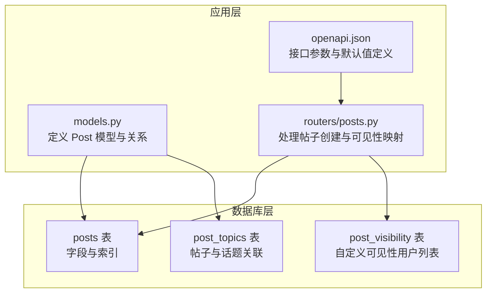
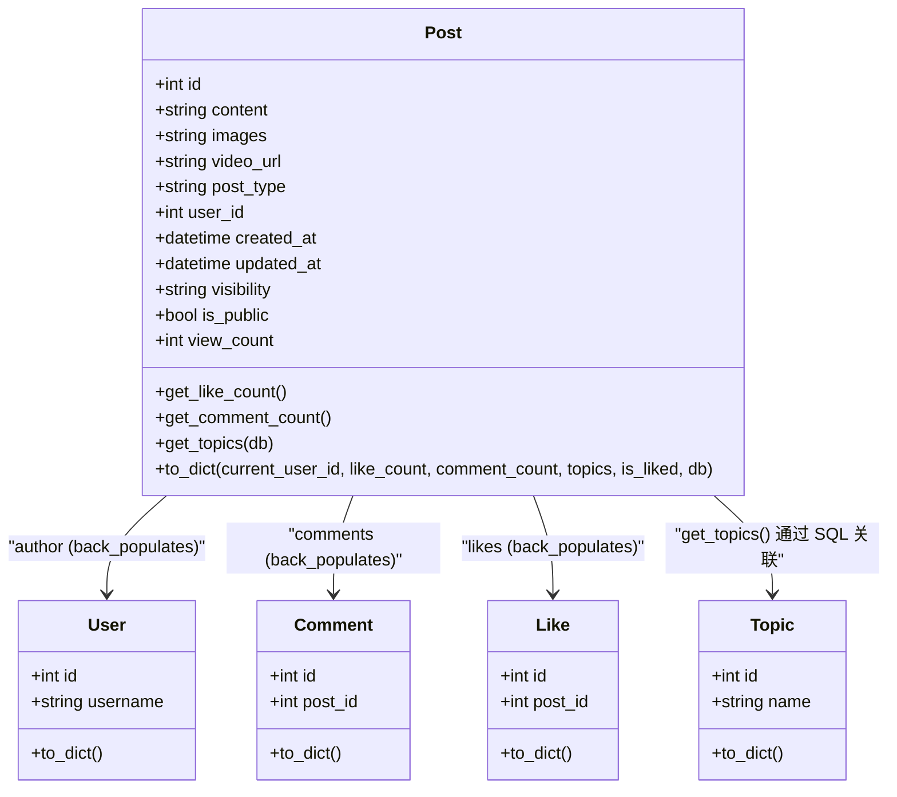
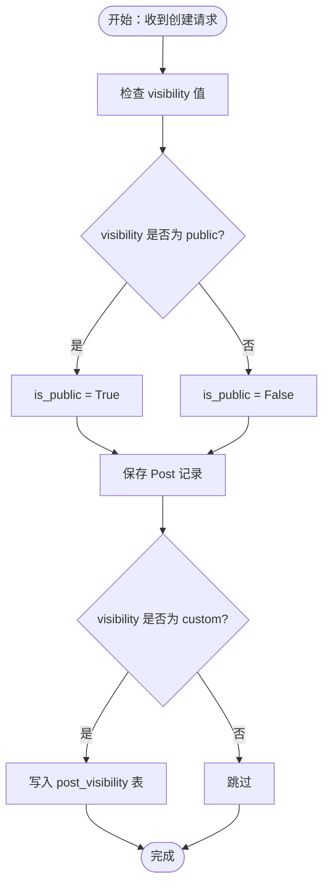
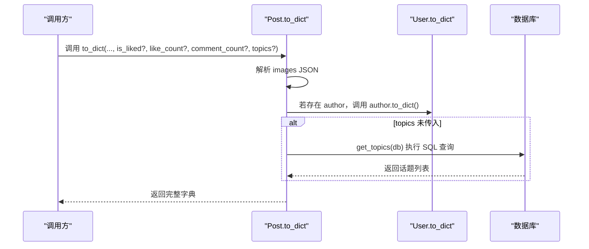
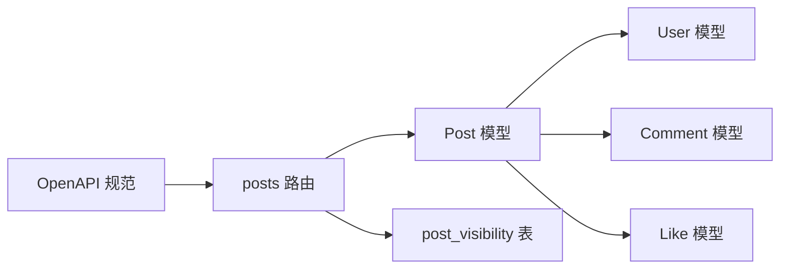

# 帖子模型

<cite>
**本文引用的文件**
- [models.py](file://app/models/models.py)
- [posts.py](file://app/routers/posts.py)
- [openapi.json](file://openapi.json)
</cite>

## 目录
1. [简介](#简介)
2. [项目结构](#项目结构)
3. [核心组件](#核心组件)
4. [架构总览](#架构总览)
5. [详细组件分析](#详细组件分析)
6. [依赖分析](#依赖分析)
7. [性能考量](#性能考量)
8. [故障排查指南](#故障排查指南)
9. [结论](#结论)
10. [附录](#附录)

## 简介
本文件为“帖子模型”的数据模型与实现文档，聚焦 Post 类的字段定义、类型与默认值，可见性与公开状态的关系，反向关系与统计字段的计算方式，to_dict 输出格式的复杂结构，以及 get_topics 的 SQL 查询逻辑与性能考虑。同时给出索引策略与查询优化建议，帮助开发者在保证功能正确性的前提下提升系统性能与可维护性。

## 项目结构
与帖子模型相关的核心文件位于应用层模型与路由模块中：
- 模型定义：app/models/models.py 中包含 Post 类及其字段、关系与辅助方法
- 路由处理：app/routers/posts.py 中包含帖子创建流程、可见性与公开状态的映射逻辑
- 接口规范：openapi.json 中定义了帖子接口的输入参数与默认值（如 visibility）

**图表来源**
- [models.py:100-181](file://app/models/models.py#L100-L181)
- [posts.py:69-134](file://app/routers/posts.py#L69-L134)
- [openapi.json:534-570](file://openapi.json#L534-L570)

**章节来源**
- [models.py:100-181](file://app/models/models.py#L100-L181)
- [posts.py:69-134](file://app/routers/posts.py#L69-L134)
- [openapi.json:534-570](file://openapi.json#L534-L570)

## 核心组件
- Post 模型：定义帖子实体的字段、默认值、外键关系与统计方法
- 路由层：负责接收请求、执行内容审核、构造 Post 实例、持久化并处理可见性映射
- OpenAPI 规范：约束 visibility 的枚举与默认值，指导客户端行为

**章节来源**
- [models.py:100-181](file://app/models/models.py#L100-L181)
- [posts.py:69-134](file://app/routers/posts.py#L69-L134)
- [openapi.json:534-570](file://openapi.json#L534-L570)

## 架构总览
Post 模型通过 SQLAlchemy ORM 映射到 posts 表，并与用户、评论、点赞、话题等实体建立关系。路由层在创建帖子时根据 visibility 计算 is_public，并在需要时写入 post_visibility 表；查询时通过 get_topics 执行显式 SQL 获取关联话题。

**图表来源**
- [models.py:100-181](file://app/models/models.py#L100-L181)

## 详细组件分析

### 字段定义与默认值
- content：Text，必填，存储帖子正文
- images：Text，可选，存储多图 URL 的 JSON 数组字符串
- video_url：String(255)，可选，存储视频链接
- post_type：String(20)，默认值为 text
- user_id：Integer，外键 users.id，必填，已建立索引
- created_at / updated_at：DateTime，默认时间与更新时间，已建立索引
- visibility：String(20)，默认值为 public
- is_public：Boolean，默认值为 True
- view_count：Integer，默认值为 0

上述字段与默认值均来自模型定义与接口规范。

**章节来源**
- [models.py:100-115](file://app/models/models.py#L100-L115)
- [openapi.json:559-568](file://openapi.json#L559-L568)

### 帖子类型（post_type）分类
- 默认值：text
- 在路由层创建流程中，当存在图片或视频时会将 post_type 设置为 image 或 video，否则保持 text
- 这一设计使系统能够区分纯文本、图文与视频类帖子，便于前端渲染与资源管理

**章节来源**
- [models.py:108](file://app/models/models.py#L108)
- [posts.py:73-87](file://app/routers/posts.py#L73-L87)

### 可见性与公开状态
- visibility：枚举值，来源于接口规范，取值包括 public、friends_only、private、custom
- is_public：布尔值，默认 True
- 路由层在创建帖子时，将 is_public 设为 visibility == "public" 的结果
- 当 visibility 为 custom 时，路由层会将可见用户列表写入 post_visibility 表，以支持定向可见

**图表来源**
- [posts.py:109-127](file://app/routers/posts.py#L109-L127)
- [openapi.json:559-568](file://openapi.json#L559-L568)

**章节来源**
- [posts.py:109-127](file://app/routers/posts.py#L109-L127)
- [openapi.json:559-568](file://openapi.json#L559-L568)

### 反向关系与统计字段
- author：反向关系，指向 User，用于在 to_dict 中输出作者信息
- comments：反向关系，指向 Comment，动态加载
- likes：反向关系，指向 Like，动态加载
- 统计字段：
  - get_like_count：通过 likes.count() 计算点赞数
  - get_comment_count：通过 comments.count() 计算评论数
  - view_count：直接返回 view_count 字段

注意：likes.count() 与 comments.count() 会在数据库执行聚合查询，属于 O(n) 的逐条统计，批量展示时应避免 N+1 查询。

**章节来源**
- [models.py:117-125](file://app/models/models.py#L117-L125)

### to_dict 输出格式
to_dict 返回一个结构化的字典，包含：
- 基础字段：id、content、images、image_urls、video_url、post_type、user_id、created_at、updated_at
- 可见性：visibility、is_public
- 统计：like_count、comment_count、view_count
- 作者：author（嵌套 User 的 to_dict）
- 话题：topics（嵌套 Topic 列表，若未传入则调用 get_topics(db) 查询）

参数约定：
- current_user_id：用于判断当前用户对帖子的点赞状态（is_liked），但需由调用方传入
- like_count、comment_count、topics：可由调用方传入以避免 N+1 查询
- db：可选，若未传入则内部创建新会话

**图表来源**
- [models.py:152-181](file://app/models/models.py#L152-L181)

**章节来源**
- [models.py:152-181](file://app/models/models.py#L152-L181)

### get_topics 的 SQL 查询逻辑与性能
- 查询逻辑：通过显式 SQL 将 topics 与 post_topics 关联，筛选出指定 post_id 的话题
- 性能考虑：
  - 该查询在单条帖子场景下是必要的
  - 在批量展示场景中，应由调用方预先加载 topics 并通过 to_dict 的 topics 参数传入，避免 N+1 查询
  - 建议在 post_topics 上建立 (post_id, topic_id) 复合索引，以加速关联查询

**章节来源**
- [models.py:127-150](file://app/models/models.py#L127-L150)

## 依赖分析
- Post 依赖 User（author）、Comment（comments）、Like（likes）
- 路由层依赖 Post 创建流程中的可见性映射与 post_visibility 表
- OpenAPI 规范约束 visibility 的取值与默认值，影响路由层与前端交互

**图表来源**
- [models.py:100-181](file://app/models/models.py#L100-L181)
- [posts.py:69-134](file://app/routers/posts.py#L69-L134)
- [openapi.json:534-570](file://openapi.json#L534-L570)

**章节来源**
- [models.py:100-181](file://app/models/models.py#L100-L181)
- [posts.py:69-134](file://app/routers/posts.py#L69-L134)
- [openapi.json:534-570](file://openapi.json#L534-L570)

## 性能考量
- 统计字段的计算：
  - get_like_count 与 get_comment_count 使用 count()，在批量场景下会产生 N+1 查询
  - 建议在展示列表时通过批量预加载或缓存统计值，减少数据库往返
- to_dict 的参数化：
  - 优先传入 like_count、comment_count、topics，避免内部重复查询
  - is_liked 也应由调用方传入，避免在 to_dict 内部创建新会话
- 索引策略：
  - 已有索引：user_id（外键）、created_at（时间排序）、updated_at（更新时间）
  - 建议新增：post_topics(post_id, topic_id) 复合索引，加速 get_topics 查询
  - 可选：对 visibility、is_public 进行过滤查询时，可考虑复合索引以优化筛选性能

[本节为通用性能建议，不直接分析具体文件]

## 故障排查指南
- 图片/视频上传失败：
  - 路由层在上传失败时会抛出 HTTP 异常，需检查上传服务与文件优化流程
- 内容审核拒绝：
  - 审核服务会记录拒绝原因，需查看日志并提示用户修改内容
- 可见性映射异常：
  - custom 可见性需确保 post_visibility 表写入成功
- JSON 解析错误：
  - to_dict 对 images 的 JSON 解析失败时会回退为空，需检查存储格式是否为合法 JSON 数组字符串

**章节来源**
- [posts.py:70-107](file://app/routers/posts.py#L70-L107)
- [posts.py:123-127](file://app/routers/posts.py#L123-L127)
- [models.py:154-159](file://app/models/models.py#L154-L159)

## 结论
Post 模型提供了清晰的字段定义与默认值，结合路由层的可见性映射与 OpenAPI 规范，实现了灵活的帖子发布与展示能力。通过合理使用 to_dict 的参数化与批量预加载，可有效避免 N+1 查询问题；配合针对性索引优化，可在高并发场景下获得更稳定的性能表现。

## 附录
- 字段与默认值参考路径：
  - [models.py:100-115](file://app/models/models.py#L100-L115)
- 可见性与公开状态映射参考路径：
  - [posts.py:109-127](file://app/routers/posts.py#L109-L127)
  - [openapi.json:559-568](file://openapi.json#L559-L568)
- 统计字段与反向关系参考路径：
  - [models.py:117-125](file://app/models/models.py#L117-L125)
- to_dict 输出格式参考路径：
  - [models.py:152-181](file://app/models/models.py#L152-L181)
- get_topics 查询逻辑参考路径：
  - [models.py:127-150](file://app/models/models.py#L127-L150)