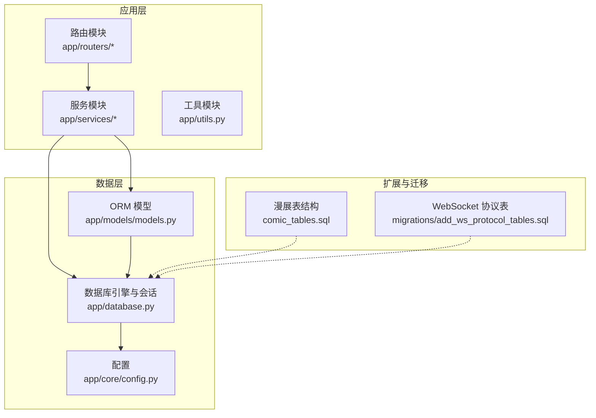
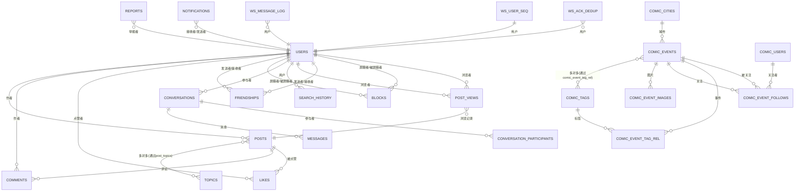
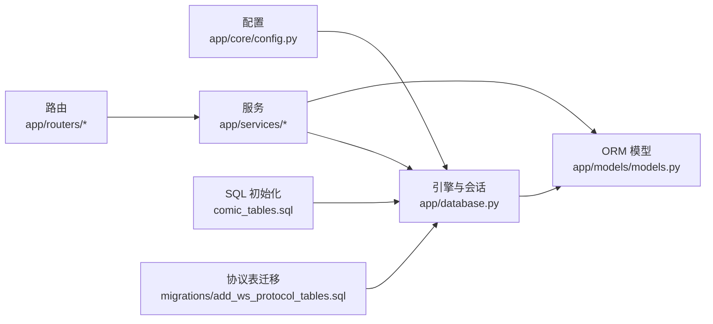

# 数据模型

<cite>
**本文引用的文件**
- [app/models/models.py](file://app/models/models.py)
- [app/database.py](file://app/database.py)
- [app/core/config.py](file://app/core/config.py)
- [comic_tables.sql](file://comic_tables.sql)
- [migrations/add_ws_protocol_tables.sql](file://migrations/add_ws_protocol_tables.sql)
- [app/routers/auth.py](file://app/routers/auth.py)
- [app/services/recommendation_service.py](file://app/services/recommendation_service.py)
- [app/ws_manager.py](file://app/ws_manager.py)
- [error_analysis.md](file://error_analysis.md)
</cite>

## 目录
1. [简介](#简介)
2. [项目结构](#项目结构)
3. [核心组件](#核心组件)
4. [架构总览](#架构总览)
5. [详细组件分析](#详细组件分析)
6. [依赖分析](#依赖分析)
7. [性能考量](#性能考量)
8. [故障排查指南](#故障排查指南)
9. [结论](#结论)
10. [附录](#附录)

## 简介
本文件为 NanTuPy 项目的全面数据模型文档，覆盖实体关系、字段定义与数据类型、主键/外键与索引约束、数据验证与业务规则、数据库架构图与示例数据、数据访问模式与缓存策略、性能优化建议、数据生命周期与归档、迁移路径与版本管理、以及数据安全与隐私要求。文档面向技术与非技术读者，力求以循序渐进的方式呈现。

## 项目结构
NanTuPy 使用 SQLAlchemy 2.x 声明式模型定义数据结构，并通过 FastAPI 的依赖注入提供数据库会话。应用包含社交内容、用户关系、消息与通知、话题与标签、漫展相关扩展以及 WebSocket 协议支持等模块。数据库初始化与连接参数在配置模块中集中管理。

图表来源
- [app/models/models.py](file://app/models/models.py)
- [app/database.py](file://app/database.py)
- [app/core/config.py](file://app/core/config.py)
- [comic_tables.sql](file://comic_tables.sql)
- [migrations/add_ws_protocol_tables.sql](file://migrations/add_ws_protocol_tables.sql)

章节来源
- [app/models/models.py](file://app/models/models.py)
- [app/database.py](file://app/database.py)
- [app/core/config.py](file://app/core/config.py)

## 核心组件
本节概述主要数据实体及其职责边界：
- 用户与身份：用户基本信息、隐私与通知偏好、激活状态与管理员标识。
- 内容生态：帖子、评论、点赞、浏览记录、话题标签、内容可见性与默认策略。
- 社交关系：好友请求、屏蔽、会话与消息、通知与举报。
- 搜索与敏感词：搜索历史、敏感词库。
- 漫展扩展：城市、标签、活动、图片、关注与标签关联。
- WebSocket 协议：消息序号日志、用户序号计数器、ACK 去重与清理策略。

章节来源
- [app/models/models.py](file://app/models/models.py)
- [app/routers/auth.py](file://app/routers/auth.py)

## 架构总览
下图展示核心实体之间的关系与依赖，包括多对多关联表与外键约束。

图表来源
- [app/models/models.py](file://app/models/models.py)
- [comic_tables.sql](file://comic_tables.sql)
- [migrations/add_ws_protocol_tables.sql](file://migrations/add_ws_protocol_tables.sql)

## 详细组件分析

### 用户与身份（Users）
- 主键：自增整数 id
- 唯一约束：username、email
- 索引：username、email
- 字段要点：密码哈希、个人简介、头像与封面、创建/更新时间、激活状态与管理员标识；隐私设置（资料可见性、默认内容可见性、是否允许搜索、是否显示邮箱、好友请求策略）、通知偏好（推送、消息、声音）
- 关系：一对多到帖子、评论、点赞、屏蔽、浏览记录；双向一对多到好友关系（发送与接收）

章节来源
- [app/models/models.py](file://app/models/models.py)

### 帖子（Posts）
- 主键：自增整数 id
- 外键：user_id 引用 users.id
- 索引：user_id、created_at
- 字段要点：内容文本、多图 JSON 数组字符串、视频链接、类型（默认 text）、可见性（默认 public）、公开标记、浏览计数、创建/更新时间
- 关系：多对多到话题（通过 post_topics），一对多到评论与点赞
- 方法：统计点赞/评论数量、批量序列化输出（to_dict），支持传入外部计算结果避免 N+1

章节来源
- [app/models/models.py](file://app/models/models.py)

### 评论（Comments）
- 主键：自增整数 id
- 外键：user_id 引用 users.id；post_id 引用 posts.id；parent_id 引用自身 id（实现回复树）
- 索引：post_id+parent_id、parent_id+created_at
- 字段要点：内容、回复目标用户 id、点赞/回复计数、创建/更新时间
- 关系：多级父子关系（回复树）、与作者、帖子、回复目标用户的关联

章节来源
- [app/models/models.py](file://app/models/models.py)

### 点赞（Likes）
- 主键：自增整数 id
- 外键：user_id 引用 users.id；post_id 引用 posts.id；comment_id 引用 comments.id
- 索引：comment_id+user_id
- 字段要点：创建时间
- 业务规则：同一用户对同一评论/帖子仅能有一次点赞记录（需应用层保证幂等）

章节来源
- [app/models/models.py](file://app/models/models.py)

### 好友关系（Friendships）
- 主键：自增整数 id
- 外键：sender_id、receiver_id 引用 users.id
- 字段要点：状态（pending/accepted/rejected/blocked）、创建/更新时间
- 关系：双向到用户（发送者/接收者）

章节来源
- [app/models/models.py](file://app/models/models.py)

### 会话与消息（Conversations, Messages）
- 会话：两用户之间的一对一会话，维护最后消息时间
- 消息：属于会话，支持文本/图片/系统消息类型，含媒体链接、相关 id、已读标记
- 关系：会话到消息与参与者，消息到发送者与会话

章节来源
- [app/models/models.py](file://app/models/models.py)

### 通知（Notifications）
- 主键：自增整数 id
- 外键：user_id、sender_id 引用 users.id
- 字段要点：类型、标题、内容、相关对象类型与 id、已读标记、创建时间

章节来源
- [app/models/models.py](file://app/models/models.py)

### 话题（Topics）
- 主键：自增整数 id
- 唯一约束：name
- 索引：name
- 字段要点：描述、图标、颜色、帖子/关注计数、热度标记、创建/更新时间
- 关系：多对多到帖子（通过 post_topics）

章节来源
- [app/models/models.py](file://app/models/models.py)

### 屏蔽（Blocks）
- 主键：自增整数 id
- 外键：blocker_id、blocked_id 引用 users.id
- 字段要点：创建时间

章节来源
- [app/models/models.py](file://app/models/models.py)

### 举报（Reports）
- 主键：自增整数 id
- 外键：reporter_id 引用 users.id
- 字段要点：目标类型/id、原因、描述、状态（默认 pending）、创建/处理时间

章节来源
- [app/models/models.py](file://app/models/models.py)

### 浏览记录（PostViews）
- 主键：自增整数 id
- 外键：post_id、user_id 引用 posts.id、users.id
- 字段要点：创建时间

章节来源
- [app/models/models.py](file://app/models/models.py)

### 搜索历史（SearchHistory）
- 主键：自增整数 id
- 外键：user_id 引用 users.id
- 索引：user_id+created_at
- 字段要点：查询语句、查询类型（默认 global）、创建时间

章节来源
- [app/models/models.py](file://app/models/models.py)

### 敏感词（SensitiveWords）
- 主键：自增整数 id
- 唯一约束：word
- 字段要点：创建时间

章节来源
- [app/models/models.py](file://app/models/models.py)

### 漫展扩展（Comic*）
- 城市（comic_cities）：名称、省份、排序、创建时间
- 标签（comic_tags）：名称、类型（展会类型/规模）、创建时间
- 活动（comic_events）：名称、城市、场馆、起止日期/时间、票务、官网、介绍、状态、创建者、创建/更新时间；多对多到标签（通过 rel 表），一对多到图片与关注
- 图片（comic_event_images）：活动、URL、封面标志、排序
- 关注（comic_event_follows）：唯一约束（活动+用户）、创建时间

章节来源
- [app/models/models.py](file://app/models/models.py)
- [comic_tables.sql](file://comic_tables.sql)

### WebSocket 协议表（WS*）
- 消息日志（ws_message_log）：唯一约束（用户+序号）、索引（用户+序号）、JSON 负载、创建时间
- 用户序号计数器（ws_user_seq）：主键用户 id、当前序号
- ACK 去重（ws_ack_dedup）：主键客户端消息 id、用户 id、处理时间
- 清理策略：去重表定期清理 24 小时前记录；消息日志定期清理 7 天前记录

章节来源
- [app/models/models.py](file://app/models/models.py)
- [migrations/add_ws_protocol_tables.sql](file://migrations/add_ws_protocol_tables.sql)
- [app/ws_manager.py](file://app/ws_manager.py)

## 依赖分析
- ORM 基于 SQLAlchemy 2.x 声明式基类，统一在数据库模块中创建引擎与会话。
- 路由层通过依赖注入获取数据库会话，确保事务一致性与资源回收。
- 推荐服务在查询中使用多表连接与分组聚合，结合时间衰减与互动分数，避免昂贵 COUNT。
- 漫展与 WebSocket 表结构独立于 ORM 模型，通过 SQL 文件初始化，迁移脚本提供清理策略。

图表来源
- [app/core/config.py](file://app/core/config.py)
- [app/database.py](file://app/database.py)
- [app/models/models.py](file://app/models/models.py)
- [comic_tables.sql](file://comic_tables.sql)
- [migrations/add_ws_protocol_tables.sql](file://migrations/add_ws_protocol_tables.sql)

章节来源
- [app/core/config.py](file://app/core/config.py)
- [app/database.py](file://app/database.py)
- [app/models/models.py](file://app/models/models.py)
- [app/services/recommendation_service.py](file://app/services/recommendation_service.py)

## 性能考量
- 查询优化
  - 使用外连接与分组聚合替代昂贵 COUNT，通过“多取一条判断 has_more”减少总条数统计开销。
  - 对热点字段建立复合索引（如评论的 post_id+parent_id、parent_id+created_at；搜索历史 user_id+created_at；点赞的 comment_id+user_id；WS 的 user_id+seq）。
  - 时间衰减函数与限制结果集大小，避免全表扫描。
- 连接池与会话
  - 配置池大小、溢出、回收与预检查，确保高并发下的稳定性。
- 缓存策略
  - 对热点内容与用户画像采用应用层缓存（建议基于 Redis），结合失效策略与一致性保障。
  - 对推荐结果按用户维度缓存短期有效结果，降低重复计算。
- IO 与存储
  - 图片优化与压缩（参考图像优化服务），控制上传尺寸与格式白名单，减少存储与带宽压力。
- 清理与归档
  - WebSocket 去重与消息日志定期清理，避免无限增长。
  - 建议对历史数据进行冷热分离与归档，保留必要审计与合规数据。

章节来源
- [app/services/recommendation_service.py](file://app/services/recommendation_service.py)
- [app/database.py](file://app/database.py)
- [migrations/add_ws_protocol_tables.sql](file://migrations/add_ws_protocol_tables.sql)

## 故障排查指南
- 列名不匹配
  - 现象：浏览记录写入时模型字段与数据库列名不一致，导致 500。
  - 影响：posts 路由写入 PostView。
  - 解决：统一列名或调整模型字段映射。
- 缺失 to_dict 方法
  - 现象：部分模型在路由中调用 to_dict，但模型未定义，导致 500。
  - 影响：Friendship、Block、Like、Conversation、Message、Notification、Report。
  - 解决：为上述模型补充 to_dict 方法或在路由中直接构造响应结构。
- 约束不匹配
  - 现象：likes 表 post_id 实际为 NOT NULL，但模型定义允许为空。
  - 影响：插入点赞时违反约束。
  - 解决：修正模型字段约束与数据库结构一致。
- 数据访问模式
  - 确保路由层使用依赖注入获取会话，异常时回滚并关闭会话，避免连接泄漏。
- 安全与隐私
  - 密码必须哈希存储，禁止明文保存。
  - 隐私字段（如邮箱显示、搜索可见性）严格按用户设置过滤输出。
  - 举报与屏蔽功能应配合权限校验与审计日志。

章节来源
- [error_analysis.md](file://error_analysis.md)
- [app/models/models.py](file://app/models/models.py)
- [app/routers/auth.py](file://app/routers/auth.py)

## 结论
本数据模型文档梳理了 NanTuPy 的核心实体、关系与约束，明确了索引与性能优化方向，并指出了当前存在的列名与约束不一致问题。建议尽快修复模型与数据库结构差异，补充缺失的序列化方法，完善缓存与清理策略，并强化安全与隐私保护措施。后续版本可通过迁移脚本逐步演进，保持向后兼容与数据一致性。

## 附录

### 数据库架构图（含索引与约束）

```mermaid
erDiagram
USERS {
int id PK
string username UK
string email UK
string bio
string avatar_url
string cover_photo_url
datetime created_at
datetime updated_at
boolean is_active
boolean is_admin
string profile_visibility
string post_default_visibility
boolean show_email
boolean allow_search
string allow_friend_requests
boolean notify_push
boolean notify_message
boolean notify_sound
}
POSTS {
int id PK
int user_id FK
text content
text images
string video_url
string post_type
datetime created_at
datetime updated_at
string visibility
boolean is_public
int view_count
}
COMMENTS {
int id PK
int user_id FK
int post_id FK
int parent_id FK
int reply_to_user_id FK
int like_count
int reply_count
datetime created_at
datetime updated_at
}
LIKES {
int id PK
int user_id FK
int post_id FK
int comment_id FK
datetime created_at
}
FRIENDSHIPS {
int id PK
int sender_id FK
int receiver_id FK
string status
datetime created_at
datetime updated_at
}
CONVERSATIONS {
int id PK
int user1_id FK
int user2_id FK
datetime created_at
datetime updated_at
datetime last_message_at
}
MESSAGES {
int id PK
int conversation_id FK
int sender_id FK
text content
string message_type
string media_url
int related_id
boolean is_read
datetime created_at
}
NOTIFICATIONS {
int id PK
int user_id FK
int sender_id FK
string notification_type
string title
text content
int related_id
string related_type
boolean is_read
datetime created_at
}
TOPICS {
int id PK
string name UK
text description
string icon_url
string color
int post_count
int follower_count
boolean is_trending
datetime created_at
datetime updated_at
}
BLOCKS {
int id PK
int blocker_id FK
int blocked_id FK
datetime created_at
}
REPORTS {
int id PK
int reporter_id FK
string target_type
int target_id
string reason
text description
string status
datetime created_at
datetime resolved_at
}
POST_VIEWS {
int id PK
int post_id FK
int user_id FK
datetime created_at
}
SEARCH_HISTORY {
int id PK
int user_id FK
string query
string search_type
datetime created_at
}
SENSITIVE_WORDS {
int id PK
string word UK
datetime created_at
}
COMIC_CITIES {
int id PK
string name
string province
int sort_order
datetime created_at
}
COMIC_TAGS {
int id PK
string name
string tag_type
datetime created_at
}
COMIC_EVENTS {
int id PK
string name
int city_id FK
string venue
date start_date
date end_date
string start_time
string end_time
string ticket_info
string website
text intro
int status
int creator_id FK
datetime created_at
datetime updated_at
}
COMIC_EVENT_IMAGES {
int id PK
int event_id FK
string image_url
int is_cover
int sort_order
}
COMIC_EVENT_TAG_REL {
int id PK
int event_id FK
int tag_id FK
}
COMIC_EVENT_FOLLOWS {
int id PK
int event_id FK
int user_id FK
datetime created_at
}
WS_MESSAGE_LOG {
int id PK
int user_id FK
int seq
text payload
datetime created_at
}
WS_USER_SEQ {
int user_id PK
int current_seq
}
WS_ACK_DEDUP {
string client_msg_id PK
int user_id FK
datetime processed_at
}
```

图表来源
- [app/models/models.py](file://app/models/models.py)
- [comic_tables.sql](file://comic_tables.sql)
- [migrations/add_ws_protocol_tables.sql](file://migrations/add_ws_protocol_tables.sql)

### 示例数据
- 用户：用户名、邮箱、密码哈希、创建时间、隐私与通知偏好
- 帖子：内容、图片数组、视频链接、可见性、公开标记、创建/更新时间
- 评论：内容、父评论 id、回复目标用户 id、创建/更新时间
- 点赞：用户 id、帖子 id 或评论 id、创建时间
- 话题：名称、描述、图标、颜色、计数与热度标记
- 会话与消息：会话成员、消息内容与类型、已读标记
- 举报：目标类型/id、原因、状态、创建/处理时间
- 漫展：活动名称、城市、起止日期/时间、票务、官网、介绍、状态、创建者
- WebSocket：消息序号、负载、ACK 去重 id

### 数据访问模式
- 路由层通过依赖注入获取数据库会话，执行查询与写入，异常时回滚并抛出错误。
- 推荐服务使用多表连接与分组聚合，结合时间衰减与互动分数，避免昂贵 COUNT。
- 漫展与 WebSocket 表通过 SQL 初始化与迁移脚本维护，定期清理过期数据。

章节来源
- [app/routers/auth.py](file://app/routers/auth.py)
- [app/services/recommendation_service.py](file://app/services/recommendation_service.py)
- [migrations/add_ws_protocol_tables.sql](file://migrations/add_ws_protocol_tables.sql)

### 数据生命周期、保留策略与归档
- WebSocket：去重表保留 24 小时，消息日志保留 7 天，到期自动清理。
- 建议：对历史帖子、评论、通知与搜索历史制定冷热分离策略，保留审计与合规所需数据。

章节来源
- [migrations/add_ws_protocol_tables.sql](file://migrations/add_ws_protocol_tables.sql)
- [app/ws_manager.py](file://app/ws_manager.py)

### 数据迁移路径与版本管理
- 使用 SQL 文件初始化核心表结构（如漫展与 WebSocket 协议表）。
- 建议引入迁移工具（如 Alembic）管理模型变更，保持数据库版本与代码同步。
- 迁移时注意约束与索引一致性，避免运行时 500。

章节来源
- [comic_tables.sql](file://comic_tables.sql)
- [migrations/add_ws_protocol_tables.sql](file://migrations/add_ws_protocol_tables.sql)

### 数据安全、隐私与访问控制
- 密码必须哈希存储，传输使用 HTTPS。
- 隐私字段严格按用户设置过滤输出，如邮箱显示、搜索可见性、好友请求策略。
- 举报与屏蔽功能需配合权限校验与审计日志，防止滥用。

章节来源
- [app/models/models.py](file://app/models/models.py)
- [app/routers/auth.py](file://app/routers/auth.py)

### 最佳实践与设计原则
- 明确主键/外键与唯一约束，确保引用完整性。
- 为热点字段建立复合索引，避免全表扫描。
- 使用依赖注入管理会话，异常回滚与资源释放。
- 对推荐与统计类查询使用近似算法与缓存，提升响应速度。
- 定期清理与归档历史数据，控制存储成本与查询复杂度。