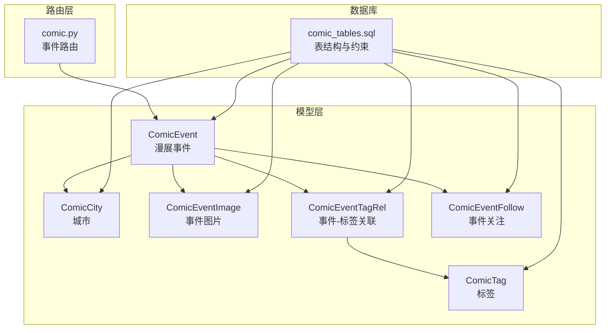
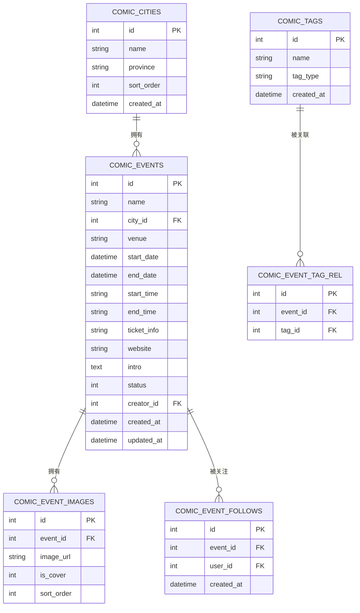
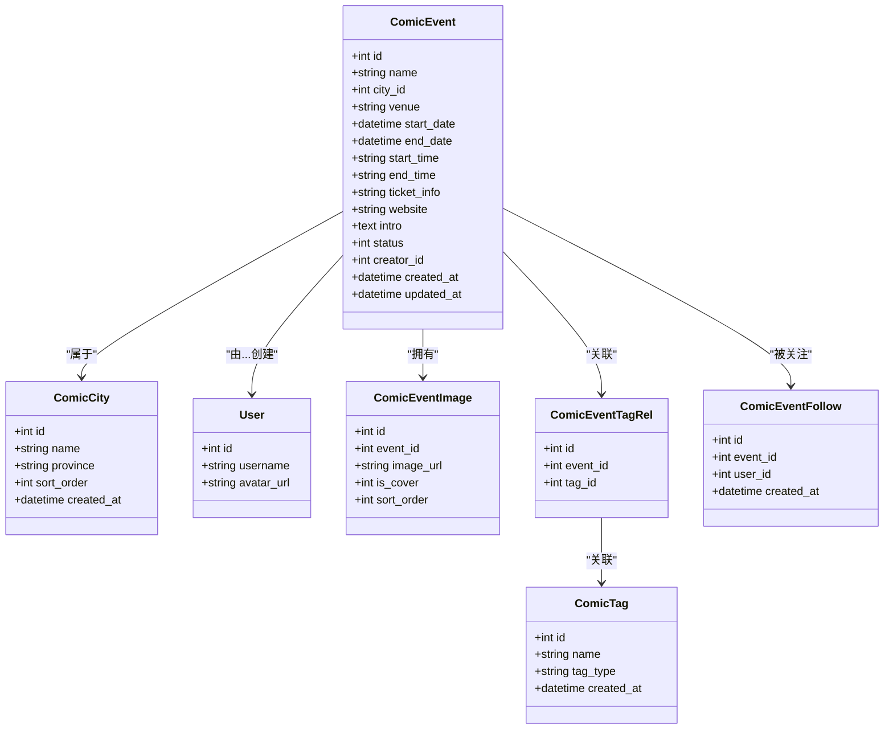
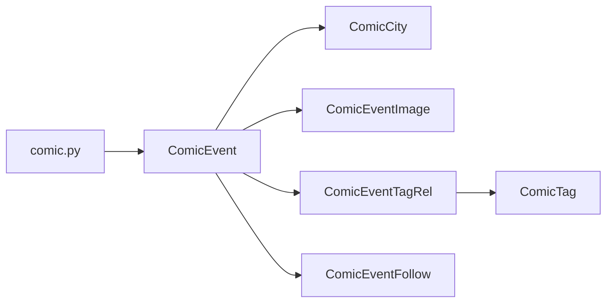

# 漫展模型

<cite>
**本文引用的文件**
- [app/models/models.py](file://app/models/models.py)
- [app/routers/comic.py](file://app/routers/comic.py)
- [comic_tables.sql](file://comic_tables.sql)
- [openapi.json](file://openapi.json)
</cite>

## 目录
1. [简介](#简介)
2. [项目结构](#项目结构)
3. [核心组件](#核心组件)
4. [架构总览](#架构总览)
5. [详细组件分析](#详细组件分析)
6. [依赖分析](#依赖分析)
7. [性能考虑](#性能考虑)
8. [故障排查指南](#故障排查指南)
9. [结论](#结论)
10. [附录](#附录)

## 简介
本文件系统性地文档化了社交平台中的“漫展”相关数据模型与业务流程，覆盖以下主题：
- 城市模型 ComicCity 的设计与用途
- 标签模型 ComicTag 的设计与用途
- 漫展事件模型 ComicEvent 的完整信息结构（时间安排、地点信息、票务信息、状态管理等）
- 多对多关系模型：ComicEventImage 图片关联、ComicEventTagRel 标签关联、ComicEventFollow 关注关系
- 漫展数据的业务逻辑与状态流转（即将开始、进行中、已结束）
- 各模型之间的外键约束与数据完整性保障
- 漫展数据查询与展示的最佳实践
- 漫展功能与社交平台其他模块的集成方式

## 项目结构
与漫展模型直接相关的文件与职责如下：
- 数据模型定义：位于 app/models/models.py，包含实体类与关系映射
- 数据库表结构：位于 comic_tables.sql，定义了各表的字段、索引与外键约束
- 路由与业务逻辑：位于 app/routers/comic.py，负责事件查询、详情、更新、关注等操作
- 接口契约与示例：位于 openapi.json，描述事件创建/更新的请求体字段

图表来源
- [app/models/models.py:531-615](file://app/models/models.py#L531-L615)
- [app/routers/comic.py:106-583](file://app/routers/comic.py#L106-L583)
- [comic_tables.sql:1-68](file://comic_tables.sql#L1-L68)

章节来源
- [app/models/models.py:531-615](file://app/models/models.py#L531-L615)
- [app/routers/comic.py:106-583](file://app/routers/comic.py#L106-L583)
- [comic_tables.sql:1-68](file://comic_tables.sql#L1-L68)

## 核心组件
本节概述三个核心实体及其职责：
- ComicCity：存储漫展所在城市信息，支持按省/排序字段组织
- ComicTag：存储漫展标签，区分类型与规模两类标签
- ComicEvent：存储漫展事件的完整信息，包括时间安排、地点、票务、简介、状态与创建者

章节来源
- [app/models/models.py:534-581](file://app/models/models.py#L534-L581)
- [app/routers/comic.py:106-139](file://app/routers/comic.py#L106-L139)

## 架构总览
下图展示了模型间的关系与外键约束，以及路由层如何通过 SQL 查询聚合数据：

图表来源
- [comic_tables.sql:1-68](file://comic_tables.sql#L1-L68)
- [app/models/models.py:534-615](file://app/models/models.py#L534-L615)

## 详细组件分析

### ComicCity 城市模型
- 字段要点
  - 主键 id
  - 城市名称 name
  - 所在省份 province（默认值用于初始化）
  - 排序字段 sort_order
  - 创建时间 created_at
- 设计意图
  - 为漫展事件提供地理归属，便于按城市/省份筛选与聚合
- 外键关系
  - ComicEvent.city_id 引用 ComicCity.id

章节来源
- [app/models/models.py:534-543](file://app/models/models.py#L534-L543)
- [comic_tables.sql:1-10](file://comic_tables.sql#L1-L10)

### ComicTag 标签模型
- 字段要点
  - 主键 id
  - 标签名 name
  - 标签类型 tag_type（如展会类型、规模等）
  - 创建时间 created_at
- 设计意图
  - 支持对漫展事件进行多维分类标注，便于检索与推荐
- 外键关系
  - 通过中间表 ComicEventTagRel 关联到 ComicEvent

章节来源
- [app/models/models.py:545-553](file://app/models/models.py#L545-L553)
- [comic_tables.sql:10-18](file://comic_tables.sql#L10-L18)

### ComicEvent 漫展事件模型
- 字段要点
  - 主键 id
  - 事件名称 name
  - 城市 city_id（外键）
  - 地点 venue
  - 开始/结束日期 start_date/end_date
  - 开始/结束时间 start_time/end_time
  - 票务信息 ticket_info
  - 官方网站 website
  - 简介 intro
  - 状态 status（0=即将开始, 1=进行中, 2=已结束）
  - 创建者 creator_id（外键）
  - 创建/更新时间 created_at/updated_at
- 关系映射
  - 与 ComicCity 的多对一
  - 与用户 User 的多对一（创建者）
  - 与图片、标签关联、关注关系的一对多（级联删除）
- 业务逻辑
  - 状态根据当前时间与起止日期自动或手动维护
  - 支持按关注者、标签、城市等维度聚合查询

图表来源
- [app/models/models.py:534-615](file://app/models/models.py#L534-L615)

章节来源
- [app/models/models.py:555-581](file://app/models/models.py#L555-L581)
- [app/routers/comic.py:106-139](file://app/routers/comic.py#L106-L139)

### 多对多关系模型

#### ComicEventImage 图片关联
- 表结构
  - 主键 id
  - event_id（外键，级联删除）
  - image_url
  - is_cover（封面标记）
  - sort_order（排序）
- 关系映射
  - 与 ComicEvent 的一对多（级联删除）

章节来源
- [app/models/models.py:583-594](file://app/models/models.py#L583-L594)
- [comic_tables.sql:39-47](file://comic_tables.sql#L39-L47)

#### ComicEventTagRel 标签关联
- 表结构
  - 主键 id
  - event_id（外键，级联删除）
  - tag_id（外键，级联删除）
  - 唯一索引 (event_id, tag_id)
- 关系映射
  - 与 ComicEvent、ComicTag 的多对多

章节来源
- [app/models/models.py:596-606](file://app/models/models.py#L596-L606)
- [comic_tables.sql:49-57](file://comic_tables.sql#L49-L57)

#### ComicEventFollow 关注关系
- 表结构
  - 主键 id
  - event_id（外键，级联删除）
  - user_id（外键，级联删除）
  - created_at
  - 唯一索引 (event_id, user_id)
- 关系映射
  - 与 ComicEvent 的一对多

章节来源
- [app/models/models.py:607-615](file://app/models/models.py#L607-L615)
- [comic_tables.sql:59-68](file://comic_tables.sql#L59-L68)

### 业务逻辑与状态流转
- 状态枚举
  - 0：即将开始
  - 1：进行中
  - 2：已结束
- 状态计算策略
  - 当前时间早于起始日期：0
  - 当前时间处于起止日期之间：1
  - 当前时间晚于结束日期：2
- 实现位置
  - 状态字段定义与关系映射位于模型层
  - 路由层提供按关注者聚合的查询示例，可扩展为按状态过滤

章节来源
- [app/models/models.py](file://app/models/models.py#L570)
- [app/routers/comic.py:560-583](file://app/routers/comic.py#L560-L583)

### 数据完整性与外键约束
- 约束清单
  - ComicEvent.city_id 引用 ComicCity.id
  - ComicEvent.creator_id 引用 users.id
  - ComicEventImage.event_id 引用 ComicEvent.id（级联删除）
  - ComicEventTagRel(event_id, tag_id) 唯一约束；分别引用 ComicEvent.id 与 ComicTag.id（级联删除）
  - ComicEventFollow(event_id, user_id) 唯一约束；分别引用 ComicEvent.id 与 users.id（级联删除）
- 作用
  - 防止悬挂引用
  - 删除事件时自动清理其图片、标签与关注记录

章节来源
- [comic_tables.sql:1-68](file://comic_tables.sql#L1-L68)

### 查询与展示最佳实践
- 聚合查询
  - 使用 SQL 聚合函数与连接查询一次性返回事件、封面图、关注数、标签名、创建者信息
  - 参考路由层的聚合 SQL 示例
- 性能优化建议
  - 对 event_id、user_id、tag_id 建立索引以加速关联查询
  - 封面图优先选择 is_cover=1 的记录，其次按 sort_order 排序
- 展示要点
  - 将状态码转换为中文文本（即将开始/进行中/已结束）
  - 区分当前登录用户的“拥有者”与“关注者”身份，以便控制操作按钮显示

章节来源
- [app/routers/comic.py:106-139](file://app/routers/comic.py#L106-L139)
- [app/routers/comic.py:560-583](file://app/routers/comic.py#L560-L583)

### 与社交平台其他模块的集成
- 用户模块
  - 事件创建者 creator_id 引用 users.id，详情页展示用户名与头像
- 关注机制
  - 通过 ComicEventFollow 实现用户对事件的关注，路由层提供关注/取消关注接口路径
- 标签与检索
  - 通过 ComicEventTagRel 与 ComicTag 实现标签化，便于搜索与推荐
- API 契约
  - openapi.json 中定义了事件创建/更新的请求体字段（名称、城市、地点、时间、票务、简介、标签ID、图片URL等），前端据此构造请求

章节来源
- [app/models/models.py](file://app/models/models.py#L571)
- [app/routers/comic.py:357-368](file://app/routers/comic.py#L357-L368)
- [openapi.json:3850-3896](file://openapi.json#L3850-L3896)

## 依赖分析
- 模型层依赖
  - ComicEvent 依赖 ComicCity、User、ComicEventImage、ComicEventTagRel、ComicEventFollow
  - 关联表依赖各自主表
- 路由层依赖
  - 通过 SQL 直接查询与聚合，减少 ORM 层复杂度
- 数据库层依赖
  - 外键与唯一索引确保数据一致性与去重

图表来源
- [app/routers/comic.py:106-583](file://app/routers/comic.py#L106-L583)
- [app/models/models.py:534-615](file://app/models/models.py#L534-L615)

章节来源
- [app/routers/comic.py:106-583](file://app/routers/comic.py#L106-L583)
- [app/models/models.py:534-615](file://app/models/models.py#L534-L615)

## 性能考虑
- 查询路径
  - 使用单次 SQL 聚合返回事件列表、封面图、关注数、标签名与创建者信息，避免 N+1 查询
- 索引建议
  - 在 comic_events(city_id)、comic_events(creator_id)、comic_event_images(event_id)、comic_event_tag_rel(event_id, tag_id)、comic_event_follows(event_id, user_id) 上建立索引
- 缓存策略
  - 对热门城市的事件列表与热门标签下的事件集合进行缓存
- 分页与排序
  - 列表查询支持分页参数，按最新关注时间或创建时间排序

## 故障排查指南
- 常见问题
  - 删除事件后图片/标签/关注未清理：检查外键约束与级联删除配置
  - 关注重复：确认唯一索引 (event_id, user_id) 是否生效
  - 标签重复：确认唯一索引 (event_id, tag_id) 是否生效
  - 状态不正确：核对状态计算逻辑与当前时间对比
- 定位手段
  - 查看 comic_tables.sql 的建表语句与索引定义
  - 在路由层 SQL 中定位具体字段与连接条件
- 修复建议
  - 如需调整状态计算，修改路由层或服务层的状态判定逻辑
  - 如需扩展字段，先在 comic_tables.sql 添加列与索引，再在模型层补充映射

章节来源
- [comic_tables.sql:1-68](file://comic_tables.sql#L1-L68)
- [app/routers/comic.py:106-139](file://app/routers/comic.py#L106-L139)

## 结论
本数据模型围绕“城市-标签-事件-图片-关注-用户”的完整闭环构建，通过明确的外键约束与唯一索引保障数据完整性，并在路由层采用聚合查询提升性能。状态机清晰、扩展性强，便于后续接入搜索、推荐与通知等模块。

## 附录

### 字段与类型对照（概要）
- ComicCity：id, name, province, sort_order, created_at
- ComicTag：id, name, tag_type, created_at
- ComicEvent：id, name, city_id, venue, start_date, end_date, start_time, end_time, ticket_info, website, intro, status, creator_id, created_at, updated_at
- ComicEventImage：id, event_id, image_url, is_cover, sort_order
- ComicEventTagRel：id, event_id, tag_id
- ComicEventFollow：id, event_id, user_id, created_at

章节来源
- [app/models/models.py:534-615](file://app/models/models.py#L534-L615)
- [comic_tables.sql:1-68](file://comic_tables.sql#L1-L68)