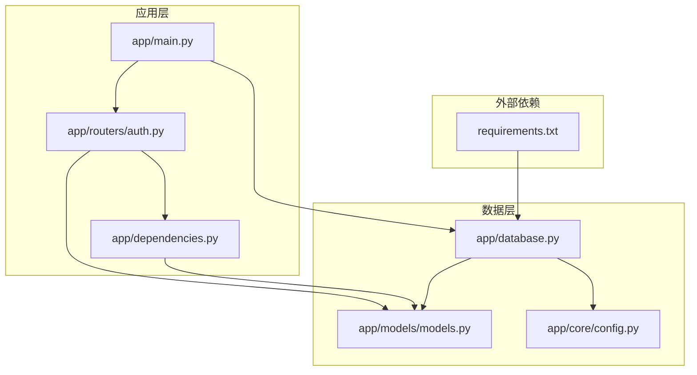
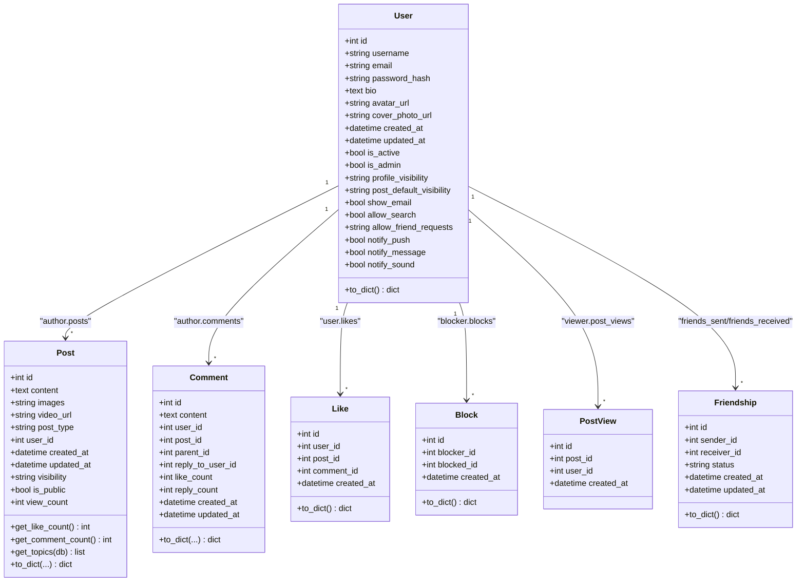
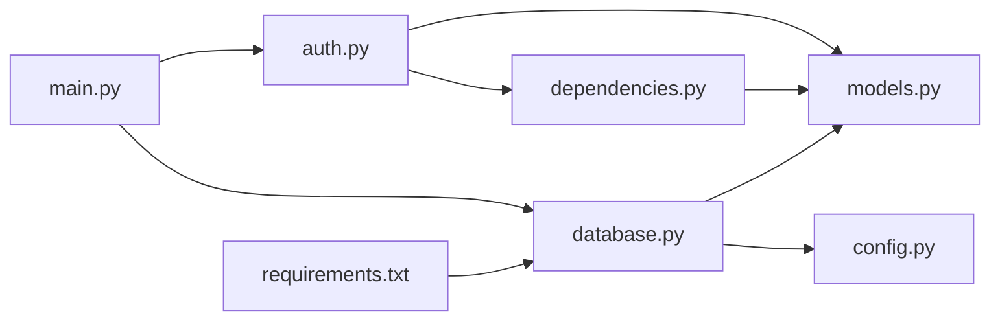

# 用户模型

<cite>
**本文档引用的文件**
- [models.py](file://app/models/models.py)
- [auth.py](file://app/routers/auth.py)
- [dependencies.py](file://app/dependencies.py)
- [database.py](file://app/database.py)
- [config.py](file://app/core/config.py)
- [main.py](file://app/main.py)
- [requirements.txt](file://requirements.txt)
</cite>

## 目录
1. [简介](#简介)
2. [项目结构](#项目结构)
3. [核心组件](#核心组件)
4. [架构总览](#架构总览)
5. [详细组件分析](#详细组件分析)
6. [依赖分析](#依赖分析)
7. [性能考量](#性能考量)
8. [故障排查指南](#故障排查指南)
9. [结论](#结论)

## 简介
本文件面向“用户模型”的数据模型文档，聚焦于 User 类的字段定义、数据类型、约束条件、隐私设置字段的作用与取值范围、用户关系映射（posts、comments、likes、blocks、post_views 等反向关系）、to_dict 方法输出格式与字段含义、认证相关的 password_hash 字段与安全考虑、索引策略与性能优化建议，以及用户数据验证规则与业务逻辑约束。

## 项目结构
用户模型位于数据层，通过 SQLAlchemy 2.x Declarative 方式定义；认证与隐私设置通过 FastAPI 路由模块提供接口；数据库连接与会话管理在独立模块中配置。

图表来源
- [main.py:1-110](file://app/main.py#L1-L110)
- [auth.py:1-486](file://app/routers/auth.py#L1-L486)
- [dependencies.py:1-63](file://app/dependencies.py#L1-L63)
- [models.py:1-655](file://app/models/models.py#L1-L655)
- [database.py:1-38](file://app/database.py#L1-L38)
- [config.py:1-43](file://app/core/config.py#L1-L43)
- [requirements.txt:1-15](file://requirements.txt#L1-L15)

章节来源
- [main.py:1-110](file://app/main.py#L1-L110)
- [models.py:1-655](file://app/models/models.py#L1-L655)
- [database.py:1-38](file://app/database.py#L1-L38)
- [config.py:1-43](file://app/core/config.py#L1-L43)
- [requirements.txt:1-15](file://requirements.txt#L1-L15)

## 核心组件
- User 模型：定义用户实体及其隐私设置、通知偏好、时间戳、激活状态、管理员标识等字段，并建立与帖子、评论、点赞、屏蔽、浏览记录、好友关系等的 ORM 关系。
- 认证与隐私设置路由：提供注册、登录、修改密码、获取/更新隐私设置等接口。
- 依赖注入与 JWT：提供当前用户解析、可选用户解析、管理员权限校验等。
- 数据库配置：定义连接池参数、会话管理、表初始化。

章节来源
- [models.py:42-98](file://app/models/models.py#L42-L98)
- [auth.py:184-459](file://app/routers/auth.py#L184-L459)
- [dependencies.py:16-62](file://app/dependencies.py#L16-L62)
- [database.py:9-38](file://app/database.py#L9-L38)

## 架构总览
用户模型在系统中的位置与交互如下：

图表来源
- [models.py:42-98](file://app/models/models.py#L42-L98)
- [models.py:100-184](file://app/models/models.py#L100-L184)
- [models.py:187-231](file://app/models/models.py#L187-L231)
- [models.py:234-259](file://app/models/models.py#L234-L259)
- [models.py:424-444](file://app/models/models.py#L424-L444)
- [models.py:476-487](file://app/models/models.py#L476-L487)
- [models.py:261-284](file://app/models/models.py#L261-L284)

## 详细组件分析

### 字段定义、数据类型与约束
- 主键与唯一性
  - id: 整型主键
  - username: 字符串，长度上限 80，唯一，非空，带索引
  - email: 字符串，长度上限 120，唯一，非空，带索引
- 密码与安全
  - password_hash: 字符串，长度上限 256，非空；支持 bcrypt 与旧版 scrypt 哈希格式兼容
- 个人资料
  - bio: 文本，可空
  - avatar_url: 字符串，长度上限 255，可空
  - cover_photo_url: 字符串，长度上限 255，可空
- 时间戳与状态
  - created_at: 日期时间，默认当前 UTC
  - updated_at: 日期时间，默认当前 UTC，更新时自动刷新
  - is_active: 布尔，默认 True
  - is_admin: 布尔，默认 False
- 隐私设置
  - profile_visibility: 字符串，长度上限 20，默认 "public"
  - post_default_visibility: 字符串，长度上限 20，默认 "public"
  - show_email: 布尔，默认 False
  - allow_search: 布尔，默认 True
  - allow_friend_requests: 字符串，长度上限 20，默认 "everyone"
- 通知偏好
  - notify_push: 布尔，默认 True
  - notify_message: 布尔，默认 True
  - notify_sound: 布尔，默认 True

章节来源
- [models.py:46-68](file://app/models/models.py#L46-L68)
- [auth.py:192-199](file://app/routers/auth.py#L192-L199)
- [auth.py:230-236](file://app/routers/auth.py#L230-L236)
- [auth.py:306-314](file://app/routers/auth.py#L306-L314)

### 隐私设置字段的作用与取值范围
- profile_visibility
  - 作用：控制他人查看用户公开资料的可见性
  - 取值范围：字符串，长度上限 20；默认 "public"
- post_default_visibility
  - 作用：新发帖子的默认可见性
  - 取值范围：字符串，长度上限 20；默认 "public"
- show_email
  - 作用：是否在公开资料中展示邮箱
  - 取值范围：布尔；默认 False
- allow_search
  - 作用：是否允许被全局搜索发现
  - 取值范围：布尔；默认 True
- allow_friend_requests
  - 作用：允许谁发起好友申请
  - 取值范围：字符串，长度上限 20；默认 "everyone"

章节来源
- [models.py:58-68](file://app/models/models.py#L58-L68)
- [auth.py:135-149](file://app/routers/auth.py#L135-L149)
- [auth.py:415-428](file://app/routers/auth.py#L415-L428)
- [auth.py:431-459](file://app/routers/auth.py#L431-L459)

### 用户关系映射
- posts: 与 Post 的一对多关系，back_populates 为 author；懒加载；级联删除孤儿
- comments: 与 Comment 的一对多关系，foreign_keys 指定 user_id；back_populates 为 author；懒加载；级联删除孤儿
- likes: 与 Like 的一对多关系，back_populates 为 user；懒加载；级联删除孤儿
- blocks: 与 Block 的一对多关系，foreign_keys 指定 blocker_id；back_populates 为 blocker；懒加载；级联删除孤儿
- post_views: 与 PostView 的一对多关系，back_populates 为 viewer；懒加载；级联删除孤儿
- friends_sent / friends_received: 与 Friendship 的一对多关系，分别指向发送与接收方；懒加载；级联删除孤儿

章节来源
- [models.py:70-84](file://app/models/models.py#L70-L84)

### to_dict 方法输出格式与字段含义
- 输出字段
  - id: 用户 ID
  - username: 用户名
  - email: 邮箱
  - display_name: 展示名称（与 username 相同）
  - bio: 个人简介
  - avatar / avatar_url: 头像 URL
  - cover_photo_url: 封面图 URL
  - created_at: ISO 8601 字符串（UTC）
- 字段含义
  - 用于对外暴露用户公开信息，便于前端渲染与缓存
  - created_at 统一以 ISO 8601 字符串形式返回，便于跨语言处理

章节来源
- [models.py:86-97](file://app/models/models.py#L86-L97)
- [auth.py:155-177](file://app/routers/auth.py#L155-L177)

### 认证相关的 password_hash 字段与安全考虑
- 存储格式
  - 支持 bcrypt 与旧版 scrypt 两种哈希格式；新注册与修改密码统一使用 bcrypt
- 登录流程
  - 优先按 email 或 username 查询用户
  - 若 password_hash 以 "scrypt:" 开头，则使用 Werkzeug 的 check_password_hash 验证
  - 否则使用 bcrypt_lib 的 checkpw 验证
- 安全要点
  - 使用强哈希算法（bcrypt），避免明文存储
  - 旧版 scrypt 兼容逻辑确保平滑迁移
  - JWT 令牌包含用户标识与过期时间，配合后端校验

章节来源
- [auth.py:192-199](file://app/routers/auth.py#L192-L199)
- [auth.py:222-246](file://app/routers/auth.py#L222-L246)
- [auth.py:306-321](file://app/routers/auth.py#L306-L321)
- [dependencies.py:16-36](file://app/dependencies.py#L16-L36)

### 索引策略与性能优化建议
- 已有索引
  - 用户表：username、email（唯一、非空）
  - 帖子表：user_id、created_at（索引）
  - 评论表：post_id、parent_id、parent_id+created_at（复合索引）
  - 评论表：reply_to_user_id（索引）
  - 点赞表：comment_id+user_id（复合索引）
  - 会话表：user1_id、user2_id、last_message_at（索引）
  - 搜索历史表：user_id+created_at（复合索引）
  - WebSocket 相关：ws_message_log 的 user_id+seq 唯一约束与索引
- 性能建议
  - 对高频查询字段（如 username、email、user_id）保持索引
  - 批量查询时避免 N+1，例如在 Post.to_dict 中通过传入 like_count、comment_count、topics、is_liked 避免重复查询
  - 使用连接池参数（pool_size、max_overflow、pool_recycle、pool_pre_ping）提升并发稳定性

章节来源
- [models.py:18-36](file://app/models/models.py#L18-L36)
- [models.py:187-231](file://app/models/models.py#L187-L231)
- [models.py:234-259](file://app/models/models.py#L234-L259)
- [models.py:286-313](file://app/models/models.py#L286-L313)
- [models.py:489-512](file://app/models/models.py#L489-L512)
- [models.py:625-655](file://app/models/models.py#L625-L655)
- [database.py:9-16](file://app/database.py#L9-L16)
- [config.py:12-20](file://app/core/config.py#L12-L20)

### 用户数据验证规则与业务逻辑约束
- 注册验证
  - username：3-30 字符，允许中文、英文字母、数字、下划线、点号
  - email：合法邮箱格式
  - password：至少 8 字符
- 登录
  - 支持用户名或邮箱登录，密码验证兼容 bcrypt 与 scrypt
- 密码修改
  - 需要验证旧密码（兼容两种哈希格式），新密码使用 bcrypt 存储
- 隐私设置更新
  - 仅允许更新传入的字段，未传入的字段不变更
  - 返回错误若无有效字段更新
- 删除账户
  - 删除当前用户及其关联数据（由级联规则触发）

章节来源
- [auth.py:36-66](file://app/routers/auth.py#L36-L66)
- [auth.py:184-212](file://app/routers/auth.py#L184-L212)
- [auth.py:215-246](file://app/routers/auth.py#L215-L246)
- [auth.py:298-321](file://app/routers/auth.py#L298-L321)
- [auth.py:431-459](file://app/routers/auth.py#L431-L459)
- [auth.py:344-359](file://app/routers/auth.py#L344-L359)

## 依赖分析
- 模块耦合
  - 路由模块依赖数据库会话与 User 模型
  - 依赖注入模块负责 JWT 解析与用户解析
  - 数据库模块负责连接池与表初始化
- 外部依赖
  - FastAPI、SQLAlchemy、PyMySQL、bcrypt、python-jose、Werkzeug 等

图表来源
- [auth.py:18-22](file://app/routers/auth.py#L18-L22)
- [dependencies.py:4-10](file://app/dependencies.py#L4-L10)
- [main.py:13-15](file://app/main.py#L13-L15)
- [database.py:5-19](file://app/database.py#L5-L19)
- [config.py:7-20](file://app/core/config.py#L7-L20)
- [requirements.txt:1-15](file://requirements.txt#L1-L15)

章节来源
- [auth.py:18-22](file://app/routers/auth.py#L18-L22)
- [dependencies.py:4-10](file://app/dependencies.py#L4-L10)
- [main.py:13-15](file://app/main.py#L13-L15)
- [database.py:5-19](file://app/database.py#L5-L19)
- [config.py:7-20](file://app/core/config.py#L7-L20)
- [requirements.txt:1-15](file://requirements.txt#L1-L15)

## 性能考量
- 连接池参数
  - pool_size：10
  - max_overflow：20
  - pool_recycle：3600 秒
  - pool_pre_ping：启用
- 查询优化
  - 使用索引覆盖常见过滤字段（username、email、user_id、post_id、parent_id）
  - 批量查询时传入预计算的统计值（如 like_count、comment_count、topics、is_liked），避免 N+1 查询
- 缓存与序列化
  - to_dict 统一返回 ISO 8601 时间字符串，减少前端转换成本

章节来源
- [database.py:9-16](file://app/database.py#L9-L16)
- [config.py:12-20](file://app/core/config.py#L12-L20)
- [models.py:152-184](file://app/models/models.py#L152-L184)

## 故障排查指南
- 登录失败
  - 检查用户名/邮箱是否正确，确认密码哈希格式（bcrypt 或 scrypt）
  - 查看认证路由的日志输出
- 注册冲突
  - username 或 email 已存在，返回 409
- 密码修改失败
  - 旧密码验证失败（兼容两种哈希格式）
- 隐私设置更新失败
  - 未传入任何有效字段，返回 400
- 数据库连接问题
  - 检查连接字符串与连接池参数，确认 pool_pre_ping 生效

章节来源
- [auth.py:187-190](file://app/routers/auth.py#L187-L190)
- [auth.py:222-236](file://app/routers/auth.py#L222-L236)
- [auth.py:306-314](file://app/routers/auth.py#L306-L314)
- [auth.py:447-452](file://app/routers/auth.py#L447-L452)
- [database.py:9-16](file://app/database.py#L9-L16)

## 结论
用户模型在本项目中承担了核心数据承载与关系映射职责。通过明确的字段约束、完善的隐私设置、安全的密码存储与兼容策略、合理的索引与连接池配置，以及清晰的认证与依赖注入机制，实现了高可用、可扩展的用户数据层。建议在后续迭代中持续关注查询性能与缓存策略，确保在高并发场景下的稳定表现。