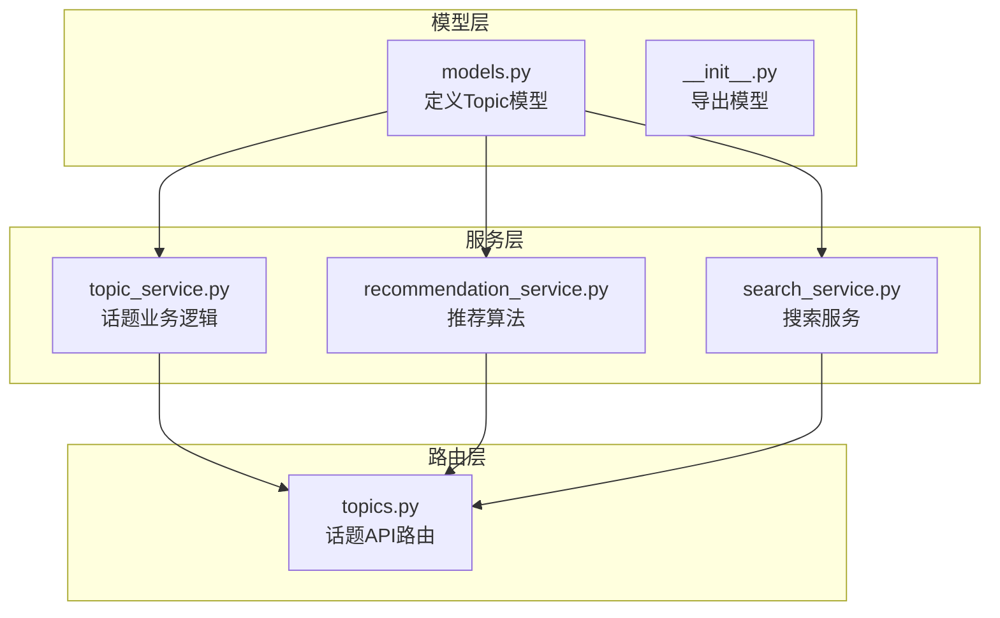
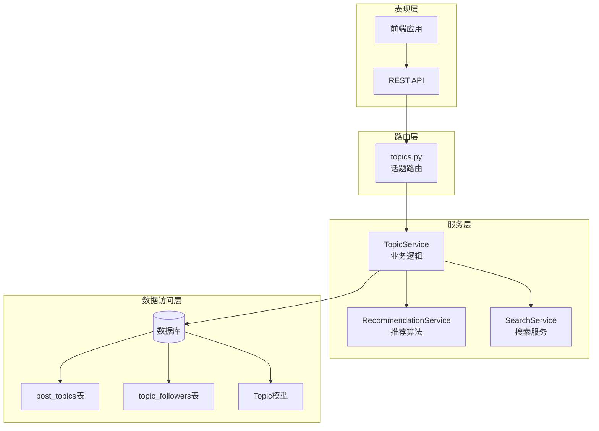
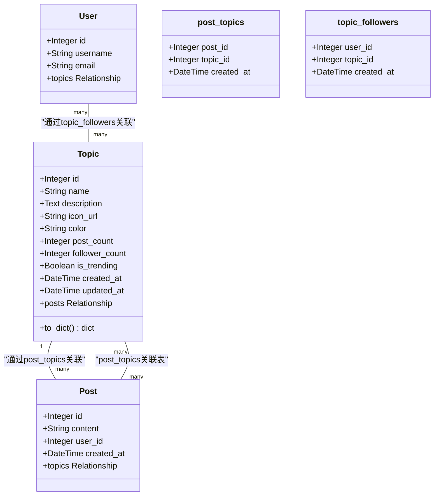
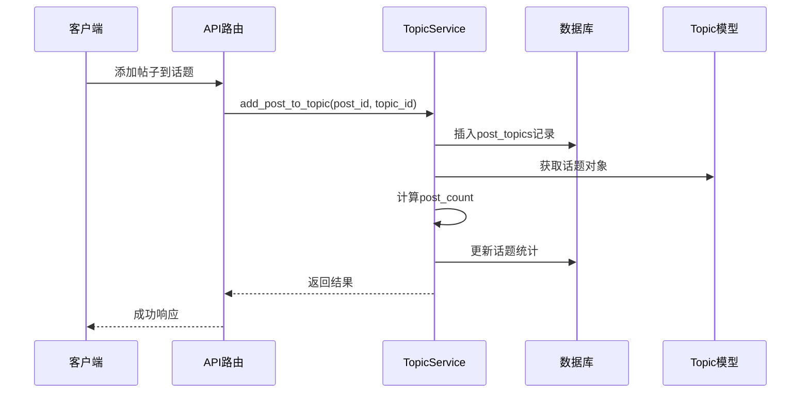
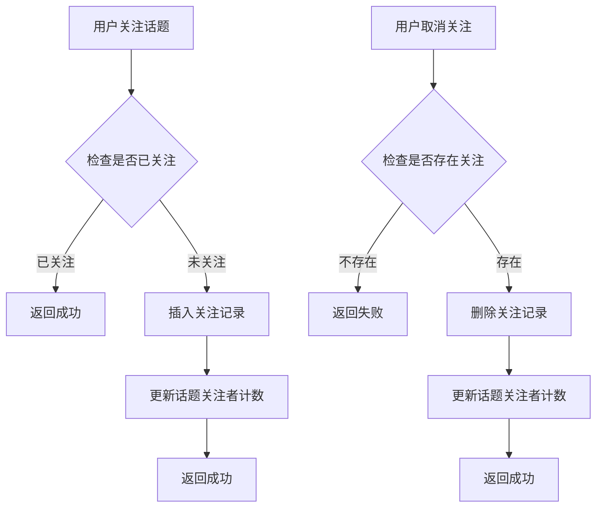
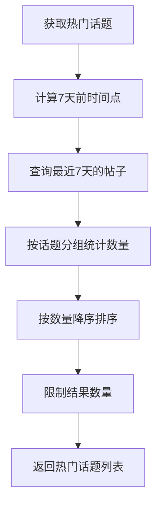
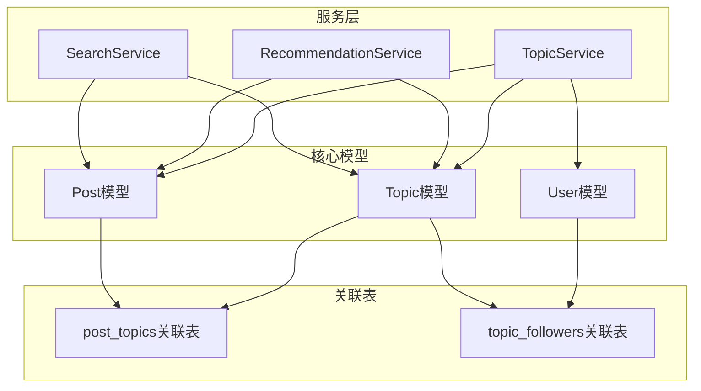
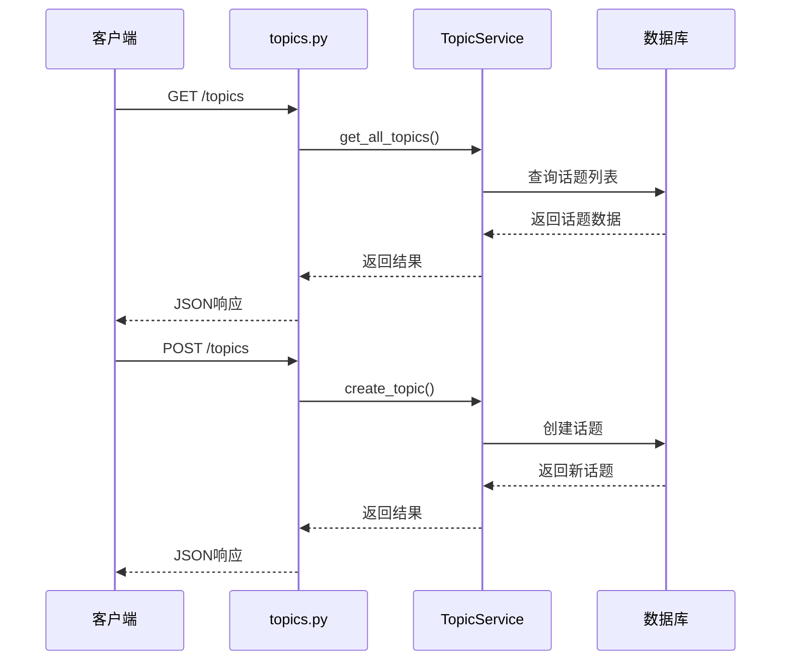

# 话题模型

<cite>
**本文档引用的文件**
- [models.py](file://app/models/models.py)
- [topics.py](file://app/routers/topics.py)
- [topic_service.py](file://app/services/topic_service.py)
- [recommendation_service.py](file://app/services/recommendation_service.py)
- [search_service.py](file://app/services/search_service.py)
</cite>

## 目录
1. [简介](#简介)
2. [项目结构](#项目结构)
3. [核心组件](#核心组件)
4. [架构概览](#架构概览)
5. [详细组件分析](#详细组件分析)
6. [依赖关系分析](#依赖关系分析)
7. [性能考虑](#性能考虑)
8. [故障排除指南](#故障排除指南)
9. [结论](#结论)

## 简介

话题模型是内容分类和发现系统的核心组件，负责管理平台上的主题标签和相关内容的组织结构。该模型支持多对多关系，允许帖子与多个话题关联，同时维护用户关注关系和统计信息。本文档详细记录了话题模型的字段定义、关系设计、统计逻辑和前端展示需求。

## 项目结构

话题模型相关的代码分布在以下模块中：



**图表来源**
- [models.py:392-422](file://app/models/models.py#L392-L422)
- [topics.py:1-282](file://app/routers/topics.py#L1-L282)
- [topic_service.py:1-277](file://app/services/topic_service.py#L1-L277)

**章节来源**
- [models.py:1-655](file://app/models/models.py#L1-L655)
- [topics.py:1-282](file://app/routers/topics.py#L1-L282)

## 核心组件

### 话题模型字段定义

话题模型包含以下核心字段：

| 字段名 | 类型 | 约束 | 描述 | 默认值 |
|--------|------|------|------|--------|
| id | Integer | 主键 | 话题唯一标识符 | 自增 |
| name | String(100) | 唯一、非空、索引 | 话题名称 | - |
| description | Text | 可空 | 话题描述 | NULL |
| icon_url | String(255) | 可空 | 图标URL地址 | NULL |
| color | String(20) | 可空 | 颜色标识 | NULL |
| post_count | Integer | 非负 | 帖子数量统计 | 0 |
| follower_count | Integer | 非负 | 关注者数量统计 | 0 |
| is_trending | Boolean | - | 是否为热门话题 | False |
| created_at | DateTime | - | 创建时间 | 当前时间 |
| updated_at | DateTime | - | 更新时间 | 当前时间 |

### 关联表设计

系统使用两个关联表来维护多对多关系：

1. **post_topics**: 帖子与话题的关联表
2. **topic_followers**: 用户与话题的关注关系表

**章节来源**
- [models.py:392-422](file://app/models/models.py#L392-L422)
- [models.py:18-36](file://app/models/models.py#L18-L36)

## 架构概览

话题模型采用分层架构设计，各层职责明确：



**图表来源**
- [topics.py:1-282](file://app/routers/topics.py#L1-L282)
- [topic_service.py:10-277](file://app/services/topic_service.py#L10-L277)
- [models.py:18-422](file://app/models/models.py#L18-L422)

## 详细组件分析

### Topic模型类分析



**图表来源**
- [models.py:392-422](file://app/models/models.py#L392-L422)
- [models.py:18-36](file://app/models/models.py#L18-L36)

### 统计逻辑和更新机制

话题模型的统计字段通过以下机制维护：

#### 帖子数量统计 (post_count)
- **实时更新**: 每次添加或移除帖子关联时更新
- **计算方式**: 通过关联表计数查询
- **触发时机**: 添加帖子到话题、移除帖子、删除话题时

#### 关注者数量统计 (follower_count)
- **实时更新**: 每次关注或取消关注时更新
- **计算方式**: 通过关注关系表计数
- **触发时机**: 关注话题、取消关注、删除用户时



**图表来源**
- [topic_service.py:37-57](file://app/services/topic_service.py#L37-L57)
- [topic_service.py:108-113](file://app/services/topic_service.py#L108-L113)

**章节来源**
- [topic_service.py:37-73](file://app/services/topic_service.py#L37-L73)
- [topic_service.py:108-160](file://app/services/topic_service.py#L108-L160)

### 关注关系管理

用户与话题的关注关系通过 `topic_followers` 表维护：



**图表来源**
- [topic_service.py:116-152](file://app/services/topic_service.py#L116-L152)

**章节来源**
- [topic_service.py:116-152](file://app/services/topic_service.py#L116-L152)

### 热门话题计算

热门话题通过最近7天的帖子数量计算：



**图表来源**
- [topic_service.py:200-220](file://app/services/topic_service.py#L200-L220)

**章节来源**
- [topic_service.py:200-220](file://app/services/topic_service.py#L200-L220)

### 多对多关系设计

post_topics关联表的设计特点：

- **复合主键**: (post_id, topic_id)
- **级联删除**: 删除帖子时自动删除关联记录
- **时间戳**: 记录关联创建时间
- **索引优化**: 为主键和外键建立索引

**章节来源**
- [models.py:18-23](file://app/models/models.py#L18-L23)

### to_dict方法输出格式

话题模型的to_dict方法输出标准化格式：

```json
{
    "id": 1,
    "name": "示例话题",
    "description": "话题描述",
    "icon_url": "https://example.com/icon.png",
    "color": "#3b82f6",
    "post_count": 150,
    "follower_count": 89,
    "is_trending": false,
    "created_at": "2024-01-01T00:00:00",
    "updated_at": "2024-01-01T00:00:00"
}
```

**章节来源**
- [models.py:409-421](file://app/models/models.py#L409-L421)

## 依赖关系分析

### 数据模型依赖图



**图表来源**
- [models.py:392-422](file://app/models/models.py#L392-L422)
- [topic_service.py:4-6](file://app/services/topic_service.py#L4-L6)

### API路由依赖

话题相关的API路由及其依赖关系：



**图表来源**
- [topics.py:15-25](file://app/routers/topics.py#L15-L25)
- [topics.py:171-194](file://app/routers/topics.py#L171-L194)

**章节来源**
- [topics.py:1-282](file://app/routers/topics.py#L1-L282)

## 性能考虑

### 查询优化策略

1. **索引设计**
   - 话题名称建立唯一索引
   - 关联表使用复合主键
   - 时间字段建立索引以支持排序

2. **批量操作**
   - 推荐系统使用批量数据加载
   - 避免N+1查询问题

3. **缓存策略**
   - 热门话题结果可考虑缓存
   - 统计数据定期刷新

### 统计更新策略

- **异步更新**: 大量数据更新时考虑异步处理
- **批量刷新**: 定期批量更新统计信息
- **增量更新**: 实时更新关键指标

## 故障排除指南

### 常见问题及解决方案

1. **重复话题创建**
   - 现象: 创建同名话题失败
   - 解决: 使用名称查找现有话题，避免重复创建

2. **统计不准确**
   - 现象: 帖子数量或关注者数量错误
   - 解决: 调用 `update_topic_stats()` 方法重新计算

3. **关联数据丢失**
   - 现象: 帖子与话题关联异常
   - 解决: 检查post_topics表的级联删除配置

**章节来源**
- [topic_service.py:14-27](file://app/services/topic_service.py#L14-L27)
- [topic_service.py:266-277](file://app/services/topic_service.py#L266-L277)

## 结论

话题模型通过精心设计的多对多关系和统计机制，为内容分类和发现系统提供了强大的基础。其分层架构确保了代码的可维护性和扩展性，而完善的API接口则为前端应用提供了丰富的功能支持。通过合理的性能优化和故障排除策略，该模型能够有效支撑大规模的内容管理和用户交互场景。