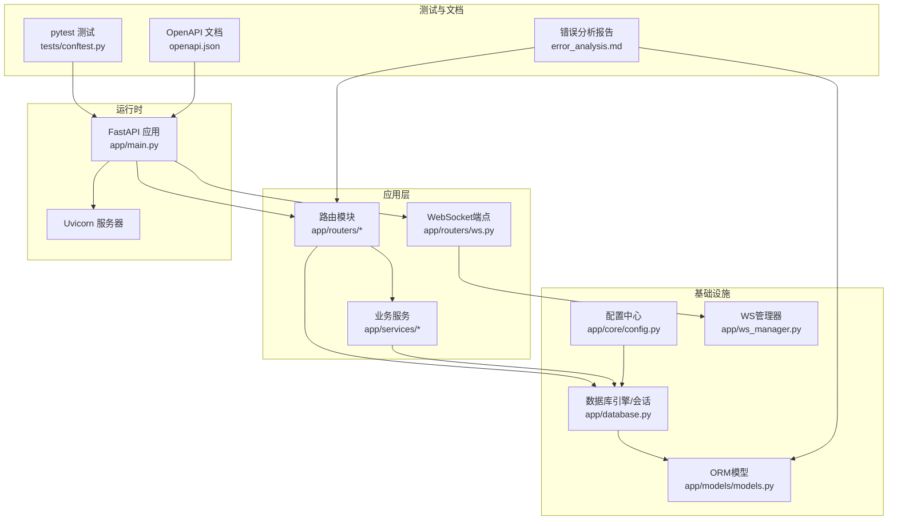
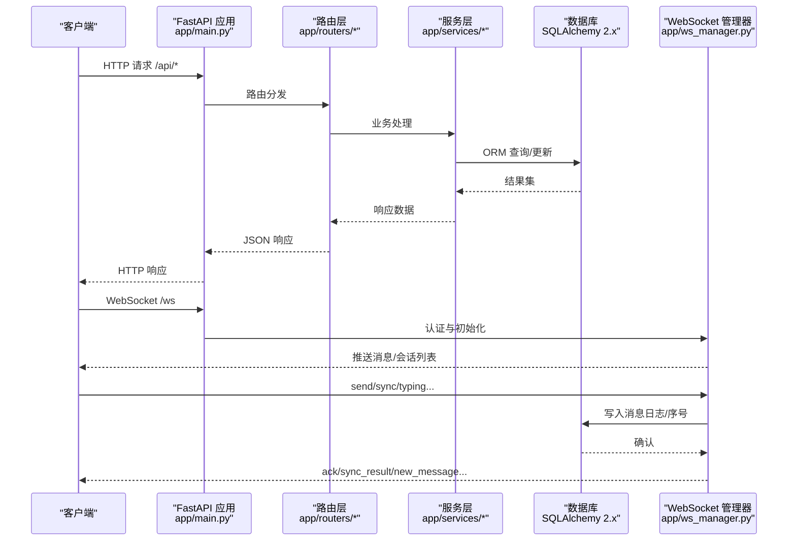
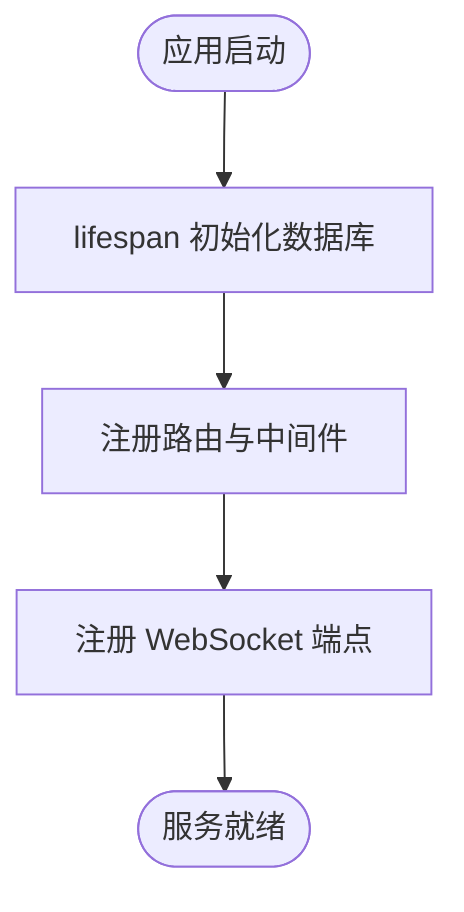
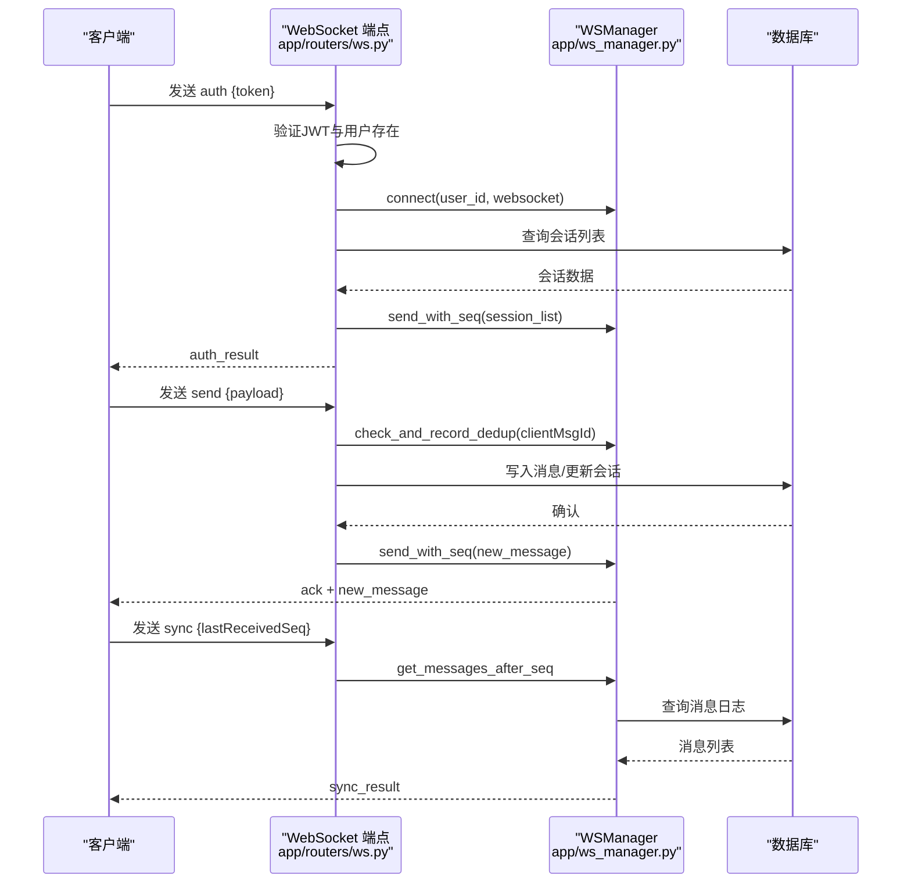

# 技术栈详解

<cite>
**本文引用的文件**
- [requirements.txt](file://requirements.txt)
- [app/main.py](file://app/main.py)
- [app/database.py](file://app/database.py)
- [app/core/config.py](file://app/core/config.py)
- [app/routers/ws.py](file://app/routers/ws.py)
- [app/models/models.py](file://app/models/models.py)
- [app/ws_manager.py](file://app/ws_manager.py)
- [tests/conftest.py](file://tests/conftest.py)
- [error_analysis.md](file://error_analysis.md)
- [openapi.json](file://openapi.json)
</cite>

## 目录
1. [简介](#简介)
2. [项目结构](#项目结构)
3. [核心组件](#核心组件)
4. [架构总览](#架构总览)
5. [详细组件分析](#详细组件分析)
6. [依赖分析](#依赖分析)
7. [性能考量](#性能考量)
8. [故障排查指南](#故障排查指南)
9. [结论](#结论)
10. [附录](#附录)

## 简介
本技术栈详解面向NanTuPy项目，系统梳理并解释项目采用的核心技术与框架，包括：
- Web框架：FastAPI
- 数据库访问：SQLAlchemy 2.x
- 实时通信：python-socketio
- 其他关键依赖：Pydantic、Pydantic Settings、Werkzeug、MarkupSafe、Pillow、cos-python-sdk-v5 等
- 开发与测试工具：Uvicorn、pytest、TestClient、requests
- 第三方服务：腾讯云对象存储（COS）

同时，文档将说明各技术选型的原因与优势、版本兼容性与升级路径建议、开发工具链配置、第三方服务集成要点，并提供学习资源与最佳实践，帮助开发者快速掌握相关技术。

## 项目结构
NanTuPy采用典型的FastAPI项目分层组织：
- app/core：配置与安全相关（含JWT密钥、数据库连接、COS配置等）
- app/database：数据库引擎、Session、Base与依赖注入
- app/models：基于SQLAlchemy 2.x声明式模型
- app/routers：按业务模块划分的API路由（包含WebSocket端点）
- app/services：业务服务层（内容过滤、推荐、搜索等）
- app/ws_manager：WebSocket连接池与消息序号系统
- tests：pytest测试套件与Live Server测试支撑
- migrations：数据库迁移脚本
- 根目录：依赖声明、OpenAPI文档、错误分析报告等

图表来源
- [app/main.py:1-110](file://app/main.py#L1-L110)
- [app/database.py:1-38](file://app/database.py#L1-L38)
- [app/core/config.py:1-43](file://app/core/config.py#L1-L43)
- [app/routers/ws.py:1-538](file://app/routers/ws.py#L1-L538)
- [app/models/models.py:1-655](file://app/models/models.py#L1-L655)
- [app/ws_manager.py:1-308](file://app/ws_manager.py#L1-L308)
- [tests/conftest.py:1-155](file://tests/conftest.py#L1-L155)
- [openapi.json:1-200](file://openapi.json#L1-L200)

章节来源
- [app/main.py:1-110](file://app/main.py#L1-L110)
- [app/database.py:1-38](file://app/database.py#L1-L38)
- [app/core/config.py:1-43](file://app/core/config.py#L1-L43)
- [app/routers/ws.py:1-538](file://app/routers/ws.py#L1-L538)
- [app/models/models.py:1-655](file://app/models/models.py#L1-L655)
- [app/ws_manager.py:1-308](file://app/ws_manager.py#L1-L308)
- [tests/conftest.py:1-155](file://tests/conftest.py#L1-L155)
- [openapi.json:1-200](file://openapi.json#L1-L200)

## 核心组件
- FastAPI应用与生命周期：通过lifespan钩子初始化数据库，注册路由与中间件，暴露HTTP与WebSocket端点。
- 数据库与ORM：SQLAlchemy 2.x同步引擎 + Session，Declarative Base，依赖注入式会话管理。
- WebSocket实时通信：原生FastAPI WebSocket端点，结合自研WSManager实现序号系统、断线补发、ACK去重与房间广播。
- 配置与安全：Config集中管理数据库、JWT、COS、上传限制等；JWT用于WebSocket认证。
- 测试与工具链：pytest + TestClient + requests Live Server，支持会话级fixture与并发测试。

章节来源
- [app/main.py:29-110](file://app/main.py#L29-L110)
- [app/database.py:9-38](file://app/database.py#L9-L38)
- [app/core/config.py:7-43](file://app/core/config.py#L7-L43)
- [app/routers/ws.py:434-538](file://app/routers/ws.py#L434-L538)
- [app/ws_manager.py:20-308](file://app/ws_manager.py#L20-L308)
- [tests/conftest.py:23-155](file://tests/conftest.py#L23-L155)

## 架构总览
NanTuPy采用“Web + ORM + 实时通信”的三层架构：
- 表现层：FastAPI路由与WebSocket端点，统一处理REST与实时消息。
- 业务层：服务层封装业务规则，路由层负责参数校验与鉴权。
- 数据层：SQLAlchemy 2.x ORM + MySQL，配合索引与事务保证一致性与性能。

图表来源
- [app/main.py:68-84](file://app/main.py#L68-L84)
- [app/routers/ws.py:434-538](file://app/routers/ws.py#L434-L538)
- [app/ws_manager.py:74-95](file://app/ws_manager.py#L74-L95)
- [app/database.py:22-32](file://app/database.py#L22-L32)

## 详细组件分析

### FastAPI 应用与路由
- 生命周期：通过lifespan在启动时初始化数据库，在关闭时优雅退出。
- 中间件：CORS中间件与COOP/COEP安全头，适配Flutter Web的SharedArrayBuffer需求。
- 路由注册：集中注册认证、社交、聊天、通知、搜索、话题、上传、推荐、屏蔽、举报、健康检查、管理、漫画等模块路由。
- WebSocket：注册/api/websocket端点，使用APIRouter与WebSocket装饰器。

图表来源
- [app/main.py:29-84](file://app/main.py#L29-L84)

章节来源
- [app/main.py:29-110](file://app/main.py#L29-L110)

### 数据库与ORM（SQLAlchemy 2.x）
- 引擎与会话：使用create_engine创建同步引擎，sessionmaker绑定engine，Declarative Base统一模型基类。
- 依赖注入：get_db提供FastAPI依赖，自动commit/rollback/关闭，简化路由中的事务管理。
- 模型设计：基于SQLAlchemy 2.x声明式语法，定义用户、帖子、评论、点赞、好友、会话、消息、通知、话题、屏蔽、举报、搜索历史、敏感词、漫展相关等模型，包含关系与索引。
- 迁移：migrations目录包含新增WS协议表的SQL脚本。

```mermaid
classDiagram
class DatabaseEngine {
+create_engine()
+SessionLocal
+Base
}
class User {
+id
+username
+email
+password_hash
+posts
+comments
+likes
+friends_sent
+friends_received
+blocks
+post_views
}
class Post {
+id
+content
+images
+video_url
+post_type
+user_id
+author
+comments
+likes
}
class Comment {
+id
+content
+user_id
+post_id
+parent_id
+reply_to_user_id
+like_count
+reply_count
+author
+post
+parent
+reply_to_user
}
class Like {
+id
+user_id
+post_id
+comment_id
+user
+post
}
class Friendship {
+id
+sender_id
+receiver_id
+status
+sender
+receiver
}
class Conversation {
+id
+user1_id
+user2_id
+created_at
+updated_at
+last_message_at
+messages
+participants
}
class Message {
+id
+conversation_id
+sender_id
+content
+message_type
+media_url
+related_id
+is_read
+created_at
+conversation
+sender
}
class Notification {
+id
+user_id
+sender_id
+notification_type
+title
+content
+related_id
+related_type
+is_read
+created_at
+user
+sender
}
class Topic {
+id
+name
+description
+icon_url
+color
+post_count
+follower_count
+is_trending
+created_at
+updated_at
}
class Block {
+id
+blocker_id
+blocked_id
+created_at
+blocker
+blocked
}
class Report {
+id
+reporter_id
+reason
+target_type
+target_id
+description
+status
+created_at
+resolved_at
+reporter
}
class PostView {
+id
+post_id
+user_id
+created_at
+post
+viewer
}
class SearchHistory {
+id
+user_id
+query
+search_type
+created_at
+user
}
class SensitiveWord {
+id
+word
+created_at
}
class ComicCity {
+id
+name
+province
+sort_order
+created_at
}
class ComicTag {
+id
+name
+tag_type
+created_at
}
class ComicEvent {
+id
+name
+city_id
+venue
+start_date
+end_date
+start_time
+end_time
+ticket_info
+website
+intro
+status
+creator_id
+created_at
+updated_at
+city
+creator
+images
+tag_rels
+follows
}
class ComicEventImage {
+id
+event_id
+image_url
+is_cover
+sort_order
+event
}
class ComicEventTagRel {
+id
+event_id
+tag_id
+event
+tag
}
class ComicEventFollow {
+id
+event_id
+user_id
+created_at
+event
+user
}
class WSMessageLog {
+id
+user_id
+seq
+payload
+created_at
}
class WSUserSeq {
+user_id
+current_seq
}
class WSAckDedup {
+client_msg_id
+user_id
+processed_at
}
DatabaseEngine --> User
DatabaseEngine --> Post
DatabaseEngine --> Comment
DatabaseEngine --> Like
DatabaseEngine --> Friendship
DatabaseEngine --> Conversation
DatabaseEngine --> Message
DatabaseEngine --> Notification
DatabaseEngine --> Topic
DatabaseEngine --> Block
DatabaseEngine --> Report
DatabaseEngine --> PostView
DatabaseEngine --> SearchHistory
DatabaseEngine --> SensitiveWord
DatabaseEngine --> ComicCity
DatabaseEngine --> ComicTag
DatabaseEngine --> ComicEvent
DatabaseEngine --> ComicEventImage
DatabaseEngine --> ComicEventTagRel
DatabaseEngine --> ComicEventFollow
DatabaseEngine --> WSMessageLog
DatabaseEngine --> WSUserSeq
DatabaseEngine --> WSAckDedup
```

图表来源
- [app/database.py:9-38](file://app/database.py#L9-L38)
- [app/models/models.py:42-655](file://app/models/models.py#L42-L655)

章节来源
- [app/database.py:9-38](file://app/database.py#L9-L38)
- [app/models/models.py:1-655](file://app/models/models.py#L1-L655)

### WebSocket 实时通信（python-socketio + FastAPI）
- 端点与协议：/ws，支持auth、send、ack_receive、sync、ping、join、leave、typing、stop_typing等消息类型。
- 认证：JWT解码校验，校验用户存在后初始化会话列表与房间加入。
- 消息处理：幂等去重（clientMsgId）、ACK序号、断线补发（sync）、会话房间广播（typing）。
- 管理器：WSManager提供连接池、房间管理、序号分配、消息持久化、ACK去重与清理。

图表来源
- [app/routers/ws.py:434-538](file://app/routers/ws.py#L434-L538)
- [app/ws_manager.py:74-95](file://app/ws_manager.py#L74-L95)
- [app/ws_manager.py:214-247](file://app/ws_manager.py#L214-L247)
- [app/ws_manager.py:265-303](file://app/ws_manager.py#L265-L303)

章节来源
- [app/routers/ws.py:1-538](file://app/routers/ws.py#L1-L538)
- [app/ws_manager.py:1-308](file://app/ws_manager.py#L1-L308)

### 配置与安全（Config）
- 安全密钥：SECRET_KEY、JWT_SECRET_KEY从环境变量读取。
- 数据库：DB_USER/DB_PASS/DB_HOST/DB_PORT/DB_NAME拼接SQLALCHEMY_DATABASE_URI，SQLALCHEMY_ENGINE_OPTIONS配置连接池参数。
- 上传与媒体：UPLOAD_FOLDER、MAX_CONTENT_LENGTH、允许的扩展名集合。
- 云存储：COS_ID/COS_KEY/COS_REGION/COS_BUCKET/COS_BUCKET_NAME/COS_DOMAIN。
- 调试与CORS：DEBUG、CORS_HEADERS。

章节来源
- [app/core/config.py:7-43](file://app/core/config.py#L7-L43)

### 测试与工具链
- pytest：提供fastapi_app、live_server、token、client、db、image_url、search_query等会话级fixture。
- Live Server：在后台线程启动uvicorn，等待健康检查通过后供requests测试使用。
- TestClient：用于单元测试，无需启动真实服务器。
- 依赖：pytest、requests、Pillow（生成测试图片）。

章节来源
- [tests/conftest.py:23-155](file://tests/conftest.py#L23-L155)

## 依赖分析
- 核心依赖
  - fastapi==0.115.0：高性能ASGI框架，支持异步、自动OpenAPI文档、Pydantic集成。
  - uvicorn[standard]==0.30.0：标准ASGI服务器，生产部署首选。
  - sqlalchemy>=2.0.50：ORM与SQL表达式，支持2.x新特性。
  - pymysql==1.1.0：MySQL驱动。
  - python-jose[cryptography]==3.3.0：JWT签名与解码。
  - passlib[bcrypt]==1.7.4：密码哈希。
  - python-multipart==0.0.12：多部分表单解析。
  - python-socketio==5.10.0：WebSocket协议支持。
  - Pillow>=10.2.0：图像处理与测试图片生成。
  - cos-python-sdk-v5：腾讯云对象存储SDK。
  - pydantic>=2.0.0：数据验证与序列化。
  - pydantic-settings>=2.0.0：配置加载与验证。
  - werkzeug>=3.0.0：WSGI工具与调试。
  - markupsafe>=2.1.0：模板安全渲染。

- 版本兼容性与升级路径
  - FastAPI 0.115.x 与 Uvicorn 0.30.x：官方兼容组合，建议保持同步升级。
  - SQLAlchemy 2.x：注意从1.x迁移的API差异（如select、bulk操作、事件系统等），逐步替换。
  - Pydantic 2.x：与FastAPI 0.115.x兼容，注意字段别名、验证器签名变化。
  - python-socketio 5.10.x：与FastAPI兼容良好，注意事件命名与消息格式。
  - Pillow 10.x：与10.2.0+兼容，测试图片生成正常。
  - cos-python-sdk-v5：与Python 3.8+兼容，注意COS区域与凭证配置。

章节来源
- [requirements.txt:1-15](file://requirements.txt#L1-L15)

## 性能考量
- 数据库连接池：SQLALCHEMY_ENGINE_OPTIONS配置pool_size、max_overflow、pool_recycle、pool_pre_ping，提升并发与连接复用。
- ORM优化：合理使用延迟加载、关系预加载、索引（如Post.user_id、Comment.parent_id等），避免N+1查询。
- WebSocket序号系统：原子递增序号与消息日志持久化，确保断线补发与去重，降低客户端重试成本。
- CORS与安全头：COOP/COEP头适配Flutter Web，减少跨域策略导致的性能损耗。
- 图像处理：Pillow用于缩略图与压缩，结合COS存储，减轻服务器压力。

[本节为通用性能指导，不直接分析具体文件]

## 故障排查指南
- 模型与数据库不一致（严重）
  - 现象：多处500错误（AttributeError、列名不匹配、to_dict缺失）。
  - 根因：models.py与数据库表结构不一致，如conversations缺少user1_id/user2_id/last_message_at，messages列名与模型不一致，notifications列名与模型不一致，topics列名与模型不一致，comments缺少reply_to_user_id，posts缺少view_count，post_views列名不一致，likes约束不一致等。
  - 影响：聊天、通知、举报、好友、互动、话题、帖子、搜索、屏蔽等模块大量端点500。
  - 修复优先级：最高优先级修正7个模型列定义，高优先级补齐to_dict()方法，中优先级修复代码逻辑（如db.case用法）。
- 测试脚本与路由路径不匹配
  - 现象：测试调用路径与FastAPI实际路径不一致，导致404。
  - 建议：统一测试脚本与路由路径，使用openapi.json核对端点。
- Pydantic Schema不匹配
  - 现象：RegisterRequest缺少字段导致422。
  - 建议：根据Schema调整请求体或测试数据。
- WebSocket认证与连接
  - 现象：未认证发送消息被拒绝，或连接断开。
  - 建议：先发送auth消息，确保JWT有效且用户存在。

章节来源
- [error_analysis.md:8-276](file://error_analysis.md#L8-L276)
- [openapi.json:1-200](file://openapi.json#L1-L200)

## 结论
NanTuPy以FastAPI为核心，结合SQLAlchemy 2.x ORM与python-socketio实现实时通信，形成完整的社交平台后端技术栈。项目在性能、安全性与可维护性方面具备良好基础，但仍存在模型与数据库结构不一致、测试脚本与路由路径不匹配等问题，需要优先修复以保障稳定性。建议按版本兼容性与升级路径逐步推进，完善测试与文档，持续优化数据库索引与ORM查询。

[本节为总结性内容，不直接分析具体文件]

## 附录
- 开发工具链
  - IDE：推荐VS Code或PyCharm，启用Python解释器与虚拟环境。
  - 调试：FastAPI内置调试模式，结合Uvicorn reload开发。
  - 测试：pytest + TestClient（单元测试）+ requests Live Server（集成测试）。
- 第三方服务集成
  - 云存储：COS SDK配置COS_ID/COS_KEY/COS_REGION/COS_BUCKET等环境变量。
  - 邮件服务：未在当前代码中发现集成，如需可引入aiohttp-smtp或smtplib。
  - 监控系统：可引入Prometheus + Grafana或APM工具（如Sentry），结合FastAPI中间件记录指标。
- 学习资源与最佳实践
  - FastAPI官方文档与教程，重点掌握依赖注入、Pydantic模型、OpenAPI自动生成。
  - SQLAlchemy 2.x官方文档，掌握select、relationship、事件系统与性能优化。
  - python-socketio与WebSocket协议，理解消息序号、断线补发与去重机制。
  - pytest与TestClient，编写可维护的测试用例，覆盖API与业务逻辑。
  - 云存储SDK：参考COS官方SDK文档，注意区域与凭证配置。

[本节为通用指导，不直接分析具体文件]