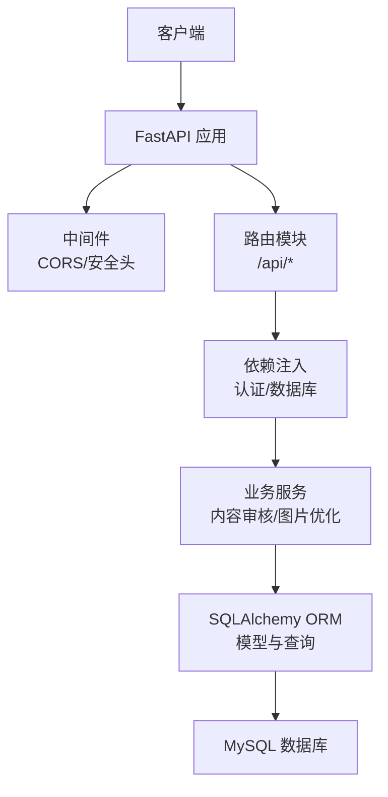
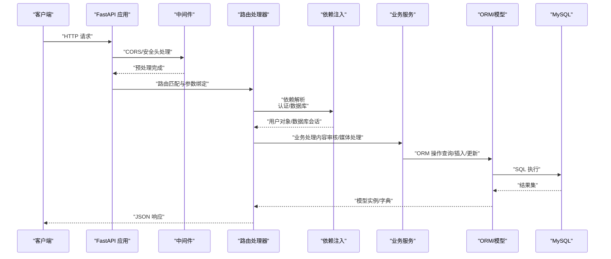
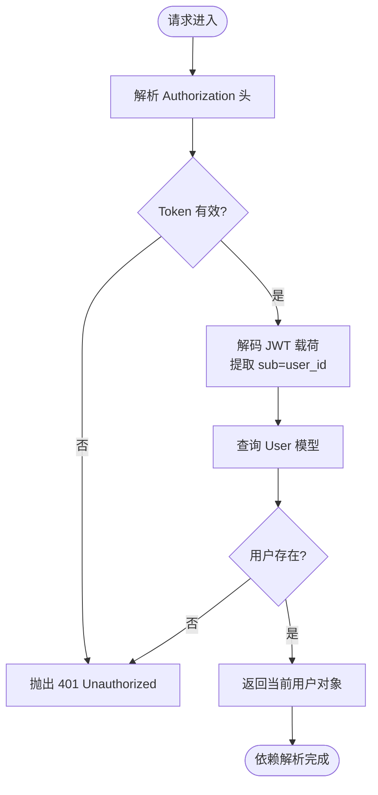
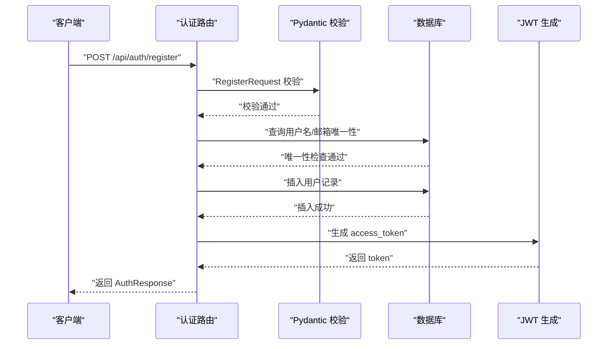
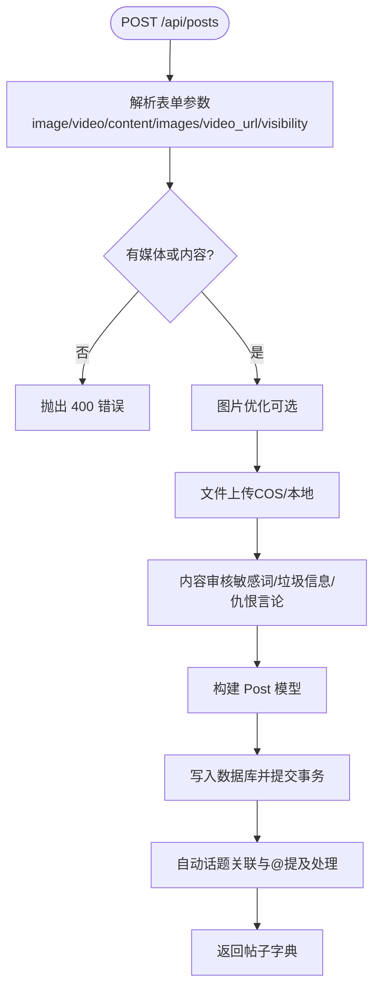
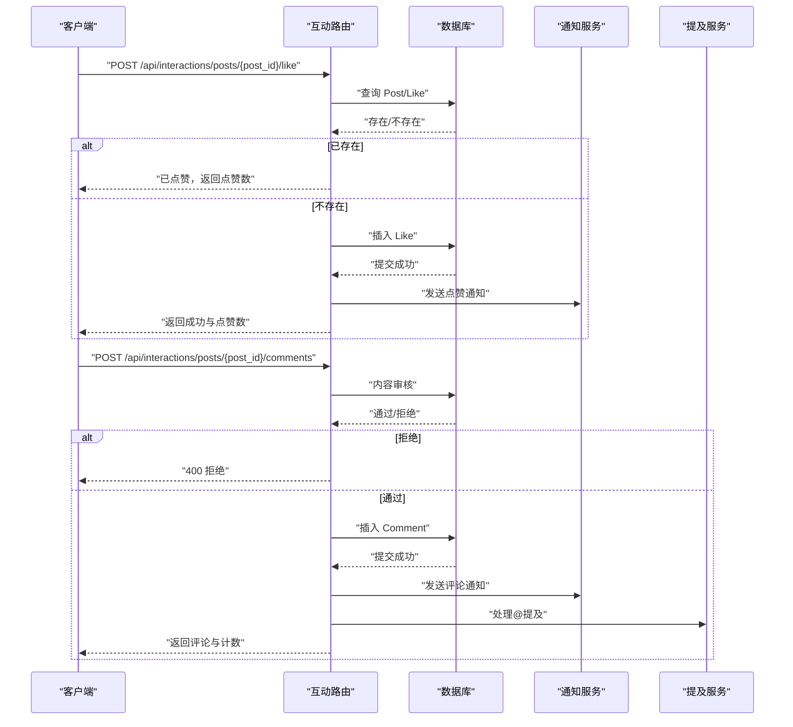
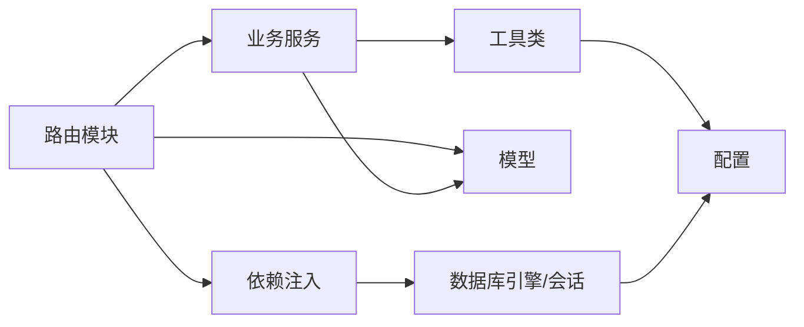

# HTTP请求数据流

<cite>
**本文档引用的文件**
- [app/main.py](file://app/main.py)
- [app/dependencies.py](file://app/dependencies.py)
- [app/database.py](file://app/database.py)
- [app/core/config.py](file://app/core/config.py)
- [app/routers/auth.py](file://app/routers/auth.py)
- [app/routers/posts.py](file://app/routers/posts.py)
- [app/routers/interactions.py](file://app/routers/interactions.py)
- [app/models/models.py](file://app/models/models.py)
- [app/utils.py](file://app/utils.py)
- [app/services/content_moderation.py](file://app/services/content_moderation.py)
- [app/services/image_optimizer.py](file://app/services/image_optimizer.py)
</cite>

## 目录
1. [简介](#简介)
2. [项目结构](#项目结构)
3. [核心组件](#核心组件)
4. [架构总览](#架构总览)
5. [详细组件分析](#详细组件分析)
6. [依赖关系分析](#依赖关系分析)
7. [性能考量](#性能考量)
8. [故障排查指南](#故障排查指南)
9. [结论](#结论)

## 简介
本文件系统性梳理NanTuPy项目的HTTP请求数据流，从客户端HTTP请求到数据库响应的完整处理链路。重点覆盖以下方面：
- 请求参数验证与序列化（Pydantic模型）
- 依赖注入（FastAPI依赖、数据库会话、认证上下文）
- 业务逻辑处理（内容审核、媒体处理、通知与提及）
- 数据库操作（ORM模型、事务控制、连接池）
- 响应返回与异常处理
- FastAPI路由注册机制、中间件处理流程
- 认证依赖、权限验证与数据序列化过程

## 项目结构
NanTuPy采用FastAPI框架，按功能模块组织路由与服务层，核心目录如下：
- app/main.py：应用入口、中间件、路由注册、生命周期管理
- app/routers/*：各功能模块路由（认证、帖子、互动、搜索等）
- app/models/models.py：SQLAlchemy模型定义
- app/database.py：数据库引擎、会话工厂、初始化
- app/dependencies.py：认证依赖（JWT）、权限校验
- app/services/*：业务服务（内容审核、图片优化、推荐、通知等）
- app/utils.py：通用工具（文件上传、预签名URL等）

图表来源
- [app/main.py:39-84](file://app/main.py#L39-L84)
- [app/dependencies.py:16-62](file://app/dependencies.py#L16-L62)
- [app/database.py:9-37](file://app/database.py#L9-L37)

章节来源
- [app/main.py:1-110](file://app/main.py#L1-L110)
- [app/core/config.py:1-43](file://app/core/config.py#L1-L43)

## 核心组件
- 应用入口与中间件
  - 生命周期管理：启动时初始化数据库表，关闭时优雅退出
  - CORS中间件：允许跨域请求，支持凭据
  - 安全头中间件：设置COOP/COEP，适配Flutter Web
  - 路由注册：集中注册各模块路由，统一前缀与标签
- 依赖注入
  - 认证依赖：从Authorization头解析JWT，解码载荷获取用户ID，查询数据库获取用户对象
  - 可选认证：未提供Token时返回None，用于匿名访问场景
  - 权限校验：管理员权限强制校验
  - 数据库依赖：获取Session，自动commit/rollback/关闭
- 数据库与模型
  - 引擎与会话：连接池配置、预热、回收策略
  - 模型：用户、帖子、评论、点赞、通知、话题、屏蔽、举报、漫展等
- 业务服务
  - 内容审核：垃圾信息、敏感词、仇恨言论检测与过滤
  - 图片优化：缩放、压缩、格式转换、阈值控制
  - 文件上传：本地直传与COS预签名URL
- 路由与序列化
  - Pydantic模型：请求体验证、字段校验、序列化响应
  - 路由：REST风格接口，参数绑定、Body/Query/Form绑定

章节来源
- [app/main.py:29-84](file://app/main.py#L29-L84)
- [app/dependencies.py:16-62](file://app/dependencies.py#L16-L62)
- [app/database.py:9-37](file://app/database.py#L9-L37)
- [app/models/models.py:42-655](file://app/models/models.py#L42-L655)
- [app/services/content_moderation.py:74-126](file://app/services/content_moderation.py#L74-L126)
- [app/services/image_optimizer.py:16-112](file://app/services/image_optimizer.py#L16-L112)
- [app/utils.py:14-220](file://app/utils.py#L14-L220)

## 架构总览
下图展示一次典型HTTP请求从进入FastAPI到数据库返回的关键节点与数据变换。

图表来源
- [app/main.py:46-84](file://app/main.py#L46-L84)
- [app/routers/auth.py:184-212](file://app/routers/auth.py#L184-L212)
- [app/dependencies.py:16-36](file://app/dependencies.py#L16-L36)
- [app/database.py:22-32](file://app/database.py#L22-L32)

## 详细组件分析

### 认证与依赖注入链路
- 认证流程
  - 客户端携带Authorization: Bearer <JWT>头
  - 依赖get_current_user解析Token，解码载荷获取sub（用户ID）
  - 通过数据库会话查询User模型，返回当前用户对象
  - 若Token无效或用户不存在，抛出401异常
- 可选认证
  - get_optional_user在Token缺失或无效时返回None
- 权限校验
  - admin_required强制要求is_admin=True，否则403
- 数据库会话
  - get_db提供Session，try/finally确保commit/rollback/关闭

图表来源
- [app/dependencies.py:16-36](file://app/dependencies.py#L16-L36)
- [app/dependencies.py:53-62](file://app/dependencies.py#L53-L62)
- [app/database.py:22-32](file://app/database.py#L22-L32)

章节来源
- [app/dependencies.py:16-62](file://app/dependencies.py#L16-L62)
- [app/database.py:22-32](file://app/database.py#L22-L32)

### 路由注册与中间件处理
- 路由注册
  - 主应用集中include_router，为各模块设置前缀与标签
  - 示例：/api/auth、/api/posts、/api/interactions等
- 中间件
  - CORS：允许Origin正则匹配，支持凭据
  - 安全头：设置COOP/COEP，满足Flutter Web需求
- 异常处理
  - 项目未显式注册全局异常处理器；业务层通过HTTPException抛出标准状态码

章节来源
- [app/main.py:46-84](file://app/main.py#L46-L84)

### 认证路由（/api/auth）处理链路
- 注册/登录
  - Pydantic RegisterRequest/LoginRequest进行参数验证
  - 查询数据库判断用户名/邮箱唯一性
  - bcrypt/scrypt兼容密码哈希校验
  - 生成JWT并返回Token与用户信息
- 个人资料与隐私设置
  - 依赖get_current_user获取当前用户
  - 更新用户字段并提交事务
- 密码重置
  - 生成内存令牌（带过期时间）
  - 校验令牌并更新密码

图表来源
- [app/routers/auth.py:36-66](file://app/routers/auth.py#L36-L66)
- [app/routers/auth.py:184-212](file://app/routers/auth.py#L184-L212)
- [app/routers/auth.py:476-485](file://app/routers/auth.py#L476-L485)

章节来源
- [app/routers/auth.py:184-246](file://app/routers/auth.py#L184-L246)
- [app/routers/auth.py:253-262](file://app/routers/auth.py#L253-L262)
- [app/routers/auth.py:269-292](file://app/routers/auth.py#L269-L292)
- [app/routers/auth.py:365-408](file://app/routers/auth.py#L365-L408)

### 帖子路由（/api/posts）处理链路
- 创建帖子
  - 支持多图URL数组、图片上传、视频上传
  - 图片优化：ImageOptimizer压缩与缩放
  - 文件上传：FileUploader直传COS或本地
  - 内容审核：ContentModeration检查并过滤
  - 自动话题关联与@提及处理
  - 可选自定义可见性（写入post_visibility表）
- 列表/详情/更新/删除
  - 列表：根据好友关系与可见性筛选
  - 详情：查询单个帖子并附加点赞状态
  - 更新：仅作者可更新
  - 删除：级联删除评论、点赞、浏览记录、通知，并清理媒体文件

图表来源
- [app/routers/posts.py:22-140](file://app/routers/posts.py#L22-L140)
- [app/services/image_optimizer.py:16-112](file://app/services/image_optimizer.py#L16-L112)
- [app/utils.py:151-187](file://app/utils.py#L151-L187)
- [app/services/content_moderation.py:74-126](file://app/services/content_moderation.py#L74-L126)

章节来源
- [app/routers/posts.py:22-140](file://app/routers/posts.py#L22-L140)
- [app/routers/posts.py:142-186](file://app/routers/posts.py#L142-L186)
- [app/routers/posts.py:220-227](file://app/routers/posts.py#L220-L227)
- [app/routers/posts.py:230-261](file://app/routers/posts.py#L230-L261)
- [app/routers/posts.py:264-316](file://app/routers/posts.py#L264-L316)

### 互动路由（/api/interactions）处理链路
- 点赞/取消点赞
  - 检查目标是否存在，避免重复点赞
  - 写入Like表并触发通知
- 评论
  - 内容审核，支持父子评论与回复计数
  - 通知被回复用户与@提及用户
- 批量增强
  - 批量查询is_liked，减少N+1查询
  - 为评论字典附加回复列表与分页信息

图表来源
- [app/routers/interactions.py:54-98](file://app/routers/interactions.py#L54-L98)
- [app/routers/interactions.py:175-240](file://app/routers/interactions.py#L175-L240)

章节来源
- [app/routers/interactions.py:54-98](file://app/routers/interactions.py#L54-L98)
- [app/routers/interactions.py:175-240](file://app/routers/interactions.py#L175-L240)
- [app/routers/interactions.py:243-340](file://app/routers/interactions.py#L243-L340)

### 数据模型与序列化
- 模型设计
  - 用户、帖子、评论、点赞、通知、话题、屏蔽、举报、漫展等
  - 关系映射与索引优化（如评论索引、话题关联）
- 序列化
  - 模型to_dict方法输出标准化字典
  - 路由层返回Pydantic模型或字典，FastAPI自动序列化为JSON

章节来源
- [app/models/models.py:42-184](file://app/models/models.py#L42-L184)
- [app/models/models.py:187-231](file://app/models/models.py#L187-L231)
- [app/models/models.py:328-356](file://app/models/models.py#L328-L356)

### 业务服务与工具
- 内容审核
  - 敏感词过滤、垃圾信息检测、仇恨言论识别
  - 审核日志记录，拦截原因与过滤后文本
- 图片优化
  - 缩放、压缩、格式转换、阈值控制
- 文件上传
  - COS直传与预签名URL生成
  - 删除与信息查询

章节来源
- [app/services/content_moderation.py:74-126](file://app/services/content_moderation.py#L74-L126)
- [app/services/image_optimizer.py:16-112](file://app/services/image_optimizer.py#L16-L112)
- [app/utils.py:151-187](file://app/utils.py#L151-L187)

## 依赖关系分析
- 组件耦合
  - 路由依赖依赖注入（认证/数据库）
  - 业务服务依赖ORM模型与工具类
  - 依赖注入依赖配置与数据库引擎
- 外部依赖
  - JWT解析（jose）
  - 数据库（SQLAlchemy 2.0+）
  - 云存储（腾讯云COS）
- 潜在循环依赖
  - 当前结构清晰，路由与服务解耦，未发现循环依赖

图表来源
- [app/routers/auth.py:18-22](file://app/routers/auth.py#L18-L22)
- [app/dependencies.py:16-19](file://app/dependencies.py#L16-L19)
- [app/database.py:9-16](file://app/database.py#L9-L16)
- [app/utils.py:10-11](file://app/utils.py#L10-L11)

章节来源
- [app/routers/auth.py:18-22](file://app/routers/auth.py#L18-L22)
- [app/dependencies.py:16-19](file://app/dependencies.py#L16-L19)
- [app/database.py:9-16](file://app/database.py#L9-L16)
- [app/utils.py:10-11](file://app/utils.py#L10-L11)

## 性能考量
- 连接池与预热
  - 连接池大小、溢出、回收与预检配置
- 批量查询
  - 互动路由批量查询is_liked，避免N+1问题
- 序列化与响应
  - 模型to_dict统一输出，减少重复逻辑
- 媒体处理
  - 图片优化阈值与质量控制，避免过大文件
- 事务控制
  - 依赖注入中统一commit/rollback，保证一致性

章节来源
- [app/database.py:9-16](file://app/database.py#L9-L16)
- [app/routers/interactions.py:26-48](file://app/routers/interactions.py#L26-L48)
- [app/services/image_optimizer.py:16-112](file://app/services/image_optimizer.py#L16-L112)

## 故障排查指南
- 认证失败
  - 检查Authorization头格式与Token有效性
  - 确认JWT密钥与算法一致
- 数据库异常
  - 查看依赖注入中的commit/rollback日志
  - 检查连接池配置与超时设置
- 内容审核拦截
  - 查看审核日志，确认拦截原因与过滤文本
- 媒体上传失败
  - 检查COS配置与权限
  - 确认文件大小与类型限制

章节来源
- [app/dependencies.py:22-36](file://app/dependencies.py#L22-L36)
- [app/database.py:25-32](file://app/database.py#L25-L32)
- [app/services/content_moderation.py:241-249](file://app/services/content_moderation.py#L241-L249)
- [app/utils.py:151-187](file://app/utils.py#L151-L187)

## 结论
NanTuPy通过清晰的模块划分与依赖注入机制，实现了从请求参数验证、认证授权、业务处理到数据库持久化的完整数据流。FastAPI的类型安全与自动序列化提升了开发效率与运行时稳定性。建议在生产环境中进一步完善全局异常处理、监控埋点与缓存策略，以提升可观测性与性能表现。