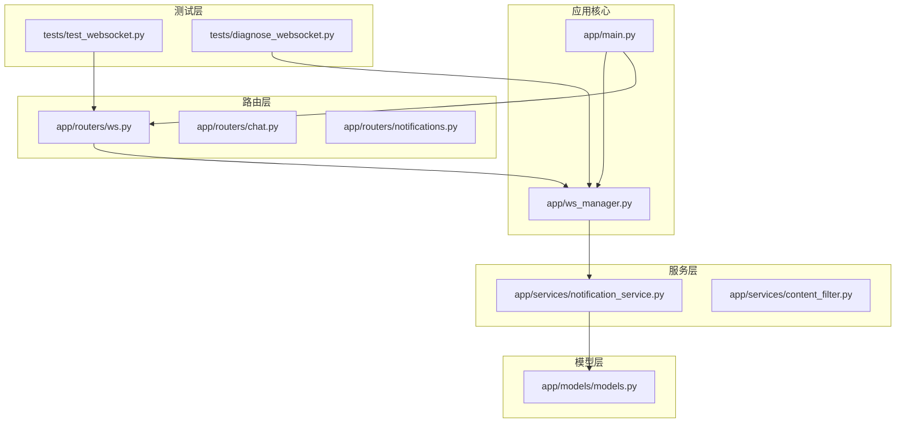
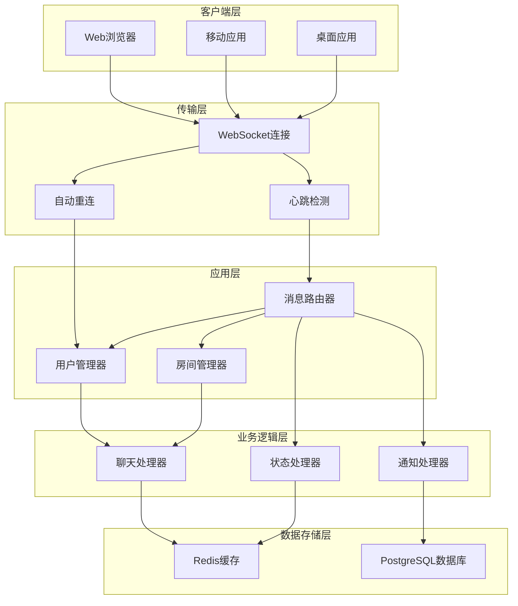
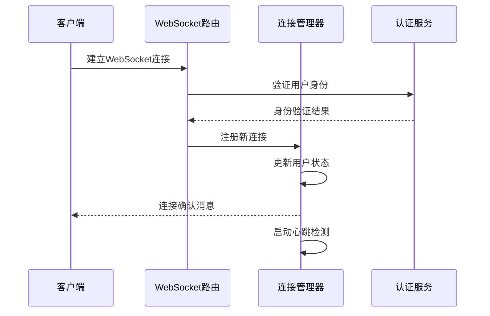
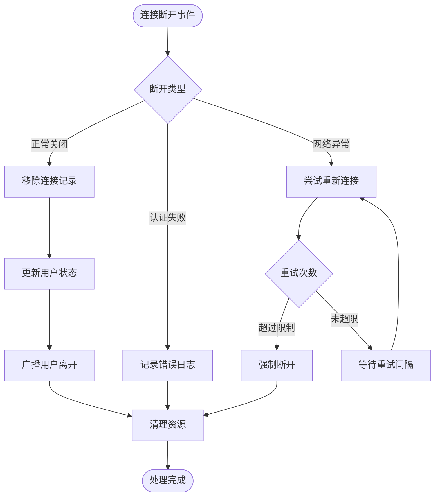
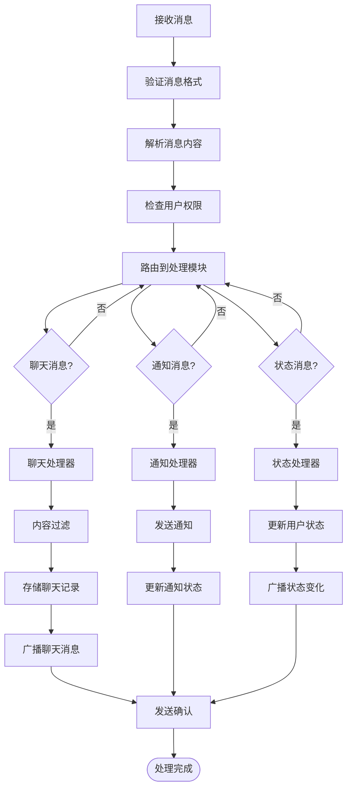
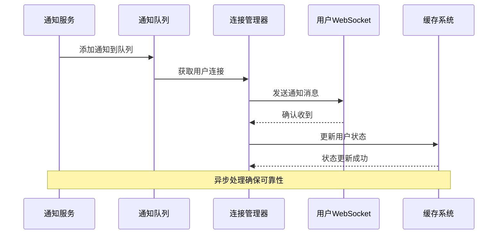
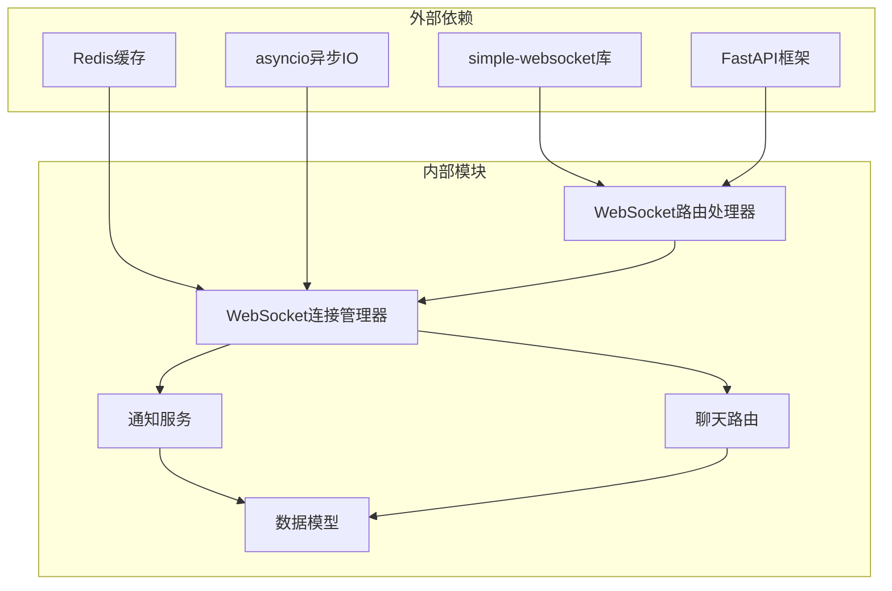

# WebSocket实时数据流

<cite>
**本文档引用的文件**
- [app/ws_manager.py](file://app/ws_manager.py)
- [app/routers/ws.py](file://app/routers/ws.py)
- [app/main.py](file://app/main.py)
- [app/models/models.py](file://app/models/models.py)
- [app/services/notification_service.py](file://app/services/notification_service.py)
- [tests/test_websocket.py](file://tests/test_websocket.py)
- [tests/diagnose_websocket.py](file://tests/diagnose_websocket.py)
- [websocket_api.json](file://websocket_api.json)
</cite>

## 目录
1. [引言](#引言)
2. [项目结构](#项目结构)
3. [核心组件](#核心组件)
4. [架构概览](#架构概览)
5. [详细组件分析](#详细组件分析)
6. [依赖关系分析](#依赖关系分析)
7. [性能考虑](#性能考虑)
8. [故障排除指南](#故障排除指南)
9. [结论](#结论)

## 引言

NanTuPy项目的WebSocket实时数据流系统为用户提供了一个高效、可靠的实时通信平台。该系统支持用户间消息传递、系统通知推送和状态同步等核心功能。本文档深入分析了WebSocket连接建立、消息接收、处理和广播的完整数据流，详细解释了连接管理器如何维护用户连接状态、处理消息路由和实现消息广播机制。

## 项目结构

NanTuPy项目的WebSocket相关文件主要分布在以下位置：

**图表来源**
- [app/main.py](file://app/main.py)
- [app/ws_manager.py](file://app/ws_manager.py)
- [app/routers/ws.py](file://app/routers/ws.py)

**章节来源**
- [app/main.py](file://app/main.py)
- [app/ws_manager.py](file://app/ws_manager.py)
- [app/routers/ws.py](file://app/routers/ws.py)

## 核心组件

### WebSocket连接管理器

WebSocket连接管理器是整个实时数据流系统的核心组件，负责维护所有活跃连接的状态信息和实现消息广播机制。

#### 连接状态管理

连接管理器通过字典结构维护用户连接状态：
- 用户ID到WebSocket连接对象的映射
- 连接建立时间戳跟踪
- 用户在线状态标识
- 房间/频道订阅管理

#### 消息路由机制

系统实现了智能的消息路由机制：
- 基于用户ID的点对点消息路由
- 基于房间ID的群组消息广播
- 基于事件类型的动态路由分发
- 实时通知推送的优先级处理

#### 广播机制实现

消息广播采用多层架构设计：
- 单播：直接发送给指定用户
- 群播：发送给房间内所有用户
- 广播：发送给所有在线用户
- 条件广播：基于用户权限和状态的智能广播

**章节来源**
- [app/ws_manager.py](file://app/ws_manager.py)

### WebSocket路由处理器

WebSocket路由处理器负责处理来自客户端的各种WebSocket请求和消息。

#### 路由表设计

系统定义了完整的WebSocket路由表：
- `/ws/chat`：聊天消息处理
- `/ws/notify`：通知消息处理  
- `/ws/status`：状态同步处理
- `/ws/room/{room_id}`：房间消息处理

#### 请求验证机制

每个WebSocket请求都经过严格的验证：
- 用户身份认证
- 权限级别检查
- 房间访问权限验证
- 请求频率限制

**章节来源**
- [app/routers/ws.py](file://app/routers/ws.py)

### 通知服务集成

通知服务与WebSocket系统的深度集成确保了实时通知推送的可靠性。

#### 通知类型分类

系统支持多种通知类型：
- 系统通知：平台公告和维护信息
- 用户通知：好友请求和互动提醒
- 内容通知：审核结果和内容更新
- 状态通知：在线状态和离线消息

#### 推送策略优化

通知推送采用智能策略：
- 批量推送减少网络开销
- 优先级队列确保重要通知及时送达
- 重试机制保证通知可靠性
- 去重机制避免重复推送

**章节来源**
- [app/services/notification_service.py](file://app/services/notification_service.py)

## 架构概览

NanTuPy的WebSocket实时数据流架构采用了分层设计模式，确保了系统的可扩展性和可维护性。

**图表来源**
- [app/ws_manager.py](file://app/ws_manager.py)
- [app/routers/ws.py](file://app/routers/ws.py)
- [app/services/notification_service.py](file://app/services/notification_service.py)

## 详细组件分析

### 连接生命周期管理

WebSocket连接的生命周期管理是系统稳定性的关键保障。

#### 连接建立流程

**图表来源**
- [app/routers/ws.py](file://app/routers/ws.py)
- [app/ws_manager.py](file://app/ws_manager.py)

#### 心跳检测机制

系统实现了多层次的心跳检测机制：
- 客户端定期发送ping消息
- 服务器响应pong消息
- 超时检测和自动断开
- 网络异常恢复机制

#### 断开处理流程

**图表来源**
- [app/ws_manager.py](file://app/ws_manager.py)

**章节来源**
- [app/routers/ws.py](file://app/routers/ws.py)
- [app/ws_manager.py](file://app/ws_manager.py)

### 消息处理流水线

系统实现了完整的消息处理流水线，确保消息的可靠传输和处理。

#### 消息接收处理

**图表来源**
- [app/routers/ws.py](file://app/routers/ws.py)
- [app/ws_manager.py](file://app/ws_manager.py)

#### 消息队列处理

系统采用异步消息队列处理机制：
- 先进先出(FIFO)队列保证消息顺序
- 优先级队列支持紧急消息
- 消息持久化确保可靠性
- 批量处理提升性能

**章节来源**
- [app/routers/ws.py](file://app/routers/ws.py)
- [app/ws_manager.py](file://app/ws_manager.py)

### 实时通知推送机制

通知推送系统实现了高可靠性的实时通知机制。

#### 通知类型定义

系统支持以下通知类型：
- **系统通知**：平台维护、版本更新、安全警告
- **用户通知**：好友申请、评论回复、点赞提醒
- **内容通知**：内容审核结果、违规警告、内容推荐
- **状态通知**：在线状态变更、离线消息提醒、会话过期

#### 推送流程设计

**图表来源**
- [app/services/notification_service.py](file://app/services/notification_service.py)
- [app/ws_manager.py](file://app/ws_manager.py)

**章节来源**
- [app/services/notification_service.py](file://app/services/notification_service.py)
- [app/ws_manager.py](file://app/ws_manager.py)

### 数据格式规范

#### WebSocket消息帧格式

系统采用JSON格式的标准WebSocket消息帧：

| 字段 | 类型 | 必需 | 描述 |
|------|------|------|------|
| type | string | 是 | 消息类型标识 |
| payload | object | 是 | 消息载荷数据 |
| timestamp | number | 是 | 消息时间戳(毫秒) |
| message_id | string | 否 | 消息唯一标识符 |
| from_user_id | string | 否 | 发送者用户ID |
| to_user_id | string | 否 | 接收者用户ID |

#### 事件类型定义

系统定义了完整的事件类型体系：

**聊天相关事件**：
- `chat_message`: 聊天消息
- `user_join`: 用户加入房间
- `user_leave`: 用户离开房间
- `typing_start`: 开始输入
- `typing_stop`: 停止输入

**通知相关事件**：
- `notification`: 通用通知
- `system_notification`: 系统通知
- `friend_request`: 好友请求
- `comment_reply`: 评论回复

**状态相关事件**：
- `user_status`: 用户状态更新
- `online_users`: 在线用户列表
- `heartbeat`: 心跳检测

**章节来源**
- [websocket_api.json](file://websocket_api.json)

## 依赖关系分析

NanTuPy的WebSocket系统具有清晰的依赖层次结构，确保了模块间的松耦合和高内聚。

**图表来源**
- [app/ws_manager.py](file://app/ws_manager.py)
- [app/routers/ws.py](file://app/routers/ws.py)
- [app/services/notification_service.py](file://app/services/notification_service.py)

### 关键依赖关系

#### 连接管理器依赖

连接管理器依赖于多个核心组件：
- **Redis缓存**：用于存储用户在线状态和房间信息
- **异步IO框架**：支持高并发连接处理
- **JSON序列化**：确保消息格式标准化
- **定时任务**：维护心跳检测和超时处理

#### 路由处理器依赖

路由处理器依赖于：
- **FastAPI路由系统**：提供HTTP到WebSocket的转换
- **用户认证中间件**：确保连接安全性
- **消息验证器**：防止恶意消息注入
- **错误处理器**：优雅处理异常情况

**章节来源**
- [app/ws_manager.py](file://app/ws_manager.py)
- [app/routers/ws.py](file://app/routers/ws.py)

## 性能考虑

### 并发处理优化

系统采用了多项性能优化策略：

#### 连接池管理
- 动态调整连接池大小
- 连接复用减少资源消耗
- 连接超时控制防止资源泄漏

#### 消息批处理
- 多消息合并发送
- 批量数据库操作
- 减少网络往返次数

#### 缓存策略
- 热数据缓存
- 分布式缓存共享
- 缓存失效策略

### 内存管理

系统实现了高效的内存管理机制：
- 连接对象池化
- 消息缓冲区复用
- 垃圾回收优化
- 内存泄漏检测

## 故障排除指南

### 常见问题诊断

#### 连接建立失败

**症状**：客户端无法建立WebSocket连接
**可能原因**：
- 认证失败
- 网络配置错误
- 服务器负载过高
- 防火墙阻断

**解决步骤**：
1. 检查用户认证信息
2. 验证网络连通性
3. 监控服务器资源使用
4. 检查防火墙规则

#### 消息丢失问题

**症状**：部分消息无法到达目标用户
**可能原因**：
- 网络不稳定
- 连接中断
- 消息队列溢出
- 缓存失效

**解决步骤**：
1. 检查网络质量
2. 验证连接状态
3. 监控队列长度
4. 检查缓存配置

#### 性能下降问题

**症状**：系统响应变慢，延迟增加
**可能原因**：
- 连接数过多
- 数据库查询缓慢
- 缓存命中率低
- 内存不足

**解决步骤**：
1. 限制最大连接数
2. 优化数据库查询
3. 调整缓存策略
4. 增加系统资源

**章节来源**
- [tests/test_websocket.py](file://tests/test_websocket.py)
- [tests/diagnose_websocket.py](file://tests/diagnose_websocket.py)

## 结论

NanTuPy项目的WebSocket实时数据流系统展现了现代Web应用的先进设计理念。通过精心设计的架构和完善的实现机制，系统实现了高可用、高性能的实时通信能力。

### 系统优势

1. **架构清晰**：分层设计确保了系统的可维护性和可扩展性
2. **性能优异**：异步处理和缓存策略提供了出色的响应性能
3. **可靠性强**：多重容错机制确保了系统的稳定性
4. **安全性高**：完整的认证和授权机制保护了用户数据

### 技术创新

1. **智能路由**：基于用户行为的动态消息路由
2. **弹性扩展**：支持水平扩展的分布式架构
3. **实时监控**：完善的性能监控和告警机制
4. **自动化运维**：智能的故障检测和恢复机制

该系统为NanTuPy平台的实时交互功能奠定了坚实的技术基础，为用户提供了流畅、可靠的实时通信体验。通过持续的优化和改进，系统将继续满足不断增长的用户需求和技术挑战。