# 数据库数据流

<cite>
**本文引用的文件**
- [app/main.py](file://app/main.py)
- [app/database.py](file://app/database.py)
- [app/core/config.py](file://app/core/config.py)
- [app/models/models.py](file://app/models/models.py)
- [app/routers/auth.py](file://app/routers/auth.py)
- [app/routers/posts.py](file://app/routers/posts.py)
- [app/routers/chat.py](file://app/routers/chat.py)
- [app/dependencies.py](file://app/dependencies.py)
- [migrations/add_ws_protocol_tables.sql](file://migrations/add_ws_protocol_tables.sql)
- [comic_tables.sql](file://comic_tables.sql)
- [requirements.txt](file://requirements.txt)
</cite>

## 目录
1. [简介](#简介)
2. [项目结构](#项目结构)
3. [核心组件](#核心组件)
4. [架构总览](#架构总览)
5. [详细组件分析](#详细组件分析)
6. [依赖分析](#依赖分析)
7. [性能考虑](#性能考虑)
8. [故障排查指南](#故障排查指南)
9. [结论](#结论)
10. [附录](#附录)

## 简介
本文件围绕 NanTuPy 的数据库数据流展开，系统性追踪从 ORM 模型到数据库存储的完整流转过程，涵盖 SQLAlchemy ORM 的数据映射、查询构建与结果转换机制；数据库连接池管理、事务处理与并发控制；数据模型之间的关系映射、外键约束与级联操作；查询优化、索引使用与批量操作；以及数据迁移与版本管理的数据流。文末提供时序图与实体关系图，帮助读者直观理解持久化层的完整数据轨迹。

## 项目结构
NanTuPy 使用 FastAPI + SQLAlchemy 2.0 实现后端服务，数据库层通过统一的 engine、sessionmaker 和 declarative base 管理，各业务路由通过依赖注入获取 Session，在视图函数内完成增删改查与事务提交/回滚。模型定义集中于 models.py，并包含若干业务扩展表（如 WebSocket 协议相关表与漫展相关表），并通过迁移脚本维护。

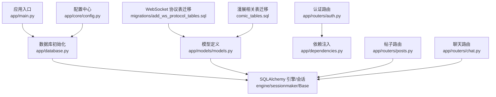

**图表来源**
- [app/main.py:29-37](file://app/main.py#L29-L37)
- [app/database.py:9-19](file://app/database.py#L9-L19)
- [app/core/config.py:12-20](file://app/core/config.py#L12-L20)
- [app/models/models.py:1-50](file://app/models/models.py#L1-L50)
- [app/routers/auth.py:184-200](file://app/routers/auth.py#L184-L200)
- [app/routers/posts.py:22-140](file://app/routers/posts.py#L22-L140)
- [app/routers/chat.py:23-131](file://app/routers/chat.py#L23-L131)
- [migrations/add_ws_protocol_tables.sql:1-32](file://migrations/add_ws_protocol_tables.sql#L1-L32)
- [comic_tables.sql:1-68](file://comic_tables.sql#L1-L68)

**章节来源**
- [app/main.py:29-37](file://app/main.py#L29-L37)
- [app/database.py:9-19](file://app/database.py#L9-L19)
- [app/core/config.py:12-20](file://app/core/config.py#L12-L20)
- [app/models/models.py:1-50](file://app/models/models.py#L1-L50)

## 核心组件
- 数据库引擎与会话
  - 引擎通过配置中心提供的连接串创建，启用连接池大小、溢出、回收与预检查参数，确保高并发下的稳定性与健康性。
  - 会话工厂用于每次请求生成独立会话，提供依赖注入接口，封装 commit/rollback/close 生命周期。
- 模型定义与关系映射
  - 统一继承自 Base，采用 declarative 映射；通过 relationship 声明一对多/多对多关系，配合外键与级联策略（如 delete-orphan、CASCADE）。
  - 多处使用二级关系（如帖子-话题中间表）与自定义索引，提升查询效率。
- 路由与依赖注入
  - 各路由通过 Depends(get_db) 获取 Session，结合 JWT 依赖获取当前用户，实现鉴权与数据访问的解耦。
- 迁移与版本管理
  - 通过迁移脚本维护 WebSocket 协议表与漫展相关表，明确外键约束、唯一索引与时间字段策略。

**章节来源**
- [app/database.py:9-38](file://app/database.py#L9-L38)
- [app/models/models.py:18-655](file://app/models/models.py#L18-L655)
- [app/routers/auth.py:184-200](file://app/routers/auth.py#L184-L200)
- [app/routers/posts.py:22-140](file://app/routers/posts.py#L22-L140)
- [app/routers/chat.py:23-131](file://app/routers/chat.py#L23-L131)
- [migrations/add_ws_protocol_tables.sql:1-32](file://migrations/add_ws_protocol_tables.sql#L1-L32)
- [comic_tables.sql:1-68](file://comic_tables.sql#L1-L68)

## 架构总览
下图展示了从请求进入、依赖注入、ORM 查询与事务提交到数据库写入的整体数据流。

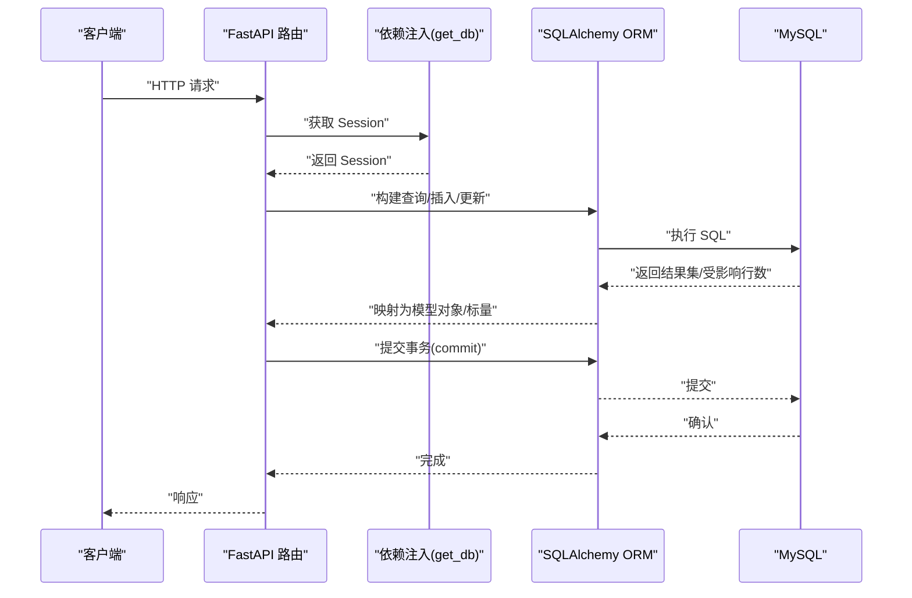

**图表来源**
- [app/routers/auth.py:184-200](file://app/routers/auth.py#L184-L200)
- [app/routers/posts.py:22-140](file://app/routers/posts.py#L22-L140)
- [app/routers/chat.py:23-131](file://app/routers/chat.py#L23-L131)
- [app/database.py:22-32](file://app/database.py#L22-L32)

## 详细组件分析

### 数据库连接池与会话生命周期
- 连接池参数
  - 池大小、最大溢出、回收时间与预检查开启，保证连接复用与健康检测。
- 会话生命周期
  - 依赖注入函数在 try/finally 中确保异常时回滚并关闭会话，正常流程提交后关闭，避免资源泄漏。
- 初始化
  - 应用启动时调用初始化函数创建所有表，确保模型与数据库结构一致。

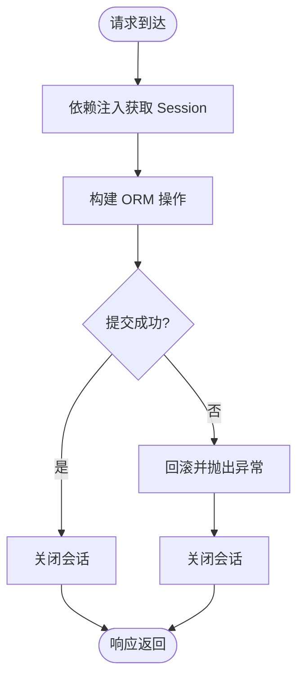

**图表来源**
- [app/database.py:22-32](file://app/database.py#L22-L32)
- [app/main.py:29-37](file://app/main.py#L29-L37)

**章节来源**
- [app/database.py:9-19](file://app/database.py#L9-L19)
- [app/database.py:22-32](file://app/database.py#L22-L32)
- [app/main.py:29-37](file://app/main.py#L29-L37)

### ORM 模型与关系映射
- 关联表与多对多
  - 帖子-话题、帖子可见性、话题关注者等通过中间表实现多对多，配合外键与 CASCADE 删除策略。
- 一对多与自引用
  - 评论支持父子评论（自引用），消息属于会话与发送者，关注关系双向映射。
- 级联与删除孤儿
  - 多个模型使用 cascade='all, delete-orphan'，确保父对象删除时自动清理子对象。
- 索引与约束
  - 多处复合索引与唯一约束（如 WebSocket 表的唯一序号组合索引），提升查询与去重效率。

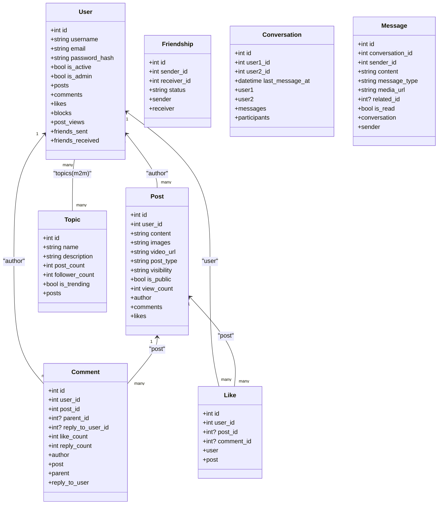

**图表来源**
- [app/models/models.py:42-421](file://app/models/models.py#L42-L421)

**章节来源**
- [app/models/models.py:18-655](file://app/models/models.py#L18-L655)

### 查询构建与结果转换
- 动态查询
  - 路由中使用 query/filter/order_by/offset/limit 构建分页与筛选逻辑，结合子查询与聚合统计（如未读计数、最后消息）。
- 结果转换
  - 模型提供 to_dict 方法，将 ORM 对象序列化为字典，部分方法支持传入批量计算结果以避免 N+1 查询。
- 原生 SQL
  - 某些场景使用 text + execute 执行原生 SQL，手动映射列名到字典，便于复杂联结与统计。

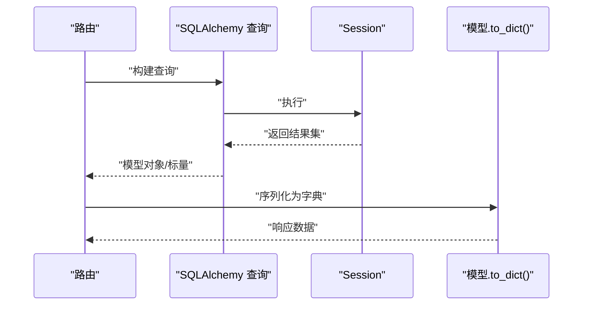

**图表来源**
- [app/routers/posts.py:142-186](file://app/routers/posts.py#L142-L186)
- [app/routers/chat.py:23-131](file://app/routers/chat.py#L23-L131)
- [app/models/models.py:127-184](file://app/models/models.py#L127-L184)

**章节来源**
- [app/routers/posts.py:142-186](file://app/routers/posts.py#L142-L186)
- [app/routers/chat.py:23-131](file://app/routers/chat.py#L23-L131)
- [app/models/models.py:127-184](file://app/models/models.py#L127-L184)

### 事务处理与并发控制
- 事务边界
  - 依赖注入函数在 try/finally 中捕获异常并回滚，随后抛出异常，确保失败时不会污染数据库状态。
- 并发控制
  - 通过连接池参数与预检查减少无效连接；模型索引与唯一约束降低并发冲突概率。
- 批量写入
  - 路由中使用 flush/commit 控制提交时机，必要时先 flush 获取主键再批量插入中间表数据。

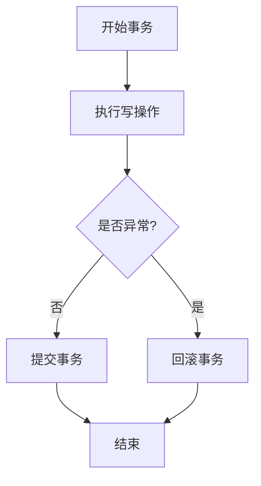

**图表来源**
- [app/database.py:22-32](file://app/database.py#L22-L32)
- [app/routers/posts.py:119-139](file://app/routers/posts.py#L119-L139)

**章节来源**
- [app/database.py:22-32](file://app/database.py#L22-L32)
- [app/routers/posts.py:119-139](file://app/routers/posts.py#L119-L139)

### 数据迁移与版本管理
- WebSocket 协议表
  - 提供消息日志、用户序号计数器与 ACK 去重表，含唯一索引与外键约束，支持断线补发与幂等。
- 漫展相关表
  - 城市、标签、事件、图片、标签关联与关注表，明确外键关系与唯一约束，支撑业务扩展。
- 清理策略
  - 迁移脚本中包含定期清理过期记录的注释语句，建议通过定时任务执行。

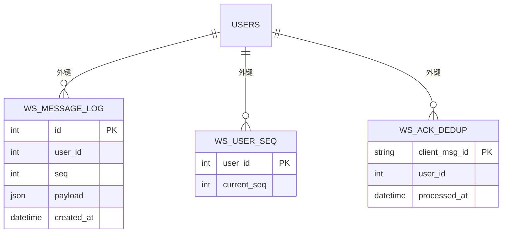

**图表来源**
- [migrations/add_ws_protocol_tables.sql:4-26](file://migrations/add_ws_protocol_tables.sql#L4-L26)

**章节来源**
- [migrations/add_ws_protocol_tables.sql:1-32](file://migrations/add_ws_protocol_tables.sql#L1-L32)
- [comic_tables.sql:1-68](file://comic_tables.sql#L1-L68)

### 典型业务数据流示例

#### 注册流程（时序图）
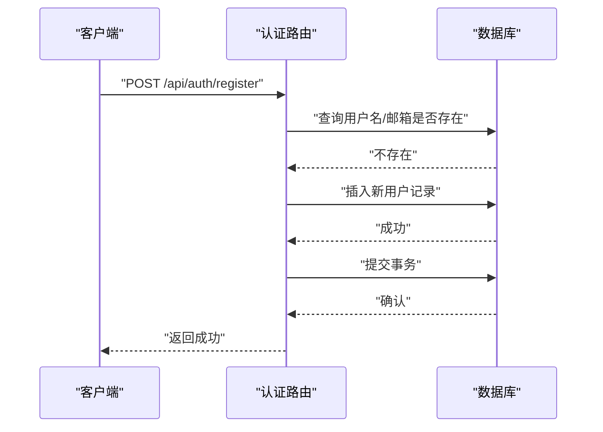

**图表来源**
- [app/routers/auth.py:184-200](file://app/routers/auth.py#L184-L200)

**章节来源**
- [app/routers/auth.py:184-200](file://app/routers/auth.py#L184-L200)

#### 创建帖子流程（时序图）
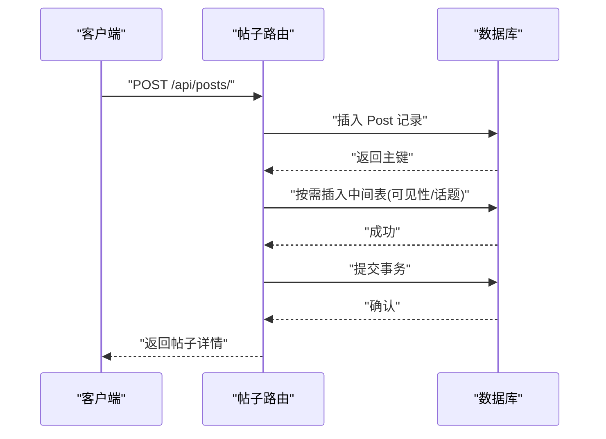

**图表来源**
- [app/routers/posts.py:22-140](file://app/routers/posts.py#L22-L140)

**章节来源**
- [app/routers/posts.py:22-140](file://app/routers/posts.py#L22-L140)

#### 会话列表查询（时序图）
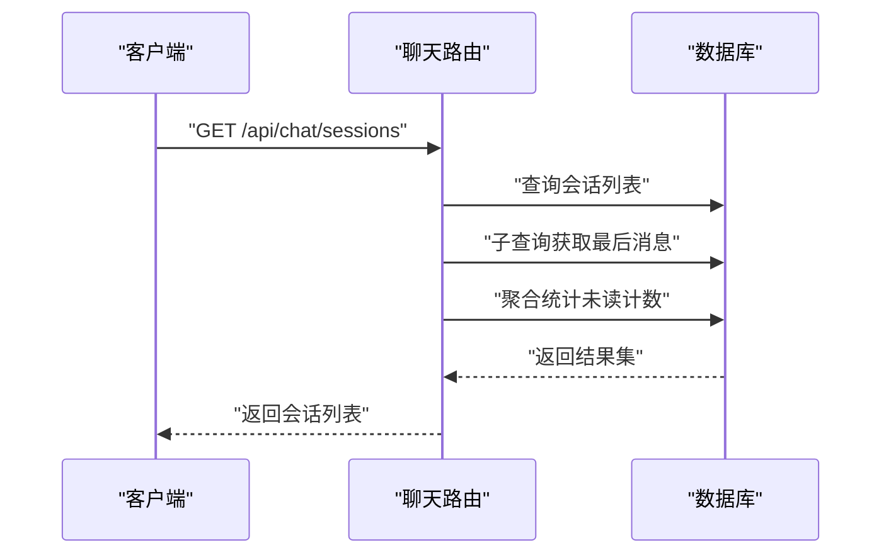

**图表来源**
- [app/routers/chat.py:23-131](file://app/routers/chat.py#L23-L131)

**章节来源**
- [app/routers/chat.py:23-131](file://app/routers/chat.py#L23-L131)

## 依赖分析
- 外部依赖
  - FastAPI、SQLAlchemy 2.0+、PyMySQL、Pydantic 等，满足 ORM、Web 框架与序列化需求。
- 内部依赖
  - 路由依赖数据库会话与 JWT 依赖；模型依赖 Base；迁移脚本依赖用户表与业务表结构。

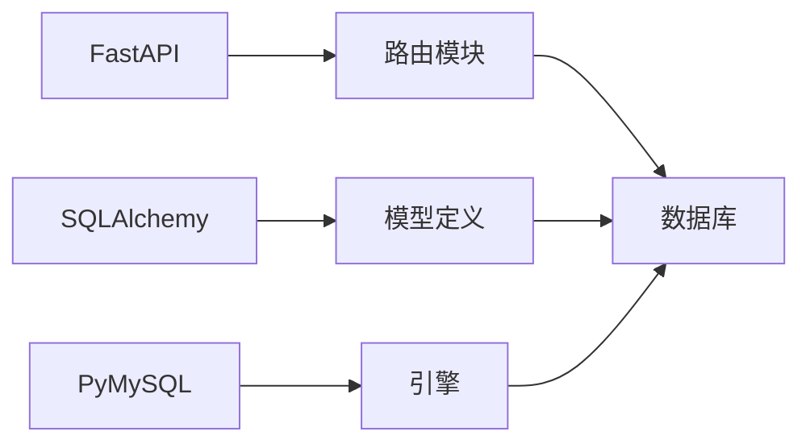

**图表来源**
- [requirements.txt:1-15](file://requirements.txt#L1-L15)
- [app/routers/auth.py:18-22](file://app/routers/auth.py#L18-L22)
- [app/models/models.py:10-11](file://app/models/models.py#L10-L11)

**章节来源**
- [requirements.txt:1-15](file://requirements.txt#L1-L15)
- [app/routers/auth.py:18-22](file://app/routers/auth.py#L18-L22)
- [app/models/models.py:10-11](file://app/models/models.py#L10-L11)

## 性能考虑
- 连接池参数
  - 合理设置池大小与溢出，避免高并发下的连接争用；开启 pool_pre_ping 与 pool_recycle 提升连接可用性。
- 查询优化
  - 使用复合索引（如评论的 post_id+parent_id、消息的 user_id+seq 等）；避免 N+1 查询，优先批量加载与传入预计算结果。
- 批量操作
  - 先 flush 获取主键，再批量插入中间表；分页查询时 limit 多取 1 条判断是否有更多，减少额外查询。
- 索引与约束
  - 为高频过滤字段建立索引；使用唯一约束防止重复数据，降低重复写入成本。

[本节为通用指导，不直接分析具体文件]

## 故障排查指南
- 事务异常
  - 若出现提交失败或回滚频繁，检查路由中的异常捕获与回滚逻辑，确保异常路径正确触发回滚并关闭会话。
- 连接问题
  - 若连接超时或连接池耗尽，检查池大小与回收参数，适当增大 pool_size 或调整 max_overflow。
- 外键约束错误
  - 插入或删除时报外键约束错误，检查迁移脚本与模型级联策略，确认依赖对象存在且符合约束。
- 查询性能
  - 慢查询可通过 EXPLAIN 分析索引使用情况，补充缺失索引或重构查询条件。

**章节来源**
- [app/database.py:22-32](file://app/database.py#L22-L32)
- [app/routers/posts.py:119-139](file://app/routers/posts.py#L119-L139)
- [migrations/add_ws_protocol_tables.sql:1-32](file://migrations/add_ws_protocol_tables.sql#L1-L32)

## 结论
NanTuPy 的数据库层以 SQLAlchemy 2.0 为核心，通过统一的引擎与会话管理、清晰的模型关系映射、完善的依赖注入与事务控制，实现了稳定高效的持久化能力。配合迁移脚本与索引设计，系统在高并发与复杂业务场景下具备良好的扩展性与可维护性。建议持续关注连接池参数、查询性能与索引覆盖，结合业务增长迭代优化。

[本节为总结性内容，不直接分析具体文件]

## 附录
- 关键文件速览
  - 应用入口与生命周期：[app/main.py:29-37](file://app/main.py#L29-L37)
  - 数据库配置与会话：[app/database.py:9-38](file://app/database.py#L9-L38)
  - 配置中心：[app/core/config.py:12-20](file://app/core/config.py#L12-L20)
  - 模型定义：[app/models/models.py:18-655](file://app/models/models.py#L18-L655)
  - 认证路由示例：[app/routers/auth.py:184-200](file://app/routers/auth.py#L184-L200)
  - 帖子路由示例：[app/routers/posts.py:22-140](file://app/routers/posts.py#L22-L140)
  - 聊天路由示例：[app/routers/chat.py:23-131](file://app/routers/chat.py#L23-L131)
  - WebSocket 迁移：[migrations/add_ws_protocol_tables.sql:1-32](file://migrations/add_ws_protocol_tables.sql#L1-L32)
  - 漫展迁移：[comic_tables.sql:1-68](file://comic_tables.sql#L1-L68)
  - 依赖声明：[requirements.txt:1-15](file://requirements.txt#L1-L15)

[本节为参考清单，不直接分析具体文件]