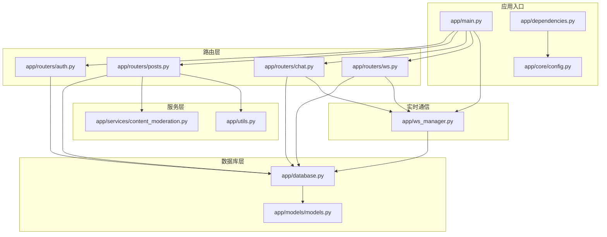
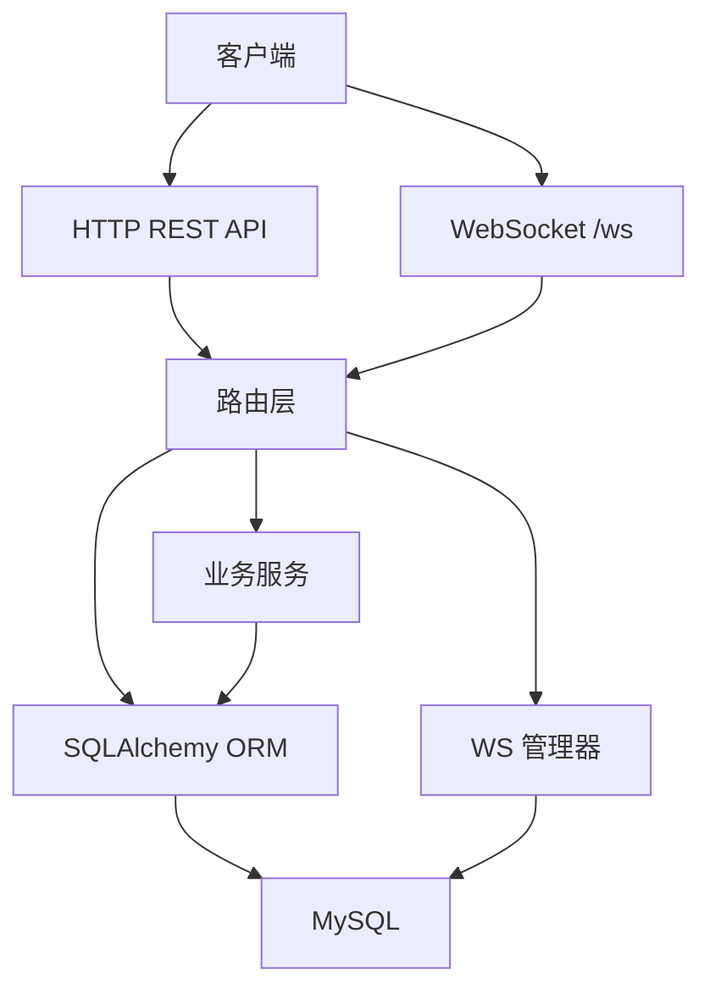
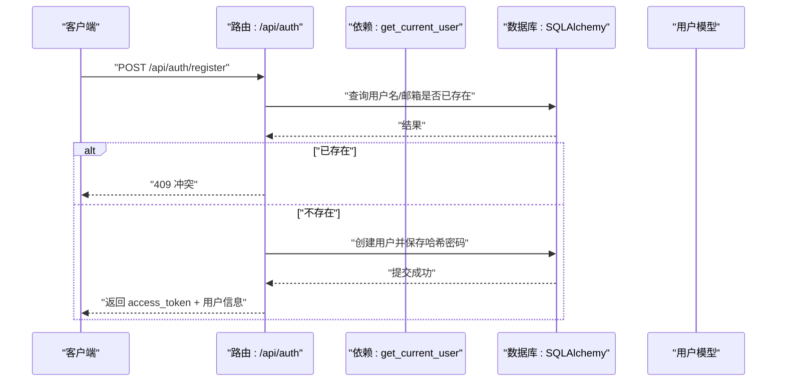
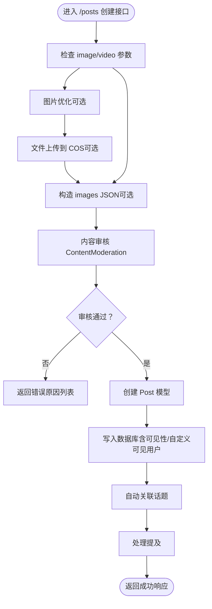
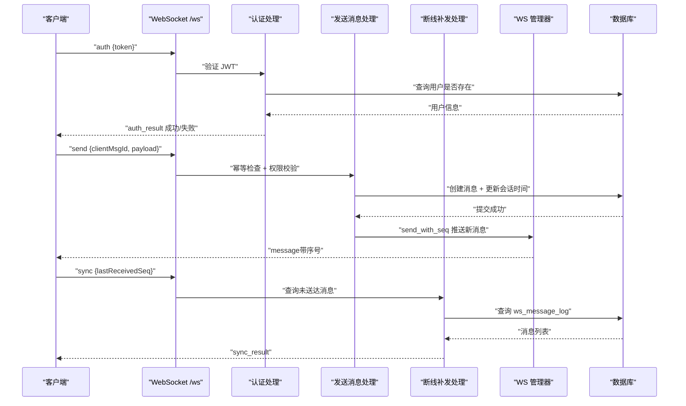
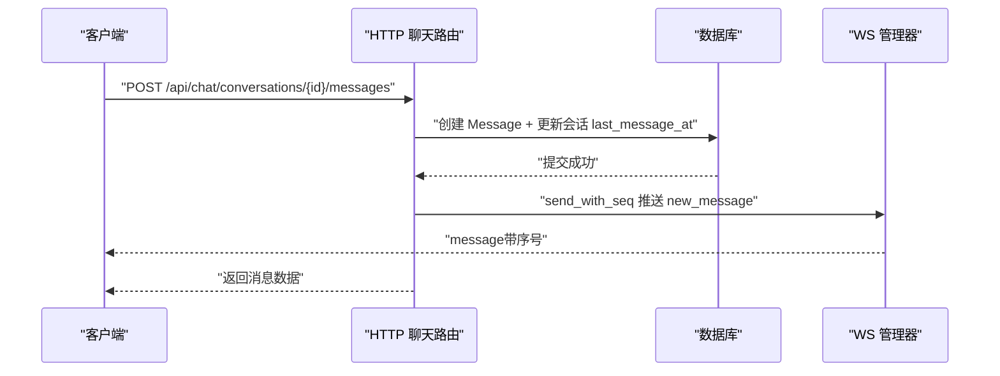
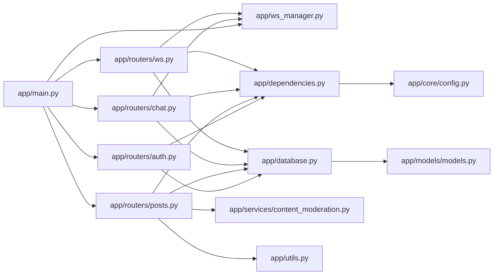

# 数据流分析

<cite>
**本文引用的文件**
- [app/main.py](file://app/main.py)
- [app/database.py](file://app/database.py)
- [app/ws_manager.py](file://app/ws_manager.py)
- [app/routers/ws.py](file://app/routers/ws.py)
- [app/models/models.py](file://app/models/models.py)
- [app/routers/chat.py](file://app/routers/chat.py)
- [app/routers/posts.py](file://app/routers/posts.py)
- [app/routers/auth.py](file://app/routers/auth.py)
- [app/services/content_moderation.py](file://app/services/content_moderation.py)
- [app/utils.py](file://app/utils.py)
- [app/dependencies.py](file://app/dependencies.py)
- [app/core/config.py](file://app/core/config.py)
- [requirements.txt](file://requirements.txt)
</cite>

## 目录
1. [简介](#简介)
2. [项目结构](#项目结构)
3. [核心组件](#核心组件)
4. [架构总览](#架构总览)
5. [详细组件分析](#详细组件分析)
6. [依赖关系分析](#依赖关系分析)
7. [性能考量](#性能考量)
8. [故障排查指南](#故障排查指南)
9. [结论](#结论)
10. [附录](#附录)

## 简介
本文件面向NanTuPy项目的开发者与维护者，系统性梳理“数据在系统中的流动路径与处理过程”。重点覆盖以下方面：
- 从客户端请求到数据库持久化的完整数据流，包括参数验证、业务处理、数据转换等环节
- 实时通信中的数据流，说明WebSocket消息的接收、处理、广播与推送过程
- 缓存数据流与数据库数据流的协调机制（本项目未实现应用层缓存，主要依赖数据库与内存状态）
- 异步任务的数据传递与状态管理（本项目未引入外部队列/异步任务框架，采用同步处理为主）
- 数据序列化与反序列化处理流程（JSON序列化、模型to_dict、ORM对象转换）
- 提供数据流图与处理时序图，帮助快速定位问题与优化瓶颈

## 项目结构
NanTuPy采用FastAPI作为Web框架，采用SQLAlchemy 2.0+进行数据库访问，路由按功能模块拆分，核心目录如下：
- app/main.py：应用入口与路由注册、中间件配置
- app/database.py：数据库引擎与Session管理
- app/models/models.py：ORM模型与WebSocket协议相关表
- app/ws_manager.py：WebSocket连接管理与消息序号系统
- app/routers/*：各功能模块路由（auth、posts、chat、ws等）
- app/services/*：业务服务（内容审核、推荐、话题等）
- app/utils.py：文件上传（COS）工具
- app/dependencies.py：认证依赖注入
- app/core/config.py：配置中心
- requirements.txt：依赖清单

图表来源
- [app/main.py:1-110](file://app/main.py#L1-L110)
- [app/database.py:1-38](file://app/database.py#L1-L38)
- [app/models/models.py:1-655](file://app/models/models.py#L1-L655)
- [app/ws_manager.py:1-308](file://app/ws_manager.py#L1-L308)
- [app/routers/auth.py:1-486](file://app/routers/auth.py#L1-L486)
- [app/routers/posts.py:1-405](file://app/routers/posts.py#L1-L405)
- [app/routers/chat.py:1-538](file://app/routers/chat.py#L1-L538)
- [app/routers/ws.py:1-538](file://app/routers/ws.py#L1-L538)
- [app/services/content_moderation.py:1-258](file://app/services/content_moderation.py#L1-L258)
- [app/utils.py:1-220](file://app/utils.py#L1-L220)
- [app/dependencies.py:1-63](file://app/dependencies.py#L1-L63)
- [app/core/config.py:1-43](file://app/core/config.py#L1-L43)

章节来源
- [app/main.py:1-110](file://app/main.py#L1-L110)
- [app/database.py:1-38](file://app/database.py#L1-L38)
- [app/models/models.py:1-655](file://app/models/models.py#L1-L655)

## 核心组件
- 应用入口与中间件：负责生命周期管理、CORS与安全头设置、路由注册与WebSocket端点挂载
- 数据库层：统一的SQLAlchemy引擎与Session工厂，提供依赖注入与事务控制
- 路由层：按功能拆分，包含认证、帖子、聊天、WebSocket等模块
- WebSocket管理：连接池、消息序号、断线补发、ACK去重、会话房间广播
- 业务服务：内容审核、文件上传（COS）、推荐与话题服务等
- 认证依赖：JWT解码、用户校验、可选认证

章节来源
- [app/main.py:1-110](file://app/main.py#L1-L110)
- [app/database.py:1-38](file://app/database.py#L1-L38)
- [app/dependencies.py:1-63](file://app/dependencies.py#L1-L63)
- [app/ws_manager.py:1-308](file://app/ws_manager.py#L1-L308)
- [app/routers/ws.py:1-538](file://app/routers/ws.py#L1-L538)

## 架构总览
NanTuPy采用“请求-处理-持久化-通知”的经典后端架构：
- 客户端通过HTTP REST API或WebSocket与服务交互
- 路由层进行参数校验与业务编排
- 业务服务执行策略（如内容审核、文件上传）
- ORM模型映射到数据库表，完成数据持久化
- WebSocket管理器负责实时消息的可靠投递与状态同步

图表来源
- [app/main.py:68-84](file://app/main.py#L68-L84)
- [app/routers/auth.py:184-246](file://app/routers/auth.py#L184-L246)
- [app/routers/posts.py:22-139](file://app/routers/posts.py#L22-L139)
- [app/routers/chat.py:351-428](file://app/routers/chat.py#L351-L428)
- [app/routers/ws.py:434-538](file://app/routers/ws.py#L434-L538)
- [app/ws_manager.py:20-308](file://app/ws_manager.py#L20-L308)
- [app/database.py:22-37](file://app/database.py#L22-L37)

## 详细组件分析

### 1) HTTP REST API 数据流（以认证为例）
从客户端发起注册/登录请求，到数据库持久化与响应返回的完整数据流如下：

图表来源
- [app/routers/auth.py:184-212](file://app/routers/auth.py#L184-L212)
- [app/dependencies.py:16-36](file://app/dependencies.py#L16-L36)
- [app/database.py:22-32](file://app/database.py#L22-L32)

章节来源
- [app/routers/auth.py:184-246](file://app/routers/auth.py#L184-L246)
- [app/dependencies.py:16-36](file://app/dependencies.py#L16-L36)
- [app/database.py:22-32](file://app/database.py#L22-L32)

### 2) 帖子创建与内容审核数据流
帖子创建流程包含文件上传、内容审核、话题与提及处理、数据库持久化与响应返回。

图表来源
- [app/routers/posts.py:22-139](file://app/routers/posts.py#L22-L139)
- [app/services/content_moderation.py:74-126](file://app/services/content_moderation.py#L74-L126)
- [app/utils.py:151-187](file://app/utils.py#L151-L187)

章节来源
- [app/routers/posts.py:22-139](file://app/routers/posts.py#L22-L139)
- [app/services/content_moderation.py:74-126](file://app/services/content_moderation.py#L74-L126)
- [app/utils.py:151-187](file://app/utils.py#L151-L187)

### 3) WebSocket 数据流（认证、发送消息、断线补发）
WebSocket端点负责认证、消息处理、房间广播与实时推送。

图表来源
- [app/routers/ws.py:434-538](file://app/routers/ws.py#L434-L538)
- [app/ws_manager.py:20-308](file://app/ws_manager.py#L20-L308)
- [app/models/models.py:625-655](file://app/models/models.py#L625-L655)

章节来源
- [app/routers/ws.py:434-538](file://app/routers/ws.py#L434-L538)
- [app/ws_manager.py:20-308](file://app/ws_manager.py#L20-L308)
- [app/models/models.py:625-655](file://app/models/models.py#L625-L655)

### 4) 聊天路由与实时推送数据流
HTTP聊天接口在消息发送后，通过WS管理器向对端推送实时消息，并计算未读计数。

图表来源
- [app/routers/chat.py:351-428](file://app/routers/chat.py#L351-L428)
- [app/ws_manager.py:74-95](file://app/ws_manager.py#L74-L95)

章节来源
- [app/routers/chat.py:351-428](file://app/routers/chat.py#L351-L428)
- [app/ws_manager.py:74-95](file://app/ws_manager.py#L74-L95)

### 5) 数据序列化与反序列化
- WebSocket消息：使用send_json进行序列化，接收端receive_json进行反序列化
- ORM模型：to_dict方法将模型实例转为字典，便于API响应与WS推送
- JSON字段：如Post.images为JSON数组字符串，需在to_dict中解析

章节来源
- [app/routers/ws.py:442](file://app/routers/ws.py#L442)
- [app/models/models.py:152-184](file://app/models/models.py#L152-L184)
- [app/models/models.py:345-356](file://app/models/models.py#L345-L356)

### 6) 缓存与数据库协调机制
- 应用层未实现Redis/Memcached等缓存；在线状态通过WS管理器内存字典维护
- 未读计数与会话列表通过数据库聚合查询计算
- WebSocket消息持久化到ws_message_log表，支持断线补发

章节来源
- [app/routers/chat.py:483-509](file://app/routers/chat.py#L483-L509)
- [app/ws_manager.py:214-247](file://app/ws_manager.py#L214-L247)
- [app/models/models.py:625-655](file://app/models/models.py#L625-L655)

### 7) 异步任务与状态管理
- 本项目未引入Celery/RQ等异步任务框架，采用同步处理
- WebSocket端点为长连接，状态通过WS管理器内存字典与数据库表协同维护
- 文件上传采用COS直传或SDK上传，均在请求上下文中完成

章节来源
- [app/routers/posts.py:54-87](file://app/routers/posts.py#L54-L87)
- [app/utils.py:151-187](file://app/utils.py#L151-L187)
- [app/routers/ws.py:434-538](file://app/routers/ws.py#L434-L538)

## 依赖关系分析

图表来源
- [app/main.py:13-84](file://app/main.py#L13-L84)
- [app/routers/auth.py:11-22](file://app/routers/auth.py#L11-L22)
- [app/routers/posts.py:9-16](file://app/routers/posts.py#L9-L16)
- [app/routers/chat.py:7-13](file://app/routers/chat.py#L7-L13)
- [app/routers/ws.py:11-16](file://app/routers/ws.py#L11-L16)
- [app/ws_manager.py:15-16](file://app/ws_manager.py#L15-L16)
- [app/database.py:5-19](file://app/database.py#L5-L19)
- [app/models/models.py:5-11](file://app/models/models.py#L5-L11)
- [app/dependencies.py:4-10](file://app/dependencies.py#L4-L10)
- [app/core/config.py:7-20](file://app/core/config.py#L7-L20)

章节来源
- [app/main.py:13-84](file://app/main.py#L13-L84)
- [app/database.py:5-19](file://app/database.py#L5-L19)
- [app/models/models.py:5-11](file://app/models/models.py#L5-L11)
- [app/dependencies.py:4-10](file://app/dependencies.py#L4-L10)
- [app/core/config.py:7-20](file://app/core/config.py#L7-L20)

## 性能考量
- 数据库连接池：SQLAlchemy引擎配置了池大小与回收策略，建议结合压测调整
- ORM批量查询：聊天路由中对用户、消息、未读计数采用批量查询，减少N+1问题
- WebSocket序号与持久化：通过原子递增与消息日志保证顺序与可恢复性，但需关注日志表增长
- 文件上传：COS直传可降低服务器压力，注意并发与超时配置
- 内容审核：正则匹配与敏感词过滤在CPU密集场景需评估性能，必要时引入缓存或异步化

## 故障排查指南
- WebSocket认证失败：检查JWT密钥与token有效性，确认用户存在
- 消息未送达：检查ws_message_log表与当前序号，确认离线补发逻辑
- 权限拒绝：检查好友关系与隐私设置，确保发送目标可达
- 文件上传失败：检查COS配置与权限，确认预签名URL或SDK参数
- 内容审核拦截：查看审核日志与原因列表，确认敏感词与垃圾信息规则

章节来源
- [app/routers/ws.py:446-470](file://app/routers/ws.py#L446-L470)
- [app/ws_manager.py:170-212](file://app/ws_manager.py#L170-L212)
- [app/routers/chat.py:361-373](file://app/routers/chat.py#L361-L373)
- [app/utils.py:37-77](file://app/utils.py#L37-L77)
- [app/services/content_moderation.py:230-249](file://app/services/content_moderation.py#L230-L249)

## 结论
NanTuPy通过清晰的模块划分与严格的依赖注入，实现了从REST API到WebSocket的全链路数据流。数据库层采用SQLAlchemy统一管理，业务层通过服务模块解耦复杂度，实时通信通过WS管理器保障可靠性。建议在高并发场景下进一步优化数据库查询、引入缓存与异步任务，并完善监控与日志体系以提升可观测性。

## 附录
- 依赖清单（节选）
  - fastapi、uvicorn、sqlalchemy、pymysql、python-jose、passlib[bcrypt]、cos-python-sdk-v5、pydantic、werkzeug

章节来源
- [requirements.txt:1-15](file://requirements.txt#L1-L15)