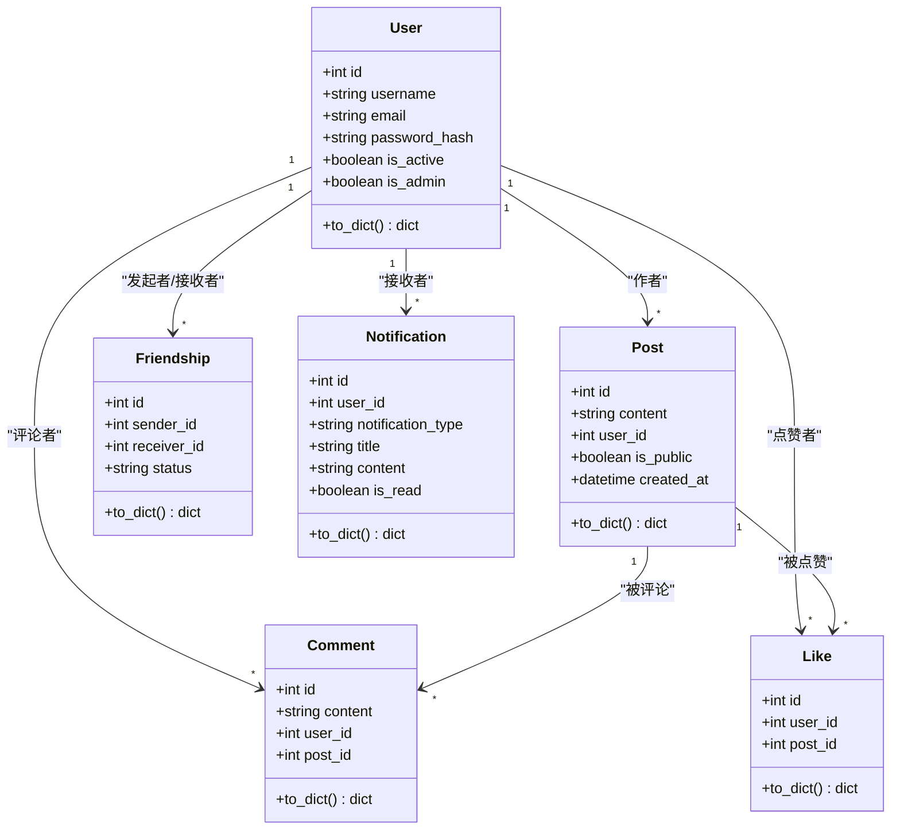
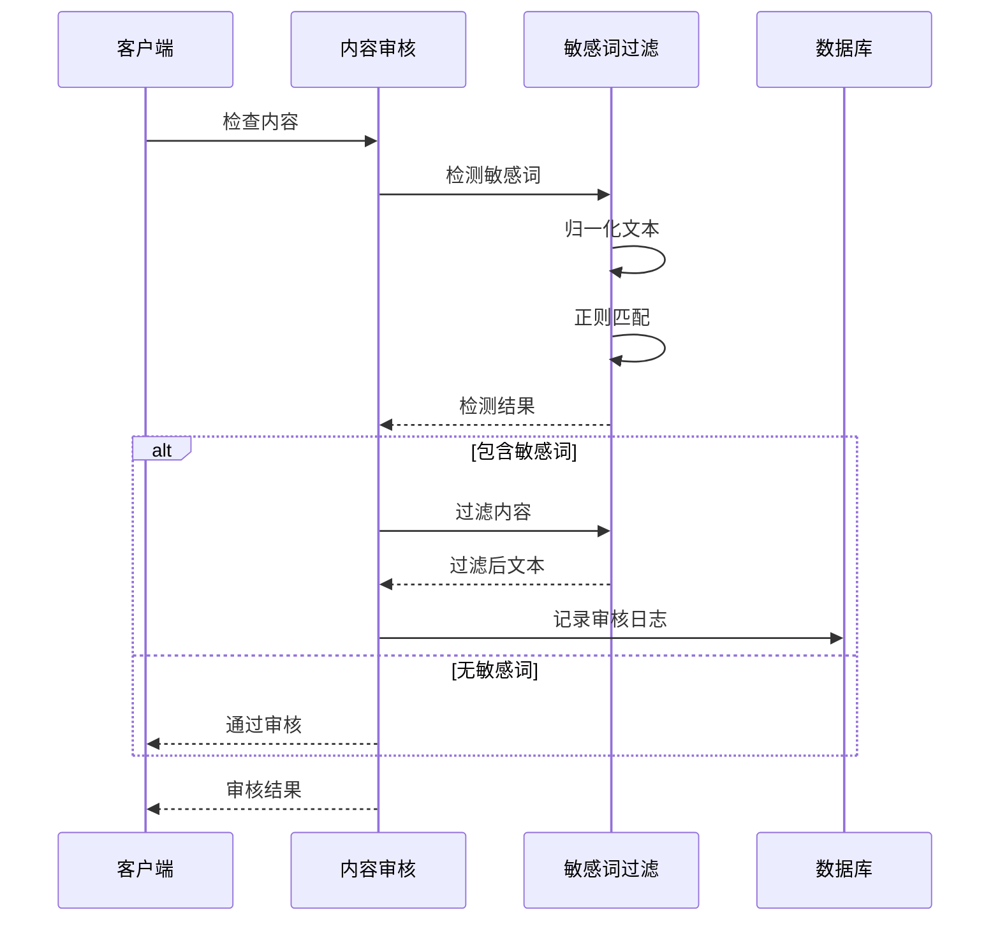
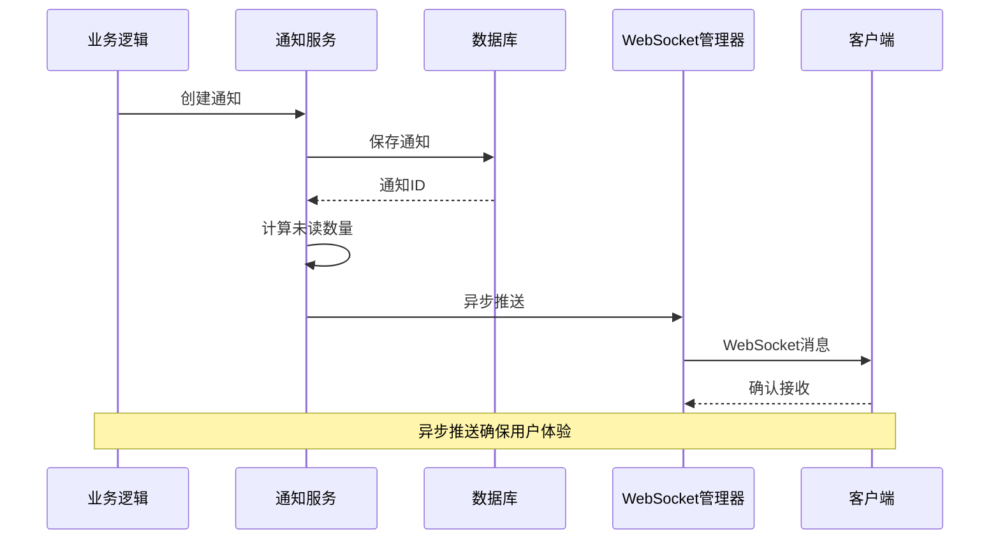
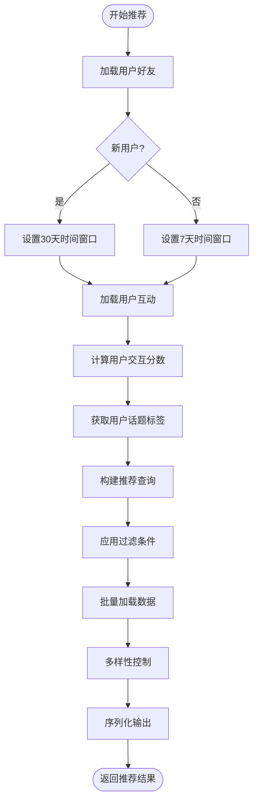
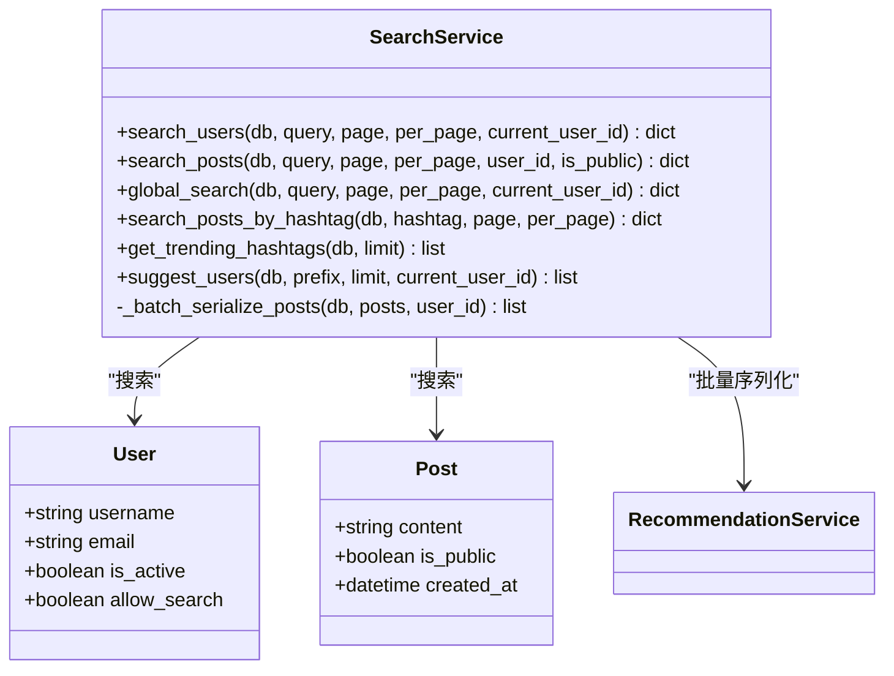
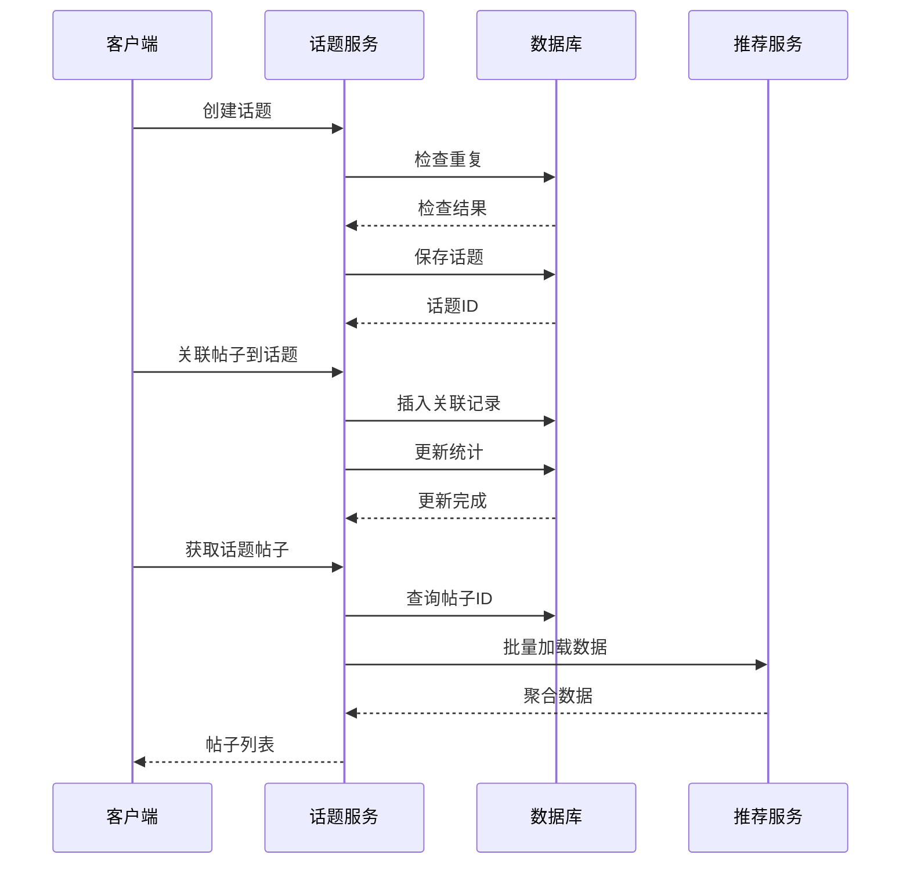
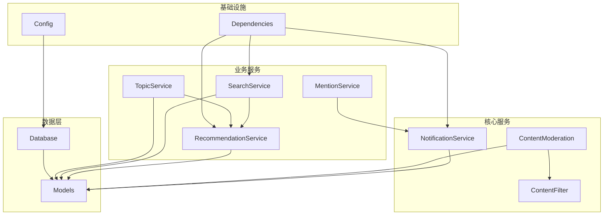

# 服务层数据流

<cite>
**本文档引用的文件**
- [app/services/content_filter.py](file://app/services/content_filter.py)
- [app/services/content_moderation.py](file://app/services/content_moderation.py)
- [app/services/notification_service.py](file://app/services/notification_service.py)
- [app/services/recommendation_service.py](file://app/services/recommendation_service.py)
- [app/services/search_service.py](file://app/services/search_service.py)
- [app/services/topic_service.py](file://app/services/topic_service.py)
- [app/services/mention_service.py](file://app/services/mention_service.py)
- [app/models/models.py](file://app/models/models.py)
- [app/database.py](file://app/database.py)
- [app/routers/search.py](file://app/routers/search.py)
- [app/routers/notifications.py](file://app/routers/notifications.py)
- [app/routers/recommendations.py](file://app/routers/recommendations.py)
- [app/core/config.py](file://app/core/config.py)
- [app/dependencies.py](file://app/dependencies.py)
</cite>

## 目录
1. [简介](#简介)
2. [项目结构](#项目结构)
3. [核心组件](#核心组件)
4. [架构概览](#架构概览)
5. [详细组件分析](#详细组件分析)
6. [依赖关系分析](#依赖关系分析)
7. [性能考量](#性能考量)
8. [故障排除指南](#故障排除指南)
9. [结论](#结论)

## 简介

NanTuPy是一个基于FastAPI的社交平台后端服务，采用模块化的服务层架构设计。本文档深入分析服务层的数据流，重点涵盖业务服务层如何协调多个数据源、处理复杂业务逻辑，以及内容过滤、通知推送、推荐算法和搜索服务的数据处理流程。

该系统通过清晰的服务边界分离，实现了高内聚低耦合的设计原则，为后续的功能扩展和维护提供了良好的基础。

## 项目结构

NanTuPy采用分层架构设计，主要分为以下层次：

```mermaid
graph TB
subgraph "表现层"
Routers[routers/* 路由层]
end
subgraph "服务层"
Services[services/* 服务层]
ContentFilter[内容过滤服务]
ContentModeration[内容审核服务]
NotificationService[通知服务]
RecommendationService[推荐服务]
SearchService[搜索服务]
TopicService[话题服务]
MentionService[@提及服务]
end
subgraph "数据访问层"
Models[models/models.py 数据模型]
Database[database.py 数据库连接]
end
subgraph "基础设施"
Config[core/config.py 配置]
Dependencies[dependencies.py 依赖注入]
end
Routers --> Services
Services --> Models
Models --> Database
Services --> Database
Config --> Database
Dependencies --> Routers
```

**图表来源**
- [app/routers/search.py:1-269](file://app/routers/search.py#L1-L269)
- [app/services/search_service.py:1-179](file://app/services/search_service.py#L1-L179)
- [app/models/models.py:1-655](file://app/models/models.py#L1-L655)

**章节来源**
- [app/routers/search.py:1-269](file://app/routers/search.py#L1-L269)
- [app/services/search_service.py:1-179](file://app/services/search_service.py#L1-L179)
- [app/models/models.py:1-655](file://app/models/models.py#L1-L655)

## 核心组件

### 服务层架构模式

服务层采用静态方法设计模式，每个服务类都提供一组相关的业务逻辑操作。这种设计具有以下特点：

1. **单一职责原则**：每个服务专注于特定的业务领域
2. **无状态设计**：服务类保持无状态，便于并发访问
3. **显式依赖注入**：通过Session参数明确数据库连接依赖
4. **批量数据处理**：通过批量加载避免N+1查询问题

### 数据模型层

数据模型采用SQLAlchemy ORM设计，支持复杂的关联关系和查询操作：



**图表来源**
- [app/models/models.py:42-421](file://app/models/models.py#L42-L421)

**章节来源**
- [app/models/models.py:1-655](file://app/models/models.py#L1-L655)

## 架构概览

### 服务层数据流架构

```mermaid
graph TB
subgraph "外部接口"
API[REST API]
WebSocket[WebSocket连接]
end
subgraph "路由层"
SearchRouter[搜索路由]
NotificationRouter[通知路由]
RecommendationRouter[推荐路由]
end
subgraph "服务层"
ContentFilter[内容过滤]
ContentModeration[内容审核]
NotificationService[通知服务]
RecommendationService[推荐算法]
SearchService[搜索服务]
TopicService[话题服务]
MentionService[@提及服务]
end
subgraph "数据层"
Database[MySQL数据库]
Models[ORM模型]
end
subgraph "实时通信"
WSManager[WebSocket管理器]
end
API --> SearchRouter
API --> NotificationRouter
API --> RecommendationRouter
SearchRouter --> SearchService
NotificationRouter --> NotificationService
RecommendationRouter --> RecommendationService
SearchService --> SearchService
NotificationService --> WSManager
RecommendationService --> Models
SearchService --> Models
TopicService --> Models
MentionService --> NotificationService
SearchService --> Database
NotificationService --> Database
RecommendationService --> Database
TopicService --> Database
ContentModeration --> ContentFilter
ContentModeration --> Database
```

**图表来源**
- [app/routers/search.py:1-269](file://app/routers/search.py#L1-L269)
- [app/routers/notifications.py:1-208](file://app/routers/notifications.py#L1-L208)
- [app/routers/recommendations.py:1-70](file://app/routers/recommendations.py#L1-L70)
- [app/services/notification_service.py:1-233](file://app/services/notification_service.py#L1-L233)

### 数据流处理机制

服务层通过以下机制实现高效的数据处理：

1. **批量数据加载**：避免N+1查询问题
2. **延迟计算**：只在需要时进行复杂计算
3. **缓存策略**：利用数据库索引和查询优化
4. **异步处理**：WebSocket通知推送

## 详细组件分析

### 内容过滤服务

内容过滤服务是整个内容审核体系的核心组件，负责敏感词检测和内容净化。



**图表来源**
- [app/services/content_moderation.py:74-126](file://app/services/content_moderation.py#L74-L126)
- [app/services/content_filter.py:104-142](file://app/services/content_filter.py#L104-L142)

#### 核心特性

1. **多层检测机制**：
   - 敏感词检测（使用ContentFilter单例）
   - 垃圾信息检测（URL链接、重复字符等模式）
   - 不适当内容检测（预定义关键词）
   - 仇恨言论检测（专门的正则表达式）

2. **字符变体处理**：支持全角/半角字符转换和异体字识别

3. **动态词库管理**：支持运行时添加和删除敏感词

**章节来源**
- [app/services/content_filter.py:1-192](file://app/services/content_filter.py#L1-L192)
- [app/services/content_moderation.py:1-258](file://app/services/content_moderation.py#L1-L258)

### 通知服务

通知服务实现了完整的实时通知推送机制，支持多种通知类型和WebSocket实时推送。



**图表来源**
- [app/services/notification_service.py:21-53](file://app/services/notification_service.py#L21-L53)
- [app/services/notification_service.py:55-84](file://app/services/notification_service.py#L55-L84)

#### 通知类型

服务支持以下通知类型：
- 帖子点赞通知
- 评论通知  
- 好友请求通知
- 好友接受通知
- 私信通知
- @提及通知

#### 异步推送机制

通知服务采用异步推送模式，避免阻塞主线程：

1. **事件循环检测**：自动适配不同的事件循环环境
2. **异常处理**：确保推送失败不影响主业务流程
3. **资源管理**：正确关闭数据库连接

**章节来源**
- [app/services/notification_service.py:1-233](file://app/services/notification_service.py#L1-L233)

### 推荐算法服务

推荐算法服务实现了复杂的个性化推荐系统，结合用户行为、社交关系和内容特征。



**图表来源**
- [app/services/recommendation_service.py:83-168](file://app/services/recommendation_service.py#L83-L168)

#### 推荐算法特点

1. **多维度评分**：
   - 好友关系权重（80分）
   - 用户交互分数（基于点赞和评论）
   - 话题相关性（40分）
   - 内容热度衰减（时间因子）
   - 发布时间权重

2. **多样性保证**：限制同一作者的推荐数量，避免内容同质化

3. **性能优化**：批量加载聚合数据，避免N+1查询

**章节来源**
- [app/services/recommendation_service.py:1-457](file://app/services/recommendation_service.py#L1-L457)

### 搜索服务

搜索服务提供了全面的搜索功能，包括用户搜索、帖子搜索、全局搜索和标签搜索。



**图表来源**
- [app/services/search_service.py:9-179](file://app/services/search_service.py#L9-L179)

#### 搜索优化策略

1. **智能查询解析**：支持邮箱地址的特殊解析
2. **排序优化**：基于匹配度和创建时间的综合排序
3. **分页处理**：使用offset+limit的高效分页方案
4. **批量序列化**：复用推荐服务的批量数据加载机制

**章节来源**
- [app/services/search_service.py:1-179](file://app/services/search_service.py#L1-L179)

### 话题服务

话题服务管理话题的创建、关联和统计信息，支持话题的热门度计算和用户关注功能。



**图表来源**
- [app/services/topic_service.py:37-105](file://app/services/topic_service.py#L37-L105)

#### 核心功能

1. **话题管理**：创建、查询、更新话题信息
2. **帖子关联**：建立话题与帖子的多对多关系
3. **统计计算**：维护话题的关注者数量和帖子数量
4. **热门话题**：基于最近7天帖子数量的热门度排序

**章节来源**
- [app/services/topic_service.py:1-277](file://app/services/topic_service.py#L1-L277)

### @提及服务

@提及服务处理内容中的@用户名格式，自动识别并通知被提及的用户。

```mermaid
flowchart TD
Start([处理@提及]) --> ExtractMentions[提取@用户名]
ExtractMentions --> CheckEmpty{是否有提及?}
CheckEmpty --> |否| ReturnEmpty[返回空列表]
CheckEmpty --> |是| FindUsers[查找用户]
FindUsers --> FilterSelf[过滤自己]
FilterSelf --> SendNotifications[发送通知]
SendNotifications --> FormatContext[格式化上下文]
FormatContext --> ReturnResults[返回结果]
ReturnEmpty --> End([结束])
ReturnResults --> End
```

**图表来源**
- [app/services/mention_service.py:48-94](file://app/services/mention_service.py#L48-L94)

#### 处理流程

1. **内容解析**：使用正则表达式提取@用户名
2. **用户查找**：批量查询被提及的用户
3. **通知发送**：调用通知服务发送@提及通知
4. **上下文生成**：截取内容片段作为通知内容

**章节来源**
- [app/services/mention_service.py:1-118](file://app/services/mention_service.py#L1-L118)

## 依赖关系分析

### 服务间依赖关系



**图表来源**
- [app/services/content_moderation.py:95-120](file://app/services/content_moderation.py#L95-L120)
- [app/services/search_service.py:58-60](file://app/services/search_service.py#L58-L60)
- [app/services/topic_service.py:96-100](file://app/services/topic_service.py#L96-L100)

### 数据传递机制

服务层采用统一的Session参数传递模式，确保事务的一致性和数据的完整性：

1. **显式依赖注入**：每个服务方法都接收Session参数
2. **事务管理**：在路由层或调用方管理事务生命周期
3. **资源释放**：确保数据库连接的正确关闭

**章节来源**
- [app/services/recommendation_service.py:10-11](file://app/services/recommendation_service.py#L10-L11)
- [app/services/search_service.py:4-6](file://app/services/search_service.py#L4-L6)

## 性能考量

### 查询优化策略

1. **批量数据加载**：使用一次性查询获取多个聚合数据
2. **索引优化**：在常用查询字段上建立索引
3. **查询缓存**：利用数据库查询缓存机制
4. **分页优化**：避免COUNT查询，使用偏移量+限制的方式

### 内存管理

1. **对象池**：使用SQLAlchemy的Session池管理数据库连接
2. **及时释放**：确保每个数据库连接在使用后及时关闭
3. **批量操作**：使用批量插入和更新减少数据库往返

### 异步处理

1. **非阻塞通知**：使用asyncio确保通知推送不阻塞主线程
2. **事件循环适配**：自动检测和适配不同的事件循环环境
3. **异常隔离**：确保推送异常不影响主业务流程

## 故障排除指南

### 常见问题诊断

1. **数据库连接问题**
   - 检查数据库连接字符串配置
   - 验证数据库服务状态
   - 查看连接池配置参数

2. **通知推送失败**
   - 检查WebSocket连接状态
   - 验证用户在线状态
   - 查看日志中的异常信息

3. **推荐结果异常**
   - 检查用户数据完整性
   - 验证推荐算法参数
   - 查看查询执行计划

### 性能监控

1. **慢查询监控**：使用数据库慢查询日志
2. **内存使用监控**：监控服务进程的内存使用情况
3. **并发性能测试**：模拟高并发场景下的系统表现

**章节来源**
- [app/database.py:1-38](file://app/database.py#L1-L38)
- [app/services/notification_service.py:45-52](file://app/services/notification_service.py#L45-L52)

## 结论

NanTuPy的服务层架构展现了现代Web应用的最佳实践，通过清晰的服务边界、高效的查询优化和完善的错误处理机制，为复杂的社交平台业务提供了坚实的技术基础。

### 主要优势

1. **模块化设计**：每个服务职责明确，便于维护和扩展
2. **性能优化**：采用批量查询和异步处理提升系统性能
3. **数据一致性**：通过显式的事务管理和Session传递确保数据完整性
4. **可扩展性**：服务层设计支持未来功能的平滑扩展

### 技术亮点

- **内容审核体系**：多层次的内容过滤和审核机制
- **智能推荐算法**：结合多种因素的个性化推荐系统
- **实时通知推送**：基于WebSocket的即时消息推送
- **高效搜索服务**：支持多种搜索场景的综合搜索系统

该架构为后续的功能扩展和性能优化提供了良好的基础，能够支撑社交平台的持续发展需求。