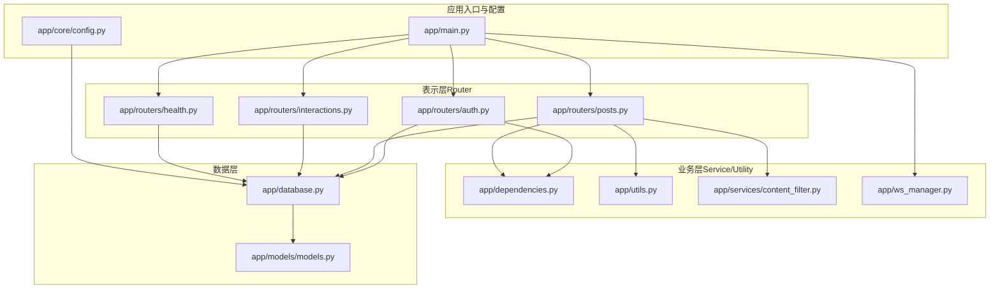
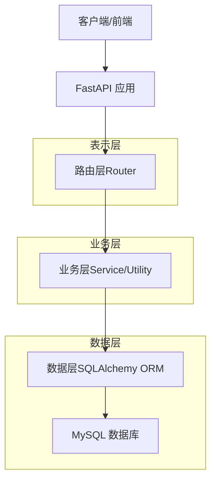
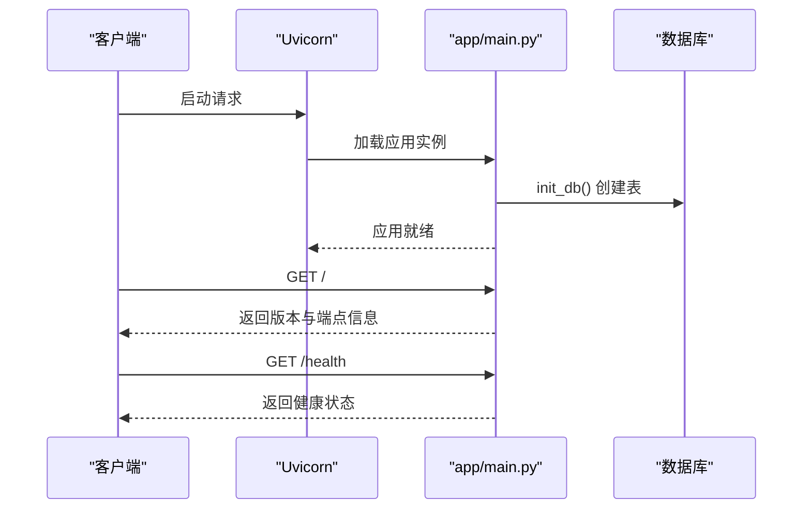
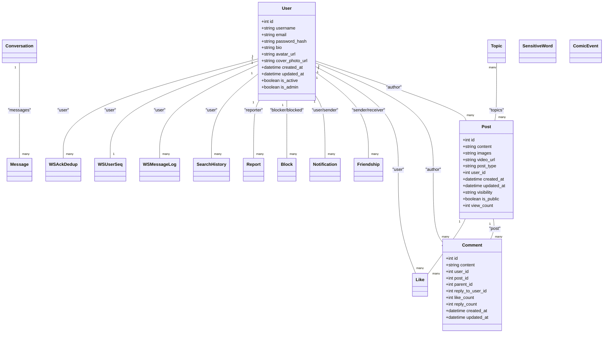
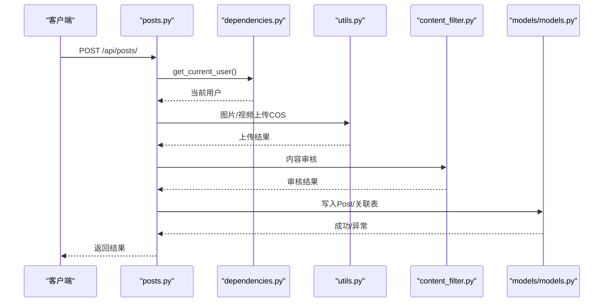
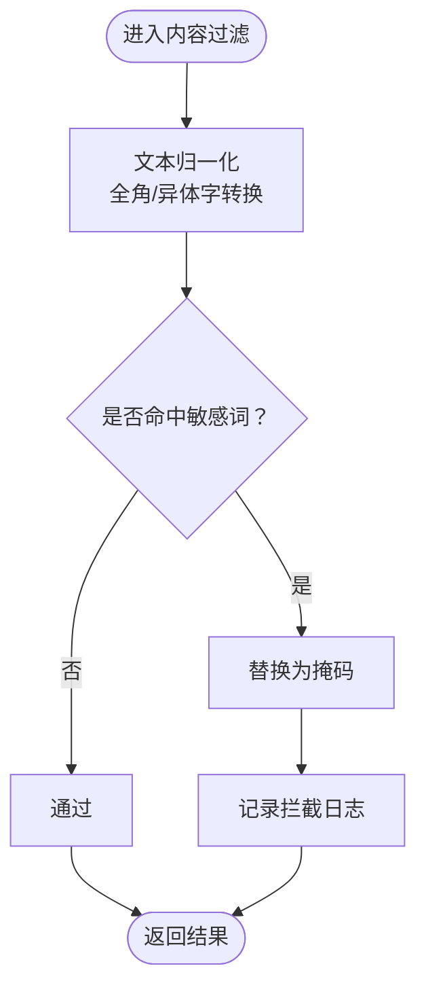
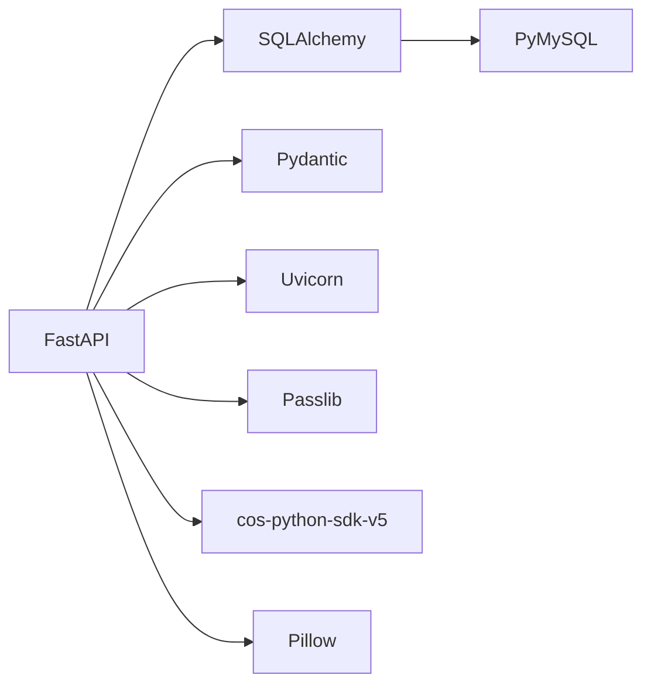

# 整体架构概览

<cite>
**本文档引用的文件**
- [app/main.py](file://app/main.py)
- [app/core/config.py](file://app/core/config.py)
- [app/database.py](file://app/database.py)
- [app/models/models.py](file://app/models/models.py)
- [app/routers/auth.py](file://app/routers/auth.py)
- [app/routers/posts.py](file://app/routers/posts.py)
- [app/routers/health.py](file://app/routers/health.py)
- [app/routers/interactions.py](file://app/routers/interactions.py)
- [app/dependencies.py](file://app/dependencies.py)
- [app/utils.py](file://app/utils.py)
- [app/ws_manager.py](file://app/ws_manager.py)
- [app/services/content_filter.py](file://app/services/content_filter.py)
- [requirements.txt](file://requirements.txt)
</cite>

## 目录
1. [引言](#引言)
2. [项目结构](#项目结构)
3. [核心组件](#核心组件)
4. [架构总览](#架构总览)
5. [详细组件分析](#详细组件分析)
6. [依赖分析](#依赖分析)
7. [性能考量](#性能考量)
8. [故障排查指南](#故障排查指南)
9. [结论](#结论)

## 引言
本文件面向NanTuPy项目的整体架构概览，重点阐述基于FastAPI的分层架构设计与MVC模式在项目中的落地实践。系统采用表示层（Router）、业务层（Service/Utility）、数据层（SQLAlchemy ORM + MySQL）的清晰职责划分，并通过模块化理念实现高内聚低耦合。同时，文档覆盖系统边界、外部依赖与第三方集成点，以及异步编程、FastAPI特性等架构决策的技术背景与选择理由。

## 项目结构
项目采用按功能域组织的模块化目录结构，围绕“表示层-业务层-数据层”三层展开，配合独立的服务与工具模块，形成清晰的职责边界与可扩展性。

**图表来源**
- [app/main.py:1-110](file://app/main.py#L1-L110)
- [app/core/config.py:1-43](file://app/core/config.py#L1-L43)
- [app/database.py:1-38](file://app/database.py#L1-L38)
- [app/models/models.py:1-655](file://app/models/models.py#L1-L655)
- [app/routers/auth.py:1-486](file://app/routers/auth.py#L1-L486)
- [app/routers/posts.py:1-200](file://app/routers/posts.py#L1-L200)
- [app/routers/interactions.py:1-41](file://app/routers/interactions.py#L1-L41)
- [app/routers/health.py:1-37](file://app/routers/health.py#L1-L37)
- [app/dependencies.py:1-63](file://app/dependencies.py#L1-L63)
- [app/utils.py:1-220](file://app/utils.py#L1-L220)
- [app/ws_manager.py:1-308](file://app/ws_manager.py#L1-L308)
- [app/services/content_filter.py:1-192](file://app/services/content_filter.py#L1-L192)

**章节来源**
- [app/main.py:1-110](file://app/main.py#L1-L110)
- [app/core/config.py:1-43](file://app/core/config.py#L1-L43)
- [app/database.py:1-38](file://app/database.py#L1-L38)
- [app/models/models.py:1-655](file://app/models/models.py#L1-L655)

## 核心组件
- 应用入口与生命周期管理：负责初始化数据库、注册路由、中间件与全局安全头设置。
- 配置中心：集中管理数据库、JWT、上传与云存储等配置项。
- 数据库与ORM：基于SQLAlchemy 2.0+的同步引擎与Session，提供依赖注入与表初始化。
- 模型层：定义用户、帖子、评论、点赞、好友、会话、消息、通知、话题、屏蔽、举报、搜索历史、敏感词、漫展相关与WebSocket协议表等实体。
- 路由层：按功能域拆分，如认证、帖子、互动、聊天、通知、搜索、话题、上传、推荐、屏蔽、举报、健康检查、管理、漫画等。
- 依赖注入与认证：提供JWT解析、当前用户获取、可选用户获取与管理员校验。
- 工具与服务：文件上传（COS）、内容审核（敏感词过滤）、WebSocket连接管理、推荐与话题/提及处理等。
- 外部依赖：FastAPI、SQLAlchemy、PyMySQL、Pydantic、Passlib、COS SDK、Socket.IO等。

**章节来源**
- [app/main.py:1-110](file://app/main.py#L1-L110)
- [app/core/config.py:1-43](file://app/core/config.py#L1-L43)
- [app/database.py:1-38](file://app/database.py#L1-L38)
- [app/models/models.py:1-655](file://app/models/models.py#L1-L655)
- [app/dependencies.py:1-63](file://app/dependencies.py#L1-L63)
- [app/utils.py:1-220](file://app/utils.py#L1-L220)
- [app/ws_manager.py:1-308](file://app/ws_manager.py#L1-L308)
- [app/services/content_filter.py:1-192](file://app/services/content_filter.py#L1-L192)
- [requirements.txt:1-15](file://requirements.txt#L1-L15)

## 架构总览
系统采用经典的分层架构与MVC思想在FastAPI中的实现：
- 表示层（View/Router）：接收HTTP/WebSocket请求，执行参数校验与响应封装，调用业务层。
- 业务层（Service/Utility）：封装领域逻辑（如内容审核、文件上传、推荐、话题/提及处理、WebSocket序号与去重），复用数据访问。
- 数据层（Model/DAO）：通过SQLAlchemy ORM抽象数据库操作，提供统一的Session依赖注入。

**图表来源**
- [app/main.py:68-84](file://app/main.py#L68-L84)
- [app/routers/auth.py:184-246](file://app/routers/auth.py#L184-L246)
- [app/routers/posts.py:22-140](file://app/routers/posts.py#L22-L140)
- [app/database.py:22-32](file://app/database.py#L22-L32)
- [app/models/models.py:42-184](file://app/models/models.py#L42-L184)

## 详细组件分析

### 应用入口与生命周期（Main）
- 初始化数据库：在应用启动时创建所有表，确保Schema就绪。
- 注册路由：集中注册认证、帖子、好友、互动、聊天、通知、搜索、话题、上传、推荐、屏蔽、举报、健康检查、管理、漫画等路由。
- 中间件与安全头：配置CORS与COOP/COEP安全头，适配Flutter Web运行环境。
- 根路径与健康检查：提供根路径信息与健康检查接口。

**图表来源**
- [app/main.py:29-37](file://app/main.py#L29-L37)
- [app/main.py:68-104](file://app/main.py#L68-L104)
- [app/database.py:35-38](file://app/database.py#L35-L38)

**章节来源**
- [app/main.py:1-110](file://app/main.py#L1-L110)
- [app/database.py:1-38](file://app/database.py#L1-L38)

### 配置中心（Config）
- 安全与JWT：从环境变量读取密钥，控制JWT过期时间。
- 数据库：构建SQLAlchemy URI，配置连接池参数。
- 上传与扩展名：定义上传目录、最大大小与允许的媒体类型。
- 云存储：腾讯云COS的ID、Key、区域、Bucket、域名等配置。

**章节来源**
- [app/core/config.py:1-43](file://app/core/config.py#L1-L43)

### 数据库与ORM（Database/Models）
- 引擎与Session：创建同步引擎与SessionLocal，提供依赖注入get_db；初始化Base并创建所有表。
- 模型定义：涵盖用户、帖子、评论、点赞、好友、会话、消息、通知、话题、屏蔽、举报、搜索历史、敏感词、漫展相关与WebSocket协议表等。
- 关系与索引：通过relationship与Index优化查询性能，如评论索引、搜索历史索引等。

**图表来源**
- [app/models/models.py:42-655](file://app/models/models.py#L42-L655)

**章节来源**
- [app/database.py:1-38](file://app/database.py#L1-L38)
- [app/models/models.py:1-655](file://app/models/models.py#L1-L655)

### 路由层（Routers）
- 认证路由：注册、登录、刷新、忘记/重置密码、个人资料、隐私设置、注销账号等。
- 帖子路由：创建帖子（支持图片/视频上传与优化）、获取动态流、用户帖子列表、可见性控制等。
- 互动路由：评论、点赞、回复等批量增强与通知服务集成。
- 健康检查路由：数据库连通性与简单ping。

**图表来源**
- [app/routers/posts.py:22-140](file://app/routers/posts.py#L22-L140)
- [app/dependencies.py:16-36](file://app/dependencies.py#L16-L36)
- [app/utils.py:14-187](file://app/utils.py#L14-L187)
- [app/services/content_filter.py:104-142](file://app/services/content_filter.py#L104-L142)
- [app/models/models.py:100-184](file://app/models/models.py#L100-L184)

**章节来源**
- [app/routers/auth.py:1-486](file://app/routers/auth.py#L1-L486)
- [app/routers/posts.py:1-200](file://app/routers/posts.py#L1-L200)
- [app/routers/interactions.py:1-41](file://app/routers/interactions.py#L1-L41)
- [app/routers/health.py:1-37](file://app/routers/health.py#L1-L37)

### 依赖注入与认证（Dependencies）
- JWT解码：从Authorization头提取token并解码，校验过期与用户有效性。
- 当前用户：强制认证，获取用户对象。
- 可选用户：非强制认证，便于公开接口。
- 管理员校验：对管理端接口进行权限控制。

**章节来源**
- [app/dependencies.py:1-63](file://app/dependencies.py#L1-L63)

### 工具与服务（Utils/Services/WS）
- 文件上传（COS）：生成预签名URL、确认上传、删除文件、直传等。
- 内容过滤：敏感词检测、字符变体归一化、动态词库维护与日志记录。
- WebSocket管理：连接池、序号分配、断线补发、ACK去重、会话房间广播。

**图表来源**
- [app/services/content_filter.py:84-142](file://app/services/content_filter.py#L84-L142)

**章节来源**
- [app/utils.py:1-220](file://app/utils.py#L1-L220)
- [app/services/content_filter.py:1-192](file://app/services/content_filter.py#L1-L192)
- [app/ws_manager.py:1-308](file://app/ws_manager.py#L1-L308)

## 依赖分析
- 框架与运行时：FastAPI、Uvicorn。
- ORM与数据库：SQLAlchemy、PyMySQL。
- 安全与加密：python-jose、passlib。
- 文件上传：python-multipart、Pillow、cos-python-sdk-v5。
- 类型与配置：pydantic、pydantic-settings。
- 其他：Werkzeug、Markupsafe。

**图表来源**
- [requirements.txt:1-15](file://requirements.txt#L1-L15)

**章节来源**
- [requirements.txt:1-15](file://requirements.txt#L1-L15)

## 性能考量
- 连接池与预热：SQLAlchemy引擎配置池大小、溢出、回收与pre_ping，降低连接抖动。
- 批量查询与N+1避免：在帖子与评论等场景中通过批量加载与一次性IN查询减少数据库往返。
- 索引优化：针对常用查询字段建立索引（如用户索引、评论父子索引、搜索历史索引）。
- 异步与并发：FastAPI基于Starlette，支持异步路由与中间件；WebSocket管理器采用异步发送与断线补发策略。
- 缓存与去重：WebSocket ACK去重表避免重复处理，序号机制保障消息有序投递。

[本节为通用性能建议，无需特定文件引用]

## 故障排查指南
- 认证失败：检查JWT密钥、token格式与过期时间；确认依赖注入获取当前用户流程。
- 数据库异常：查看健康检查路由输出，确认连接与SQL执行；检查连接池参数与超时。
- 文件上传失败：确认COS配置、预签名URL生成与最终确认流程；检查文件大小与类型限制。
- WebSocket断线：利用序号补发与ACK去重机制定位问题；检查连接池与广播逻辑。

**章节来源**
- [app/routers/health.py:13-31](file://app/routers/health.py#L13-L31)
- [app/dependencies.py:16-36](file://app/dependencies.py#L16-L36)
- [app/utils.py:37-120](file://app/utils.py#L37-L120)
- [app/ws_manager.py:170-213](file://app/ws_manager.py#L170-L213)

## 结论
NanTuPy以FastAPI为核心，构建了清晰的分层架构与模块化设计。通过Router承载表示逻辑、Service/Utility封装业务规则、ORM抽象数据访问，实现了高内聚低耦合与良好的可扩展性。结合异步编程、连接池与索引优化、内容审核与文件上传等能力，系统在性能与可靠性方面具备坚实基础。未来可在缓存策略、分布式限流与可观测性方面进一步增强。