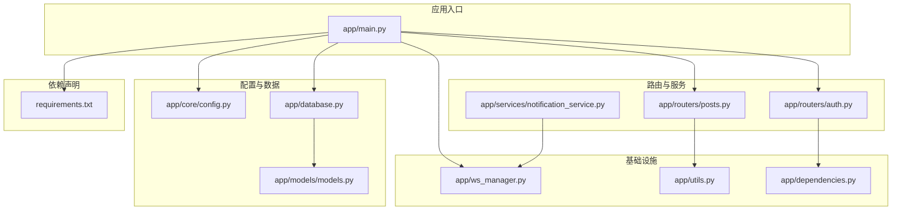
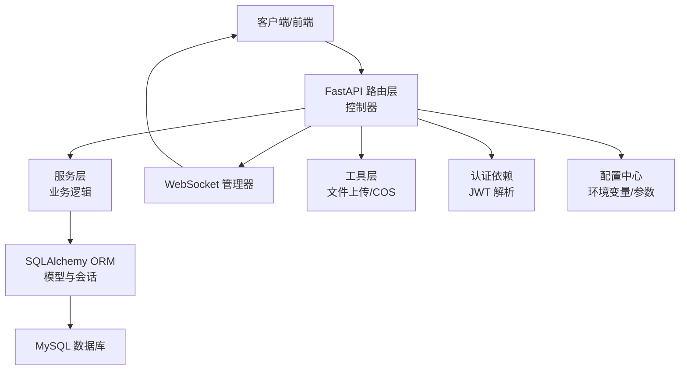
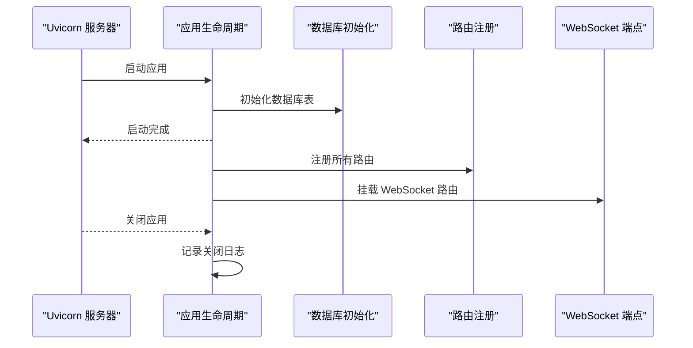
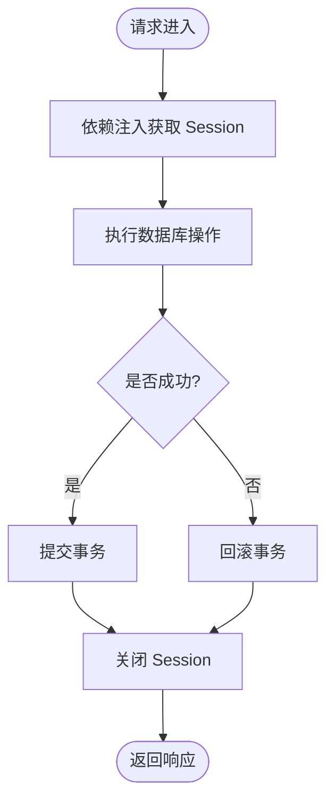
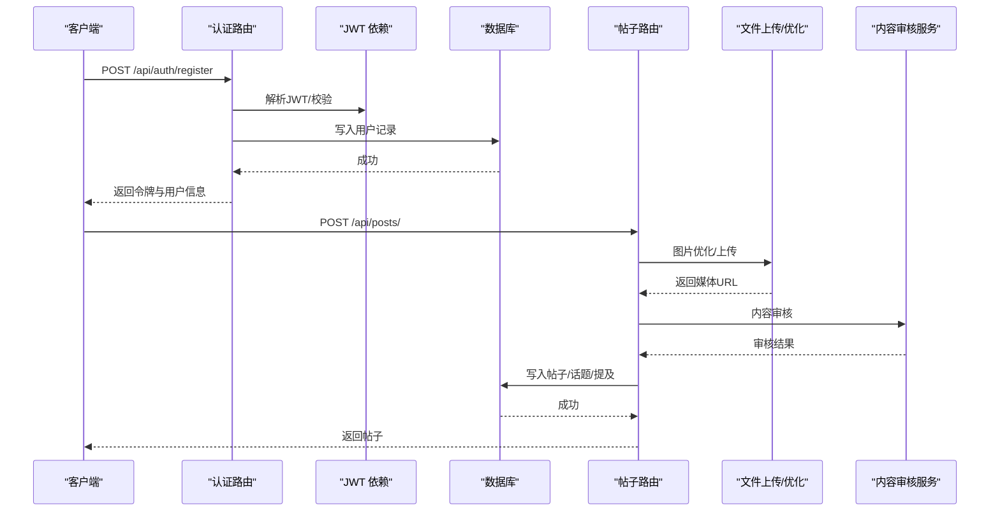
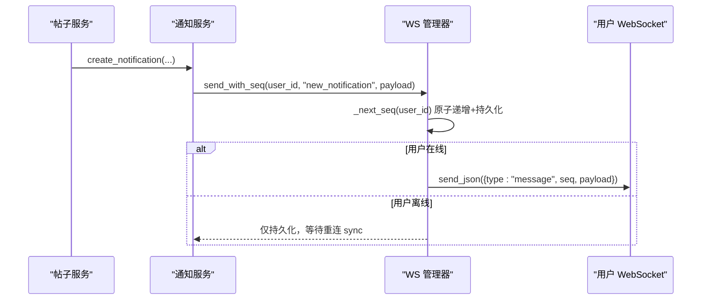
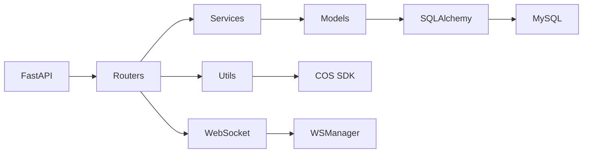

# 架构设计

<cite>
**本文引用的文件**
- [app/main.py](file://app/main.py)
- [app/core/config.py](file://app/core/config.py)
- [app/database.py](file://app/database.py)
- [requirements.txt](file://requirements.txt)
- [app/models/models.py](file://app/models/models.py)
- [app/routers/auth.py](file://app/routers/auth.py)
- [app/routers/posts.py](file://app/routers/posts.py)
- [app/services/notification_service.py](file://app/services/notification_service.py)
- [app/ws_manager.py](file://app/ws_manager.py)
- [app/dependencies.py](file://app/dependencies.py)
- [app/utils.py](file://app/utils.py)
- [error_analysis.md](file://error_analysis.md)
- [openapi.json](file://openapi.json)
</cite>

## 目录
1. [引言](#引言)
2. [项目结构](#项目结构)
3. [核心组件](#核心组件)
4. [架构总览](#架构总览)
5. [详细组件分析](#详细组件分析)
6. [依赖分析](#依赖分析)
7. [性能考量](#性能考量)
8. [故障排查指南](#故障排查指南)
9. [结论](#结论)
10. [附录](#附录)

## 引言
本架构设计文档面向NanTuPy项目，目标是系统化阐述其基于FastAPI的后端架构，覆盖分层架构、模块化设计与MVC思想的落地方式；解释选择FastAPI与异步编程的优势；梳理组件交互、数据流与集成模式；明确技术决策、权衡与约束；给出基础设施与可扩展性建议；并提供系统上下文图与组件分解图。同时，文档亦对当前存在的模型与数据库不一致问题进行风险提示与修复建议，以指导后续演进。

## 项目结构
NanTuPy采用典型的分层与模块化组织方式：
- 应用入口与生命周期：app/main.py负责应用初始化、中间件、路由注册与健康检查。
- 配置层：app/core/config.py集中管理数据库、JWT、上传与云存储等配置。
- 数据访问层：app/database.py封装SQLAlchemy引擎、会话与依赖注入。
- 模型层：app/models/models.py定义ORM模型与关联表。
- 路由层：app/routers/*按功能域划分API端点，体现MVC中的控制器职责。
- 服务层：app/services/*封装业务服务（通知、推荐、内容审核、话题、提及等）。
- WebSocket：app/ws_manager.py提供连接管理、序号与去重机制。
- 工具与依赖：app/utils.py封装文件上传工具；app/dependencies.py提供JWT认证依赖。
- 依赖声明：requirements.txt统一声明第三方库版本。

图表来源
- [app/main.py:1-110](file://app/main.py#L1-L110)
- [app/core/config.py:1-43](file://app/core/config.py#L1-L43)
- [app/database.py:1-38](file://app/database.py#L1-L38)
- [app/models/models.py:1-655](file://app/models/models.py#L1-L655)
- [app/routers/auth.py:1-486](file://app/routers/auth.py#L1-L486)
- [app/routers/posts.py:1-200](file://app/routers/posts.py#L1-L200)
- [app/services/notification_service.py:1-233](file://app/services/notification_service.py#L1-L233)
- [app/ws_manager.py:1-308](file://app/ws_manager.py#L1-L308)
- [app/dependencies.py:1-63](file://app/dependencies.py#L1-L63)
- [app/utils.py:1-220](file://app/utils.py#L1-L220)
- [requirements.txt:1-15](file://requirements.txt#L1-L15)

章节来源
- [app/main.py:1-110](file://app/main.py#L1-L110)
- [requirements.txt:1-15](file://requirements.txt#L1-L15)

## 核心组件
- 应用入口与生命周期
  - 使用FastAPI应用实例，注册CORS与安全HTTP中间件，定义lifespan进行数据库初始化与资源回收。
  - 注册全部路由模块，并挂载WebSocket端点。
- 配置中心
  - 从环境变量读取数据库、JWT、上传与云存储配置，统一管理池化参数与文件限制。
- 数据访问层
  - 基于SQLAlchemy 2.0+同步引擎与Session，提供依赖注入get_db，自动提交/回滚/关闭。
- 模型层
  - 定义用户、帖子、评论、点赞、好友、会话、消息、通知、话题、举报、漫展等模型，含索引与关联表。
- 路由层
  - 按功能域拆分，如认证、帖子、聊天、通知、搜索、话题、上传、推荐、屏蔽、举报、健康检查、管理端、漫画。
- 服务层
  - 通知服务支持异步推送与WebSocket序号机制；内容审核服务提供多策略检测；图像优化与提及服务等。
- WebSocket管理
  - 单例WSManager提供连接池、序号分配、断线补发、ACK去重与会话广播。
- 工具与依赖
  - FileUploader封装腾讯云COS上传；JWT认证依赖提供当前用户解析与可选用户解析、管理员校验。

章节来源
- [app/main.py:29-110](file://app/main.py#L29-L110)
- [app/core/config.py:1-43](file://app/core/config.py#L1-L43)
- [app/database.py:1-38](file://app/database.py#L1-L38)
- [app/models/models.py:1-655](file://app/models/models.py#L1-L655)
- [app/routers/auth.py:1-486](file://app/routers/auth.py#L1-L486)
- [app/routers/posts.py:1-200](file://app/routers/posts.py#L1-L200)
- [app/services/notification_service.py:1-233](file://app/services/notification_service.py#L1-L233)
- [app/ws_manager.py:1-308](file://app/ws_manager.py#L1-L308)
- [app/dependencies.py:1-63](file://app/dependencies.py#L1-L63)
- [app/utils.py:1-220](file://app/utils.py#L1-L220)

## 架构总览
NanTuPy采用分层架构与模块化设计，结合MVC思想：
- 表现层：FastAPI路由模块承担控制器职责，接收请求、调用服务、返回响应。
- 业务层：服务模块封装领域逻辑，如通知、内容审核、推荐、提及等。
- 数据访问层：SQLAlchemy ORM模型与Session依赖，统一数据持久化。
- 基础设施：WebSocket管理器、文件上传工具、JWT认证依赖、配置中心。

图表来源
- [app/main.py:68-84](file://app/main.py#L68-L84)
- [app/routers/auth.py:1-486](file://app/routers/auth.py#L1-L486)
- [app/routers/posts.py:1-200](file://app/routers/posts.py#L1-L200)
- [app/services/notification_service.py:1-233](file://app/services/notification_service.py#L1-L233)
- [app/ws_manager.py:1-308](file://app/ws_manager.py#L1-L308)
- [app/utils.py:1-220](file://app/utils.py#L1-L220)
- [app/dependencies.py:1-63](file://app/dependencies.py#L1-L63)
- [app/core/config.py:1-43](file://app/core/config.py#L1-L43)
- [app/database.py:1-38](file://app/database.py#L1-L38)

## 详细组件分析

### 应用入口与生命周期（FastAPI）
- 生命周期管理：通过lifespan在启动时初始化数据库，在关闭时记录日志。
- 中间件：CORS中间件使用正则允许来源以规避简单请求路径缺陷；HTTP中间件注入COOP/COEP安全头。
- 路由注册：集中include各模块路由，统一前缀与标签；挂载WebSocket端点。
- 健康检查：根路径与独立健康端点返回运行状态。

图表来源
- [app/main.py:29-84](file://app/main.py#L29-L84)
- [app/database.py:35-38](file://app/database.py#L35-L38)

章节来源
- [app/main.py:29-110](file://app/main.py#L29-L110)

### 配置中心（Config）
- 安全密钥与JWT密钥：从环境变量读取，生产需严格管理。
- 数据库连接：支持自定义池化参数与预检，确保连接稳定性。
- 上传与扩展名：统一限制图片/视频扩展名与大小。
- 云存储：腾讯云COS的ID、Key、区域、Bucket、域名等参数。
- 调试与CORS：调试开关与CORS头部。

章节来源
- [app/core/config.py:1-43](file://app/core/config.py#L1-L43)

### 数据访问层（SQLAlchemy）
- 引擎与会话：基于配置创建引擎，使用sessionmaker绑定；get_db依赖注入提供事务控制。
- 初始化：init_db创建所有表，确保Schema一致性。

图表来源
- [app/database.py:22-32](file://app/database.py#L22-L32)

章节来源
- [app/database.py:1-38](file://app/database.py#L1-L38)

### 模型层（ORM）
- 关联表：如post_topics、post_visibility、topic_followers等。
- 主要模型：User、Post、Comment、Like、Friendship、Conversation、Message、Notification、Topic、Block、Report、PostView、SearchHistory、SensitiveWord、Comic系列、WebSocket协议表（WSMessageLog、WSUserSeq、WSAckDedup）。
- 约束与索引：合理使用外键、唯一约束、索引提升查询效率；部分模型包含to_dict序列化方法。

章节来源
- [app/models/models.py:1-655](file://app/models/models.py#L1-L655)

### 路由与服务（认证与帖子）
- 认证路由：注册/登录/刷新/忘记密码/个人资料/隐私设置等，使用依赖注入获取当前用户，JWT校验。
- 帖子路由：支持多图URL、图片上传与优化、视频上传、内容审核、可见性控制、话题与提及处理。

图表来源
- [app/routers/auth.py:184-246](file://app/routers/auth.py#L184-L246)
- [app/routers/posts.py:22-140](file://app/routers/posts.py#L22-L140)
- [app/dependencies.py:16-36](file://app/dependencies.py#L16-L36)
- [app/utils.py:151-187](file://app/utils.py#L151-L187)
- [app/services/content_moderation.py:74-126](file://app/services/content_moderation.py#L74-L126)

章节来源
- [app/routers/auth.py:1-486](file://app/routers/auth.py#L1-L486)
- [app/routers/posts.py:1-200](file://app/routers/posts.py#L1-L200)
- [app/dependencies.py:1-63](file://app/dependencies.py#L1-L63)
- [app/utils.py:1-220](file://app/utils.py#L1-L220)
- [app/services/content_moderation.py:1-200](file://app/services/content_moderation.py#L1-L200)

### 通知服务与WebSocket
- 通知服务：异步推送新通知事件，计算未读数并通过WSManager发送带序号消息。
- WS管理器：单例连接池、会话房间、序号分配（原子递增）、断线补发、ACK去重、广播与原始消息发送。

图表来源
- [app/services/notification_service.py:21-53](file://app/services/notification_service.py#L21-L53)
- [app/ws_manager.py:74-95](file://app/ws_manager.py#L74-L95)
- [app/ws_manager.py:170-212](file://app/ws_manager.py#L170-L212)

章节来源
- [app/services/notification_service.py:1-233](file://app/services/notification_service.py#L1-L233)
- [app/ws_manager.py:1-308](file://app/ws_manager.py#L1-L308)

### 认证与依赖注入
- JWT解码：从HTTP Bearer中提取令牌，校验算法与过期时间，解析用户ID并查询用户。
- 可选用户：当令牌缺失或无效时返回None，便于匿名场景。
- 管理员校验：辅助依赖，确保特定端点仅管理员可用。

章节来源
- [app/dependencies.py:16-63](file://app/dependencies.py#L16-L63)

### 文件上传与云存储
- FileUploader：封装腾讯云COS上传、预签名URL生成、确认上传、删除与文件信息查询。
- 与路由配合：在帖子创建时进行图片优化与上传，支持视频直传。

章节来源
- [app/utils.py:14-220](file://app/utils.py#L14-L220)
- [app/routers/posts.py:54-87](file://app/routers/posts.py#L54-L87)

## 依赖分析
- 技术栈与版本
  - FastAPI 0.115.0、Uvicorn 0.30.0、SQLAlchemy >=2.0.50、PyMySQL 1.1.0、python-jose、passlib[bcrypt]、python-multipart、python-socketio、Pillow >=10.2.0、cos-python-sdk-v5、Pydantic >=2.0、pydantic-settings >=2.0、Werkzeug >=3.0、MarkupSafe >=2.1。
- 外部依赖与集成
  - MySQL数据库：通过SQLAlchemy ORM访问。
  - 腾讯云COS：用于对象存储与CDN加速。
  - WebSocket：基于python-socketio与FastAPI WebSocket路由。
- 组件耦合
  - 路由依赖数据库Session与认证依赖；服务层依赖模型与工具；WS管理器与通知服务耦合紧密。

图表来源
- [requirements.txt:1-15](file://requirements.txt#L1-L15)
- [app/routers/posts.py:1-200](file://app/routers/posts.py#L1-L200)
- [app/utils.py:14-220](file://app/utils.py#L14-L220)
- [app/ws_manager.py:1-308](file://app/ws_manager.py#L1-L308)

章节来源
- [requirements.txt:1-15](file://requirements.txt#L1-L15)

## 性能考量
- 数据库连接池：通过池化参数与pre_ping提升连接稳定性与复用率。
- 异步推送：通知服务在WS推送中采用异步任务，避免阻塞请求线程。
- 序号与去重：WS管理器的序号分配与ACK去重减少重复处理与网络压力。
- 图像优化：在上传前进行压缩与格式优化，降低存储与传输成本。
- 批量加载：推荐服务对帖子批量加载与序列化，减少N+1查询与序列化开销。

## 故障排查指南
- 当前存在的模型与数据库不一致问题（详见错误分析报告）：
  - 会话与消息模型缺少关键列（如Conversation.user1_id/user2_id/last_message_at、Message.is_read/media_url/related_id、Notification.title/related_id/type），导致路由调用时报错。
  - 多个模型缺少to_dict()方法，导致序列化失败。
  - 搜索模块中db.case()用法错误，应使用SQLAlchemy的case。
  - 部分测试脚本与路由路径不匹配，需统一。
- 修复优先级建议：
  - 高优先级：修正7个模型的列定义与名称映射，补齐to_dict()方法。
  - 中优先级：修复代码逻辑（如Comment.to_dict参数、db.case用法、测试脚本与路由路径统一）。
- 建议在修复后补充自动化测试与OpenAPI文档校验，防止回归。

章节来源
- [error_analysis.md:196-275](file://error_analysis.md#L196-L275)

## 结论
NanTuPy采用清晰的分层与模块化架构，结合FastAPI的高性能与Pydantic的强类型校验，具备良好的可维护性与扩展性。WebSocket与通知服务体现了实时通信能力。当前阶段需优先解决模型与数据库不一致问题，完善序列化与逻辑细节，以保障核心功能稳定运行。后续可在监控、日志聚合、缓存与CDN优化等方面进一步增强。

## 附录
- OpenAPI文档：可通过openapi.json查看接口规范与示例。
- 部署拓扑建议（概念性）：
  - 应用层：多实例部署，使用Uvicorn运行多个worker。
  - 负载均衡：Nginx/反向代理，启用COOP/COEP头透传。
  - 数据库：主从复制与只读副本，连接池参数按峰值QPS调整。
  - 对象存储：COS作为静态资源存储与CDN加速。
  - 实时通信：WebSocket长连接，WSManager单例与去重机制保证可靠性。

章节来源
- [openapi.json](file://openapi.json)