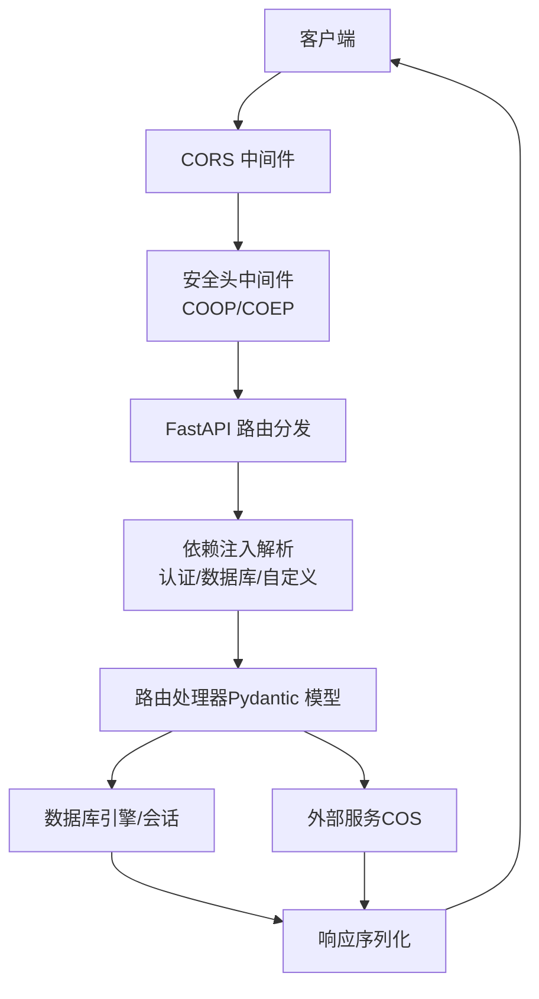
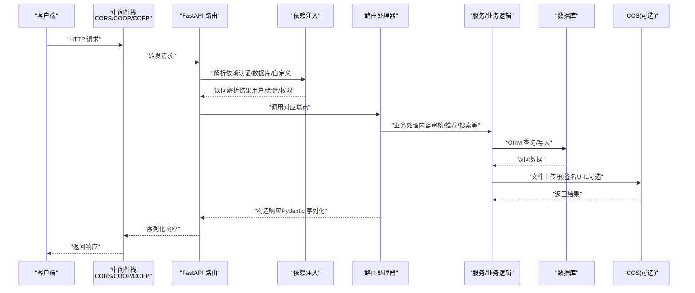
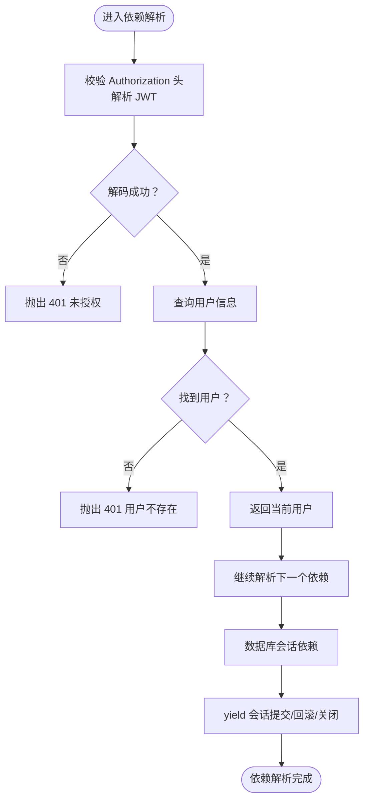
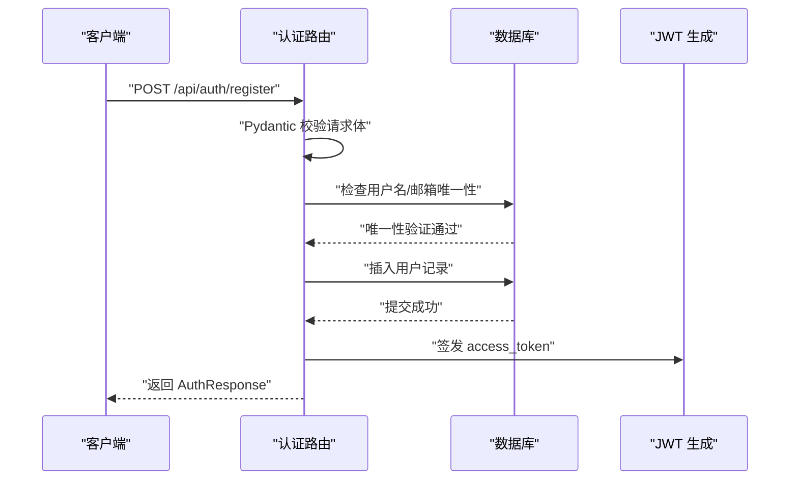
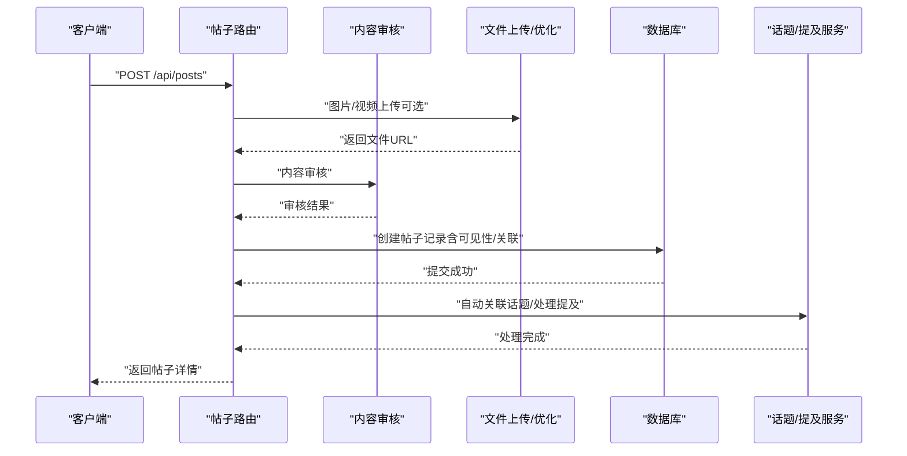
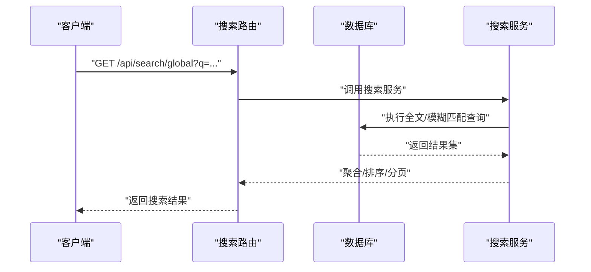
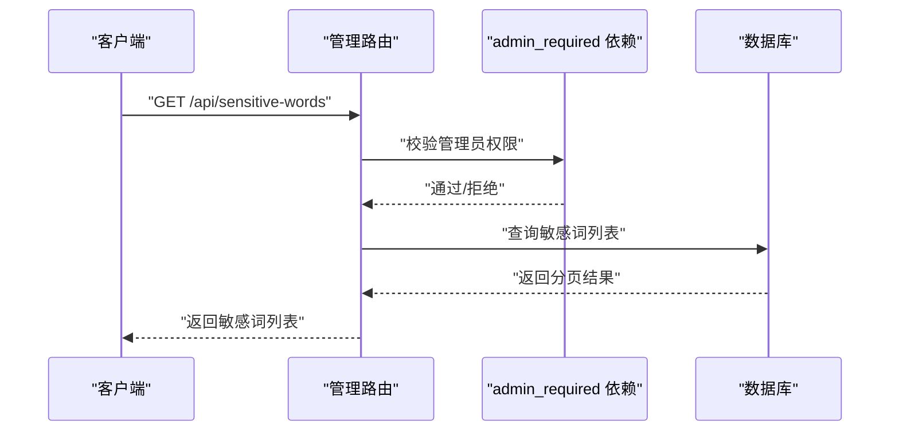
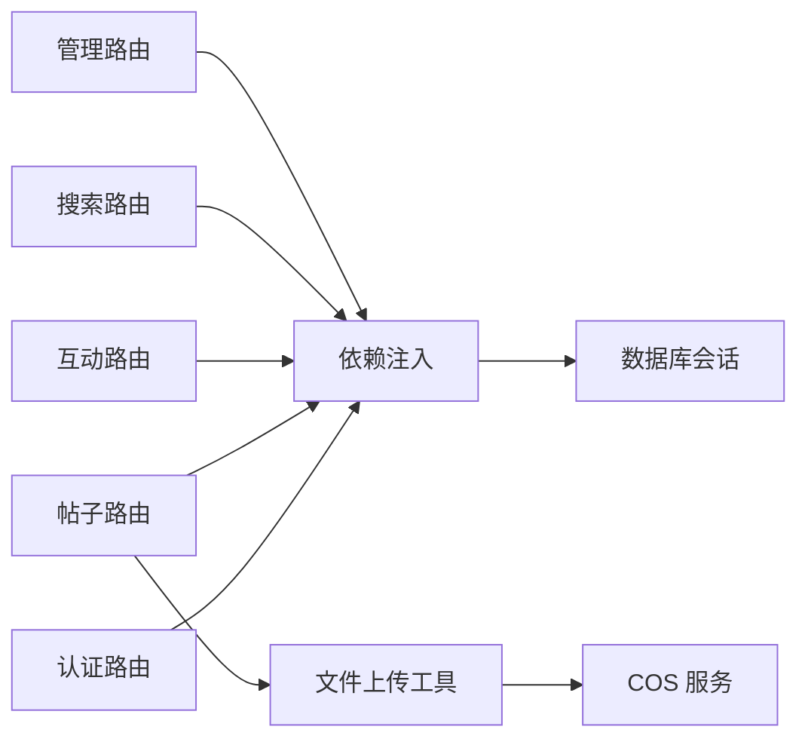

# HTTP请求处理流程

<cite>
**本文档引用的文件**
- [app/main.py](file://app/main.py)
- [app/dependencies.py](file://app/dependencies.py)
- [app/database.py](file://app/database.py)
- [app/core/config.py](file://app/core/config.py)
- [app/routers/auth.py](file://app/routers/auth.py)
- [app/routers/posts.py](file://app/routers/posts.py)
- [app/routers/interactions.py](file://app/routers/interactions.py)
- [app/routers/search.py](file://app/routers/search.py)
- [app/routers/health.py](file://app/routers/health.py)
- [app/routers/admin.py](file://app/routers/admin.py)
- [app/models/models.py](file://app/models/models.py)
- [app/utils.py](file://app/utils.py)
</cite>

## 目录
1. [简介](#简介)
2. [项目结构](#项目结构)
3. [核心组件](#核心组件)
4. [架构总览](#架构总览)
5. [详细组件分析](#详细组件分析)
6. [依赖关系分析](#依赖关系分析)
7. [性能考量](#性能考量)
8. [故障排查指南](#故障排查指南)
9. [结论](#结论)

## 简介
本文件系统性梳理 NanTuPy 项目的 HTTP 请求处理流程，覆盖从客户端请求进入、路由分发、依赖注入解析、参数验证与序列化、数据库交互到响应返回的完整链路。重点说明：
- FastAPI 路由注册机制（前缀、标签分类、端点映射）
- 依赖注入体系（认证、数据库连接、自定义依赖）
- 请求参数验证、数据序列化与响应格式化
- 中间件执行顺序与 CORS 配置影响
- 典型 API 调用时序图，展示请求如何经由各组件最终到达数据库或外部服务

## 项目结构
NanTuPy 采用 FastAPI 核心，按功能模块组织路由，统一通过应用入口集中注册。核心目录与职责概览：
- app/main.py：应用入口、生命周期管理、CORS 与安全头中间件、路由注册
- app/routers/*：按领域划分的 API 路由模块
- app/dependencies.py：认证与权限依赖（JWT 解析、数据库会话）
- app/database.py：数据库引擎与会话工厂
- app/core/config.py：配置中心（数据库、JWT、COS 等）
- app/models/models.py：ORM 模型定义
- app/utils.py：工具类（文件上传、COS 操作等）

图表来源
- [app/main.py:46-84](file://app/main.py#L46-L84)
- [app/dependencies.py:16-62](file://app/dependencies.py#L16-L62)
- [app/database.py:22-32](file://app/database.py#L22-L32)

章节来源
- [app/main.py:1-110](file://app/main.py#L1-L110)

## 核心组件
- 应用入口与生命周期
  - 使用异步生命周期管理初始化数据库，确保服务启动与关闭时的资源一致性
  - 注册 CORS 中间件与安全头中间件，保障跨域与共享内存策略合规
- 路由注册机制
  - 通过 include_router 为每个模块设置统一前缀与标签，便于 OpenAPI 分类与路由管理
  - WebSocket 端点单独注册
- 依赖注入系统
  - 认证依赖：从 Authorization 头解析 JWT，解码并查询用户
  - 数据库依赖：提供 Session 工厂，自动提交/回滚/关闭
  - 自定义依赖：可选用户、管理员权限校验等
- 请求处理与响应
  - 使用 Pydantic 模型进行请求体与响应体的自动验证与序列化
  - 业务层调用服务模块（如内容审核、文件上传、推荐等），必要时访问外部服务（COS）

章节来源
- [app/main.py:29-84](file://app/main.py#L29-L84)
- [app/dependencies.py:16-62](file://app/dependencies.py#L16-L62)
- [app/database.py:22-32](file://app/database.py#L22-L32)

## 架构总览
下图展示一次典型请求从进入应用到返回的端到端流程，包含中间件、依赖解析、路由处理与外部集成。

图表来源
- [app/main.py:46-84](file://app/main.py#L46-L84)
- [app/dependencies.py:16-62](file://app/dependencies.py#L16-L62)
- [app/routers/posts.py:22-140](file://app/routers/posts.py#L22-L140)
- [app/utils.py:14-220](file://app/utils.py#L14-L220)

## 详细组件分析

### 路由注册与前缀/标签/端点映射
- 统一前缀与标签
  - 认证：/api/auth（标签：Auth）
  - 帖子：/api/posts（标签：Posts）
  - 互动：/api（标签：Interactions）
  - 搜索：/api/search（标签：Search）
  - 健康检查：根路径（标签：Health）
  - 管理员：根路径（标签：Admin）
  - WebSocket：/ws
- 端点映射示例
  - 认证：POST /api/auth/register、POST /api/auth/login、GET /api/auth/me 等
  - 帖子：POST /api/posts、GET /api/posts、GET /api/posts/user/{user_id}
  - 互动：POST /api/posts/{post_id}/like、POST /api/posts/{post_id}/comments 等
  - 搜索：GET /api/search/users、GET /api/search/global 等

章节来源
- [app/main.py:68-84](file://app/main.py#L68-L84)
- [app/routers/auth.py:184-246](file://app/routers/auth.py#L184-L246)
- [app/routers/posts.py:22-186](file://app/routers/posts.py#L22-L186)
- [app/routers/interactions.py:54-200](file://app/routers/interactions.py#L54-L200)
- [app/routers/search.py:17-90](file://app/routers/search.py#L17-L90)

### 依赖注入系统
- 认证依赖
  - 从 Authorization 头提取 Bearer Token，使用配置中的密钥解码
  - 解析出用户标识后查询数据库，返回当前用户对象；失败抛出 401
- 可选用户依赖
  - 当请求头缺失或无效时返回 None，用于匿名场景
- 管理员权限依赖
  - 基于当前用户判断是否管理员，非管理员抛出 403
- 数据库依赖
  - 提供 Session 工厂，yield 会话；异常时回滚，finally 关闭连接
  - 生命周期内自动提交成功事务

图表来源
- [app/dependencies.py:16-62](file://app/dependencies.py#L16-L62)
- [app/database.py:22-32](file://app/database.py#L22-L32)

章节来源
- [app/dependencies.py:16-62](file://app/dependencies.py#L16-L62)
- [app/database.py:22-32](file://app/database.py#L22-L32)

### 请求参数验证、数据序列化与响应格式化
- 参数验证
  - 使用 Pydantic 模型对请求体进行字段级验证与转换（如用户名、邮箱、密码强度、可见性等）
  - 查询参数使用 Query 进行范围与默认值约束
- 数据序列化
  - 路由处理器返回 Pydantic 模型或字典，FastAPI 自动序列化为 JSON
  - 模型提供 to_dict 方法以适配不同视图（如公开用户信息）
- 响应格式化
  - 统一包装响应结构（如 AuthResponse、带分页的列表），便于前端消费

章节来源
- [app/routers/auth.py:36-150](file://app/routers/auth.py#L36-L150)
- [app/routers/posts.py:22-140](file://app/routers/posts.py#L22-L140)
- [app/models/models.py:86-98](file://app/models/models.py#L86-L98)

### 中间件执行顺序与 CORS 配置
- 中间件顺序
  1) CORS 中间件：处理跨域请求，避免简单请求路径中 origin 与 credentials 冲突
  2) 安全头中间件：设置 COOP/COEP，满足 Flutter Web 的 SharedArrayBuffer 需求
  3) 路由分发与依赖解析
- CORS 配置要点
  - 使用正则允许任意来源，避免 "*" 与 credentials 冲突
  - 允许方法与头部为通配，暴露必要头部

章节来源
- [app/main.py:46-66](file://app/main.py#L46-L66)

### 典型 API 调用时序图

#### 注册流程（认证模块）

图表来源
- [app/routers/auth.py:184-212](file://app/routers/auth.py#L184-L212)

#### 发布帖子流程（帖子模块）

图表来源
- [app/routers/posts.py:22-140](file://app/routers/posts.py#L22-L140)
- [app/utils.py:14-220](file://app/utils.py#L14-L220)

#### 搜索流程（搜索模块）

图表来源
- [app/routers/search.py:50-66](file://app/routers/search.py#L50-L66)

#### 管理员敏感词管理（管理模块）

图表来源
- [app/routers/admin.py:14-33](file://app/routers/admin.py#L14-L33)
- [app/dependencies.py:53-62](file://app/dependencies.py#L53-L62)

## 依赖关系分析
- 组件耦合与内聚
  - 路由模块仅依赖依赖注入与数据库会话，保持高内聚低耦合
  - 业务服务通过工具类与外部服务交互，避免在路由层直接耦合第三方
- 直接与间接依赖
  - 路由 → 依赖注入 → 数据库会话
  - 路由 → 业务服务 → 数据库/外部服务
- 外部依赖
  - 数据库：SQLAlchemy 引擎与 Session
  - 文件存储：腾讯云 COS（通过工具类封装）
  - 安全：JWT 解码与校验

图表来源
- [app/routers/auth.py:184-246](file://app/routers/auth.py#L184-L246)
- [app/routers/posts.py:22-140](file://app/routers/posts.py#L22-L140)
- [app/dependencies.py:16-62](file://app/dependencies.py#L16-L62)
- [app/database.py:22-32](file://app/database.py#L22-L32)
- [app/utils.py:14-220](file://app/utils.py#L14-L220)

章节来源
- [app/routers/auth.py:184-246](file://app/routers/auth.py#L184-L246)
- [app/routers/posts.py:22-140](file://app/routers/posts.py#L22-L140)
- [app/dependencies.py:16-62](file://app/dependencies.py#L16-L62)
- [app/database.py:22-32](file://app/database.py#L22-L32)
- [app/utils.py:14-220](file://app/utils.py#L14-L220)

## 性能考量
- 数据库连接池
  - 通过引擎选项配置池大小、溢出与回收策略，结合 pre_ping 降低连接失效风险
- 批量查询与 N+1 避免
  - 互动路由提供批量 enrichment，减少多次查询
- 文件上传与优化
  - 图片上传前进行优化，控制体积与格式，降低存储与传输成本
- 缓存与去重
  - WebSocket 协议表设计支持断线补发与 ACK 去重，提升可靠性

章节来源
- [app/core/config.py:12-20](file://app/core/config.py#L12-L20)
- [app/routers/interactions.py:26-48](file://app/routers/interactions.py#L26-L48)
- [app/routers/posts.py:59-78](file://app/routers/posts.py#L59-L78)

## 故障排查指南
- 认证失败（401）
  - 检查 Authorization 头是否为 Bearer Token
  - 核对 JWT 密钥与算法配置
  - 确认用户是否存在且未被禁用
- 权限不足（403）
  - 管理员接口需通过 admin_required 依赖
- 数据库错误
  - 查看生命周期初始化日志与异常回滚
  - 检查连接池配置与超时设置
- 文件上传失败
  - 检查 COS 配置与网络连通性
  - 确认文件类型与大小限制
- CORS 问题
  - 确认 allow_origin_regex 设置与浏览器凭证使用

章节来源
- [app/dependencies.py:25-36](file://app/dependencies.py#L25-L36)
- [app/dependencies.py:57-62](file://app/dependencies.py#L57-L62)
- [app/main.py:46-66](file://app/main.py#L46-L66)
- [app/utils.py:14-220](file://app/utils.py#L14-L220)

## 结论
NanTuPy 的 HTTP 请求处理链路清晰、模块化程度高，借助 FastAPI 的路由与依赖注入机制实现了强类型验证与自动文档生成。通过合理的中间件配置、数据库连接池与外部服务封装，系统在安全性、可维护性与性能之间取得良好平衡。建议在生产环境中进一步完善日志与监控、参数限流与熔断策略，并持续优化热点查询与批处理逻辑。