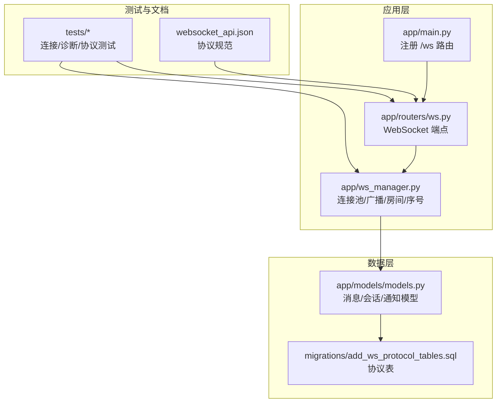
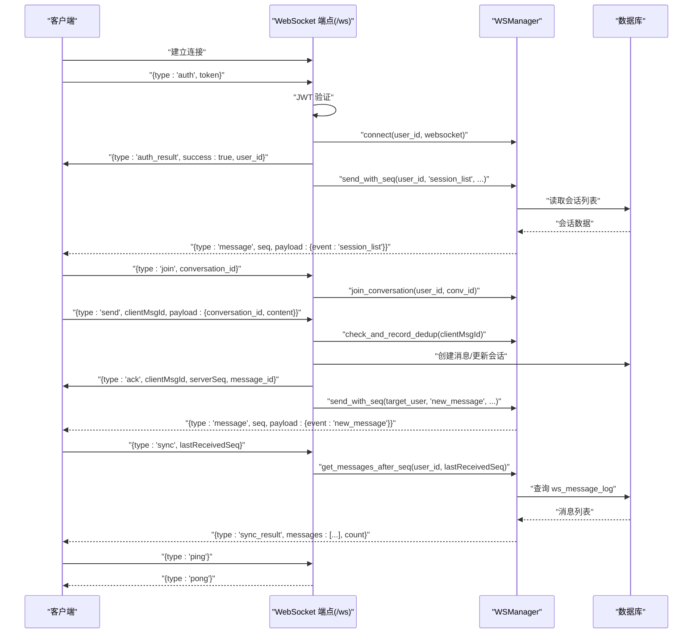
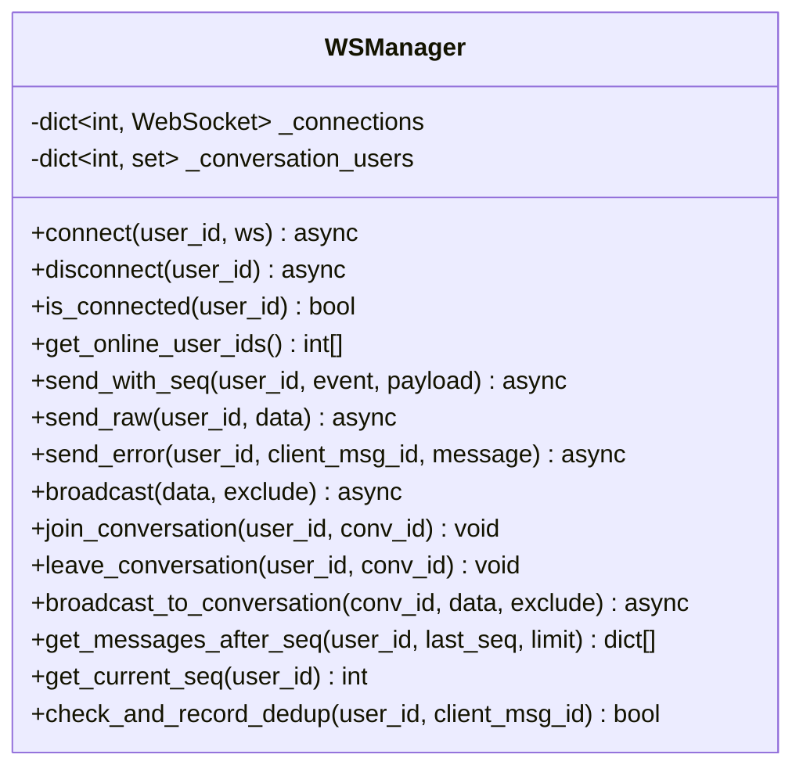
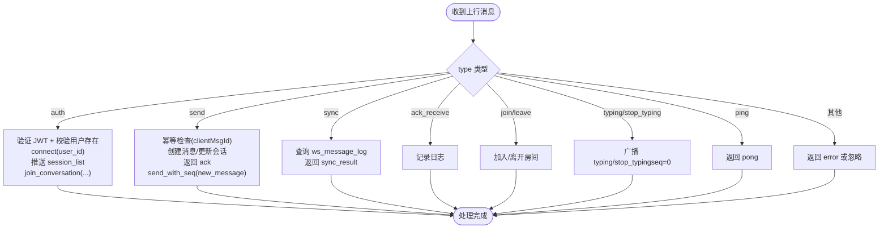
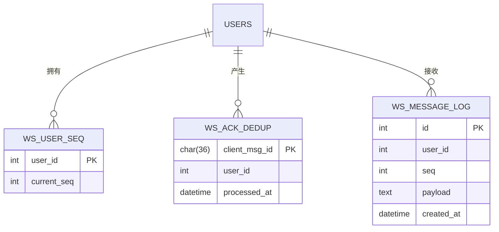
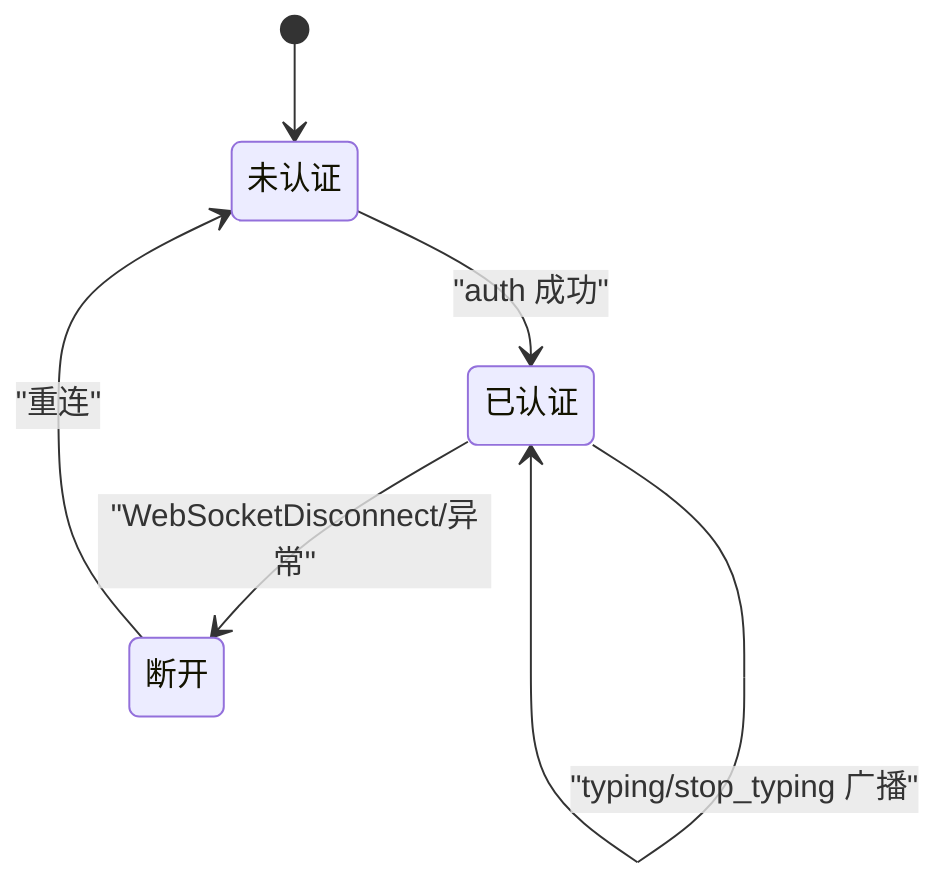
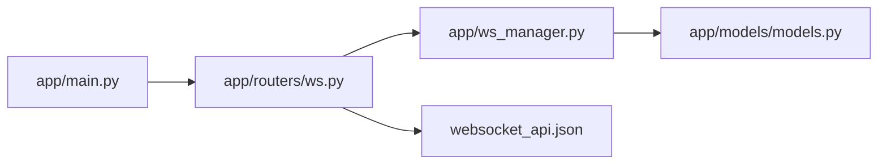

# WebSocket通信机制

<cite>
**本文档引用的文件**
- [app/ws_manager.py](file://app/ws_manager.py)
- [app/routers/ws.py](file://app/routers/ws.py)
- [app/models/models.py](file://app/models/models.py)
- [migrations/add_ws_protocol_tables.sql](file://migrations/add_ws_protocol_tables.sql)
- [app/main.py](file://app/main.py)
- [websocket_api.json](file://websocket_api.json)
- [tests/test_ws_connect.py](file://tests/test_ws_connect.py)
- [tests/diagnose_websocket.py](file://tests/diagnose_websocket.py)
- [tests/test_websocket.py](file://tests/test_websocket.py)
</cite>

## 目录
1. [简介](#简介)
2. [项目结构](#项目结构)
3. [核心组件](#核心组件)
4. [架构总览](#架构总览)
5. [详细组件分析](#详细组件分析)
6. [依赖关系分析](#依赖关系分析)
7. [性能考虑](#性能考虑)
8. [故障排查指南](#故障排查指南)
9. [结论](#结论)
10. [附录](#附录)

## 简介
本文件系统性阐述 NanTuPy 项目的 WebSocket 通信机制，覆盖连接建立、认证、心跳保活、消息广播、房间管理、断线补发、ACK 去重与状态同步等全流程。文档同时对比 WebSocket 与 HTTP 请求处理的差异与协作方式，给出连接池管理、异常恢复策略及可视化时序图与状态转换图，帮助开发者快速理解并高效集成实时通信功能。

## 项目结构
WebSocket 相关代码主要分布在以下模块：
- WebSocket 管理器：app/ws_manager.py（连接池、消息序号、广播、房间管理、断线补发、ACK 去重）
- WebSocket 端点：app/routers/ws.py（认证、消息处理、房间广播、会话列表推送）
- 数据模型与协议表：app/models/models.py（消息日志、用户序号、ACK 去重）
- 数据库迁移：migrations/add_ws_protocol_tables.sql（协议表结构）
- 应用入口：app/main.py（注册 WebSocket 路由）
- API 文档：websocket_api.json（协议规范、消息格式、事件类型）
- 测试与诊断：tests/test_ws_connect.py、tests/diagnose_websocket.py、tests/test_websocket.py

**图表来源**
- [app/main.py:84](file://app/main.py#L84)
- [app/routers/ws.py:434](file://app/routers/ws.py#L434)
- [app/ws_manager.py:20](file://app/ws_manager.py#L20)
- [app/models/models.py:625](file://app/models/models.py#L625)
- [migrations/add_ws_protocol_tables.sql:1](file://migrations/add_ws_protocol_tables.sql#L1)

**章节来源**
- [app/main.py:84](file://app/main.py#L84)
- [app/routers/ws.py:434](file://app/routers/ws.py#L434)
- [app/ws_manager.py:20](file://app/ws_manager.py#L20)
- [app/models/models.py:625](file://app/models/models.py#L625)
- [migrations/add_ws_protocol_tables.sql:1](file://migrations/add_ws_protocol_tables.sql#L1)

## 核心组件
- WebSocket 管理器（WSManager）
  - 单例连接池：user_id → WebSocket
  - 房间管理：conversation_id → set of user_ids
  - 序号系统：原子递增用户序号，持久化消息日志，支持断线补发
  - ACK 去重：基于 clientMsgId 的幂等检查（24h 清理）
  - 广播：对全体在线用户或会话房间广播
- WebSocket 端点（/ws）
  - 认证：JWT HS256 验证，绑定 user_id
  - 业务消息：send（含幂等）、sync（断线补发）、ack_receive、join/leave（房间）、typing/stop_typing
  - 自动推送：认证后推送 session_list，加入会话房间自动加入广播
- 数据模型与协议表
  - ws_message_log：持久化消息日志（(user_id, seq) 唯一索引）
  - ws_user_seq：每用户序号计数器
  - ws_ack_dedup：ACK 去重（client_msg_id 主键）

**章节来源**
- [app/ws_manager.py:20](file://app/ws_manager.py#L20)
- [app/routers/ws.py:182](file://app/routers/ws.py#L182)
- [app/models/models.py:625](file://app/models/models.py#L625)
- [migrations/add_ws_protocol_tables.sql:1](file://migrations/add_ws_protocol_tables.sql#L1)

## 架构总览
WebSocket 采用“原生 WebSocket + 序号协议”的设计，所有下行推送统一使用 {type: "message", seq, payload} 信封，客户端维护 lastReceivedSeq，断线重连时通过 sync 补发遗漏消息。上行消息通过 type 字段区分，payload.event 决定具体业务逻辑。

**图表来源**
- [app/routers/ws.py:446](file://app/routers/ws.py#L446)
- [app/routers/ws.py:182](file://app/routers/ws.py#L182)
- [app/ws_manager.py:74](file://app/ws_manager.py#L74)
- [app/ws_manager.py:214](file://app/ws_manager.py#L214)

**章节来源**
- [websocket_api.json:47](file://websocket_api.json#L47)
- [app/routers/ws.py:446](file://app/routers/ws.py#L446)
- [app/ws_manager.py:74](file://app/ws_manager.py#L74)

## 详细组件分析

### WebSocket 管理器（WSManager）
- 连接池与状态
  - connect(user_id, ws)：若同一用户已有连接，旧连接被关闭（code=1000），新连接接管
  - disconnect(user_id)：移除连接并从所有房间移除
  - is_connected(user_id)/get_online_user_ids()：查询在线状态与在线列表
- 消息发送与序号系统
  - send_with_seq(user_id, event, payload)：分配 seq，写入 ws_message_log，若在线则推送；离线则持久化等待 sync 补发
  - send_raw(user_id, data)：直接发送（非序号消息，如 auth_result、ack、sync_result、pong）
  - send_error(user_id, client_msg_id, message)：错误通知
  - _raw_send(user_id, data)：内部发送，异常时断开连接
  - broadcast(data, exclude)：对所有在线用户广播
- 房间管理
  - join_conversation(user_id, conversation_id)：加入会话房间
  - leave_conversation(user_id, conversation_id)：离开会话房间
  - broadcast_to_conversation(conversation_id, data, exclude)：向房间内在线用户广播（typing/stop_typing）
- 序号系统（核心）
  - _next_seq(user_id, payload)：原子递增 current_seq，写入 ws_message_log，返回新序号；失败时降级为 send_raw
  - get_messages_after_seq(user_id, last_received_seq, limit)：查询 seq > lastReceivedSeq 的消息
  - get_current_seq(user_id)：获取当前最大序号
- ACK 去重
  - check_and_record_dedup(user_id, client_msg_id)：基于 client_msg_id 去重，同时清理 24h 前记录

**图表来源**
- [app/ws_manager.py:20](file://app/ws_manager.py#L20)

**章节来源**
- [app/ws_manager.py:45](file://app/ws_manager.py#L45)
- [app/ws_manager.py:107](file://app/ws_manager.py#L107)
- [app/ws_manager.py:158](file://app/ws_manager.py#L158)
- [app/ws_manager.py:170](file://app/ws_manager.py#L170)
- [app/ws_manager.py:265](file://app/ws_manager.py#L265)

### WebSocket 端点（/ws）
- 认证流程
  - auth：验证 JWT，校验用户存在，绑定连接，推送 session_list，自动加入既有会话房间
- 业务消息处理
  - send：幂等检查（clientMsgId），创建消息，返回 ack，向目标用户推送 new_message
  - sync：返回 seq > lastReceivedSeq 的消息列表
  - ack_receive：记录日志（可选）
  - join/leave：房间加入/离开
  - typing/stop_typing：向房间广播（seq=0，非持久化）
  - conversation_read/notifications_read：特殊 payload 事件路由
- 心跳与错误
  - ping/pong：客户端定时发送，服务端立即回复
  - 未认证状态拒绝业务消息
  - 异常捕获：WebSocketDisconnect 与通用异常均触发断开

**图表来源**
- [app/routers/ws.py:446](file://app/routers/ws.py#L446)
- [app/routers/ws.py:215](file://app/routers/ws.py#L215)
- [app/routers/ws.py:317](file://app/routers/ws.py#L317)
- [app/routers/ws.py:375](file://app/routers/ws.py#L375)
- [app/routers/ws.py:361](file://app/routers/ws.py#L361)
- [app/routers/ws.py:481](file://app/routers/ws.py#L481)

**章节来源**
- [app/routers/ws.py:182](file://app/routers/ws.py#L182)
- [app/routers/ws.py:215](file://app/routers/ws.py#L215)
- [app/routers/ws.py:317](file://app/routers/ws.py#L317)
- [app/routers/ws.py:361](file://app/routers/ws.py#L361)
- [app/routers/ws.py:481](file://app/routers/ws.py#L481)

### 数据模型与协议表
- WSMessageLog：持久化消息日志，(user_id, seq) 唯一约束，支持断线补发
- WSUserSeq：每用户序号计数器，原子递增
- WSAckDedup：ACK 去重表，client_msg_id 主键，定期清理 24h 前记录

**图表来源**
- [app/models/models.py:625](file://app/models/models.py#L625)
- [app/models/models.py:640](file://app/models/models.py#L640)
- [app/models/models.py:648](file://app/models/models.py#L648)
- [migrations/add_ws_protocol_tables.sql:4](file://migrations/add_ws_protocol_tables.sql#L4)
- [migrations/add_ws_protocol_tables.sql:15](file://migrations/add_ws_protocol_tables.sql#L15)
- [migrations/add_ws_protocol_tables.sql:21](file://migrations/add_ws_protocol_tables.sql#L21)

**章节来源**
- [app/models/models.py:625](file://app/models/models.py#L625)
- [migrations/add_ws_protocol_tables.sql:1](file://migrations/add_ws_protocol_tables.sql#L1)

### 连接状态转换图

**图表来源**
- [app/routers/ws.py:446](file://app/routers/ws.py#L446)
- [app/routers/ws.py:530](file://app/routers/ws.py#L530)
- [app/routers/ws.py:481](file://app/routers/ws.py#L481)

## 依赖关系分析
- 应用入口注册 /ws 路由
- WebSocket 端点依赖 WSManager 提供连接池、广播、房间、序号与去重能力
- WSManager 依赖数据库模型与会话/消息/通知等业务模块
- 协议规范来自 websocket_api.json，指导消息格式与事件类型

**图表来源**
- [app/main.py:84](file://app/main.py#L84)
- [app/routers/ws.py:16](file://app/routers/ws.py#L16)
- [app/ws_manager.py:15](file://app/ws_manager.py#L15)
- [websocket_api.json:47](file://websocket_api.json#L47)

**章节来源**
- [app/main.py:84](file://app/main.py#L84)
- [app/routers/ws.py:16](file://app/routers/ws.py#L16)
- [websocket_api.json:47](file://websocket_api.json#L47)

## 性能考虑
- 连接池管理
  - 单用户多连接时自动关闭旧连接，避免资源泄露
  - 批量广播时捕获异常并断开失效连接，减少阻塞
- 序号系统
  - 原子递增与持久化确保消息顺序与可靠性，避免重复投递
  - sync 限制返回数量（默认 200），防止一次性拉取过多
- ACK 去重
  - 24h TTL 清理，控制去重表大小，降低存储压力
- 心跳保活
  - 建议 30s 间隔 ping/pong，平衡保活与网络开销

[本节为通用性能讨论，无需特定文件分析]

## 故障排查指南
- 连接与认证
  - 无效或过期 JWT：服务端以 code=4001 关闭连接
  - 重复连接：旧连接被关闭（code=1000）
  - 未认证发送业务消息：返回 error 并拒绝
- 断线与补发
  - 使用 sync(lastReceivedSeq) 补发遗漏消息
  - 若 _next_seq 失败，降级为 send_raw（无序号）
- 幂等与去重
  - 重复 clientMsgId：返回 duplicate=true 的 ack
- 诊断工具
  - tests/diagnose_websocket.py：检查服务器运行、端口监听、WebSocket 端点可达性
  - tests/test_ws_connect.py：端到端验证 auth/ping/sync/send/idempotency
  - tests/test_websocket.py：Socket.IO 连接测试（便于前端调试）

**章节来源**
- [app/routers/ws.py:454](file://app/routers/ws.py#L454)
- [app/routers/ws.py:530](file://app/routers/ws.py#L530)
- [app/ws_manager.py:87](file://app/ws_manager.py#L87)
- [app/ws_manager.py:265](file://app/ws_manager.py#L265)
- [tests/diagnose_websocket.py:12](file://tests/diagnose_websocket.py#L12)
- [tests/test_ws_connect.py:179](file://tests/test_ws_connect.py#L179)
- [tests/test_websocket.py](file://tests/test_websocket.py#L1)

## 结论
NanTuPy 的 WebSocket 通信机制以“原生 WebSocket + 序号协议”为核心，结合连接池、房间广播、序号系统与 ACK 去重，实现了高可靠、可扩展的实时通信。通过 sync 补发与心跳保活，系统在弱网与断线场景下仍能保证消息完整性与用户体验。配合完善的测试与诊断工具，开发者可快速定位问题并稳定集成。

[本节为总结性内容，无需特定文件分析]

## 附录

### WebSocket 与 HTTP 的区别与联系
- 区别
  - 通信模式：WebSocket 为双向长连接，HTTP 为请求-响应短连接
  - 认证：WebSocket 在连接后通过 auth 消息认证；HTTP 通过 Authorization 头或 Cookie
  - 消息类型：WebSocket 使用 type 字段区分；HTTP 使用 RESTful 路径与方法
- 联系
  - JWT 认证算法一致（HS256）
  - 业务一致性：HTTP 发送消息（如 POST /api/chat/conversations/{id}/messages）同样触发 WS 推送 new_message
  - 状态同步：HTTP 标记已读（/mark-read）通过 WS 推送 conversation_read

**章节来源**
- [websocket_api.json:556](file://websocket_api.json#L556)
- [app/routers/ws.py:385](file://app/routers/ws.py#L385)

### 消息格式与事件类型
- 上行消息（客户端 → 服务端）
  - auth、send、sync、ack_receive、ping、join、leave、typing、stop_typing
- 下行消息（服务端 → 客户端）
  - auth_result、message（带序号信封）、ack、sync_result、pong、error
- 事件类型（payload.event）
  - new_message、session_list、typing、stop_typing、message_read、conversation_read、new_notification

**章节来源**
- [websocket_api.json:82](file://websocket_api.json#L82)
- [websocket_api.json:199](file://websocket_api.json#L199)
- [websocket_api.json:218](file://websocket_api.json#L218)