# 依赖注入系统

<cite>
**本文档引用的文件**
- [app/main.py](file://app/main.py)
- [app/dependencies.py](file://app/dependencies.py)
- [app/database.py](file://app/database.py)
- [app/core/config.py](file://app/core/config.py)
- [app/routers/auth.py](file://app/routers/auth.py)
- [app/routers/ws.py](file://app/routers/ws.py)
- [app/models/models.py](file://app/models/models.py)
- [app/services/content_filter.py](file://app/services/content_filter.py)
</cite>

## 目录
1. [简介](#简介)
2. [项目结构](#项目结构)
3. [核心组件](#核心组件)
4. [架构概览](#架构概览)
5. [详细组件分析](#详细组件分析)
6. [依赖关系分析](#依赖关系分析)
7. [性能考量](#性能考量)
8. [故障排除指南](#故障排除指南)
9. [结论](#结论)

## 简介

NanTuPy项目采用FastAPI框架构建，实现了完整的依赖注入系统。该系统通过依赖注入机制实现了数据库连接管理、用户认证、配置管理和业务逻辑封装，为整个应用提供了清晰的架构分离和良好的可维护性。

依赖注入系统的核心价值在于：
- **解耦合**：路由处理器、服务类和WebSocket端点通过依赖注入实现松耦合
- **可测试性**：易于模拟和替换依赖项进行单元测试
- **资源管理**：自动化的数据库连接生命周期管理
- **安全性**：统一的认证和授权机制

## 项目结构

NanTuPy项目的依赖注入系统围绕以下核心文件组织：

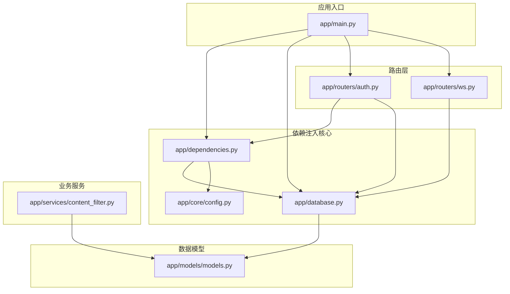

**图表来源**
- [app/main.py:1-110](file://app/main.py#L1-L110)
- [app/dependencies.py:1-63](file://app/dependencies.py#L1-L63)
- [app/database.py:1-38](file://app/database.py#L1-L38)

**章节来源**
- [app/main.py:1-110](file://app/main.py#L1-L110)
- [app/dependencies.py:1-63](file://app/dependencies.py#L1-L63)
- [app/database.py:1-38](file://app/database.py#L1-L38)

## 核心组件

### 数据库连接依赖

数据库连接是NanTuPy依赖注入系统的基础组件，通过`get_db`函数实现：

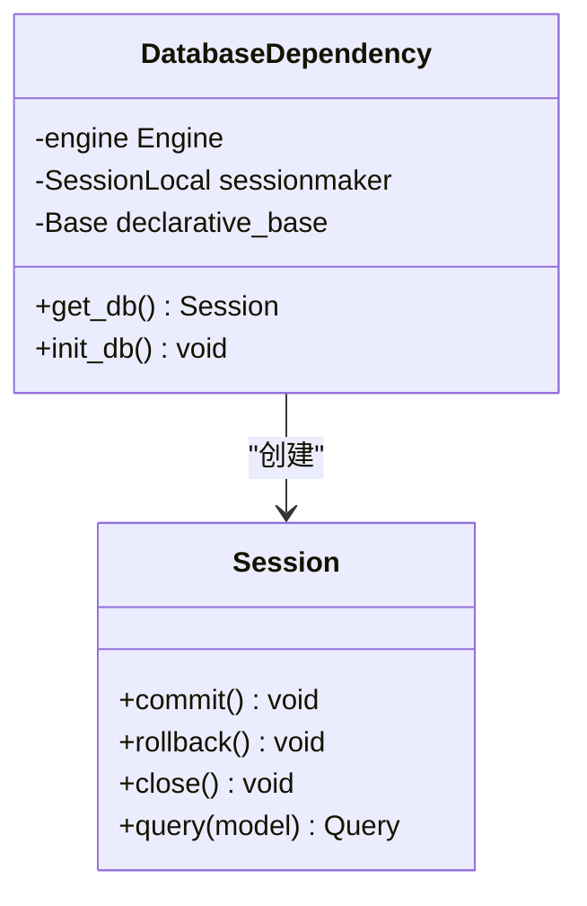

**图表来源**
- [app/database.py:22-32](file://app/database.py#L22-L32)

数据库连接依赖具有以下特性：
- **作用域管理**：每个请求创建独立的数据库会话
- **生命周期控制**：自动提交、回滚和关闭
- **连接池管理**：基于配置的连接池参数
- **异常处理**：自动回滚和重新抛出异常

### 认证依赖

认证系统通过JWT令牌实现用户身份验证：

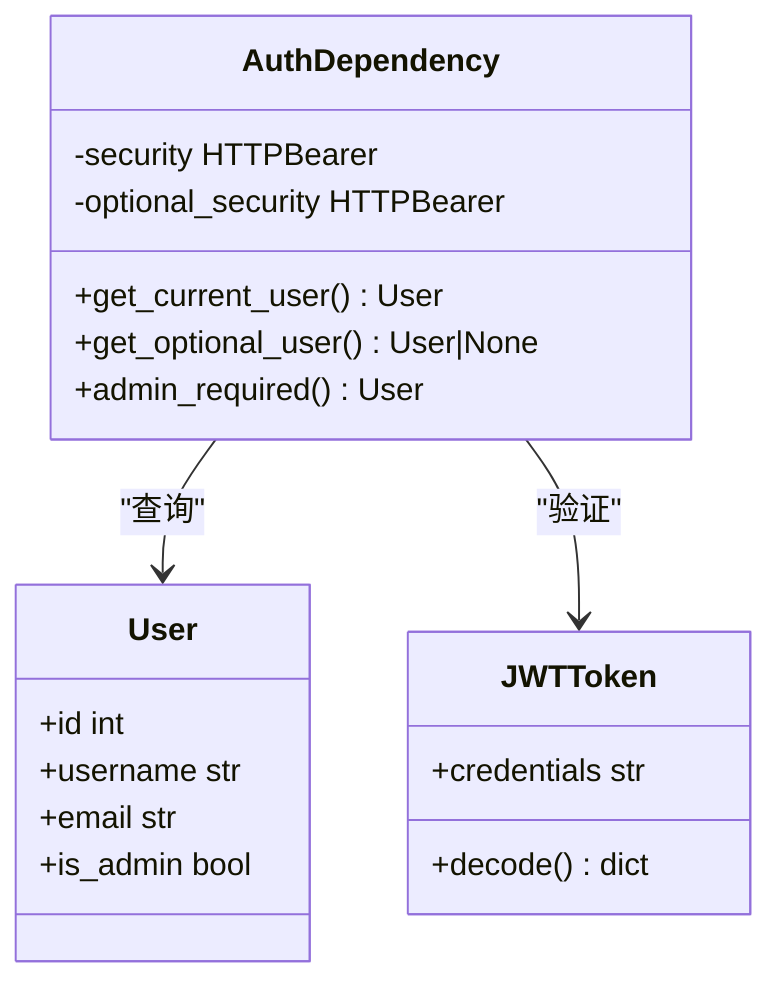

**图表来源**
- [app/dependencies.py:16-62](file://app/dependencies.py#L16-L62)

认证依赖支持：
- **必需认证**：必须提供有效的JWT令牌
- **可选认证**：允许未登录用户访问
- **管理员权限**：基于用户角色的权限控制
- **令牌验证**：HS256算法的JWT解码

### 配置依赖

配置系统提供集中式的应用配置管理：

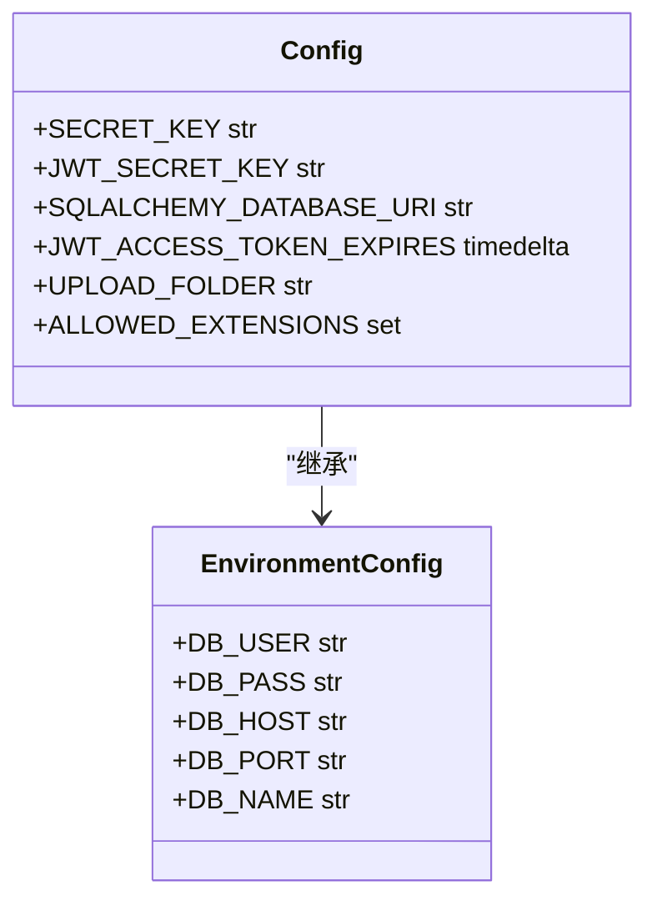

**图表来源**
- [app/core/config.py:7-43](file://app/core/config.py#L7-L43)

配置依赖包括：
- **安全密钥**：应用和JWT相关的密钥
- **数据库配置**：连接字符串和连接池参数
- **上传配置**：文件上传限制和允许的文件类型
- **云存储配置**：对象存储相关的配置参数

### 业务服务依赖

内容过滤服务作为业务逻辑的依赖项：

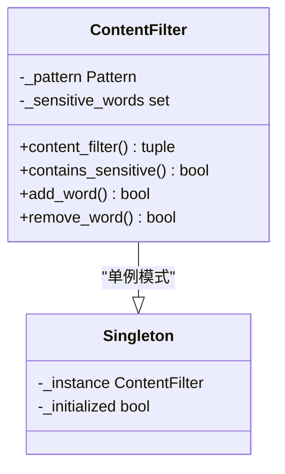

**图表来源**
- [app/services/content_filter.py:13-192](file://app/services/content_filter.py#L13-L192)

业务服务依赖特性：
- **单例模式**：确保全局唯一实例
- **动态词库**：运行时可添加和删除敏感词
- **正则表达式优化**：预编译的正则表达式模式
- **字符变体处理**：支持全角/半角字符转换

## 架构概览

NanTuPy的依赖注入架构采用分层设计：

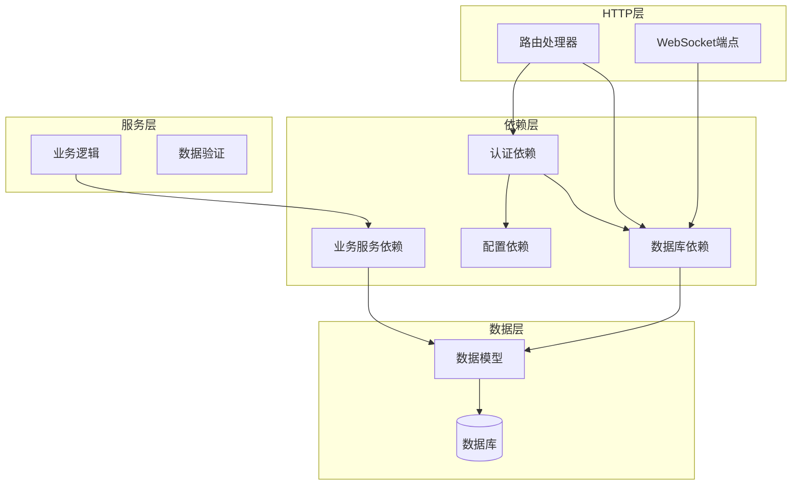

**图表来源**
- [app/routers/auth.py:253-262](file://app/routers/auth.py#L253-L262)
- [app/routers/ws.py:434-438](file://app/routers/ws.py#L434-L438)

## 详细组件分析

### 路由处理器中的依赖注入

在FastAPI路由处理器中，依赖注入通过参数声明实现：

#### 认证路由中的依赖使用

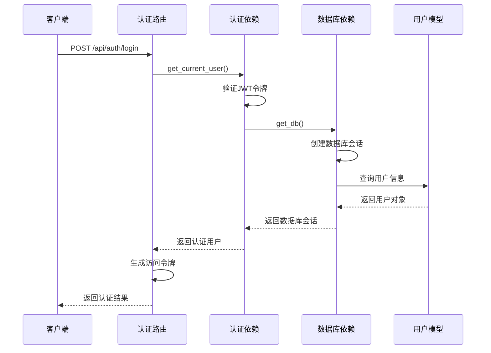

**图表来源**
- [app/routers/auth.py:215-246](file://app/routers/auth.py#L215-L246)
- [app/dependencies.py:16-36](file://app/dependencies.py#L16-L36)

#### 依赖链解析过程

依赖注入系统按照以下顺序解析依赖：

1. **参数解析**：FastAPI解析路由函数的参数类型
2. **依赖查找**：根据参数类型查找对应的依赖函数
3. **依赖执行**：执行依赖函数并传递必要的子依赖
4. **结果缓存**：将依赖结果缓存到当前请求上下文中
5. **参数注入**：将依赖结果作为参数传递给路由处理器

### WebSocket处理中的依赖注入

WebSocket端点采用不同的依赖注入策略：

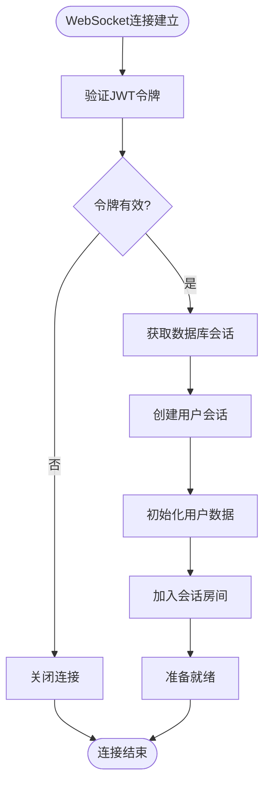

**图表来源**
- [app/routers/ws.py:434-470](file://app/routers/ws.py#L434-L470)

WebSocket依赖注入的特点：
- **手动会话管理**：使用`_get_db_session()`函数创建数据库会话
- **独立生命周期**：每个WebSocket连接拥有独立的数据库会话
- **资源清理**：连接断开时自动清理数据库连接

### 服务类中的依赖注入

业务服务类通过模块级依赖项实现：

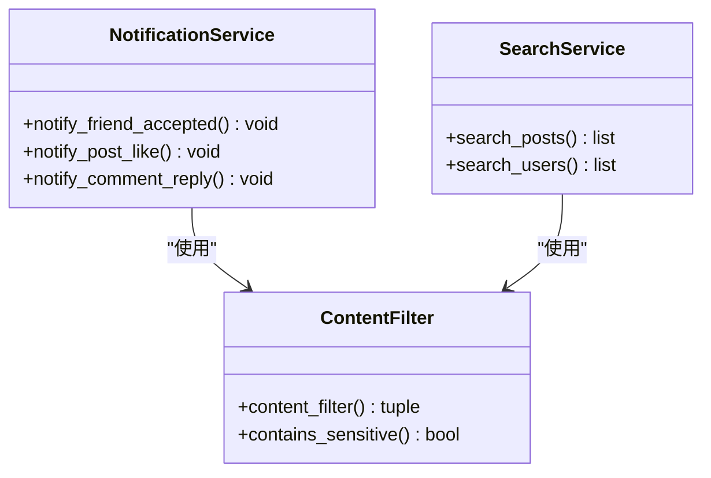

**图表来源**
- [app/services/content_filter.py:192](file://app/services/content_filter.py#L192)

## 依赖关系分析

### 依赖层次结构

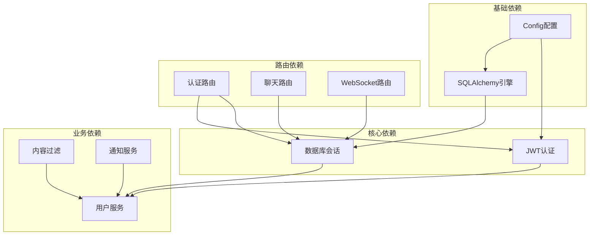

**图表来源**
- [app/core/config.py:7-43](file://app/core/config.py#L7-L43)
- [app/database.py:9-32](file://app/database.py#L9-L32)
- [app/dependencies.py:16-62](file://app/dependencies.py#L16-L62)

### 依赖循环检测

NanTuPy项目中的依赖关系设计避免了循环依赖：

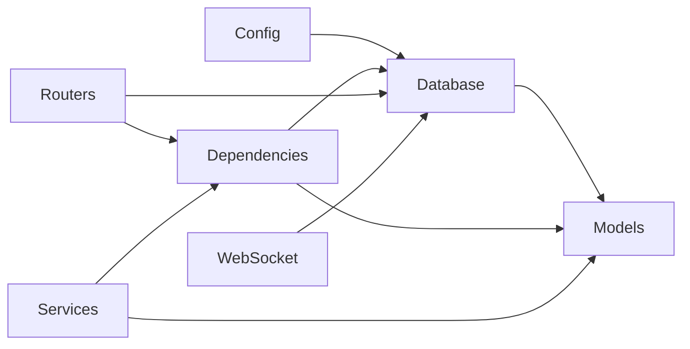

**图表来源**
- [app/models/models.py:1-12](file://app/models/models.py#L1-L12)

### 作用域和生命周期管理

依赖注入系统的作用域管理遵循以下原则：

| 依赖类型 | 作用域 | 生命周期 | 缓存策略 |
|---------|--------|----------|----------|
| 数据库会话 | 请求级 | 每个请求创建，请求结束销毁 | 每次请求重新创建 |
| JWT用户 | 请求级 | 验证后缓存到当前请求 | 请求内共享 |
| 配置对象 | 应用级 | 进程启动时创建 | 全局单例 |
| 业务服务 | 应用级 | 模块导入时创建 | 全局单例 |

**章节来源**
- [app/database.py:22-32](file://app/database.py#L22-L32)
- [app/dependencies.py:16-62](file://app/dependencies.py#L16-L62)
- [app/core/config.py:7-43](file://app/core/config.py#L7-L43)

## 性能考量

### 连接池优化

数据库连接池配置参数对性能有重要影响：

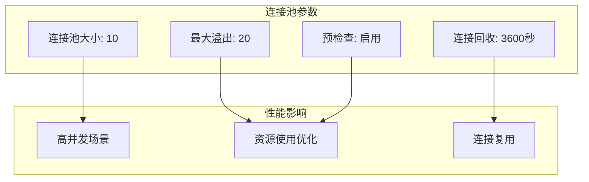

**图表来源**
- [app/database.py:10-16](file://app/database.py#L10-L16)

### 缓存策略

依赖注入系统采用多层缓存策略：

1. **请求级缓存**：同一请求内的依赖结果缓存
2. **进程级缓存**：全局单例服务的缓存
3. **数据库查询缓存**：ORM查询结果的缓存

### 异常处理和错误传播

依赖注入系统中的错误处理机制：

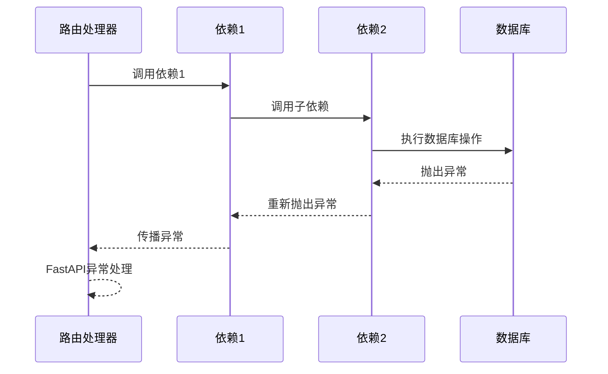

**图表来源**
- [app/database.py:28-30](file://app/database.py#L28-L30)

## 故障排除指南

### 常见依赖注入问题

#### 数据库连接问题

**症状**：数据库连接超时或连接池耗尽
**解决方案**：
1. 检查连接池配置参数
2. 确保数据库会话正确关闭
3. 监控连接池使用情况

#### 认证失败问题

**症状**：JWT令牌验证失败
**解决方案**：
1. 验证JWT_SECRET_KEY配置
2. 检查令牌格式和有效期
3. 确认用户存在且状态正常

#### 依赖循环问题

**症状**：导入时出现循环依赖错误
**解决方案**：
1. 重构依赖关系设计
2. 使用延迟导入避免循环
3. 重新设计模块结构

**章节来源**
- [app/database.py:28-30](file://app/database.py#L28-L30)
- [app/dependencies.py:25-35](file://app/dependencies.py#L25-L35)

## 结论

NanTuPy项目的依赖注入系统展现了现代Web应用的最佳实践：

### 主要优势

1. **清晰的架构分离**：依赖注入实现了各层之间的清晰边界
2. **良好的可测试性**：易于模拟和替换依赖项
3. **资源管理自动化**：自动化的生命周期管理减少了资源泄漏风险
4. **统一的安全机制**：集中的认证和授权处理

### 最佳实践建议

1. **依赖设计原则**：保持依赖的单一职责和最小化
2. **错误处理策略**：在依赖层提供明确的错误处理和恢复机制
3. **性能监控**：持续监控依赖注入的性能影响
4. **文档维护**：保持依赖关系文档的及时更新

### 扩展建议

1. **依赖注入容器**：考虑引入专门的依赖注入容器
2. **异步支持**：增强对异步依赖的支持
3. **配置热重载**：实现配置的动态更新能力
4. **依赖可视化**：提供依赖关系的可视化工具

通过合理的依赖注入设计，NanTuPy项目实现了高内聚、低耦合的架构，为未来的功能扩展和维护奠定了坚实的基础。