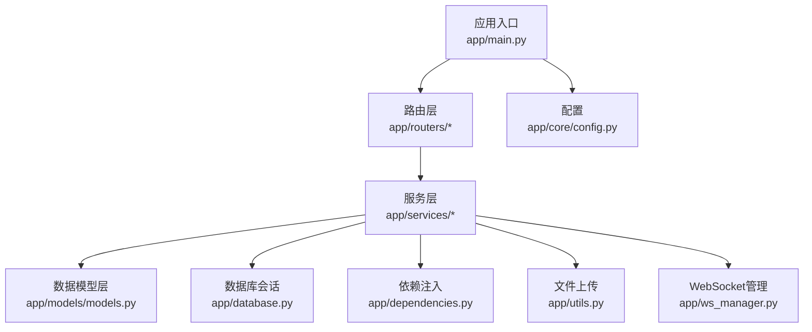
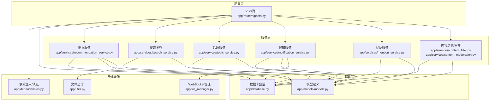
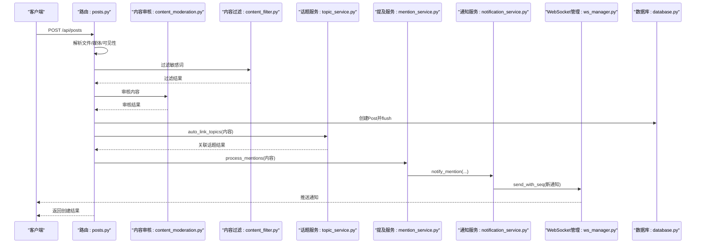
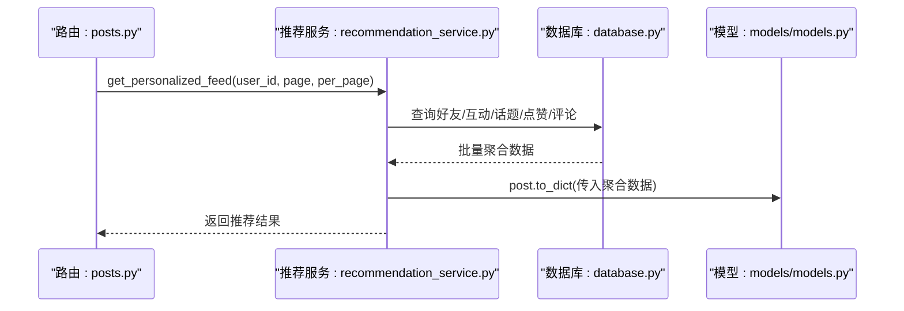
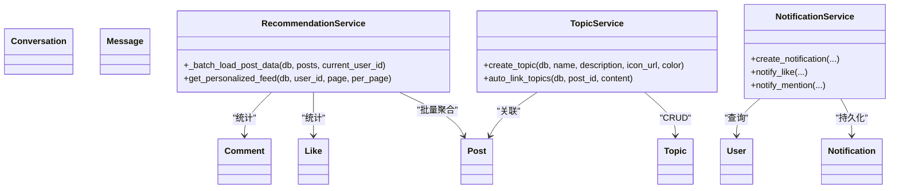
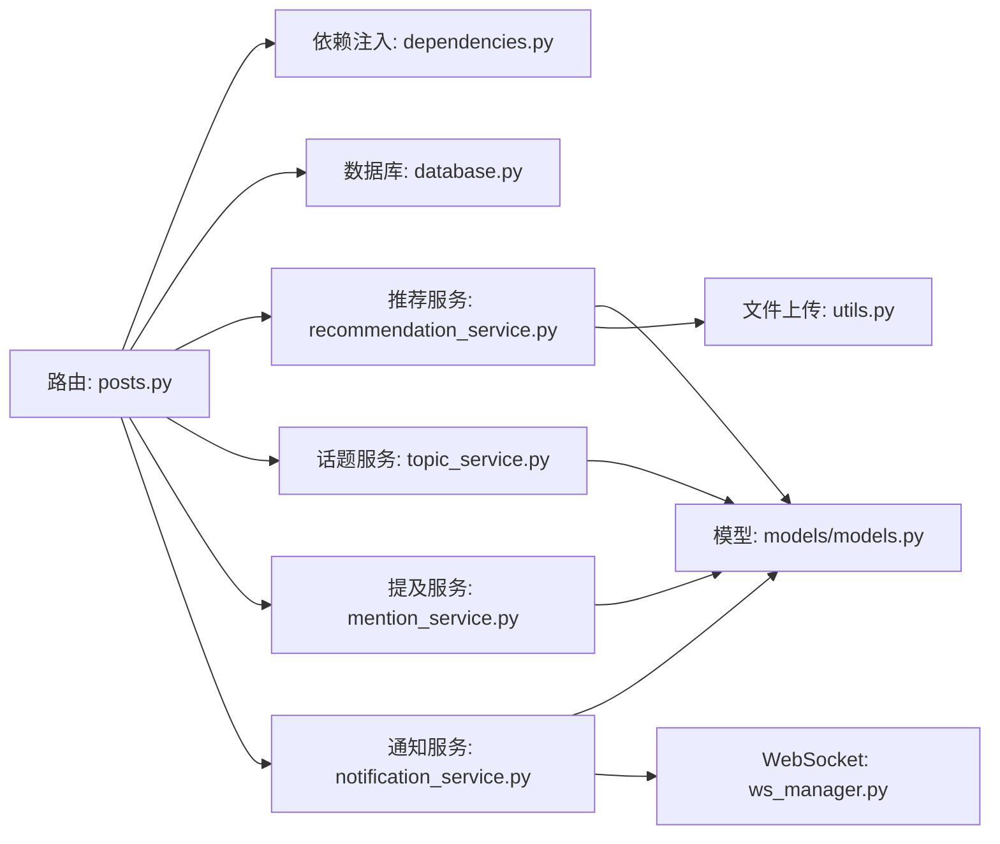

# 服务层集成模式

<cite>
**本文档引用的文件**
- [app/main.py](file://app/main.py)
- [app/dependencies.py](file://app/dependencies.py)
- [app/database.py](file://app/database.py)
- [app/models/models.py](file://app/models/models.py)
- [app/routers/posts.py](file://app/routers/posts.py)
- [app/services/content_filter.py](file://app/services/content_filter.py)
- [app/services/content_moderation.py](file://app/services/content_moderation.py)
- [app/services/notification_service.py](file://app/services/notification_service.py)
- [app/services/search_service.py](file://app/services/search_service.py)
- [app/services/topic_service.py](file://app/services/topic_service.py)
- [app/services/recommendation_service.py](file://app/services/recommendation_service.py)
- [app/services/mention_service.py](file://app/services/mention_service.py)
- [app/utils.py](file://app/utils.py)
- [app/ws_manager.py](file://app/ws_manager.py)
- [app/core/config.py](file://app/core/config.py)
</cite>

## 目录
1. [引言](#引言)
2. [项目结构](#项目结构)
3. [核心组件](#核心组件)
4. [架构总览](#架构总览)
5. [详细组件分析](#详细组件分析)
6. [依赖关系分析](#依赖关系分析)
7. [性能考量](#性能考量)
8. [故障排查指南](#故障排查指南)
9. [结论](#结论)
10. [附录](#附录)

## 引言
本文件面向NanTuPy项目的“服务层集成模式”，系统阐述业务服务如何与路由层、数据模型层协同工作，明确服务层的设计原则、职责划分、事务管理与错误处理策略，并给出服务间调用关系、数据传递机制、依赖注入使用方式、扩展性与插件化设计思路，以及复杂业务场景下的时序图与数据流图。

## 项目结构
NanTuPy采用FastAPI + SQLAlchemy的分层架构：
- 应用入口与中间件：app/main.py负责应用初始化、CORS、安全头、路由注册与健康检查
- 路由层：app/routers/* 定义HTTP接口，依赖注入获取当前用户与数据库会话
- 服务层：app/services/* 封装业务逻辑，复用Session参数传递，避免全局状态
- 数据模型层：app/models/models.py 定义ORM模型与关联表
- 基础设施：app/database.py 提供数据库引擎与Session；app/dependencies.py 提供JWT认证与权限校验；app/utils.py 提供文件上传；app/ws_manager.py 管理WebSocket连接与消息序号
- 配置：app/core/config.py 读取环境变量，集中管理配置

**图表来源**
- [app/main.py:1-110](file://app/main.py#L1-L110)
- [app/routers/posts.py:1-405](file://app/routers/posts.py#L1-L405)
- [app/services/recommendation_service.py:1-457](file://app/services/recommendation_service.py#L1-L457)
- [app/models/models.py:1-655](file://app/models/models.py#L1-L655)
- [app/database.py:1-38](file://app/database.py#L1-L38)
- [app/dependencies.py:1-63](file://app/dependencies.py#L1-L63)
- [app/utils.py:1-220](file://app/utils.py#L1-L220)
- [app/ws_manager.py:1-308](file://app/ws_manager.py#L1-L308)
- [app/core/config.py:1-43](file://app/core/config.py#L1-L43)

**章节来源**
- [app/main.py:1-110](file://app/main.py#L1-L110)
- [app/core/config.py:1-43](file://app/core/config.py#L1-L43)

## 核心组件
- 应用入口与生命周期：负责数据库初始化、CORS与安全头设置、路由注册与健康检查
- 依赖注入与认证：提供JWT解码、用户解析、可选用户解析、管理员权限校验
- 数据库会话：统一的Session工厂，自动提交/回滚/关闭，确保事务一致性
- 服务层（代表）：
  - 内容审核与过滤：敏感词检测、字符变体归一化、动态词库管理
  - 通知服务：数据库持久化通知并异步推送WebSocket
  - 搜索服务：用户/帖子/全局搜索、话题检索、趋势标签
  - 话题服务：话题创建/关联/关注/统计、自动链接内容中的话题
  - 推荐服务：个性化Feed、热门内容、用户推荐、相关内容
  - 提及服务：@提及提取、用户查找、通知派发
  - 文件上传：基于腾讯云COS的直传、预签名URL、删除与信息查询
  - WebSocket管理：序号分配、断线补发、ACK去重、会话房间广播

**章节来源**
- [app/dependencies.py:1-63](file://app/dependencies.py#L1-L63)
- [app/database.py:1-38](file://app/database.py#L1-L38)
- [app/services/content_filter.py:1-192](file://app/services/content_filter.py#L1-L192)
- [app/services/notification_service.py:1-233](file://app/services/notification_service.py#L1-L233)
- [app/services/search_service.py:1-179](file://app/services/search_service.py#L1-L179)
- [app/services/topic_service.py:1-277](file://app/services/topic_service.py#L1-L277)
- [app/services/recommendation_service.py:1-457](file://app/services/recommendation_service.py#L1-L457)
- [app/services/mention_service.py:1-118](file://app/services/mention_service.py#L1-L118)
- [app/utils.py:1-220](file://app/utils.py#L1-L220)
- [app/ws_manager.py:1-308](file://app/ws_manager.py#L1-L308)

## 架构总览
服务层通过依赖注入获取当前用户与数据库会话，围绕业务实体（用户、帖子、话题、通知等）执行业务规则，同时与外部系统（COS、WebSocket）交互。推荐服务通过批量聚合数据消除N+1问题，搜索服务与话题服务复用Session参数传递模式，确保事务边界清晰。

**图表来源**
- [app/routers/posts.py:1-405](file://app/routers/posts.py#L1-L405)
- [app/services/recommendation_service.py:1-457](file://app/services/recommendation_service.py#L1-L457)
- [app/services/search_service.py:1-179](file://app/services/search_service.py#L1-L179)
- [app/services/topic_service.py:1-277](file://app/services/topic_service.py#L1-L277)
- [app/services/notification_service.py:1-233](file://app/services/notification_service.py#L1-L233)
- [app/services/mention_service.py:1-118](file://app/services/mention_service.py#L1-L118)
- [app/services/content_filter.py:1-192](file://app/services/content_filter.py#L1-L192)
- [app/models/models.py:1-655](file://app/models/models.py#L1-L655)
- [app/database.py:1-38](file://app/database.py#L1-L38)
- [app/dependencies.py:1-63](file://app/dependencies.py#L1-L63)
- [app/utils.py:1-220](file://app/utils.py#L1-L220)
- [app/ws_manager.py:1-308](file://app/ws_manager.py#L1-L308)

## 详细组件分析

### 服务层设计原则与职责划分
- 业务逻辑封装：各服务聚焦单一职责，如推荐、搜索、话题、通知、提及、内容审核
- 事务管理：服务方法接收Session参数，显式控制commit/rollback，避免跨服务泄漏事务
- 错误处理：服务内捕获异常并回滚，返回None或错误信息，路由层统一转换为HTTP异常
- 数据传递：通过Session与模型to_dict方法传递数据，避免ORM对象跨层传播
- 依赖注入：通过FastAPI依赖注入获取当前用户与数据库会话，减少硬编码耦合

**章节来源**
- [app/services/recommendation_service.py:1-457](file://app/services/recommendation_service.py#L1-L457)
- [app/services/search_service.py:1-179](file://app/services/search_service.py#L1-L179)
- [app/services/topic_service.py:1-277](file://app/services/topic_service.py#L1-L277)
- [app/services/notification_service.py:1-233](file://app/services/notification_service.py#L1-L233)
- [app/services/mention_service.py:1-118](file://app/services/mention_service.py#L1-L118)
- [app/services/content_filter.py:1-192](file://app/services/content_filter.py#L1-L192)

### 服务间调用关系与时序图

#### 帖子创建流程（含内容审核、话题自动链接、提及通知）
该流程展示了路由层触发服务层，服务层之间相互协作并持久化到数据库与推送通知。

**图表来源**
- [app/routers/posts.py:22-140](file://app/routers/posts.py#L22-L140)
- [app/services/content_filter.py:104-128](file://app/services/content_filter.py#L104-L128)
- [app/services/topic_service.py:248-257](file://app/services/topic_service.py#L248-L257)
- [app/services/mention_service.py:48-94](file://app/services/mention_service.py#L48-L94)
- [app/services/notification_service.py:21-53](file://app/services/notification_service.py#L21-L53)
- [app/ws_manager.py:74-95](file://app/ws_manager.py#L74-L95)
- [app/database.py:22-32](file://app/database.py#L22-L32)

**章节来源**
- [app/routers/posts.py:22-140](file://app/routers/posts.py#L22-L140)
- [app/services/topic_service.py:248-257](file://app/services/topic_service.py#L248-L257)
- [app/services/mention_service.py:48-94](file://app/services/mention_service.py#L48-L94)
- [app/services/notification_service.py:21-53](file://app/services/notification_service.py#L21-L53)
- [app/ws_manager.py:74-95](file://app/ws_manager.py#L74-L95)

#### 个性化推荐流程（批量聚合数据消除N+1）
该流程展示推荐服务如何批量加载点赞、评论、话题与关注状态，避免N+1查询。

**图表来源**
- [app/routers/posts.py:142-186](file://app/routers/posts.py#L142-L186)
- [app/services/recommendation_service.py:83-168](file://app/services/recommendation_service.py#L83-L168)
- [app/models/models.py:152-184](file://app/models/models.py#L152-L184)
- [app/database.py:22-32](file://app/database.py#L22-L32)

**章节来源**
- [app/services/recommendation_service.py:16-80](file://app/services/recommendation_service.py#L16-L80)
- [app/models/models.py:152-184](file://app/models/models.py#L152-L184)

### 数据模型与服务层交互
服务层通过Session对模型进行CRUD与聚合查询，模型to_dict方法承担序列化职责，避免ORM对象跨层传播。

**图表来源**
- [app/models/models.py:42-421](file://app/models/models.py#L42-L421)
- [app/services/recommendation_service.py:16-80](file://app/services/recommendation_service.py#L16-L80)
- [app/services/topic_service.py:14-27](file://app/services/topic_service.py#L14-L27)
- [app/services/notification_service.py:55-84](file://app/services/notification_service.py#L55-L84)

**章节来源**
- [app/models/models.py:42-421](file://app/models/models.py#L42-L421)
- [app/services/recommendation_service.py:16-80](file://app/services/recommendation_service.py#L16-L80)
- [app/services/topic_service.py:14-27](file://app/services/topic_service.py#L14-L27)
- [app/services/notification_service.py:55-84](file://app/services/notification_service.py#L55-L84)

### 依赖注入与认证
- 依赖注入：路由层通过Depends获取当前用户与数据库会话，确保每个请求的上下文隔离
- 认证：JWT解码与用户解析，支持可选用户（未登录返回None），管理员权限校验
- 会话生命周期：SessionLocal在yield前执行，异常时回滚并关闭，保证事务一致性

**章节来源**
- [app/dependencies.py:16-62](file://app/dependencies.py#L16-L62)
- [app/database.py:22-32](file://app/database.py#L22-L32)

### 服务层扩展性与插件化设计
- 单例与全局实例：内容过滤器采用单例，敏感词库动态维护；WebSocket管理器单例管理连接池
- 模块化服务：各服务独立文件，职责清晰，便于替换与扩展
- 插件化思路：可通过配置中心（如Config）扩展内容审核词库、推荐算法权重、通知渠道等

**章节来源**
- [app/services/content_filter.py:45-192](file://app/services/content_filter.py#L45-L192)
- [app/ws_manager.py:20-36](file://app/ws_manager.py#L20-L36)
- [app/core/config.py:1-43](file://app/core/config.py#L1-L43)

## 依赖关系分析
服务层与路由层、数据模型层、基础设施之间的依赖关系如下：

**图表来源**
- [app/routers/posts.py:1-405](file://app/routers/posts.py#L1-L405)
- [app/dependencies.py:1-63](file://app/dependencies.py#L1-L63)
- [app/database.py:1-38](file://app/database.py#L1-L38)
- [app/services/recommendation_service.py:1-457](file://app/services/recommendation_service.py#L1-L457)
- [app/services/topic_service.py:1-277](file://app/services/topic_service.py#L1-L277)
- [app/services/mention_service.py:1-118](file://app/services/mention_service.py#L1-L118)
- [app/services/notification_service.py:1-233](file://app/services/notification_service.py#L1-L233)
- [app/models/models.py:1-655](file://app/models/models.py#L1-L655)
- [app/utils.py:1-220](file://app/utils.py#L1-L220)
- [app/ws_manager.py:1-308](file://app/ws_manager.py#L1-L308)

**章节来源**
- [app/routers/posts.py:1-405](file://app/routers/posts.py#L1-L405)
- [app/services/recommendation_service.py:1-457](file://app/services/recommendation_service.py#L1-L457)
- [app/services/topic_service.py:1-277](file://app/services/topic_service.py#L1-L277)
- [app/services/mention_service.py:1-118](file://app/services/mention_service.py#L1-L118)
- [app/services/notification_service.py:1-233](file://app/services/notification_service.py#L1-L233)
- [app/models/models.py:1-655](file://app/models/models.py#L1-L655)
- [app/utils.py:1-220](file://app/utils.py#L1-L220)
- [app/ws_manager.py:1-308](file://app/ws_manager.py#L1-L308)

## 性能考量
- 批量聚合消除N+1：推荐服务批量加载点赞、评论、话题与关注状态，显著降低查询次数
- 分页与has_more：列表查询多取1条判断是否还有更多，避免昂贵COUNT
- 时间衰减与多样性：推荐算法结合时间衰减、互动分数与作者多样性，提升体验
- 事务边界：服务方法显式commit/rollback，避免长事务占用资源
- 缓存与索引：模型定义中包含必要索引（如评论父子索引、搜索历史索引），提升查询效率

**章节来源**
- [app/services/recommendation_service.py:16-80](file://app/services/recommendation_service.py#L16-L80)
- [app/models/models.py:190-193](file://app/models/models.py#L190-L193)
- [app/routers/posts.py:142-186](file://app/routers/posts.py#L142-L186)

## 故障排查指南
- 认证失败：检查JWT解码、用户是否存在、权限校验
- 数据库异常：确认Session自动回滚与关闭，查看路由层异常转换
- 通知推送失败：检查WebSocket连接状态与异步推送逻辑
- 文件上传失败：检查COS配置、预签名URL生成与最终确认流程
- 内容审核拒绝：查看审核原因与日志记录

**章节来源**
- [app/dependencies.py:16-62](file://app/dependencies.py#L16-L62)
- [app/database.py:22-32](file://app/database.py#L22-L32)
- [app/services/notification_service.py:21-53](file://app/services/notification_service.py#L21-L53)
- [app/utils.py:37-77](file://app/utils.py#L37-L77)
- [app/services/content_moderation.py:1-200](file://app/services/content_moderation.py#L1-L200)

## 结论
NanTuPy的服务层通过清晰的职责划分、严格的事务管理与依赖注入，实现了与路由层、数据模型层的高效协作。推荐服务的批量聚合、搜索服务的Session参数传递、通知服务的异步推送与WebSocket序号机制，共同构成了可扩展、高性能、可维护的服务层集成模式。建议在生产环境中进一步完善监控与告警、缓存策略与限流保护，以应对高并发场景。

## 附录
- 配置项：数据库连接、JWT密钥、COS配置、分页参数等集中于配置模块
- 文件上传：支持预签名URL、直传、删除与信息查询
- WebSocket：序号分配、断线补发、ACK去重、会话房间广播

**章节来源**
- [app/core/config.py:1-43](file://app/core/config.py#L1-L43)
- [app/utils.py:14-220](file://app/utils.py#L14-L220)
- [app/ws_manager.py:20-308](file://app/ws_manager.py#L20-L308)