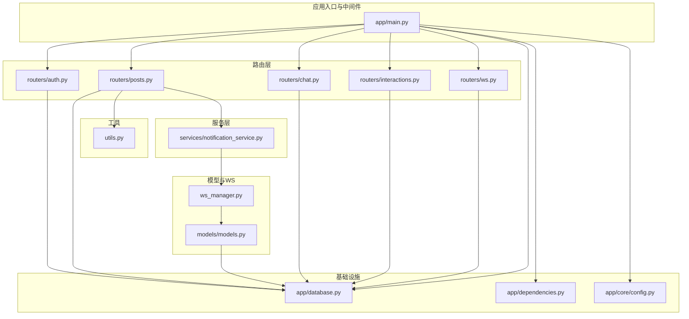
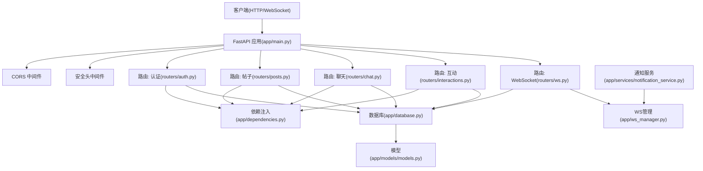
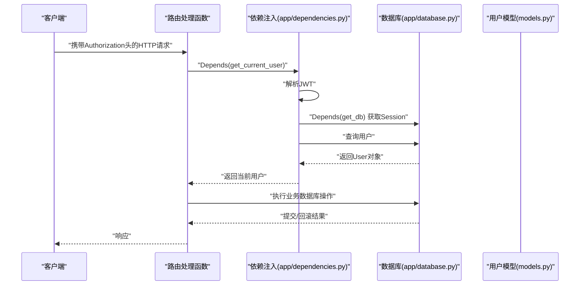
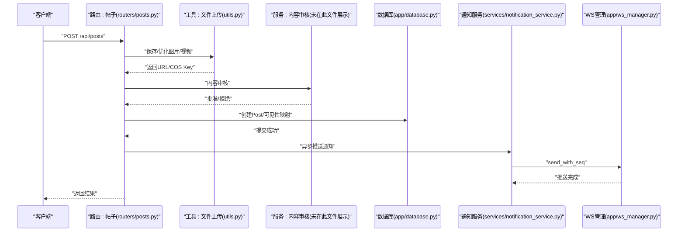
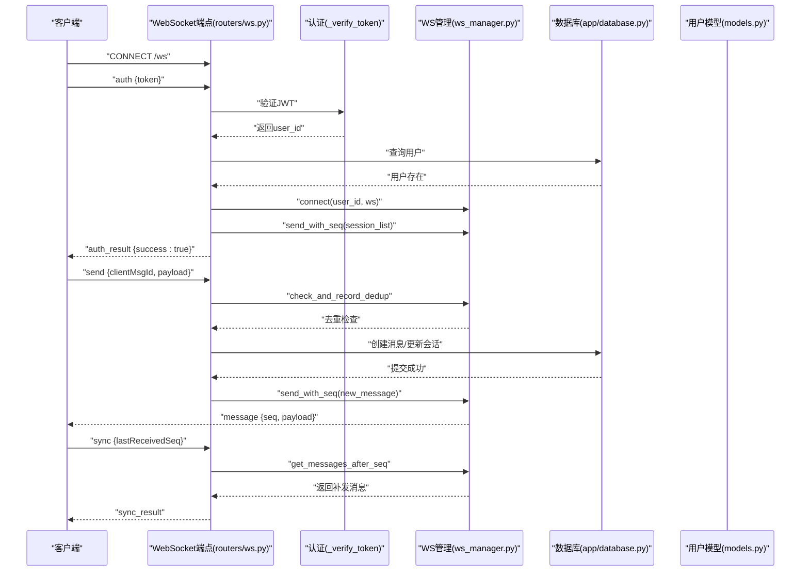
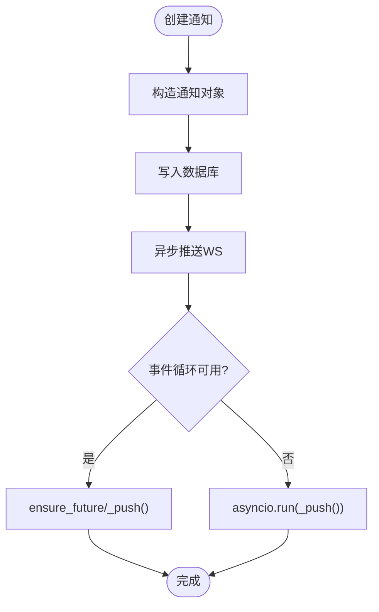
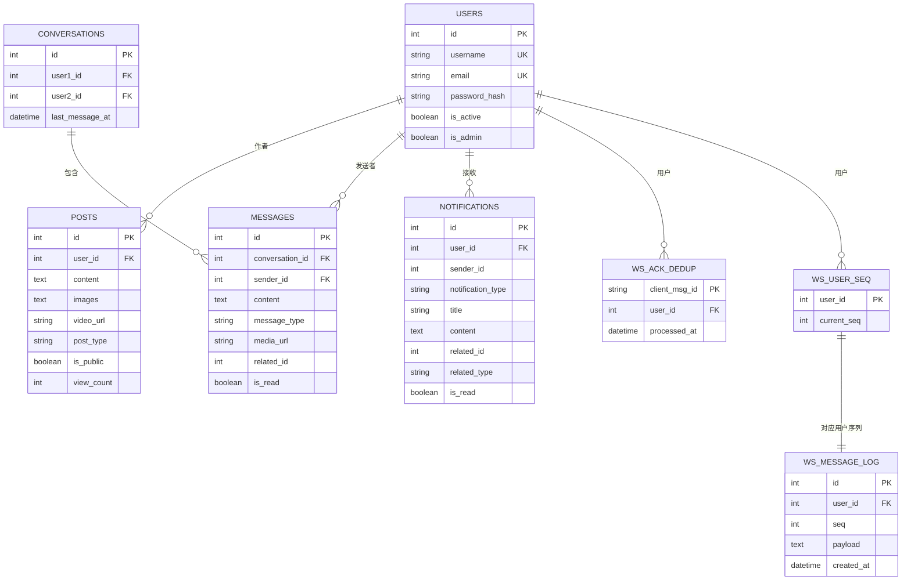
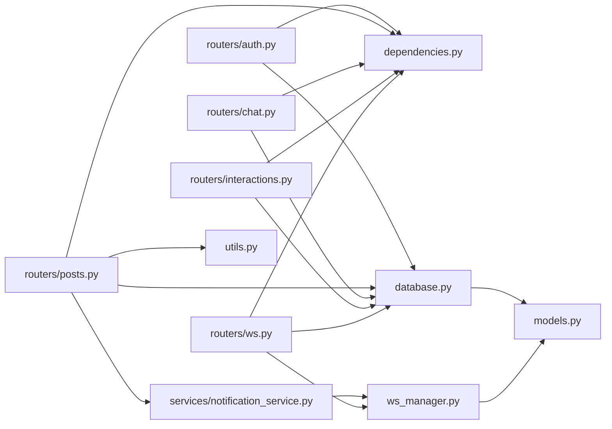

# 组件交互关系

<cite>
**本文引用的文件**
- [app/main.py](file://app/main.py)
- [app/database.py](file://app/database.py)
- [app/dependencies.py](file://app/dependencies.py)
- [app/ws_manager.py](file://app/ws_manager.py)
- [app/models/models.py](file://app/models/models.py)
- [app/routers/auth.py](file://app/routers/auth.py)
- [app/routers/ws.py](file://app/routers/ws.py)
- [app/routers/posts.py](file://app/routers/posts.py)
- [app/routers/chat.py](file://app/routers/chat.py)
- [app/routers/interactions.py](file://app/routers/interactions.py)
- [app/services/notification_service.py](file://app/services/notification_service.py)
- [app/utils.py](file://app/utils.py)
- [app/core/config.py](file://app/core/config.py)
- [migrations/add_ws_protocol_tables.sql](file://migrations/add_ws_protocol_tables.sql)
</cite>

## 目录
1. [简介](#简介)
2. [项目结构](#项目结构)
3. [核心组件](#核心组件)
4. [架构总览](#架构总览)
5. [详细组件分析](#详细组件分析)
6. [依赖分析](#依赖分析)
7. [性能考量](#性能考量)
8. [故障排查指南](#故障排查指南)
9. [结论](#结论)
10. [附录](#附录)

## 简介
本文件面向NanTuPy项目的开发者与维护者，系统性梳理组件间的交互关系与调用链路，重点覆盖以下方面：
- 路由模块、服务模块、数据模型之间的协作模式
- 依赖注入系统如何协调组件工作
- 请求处理流程（从HTTP请求到数据库操作）与错误传播机制
- WebSocket连接管理与传统HTTP请求处理的差异与联系
- 组件交互的时序图与调用关系图

## 项目结构
NanTuPy采用FastAPI作为Web框架，整体目录组织遵循“按职责分层”的思路：
- 核心配置与基础设施：app/core、app/database、app/dependencies
- 路由层：app/routers 下按业务域划分（auth、posts、chat、interactions、ws等）
- 服务层：app/services 下封装横切能力（通知、推荐、内容审核、提及等）
- 数据模型：app/models/models.py 定义ORM模型与WS协议表
- 工具与上传：app/utils.py 封装文件上传与Cos操作
- WebSocket管理：app/ws_manager.py 管理连接池、序号、去重与断线补发
- 迁移与协议：migrations/add_ws_protocol_tables.sql 定义WS协议所需的数据库表

**图表来源**
- [app/main.py:39-84](file://app/main.py#L39-L84)
- [app/database.py:1-38](file://app/database.py#L1-L38)
- [app/dependencies.py:1-63](file://app/dependencies.py#L1-L63)
- [app/routers/auth.py:1-486](file://app/routers/auth.py#L1-L486)
- [app/routers/posts.py:1-200](file://app/routers/posts.py#L1-L200)
- [app/routers/chat.py:1-200](file://app/routers/chat.py#L1-L200)
- [app/routers/interactions.py:1-200](file://app/routers/interactions.py#L1-L200)
- [app/routers/ws.py:1-538](file://app/routers/ws.py#L1-L538)
- [app/services/notification_service.py:1-233](file://app/services/notification_service.py#L1-L233)
- [app/models/models.py:1-655](file://app/models/models.py#L1-L655)
- [app/utils.py:1-220](file://app/utils.py#L1-L220)
- [app/ws_manager.py:1-308](file://app/ws_manager.py#L1-L308)

**章节来源**
- [app/main.py:1-110](file://app/main.py#L1-L110)
- [app/database.py:1-38](file://app/database.py#L1-L38)
- [app/dependencies.py:1-63](file://app/dependencies.py#L1-L63)

## 核心组件
- 应用入口与路由注册：负责初始化数据库、注册路由、添加CORS与安全头中间件，并挂载WebSocket端点。
- 依赖注入与认证：通过依赖函数解析JWT，注入当前用户与数据库会话；提供管理员权限校验。
- 数据库与会话：统一的SQLAlchemy引擎、Session工厂与依赖注入函数，确保事务一致性与资源回收。
- 数据模型：集中定义用户、帖子、评论、点赞、好友、会话、消息、通知、举报、漫展等实体，以及WebSocket协议表。
- WebSocket管理：单例WSManager负责连接池、序号分配、消息持久化、断线补发、ACK去重与会话房间广播。
- 服务层：通知服务封装推送逻辑，结合WSManager异步推送；内容审核、提及、推荐等服务在路由层按需调用。
- 工具与上传：封装腾讯云COS上传、预签名URL生成、文件信息查询与删除。

**章节来源**
- [app/main.py:29-84](file://app/main.py#L29-L84)
- [app/dependencies.py:16-62](file://app/dependencies.py#L16-L62)
- [app/database.py:22-37](file://app/database.py#L22-L37)
- [app/models/models.py:42-655](file://app/models/models.py#L42-L655)
- [app/ws_manager.py:20-307](file://app/ws_manager.py#L20-L307)
- [app/services/notification_service.py:14-233](file://app/services/notification_service.py#L14-L233)
- [app/utils.py:14-220](file://app/utils.py#L14-L220)

## 架构总览
NanTuPy采用“路由-服务-模型-数据库”分层架构，配合依赖注入与中间件实现认证、CORS与安全头。WebSocket通过独立端点与WSManager解耦，既可作为HTTP的补充通道，又具备自洽的协议与可靠性保障。

**图表来源**
- [app/main.py:46-84](file://app/main.py#L46-L84)
- [app/routers/auth.py:11-22](file://app/routers/auth.py#L11-L22)
- [app/routers/posts.py:4-16](file://app/routers/posts.py#L4-L16)
- [app/routers/chat.py:7-16](file://app/routers/chat.py#L7-L16)
- [app/routers/interactions.py:4-14](file://app/routers/interactions.py#L4-L14)
- [app/routers/ws.py:11-20](file://app/routers/ws.py#L11-L20)
- [app/dependencies.py:4-13](file://app/dependencies.py#L4-L13)
- [app/database.py:5-19](file://app/database.py#L5-L19)
- [app/models/models.py:10-11](file://app/models/models.py#L10-L11)
- [app/ws_manager.py:15-17](file://app/ws_manager.py#L15-L17)
- [app/services/notification_service.py:8-9](file://app/services/notification_service.py#L8-L9)

## 详细组件分析

### 依赖注入与认证流程
- JWT解析与用户解析：依赖函数从Authorization头提取JWT，解码后查询用户，失败抛出401；可选依赖返回None。
- 数据库会话：依赖函数创建Session，try/finally确保commit/rollback与关闭。
- 管理员校验：基于当前用户属性进行权限判断，失败抛出403。

**图表来源**
- [app/dependencies.py:16-36](file://app/dependencies.py#L16-L36)
- [app/dependencies.py:39-50](file://app/dependencies.py#L39-L50)
- [app/dependencies.py:53-62](file://app/dependencies.py#L53-L62)
- [app/database.py:22-32](file://app/database.py#L22-L32)
- [app/models/models.py:42-98](file://app/models/models.py#L42-L98)

**章节来源**
- [app/dependencies.py:16-62](file://app/dependencies.py#L16-L62)
- [app/database.py:22-32](file://app/database.py#L22-L32)

### HTTP请求到数据库的完整链路（以帖子创建为例）
- 输入校验与文件处理：路由接收表单参数与文件，调用图像优化与COS上传工具。
- 内容审核：调用内容审核服务，若拒绝则记录并返回错误。
- 业务写入：创建Post记录，必要时写入可见性映射表；提交事务。
- 通知与提及：调用TopicService与MentionService处理话题与提及；异步通知服务推送WS消息。

**图表来源**
- [app/routers/posts.py:22-140](file://app/routers/posts.py#L22-L140)
- [app/utils.py:151-187](file://app/utils.py#L151-L187)
- [app/services/notification_service.py:55-84](file://app/services/notification_service.py#L55-L84)
- [app/ws_manager.py:74-95](file://app/ws_manager.py#L74-L95)

**章节来源**
- [app/routers/posts.py:22-140](file://app/routers/posts.py#L22-L140)
- [app/utils.py:151-187](file://app/utils.py#L151-L187)
- [app/services/notification_service.py:55-84](file://app/services/notification_service.py#L55-L84)

### WebSocket连接管理与消息协议
- 连接建立与认证：WebSocket端点接受连接，要求先发送auth消息；验证JWT后注册连接、推送会话列表并加入房间。
- 消息发送：支持send、ack_receive、sync、join、leave、typing、stop_typing等；send消息包含幂等clientMsgId，WSManager进行去重。
- 序号与断线补发：send_with_seq原子递增序号并持久化消息日志；sync根据lastReceivedSeq补发；ACK去重表防止重复处理。
- 错误处理：未认证发送消息直接拒绝；异常捕获后断开连接并记录日志。

**图表来源**
- [app/routers/ws.py:434-538](file://app/routers/ws.py#L434-L538)
- [app/routers/ws.py:27-40](file://app/routers/ws.py#L27-L40)
- [app/ws_manager.py:45-64](file://app/ws_manager.py#L45-L64)
- [app/ws_manager.py:74-105](file://app/ws_manager.py#L74-L105)
- [app/ws_manager.py:214-247](file://app/ws_manager.py#L214-L247)
- [app/ws_manager.py:265-303](file://app/ws_manager.py#L265-L303)
- [app/models/models.py:625-655](file://app/models/models.py#L625-L655)

**章节来源**
- [app/routers/ws.py:434-538](file://app/routers/ws.py#L434-L538)
- [app/ws_manager.py:20-307](file://app/ws_manager.py#L20-L307)
- [migrations/add_ws_protocol_tables.sql:1-31](file://migrations/add_ws_protocol_tables.sql#L1-L31)

### 通知服务与WebSocket推送
- 通知创建：服务层创建Notification记录并异步推送WS消息；若WS不可达或异常，记录警告但不影响HTTP请求返回。
- 异步推送：通过事件循环调度，确保在WS在线时推送“new_notification”事件并附带未读计数。

**图表来源**
- [app/services/notification_service.py:55-84](file://app/services/notification_service.py#L55-L84)
- [app/services/notification_service.py:25-52](file://app/services/notification_service.py#L25-L52)

**章节来源**
- [app/services/notification_service.py:14-233](file://app/services/notification_service.py#L14-L233)

### 数据模型与WS协议表
- ORM模型：集中定义用户、帖子、评论、点赞、好友、会话、消息、通知、举报、漫展等实体及其关系。
- WS协议表：ws_message_log、ws_user_seq、ws_ack_dedup三张表支撑序号、断线补发与去重。

**图表来源**
- [app/models/models.py:42-655](file://app/models/models.py#L42-L655)
- [migrations/add_ws_protocol_tables.sql:1-31](file://migrations/add_ws_protocol_tables.sql#L1-L31)

**章节来源**
- [app/models/models.py:42-655](file://app/models/models.py#L42-L655)
- [migrations/add_ws_protocol_tables.sql:1-31](file://migrations/add_ws_protocol_tables.sql#L1-L31)

## 依赖分析
- 路由到依赖：各路由均依赖依赖注入模块提供的get_current_user/get_db等，形成统一的认证与事务管理。
- 路由到模型：路由通过SQLAlchemy ORM访问数据模型，部分复杂查询使用原生SQL（如帖子话题查询）。
- 路由到服务：路由在需要时调用服务层（如通知、提及、内容审核），服务层再访问数据库与WS。
- WS到模型：WS端点与WSManager均依赖模型中的Conversation、Message、User等实体与WS协议表。
- 工具到外部：文件上传依赖腾讯云CosSDK，通过配置类读取密钥与桶信息。

**图表来源**
- [app/routers/auth.py:18-22](file://app/routers/auth.py#L18-L22)
- [app/routers/posts.py:9-16](file://app/routers/posts.py#L9-L16)
- [app/routers/chat.py:10-13](file://app/routers/chat.py#L10-L13)
- [app/routers/interactions.py:8-12](file://app/routers/interactions.py#L8-L12)
- [app/routers/ws.py:13-16](file://app/routers/ws.py#L13-L16)
- [app/utils.py:10-11](file://app/utils.py#L10-L11)
- [app/services/notification_service.py:8-9](file://app/services/notification_service.py#L8-L9)
- [app/ws_manager.py:15-17](file://app/ws_manager.py#L15-L17)
- [app/database.py:7](file://app/database.py#L7)
- [app/models/models.py:10-11](file://app/models/models.py#L10-L11)

**章节来源**
- [app/routers/auth.py:18-22](file://app/routers/auth.py#L18-L22)
- [app/routers/posts.py:9-16](file://app/routers/posts.py#L9-L16)
- [app/routers/chat.py:10-13](file://app/routers/chat.py#L10-L13)
- [app/routers/interactions.py:8-12](file://app/routers/interactions.py#L8-L12)
- [app/routers/ws.py:13-16](file://app/routers/ws.py#L13-L16)
- [app/utils.py:10-11](file://app/utils.py#L10-L11)
- [app/services/notification_service.py:8-9](file://app/services/notification_service.py#L8-L9)
- [app/ws_manager.py:15-17](file://app/ws_manager.py#L15-L17)
- [app/database.py:7](file://app/database.py#L7)
- [app/models/models.py:10-11](file://app/models/models.py#L10-L11)

## 性能考量
- 数据库连接池：通过SQLAlchemy引擎选项配置池大小、溢出与回收策略，减少连接开销。
- 批量查询与N+1避免：路由层在查询帖子、评论等场景采用批量IN查询与预加载，降低多次往返。
- 异步推送：通知服务通过事件循环异步推送，避免阻塞HTTP请求。
- 图像优化与上传：在路由层对图片进行优化后再上传，减少存储与传输成本。
- WS序号与去重：通过原子递增与去重表避免重复处理与消息丢失。

[本节为通用指导，无需特定文件来源]

## 故障排查指南
- HTTP错误传播：路由层在数据库操作失败时统一rollback并抛出HTTP异常；客户端应检查状态码与错误信息。
- WebSocket错误处理：未认证发送消息直接拒绝；异常捕获后断开连接并记录日志；客户端可通过error消息与close code定位问题。
- WS协议表清理：建议定期清理ws_ack_dedup与ws_message_log，避免表膨胀。
- CORS与安全头：若出现跨域或Flutter Web共享内存问题，检查CORS配置与COOP/COEP头设置。

**章节来源**
- [app/routers/ws.py:446-478](file://app/routers/ws.py#L446-L478)
- [app/routers/ws.py:530-538](file://app/routers/ws.py#L530-L538)
- [migrations/add_ws_protocol_tables.sql:28-31](file://migrations/add_ws_protocol_tables.sql#L28-L31)
- [app/main.py:46-66](file://app/main.py#L46-L66)

## 结论
NanTuPy通过清晰的分层与依赖注入，实现了HTTP与WebSocket两条并行的实时通信通道。路由层聚焦业务编排，服务层封装横切能力，WSManager提供可靠的序号、去重与断线补发机制。配合数据库连接池与批量查询策略，系统在保证一致性的同时兼顾性能与可维护性。

[本节为总结，无需特定文件来源]

## 附录
- 配置项：JWT密钥、数据库连接、COS配置等通过配置类集中管理。
- 迁移脚本：WS协议表迁移脚本定义了序号、日志与去重表结构。

**章节来源**
- [app/core/config.py:7-43](file://app/core/config.py#L7-L43)
- [migrations/add_ws_protocol_tables.sql:1-31](file://migrations/add_ws_protocol_tables.sql#L1-L31)