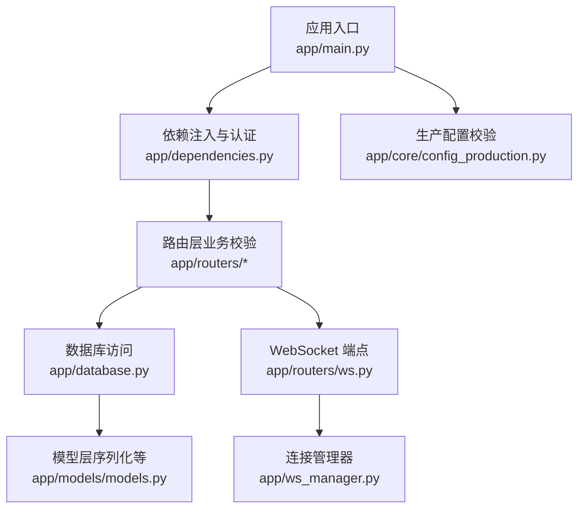
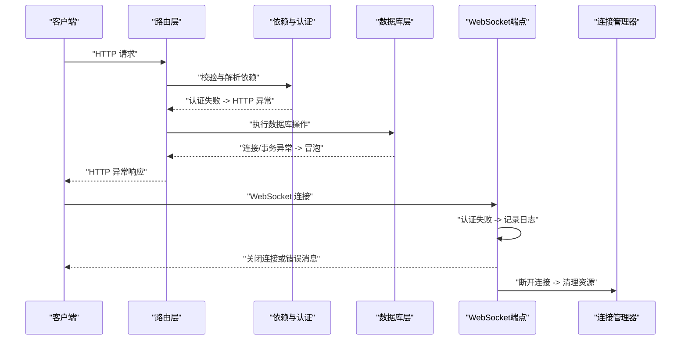
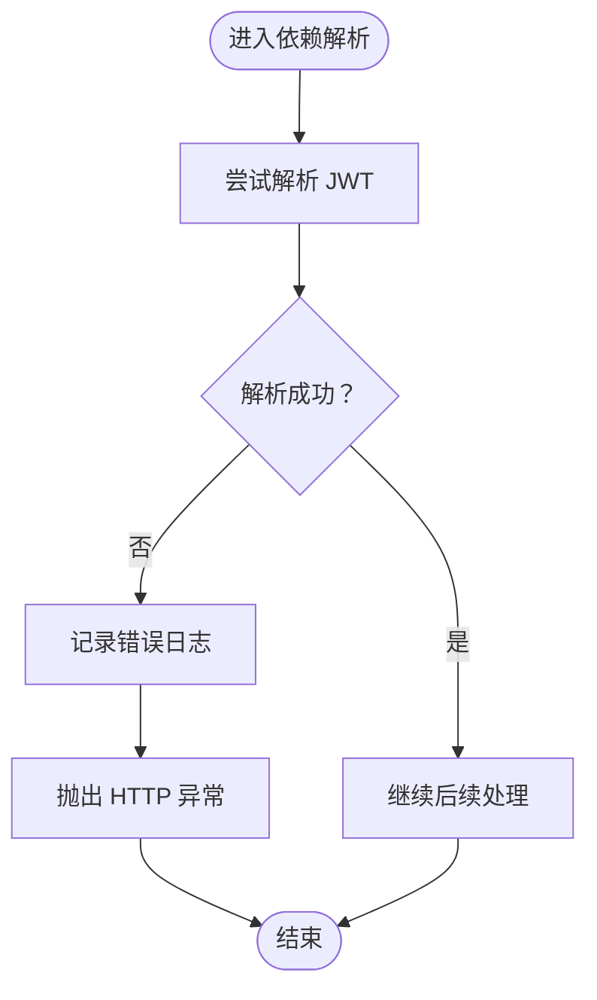
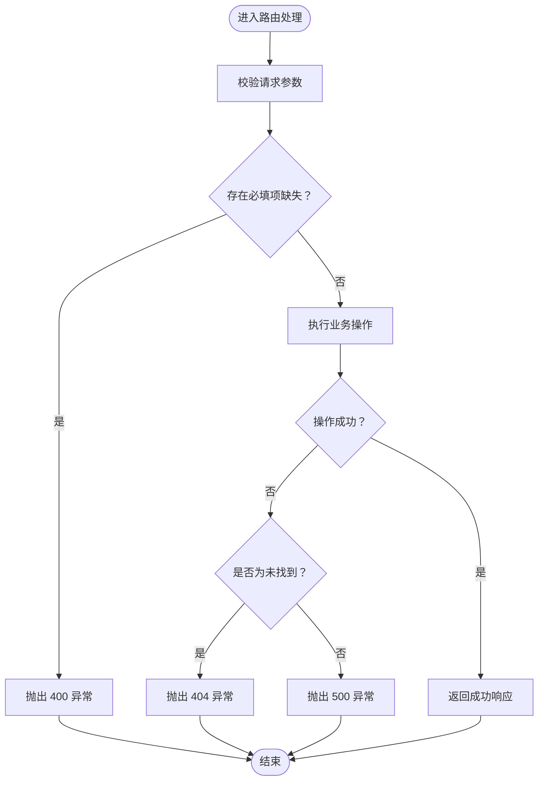
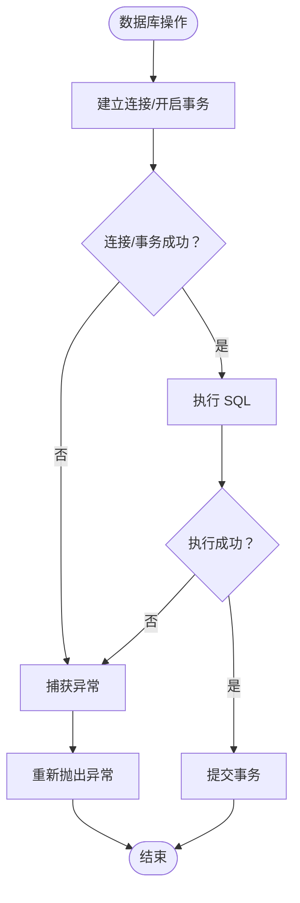
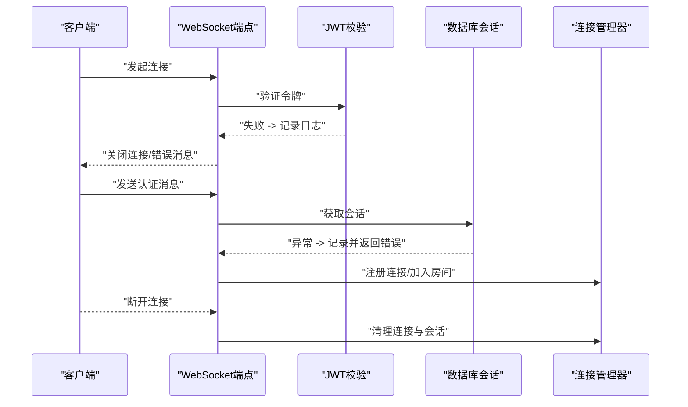
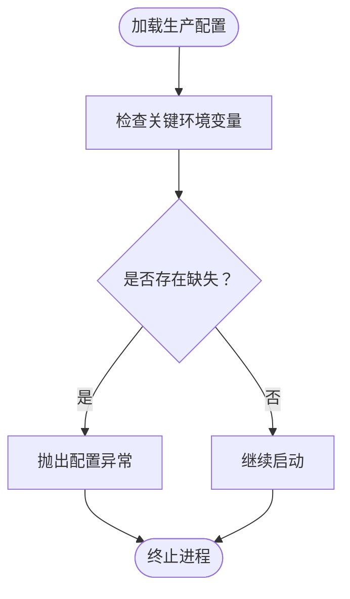
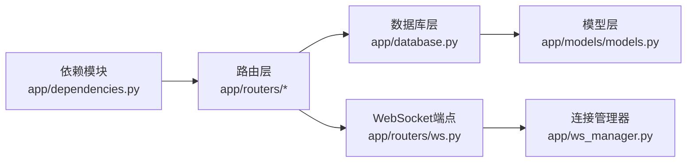

# 错误传播与处理

<cite>
**本文引用的文件**
- [app/main.py](file://app/main.py)
- [app/dependencies.py](file://app/dependencies.py)
- [app/routers/ws.py](file://app/routers/ws.py)
- [app/ws_manager.py](file://app/ws_manager.py)
- [app/database.py](file://app/database.py)
- [app/models/models.py](file://app/models/models.py)
- [app/core/config_production.py](file://app/core/config_production.py)
- [tests/test_websocket.py](file://tests/test_websocket.py)
- [migrations/add_ws_protocol_tables.sql](file://migrations/add_ws_protocol_tables.sql)
</cite>

## 目录
1. [引言](#引言)
2. [项目结构](#项目结构)
3. [核心组件](#核心组件)
4. [架构总览](#架构总览)
5. [详细组件分析](#详细组件分析)
6. [依赖关系分析](#依赖关系分析)
7. [性能考量](#性能考量)
8. [故障排查指南](#故障排查指南)
9. [结论](#结论)
10. [附录](#附录)

## 引言
本文件聚焦 NanTuPy 项目的“错误传播与处理”主题，系统性梳理从路由层到服务层、数据库层以及 WebSocket 层的错误处理策略与传播路径。文档覆盖以下要点：
- HTTP 异常、业务异常与系统异常的区分与处理方式
- 全局异常处理器的配置思路与自定义异常类的定义建议
- 错误信息的标准化格式与错误码体系设计
- WebSocket 连接异常、数据库连接异常与第三方服务异常的特殊处理
- 错误处理流程图与异常转换示例
- 调试模式下的错误输出与生产环境下的错误屏蔽策略
- 在不同组件间传递与转换错误信息的方法

## 项目结构
NanTuPy 的错误处理涉及多个层次：
- 应用入口与依赖注入：通过依赖检查与认证逻辑触发 HTTP 异常
- 路由层：对业务输入进行校验并抛出 HTTP 异常
- 数据库层：连接与事务异常的捕获与再抛出
- WebSocket 层：认证失败与连接断开的处理
- 生产配置：缺失关键环境变量时直接抛出异常，避免静默失败

图表来源
- [app/main.py](file://app/main.py)
- [app/dependencies.py](file://app/dependencies.py)
- [app/routers/ws.py](file://app/routers/ws.py)
- [app/ws_manager.py](file://app/ws_manager.py)
- [app/database.py](file://app/database.py)
- [app/models/models.py](file://app/models/models.py)
- [app/core/config_production.py](file://app/core/config_production.py)

章节来源
- [app/main.py](file://app/main.py)
- [app/dependencies.py](file://app/dependencies.py)
- [app/routers/ws.py](file://app/routers/ws.py)
- [app/ws_manager.py](file://app/ws_manager.py)
- [app/database.py](file://app/database.py)
- [app/models/models.py](file://app/models/models.py)
- [app/core/config_production.py](file://app/core/config_production.py)

## 核心组件
- 依赖与认证异常处理：在依赖解析阶段对 JWT 解析失败、值类型错误等情况统一抛出 HTTP 异常，确保上游无法获得无效凭据。
- 路由层业务异常处理：对必填字段缺失、查询结果不存在等业务场景抛出对应状态码的 HTTP 异常。
- 数据库层异常处理：数据库连接与事务异常被捕获并向上抛出，避免吞掉底层错误。
- WebSocket 层异常处理：认证失败记录日志并拒绝接入；连接断开时清理资源并通知管理器。
- 生产配置异常处理：缺失关键环境变量直接抛出异常，防止在无配置情况下启动。

章节来源
- [app/dependencies.py](file://app/dependencies.py)
- [app/routers/admin.py](file://app/routers/admin.py)
- [app/database.py](file://app/database.py)
- [app/routers/ws.py](file://app/routers/ws.py)
- [app/ws_manager.py](file://app/ws_manager.py)
- [app/core/config_production.py](file://app/core/config_production.py)

## 架构总览
下图展示错误从路由层进入，经依赖注入与认证、数据库访问、WebSocket 处理，最终在客户端呈现的整体传播路径。

图表来源
- [app/dependencies.py](file://app/dependencies.py)
- [app/routers/admin.py](file://app/routers/admin.py)
- [app/database.py](file://app/database.py)
- [app/routers/ws.py](file://app/routers/ws.py)
- [app/ws_manager.py](file://app/ws_manager.py)

## 详细组件分析

### 依赖与认证异常处理
- 场景：JWT 解析失败、值类型错误、属性缺失等
- 处理：捕获特定异常类型并抛出 HTTP 异常，确保上游无法继续使用无效凭据
- 关键点：日志记录与异常类型映射，便于定位问题

图表来源
- [app/dependencies.py](file://app/dependencies.py)

章节来源
- [app/dependencies.py](file://app/dependencies.py)

### 路由层业务异常处理
- 场景：必填字段缺失、查询结果不存在、其他业务异常
- 处理：对缺失字段抛出 400 异常；未找到资源抛出 404；其他异常统一转为 500
- 关键点：明确的状态码与错误信息，便于前端与监控系统识别

图表来源
- [app/routers/admin.py](file://app/routers/admin.py)

章节来源
- [app/routers/admin.py](file://app/routers/admin.py)

### 数据库层异常处理
- 场景：数据库连接失败、事务异常
- 处理：捕获异常并向上抛出，避免吞掉底层错误导致不可追踪
- 关键点：保持异常栈，便于定位 SQL 与驱动层问题

图表来源
- [app/database.py](file://app/database.py)

章节来源
- [app/database.py](file://app/database.py)

### WebSocket 层异常处理
- 场景：认证失败、连接断开、消息处理异常
- 处理：认证失败记录日志并拒绝接入；连接断开时清理连接池与会话；消息处理异常向客户端发送错误消息
- 关键点：使用连接管理器维护用户维度的连接与序号，保证断线重连与去重

图表来源
- [app/routers/ws.py](file://app/routers/ws.py)
- [app/ws_manager.py](file://app/ws_manager.py)

章节来源
- [app/routers/ws.py](file://app/routers/ws.py)
- [app/ws_manager.py](file://app/ws_manager.py)

### 生产配置异常处理
- 场景：缺少 SECRET_KEY、JWT_SECRET_KEY、DATABASE_URL 等关键环境变量
- 处理：启动时直接抛出异常，阻止在不完整配置下运行
- 关键点：避免静默失败导致难以诊断的问题

图表来源
- [app/core/config_production.py](file://app/core/config_production.py)

章节来源
- [app/core/config_production.py](file://app/core/config_production.py)

## 依赖关系分析
- 路由层依赖于依赖模块提供的认证与权限校验，后者负责将底层异常转换为 HTTP 异常
- 数据库层被路由层与 WebSocket 端点调用，异常在调用链中逐级冒泡
- WebSocket 端点依赖连接管理器进行会话与消息序号管理，断开时由管理器清理资源

图表来源
- [app/dependencies.py](file://app/dependencies.py)
- [app/routers/admin.py](file://app/routers/admin.py)
- [app/database.py](file://app/database.py)
- [app/routers/ws.py](file://app/routers/ws.py)
- [app/ws_manager.py](file://app/ws_manager.py)
- [app/models/models.py](file://app/models/models.py)

章节来源
- [app/dependencies.py](file://app/dependencies.py)
- [app/routers/admin.py](file://app/routers/admin.py)
- [app/database.py](file://app/database.py)
- [app/routers/ws.py](file://app/routers/ws.py)
- [app/ws_manager.py](file://app/ws_manager.py)
- [app/models/models.py](file://app/models/models.py)

## 性能考量
- 异常捕获与再抛出的成本较低，但频繁的异常路径会影响吞吐；应优先在上游做输入校验，减少异常发生频率
- WebSocket 层的日志记录需控制级别与频率，避免在高并发下产生大量 I/O
- 数据库异常应尽量在事务边界内快速失败，避免长时间占用连接

## 故障排查指南
- 依赖与认证异常：检查 JWT 生成与传输是否正确，确认密钥与算法一致
- 路由层业务异常：核对请求参数与业务规则，关注 400/404/500 的语义差异
- 数据库异常：查看连接字符串与权限，确认驱动版本兼容性
- WebSocket 异常：关注认证失败日志与断线清理流程，结合连接管理器的状态进行排查
- 生产配置异常：确保所有关键环境变量均已设置且可读

章节来源
- [app/dependencies.py](file://app/dependencies.py)
- [app/routers/admin.py](file://app/routers/admin.py)
- [app/database.py](file://app/database.py)
- [app/routers/ws.py](file://app/routers/ws.py)
- [app/ws_manager.py](file://app/ws_manager.py)
- [app/core/config_production.py](file://app/core/config_production.py)
- [tests/test_websocket.py](file://tests/test_websocket.py)

## 结论
NanTuPy 的错误处理遵循“早发现、早报错、清晰传播”的原则：在依赖与认证阶段即刻拦截无效输入，在路由层明确业务异常的语义，在数据库层保持异常透明，在 WebSocket 层完善连接生命周期管理。建议在此基础上引入统一的全局异常处理器与标准化错误响应格式，进一步提升可观测性与一致性。

## 附录

### 错误信息标准化与错误码体系建议
- 统一响应结构（建议）：包含错误码、错误消息与可选的细节字段，便于前端与监控系统解析
- 错误码分层建议：
  - 400xx：请求参数错误、鉴权失败
  - 404xx：资源不存在
  - 500xx：服务器内部错误
- 与现有代码的对应关系：
  - 400：必填字段缺失
  - 404：资源不存在
  - 500：其他异常转为服务器错误

章节来源
- [app/routers/admin.py](file://app/routers/admin.py)

### 全局异常处理器与自定义异常类
- 全局异常处理器：建议在应用入口处注册，将业务异常与系统异常分别映射到标准 HTTP 响应
- 自定义异常类：可按领域划分（如认证异常、业务规则异常、系统异常），并在处理器中统一转换为 HTTP 异常

### WebSocket 连接异常、数据库连接异常与第三方服务异常的特殊处理
- WebSocket：认证失败记录日志并拒绝接入；断线清理连接池；消息处理异常向客户端发送错误消息
- 数据库：连接失败与事务异常捕获后向上抛出，保持异常栈
- 第三方服务：建议在调用处捕获超时与网络异常，返回可识别的业务异常码

章节来源
- [app/routers/ws.py](file://app/routers/ws.py)
- [app/ws_manager.py](file://app/ws_manager.py)
- [app/database.py](file://app/database.py)

### 调试模式与生产环境的错误策略
- 调试模式：输出更详细的异常堆栈与上下文信息，便于开发与测试
- 生产环境：屏蔽敏感堆栈信息，仅输出通用错误码与消息，同时保留结构化日志以便审计

### 不同组件间的错误传递与转换
- 依赖层：将底层 JWT/值类型错误转换为 HTTP 异常
- 路由层：将业务异常转换为 HTTP 异常
- 数据库层：保持异常透明，交由上层决定是否转换
- WebSocket 层：将认证与连接异常转换为客户端可见的错误消息

章节来源
- [app/dependencies.py](file://app/dependencies.py)
- [app/routers/admin.py](file://app/routers/admin.py)
- [app/database.py](file://app/database.py)
- [app/routers/ws.py](file://app/routers/ws.py)
- [app/ws_manager.py](file://app/ws_manager.py)