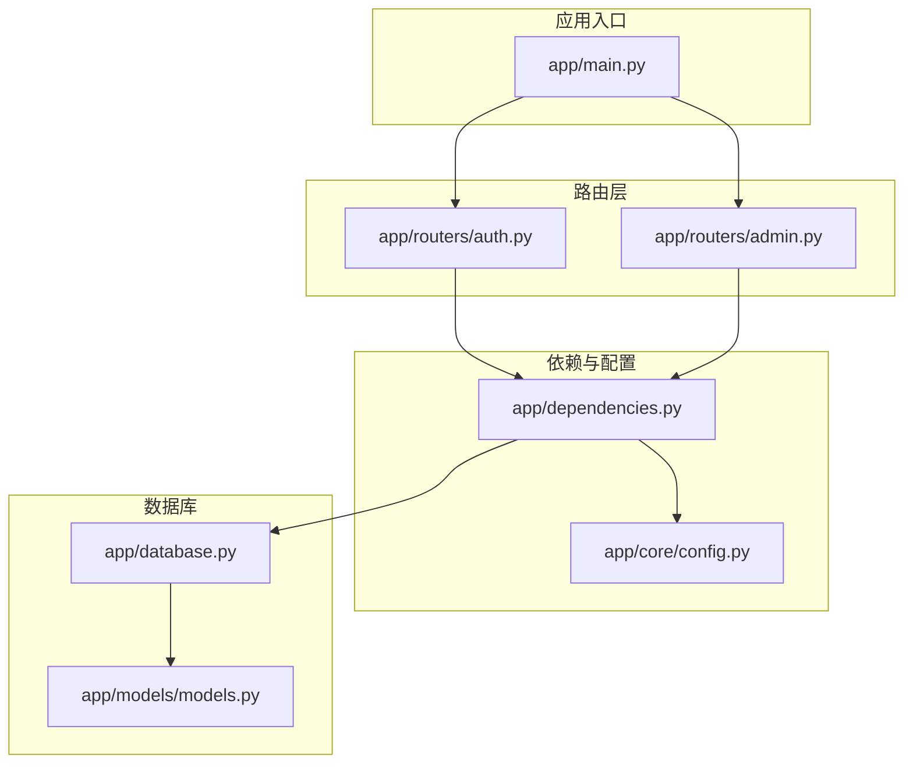
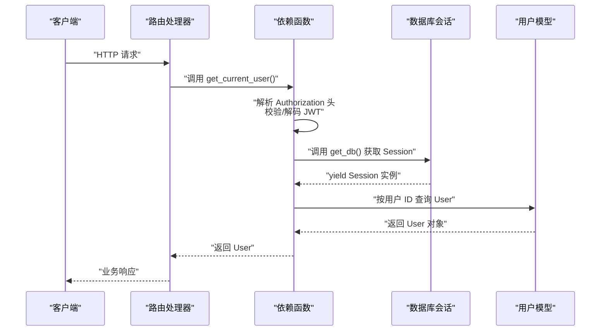
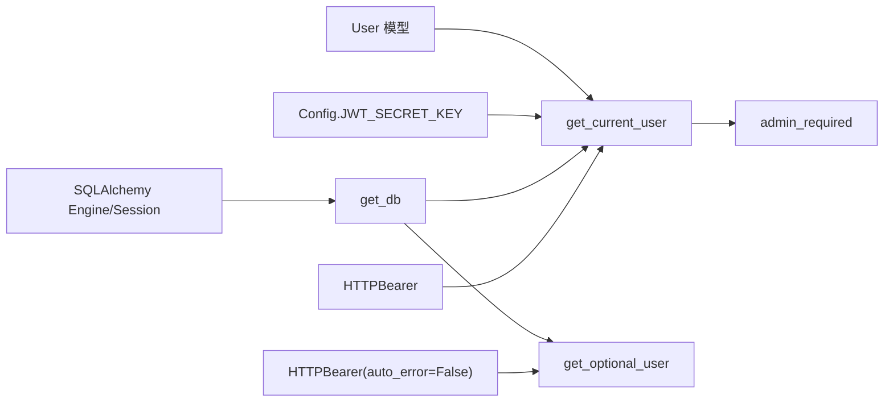

# 依赖注入模式

<cite>
**本文引用的文件**
- [app/dependencies.py](file://app/dependencies.py)
- [app/database.py](file://app/database.py)
- [app/main.py](file://app/main.py)
- [app/models/models.py](file://app/models/models.py)
- [app/core/config.py](file://app/core/config.py)
- [app/routers/auth.py](file://app/routers/auth.py)
- [app/routers/admin.py](file://app/routers/admin.py)
</cite>

## 目录
1. [引言](#引言)
2. [项目结构](#项目结构)
3. [核心组件](#核心组件)
4. [架构总览](#架构总览)
5. [详细组件分析](#详细组件分析)
6. [依赖关系分析](#依赖关系分析)
7. [性能考量](#性能考量)
8. [故障排查指南](#故障排查指南)
9. [结论](#结论)

## 引言
本文件系统性阐述 NanTuPy 项目中基于 FastAPI 的依赖注入模式，重点围绕以下目标展开：
- 解释 FastAPI 依赖注入的核心概念与实现机制
- 深入分析 get_current_user、get_optional_user、admin_required 等关键依赖函数的设计思路与实现细节
- 展示如何通过 Depends 装饰器实现自动化的依赖解析与注入
- 解释依赖链的构建过程，包括 JWT 认证、数据库连接、用户权限验证等多层依赖的组合使用
- 提供具体代码示例路径，展示依赖注入在路由处理函数中的实际应用
- 说明依赖注入如何实现组件间的松耦合设计，提高代码的可测试性与可维护性

## 项目结构
NanTuPy 采用模块化组织方式，依赖注入主要集中在以下模块：
- 依赖定义：app/dependencies.py
- 数据库会话：app/database.py
- 应用入口与路由注册：app/main.py
- 数据模型：app/models/models.py
- 配置：app/core/config.py
- 路由层示例：app/routers/auth.py、app/routers/admin.py

图表来源
- [app/main.py:69-84](file://app/main.py#L69-L84)
- [app/dependencies.py:16-62](file://app/dependencies.py#L16-L62)
- [app/database.py:22-32](file://app/database.py#L22-L32)
- [app/models/models.py:42-98](file://app/models/models.py#L42-L98)
- [app/core/config.py:7-22](file://app/core/config.py#L7-L22)
- [app/routers/auth.py:21-26](file://app/routers/auth.py#L21-L26)
- [app/routers/admin.py:7-11](file://app/routers/admin.py#L7-L11)

章节来源
- [app/main.py:69-84](file://app/main.py#L69-L84)
- [app/dependencies.py:16-62](file://app/dependencies.py#L16-L62)
- [app/database.py:22-32](file://app/database.py#L22-L32)
- [app/models/models.py:42-98](file://app/models/models.py#L42-L98)
- [app/core/config.py:7-22](file://app/core/config.py#L7-L22)
- [app/routers/auth.py:21-26](file://app/routers/auth.py#L21-L26)
- [app/routers/admin.py:7-11](file://app/routers/admin.py#L7-L11)

## 核心组件
本节聚焦依赖注入的关键构件及其职责：
- HTTP 授权与可选授权：HTTPBearer 与 auto_error=False 的可选安全方案
- 数据库会话提供：get_db 作为依赖工厂，负责创建、提交/回滚与关闭 Session
- JWT 用户解析：get_current_user 从 Authorization 头解析 JWT，解码载荷并查询用户
- 可选用户解析：get_optional_user 在未提供或无效令牌时返回 None
- 权限校验：admin_required 对前置依赖 get_current_user 的结果进行管理员权限检查

章节来源
- [app/dependencies.py:12-13](file://app/dependencies.py#L12-L13)
- [app/dependencies.py:16-36](file://app/dependencies.py#L16-L36)
- [app/dependencies.py:39-50](file://app/dependencies.py#L39-L50)
- [app/dependencies.py:53-62](file://app/dependencies.py#L53-L62)
- [app/database.py:22-32](file://app/database.py#L22-L32)

## 架构总览
下图展示了依赖注入在请求生命周期中的解析与注入流程，涵盖 JWT 认证、数据库会话与权限校验的多层依赖链。

图表来源
- [app/dependencies.py:16-36](file://app/dependencies.py#L16-L36)
- [app/database.py:22-32](file://app/database.py#L22-L32)
- [app/models/models.py:42-98](file://app/models/models.py#L42-L98)

## 详细组件分析

### 依赖函数：get_current_user
- 设计思路
  - 使用 HTTPBearer 从 Authorization 头提取凭据
  - 通过配置中的密钥与算法解码 JWT，提取 sub（用户标识）
  - 通过数据库会话查询用户对象，若不存在则抛出未授权错误
- 实现要点
  - 依赖链：HTTPBearer -> get_db -> User 查询
  - 错误处理：JWT 解析失败、过期、用户不存在均映射到 401
- 在路由中的应用
  - 认证保护的端点通过 user: User = Depends(get_current_user) 直接获得当前用户对象

章节来源
- [app/dependencies.py:16-36](file://app/dependencies.py#L16-L36)
- [app/routers/auth.py:253-262](file://app/routers/auth.py#L253-L262)
- [app/routers/auth.py:270-292](file://app/routers/auth.py#L270-L292)

### 依赖函数：get_optional_user
- 设计思路
  - 使用 auto_error=False 的 HTTPBearer，允许缺失或无效令牌
  - 若存在有效令牌，则按 JWT 解码并查询用户；否则返回 None
- 实现要点
  - 与 get_current_user 的差异在于异常处理策略
- 在路由中的应用
  - 公开信息接口可选地识别当前用户，便于区分匿名与登录态访问

章节来源
- [app/dependencies.py:39-50](file://app/dependencies.py#L39-L50)
- [app/routers/auth.py:327-337](file://app/routers/auth.py#L327-L337)

### 依赖函数：admin_required
- 设计思路
  - 基于前置依赖 get_current_user，仅当用户存在且 is_admin 为真时放行
  - 否则抛出 403 禁止访问
- 实现要点
  - 将权限校验逻辑抽象为可复用依赖，减少重复代码
- 在路由中的应用
  - 管理员专属端点通过 user: User = Depends(admin_required) 获得已认证管理员身份

章节来源
- [app/dependencies.py:53-62](file://app/dependencies.py#L53-L62)
- [app/routers/admin.py:14-33](file://app/routers/admin.py#L14-L33)
- [app/routers/admin.py:36-58](file://app/routers/admin.py#L36-L58)
- [app/routers/admin.py:61-77](file://app/routers/admin.py#L61-L77)

### 数据库依赖：get_db
- 设计思路
  - 以生成器形式提供数据库会话，确保请求结束后自动 commit/rollback/close
- 实现要点
  - try/except/finally 结构保证异常时回滚并重新抛出
  - 与 SQLAlchemy 会话生命周期配合，避免资源泄漏
- 在依赖链中的作用
  - 为 JWT 用户解析与业务操作提供统一的数据库上下文

章节来源
- [app/database.py:22-32](file://app/database.py#L22-L32)

### 配置与密钥
- 设计思路
  - 通过 Config 类集中管理密钥与数据库连接字符串
  - JWT_SECRET_KEY 用于 JWT 解码
- 实现要点
  - 从环境变量读取，便于部署时灵活配置

章节来源
- [app/core/config.py:7-22](file://app/core/config.py#L7-L22)
- [app/dependencies.py:23](file://app/dependencies.py#L23)

### 路由层示例：认证与管理
- 认证路由（auth.py）
  - 注册、登录、个人信息、隐私设置、密码修改、注销、令牌刷新等端点
  - 大量使用 Depends(get_current_user) 或 Depends(get_optional_user) 获得用户上下文
- 管理路由（admin.py）
  - 敏感词管理等端点通过 Depends(admin_required) 限制访问

章节来源
- [app/routers/auth.py:184-212](file://app/routers/auth.py#L184-L212)
- [app/routers/auth.py:215-246](file://app/routers/auth.py#L215-L246)
- [app/routers/auth.py:253-262](file://app/routers/auth.py#L253-L262)
- [app/routers/auth.py:270-292](file://app/routers/auth.py#L270-L292)
- [app/routers/auth.py:327-337](file://app/routers/auth.py#L327-L337)
- [app/routers/admin.py:14-33](file://app/routers/admin.py#L14-L33)
- [app/routers/admin.py:36-58](file://app/routers/admin.py#L36-L58)
- [app/routers/admin.py:61-77](file://app/routers/admin.py#L61-L77)

## 依赖关系分析
- 组件耦合与内聚
  - 依赖函数与路由层通过 Depends 解耦，路由仅关心参数类型与行为，不关心实现细节
  - 数据库依赖与模型层分离，便于替换存储后端
- 直接与间接依赖
  - get_current_user 直接依赖 security（HTTPBearer）与 get_db
  - admin_required 间接依赖 get_current_user，形成链式依赖
- 外部依赖与集成点
  - JWT 解析依赖 jose/jwt
  - 数据库依赖 SQLAlchemy 与配置中的连接字符串
- 接口契约
  - 依赖函数通过明确的返回类型（如 User）与异常类型（HTTPException）与上层约定契约

图表来源
- [app/dependencies.py:12-13](file://app/dependencies.py#L12-L13)
- [app/dependencies.py:16-36](file://app/dependencies.py#L16-L36)
- [app/dependencies.py:39-50](file://app/dependencies.py#L39-L50)
- [app/dependencies.py:53-62](file://app/dependencies.py#L53-L62)
- [app/database.py:22-32](file://app/database.py#L22-L32)
- [app/core/config.py:10](file://app/core/config.py#L10)
- [app/models/models.py:42-98](file://app/models/models.py#L42-L98)

章节来源
- [app/dependencies.py:12-13](file://app/dependencies.py#L12-L13)
- [app/dependencies.py:16-36](file://app/dependencies.py#L16-L36)
- [app/dependencies.py:39-50](file://app/dependencies.py#L39-L50)
- [app/dependencies.py:53-62](file://app/dependencies.py#L53-L62)
- [app/database.py:22-32](file://app/database.py#L22-L32)
- [app/core/config.py:10](file://app/core/config.py#L10)
- [app/models/models.py:42-98](file://app/models/models.py#L42-L98)

## 性能考量
- 数据库连接池
  - 通过配置项控制连接池大小、溢出与回收策略，有助于提升并发下的数据库访问效率
- 会话生命周期
  - get_db 在 try/finally 中确保会话关闭，避免连接泄漏
- JWT 解析成本
  - 解码与数据库查询为同步阻塞操作，建议结合异步适配与缓存策略优化高并发场景
- 依赖链长度
  - 链式依赖（如 admin_required -> get_current_user -> get_db）在请求处理中按需解析，保持较低开销

章节来源
- [app/database.py:9-16](file://app/database.py#L9-L16)
- [app/database.py:22-32](file://app/database.py#L22-L32)
- [app/core/config.py:20](file://app/core/config.py#L20)

## 故障排查指南
- 401 未授权
  - 可能原因：缺少 Authorization 头、令牌无效或过期、用户不存在
  - 定位方法：检查 get_current_user 的 JWT 解析与用户查询分支
- 403 禁止访问
  - 可能原因：当前用户非管理员
  - 定位方法：确认 admin_required 的前置依赖是否正确传递
- 数据库异常
  - 可能原因：事务未提交或回滚导致状态不一致
  - 定位方法：检查 get_db 的异常处理与 finally 分支
- 配置问题
  - 可能原因：JWT_SECRET_KEY 或数据库连接字符串不正确
  - 定位方法：核对 Config 中的密钥与连接串

章节来源
- [app/dependencies.py:25-35](file://app/dependencies.py#L25-L35)
- [app/dependencies.py:57-61](file://app/dependencies.py#L57-L61)
- [app/database.py:28-32](file://app/database.py#L28-L32)
- [app/core/config.py:10](file://app/core/config.py#L10)

## 结论
NanTuPy 的依赖注入模式通过明确的依赖函数与清晰的依赖链，实现了认证、数据库与权限控制的模块化与可复用性。该模式具备以下优势：
- 松耦合：路由层仅依赖类型与契约，不关心具体实现
- 可测试性：可通过替换依赖函数快速构造测试场景
- 可维护性：权限与认证逻辑集中抽象，便于统一演进
- 可扩展性：新增依赖只需遵循现有模式，即可无缝融入现有链路