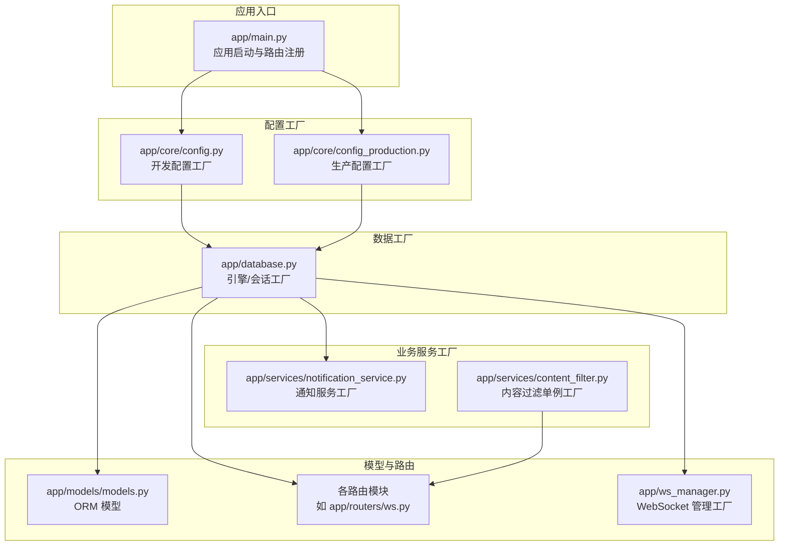
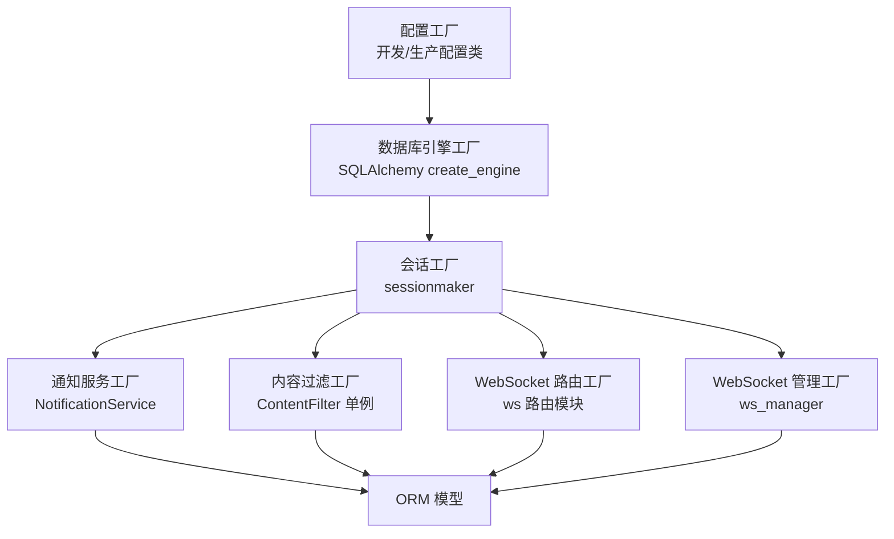
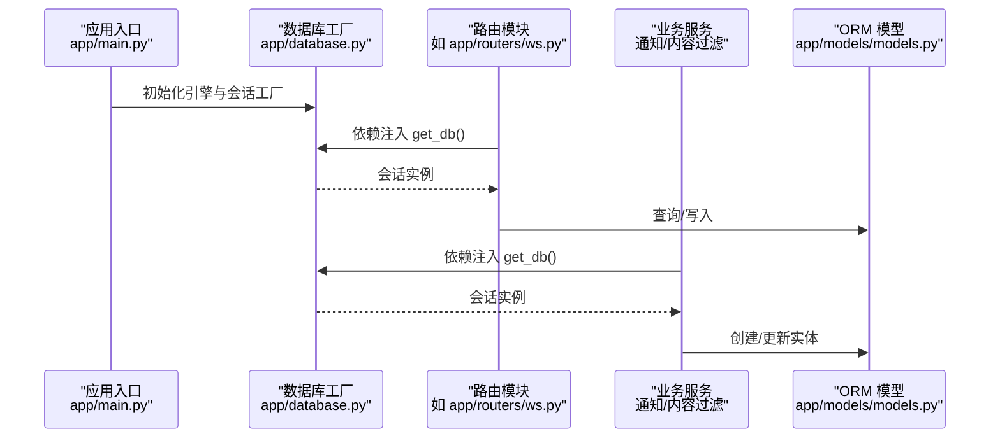
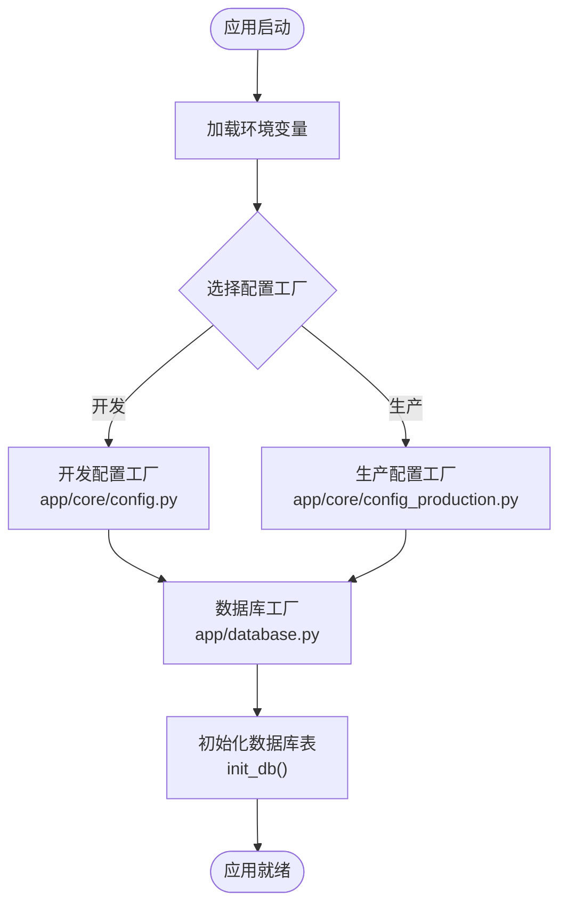
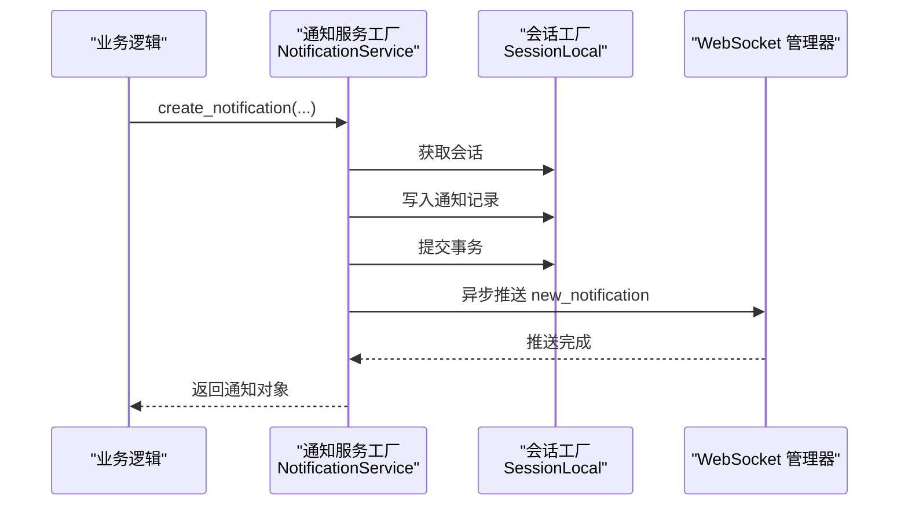
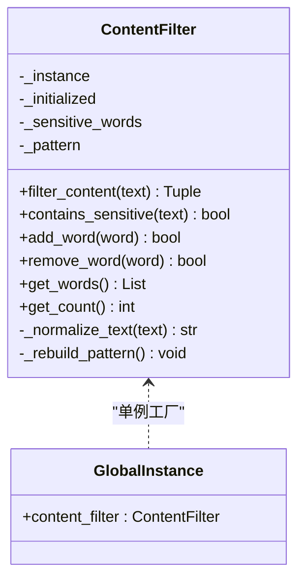
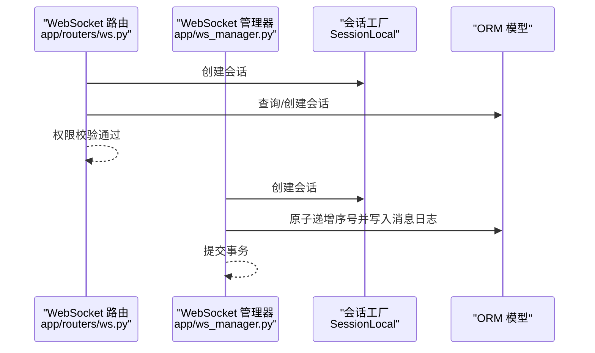
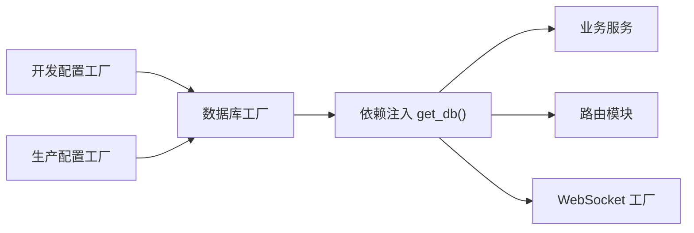

# 工厂模式

<cite>
**本文引用的文件**
- [app/main.py](file://app/main.py)
- [app/database.py](file://app/database.py)
- [app/core/config.py](file://app/core/config.py)
- [app/core/config_production.py](file://app/core/config_production.py)
- [app/services/notification_service.py](file://app/services/notification_service.py)
- [app/services/content_filter.py](file://app/services/content_filter.py)
- [app/models/models.py](file://app/models/models.py)
- [app/routers/ws.py](file://app/routers/ws.py)
- [app/ws_manager.py](file://app/ws_manager.py)
- [app/dependencies.py](file://app/dependencies.py)
</cite>

## 目录
1. [引言](#引言)
2. [项目结构](#项目结构)
3. [核心组件](#核心组件)
4. [架构总览](#架构总览)
5. [详细组件分析](#详细组件分析)
6. [依赖分析](#依赖分析)
7. [性能考虑](#性能考虑)
8. [故障排查指南](#故障排查指南)
9. [结论](#结论)

## 引言
本文件系统性梳理 NanTuPy 项目中“工厂模式”的落地实践，重点覆盖以下方面：
- 数据库连接池的工厂实现：通过配置驱动的引擎工厂，统一创建与管理连接池参数，确保不同环境的一致性与可调优性。
- 配置管理中的工厂模式应用：通过开发与生产配置类的差异化封装，实现环境级别的动态切换与参数工厂化。
- 服务实例创建中的工厂思想：以统一接口创建与复用服务实例，降低耦合并提升可维护性。
- 通过具体代码路径与流程图，解释工厂方法如何简化复杂对象的创建过程，以及如何提升系统的可扩展性与可维护性。

## 项目结构
NanTuPy 采用 FastAPI + SQLAlchemy 的分层架构，工厂模式主要体现在：
- 配置层：开发与生产配置类作为“工厂”，按需产出不同环境的配置对象。
- 数据访问层：数据库引擎与会话工厂，集中于数据库模块，统一连接池参数与生命周期管理。
- 业务服务层：通知服务、内容过滤服务等以静态方法或单例形式提供统一创建/使用接口。
- 路由与中间件：通过依赖注入与全局初始化，将工厂产出的对象注入到各路由处理流程。

图表来源
- [app/main.py:39-84](file://app/main.py#L39-L84)
- [app/core/config.py:7-43](file://app/core/config.py#L7-L43)
- [app/core/config_production.py:4-49](file://app/core/config_production.py#L4-L49)
- [app/database.py:9-38](file://app/database.py#L9-L38)
- [app/services/notification_service.py:14-233](file://app/services/notification_service.py#L14-L233)
- [app/services/content_filter.py:13-192](file://app/services/content_filter.py#L13-L192)
- [app/models/models.py:1-655](file://app/models/models.py#L1-L655)
- [app/routers/ws.py:42-86](file://app/routers/ws.py#L42-L86)
- [app/ws_manager.py:170-204](file://app/ws_manager.py#L170-L204)

章节来源
- [app/main.py:39-84](file://app/main.py#L39-L84)
- [app/database.py:9-38](file://app/database.py#L9-L38)

## 核心组件
- 配置工厂（开发/生产）
  - 开发配置类集中定义默认参数与环境变量读取策略；生产配置类强制要求关键环境变量，提供更严格的参数集合。
  - 两者均通过类属性形成“工厂输出”，供数据库引擎工厂与其它模块消费。
- 数据库工厂
  - 基于配置工厂输出的数据库连接字符串与引擎选项，创建 SQLAlchemy 引擎与会话工厂。
  - 提供 get_db 依赖注入函数，统一事务提交/回滚/关闭逻辑。
- 服务工厂
  - 通知服务：提供统一的通知创建与推送接口，内部通过会话工厂获取数据库会话，保证创建与推送的一致性。
  - 内容过滤服务：采用单例工厂模式，提供敏感词过滤、动态词库管理与日志记录能力。
- WebSocket 工厂
  - WebSocket 管理器与路由模块通过会话工厂创建数据库会话，完成序号原子递增、消息持久化与权限校验等工厂化操作。

章节来源
- [app/core/config.py:7-43](file://app/core/config.py#L7-L43)
- [app/core/config_production.py:4-49](file://app/core/config_production.py#L4-L49)
- [app/database.py:9-38](file://app/database.py#L9-L38)
- [app/services/notification_service.py:14-233](file://app/services/notification_service.py#L14-L233)
- [app/services/content_filter.py:13-192](file://app/services/content_filter.py#L13-L192)
- [app/ws_manager.py:170-204](file://app/ws_manager.py#L170-L204)
- [app/routers/ws.py:42-86](file://app/routers/ws.py#L42-L86)

## 架构总览
下图展示了工厂模式在应用中的交互关系：配置工厂决定数据库工厂的参数，数据库工厂为业务服务与路由提供统一的会话来源；服务工厂通过统一接口创建与使用资源，实现解耦与复用。

图表来源
- [app/core/config.py:7-43](file://app/core/config.py#L7-L43)
- [app/core/config_production.py:4-49](file://app/core/config_production.py#L4-L49)
- [app/database.py:9-38](file://app/database.py#L9-L38)
- [app/services/notification_service.py:14-233](file://app/services/notification_service.py#L14-L233)
- [app/services/content_filter.py:13-192](file://app/services/content_filter.py#L13-L192)
- [app/routers/ws.py:42-86](file://app/routers/ws.py#L42-L86)
- [app/ws_manager.py:170-204](file://app/ws_manager.py#L170-L204)
- [app/models/models.py:1-655](file://app/models/models.py#L1-L655)

## 详细组件分析

### 数据库连接池工厂（引擎与会话）
- 工厂职责
  - 依据配置工厂输出的数据库连接字符串与引擎选项，创建 SQLAlchemy 引擎。
  - 基于引擎创建会话工厂，提供统一的会话创建与生命周期管理。
  - 提供 get_db 依赖注入函数，自动处理事务提交/回滚/关闭。
- 关键点
  - 连接池参数（如 pool_size、max_overflow、pool_recycle、pool_pre_ping）由配置工厂统一提供，确保开发与生产环境一致的连接池行为。
  - init_db 统一创建所有表，保障应用启动时的数据库一致性。
- 使用场景
  - 所有路由与服务通过 get_db 获取会话，避免重复创建与资源泄漏。
  - WebSocket 路由与管理器同样通过会话工厂创建会话，完成原子序号递增与消息持久化。

图表来源
- [app/main.py:39-84](file://app/main.py#L39-L84)
- [app/database.py:9-38](file://app/database.py#L9-L38)
- [app/routers/ws.py:42-86](file://app/routers/ws.py#L42-L86)
- [app/models/models.py:1-655](file://app/models/models.py#L1-L655)

章节来源
- [app/database.py:9-38](file://app/database.py#L9-L38)
- [app/routers/ws.py:42-86](file://app/routers/ws.py#L42-L86)
- [app/ws_manager.py:170-204](file://app/ws_manager.py#L170-L204)

### 配置管理工厂（开发/生产）
- 工厂职责
  - 开发配置类：提供默认参数与宽松的环境变量要求，便于本地开发。
  - 生产配置类：强制关键环境变量（如密钥与数据库地址），并提供更严格的连接池参数。
- 切换机制
  - 通过导入不同的配置类，实现开发与生产环境的动态切换。
  - 数据库工厂与其它模块仅依赖配置类提供的属性，不直接感知环境差异。
- 优势
  - 将环境差异收敛在配置层，降低对上层业务的影响。
  - 便于 CI/CD 中通过环境变量控制运行时行为。

图表来源
- [app/core/config.py:7-43](file://app/core/config.py#L7-L43)
- [app/core/config_production.py:4-49](file://app/core/config_production.py#L4-L49)
- [app/database.py:35-38](file://app/database.py#L35-L38)
- [app/main.py:30-36](file://app/main.py#L30-L36)

章节来源
- [app/core/config.py:7-43](file://app/core/config.py#L7-L43)
- [app/core/config_production.py:4-49](file://app/core/config_production.py#L4-L49)
- [app/database.py:9-38](file://app/database.py#L9-L38)
- [app/main.py:30-36](file://app/main.py#L30-L36)

### 通知服务工厂
- 工厂职责
  - 提供统一的通知创建接口，内部通过会话工厂获取数据库会话，保证事务一致性。
  - 提供多种通知类型的快速创建方法（点赞、评论、好友请求、消息、提及等）。
  - 异步推送 WebSocket 新通知事件，确保实时性与可靠性。
- 使用方式
  - 调用方无需关心会话创建与事务处理细节，直接通过静态方法创建通知。
  - 若调用方已有会话，可传入 db 参数复用，减少资源开销。

图表来源
- [app/services/notification_service.py:14-233](file://app/services/notification_service.py#L14-L233)
- [app/database.py:17-18](file://app/database.py#L17-L18)

章节来源
- [app/services/notification_service.py:14-233](file://app/services/notification_service.py#L14-L233)
- [app/database.py:17-18](file://app/database.py#L17-L18)

### 内容过滤服务工厂（单例）
- 工厂职责
  - 采用单例工厂模式，提供敏感词过滤、动态词库管理与日志记录能力。
  - 支持字符变体归一化、正则模式重建与命中词统计。
- 使用方式
  - 通过全局单例对象统一使用，避免重复初始化与状态不一致问题。
  - 支持运行时动态增删敏感词，满足业务规则变更需求。

图表来源
- [app/services/content_filter.py:13-192](file://app/services/content_filter.py#L13-L192)

章节来源
- [app/services/content_filter.py:13-192](file://app/services/content_filter.py#L13-L192)

### WebSocket 工厂（会话与消息持久化）
- 工厂职责
  - 路由模块通过会话工厂创建会话，完成会话查询/创建与权限校验。
  - WebSocket 管理器通过会话工厂完成用户序号原子递增与消息持久化，确保消息有序与可恢复。
- 使用方式
  - 所有需要数据库操作的 WebSocket 场景，均通过会话工厂创建会话，保证事务一致性与资源回收。

图表来源
- [app/routers/ws.py:42-86](file://app/routers/ws.py#L42-L86)
- [app/ws_manager.py:170-204](file://app/ws_manager.py#L170-L204)
- [app/database.py:17-18](file://app/database.py#L17-L18)

章节来源
- [app/routers/ws.py:42-86](file://app/routers/ws.py#L42-L86)
- [app/ws_manager.py:170-204](file://app/ws_manager.py#L170-L204)
- [app/database.py:17-18](file://app/database.py#L17-L18)

## 依赖分析
- 配置工厂与数据库工厂
  - 配置工厂输出连接字符串与引擎选项，数据库工厂据此创建引擎与会话工厂。
- 数据库工厂与业务服务
  - 业务服务通过 get_db 依赖注入获取会话，实现统一的事务与资源管理。
- WebSocket 工厂与 ORM
  - WebSocket 路由与管理器通过会话工厂与 ORM 模型协作，完成消息序号与持久化。

图表来源
- [app/core/config.py:7-43](file://app/core/config.py#L7-L43)
- [app/core/config_production.py:4-49](file://app/core/config_production.py#L4-L49)
- [app/database.py:22-32](file://app/database.py#L22-L32)
- [app/services/notification_service.py:14-233](file://app/services/notification_service.py#L14-L233)
- [app/routers/ws.py:42-86](file://app/routers/ws.py#L42-L86)
- [app/ws_manager.py:170-204](file://app/ws_manager.py#L170-L204)

章节来源
- [app/core/config.py:7-43](file://app/core/config.py#L7-L43)
- [app/core/config_production.py:4-49](file://app/core/config_production.py#L4-L49)
- [app/database.py:22-32](file://app/database.py#L22-L32)

## 性能考虑
- 连接池参数
  - 通过配置工厂统一管理 pool_size、max_overflow、pool_recycle、pool_pre_ping，确保在高并发场景下的稳定性与资源利用率。
- 事务与会话
  - get_db 自动提交/回滚/关闭，避免长事务与连接泄漏，降低数据库压力。
- 单例服务
  - 内容过滤服务采用单例，避免重复初始化与正则编译开销，提升过滤性能。
- 异步推送
  - 通知服务的 WebSocket 推送采用异步执行，避免阻塞主线程，提升响应速度。

## 故障排查指南
- 配置缺失
  - 生产环境必须提供密钥与数据库地址，否则配置工厂会抛出异常。请检查环境变量是否正确设置。
- 数据库连接失败
  - 检查配置工厂输出的连接字符串与引擎选项；确认数据库服务可用与网络连通。
- 通知推送失败
  - 查看通知服务的日志输出与 WebSocket 管理器的异常信息，确认会话创建与事务提交是否成功。
- 内容过滤异常
  - 检查敏感词词库状态与正则模式重建逻辑，确认动态增删词后的日志输出。

章节来源
- [app/core/config_production.py:8-19](file://app/core/config_production.py#L8-L19)
- [app/services/notification_service.py:20-53](file://app/services/notification_service.py#L20-L53)
- [app/services/content_filter.py:164-184](file://app/services/content_filter.py#L164-L184)

## 结论
NanTuPy 通过“配置工厂 + 数据库工厂 + 服务工厂”的组合，实现了：
- 环境级别的动态切换与参数工厂化；
- 数据库连接池的统一创建与管理；
- 业务服务的统一创建接口与资源复用；
- 运行时的配置调整与功能扩展支持。

该设计显著提升了系统的可扩展性与可维护性，降低了环境差异与复杂对象创建带来的风险。