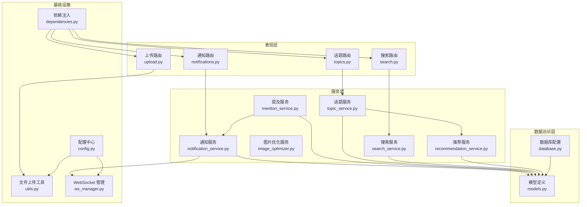
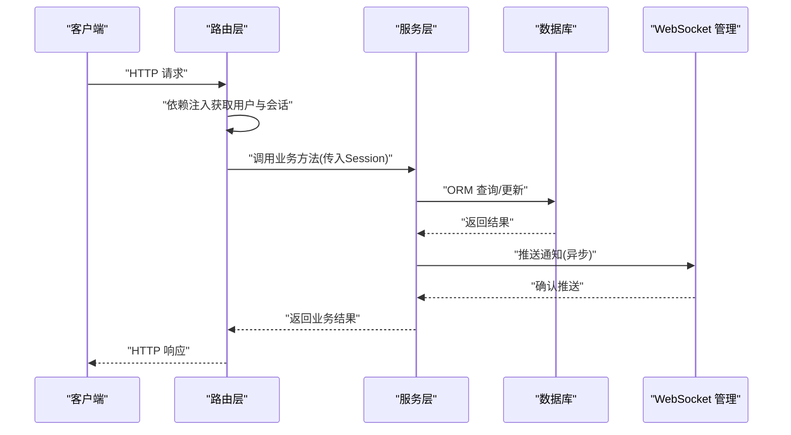
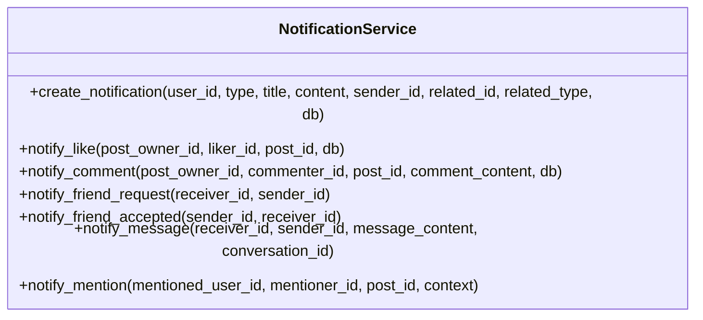
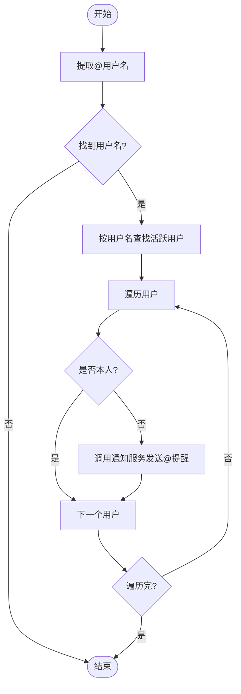
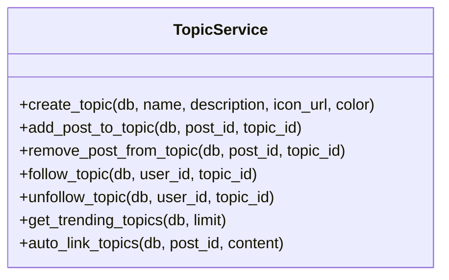
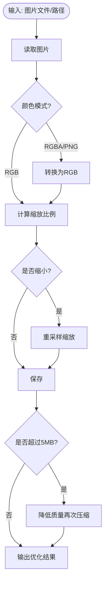
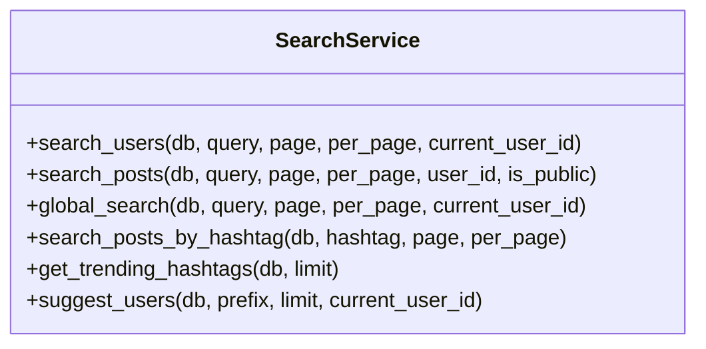
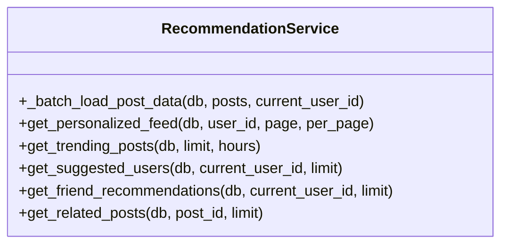
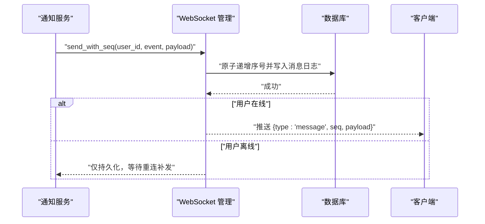
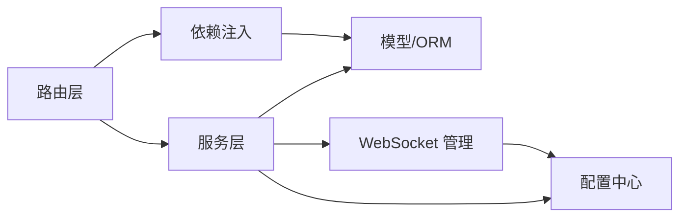

# 服务层模式

<cite>
**本文档引用的文件**
- [app/main.py](file://app/main.py)
- [app/dependencies.py](file://app/dependencies.py)
- [app/database.py](file://app/database.py)
- [app/models/models.py](file://app/models/models.py)
- [app/services/notification_service.py](file://app/services/notification_service.py)
- [app/services/mention_service.py](file://app/services/mention_service.py)
- [app/services/topic_service.py](file://app/services/topic_service.py)
- [app/services/image_optimizer.py](file://app/services/image_optimizer.py)
- [app/services/search_service.py](file://app/services/search_service.py)
- [app/services/recommendation_service.py](file://app/services/recommendation_service.py)
- [app/routers/notifications.py](file://app/routers/notifications.py)
- [app/routers/topics.py](file://app/routers/topics.py)
- [app/routers/upload.py](file://app/routers/upload.py)
- [app/routers/search.py](file://app/routers/search.py)
- [app/utils.py](file://app/utils.py)
- [app/ws_manager.py](file://app/ws_manager.py)
- [app/core/config.py](file://app/core/config.py)
</cite>

## 目录
1. [引言](#引言)
2. [项目结构](#项目结构)
3. [核心组件](#核心组件)
4. [架构总览](#架构总览)
5. [详细组件分析](#详细组件分析)
6. [依赖分析](#依赖分析)
7. [性能考虑](#性能考虑)
8. [故障排查指南](#故障排查指南)
9. [结论](#结论)
10. [附录](#附录)

## 引言
本文件系统性阐述 NanTuPy 项目的“服务层模式”设计与实现。服务层作为业务逻辑的抽象与封装单元，向上承接表现层（API 路由），向下对接数据访问层（SQLAlchemy ORM），并通过统一的接口设计与依赖注入机制，实现业务规则的复用、可测试性与可维护性的提升。本文将重点解析通知服务、提及服务、话题服务、图片优化服务、搜索服务与推荐服务的职责边界与协作关系，并结合 WebSocket 管理与文件上传工具，展示服务层在真实业务场景中的落地实践。

## 项目结构
NanTuPy 采用 FastAPI + SQLAlchemy 的分层架构：
- 表现层（Routers）：负责 HTTP/WebSocket 请求接入与参数解析，调用服务层执行业务逻辑。
- 服务层（Services）：封装复杂业务规则与跨模型操作，提供稳定接口供路由层调用。
- 数据访问层（Models/Database）：定义数据模型与数据库连接，提供 ORM 会话与基础 CRUD 能力。
- 工具与基础设施：文件上传、WebSocket 管理、配置与依赖注入等。

图表来源
- [app/routers/notifications.py:1-208](file://app/routers/notifications.py#L1-L208)
- [app/routers/topics.py:1-282](file://app/routers/topics.py#L1-L282)
- [app/routers/upload.py:1-224](file://app/routers/upload.py#L1-L224)
- [app/routers/search.py:1-269](file://app/routers/search.py#L1-L269)
- [app/services/notification_service.py:1-233](file://app/services/notification_service.py#L1-L233)
- [app/services/mention_service.py:1-118](file://app/services/mention_service.py#L1-L118)
- [app/services/topic_service.py:1-277](file://app/services/topic_service.py#L1-L277)
- [app/services/image_optimizer.py:1-230](file://app/services/image_optimizer.py#L1-L230)
- [app/services/search_service.py:1-179](file://app/services/search_service.py#L1-L179)
- [app/services/recommendation_service.py:1-457](file://app/services/recommendation_service.py#L1-L457)
- [app/models/models.py:1-655](file://app/models/models.py#L1-L655)
- [app/database.py:1-38](file://app/database.py#L1-L38)
- [app/utils.py:1-220](file://app/utils.py#L1-L220)
- [app/ws_manager.py:1-308](file://app/ws_manager.py#L1-L308)
- [app/core/config.py:1-43](file://app/core/config.py#L1-L43)

章节来源
- [app/main.py:1-110](file://app/main.py#L1-L110)
- [app/dependencies.py:1-63](file://app/dependencies.py#L1-L63)
- [app/database.py:1-38](file://app/database.py#L1-L38)
- [app/models/models.py:1-655](file://app/models/models.py#L1-L655)

## 核心组件
- 服务层接口设计原则
  - 显式 Session 参数传递：服务方法接收 SQLAlchemy Session，确保事务边界清晰、可测试性强。
  - 静态方法封装：通过静态方法暴露纯业务逻辑，便于路由层直接调用。
  - 返回标准化数据结构：统一返回字典或列表，便于路由层序列化。
- 依赖注入与认证
  - 通过 FastAPI 依赖注入获取当前用户与数据库会话，路由层无需关心认证细节。
- 服务间协作
  - 服务层之间通过方法调用协作，避免在路由层拼装业务逻辑。
  - 通知服务与 WebSocket 管理器配合，实现实时推送。

章节来源
- [app/services/notification_service.py:1-233](file://app/services/notification_service.py#L1-L233)
- [app/services/mention_service.py:1-118](file://app/services/mention_service.py#L1-L118)
- [app/services/topic_service.py:1-277](file://app/services/topic_service.py#L1-L277)
- [app/services/search_service.py:1-179](file://app/services/search_service.py#L1-L179)
- [app/services/recommendation_service.py:1-457](file://app/services/recommendation_service.py#L1-L457)
- [app/dependencies.py:1-63](file://app/dependencies.py#L1-L63)

## 架构总览
服务层模式通过“路由层-服务层-数据访问层”的分层解耦，实现：
- 业务规则集中：复杂规则在服务层统一实现，避免分散在路由层。
- 事务控制明确：服务方法显式持有 Session，保证事务一致性。
- 可测试性：静态方法与显式参数使单元测试易于构造输入与断言输出。
- 可维护性：职责清晰的服务模块便于演进与重构。

图表来源
- [app/routers/notifications.py:1-208](file://app/routers/notifications.py#L1-L208)
- [app/services/notification_service.py:1-233](file://app/services/notification_service.py#L1-L233)
- [app/ws_manager.py:1-308](file://app/ws_manager.py#L1-L308)
- [app/database.py:1-38](file://app/database.py#L1-L38)

## 详细组件分析

### 通知服务（NotificationService）
- 职责边界
  - 创建通知、推送通知、统计未读数、处理各类业务场景（点赞、评论、好友请求、消息、@提及）。
  - 封装 WebSocket 推送逻辑，确保实时性与可靠性。
- 设计要点
  - 静态方法 + 显式 Session：支持外部传入 Session 以复用事务。
  - 异步推送：在通知创建后异步触发 WebSocket 推送，避免阻塞主流程。
  - 未读统计：推送前后计算未读数，保障前端状态一致。
- 代码示例路径
  - [通知创建与推送:55-85](file://app/services/notification_service.py#L55-L85)
  - [点赞通知:87-112](file://app/services/notification_service.py#L87-L112)
  - [评论通知:115-141](file://app/services/notification_service.py#L115-L141)
  - [好友请求通知:144-162](file://app/services/notification_service.py#L144-L162)
  - [消息通知:187-209](file://app/services/notification_service.py#L187-L209)
  - [提及通知:212-233](file://app/services/notification_service.py#L212-L233)

图表来源
- [app/services/notification_service.py:1-233](file://app/services/notification_service.py#L1-L233)

章节来源
- [app/services/notification_service.py:1-233](file://app/services/notification_service.py#L1-L233)
- [app/routers/notifications.py:1-208](file://app/routers/notifications.py#L1-L208)

### 提及服务（MentionService）
- 职责边界
  - 从文本中提取 @用户名，查找活跃用户，过滤自提，发送通知。
- 设计要点
  - 与通知服务解耦：仅负责识别与派发，不关心具体通知类型细节。
  - 去重与边界处理：用户名去重、忽略自己提及、上下文截断。
- 代码示例路径
  - [提取与查找:9-45](file://app/services/mention_service.py#L9-L45)
  - [处理提及:48-94](file://app/services/mention_service.py#L48-L94)
  - [格式化通知:97-118](file://app/services/mention_service.py#L97-L118)

图表来源
- [app/services/mention_service.py:1-118](file://app/services/mention_service.py#L1-L118)

章节来源
- [app/services/mention_service.py:1-118](file://app/services/mention_service.py#L1-L118)

### 话题服务（TopicService）
- 职责边界
  - 话题创建、查询、关联帖子、关注/取消关注、趋势话题、话题统计更新、哈希标签自动链接。
- 设计要点
  - 使用原生 SQL 辅助表操作，保证多对多关系的高效维护。
  - 批量统计与排序：基于时间窗口与热度指标的综合排序。
- 代码示例路径
  - [创建话题:14-26](file://app/services/topic_service.py#L14-L26)
  - [添加/移除帖子到话题:37-73](file://app/services/topic_service.py#L37-L73)
  - [关注/取消关注:116-152](file://app/services/topic_service.py#L116-L152)
  - [热门话题:200-220](file://app/services/topic_service.py#L200-L220)
  - [自动链接话题:248-257](file://app/services/topic_service.py#L248-L257)

图表来源
- [app/services/topic_service.py:1-277](file://app/services/topic_service.py#L1-L277)

章节来源
- [app/services/topic_service.py:1-277](file://app/services/topic_service.py#L1-L277)
- [app/routers/topics.py:1-282](file://app/routers/topics.py#L1-L282)

### 图片优化服务（ImageOptimizer）
- 职责边界
  - 图片压缩、缩略图生成、信息获取、文件尺寸与质量控制。
- 设计要点
  - 面向对象封装：静态方法提供统一接口，内部处理异常与回退策略。
  - 自适应质量调整：当压缩后仍超限，自动降低质量再次压缩。
- 代码示例路径
  - [优化图片:16-112](file://app/services/image_optimizer.py#L16-L112)
  - [生成缩略图:115-160](file://app/services/image_optimizer.py#L115-L160)
  - [压缩文件:163-196](file://app/services/image_optimizer.py#L163-L196)
  - [获取图片信息:199-229](file://app/services/image_optimizer.py#L199-L229)

图表来源
- [app/services/image_optimizer.py:1-230](file://app/services/image_optimizer.py#L1-L230)

章节来源
- [app/services/image_optimizer.py:1-230](file://app/services/image_optimizer.py#L1-L230)

### 搜索服务（SearchService）
- 职责边界
  - 用户搜索、帖子搜索、全局搜索、按标签搜索、热门标签、用户建议。
- 设计要点
  - 统一排序与分页：基于模糊匹配与字段权重排序。
  - 批量序列化：与推荐服务共享批量数据加载，避免 N+1。
- 代码示例路径
  - [搜索用户:12-51](file://app/services/search_service.py#L12-L51)
  - [搜索帖子:63-89](file://app/services/search_service.py#L63-L89)
  - [全局搜索:92-111](file://app/services/search_service.py#L92-L111)
  - [按标签搜索:114-138](file://app/services/search_service.py#L114-L138)
  - [热门标签:141-157](file://app/services/search_service.py#L141-L157)
  - [用户建议:160-179](file://app/services/search_service.py#L160-L179)

图表来源
- [app/services/search_service.py:1-179](file://app/services/search_service.py#L1-L179)

章节来源
- [app/services/search_service.py:1-179](file://app/services/search_service.py#L1-L179)
- [app/routers/search.py:1-269](file://app/routers/search.py#L1-L269)

### 推荐服务（RecommendationService）
- 职责边界
  - 个性化动态流、热门内容、好友推荐、相关帖子。
- 设计要点
  - 批量数据加载：一次性查询点赞、评论、话题等聚合数据，消除 N+1。
  - 多因子融合：时间衰减、互动得分、共同话题、好友关系、多样性控制。
- 代码示例路径
  - [批量加载聚合数据:17-65](file://app/services/recommendation_service.py#L17-L65)
  - [个性化动态流:83-168](file://app/services/recommendation_service.py#L83-L168)
  - [热门内容:171-232](file://app/services/recommendation_service.py#L171-L232)
  - [好友推荐:299-431](file://app/services/recommendation_service.py#L299-L431)
  - [相关帖子:434-457](file://app/services/recommendation_service.py#L434-L457)

图表来源
- [app/services/recommendation_service.py:1-457](file://app/services/recommendation_service.py#L1-L457)

章节来源
- [app/services/recommendation_service.py:1-457](file://app/services/recommendation_service.py#L1-L457)

### 上传与文件工具（UploadUtils）
- 职责边界
  - 预签名 URL 生成、上传确认、删除文件、信息查询；图片优化集成。
- 设计要点
  - 与云存储 SDK 解耦：集中封装上传客户端初始化与操作。
  - 路由层仅负责参数与响应，业务逻辑在工具类中实现。
- 代码示例路径
  - [生成预签名 URL:37-77](file://app/utils.py#L37-L77)
  - [确认上传并重命名:80-120](file://app/utils.py#L80-L120)
  - [删除文件:123-148](file://app/utils.py#L123-L148)
  - [获取文件信息:190-220](file://app/utils.py#L190-L220)

章节来源
- [app/routers/upload.py:1-224](file://app/routers/upload.py#L1-L224)
- [app/utils.py:1-220](file://app/utils.py#L1-L220)

### WebSocket 管理（WSManager）
- 职责边界
  - 连接池管理、消息序号分配、断线补发、ACK 去重、会话广播。
- 设计要点
  - 单例模式：全局唯一实例，保证状态一致性。
  - 原子序号与持久化：确保消息顺序与可恢复。
- 代码示例路径
  - [连接与断开:45-61](file://app/ws_manager.py#L45-L61)
  - [发送带序号消息:74-95](file://app/ws_manager.py#L74-L95)
  - [序号分配与持久化:170-213](file://app/ws_manager.py#L170-L213)
  - [断线补发:214-247](file://app/ws_manager.py#L214-L247)
  - [ACK 去重:265-303](file://app/ws_manager.py#L265-L303)

图表来源
- [app/services/notification_service.py:22-53](file://app/services/notification_service.py#L22-L53)
- [app/ws_manager.py:74-95](file://app/ws_manager.py#L74-L95)
- [app/ws_manager.py:170-213](file://app/ws_manager.py#L170-L213)

章节来源
- [app/ws_manager.py:1-308](file://app/ws_manager.py#L1-L308)

## 依赖分析
- 路由层依赖
  - 通过 FastAPI 依赖注入获取当前用户与数据库会话，路由层不直接操作数据库。
- 服务层依赖
  - 服务方法显式接收 Session，确保事务边界可控。
  - 服务间通过方法调用协作，避免循环依赖。
- 数据访问层依赖
  - 模型定义集中于 models.py，服务层通过 ORM 操作模型。
- 基础设施依赖
  - 配置中心集中管理数据库与云存储参数。
  - WebSocket 管理器与通知服务耦合，实现推送闭环。

图表来源
- [app/routers/notifications.py:1-208](file://app/routers/notifications.py#L1-L208)
- [app/services/notification_service.py:1-233](file://app/services/notification_service.py#L1-L233)
- [app/models/models.py:1-655](file://app/models/models.py#L1-L655)
- [app/ws_manager.py:1-308](file://app/ws_manager.py#L1-L308)
- [app/dependencies.py:1-63](file://app/dependencies.py#L1-L63)
- [app/core/config.py:1-43](file://app/core/config.py#L1-L43)

章节来源
- [app/dependencies.py:1-63](file://app/dependencies.py#L1-L63)
- [app/database.py:1-38](file://app/database.py#L1-L38)
- [app/models/models.py:1-655](file://app/models/models.py#L1-L655)

## 性能考虑
- 批量查询与 N+1 避免
  - 推荐服务通过批量加载聚合数据，显著降低查询次数。
- 事务边界与会话管理
  - 服务层显式持有 Session，避免长事务与会话泄漏。
- 异步推送与事件解耦
  - 通知服务异步推送，避免阻塞主业务流程。
- 缓存与索引
  - 模型与查询中使用索引（如用户与帖子的索引），提升检索效率。
- 图片优化与阈值控制
  - 图片优化服务内置大小与质量阈值，防止超大文件影响性能。

## 故障排查指南
- 通知未推送
  - 检查 WebSocket 管理器连接状态与序号分配日志。
  - 确认通知服务推送逻辑与未读统计是否正确。
- 提及未生效
  - 核对文本中 @用户名格式与正则匹配。
  - 确认被提及用户处于活跃状态且允许被搜索。
- 话题关联异常
  - 检查多对多辅助表插入/删除逻辑与异常处理。
- 搜索结果异常
  - 核对模糊匹配条件与排序字段权重。
- 图片上传失败
  - 检查云存储配置与预签名 URL 生成日志。
  - 确认最终重命名与删除临时文件流程。

章节来源
- [app/ws_manager.py:1-308](file://app/ws_manager.py#L1-L308)
- [app/services/notification_service.py:1-233](file://app/services/notification_service.py#L1-L233)
- [app/services/mention_service.py:1-118](file://app/services/mention_service.py#L1-L118)
- [app/services/topic_service.py:1-277](file://app/services/topic_service.py#L1-L277)
- [app/services/search_service.py:1-179](file://app/services/search_service.py#L1-L179)
- [app/utils.py:1-220](file://app/utils.py#L1-L220)

## 结论
NanTuPy 的服务层模式通过清晰的职责划分、显式的事务控制与依赖注入，实现了业务逻辑的高内聚、低耦合与强可测试性。服务层与数据访问层、表现层之间的边界明确，配合 WebSocket 管理与文件工具，形成完整而稳健的后端架构。该模式为后续功能扩展与性能优化提供了良好的基础。

## 附录
- 服务层最佳实践
  - 显式 Session 参数传递，确保事务可控。
  - 静态方法封装纯业务逻辑，便于测试与复用。
  - 批量查询与去 N+1，提升查询性能。
  - 异步推送与断线补发，保障用户体验。
  - 统一异常处理与回滚，保证数据一致性。