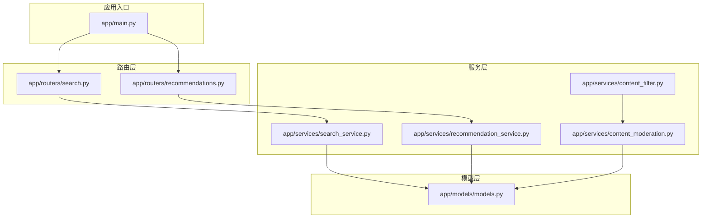
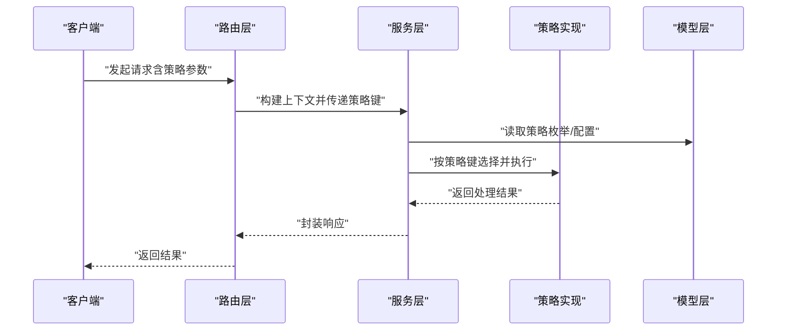
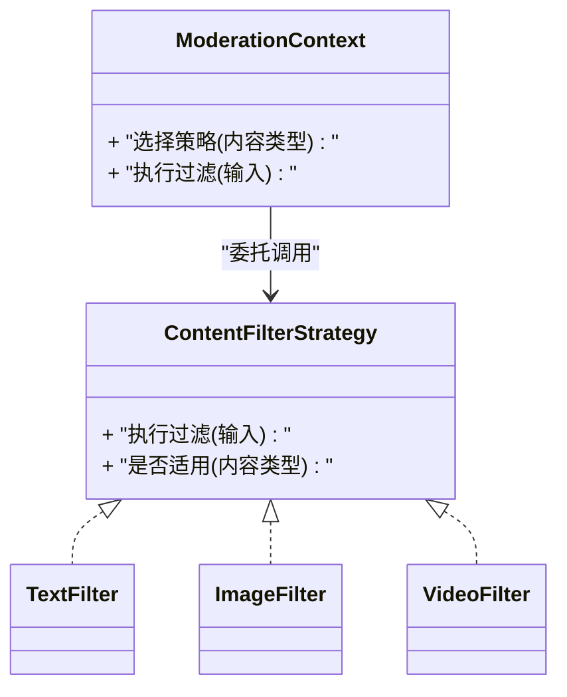
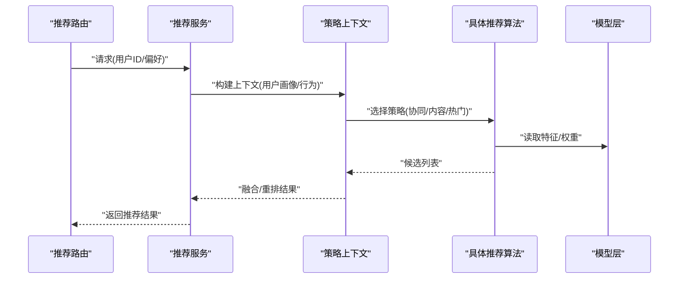
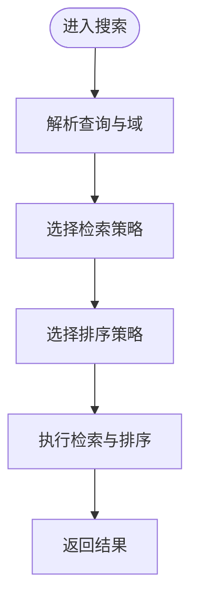
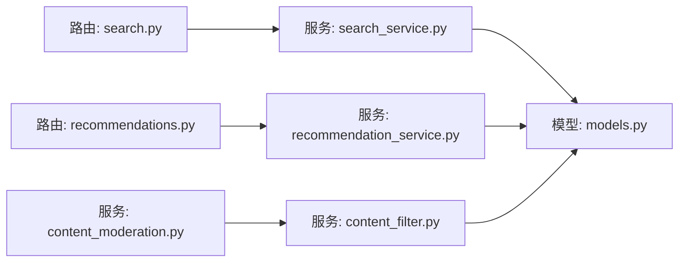

# 策略模式

<cite>
**本文引用的文件**
- [app/main.py](file://app/main.py)
- [app/services/content_filter.py](file://app/services/content_filter.py)
- [app/services/content_moderation.py](file://app/services/content_moderation.py)
- [app/services/recommendation_service.py](file://app/services/recommendation_service.py)
- [app/services/search_service.py](file://app/services/search_service.py)
- [app/routers/search.py](file://app/routers/search.py)
- [app/routers/recommendations.py](file://app/routers/recommendations.py)
- [app/models/models.py](file://app/models/models.py)
</cite>

## 目录
1. [引言](#引言)
2. [项目结构](#项目结构)
3. [核心组件](#核心组件)
4. [架构总览](#架构总览)
5. [详细组件分析](#详细组件分析)
6. [依赖关系分析](#依赖关系分析)
7. [性能考量](#性能考量)
8. [故障排查指南](#故障排查指南)
9. [结论](#结论)
10. [附录](#附录)

## 引言
本文件聚焦于NanTuPy项目中策略模式的应用与落地实践，围绕以下三个关键领域展开：内容过滤服务、推荐算法与搜索服务。我们将系统阐述策略接口设计、策略选择机制、运行时算法切换与策略定制能力，并通过图示与路径引用帮助读者快速定位实现位置。

## 项目结构
NanTuPy采用分层+功能模块化的组织方式，策略模式主要分布在以下位置：
- 服务层（app/services）：内容过滤、内容审核、推荐、搜索等策略化实现
- 路由层（app/routers）：对外暴露策略选择入口，接收请求参数以决定具体策略
- 模型层（app/models）：定义策略枚举、输入输出数据结构
- 应用入口（app/main.py）：应用启动与路由挂载

**图表来源**
- [app/main.py](file://app/main.py)
- [app/routers/search.py](file://app/routers/search.py)
- [app/routers/recommendations.py](file://app/routers/recommendations.py)
- [app/services/search_service.py](file://app/services/search_service.py)
- [app/services/recommendation_service.py](file://app/services/recommendation_service.py)
- [app/services/content_filter.py](file://app/services/content_filter.py)
- [app/services/content_moderation.py](file://app/services/content_moderation.py)
- [app/models/models.py](file://app/models/models.py)

**章节来源**
- [app/main.py](file://app/main.py)
- [app/routers/search.py](file://app/routers/search.py)
- [app/routers/recommendations.py](file://app/routers/recommendations.py)
- [app/services/search_service.py](file://app/services/search_service.py)
- [app/services/recommendation_service.py](file://app/services/recommendation_service.py)
- [app/services/content_filter.py](file://app/services/content_filter.py)
- [app/services/content_moderation.py](file://app/services/content_moderation.py)
- [app/models/models.py](file://app/models/models.py)

## 核心组件
本节概述策略模式在各模块中的职责边界与协作关系：
- 内容过滤服务：面向不同敏感内容类型（文本、图像、视频等），通过策略接口选择对应过滤器，实现可插拔的过滤链路
- 推荐算法服务：根据用户画像、历史行为与实时偏好，动态选择推荐策略（协同过滤、内容相似度、热门度等）
- 搜索服务：针对不同内容域（如用户、话题、作品）与查询意图，选择匹配的检索与排序策略

上述组件均通过统一的策略接口与上下文封装，实现“运行时策略选择”和“策略扩展”。

**章节来源**
- [app/services/content_filter.py](file://app/services/content_filter.py)
- [app/services/content_moderation.py](file://app/services/content_moderation.py)
- [app/services/recommendation_service.py](file://app/services/recommendation_service.py)
- [app/services/search_service.py](file://app/services/search_service.py)

## 架构总览
下图展示了策略模式在系统中的整体交互：路由层接收请求并解析策略参数；服务层根据策略上下文调用具体策略实现；模型层提供策略枚举与数据契约。

**图表来源**
- [app/routers/search.py](file://app/routers/search.py)
- [app/routers/recommendations.py](file://app/routers/recommendations.py)
- [app/services/search_service.py](file://app/services/search_service.py)
- [app/services/recommendation_service.py](file://app/services/recommendation_service.py)
- [app/models/models.py](file://app/models/models.py)

## 详细组件分析

### 内容过滤服务中的策略模式
- 策略接口设计：定义统一的过滤器接口，要求实现对特定内容类型的预处理、检测与后处理流程
- 策略选择机制：依据内容类型与敏感类别（如暴力、色情、广告等）选择对应策略；支持组合策略链路
- 运行时切换：通过配置或请求参数动态切换策略，无需修改核心逻辑
- 可扩展性：新增策略仅需实现接口并注册到策略表，不影响既有策略

**图表来源**
- [app/services/content_filter.py](file://app/services/content_filter.py)
- [app/services/content_moderation.py](file://app/services/content_moderation.py)

**章节来源**
- [app/services/content_filter.py](file://app/services/content_filter.py)
- [app/services/content_moderation.py](file://app/services/content_moderation.py)

### 推荐算法中的策略模式
- 策略接口设计：定义统一的推荐接口，包含候选生成、打分、重排与过滤等阶段
- 策略选择机制：基于用户标签、近期行为、内容热度与多样性约束，选择协同过滤、内容相似度或热门度策略
- 动态策略组合：支持多策略加权融合与A/B测试开关
- 可扩展性：新增推荐算法只需实现接口并接入策略调度器

**图表来源**
- [app/routers/recommendations.py](file://app/routers/recommendations.py)
- [app/services/recommendation_service.py](file://app/services/recommendation_service.py)
- [app/models/models.py](file://app/models/models.py)

**章节来源**
- [app/routers/recommendations.py](file://app/routers/recommendations.py)
- [app/services/recommendation_service.py](file://app/services/recommendation_service.py)
- [app/models/models.py](file://app/models/models.py)

### 搜索服务中的策略模式
- 策略接口设计：定义统一的检索与排序接口，支持多域（用户、话题、作品）与多意图（精确匹配、模糊匹配、排序偏好）
- 策略选择机制：根据查询类型、内容域与排序偏好选择检索策略（倒排索引、向量检索、BM25等）与排序策略（时间、热度、相关性）
- 运行时切换：通过请求参数或配置切换策略，支持灰度与A/B实验
- 可扩展性：新增检索/排序策略仅需实现接口并注册到策略表

**图表来源**
- [app/routers/search.py](file://app/routers/search.py)
- [app/services/search_service.py](file://app/services/search_service.py)
- [app/models/models.py](file://app/models/models.py)

**章节来源**
- [app/routers/search.py](file://app/routers/search.py)
- [app/services/search_service.py](file://app/services/search_service.py)
- [app/models/models.py](file://app/models/models.py)

## 依赖关系分析
策略模式在本项目中实现了高内聚低耦合的解耦效果：
- 路由层仅负责参数解析与上下文构建，不直接关心具体策略细节
- 服务层通过策略上下文与策略表进行解耦，便于扩展新策略
- 模型层提供策略枚举与数据契约，确保策略间的一致性与可测试性

**图表来源**
- [app/routers/search.py](file://app/routers/search.py)
- [app/routers/recommendations.py](file://app/routers/recommendations.py)
- [app/services/search_service.py](file://app/services/search_service.py)
- [app/services/recommendation_service.py](file://app/services/recommendation_service.py)
- [app/services/content_filter.py](file://app/services/content_filter.py)
- [app/services/content_moderation.py](file://app/services/content_moderation.py)
- [app/models/models.py](file://app/models/models.py)

**章节来源**
- [app/routers/search.py](file://app/routers/search.py)
- [app/routers/recommendations.py](file://app/routers/recommendations.py)
- [app/services/search_service.py](file://app/services/search_service.py)
- [app/services/recommendation_service.py](file://app/services/recommendation_service.py)
- [app/services/content_filter.py](file://app/services/content_filter.py)
- [app/services/content_moderation.py](file://app/services/content_moderation.py)
- [app/models/models.py](file://app/models/models.py)

## 性能考量
- 策略选择开销：策略表查询与上下文构建应尽量轻量化，避免成为瓶颈
- 缓存与预热：对热点策略与常用特征进行缓存，减少重复计算
- 并发与限流：在路由层与服务层设置并发控制与限流策略，保障稳定性
- A/B实验：通过策略开关与灰度发布，逐步验证策略效果与性能影响

## 故障排查指南
- 策略未生效：检查路由参数是否正确传递至服务层；确认策略键与策略表映射一致
- 结果异常：核对策略上下文构建逻辑；验证策略实现的前置条件与边界处理
- 性能问题：定位策略选择与执行耗时；评估缓存命中率与数据库访问频次
- 配置错误：检查策略开关与灰度配置；确认策略优先级与回退策略

## 结论
NanTuPy通过策略模式在内容过滤、推荐与搜索三大核心场景中实现了高度灵活与可扩展的架构。策略接口与上下文解耦了业务逻辑与算法实现，使系统能够在运行时动态切换策略并支持持续演进。配合路由层的参数化与模型层的数据契约，策略模式为平台提供了稳定、可维护且易于扩展的算法基础设施。

## 附录
- 策略接口设计要点
  - 统一输入输出契约，保证策略可替换性
  - 明确适用范围与前置条件，避免策略误用
- 新增策略步骤
  - 实现策略接口并完成单元测试
  - 在策略表中注册策略键与优先级
  - 在路由层开放参数入口并在服务层接入
- 最佳实践
  - 将策略选择逻辑集中在服务层上下文
  - 使用配置驱动策略开关与灰度
  - 对关键策略建立监控与回滚预案