# 观察者模式

<cite>
**本文档引用的文件**
- [app/ws_manager.py](file://app/ws_manager.py)
- [app/routers/ws.py](file://app/routers/ws.py)
- [app/services/notification_service.py](file://app/services/notification_service.py)
- [app/models/models.py](file://app/models/models.py)
- [websocket_api.json](file://websocket_api.json)
- [app/main.py](file://app/main.py)
- [migrations/add_ws_protocol_tables.sql](file://migrations/add_ws_protocol_tables.sql)
</cite>

## 目录
1. [简介](#简介)
2. [项目结构](#项目结构)
3. [核心组件](#核心组件)
4. [架构概览](#架构概览)
5. [详细组件分析](#详细组件分析)
6. [依赖关系分析](#依赖关系分析)
7. [性能考虑](#性能考虑)
8. [故障排除指南](#故障排除指南)
9. [结论](#结论)

## 简介

NanTuPy项目中的观察者模式主要应用于WebSocket消息广播系统和通知服务中。该项目采用FastAPI框架构建，实现了完整的即时通讯功能，包括用户认证、消息收发、会话管理和通知推送等核心功能。

观察者模式在本项目中的核心体现是：**WSManager类作为主题(Subject)**，管理多个观察者(客户端连接)的注册和通知机制。当系统中有新的消息或状态变化时，WSManager会自动通知所有已注册的观察者(在线用户)。

## 项目结构

NanTuPy项目采用模块化设计，主要包含以下核心目录结构：

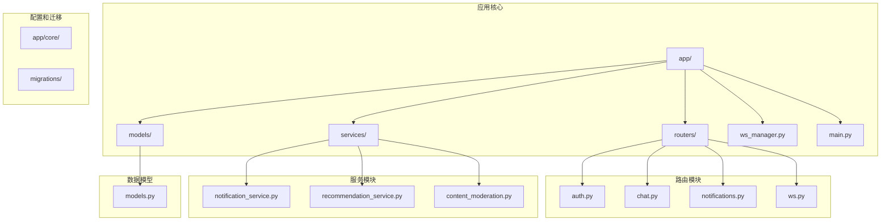

**图表来源**
- [app/main.py:1-110](file://app/main.py#L1-L110)
- [app/ws_manager.py:1-308](file://app/ws_manager.py#L1-L308)

**章节来源**
- [app/main.py:1-110](file://app/main.py#L1-L110)
- [app/ws_manager.py:1-308](file://app/ws_manager.py#L1-L308)

## 核心组件

### WSManager类 - 主题(Subject)

WSManager是整个观察者模式的核心实现，它作为主题(Subject)负责管理所有WebSocket连接，并在需要时通知所有观察者(在线用户)。

#### 主要职责
- **连接管理**: 维护用户ID到WebSocket连接的映射关系
- **观察者注册**: 当用户认证成功时，将其WebSocket连接注册为观察者
- **通知机制**: 实现消息广播和单播通知
- **会话房间管理**: 支持基于会话的分组广播
- **序号系统**: 实现消息序号分配和持久化

#### 关键属性和方法

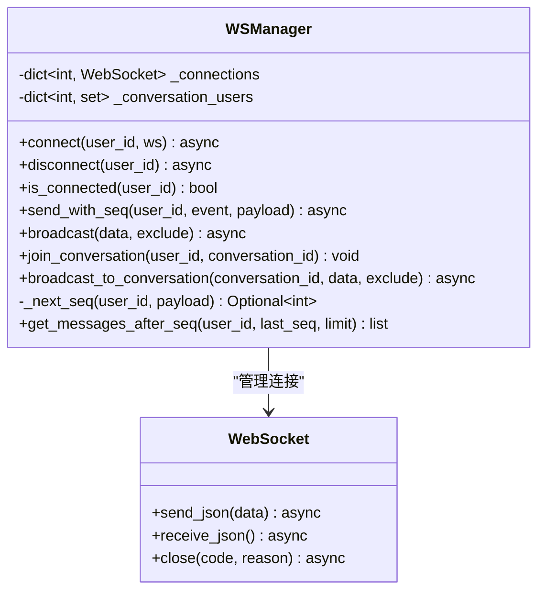

**图表来源**
- [app/ws_manager.py:20-308](file://app/ws_manager.py#L20-L308)

**章节来源**
- [app/ws_manager.py:20-308](file://app/ws_manager.py#L20-L308)

### WebSocket路由器 - 消息处理

WebSocket路由器负责处理各种上行消息类型，并协调WSManager执行相应的操作。

#### 消息处理流程

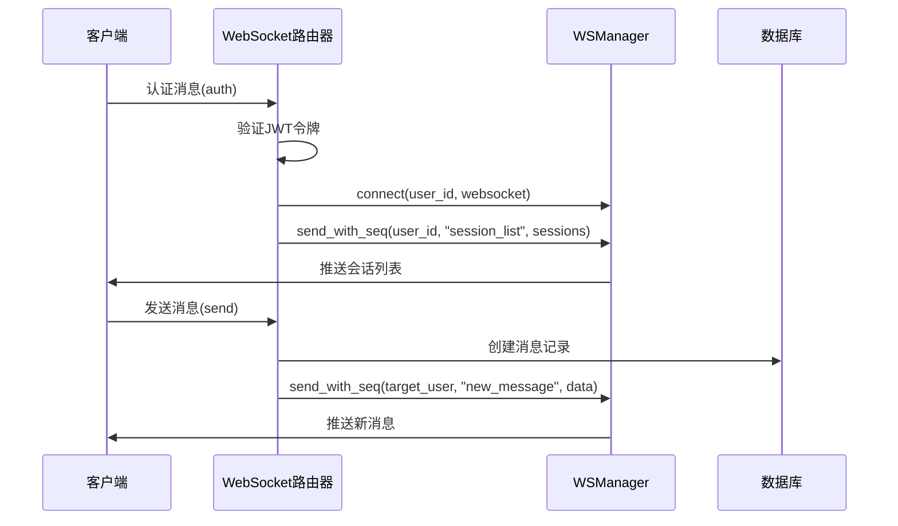

**图表来源**
- [app/routers/ws.py:434-538](file://app/routers/ws.py#L434-L538)
- [app/ws_manager.py:45-117](file://app/ws_manager.py#L45-L117)

**章节来源**
- [app/routers/ws.py:434-538](file://app/routers/ws.py#L434-L538)

### 通知服务 - 观察者应用

通知服务展示了观察者模式在用户状态变化通知中的应用。

#### 通知推送流程

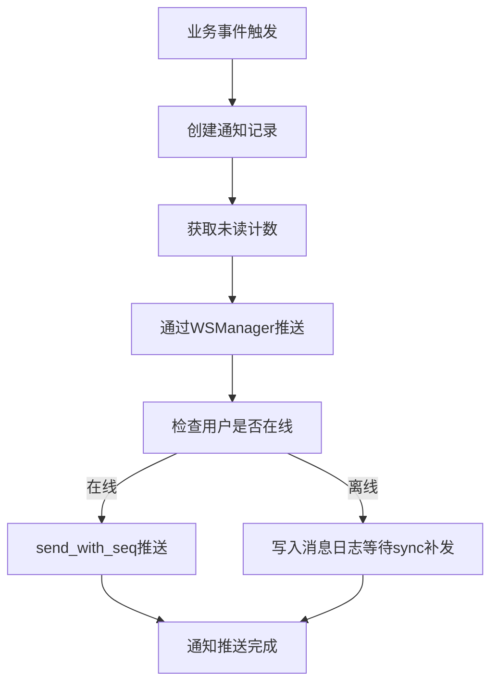

**图表来源**
- [app/services/notification_service.py:21-53](file://app/services/notification_service.py#L21-L53)

**章节来源**
- [app/services/notification_service.py:14-233](file://app/services/notification_service.py#L14-L233)

## 架构概览

NanTuPy项目的观察者模式架构体现了清晰的分层设计：

```mermaid
graph TB
subgraph "表现层"
A[WebSocket客户端]
B[HTTP客户端]
end
subgraph "应用层"
C[WebSocket路由器(ws.py)]
D[通知服务(notification_service.py)]
E[聊天服务(chat.py)]
end
subgraph "核心服务"
F[WSManager主题]
G[数据库服务]
end
subgraph "基础设施"
H[FastAPI框架]
I[SQLAlchemy ORM]
end
A --> C
B --> E
C --> F
D --> F
E --> F
F --> G
C --> H
D --> H
E --> H
F --> I
```

**图表来源**
- [app/main.py:84-84](file://app/main.py#L84-L84)
- [app/ws_manager.py:20-308](file://app/ws_manager.py#L20-L308)

**章节来源**
- [app/main.py:84-84](file://app/main.py#L84-L84)
- [app/ws_manager.py:20-308](file://app/ws_manager.py#L20-L308)

## 详细组件分析

### WSManager类深度解析

#### 连接管理机制

WSManager实现了单例模式，确保整个应用只有一个连接管理器实例：

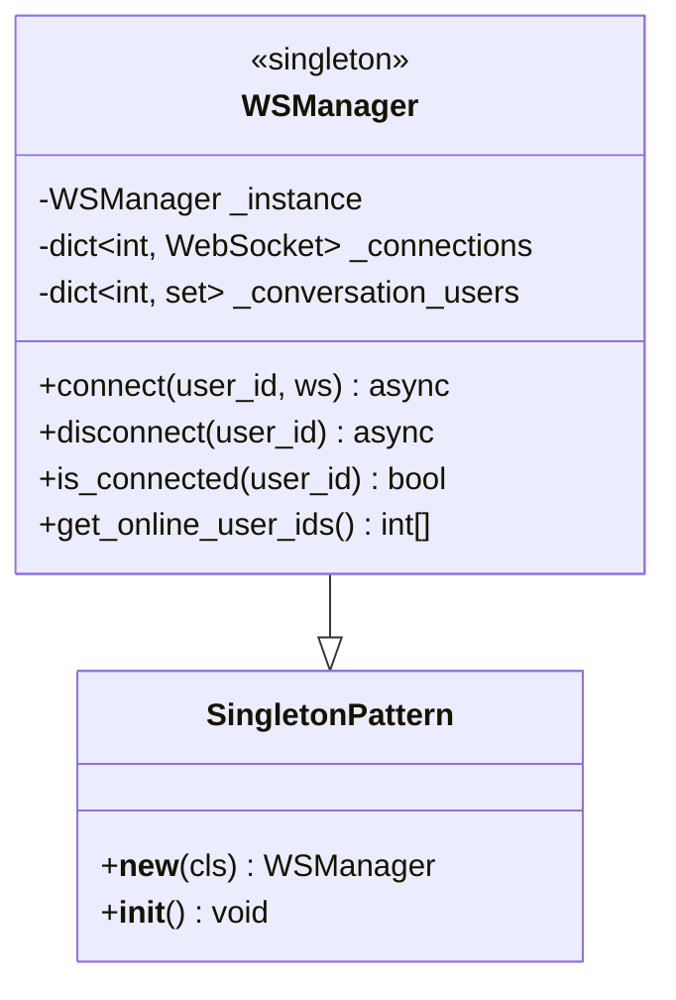

**图表来源**
- [app/ws_manager.py:20-40](file://app/ws_manager.py#L20-L40)

#### 序号系统实现

序号系统是观察者模式的重要组成部分，确保消息的可靠传递：

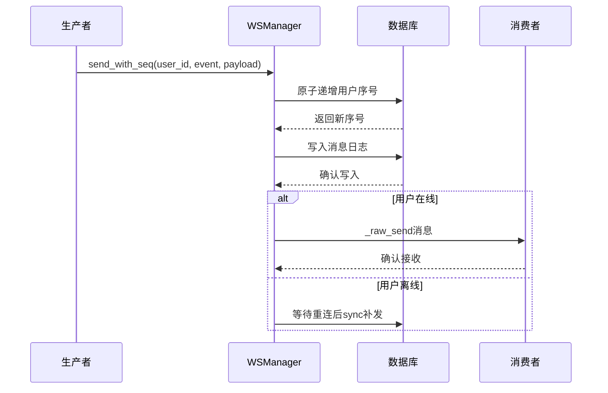

**图表来源**
- [app/ws_manager.py:74-95](file://app/ws_manager.py#L74-L95)
- [app/ws_manager.py:170-213](file://app/ws_manager.py#L170-L213)

#### 会话房间管理

会话房间机制允许基于用户参与的会话进行定向广播：

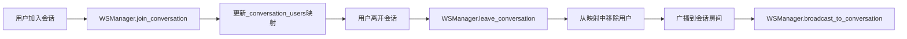

**图表来源**
- [app/ws_manager.py:136-164](file://app/ws_manager.py#L136-L164)

**章节来源**
- [app/ws_manager.py:20-308](file://app/ws_manager.py#L20-L308)

### WebSocket消息处理流程

#### 认证流程

认证是观察者注册的关键步骤，只有认证成功的用户才能成为观察者：

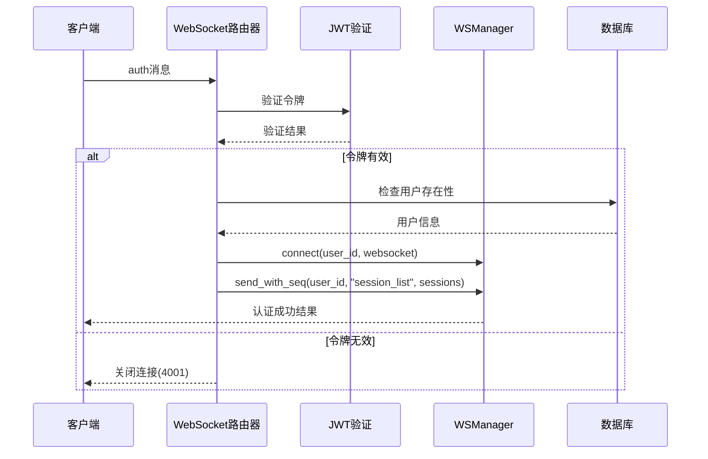

**图表来源**
- [app/routers/ws.py:446-470](file://app/routers/ws.py#L446-L470)
- [app/routers/ws.py:182-212](file://app/routers/ws.py#L182-L212)

#### 消息发送流程

消息发送展示了观察者模式的典型应用场景：

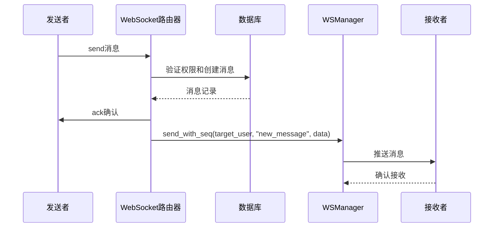

**图表来源**
- [app/routers/ws.py:215-315](file://app/routers/ws.py#L215-L315)
- [app/routers/ws.py:300-308](file://app/routers/ws.py#L300-L308)

**章节来源**
- [app/routers/ws.py:182-538](file://app/routers/ws.py#L182-L538)

### 通知服务中的观察者模式

#### 异步通知推送

通知服务展示了观察者模式在用户状态变化通知中的应用：

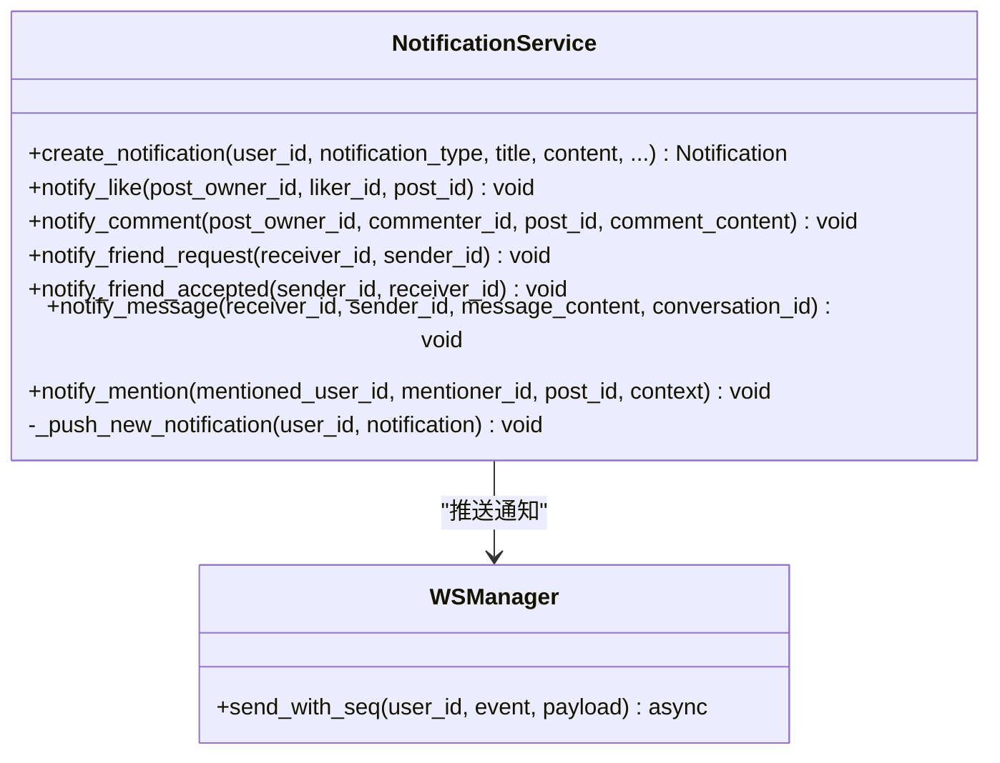

**图表来源**
- [app/services/notification_service.py:14-233](file://app/services/notification_service.py#L14-L233)

#### 通知类型和触发条件

| 通知类型 | 触发条件 | 目标用户 | 推送内容 |
|---------|---------|---------|---------|
| like | 用户点赞帖子 | 帖子作者 | "用户名 赞了你的帖子" |
| comment | 用户评论帖子 | 帖子作者 | "用户名 评论了你的帖子" |
| friend_request | 用户发送好友请求 | 接收者 | "用户名 想加你为好友" |
| friend_accept | 用户接受好友请求 | 发送者 | "用户名 接受了你的好友请求" |
| message | 用户发送消息 | 消息接收者 | "来自 用户名 的新消息" |
| mention | 用户在帖子中提及 | 被提及用户 | "用户名 在帖子中提到了你" |

**章节来源**
- [app/services/notification_service.py:87-233](file://app/services/notification_service.py#L87-L233)

## 依赖关系分析

### 数据库模型依赖

观察者模式的实现依赖于特定的数据库表结构：

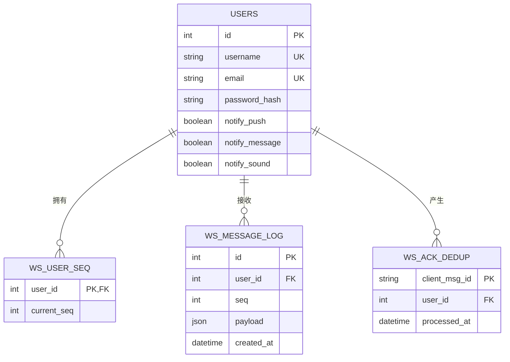

**图表来源**
- [app/models/models.py:627-654](file://app/models/models.py#L627-L654)
- [migrations/add_ws_protocol_tables.sql:1-31](file://migrations/add_ws_protocol_tables.sql#L1-L31)

### 组件间依赖关系

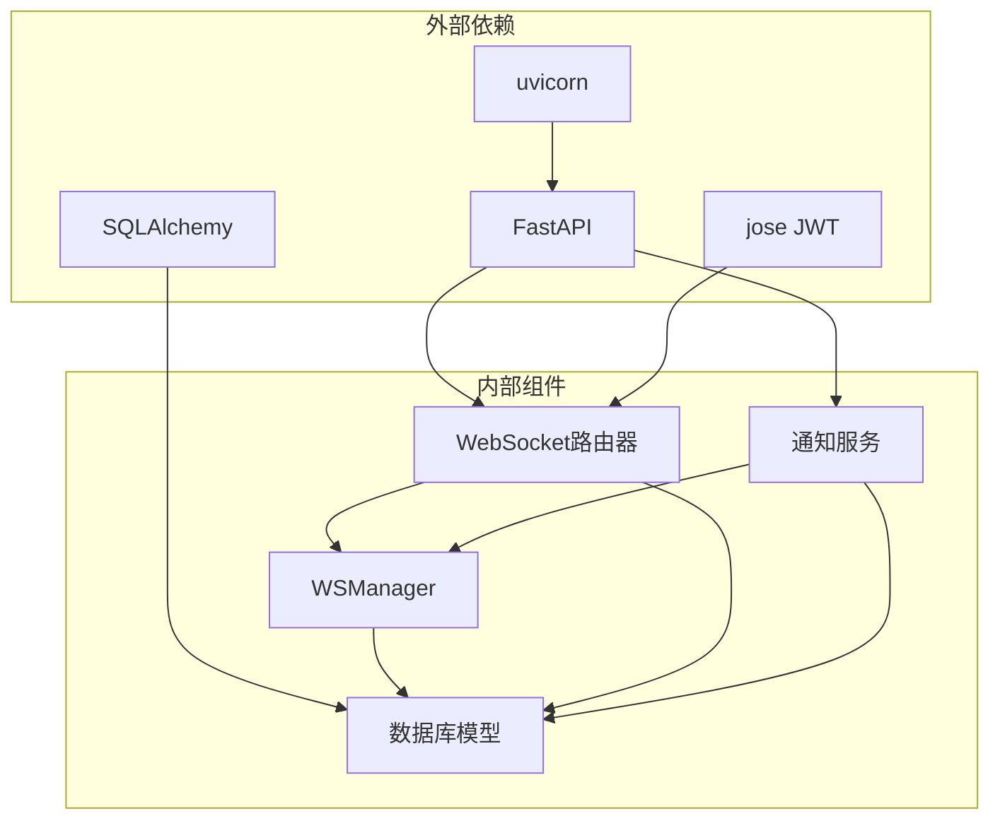

**图表来源**
- [app/main.py:84-84](file://app/main.py#L84-L84)
- [app/ws_manager.py:15-15](file://app/ws_manager.py#L15-L15)

**章节来源**
- [app/main.py:84-84](file://app/main.py#L84-L84)
- [app/ws_manager.py:15-15](file://app/ws_manager.py#L15-L15)

## 性能考虑

### 连接池优化

WSManager实现了高效的连接池管理，支持大量并发连接：

- **内存优化**: 使用字典存储连接映射，查找复杂度O(1)
- **并发安全**: 基于Python的线程安全特性，适合高并发场景
- **资源清理**: 自动清理断开的连接和会话房间

### 消息序号系统性能

序号系统通过数据库原子操作确保消息顺序：

- **原子递增**: 使用UPDATE语句实现原子性序号递增
- **持久化保证**: 消息先写入日志表，确保不会丢失
- **批量处理**: 支持批量消息查询和处理

### 内存和CPU优化

- **延迟加载**: 仅在需要时查询数据库
- **连接复用**: 复用数据库连接减少开销
- **异步处理**: 使用async/await实现非阻塞I/O

## 故障排除指南

### 常见问题和解决方案

#### 连接管理问题

| 问题 | 症状 | 解决方案 |
|------|------|----------|
| 重复连接 | 同一用户多连接 | WSManager自动关闭旧连接 |
| 连接泄漏 | 内存持续增长 | 确保异常情况下调用disconnect |
| 认证失败 | 4001错误码 | 检查JWT令牌有效性 |

#### 消息传递问题

| 问题 | 症状 | 解决方案 |
|------|------|----------|
| 消息丢失 | 用户未收到消息 | 检查ws_message_log表 |
| 重复消息 | 用户收到重复消息 | 检查WSAckDedup表 |
| 乱序消息 | 消息顺序错误 | 检查序号递增逻辑 |

#### 性能问题

| 问题 | 症状 | 解决方案 |
|------|------|----------|
| 响应缓慢 | 消息推送延迟 | 优化数据库索引 |
| 内存占用高 | 服务器内存不足 | 调整连接池大小 |
| CPU使用率高 | 服务器负载过高 | 实施消息队列 |

**章节来源**
- [app/ws_manager.py:56-64](file://app/ws_manager.py#L56-L64)
- [app/routers/ws.py:530-538](file://app/routers/ws.py#L530-L538)

## 结论

NanTuPy项目中的观察者模式实现展现了现代Web应用的最佳实践：

### 核心优势

1. **解耦设计**: WSManager与具体业务逻辑完全解耦
2. **动态扩展**: 支持动态添加和移除观察者
3. **可靠性保证**: 通过序号系统确保消息可靠传递
4. **性能优化**: 异步处理和连接池管理提升性能

### 技术亮点

- **单例模式**: 确保连接管理的唯一性和一致性
- **异步架构**: 完全基于async/await的异步处理
- **持久化机制**: 数据库持久化确保消息不丢失
- **幂等处理**: 通过clientMsgId实现消息幂等

### 应用价值

观察者模式在NanTuPy中的应用不仅实现了WebSocket消息广播功能，更重要的是：

- **支持动态消息订阅**: 用户可以按需订阅不同类型的消息
- **实现系统组件解耦**: 各个业务模块通过观察者模式松耦合
- **提供可靠的推送机制**: 通过序号系统和持久化确保消息可靠传递
- **支持大规模并发**: 通过异步处理和连接池管理支持高并发场景

这种实现方式为类似即时通讯系统的开发提供了优秀的参考模板，展示了如何在实际生产环境中优雅地应用设计模式来解决复杂的实时通信需求。