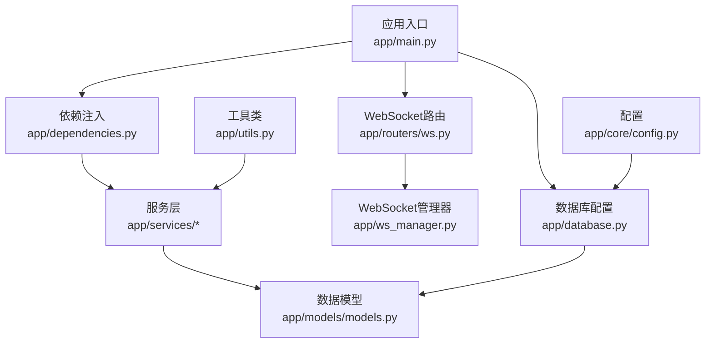
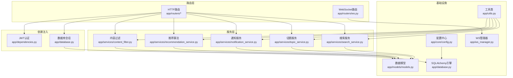
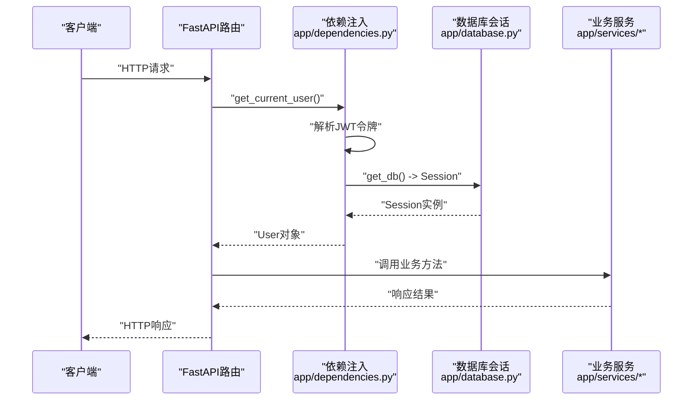
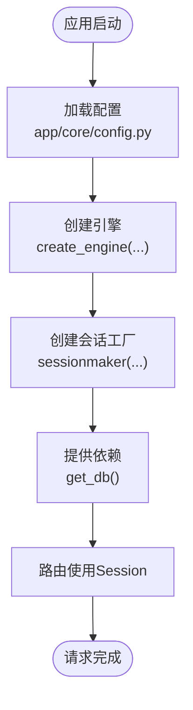
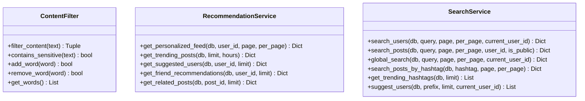
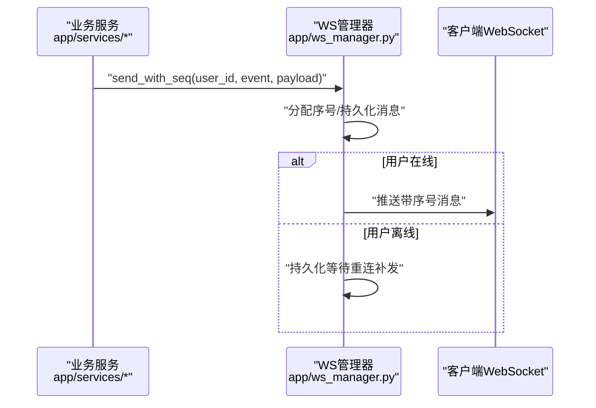
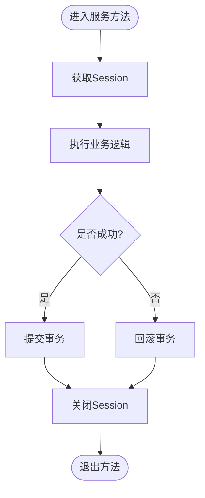
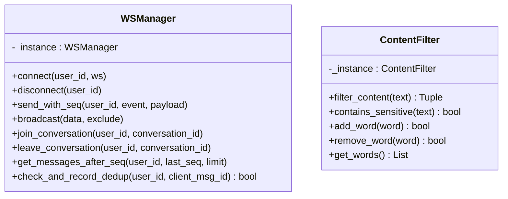
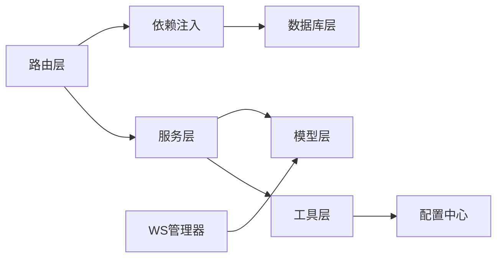

# 设计模式应用

<cite>
**本文档引用的文件**
- [app/main.py](file://app/main.py)
- [app/dependencies.py](file://app/dependencies.py)
- [app/database.py](file://app/database.py)
- [app/ws_manager.py](file://app/ws_manager.py)
- [app/routers/ws.py](file://app/routers/ws.py)
- [app/services/content_filter.py](file://app/services/content_filter.py)
- [app/services/recommendation_service.py](file://app/services/recommendation_service.py)
- [app/services/notification_service.py](file://app/services/notification_service.py)
- [app/services/topic_service.py](file://app/services/topic_service.py)
- [app/services/search_service.py](file://app/services/search_service.py)
- [app/models/models.py](file://app/models/models.py)
- [app/core/config.py](file://app/core/config.py)
- [app/utils.py](file://app/utils.py)
</cite>

## 目录
1. [引言](#引言)
2. [项目结构](#项目结构)
3. [核心组件](#核心组件)
4. [架构总览](#架构总览)
5. [详细组件分析](#详细组件分析)
6. [依赖关系分析](#依赖关系分析)
7. [性能考量](#性能考量)
8. [故障排查指南](#故障排查指南)
9. [结论](#结论)

## 引言
本文件聚焦于NanTuPy项目中设计模式的实际应用，围绕以下主题展开：
- 依赖注入模式在FastAPI中的应用，展示如何通过依赖注入实现松耦合的组件设计
- 工厂模式在数据库连接池和配置管理中的使用
- 策略模式在服务模块中的应用，如内容过滤和推荐算法的不同实现策略
- 观察者模式在WebSocket消息广播和通知系统中的实现
- 模板方法模式在业务流程中的应用
- 单例模式在数据库连接管理、内容过滤器和WebSocket管理器中的使用

## 项目结构
NanTuPy采用FastAPI框架，采用分层组织方式：
- 应用入口与中间件：app/main.py
- 依赖注入与认证：app/dependencies.py
- 数据库配置与会话：app/database.py
- WebSocket管理：app/ws_manager.py
- WebSocket路由：app/routers/ws.py
- 服务层：app/services/*
- 数据模型：app/models/models.py
- 配置：app/core/config.py
- 工具类：app/utils.py

图表来源
- [app/main.py:39-84](file://app/main.py#L39-L84)
- [app/dependencies.py:16-62](file://app/dependencies.py#L16-L62)
- [app/database.py:9-37](file://app/database.py#L9-L37)
- [app/routers/ws.py:440-544](file://app/routers/ws.py#L440-L544)
- [app/ws_manager.py:20-307](file://app/ws_manager.py#L20-L307)
- [app/models/models.py:1-655](file://app/models/models.py#L1-L655)
- [app/core/config.py:7-43](file://app/core/config.py#L7-L43)
- [app/utils.py:14-220](file://app/utils.py#L14-L220)

章节来源
- [app/main.py:1-110](file://app/main.py#L1-L110)
- [app/dependencies.py:1-63](file://app/dependencies.py#L1-L63)
- [app/database.py:1-38](file://app/database.py#L1-L38)
- [app/ws_manager.py:1-308](file://app/ws_manager.py#L1-L308)
- [app/routers/ws.py:1-544](file://app/routers/ws.py#L1-L544)
- [app/services/content_filter.py:1-192](file://app/services/content_filter.py#L1-L192)
- [app/services/recommendation_service.py:1-457](file://app/services/recommendation_service.py#L1-L457)
- [app/services/notification_service.py:1-233](file://app/services/notification_service.py#L1-L233)
- [app/services/topic_service.py:1-277](file://app/services/topic_service.py#L1-L277)
- [app/services/search_service.py:1-179](file://app/services/search_service.py#L1-L179)
- [app/models/models.py:1-655](file://app/models/models.py#L1-L655)
- [app/core/config.py:1-43](file://app/core/config.py#L1-L43)
- [app/utils.py:1-220](file://app/utils.py#L1-L220)

## 核心组件
- 依赖注入与认证：通过FastAPI的Depends实现JWT认证、可选认证、管理员权限校验，将认证逻辑与业务解耦
- 数据库连接池：基于SQLAlchemy 2.0+的同步引擎与Session，提供连接池配置与会话管理
- WebSocket管理：单例WSManager负责连接池、消息序号、断线补发、ACK去重、房间广播
- 服务层：内容过滤、推荐算法、通知、话题、搜索等服务，均以静态方法+Session参数传递的方式实现
- 配置中心：集中管理数据库、JWT、COS等配置项
- 工具类：文件上传器封装COS操作，提供预签名URL、确认上传、删除文件等功能

章节来源
- [app/dependencies.py:16-62](file://app/dependencies.py#L16-L62)
- [app/database.py:9-37](file://app/database.py#L9-L37)
- [app/ws_manager.py:20-307](file://app/ws_manager.py#L20-L307)
- [app/services/content_filter.py:13-192](file://app/services/content_filter.py#L13-L192)
- [app/services/recommendation_service.py:10-457](file://app/services/recommendation_service.py#L10-L457)
- [app/services/notification_service.py:14-233](file://app/services/notification_service.py#L14-L233)
- [app/services/topic_service.py:10-277](file://app/services/topic_service.py#L10-L277)
- [app/services/search_service.py:9-179](file://app/services/search_service.py#L9-L179)
- [app/core/config.py:7-43](file://app/core/config.py#L7-L43)
- [app/utils.py:14-220](file://app/utils.py#L14-L220)

## 架构总览
NanTuPy采用“路由-服务-模型-数据库”的分层架构，配合依赖注入实现松耦合：
- 路由层：FastAPI路由处理HTTP/WebSocket请求
- 服务层：封装业务逻辑，复用Session参数传递，避免全局状态
- 模型层：SQLAlchemy ORM模型定义
- 数据库层：SQLAlchemy同步引擎+连接池
- 配置层：集中配置管理
- 工具层：第三方服务集成（COS）

图表来源
- [app/routers/ws.py:440-544](file://app/routers/ws.py#L440-L544)
- [app/dependencies.py:16-62](file://app/dependencies.py#L16-L62)
- [app/database.py:9-37](file://app/database.py#L9-L37)
- [app/services/content_filter.py:13-192](file://app/services/content_filter.py#L13-L192)
- [app/services/recommendation_service.py:10-457](file://app/services/recommendation_service.py#L10-L457)
- [app/services/notification_service.py:14-233](file://app/services/notification_service.py#L14-L233)
- [app/services/topic_service.py:10-277](file://app/services/topic_service.py#L10-L277)
- [app/services/search_service.py:9-179](file://app/services/search_service.py#L9-L179)
- [app/models/models.py:1-655](file://app/models/models.py#L1-L655)
- [app/core/config.py:7-43](file://app/core/config.py#L7-L43)
- [app/utils.py:14-220](file://app/utils.py#L14-L220)

## 详细组件分析

### 依赖注入模式（FastAPI）
- JWT认证依赖：通过HTTPBearer与Depends实现令牌解析与用户查询，异常统一抛出HTTPException
- 可选认证：支持未登录场景，返回None
- 管理员权限：基于当前用户角色校验
- 数据库会话：get_db提供Session依赖，自动commit/rollback/关闭，确保资源安全释放

图表来源
- [app/dependencies.py:16-62](file://app/dependencies.py#L16-L62)
- [app/database.py:22-32](file://app/database.py#L22-L32)

章节来源
- [app/dependencies.py:16-62](file://app/dependencies.py#L16-L62)
- [app/database.py:22-32](file://app/database.py#L22-L32)

### 工厂模式（数据库连接池与配置）
- 数据库工厂：create_engine基于配置构造SQLAlchemy引擎，支持连接池大小、溢出、回收、预检等参数
- 会话工厂：sessionmaker绑定engine，提供SessionLocal用于依赖注入
- 配置工厂：Config类集中管理数据库URI、JWT密钥、COS配置等，支持环境变量覆盖

图表来源
- [app/core/config.py:7-43](file://app/core/config.py#L7-L43)
- [app/database.py:9-37](file://app/database.py#L9-L37)

章节来源
- [app/core/config.py:7-43](file://app/core/config.py#L7-L43)
- [app/database.py:9-37](file://app/database.py#L9-L37)

### 策略模式（服务模块）
- 内容过滤策略：ContentFilter类封装敏感词匹配、字符变体归一化、动态词库管理，支持不同策略组合（内置词库、动态增删）
- 推荐算法策略：RecommendationService提供个性化、趋势、用户推荐、相关帖子等多种策略，通过不同查询与权重组合实现
- 搜索策略：SearchService支持用户搜索、全局搜索、标签搜索、热门标签等策略

图表来源
- [app/services/content_filter.py:13-192](file://app/services/content_filter.py#L13-L192)
- [app/services/recommendation_service.py:10-457](file://app/services/recommendation_service.py#L10-L457)
- [app/services/search_service.py:9-179](file://app/services/search_service.py#L9-L179)

章节来源
- [app/services/content_filter.py:13-192](file://app/services/content_filter.py#L13-L192)
- [app/services/recommendation_service.py:10-457](file://app/services/recommendation_service.py#L10-L457)
- [app/services/search_service.py:9-179](file://app/services/search_service.py#L9-L179)

### 观察者模式（WebSocket消息广播与通知）
- 观察者实现：WSManager作为单例，维护在线用户集合与会话房间，提供广播、房间广播、序号消息发送等能力
- 通知系统：NotificationService在创建通知后异步推送WebSocket消息，实现发布-订阅式通知

图表来源
- [app/ws_manager.py:74-117](file://app/ws_manager.py#L74-L117)
- [app/services/notification_service.py:21-53](file://app/services/notification_service.py#L21-L53)

章节来源
- [app/ws_manager.py:20-307](file://app/ws_manager.py#L20-L307)
- [app/services/notification_service.py:14-233](file://app/services/notification_service.py#L14-L233)

### 模板方法模式（业务流程）
- 模板方法体现：服务层普遍采用“获取Session -> 执行业务 -> commit/rollback -> close”的固定流程，通过静态方法+Session参数传递实现模板化
- 典型流程：RecommendationService、TopicService、SearchService均遵循该模板，保证事务一致性与资源释放

图表来源
- [app/services/recommendation_service.py:83-168](file://app/services/recommendation_service.py#L83-L168)
- [app/services/topic_service.py:13-27](file://app/services/topic_service.py#L13-L27)
- [app/services/search_service.py:12-51](file://app/services/search_service.py#L12-L51)

章节来源
- [app/services/recommendation_service.py:10-457](file://app/services/recommendation_service.py#L10-L457)
- [app/services/topic_service.py:10-277](file://app/services/topic_service.py#L10-L277)
- [app/services/search_service.py:9-179](file://app/services/search_service.py#L9-L179)

### 单例模式（连接管理与内容过滤）
- 数据库连接管理：WSManager作为单例，确保全局唯一连接池与序号管理；ContentFilter同样采用单例，避免多实例词库不一致
- 使用场景：WSManager在WebSocket端点中被广泛调用；ContentFilter在内容审核中被全局使用

图表来源
- [app/ws_manager.py:20-307](file://app/ws_manager.py#L20-L307)
- [app/services/content_filter.py:13-192](file://app/services/content_filter.py#L13-L192)

章节来源
- [app/ws_manager.py:20-307](file://app/ws_manager.py#L20-L307)
- [app/services/content_filter.py:13-192](file://app/services/content_filter.py#L13-L192)

## 依赖关系分析
- 路由依赖：HTTP路由依赖JWT认证与数据库会话；WebSocket路由依赖WSManager与数据库会话
- 服务依赖：各服务依赖模型层与数据库会话；部分服务相互协作（如推荐服务与话题服务）
- 基础设施依赖：WSManager依赖数据库模型与会话；工具类依赖配置中心

图表来源
- [app/routers/ws.py:440-544](file://app/routers/ws.py#L440-L544)
- [app/dependencies.py:16-62](file://app/dependencies.py#L16-L62)
- [app/database.py:9-37](file://app/database.py#L9-L37)
- [app/ws_manager.py:20-307](file://app/ws_manager.py#L20-L307)
- [app/models/models.py:1-655](file://app/models/models.py#L1-L655)
- [app/utils.py:14-220](file://app/utils.py#L14-L220)
- [app/core/config.py:7-43](file://app/core/config.py#L7-L43)

章节来源
- [app/routers/ws.py:1-544](file://app/routers/ws.py#L1-L544)
- [app/dependencies.py:1-63](file://app/dependencies.py#L1-L63)
- [app/database.py:1-38](file://app/database.py#L1-L38)
- [app/ws_manager.py:1-308](file://app/ws_manager.py#L1-L308)
- [app/models/models.py:1-655](file://app/models/models.py#L1-L655)
- [app/utils.py:1-220](file://app/utils.py#L1-L220)
- [app/core/config.py:1-43](file://app/core/config.py#L1-L43)

## 性能考量
- 连接池优化：通过SQLAlchemy引擎选项（pool_size、max_overflow、pool_recycle、pool_pre_ping）提升并发与稳定性
- 批量数据加载：RecommendationService采用批量聚合查询，减少N+1问题
- 异步推送：NotificationService使用异步事件循环推送WebSocket消息，降低阻塞
- 序号与去重：WSManager通过序号系统与ACK去重表保证消息可靠性与幂等性

## 故障排查指南
- 认证失败：检查JWT密钥配置与令牌有效性
- 数据库连接异常：检查连接池参数与数据库可达性
- WebSocket断线：利用序号系统与ACK去重机制进行补发与去重
- 通知未送达：检查异步事件循环与WSManager连接状态

章节来源
- [app/dependencies.py:16-62](file://app/dependencies.py#L16-L62)
- [app/database.py:9-37](file://app/database.py#L9-L37)
- [app/ws_manager.py:170-213](file://app/ws_manager.py#L170-L213)
- [app/services/notification_service.py:21-53](file://app/services/notification_service.py#L21-L53)

## 结论
NanTuPy通过依赖注入、工厂、策略、观察者、模板方法与单例等设计模式，实现了高内聚、低耦合的服务架构。依赖注入使认证与会话管理清晰可控；工厂模式统一了数据库连接池与配置；策略模式支撑了灵活的内容过滤与推荐算法；观察者模式保障了WebSocket消息可靠广播；模板方法模式规范了业务流程；单例模式确保了关键组件的全局一致性。这些模式协同工作，为NanTuPy提供了可扩展、可维护的后端基础。