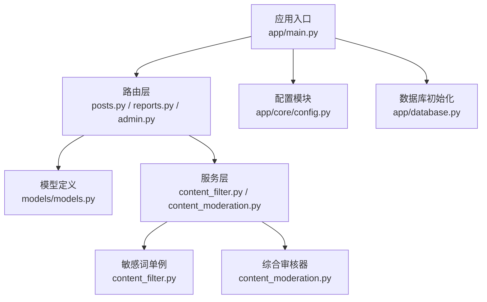
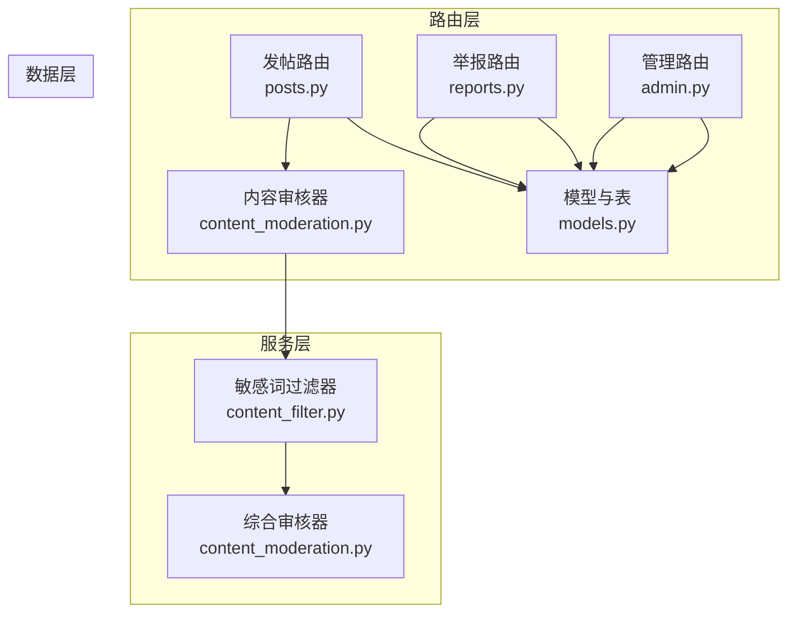
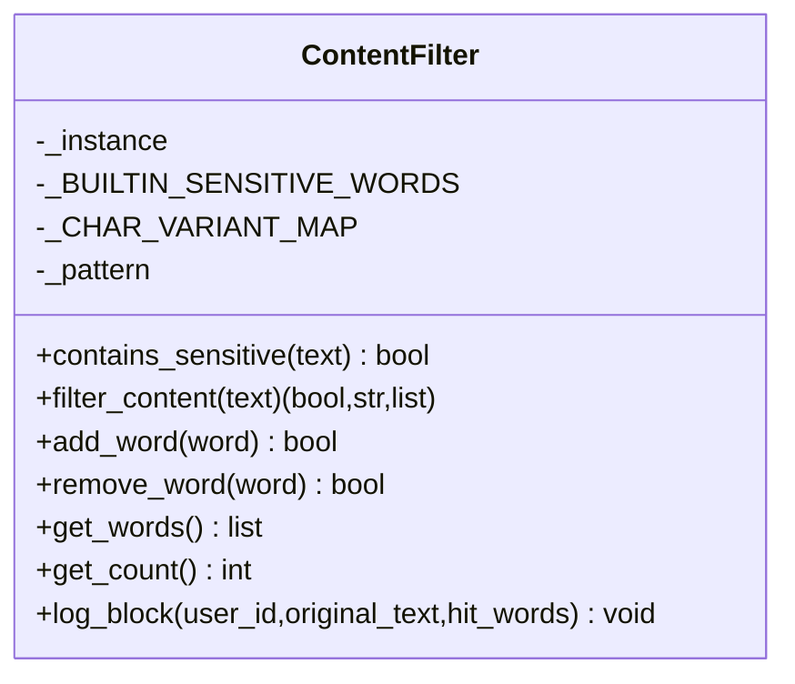
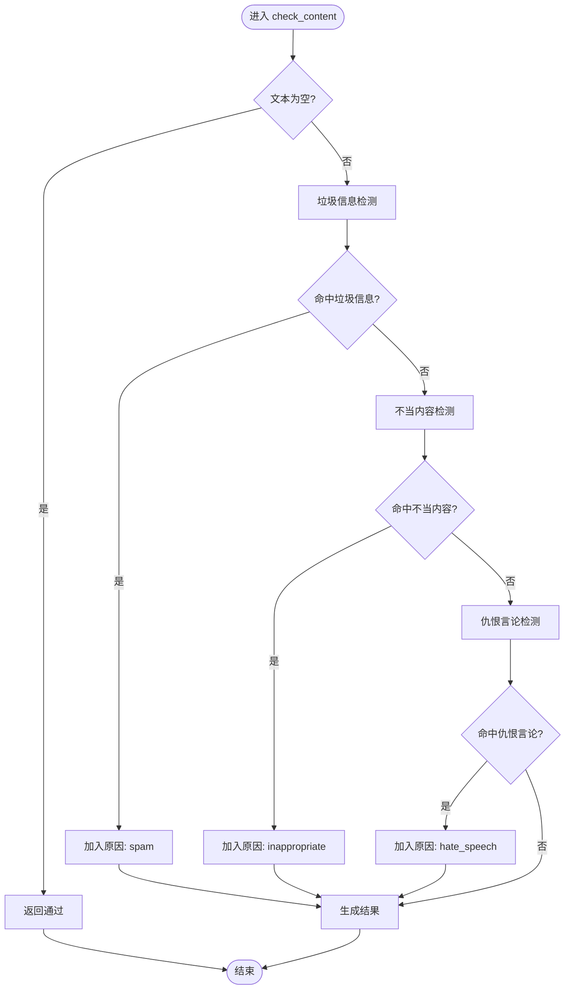
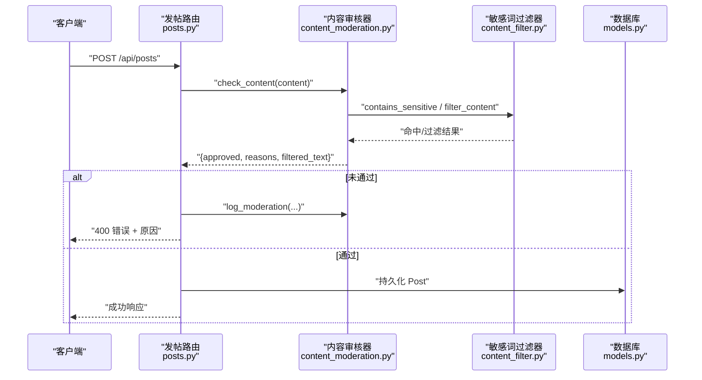
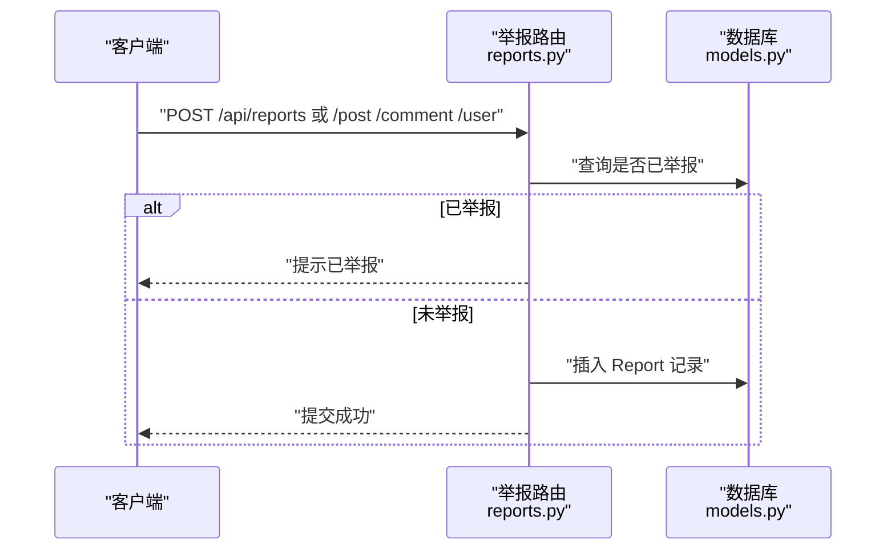
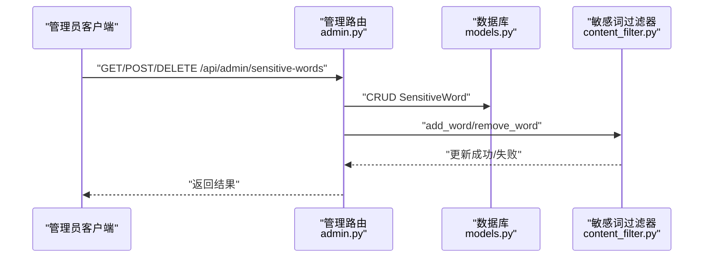
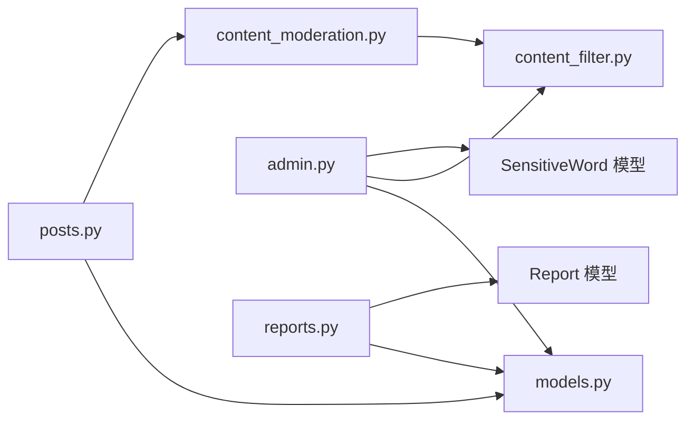

# 内容审核系统

<cite>
**本文引用的文件**
- [app/main.py](file://app/main.py)
- [app/core/config.py](file://app/core/config.py)
- [app/database.py](file://app/database.py)
- [app/models/models.py](file://app/models/models.py)
- [app/routers/posts.py](file://app/routers/posts.py)
- [app/routers/reports.py](file://app/routers/reports.py)
- [app/routers/admin.py](file://app/routers/admin.py)
- [app/services/content_filter.py](file://app/services/content_filter.py)
- [app/services/content_moderation.py](file://app/services/content_moderation.py)
</cite>

## 目录
1. [简介](#简介)
2. [项目结构](#项目结构)
3. [核心组件](#核心组件)
4. [架构总览](#架构总览)
5. [详细组件分析](#详细组件分析)
6. [依赖分析](#依赖分析)
7. [性能考虑](#性能考虑)
8. [故障排查指南](#故障排查指南)
9. [结论](#结论)
10. [附录](#附录)

## 简介
本文件面向 NanTuPy 社交平台的内容审核系统，系统性梳理了敏感词过滤、内容分类与自动审核策略，以及举报处理、人工审核与违规处置流程。文档还覆盖了策略配置、阈值调整、审核历史管理、效率优化、批量处理、质量评估、API 设计、扩展开发与合规性要求，并给出监控指标与改进方案。

## 项目结构
- 应用入口与中间件：在应用入口集中注册路由、CORS、安全头与健康检查。
- 配置模块：集中管理数据库连接、上传限制、云存储参数等。
- 数据库与模型：定义用户、帖子、评论、举报、屏蔽、敏感词等实体及索引。
- 路由层：负责业务入口（如发帖、举报），并在关键节点触发审核。
- 服务层：提供敏感词过滤与综合内容审核能力。
- 管理端：提供敏感词增删改查的后台接口。

图表来源
- [app/main.py:39-84](file://app/main.py#L39-L84)
- [app/core/config.py:7-43](file://app/core/config.py#L7-L43)
- [app/database.py:9-38](file://app/database.py#L9-L38)
- [app/models/models.py:42-474](file://app/models/models.py#L42-L474)
- [app/routers/posts.py:22-140](file://app/routers/posts.py#L22-L140)
- [app/routers/reports.py:14-151](file://app/routers/reports.py#L14-L151)
- [app/routers/admin.py:14-78](file://app/routers/admin.py#L14-L78)
- [app/services/content_filter.py:13-192](file://app/services/content_filter.py#L13-L192)
- [app/services/content_moderation.py:19-258](file://app/services/content_moderation.py#L19-L258)

章节来源
- [app/main.py:39-84](file://app/main.py#L39-L84)
- [app/core/config.py:7-43](file://app/core/config.py#L7-L43)
- [app/database.py:9-38](file://app/database.py#L9-L38)

## 核心组件
- 敏感词过滤器（ContentFilter）
  - 单例模式，内置中英文敏感词库，支持全角/半角与常见异体字归一化，动态增删词并重建正则。
  - 提供敏感词检测与替换、命中词收集、拦截日志记录、词库统计等能力。
- 综合内容审核器（ContentModeration）
  - 融合敏感词、垃圾信息、不当内容与仇恨言论检测；支持过滤文本输出与审核日志。
- 路由与业务集成
  - 发帖接口在持久化前执行审核，失败即拦截并记录原因。
  - 举报接口提供统一入口与状态查询。
  - 管理端提供敏感词的增删改查。
- 数据模型支撑
  - Report、SensitiveWord 等模型支撑举报与敏感词管理。

章节来源
- [app/services/content_filter.py:13-192](file://app/services/content_filter.py#L13-L192)
- [app/services/content_moderation.py:19-258](file://app/services/content_moderation.py#L19-L258)
- [app/routers/posts.py:92-108](file://app/routers/posts.py#L92-L108)
- [app/routers/reports.py:14-151](file://app/routers/reports.py#L14-L151)
- [app/routers/admin.py:14-78](file://app/routers/admin.py#L14-L78)
- [app/models/models.py:446-474](file://app/models/models.py#L446-L474)
- [app/models/models.py:514-528](file://app/models/models.py#L514-L528)

## 架构总览
系统采用“路由层-服务层-数据层”分层设计。路由层在关键业务点触发审核，服务层完成规则匹配与过滤，数据层持久化结果与日志。

图表来源
- [app/routers/posts.py:92-108](file://app/routers/posts.py#L92-L108)
- [app/routers/reports.py:14-151](file://app/routers/reports.py#L14-L151)
- [app/routers/admin.py:14-78](file://app/routers/admin.py#L14-L78)
- [app/services/content_filter.py:13-192](file://app/services/content_filter.py#L13-L192)
- [app/services/content_moderation.py:74-127](file://app/services/content_moderation.py#L74-L127)
- [app/models/models.py:446-474](file://app/models/models.py#L446-L474)

## 详细组件分析

### 敏感词过滤器（ContentFilter）
- 设计要点
  - 单例确保全局共享词库与正则，减少重复构建开销。
  - 字符变体归一化提升识别鲁棒性。
  - 动态词库管理支持运行期增删，重建正则以保证匹配准确性。
- 关键流程
  - 文本归一化 → 正则匹配 → 命中词去重 → 替换输出。
- 性能与复杂度
  - 词库构建与正则编译：O(k)（k 为词数），匹配阶段受文本长度与词库规模影响。
  - 建议：优先按词长降序构建，有助于减少回溯。

图表来源
- [app/services/content_filter.py:13-192](file://app/services/content_filter.py#L13-L192)

章节来源
- [app/services/content_filter.py:13-192](file://app/services/content_filter.py#L13-L192)

### 综合内容审核器（ContentModeration）
- 规则引擎设计
  - 敏感词：委托 ContentFilter 判断与过滤。
  - 垃圾信息：多条正则规则组合，含链接密度、重复字符、纯符号刷屏、全大写比例、重复短语等。
  - 不当内容：关键词集合（仇恨言论、暴力威胁、骚扰、非法内容等）。
  - 仇恨言论：特定词表正则匹配。
- 审核流程
  - 输入文本标准化后依次执行各规则，收集原因列表，最终决定是否通过，并输出过滤文本。

图表来源
- [app/services/content_moderation.py:74-127](file://app/services/content_moderation.py#L74-L127)
- [app/services/content_moderation.py:129-163](file://app/services/content_moderation.py#L129-L163)
- [app/services/content_moderation.py:166-186](file://app/services/content_moderation.py#L166-L186)
- [app/services/content_moderation.py:189-196](file://app/services/content_moderation.py#L189-L196)

章节来源
- [app/services/content_moderation.py:19-258](file://app/services/content_moderation.py#L19-L258)

### 发帖审核流程（路由层）
- 流程概览
  - 接收内容与媒体参数，进行图片/视频优化与上传（如需要）。
  - 调用 ContentModeration 执行审核，若未通过则记录拦截日志并返回错误。
  - 通过后写入数据库并触发话题与提及处理。

图表来源
- [app/routers/posts.py:92-108](file://app/routers/posts.py#L92-L108)
- [app/services/content_moderation.py:74-127](file://app/services/content_moderation.py#L74-L127)
- [app/services/content_filter.py:104-142](file://app/services/content_filter.py#L104-L142)

章节来源
- [app/routers/posts.py:22-140](file://app/routers/posts.py#L22-L140)

### 举报处理流程
- 统一入口与类型校验，避免重复举报，支持按类型与目标查询状态。
- 举报记录持久化，便于后续人工审核与溯源。

图表来源
- [app/routers/reports.py:14-151](file://app/routers/reports.py#L14-L151)
- [app/models/models.py:446-474](file://app/models/models.py#L446-L474)

章节来源
- [app/routers/reports.py:14-151](file://app/routers/reports.py#L14-L151)

### 管理端敏感词管理
- 提供敏感词列表分页查询、新增与删除接口，仅管理员可用。
- 与 ContentFilter 协作，动态更新词库并重建正则。

图表来源
- [app/routers/admin.py:14-78](file://app/routers/admin.py#L14-L78)
- [app/models/models.py:514-528](file://app/models/models.py#L514-L528)
- [app/services/content_filter.py:164-184](file://app/services/content_filter.py#L164-L184)

章节来源
- [app/routers/admin.py:14-78](file://app/routers/admin.py#L14-L78)

## 依赖分析
- 组件耦合
  - ContentModeration 依赖 ContentFilter（单例）与本地关键词/正则。
  - 路由层（posts.py）依赖 ContentModeration 与数据库模型。
  - 管理端依赖 SensitiveWord 模型与 ContentFilter。
- 外部依赖
  - 正则表达式库、SQLAlchemy、FastAPI、日志模块。
- 潜在循环依赖
  - 当前模块间为单向依赖，未发现循环导入。

图表来源
- [app/routers/posts.py:94-96](file://app/routers/posts.py#L94-L96)
- [app/services/content_moderation.py:95-96](file://app/services/content_moderation.py#L95-L96)
- [app/routers/admin.py:37-58](file://app/routers/admin.py#L37-L58)
- [app/models/models.py:446-474](file://app/models/models.py#L446-L474)
- [app/models/models.py:514-528](file://app/models/models.py#L514-L528)

章节来源
- [app/routers/posts.py:92-108](file://app/routers/posts.py#L92-L108)
- [app/routers/admin.py:14-78](file://app/routers/admin.py#L14-L78)
- [app/routers/reports.py:14-151](file://app/routers/reports.py#L14-L151)

## 性能考虑
- 正则匹配优化
  - 词库按长度降序构建，减少回溯成本。
  - 使用 str.translate 进行字符变体归一化，避免逐字符替换。
- 缓存与池化
  - ContentFilter 单例缓存正则对象，避免重复编译。
  - 数据库连接池配置已在配置模块中设定，建议结合实际并发压测调优。
- 批量处理
  - 发帖接口为单条内容处理；如需批量，可在路由层聚合后复用 ContentModeration 的批处理能力（当前模块未提供）。
- 日志与可观测性
  - 审核拦截与敏感词拦截均记录结构化日志，便于审计与性能分析。

章节来源
- [app/services/content_filter.py:92-99](file://app/services/content_filter.py#L92-L99)
- [app/services/content_filter.py:85-87](file://app/services/content_filter.py#L85-L87)
- [app/core/config.py:20](file://app/core/config.py#L20)

## 故障排查指南
- 常见问题
  - 发帖被拒：检查 ContentModeration 返回的 reasons，确认是否命中敏感词、垃圾信息或不当内容。
  - 重复举报：接口已防重，确认前端是否正确处理返回状态。
  - 敏感词未生效：确认管理端是否成功新增/删除，ContentFilter 是否重建正则。
- 审核日志定位
  - 查看拦截日志字段：时间、用户ID、命中原因、文本预览，快速定位违规内容。
- 数据一致性
  - 路由层在异常时会回滚事务，确保数据一致。

章节来源
- [app/services/content_moderation.py:231-249](file://app/services/content_moderation.py#L231-L249)
- [app/services/content_filter.py:147-155](file://app/services/content_filter.py#L147-L155)
- [app/routers/posts.py:136-139](file://app/routers/posts.py#L136-L139)

## 结论
该内容审核系统以轻量正则规则与单例敏感词过滤为核心，结合垃圾信息、不当内容与仇恨言论检测，形成完整的自动审核链路。路由层在关键入口强制执行审核，管理端支持动态词库维护，举报与模型支撑人工介入与溯源。建议后续引入更丰富的特征工程与机器学习模型，配合阈值与权重调节，进一步提升准确率与召回率。

## 附录

### 审核策略配置与阈值调整
- 敏感词词库
  - 通过管理端接口增删，或直接扩展内置词库；变更后自动重建正则。
- 垃圾信息阈值
  - 链接数量、重复字符次数、刷屏长度、全大写比例等阈值位于规则定义处，可根据业务需求调整。
- 不当内容关键词
  - 可在规则定义处扩展，注意大小写与模糊匹配策略。

章节来源
- [app/routers/admin.py:14-78](file://app/routers/admin.py#L14-L78)
- [app/services/content_moderation.py:25-43](file://app/services/content_moderation.py#L25-L43)
- [app/services/content_moderation.py:48-60](file://app/services/content_moderation.py#L48-L60)

### 审核历史管理
- 审核日志
  - 包含拦截时间、用户ID、内容类型、原因列表与文本预览，便于审计与复盘。
- 举报记录
  - Report 模型记录举报者、目标类型与ID、状态与处理时间，支持分页查询与状态检查。

章节来源
- [app/services/content_moderation.py:231-249](file://app/services/content_moderation.py#L231-L249)
- [app/models/models.py:446-474](file://app/models/models.py#L446-L474)

### API 接口设计要点
- 发帖审核
  - 在创建帖子前执行审核，失败返回错误与原因列表。
- 举报接口
  - 统一入口与类型校验，避免重复提交，支持状态查询。
- 管理端敏感词
  - 分页查询、新增、删除，仅管理员可用。

章节来源
- [app/routers/posts.py:92-108](file://app/routers/posts.py#L92-L108)
- [app/routers/reports.py:52-151](file://app/routers/reports.py#L52-L151)
- [app/routers/admin.py:14-78](file://app/routers/admin.py#L14-L78)

### 扩展开发与合规性
- 扩展方向
  - 引入 NLP/ML 模型进行语义层面检测；增加多语言支持与上下文分析。
  - 增加审核队列与人工复核通道，支持分级处置。
- 合规要求
  - 严格遵循最小必要原则记录日志，保障用户隐私与数据安全。
  - 审核策略应符合当地法律法规，定期审计与更新规则。

### 监控指标与改进方案
- 指标建议
  - 准确率、召回率、误判率、拦截率、平均响应时间、吞吐量。
- 改进方案
  - 基于日志与指标建立规则迭代闭环，动态调整阈值与关键词权重。
  - 引入 A/B 实验验证规则变更效果，逐步推广。