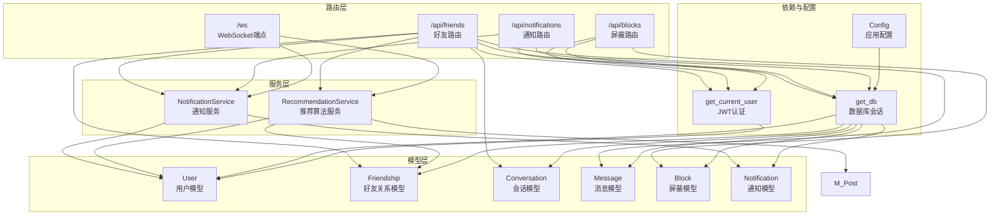
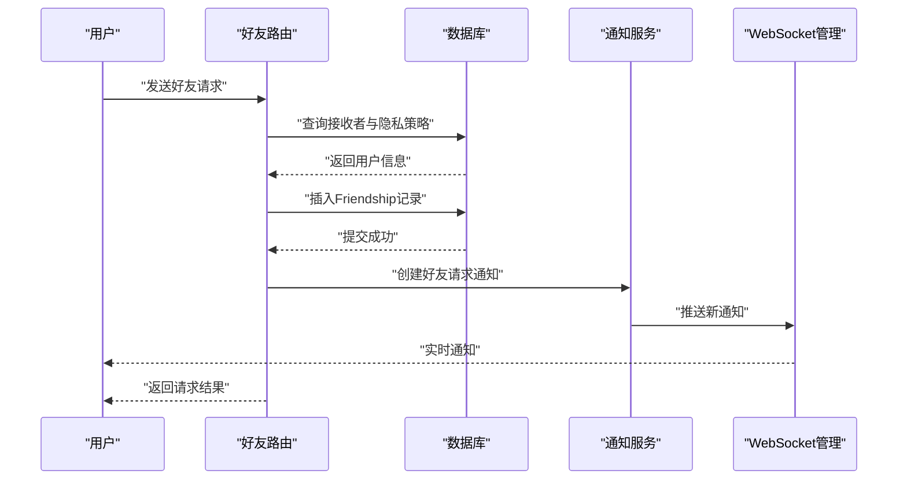
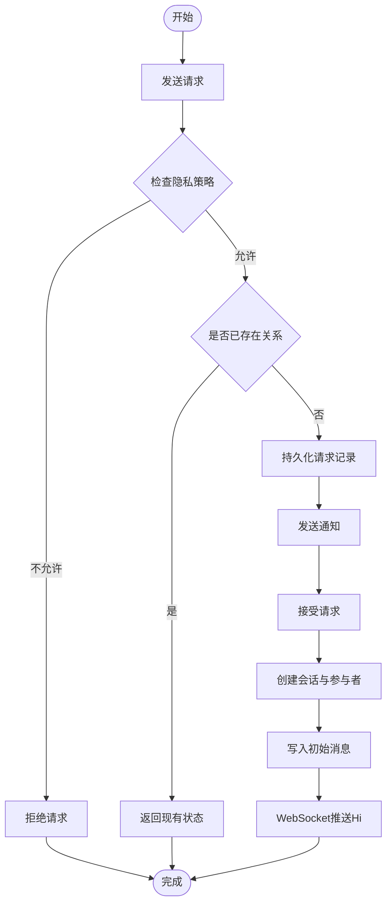
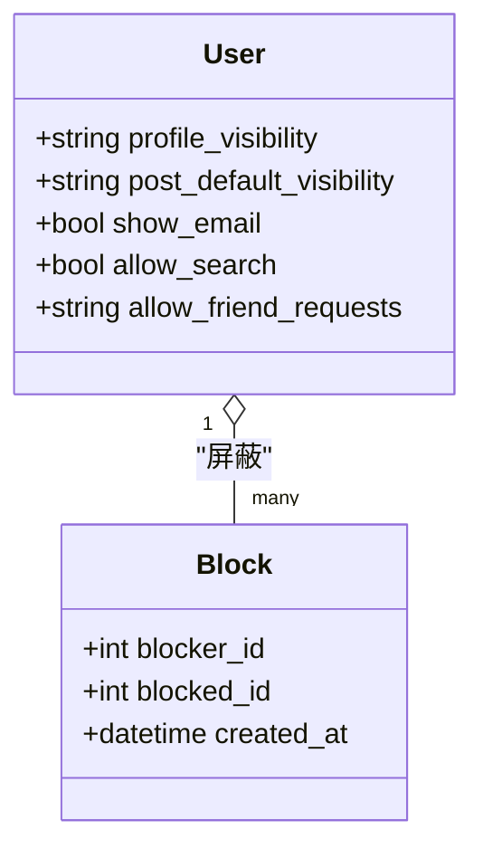
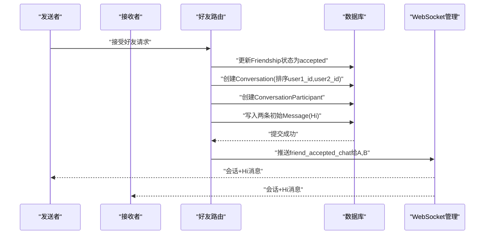
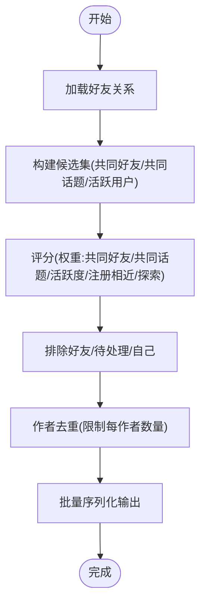
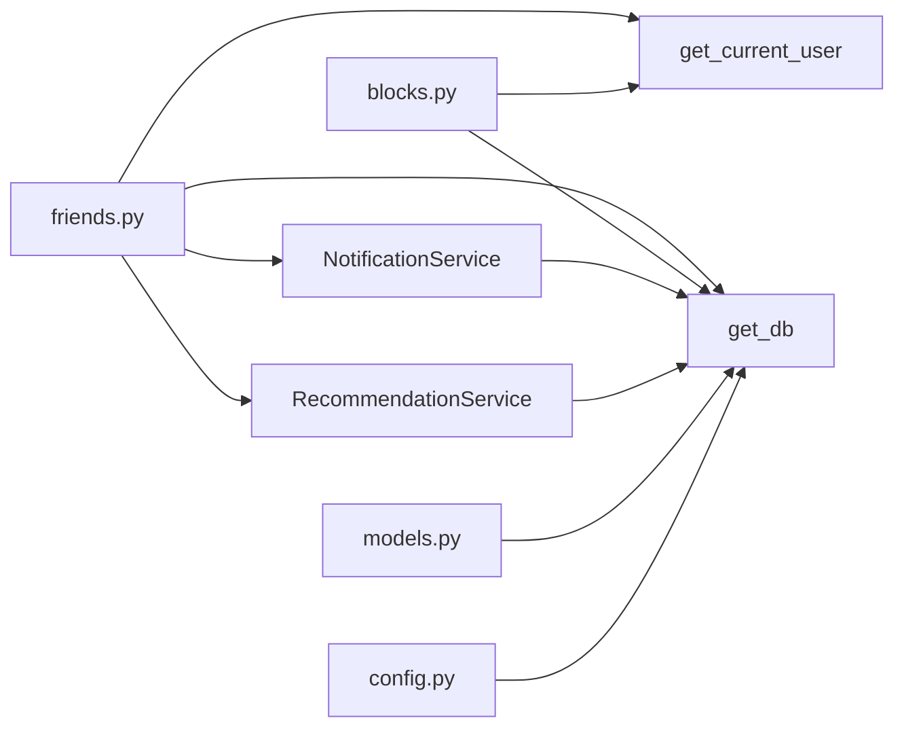

# 好友社交系统

<cite>
**本文档引用的文件**
- [app/routers/friends.py](file://app/routers/friends.py)
- [app/models/models.py](file://app/models/models.py)
- [app/services/notification_service.py](file://app/services/notification_service.py)
- [app/ws_manager.py](file://app/ws_manager.py)
- [app/routers/blocks.py](file://app/routers/blocks.py)
- [app/services/recommendation_service.py](file://app/services/recommendation_service.py)
- [app/dependencies.py](file://app/dependencies.py)
- [app/database.py](file://app/database.py)
- [app/main.py](file://app/main.py)
- [app/core/config.py](file://app/core/config.py)
- [openapi.json](file://openapi.json)
</cite>

## 目录
1. [简介](#简介)
2. [项目结构](#项目结构)
3. [核心组件](#核心组件)
4. [架构总览](#架构总览)
5. [详细组件分析](#详细组件分析)
6. [依赖关系分析](#依赖关系分析)
7. [性能考虑](#性能考虑)
8. [故障排除指南](#故障排除指南)
9. [结论](#结论)
10. [附录](#附录)

## 简介
本文件面向NanTuPy项目的好友社交系统，系统性梳理好友关系管理的完整生命周期（请求、接受/拒绝、删除）、黑名单机制与隐私控制策略、社交动态生成、关系查询与状态管理、隐私设置配置与访问控制、关系图谱构建、社交推荐算法以及性能优化策略。同时提供API接口设计、错误处理与扩展开发方案，帮助开发者快速理解与二次开发。

## 项目结构
NanTuPy采用FastAPI + SQLAlchemy架构，路由层负责REST接口，服务层封装业务逻辑，模型层定义数据结构，依赖注入与数据库配置贯穿各层。好友社交系统主要涉及以下模块：
- 路由层：好友关系、屏蔽、通知、推荐、WebSocket管理
- 服务层：通知服务、推荐算法服务
- 模型层：用户、好友关系、会话、消息、屏蔽、通知等
- 依赖与配置：JWT认证、数据库连接、安全头

**图表来源**
- [app/routers/friends.py:1-385](file://app/routers/friends.py#L1-L385)
- [app/routers/blocks.py:1-101](file://app/routers/blocks.py#L1-L101)
- [app/services/notification_service.py:1-233](file://app/services/notification_service.py#L1-L233)
- [app/services/recommendation_service.py:1-457](file://app/services/recommendation_service.py#L1-L457)
- [app/models/models.py:42-444](file://app/models/models.py#L42-L444)
- [app/dependencies.py:16-62](file://app/dependencies.py#L16-L62)
- [app/database.py:22-32](file://app/database.py#L22-L32)
- [app/core/config.py:7-43](file://app/core/config.py#L7-L43)

**章节来源**
- [app/main.py:68-84](file://app/main.py#L68-L84)
- [app/database.py:1-38](file://app/database.py#L1-L38)
- [app/core/config.py:1-43](file://app/core/config.py#L1-L43)

## 核心组件
- 好友关系模型：Friendship，包含发送者、接收者、状态（pending/accepted/rejected/blocked）、创建/更新时间
- 会话与消息：Conversation、ConversationParticipant、Message，用于好友接受后的即时通讯基础
- 通知服务：NotificationService，统一处理好友请求、接受、消息等通知的创建与WebSocket推送
- WebSocket管理：WSManager，提供序号机制、断线补发、ACK去重与会话房间广播
- 屏蔽模型：Block，记录屏蔽关系，配合隐私策略限制互动
- 推荐算法：RecommendationService，提供好友推荐、个性化动态流、趋势内容等

**章节来源**
- [app/models/models.py:261-284](file://app/models/models.py#L261-L284)
- [app/models/models.py:286-357](file://app/models/models.py#L286-L357)
- [app/models/models.py:424-444](file://app/models/models.py#L424-L444)
- [app/services/notification_service.py:14-233](file://app/services/notification_service.py#L14-L233)
- [app/ws_manager.py:20-308](file://app/ws_manager.py#L20-L308)
- [app/services/recommendation_service.py:10-457](file://app/services/recommendation_service.py#L10-L457)

## 架构总览
好友社交系统围绕“用户—好友关系—会话消息—通知—推荐”形成闭环：
- 用户通过JWT认证，路由层校验权限并调用服务层
- 服务层执行业务规则（隐私策略、黑名单、关系状态），必要时创建会话与消息
- 通知服务通过WebSocket实时推送，WSManager保证可靠投递
- 推荐服务基于社交图谱与内容特征，输出个性化内容

**图表来源**
- [app/routers/friends.py:19-74](file://app/routers/friends.py#L19-L74)
- [app/services/notification_service.py:144-162](file://app/services/notification_service.py#L144-L162)
- [app/ws_manager.py:74-95](file://app/ws_manager.py#L74-L95)

**章节来源**
- [app/routers/friends.py:19-74](file://app/routers/friends.py#L19-L74)
- [app/services/notification_service.py:144-162](file://app/services/notification_service.py#L144-L162)
- [app/ws_manager.py:74-95](file://app/ws_manager.py#L74-L95)

## 详细组件分析

### 好友关系生命周期管理
- 发送请求：校验接收者存在性与隐私策略（允许范围），防止自加与重复请求
- 接受请求：校验接收者身份与状态，原子性创建1v1会话、参与者与初始消息，推送双方“Hi”
- 拒绝/取消：仅限对应权限用户操作，更新状态
- 删除好友：双向匹配已接受关系，删除记录
- 状态查询：根据双向条件查询，返回状态与关系对象
- 推荐好友：基于共同好友、共同话题、活跃度、注册时间相近与探索性随机

**图表来源**
- [app/routers/friends.py:19-74](file://app/routers/friends.py#L19-L74)
- [app/routers/friends.py:76-134](file://app/routers/friends.py#L76-L134)
- [app/routers/friends.py:160-182](file://app/routers/friends.py#L160-L182)
- [app/routers/friends.py:267-289](file://app/routers/friends.py#L267-L289)
- [app/routers/friends.py:291-304](file://app/routers/friends.py#L291-L304)
- [app/routers/friends.py:325-356](file://app/routers/friends.py#L325-L356)

**章节来源**
- [app/routers/friends.py:19-356](file://app/routers/friends.py#L19-L356)

### 黑名单机制与隐私控制
- 屏蔽模型：Block记录屏蔽者与被屏蔽者，支持查询、解除与状态检查
- 隐私字段：User模型包含profile_visibility、post_default_visibility、show_email、allow_search、allow_friend_requests等
- 隐私策略在请求阶段生效：none禁止请求；friends_of_friends要求发送者与接收者至少有一个共同好友

**图表来源**
- [app/models/models.py:58-68](file://app/models/models.py#L58-L68)
- [app/models/models.py:424-444](file://app/models/models.py#L424-L444)
- [app/routers/blocks.py:14-101](file://app/routers/blocks.py#L14-L101)
- [app/routers/friends.py:38-56](file://app/routers/friends.py#L38-L56)

**章节来源**
- [app/models/models.py:58-68](file://app/models/models.py#L58-L68)
- [app/routers/blocks.py:14-101](file://app/routers/blocks.py#L14-L101)
- [app/routers/friends.py:38-56](file://app/routers/friends.py#L38-L56)

### 社交动态生成与关系查询
- 动态生成：好友接受后自动创建Conversation与Message，双方会话中包含对方信息与初始Hi消息
- 关系查询：支持获取好友列表、待处理请求、发送/接收请求列表、用户好友数量、关系状态等
- 状态管理：Friendship状态机覆盖pending/accepted/rejected，配合通知与WebSocket推送

**图表来源**
- [app/routers/friends.py:76-134](file://app/routers/friends.py#L76-L134)
- [app/routers/friends.py:359-385](file://app/routers/friends.py#L359-L385)
- [app/ws_manager.py:364-375](file://app/ws_manager.py#L364-L375)

**章节来源**
- [app/routers/friends.py:76-134](file://app/routers/friends.py#L76-L134)
- [app/routers/friends.py:359-385](file://app/routers/friends.py#L359-L385)

### 隐私设置配置与访问控制
- 隐私设置项：个人资料可见性、帖子默认可见性、邮箱展示、允许搜索、允许好友请求范围
- 访问控制：JWT认证中间件，路由依赖注入获取当前用户，部分接口需要管理员权限
- API安全头：COOP/COEP安全头，适配Flutter Web环境

**章节来源**
- [app/models/models.py:58-68](file://app/models/models.py#L58-L68)
- [app/dependencies.py:16-62](file://app/dependencies.py#L16-L62)
- [app/main.py:60-66](file://app/main.py#L60-L66)

### 关系图谱构建与社交推荐算法
- 好友推荐：综合共同好友、共同话题、活跃度、注册时间相近与探索性随机，计算匹配度与百分比
- 个性化动态流：基于好友作者权重、交互得分、话题相关性、参与度与时间衰减因子，去重作者并分页
- 趋势内容：基于近24小时参与度与时间衰减因子，按作者去重输出

**图表来源**
- [app/services/recommendation_service.py:298-431](file://app/services/recommendation_service.py#L298-L431)
- [app/services/recommendation_service.py:82-168](file://app/services/recommendation_service.py#L82-L168)
- [app/services/recommendation_service.py:171-232](file://app/services/recommendation_service.py#L171-L232)

**章节来源**
- [app/services/recommendation_service.py:298-431](file://app/services/recommendation_service.py#L298-L431)
- [app/services/recommendation_service.py:82-168](file://app/services/recommendation_service.py#L82-L168)
- [app/services/recommendation_service.py:171-232](file://app/services/recommendation_service.py#L171-L232)

### API接口设计与错误处理
- 好友接口：请求发送、接受/拒绝、取消、删除、列表查询、状态查询、数量统计、推荐
- 屏蔽接口：添加、删除、列表、状态检查
- 通知接口：创建与推送（含WebSocket序号与去重）
- 错误处理：HTTP状态码标准化（400/403/404/500），数据库事务回滚，日志记录

**章节来源**
- [openapi.json:1941-2027](file://openapi.json#L1941-L2027)
- [openapi.json:2029-2046](file://openapi.json#L2029-L2046)
- [openapi.json:5648-5694](file://openapi.json#L5648-L5694)
- [app/routers/friends.py:19-74](file://app/routers/friends.py#L19-L74)
- [app/routers/blocks.py:14-101](file://app/routers/blocks.py#L14-L101)
- [app/services/notification_service.py:55-84](file://app/services/notification_service.py#L55-L84)

## 依赖关系分析
- 路由依赖：get_current_user（JWT认证）、get_db（数据库会话）
- 服务依赖：NotificationService、RecommendationService
- 模型依赖：User、Friendship、Conversation、Message、Block、Notification
- 配置依赖：Config（数据库URI、JWT密钥、上传配置）

**图表来源**
- [app/routers/friends.py:11-14](file://app/routers/friends.py#L11-L14)
- [app/routers/blocks.py:7-9](file://app/routers/blocks.py#L7-L9)
- [app/dependencies.py:16-36](file://app/dependencies.py#L16-L36)
- [app/database.py:22-32](file://app/database.py#L22-L32)
- [app/models/models.py:42-444](file://app/models/models.py#L42-L444)
- [app/core/config.py:7-20](file://app/core/config.py#L7-L20)

**章节来源**
- [app/routers/friends.py:11-14](file://app/routers/friends.py#L11-L14)
- [app/routers/blocks.py:7-9](file://app/routers/blocks.py#L7-L9)
- [app/dependencies.py:16-36](file://app/dependencies.py#L16-L36)
- [app/database.py:22-32](file://app/database.py#L22-L32)
- [app/models/models.py:42-444](file://app/models/models.py#L42-L444)
- [app/core/config.py:7-20](file://app/core/config.py#L7-L20)

## 性能考虑
- 批量数据加载：RecommendationService使用批量查询聚合数据，避免N+1问题
- 分页与has_more：动态流与趋势内容多取1条判断下一页，减少昂贵COUNT
- 作者去重：限制每作者最大输出数量，提升多样性与性能平衡
- 数据库连接池：SQLAlchemy连接池参数可调，预热与回收策略降低连接开销
- WebSocket序号与断线补发：WSManager原子序号分配与消息日志，保障离线后同步

**章节来源**
- [app/services/recommendation_service.py:16-80](file://app/services/recommendation_service.py#L16-L80)
- [app/services/recommendation_service.py:139-144](file://app/services/recommendation_service.py#L139-L144)
- [app/database.py:9-16](file://app/database.py#L9-L16)
- [app/ws_manager.py:170-213](file://app/ws_manager.py#L170-L213)

## 故障排除指南
- 认证失败：检查JWT密钥与Token有效性，确认get_current_user依赖注入工作
- 数据库异常：查看get_db事务回滚与日志，确认连接池参数与SQL语句
- WebSocket推送失败：检查WSManager连接状态、序号分配与ACK去重，关注日志警告
- 推荐结果为空：确认候选集构建逻辑与排除条件，检查活跃度与共同话题过滤

**章节来源**
- [app/dependencies.py:16-36](file://app/dependencies.py#L16-L36)
- [app/database.py:22-32](file://app/database.py#L22-L32)
- [app/ws_manager.py:20-53](file://app/ws_manager.py#L20-L53)
- [app/services/recommendation_service.py:317-431](file://app/services/recommendation_service.py#L317-L431)

## 结论
NanTuPy的好友社交系统以清晰的路由-服务-模型分层实现，结合隐私策略、黑名单与通知推送，形成完整的好友关系生命周期管理。推荐算法通过社交图谱与内容特征实现高质量推荐，配合批量加载与去重策略保障性能。WebSocket序号机制与断线补发进一步提升了用户体验。建议在生产环境中完善监控与告警，持续优化推荐权重与数据库索引。

## 附录
- 扩展开发建议：
  - 引入缓存层（Redis）缓存好友关系与推荐结果
  - 增加好友关系审计日志，支持风控与合规
  - 优化推荐算法，引入深度学习特征与在线学习
  - 增加好友分组与标签，细化隐私控制粒度