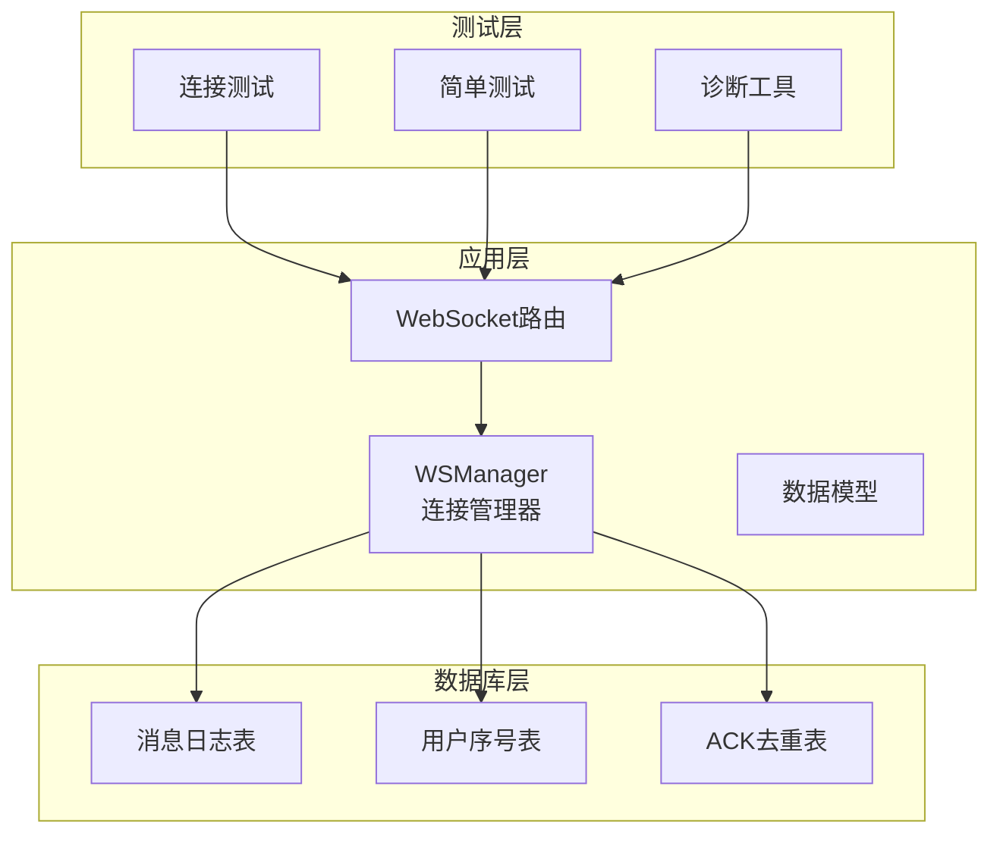
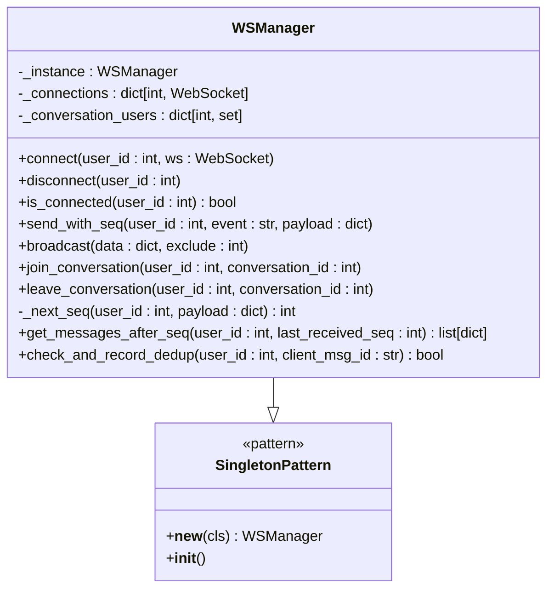
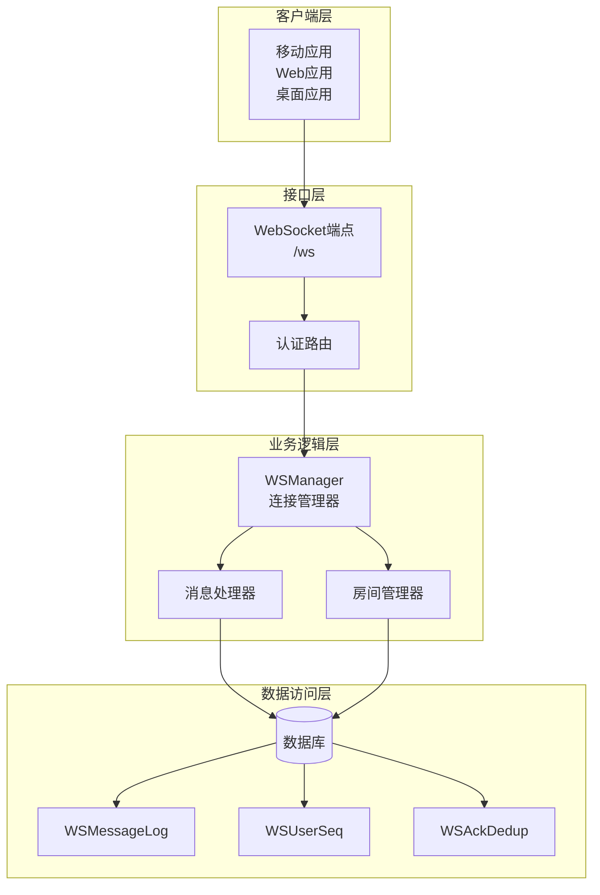
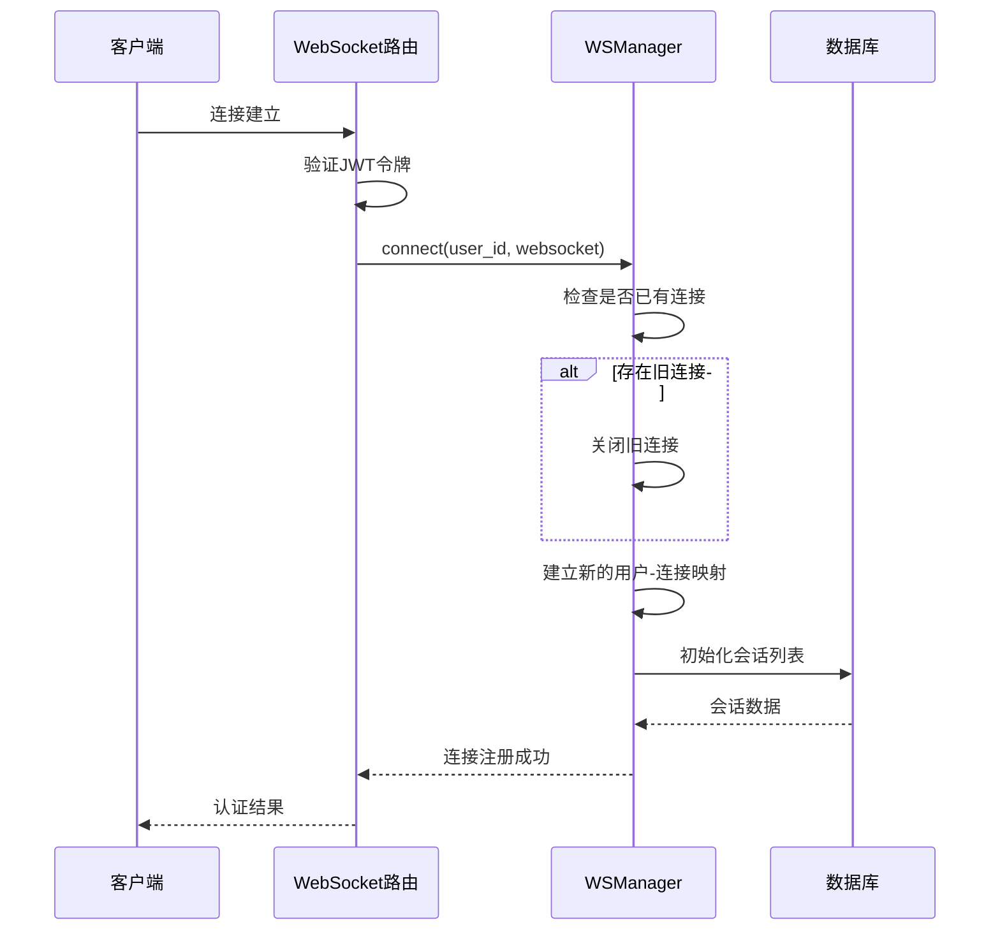
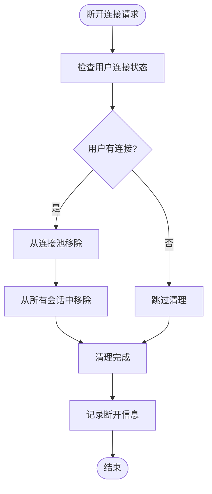
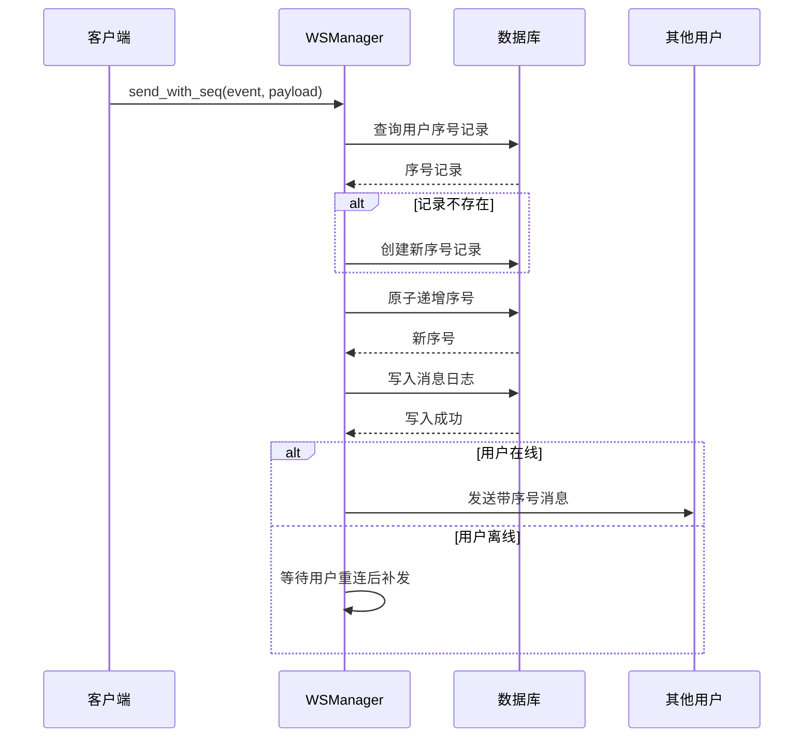
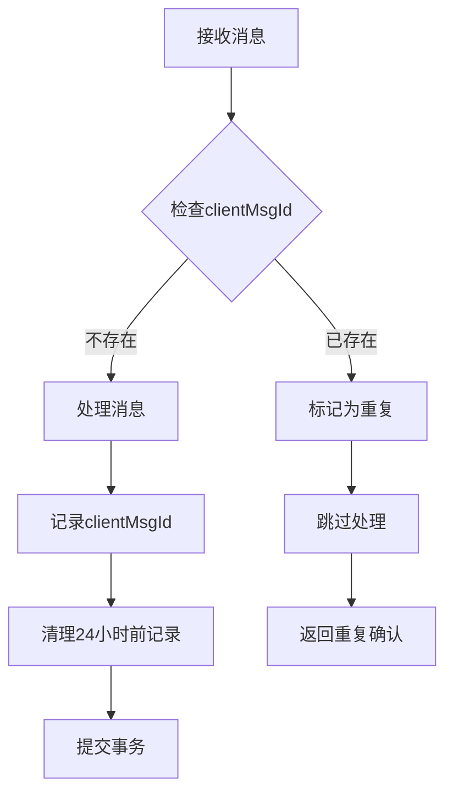
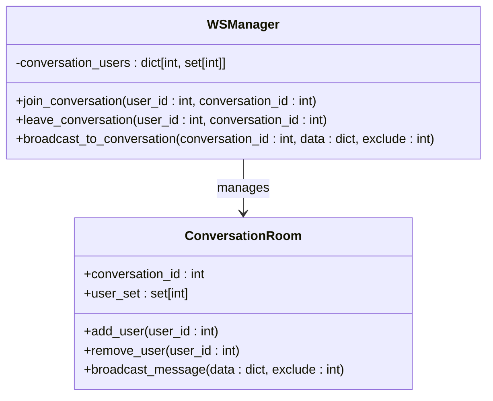
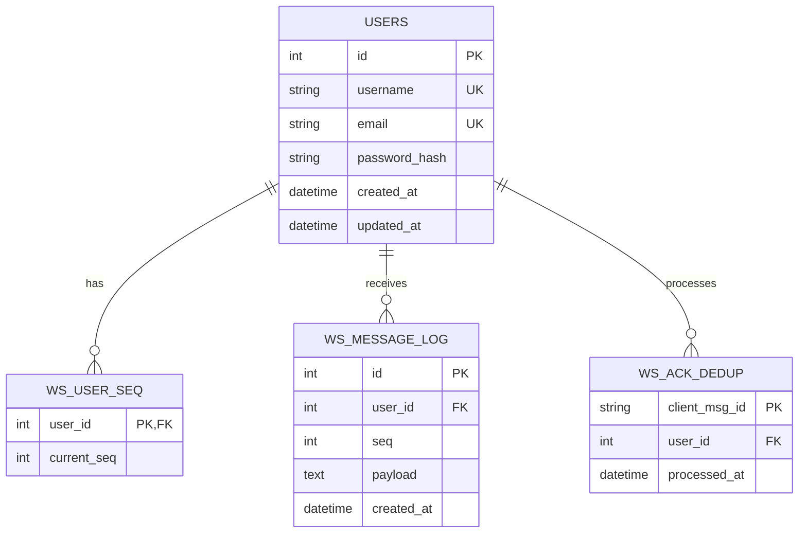
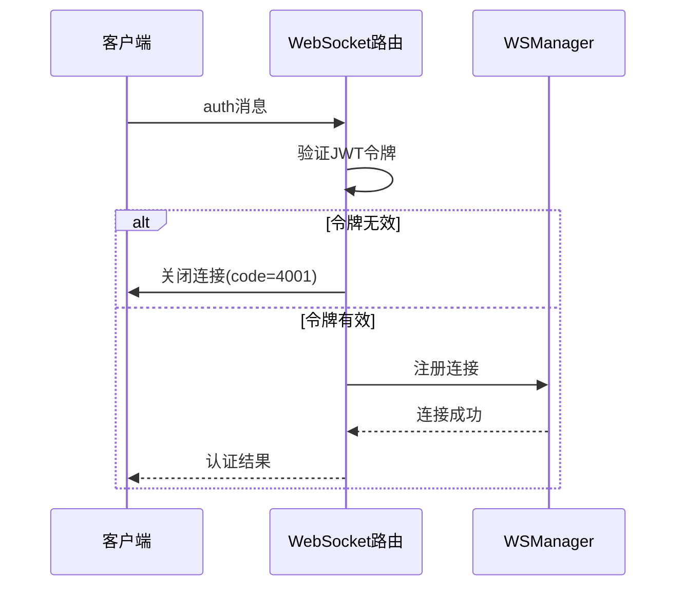

# WebSocket连接管理

<cite>
**本文档引用的文件**
- [app/ws_manager.py](file://app/ws_manager.py)
- [app/routers/ws.py](file://app/routers/ws.py)
- [app/models/models.py](file://app/models/models.py)
- [migrations/add_ws_protocol_tables.sql](file://migrations/add_ws_protocol_tables.sql)
- [tests/test_ws_connect.py](file://tests/test_ws_connect.py)
- [tests/test_ws_simple.py](file://tests/test_ws_simple.py)
- [tests/diagnose_websocket.py](file://tests/diagnose_websocket.py)
</cite>

## 目录
1. [简介](#简介)
2. [项目结构](#项目结构)
3. [核心组件](#核心组件)
4. [架构概览](#架构概览)
5. [详细组件分析](#详细组件分析)
6. [依赖关系分析](#依赖关系分析)
7. [性能考虑](#性能考虑)
8. [故障排除指南](#故障排除指南)
9. [结论](#结论)
10. [附录](#附录)

## 简介

WebSocket连接管理系统是一个基于FastAPI构建的实时通信解决方案，专为已认证用户设计。该系统实现了完整的WebSocket连接生命周期管理，包括连接注册、断开连接、在线状态检查等功能，并提供了强大的消息序列化机制，确保消息的可靠传输和断线补发能力。

系统的核心特性包括：
- **单例模式设计**：WSManager类采用单例模式，确保全局唯一的状态管理
- **连接池管理**：维护用户ID到WebSocket实例的映射关系
- **消息序列化**：为每条推送消息分配用户维度的单调递增序号
- **断线补发机制**：支持sync操作，自动补发离线期间的消息
- **ACK去重**：防止重复消息的处理，确保幂等性
- **会话房间管理**：支持群组聊天和typing状态广播

## 项目结构

该项目采用模块化的架构设计，主要包含以下关键目录和文件：



**图表来源**
- [app/ws_manager.py:1-308](file://app/ws_manager.py#L1-L308)
- [app/routers/ws.py:1-538](file://app/routers/ws.py#L1-L538)
- [app/models/models.py:625-655](file://app/models/models.py#L625-L655)

**章节来源**
- [app/ws_manager.py:1-308](file://app/ws_manager.py#L1-L308)
- [app/routers/ws.py:1-538](file://app/routers/ws.py#L1-L538)

## 核心组件

### WSManager类架构

WSManager是整个WebSocket连接管理系统的核心，采用了单例模式设计，确保在整个应用程序中只有一个连接管理器实例。

#### 单例模式实现



**图表来源**
- [app/ws_manager.py:20-308](file://app/ws_manager.py#L20-L308)

#### 连接池管理机制

系统通过字典结构维护用户连接池，其中键为用户ID，值为对应的WebSocket实例：

- `_connections`: 用户ID到WebSocket实例的映射
- `_conversation_users`: 会话ID到用户集合的映射

这种设计确保了高效的连接查找和管理，时间复杂度为O(1)。

**章节来源**
- [app/ws_manager.py:20-69](file://app/ws_manager.py#L20-L69)

## 架构概览

WebSocket连接管理系统采用分层架构设计，各层职责明确，耦合度低：



**图表来源**
- [app/routers/ws.py:434-538](file://app/routers/ws.py#L434-L538)
- [app/ws_manager.py:170-304](file://app/ws_manager.py#L170-L304)

## 详细组件分析

### 连接生命周期管理

#### 连接注册流程

连接注册是WebSocket生命周期管理的第一步，负责建立用户与WebSocket实例的映射关系：



**图表来源**
- [app/routers/ws.py:182-212](file://app/routers/ws.py#L182-L212)
- [app/ws_manager.py:45-54](file://app/ws_manager.py#L45-L54)

#### 断开连接处理

断开连接时，系统需要清理所有相关的状态信息：



**图表来源**
- [app/ws_manager.py:56-60](file://app/ws_manager.py#L56-L60)

**章节来源**
- [app/ws_manager.py:45-69](file://app/ws_manager.py#L45-L69)

### 消息序列化系统

#### 序列号分配机制

消息序列化系统是整个WebSocket协议的核心，确保消息的可靠传输和顺序保证：



**图表来源**
- [app/ws_manager.py:170-213](file://app/ws_manager.py#L170-L213)

#### 序列号系统实现细节

序列号系统采用原子操作确保并发安全性：

1. **序号记录初始化**：当用户第一次发送消息时，系统会在`ws_user_seq`表中创建序号记录
2. **原子递增操作**：使用SQL UPDATE语句进行原子性的序号递增
3. **消息持久化**：将消息内容和序号一起写入`ws_message_log`表
4. **事务管理**：所有操作都在同一个数据库事务中完成，确保一致性

**章节来源**
- [app/ws_manager.py:170-213](file://app/ws_manager.py#L170-L213)
- [app/models/models.py:625-646](file://app/models/models.py#L625-L646)

### ACK去重机制

#### 幂等性保证

ACK去重机制确保相同消息不会被重复处理：



**图表来源**
- [app/ws_manager.py:265-303](file://app/ws_manager.py#L265-L303)

#### 去重表设计

去重表采用UUID作为主键，包含用户ID和处理时间戳：

- **client_msg_id**：客户端消息ID（UUID）
- **user_id**：处理该消息的用户ID
- **processed_at**：消息处理时间

系统会定期清理24小时前的去重记录，避免存储空间无限增长。

**章节来源**
- [app/ws_manager.py:265-303](file://app/ws_manager.py#L265-L303)
- [app/models/models.py:648-655](file://app/models/models.py#L648-L655)

### 会话房间管理

#### 房间参与机制

系统支持会话房间功能，用于群组聊天和状态广播：



**图表来源**
- [app/ws_manager.py:136-164](file://app/ws_manager.py#L136-L164)

**章节来源**
- [app/ws_manager.py:136-164](file://app/ws_manager.py#L136-L164)

## 依赖关系分析

### 数据库表结构

系统依赖三个核心表来支持WebSocket协议：



**图表来源**
- [app/models/models.py:625-655](file://app/models/models.py#L625-L655)
- [migrations/add_ws_protocol_tables.sql:4-26](file://migrations/add_ws_protocol_tables.sql#L4-L26)

### 外部依赖

系统的主要外部依赖包括：

- **FastAPI**：Web框架和WebSocket支持
- **SQLAlchemy**：ORM和数据库操作
- **JWTS**：JWT令牌验证
- **websockets**：WebSocket客户端测试

**章节来源**
- [app/routers/ws.py:8-16](file://app/routers/ws.py#L8-L16)
- [app/ws_manager.py:6-15](file://app/ws_manager.py#L6-L15)

## 性能考虑

### 连接池优化

系统通过以下机制优化连接池性能：

1. **内存映射**：使用Python字典实现O(1)的连接查找
2. **异步处理**：所有WebSocket操作都是异步的，避免阻塞
3. **连接复用**：同一用户的新连接会自动替换旧连接
4. **资源清理**：断开连接时立即释放相关资源

### 数据库性能优化

1. **索引设计**：为消息日志表建立了复合索引`(user_id, seq)`
2. **事务批处理**：序列号递增和消息记录在同一个事务中完成
3. **连接池**：使用SQLAlchemy的连接池管理数据库连接
4. **定期清理**：提供SQL脚本定期清理过期数据

### 内存管理

1. **弱引用**：WebSocket实例通过强引用管理，避免内存泄漏
2. **及时清理**：断开连接时立即清理相关状态
3. **批量操作**：广播操作使用批量发送减少网络开销

## 故障排除指南

### 常见连接问题

#### 认证失败

当用户认证失败时，服务器会主动关闭连接：



**图表来源**
- [app/routers/ws.py:446-470](file://app/routers/ws.py#L446-L470)

#### 连接超时处理

系统通过以下机制处理连接超时：

1. **心跳检测**：客户端定期发送ping消息
2. **异常捕获**：捕获WebSocketDisconnect异常
3. **自动清理**：断开连接时自动清理相关状态

**章节来源**
- [app/routers/ws.py:530-538](file://app/routers/ws.py#L530-L538)

### 数据库问题诊断

#### 序列号不连续

如果发现序列号不连续，可能是以下原因：

1. **数据库事务回滚**：序列号递增操作失败导致回滚
2. **并发冲突**：多个用户同时发送消息导致竞争条件
3. **数据库连接问题**：数据库连接异常导致操作失败

#### 消息丢失

消息丢失通常是由于以下原因：

1. **网络中断**：客户端网络不稳定导致连接中断
2. **服务器重启**：服务器重启导致未持久化的消息丢失
3. **数据库故障**：数据库故障影响消息持久化

### 测试和验证

系统提供了完整的测试套件来验证功能正确性：

#### 连接测试

测试脚本验证了完整的连接流程：
- 连接建立和认证
- 心跳检测（ping/pong）
- 会话列表获取
- 断线补发（sync）
- 消息发送和ACK确认
- 无效令牌处理
- 幂等性验证

#### 简单连接测试

简单的连接测试用于诊断基本连接问题：
- 不带认证的连接
- 基本的WebSocket握手
- 连接状态监控

**章节来源**
- [tests/test_ws_connect.py:1-319](file://tests/test_ws_connect.py#L1-L319)
- [tests/test_ws_simple.py:1-57](file://tests/test_ws_simple.py#L1-L57)

## 结论

WebSocket连接管理系统是一个设计精良的实时通信解决方案，具有以下特点：

### 设计优势

1. **单例模式确保一致性**：全局唯一的WSManager实例避免了状态不一致问题
2. **模块化架构**：清晰的分层设计便于维护和扩展
3. **可靠性保障**：完整的序列化、去重和补发机制确保消息可靠传输
4. **性能优化**：内存映射、异步处理和数据库优化提升整体性能

### 技术创新

1. **用户维度序列化**：每个用户独立的序列号系统
2. **断线补发机制**：智能的消息补发确保信息不丢失
3. **幂等性保证**：ACK去重机制防止重复处理
4. **会话房间管理**：支持群组聊天和状态广播

### 最佳实践建议

1. **连接管理**：始终使用WSManager提供的方法管理连接
2. **错误处理**：妥善处理WebSocketDisconnect异常
3. **资源清理**：及时清理断开连接的相关状态
4. **性能监控**：监控连接数量和数据库性能指标
5. **安全考虑**：严格验证JWT令牌和用户权限

该系统为实时通信应用提供了坚实的技术基础，能够满足高并发、高可靠性的需求。

## 附录

### 实际使用示例

#### 基本连接管理

```python
# 连接管理示例
from app.ws_manager import ws_manager

# 注册连接
await ws_manager.connect(user_id, websocket)

# 检查连接状态
if ws_manager.is_connected(user_id):
    print("用户在线")

# 发送带序号的消息
await ws_manager.send_with_seq(user_id, "event_name", {"data": "value"})

# 断开连接
await ws_manager.disconnect(user_id)
```

#### 消息发送流程

```python
# 消息发送示例
async def send_message(user_id, content):
    # 发送消息
    await ws_manager.send_with_seq(
        user_id, 
        "message", 
        {"content": content}
    )
    
    # 或者发送原始消息
    await ws_manager.send_raw(user_id, {"type": "pong"})
```

#### 会话房间管理

```python
# 会话房间示例
# 加入房间
ws_manager.join_conversation(user_id, conversation_id)

# 离开房间
ws_manager.leave_conversation(user_id, conversation_id)

# 广播到房间
await ws_manager.broadcast_to_conversation(
    conversation_id, 
    {"type": "typing", "user_id": user_id}
)
```

### 配置和部署

#### 数据库迁移

系统需要执行以下SQL脚本来创建必要的表：

```sql
-- 创建消息日志表
CREATE TABLE IF NOT EXISTS ws_message_log (
    id INT AUTO_INCREMENT PRIMARY KEY,
    user_id INT NOT NULL,
    seq INT NOT NULL,
    payload JSON NOT NULL,
    created_at DATETIME NOT NULL DEFAULT CURRENT_TIMESTAMP,
    UNIQUE KEY uq_ws_msg_user_seq (user_id, seq),
    INDEX idx_ws_msg_user_seq (user_id, seq),
    CONSTRAINT fk_ws_msg_user FOREIGN KEY (user_id) REFERENCES users(id) ON DELETE CASCADE
);

-- 创建用户序号表
CREATE TABLE IF NOT EXISTS ws_user_seq (
    user_id INT PRIMARY KEY,
    current_seq INT NOT NULL DEFAULT 0,
    CONSTRAINT fk_ws_seq_user FOREIGN KEY (user_id) REFERENCES users(id) ON DELETE CASCADE
);

-- 创建ACK去重表
CREATE TABLE IF NOT EXISTS ws_ack_dedup (
    client_msg_id CHAR(36) PRIMARY KEY,
    user_id INT NOT NULL,
    processed_at DATETIME NOT NULL DEFAULT CURRENT_TIMESTAMP,
    CONSTRAINT fk_ws_ack_user FOREIGN KEY (user_id) REFERENCES users(id) ON DELETE CASCADE
);
```

#### 定时清理任务

建议设置定时任务定期清理过期数据：

```sql
-- 清理24小时前的去重记录
DELETE FROM ws_ack_dedup WHERE processed_at < NOW() - INTERVAL 24 HOUR;

-- 清理7天前的消息日志
DELETE FROM ws_message_log WHERE created_at < NOW() - INTERVAL 7 DAY;
```