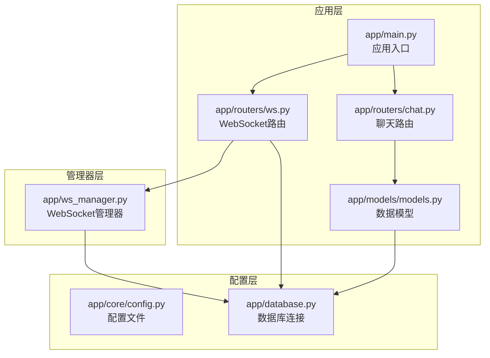
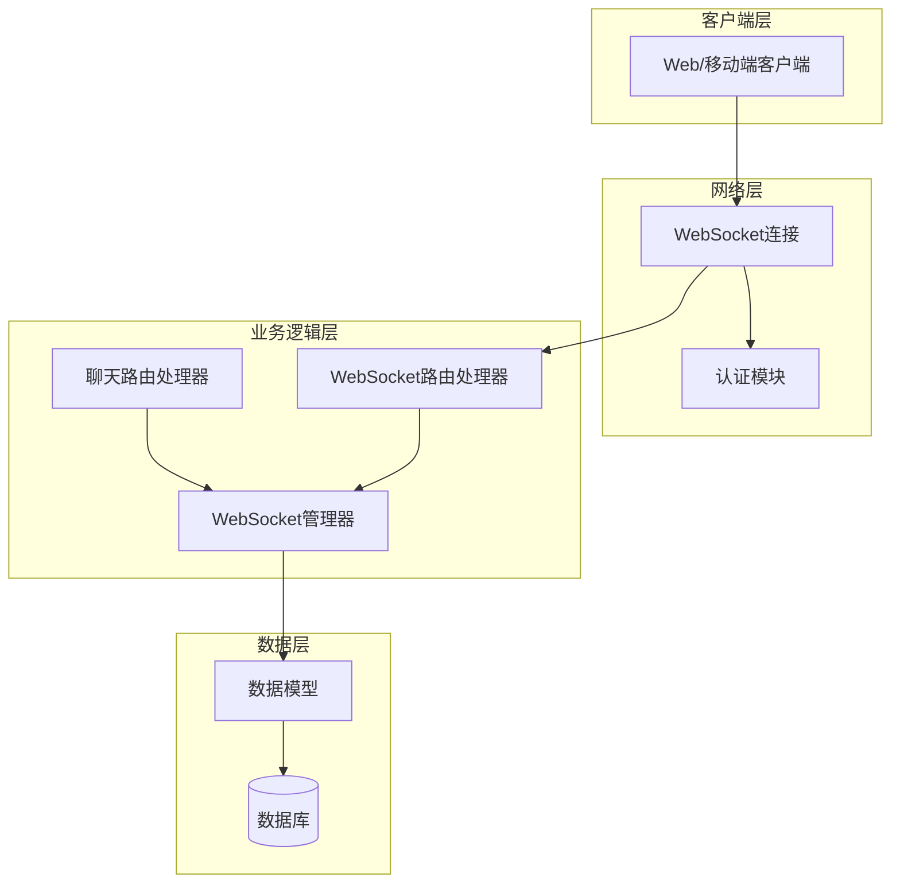
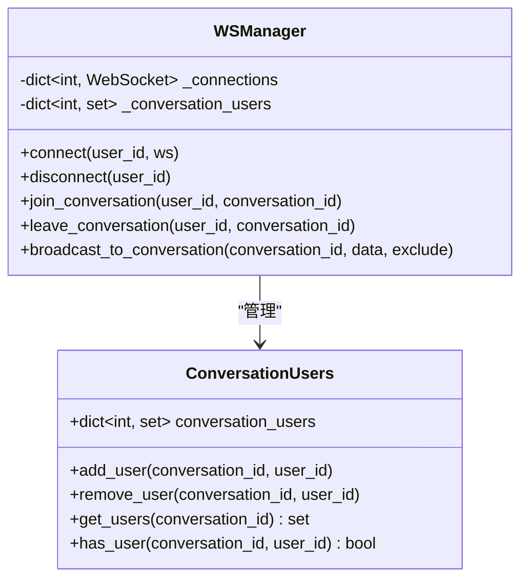
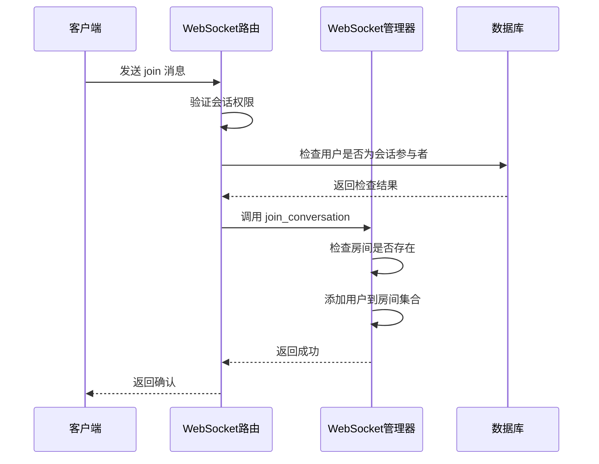
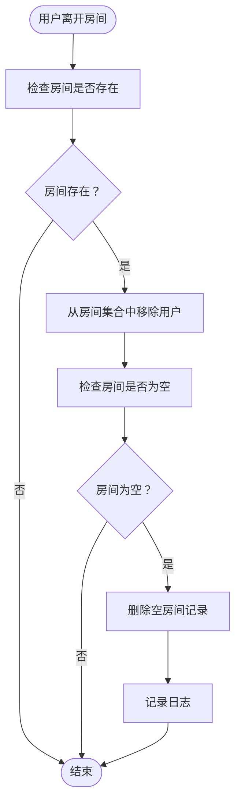
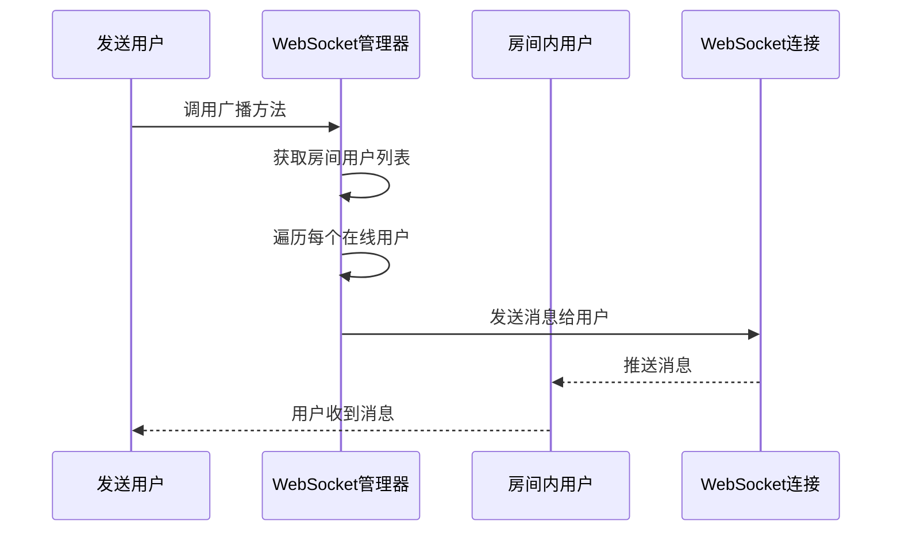
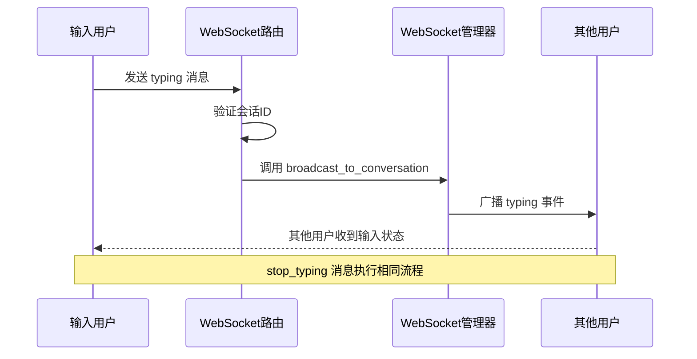
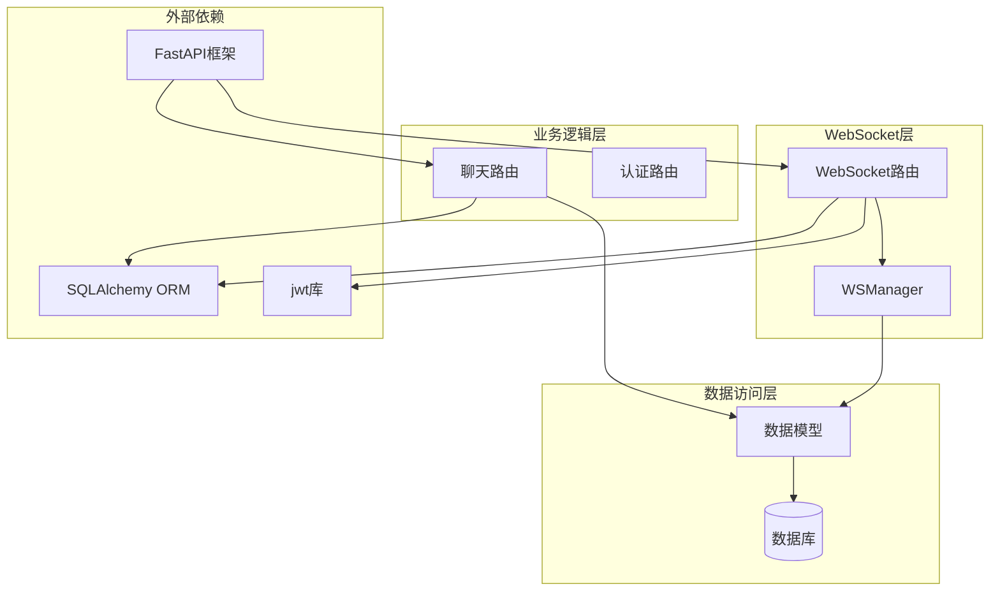

# 会话房间管理

<cite>
**本文档引用的文件**
- [app/ws_manager.py](file://app/ws_manager.py)
- [app/routers/ws.py](file://app/routers/ws.py)
- [app/models/models.py](file://app/models/models.py)
- [app/main.py](file://app/main.py)
- [websocket_api.json](file://websocket_api.json)
- [error_analysis.md](file://error_analysis.md)
</cite>

## 目录
1. [简介](#简介)
2. [项目结构](#项目结构)
3. [核心组件](#核心组件)
4. [架构概览](#架构概览)
5. [详细组件分析](#详细组件分析)
6. [依赖关系分析](#依赖关系分析)
7. [性能考虑](#性能考虑)
8. [故障排除指南](#故障排除指南)
9. [结论](#结论)

## 简介

本文件详细阐述了 NanTuPy 社交平台中的会话房间管理系统。该系统基于 WebSocket 实现，提供了实时的会话房间管理、用户连接管理、消息广播等功能。重点分析了 `conversation_users` 字典的数据结构、房间管理机制，以及 `join_conversation` 和 `leave_conversation` 方法的实现原理。同时文档化了房间广播功能 `broadcast_to_conversation` 的工作流程，解释了 typing 状态广播、输入提示等实时交互功能的实现，并提供了房间管理的最佳实践。

## 项目结构

NanTuPy 采用 FastAPI 框架构建，整体项目结构清晰，模块职责明确：

**图表来源**
- [app/main.py:1-110](file://app/main.py#L1-L110)
- [app/routers/ws.py:1-538](file://app/routers/ws.py#L1-L538)
- [app/ws_manager.py:1-308](file://app/ws_manager.py#L1-L308)

**章节来源**
- [app/main.py:1-110](file://app/main.py#L1-L110)
- [app/routers/ws.py:1-538](file://app/routers/ws.py#L1-L538)
- [app/ws_manager.py:1-308](file://app/ws_manager.py#L1-L308)

## 核心组件

### WebSocket 管理器 (WSManager)

WSManager 是整个会话房间管理系统的核心组件，实现了单例模式，负责管理用户连接和会话房间。

#### 主要数据结构

1. **connections 字典** (`user_id -> WebSocket`)
   - 存储在线用户的 WebSocket 连接
   - 用于一对一消息推送

2. **conversation_users 字典** (`conversation_id -> set of user_ids`)
   - 核心房间管理数据结构
   - 使用集合存储房间内的用户ID，便于快速查找和去重

#### 关键特性

- **单例模式**：确保全局只有一个 WSManager 实例
- **房间管理**：支持动态加入和离开会话房间
- **广播功能**：支持房间内广播和全站广播
- **序列化消息**：提供带序号的消息推送机制

**章节来源**
- [app/ws_manager.py:20-36](file://app/ws_manager.py#L20-L36)
- [app/ws_manager.py:136-165](file://app/ws_manager.py#L136-L165)

## 架构概览

会话房间管理系统采用分层架构设计，各组件职责清晰：

**图表来源**
- [app/routers/ws.py:434-538](file://app/routers/ws.py#L434-L538)
- [app/ws_manager.py:20-308](file://app/ws_manager.py#L20-L308)

## 详细组件分析

### conversation_users 字典数据结构

`conversation_users` 是会话房间管理的核心数据结构，采用了字典嵌套集合的设计模式：

**图表来源**
- [app/ws_manager.py:28-35](file://app/ws_manager.py#L28-L35)
- [app/ws_manager.py:136-165](file://app/ws_manager.py#L136-L165)

#### 数据结构特点

1. **键值设计**：`conversation_id` 作为主键，`set` 作为值存储用户ID
2. **去重机制**：使用集合自动去除重复用户
3. **内存效率**：相比列表，集合在查找和删除操作上更高效
4. **线程安全**：在单线程的异步环境中运行，避免并发问题

**章节来源**
- [app/ws_manager.py:28-35](file://app/ws_manager.py#L28-L35)
- [app/ws_manager.py:136-165](file://app/ws_manager.py#L136-L165)

### join_conversation 方法实现原理

join_conversation 方法实现了用户加入会话房间的功能：

**图表来源**
- [app/routers/ws.py:332-351](file://app/routers/ws.py#L332-L351)
- [app/ws_manager.py:136-140](file://app/ws_manager.py#L136-L140)

#### 实现细节

1. **权限验证**：通过查询 `ConversationParticipant` 表验证用户是否为会话参与者
2. **房间创建**：如果房间不存在，自动创建空集合
3. **用户添加**：使用 `add()` 方法将用户ID添加到房间集合中
4. **日志记录**：记录用户加入房间的操作日志

**章节来源**
- [app/routers/ws.py:332-351](file://app/routers/ws.py#L332-L351)
- [app/ws_manager.py:136-140](file://app/ws_manager.py#L136-L140)

### leave_conversation 方法实现原理

leave_conversation 方法实现了用户离开会话房间的功能：

**图表来源**
- [app/ws_manager.py:142-148](file://app/ws_manager.py#L142-L148)

#### 实现细节

1. **用户移除**：使用 `discard()` 方法从房间集合中移除用户ID
2. **房间清理**：如果房间变为空，自动删除房间记录
3. **异常处理**：使用 `discard()` 而不是 `remove()`，避免用户不在房间时抛出异常
4. **日志记录**：记录用户离开房间的操作日志

**章节来源**
- [app/ws_manager.py:142-148](file://app/ws_manager.py#L142-L148)

### broadcast_to_conversation 方法工作流程

broadcast_to_conversation 方法实现了会话房间内的广播功能：

**图表来源**
- [app/ws_manager.py:158-165](file://app/ws_manager.py#L158-L165)

#### 工作流程

1. **用户检索**：从 `conversation_users` 字典中获取指定房间的所有用户ID
2. **排除机制**：支持排除特定用户（通常是消息发送者）
3. **逐个推送**：遍历房间内的每个用户，使用 `_raw_send` 方法发送消息
4. **错误处理**：对每个用户的发送操作进行独立的异常处理

**章节来源**
- [app/ws_manager.py:158-165](file://app/ws_manager.py#L158-L165)

### typing 状态广播实现

typing 状态广播是实时交互功能的重要组成部分：

**图表来源**
- [app/routers/ws.py:361-373](file://app/routers/ws.py#L361-L373)
- [app/ws_manager.py:158-165](file://app/ws_manager.py#L158-L165)

#### 实现特点

1. **非持久化**：typing 事件使用 `seq=0`，不进入消息序列系统
2. **即时性**：直接调用 `_raw_send` 方法，确保实时性
3. **排除发送者**：自动排除消息发送者，避免自己看到自己的输入状态
4. **简单结构**：消息格式简洁，只包含必要的元数据

**章节来源**
- [app/routers/ws.py:361-373](file://app/routers/ws.py#L361-L373)
- [websocket_api.json:183-196](file://websocket_api.json#L183-L196)

## 依赖关系分析

会话房间管理系统涉及多个组件之间的复杂依赖关系：

**图表来源**
- [app/main.py:14-84](file://app/main.py#L14-L84)
- [app/routers/ws.py:11-16](file://app/routers/ws.py#L11-L16)
- [app/models/models.py:286-357](file://app/models/models.py#L286-L357)

### 关键依赖关系

1. **WSManager 依赖**：
   - FastAPI WebSocket：用于建立和管理 WebSocket 连接
   - SQLAlchemy：用于数据库操作和会话管理
   - JWT：用于用户身份验证

2. **路由依赖**：
   - WSManager：房间管理的核心依赖
   - 数据模型：会话、消息、用户等实体
   - 数据库会话：事务管理和数据一致性

3. **数据模型依赖**：
   - Conversation：会话实体，包含用户关系
   - Message：消息实体，包含内容和元数据
   - ConversationParticipant：会话参与者关系

**章节来源**
- [app/main.py:14-84](file://app/main.py#L14-L84)
- [app/routers/ws.py:11-16](file://app/routers/ws.py#L11-L16)
- [app/models/models.py:286-357](file://app/models/models.py#L286-L357)

## 性能考虑

会话房间管理系统在设计时充分考虑了性能优化：

### 时间复杂度分析

1. **join_conversation**：O(1) - 字典查找和集合添加
2. **leave_conversation**：O(1) - 字典查找和集合删除
3. **broadcast_to_conversation**：O(n) - n 为房间内用户数量
4. **用户在线检查**：O(1) - 字典查找

### 内存使用优化

1. **集合去重**：使用集合自动去除重复用户，节省内存
2. **惰性加载**：房间数据只在需要时创建
3. **及时清理**：空房间自动删除，避免内存泄漏

### 并发处理

1. **异步设计**：完全基于 asyncio，支持高并发连接
2. **独立异常处理**：每个用户的发送操作独立处理异常
3. **连接管理**：自动检测和清理断开的连接

## 故障排除指南

### 常见问题及解决方案

#### 1. 会话房间管理错误

**问题**：用户无法加入或离开会话房间
**原因**：权限验证失败或数据库连接问题
**解决方案**：
- 检查用户是否为会话参与者
- 验证数据库连接状态
- 查看日志中的错误信息

#### 2. typing 状态广播失效

**问题**：用户看不到其他人的输入状态
**原因**：房间管理器状态异常或网络问题
**解决方案**：
- 检查 `conversation_users` 字典状态
- 验证用户连接状态
- 确认广播方法正常执行

#### 3. 性能问题

**问题**：房间内广播响应缓慢
**原因**：房间内用户过多或网络延迟
**解决方案**：
- 限制房间内用户数量
- 优化网络连接质量
- 考虑分批广播策略

**章节来源**
- [app/ws_manager.py:142-165](file://app/ws_manager.py#L142-L165)
- [app/routers/ws.py:332-373](file://app/routers/ws.py#L332-L373)

## 结论

会话房间管理系统通过精心设计的数据结构和算法，实现了高效的实时通信功能。`conversation_users` 字典采用字典嵌套集合的设计，既保证了查找效率，又提供了良好的内存使用特性。join_conversation 和 leave_conversation 方法的实现简洁高效，能够满足大规模用户场景的需求。

系统的关键优势包括：
- **高性能**：O(1) 的房间操作时间复杂度
- **实时性**：基于 WebSocket 的即时消息传递
- **可靠性**：完善的错误处理和连接管理
- **可扩展性**：模块化的架构设计，易于扩展新功能

通过遵循本文档提供的最佳实践，开发者可以有效地管理用户会话房间，实现稳定可靠的实时交互功能。