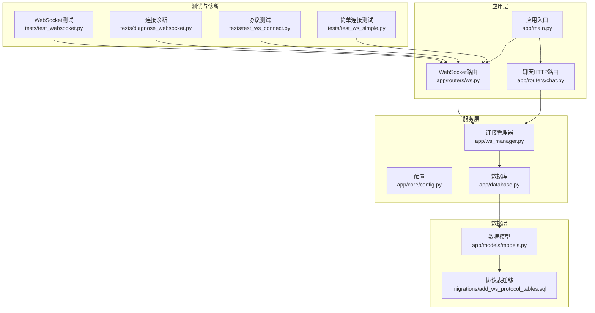
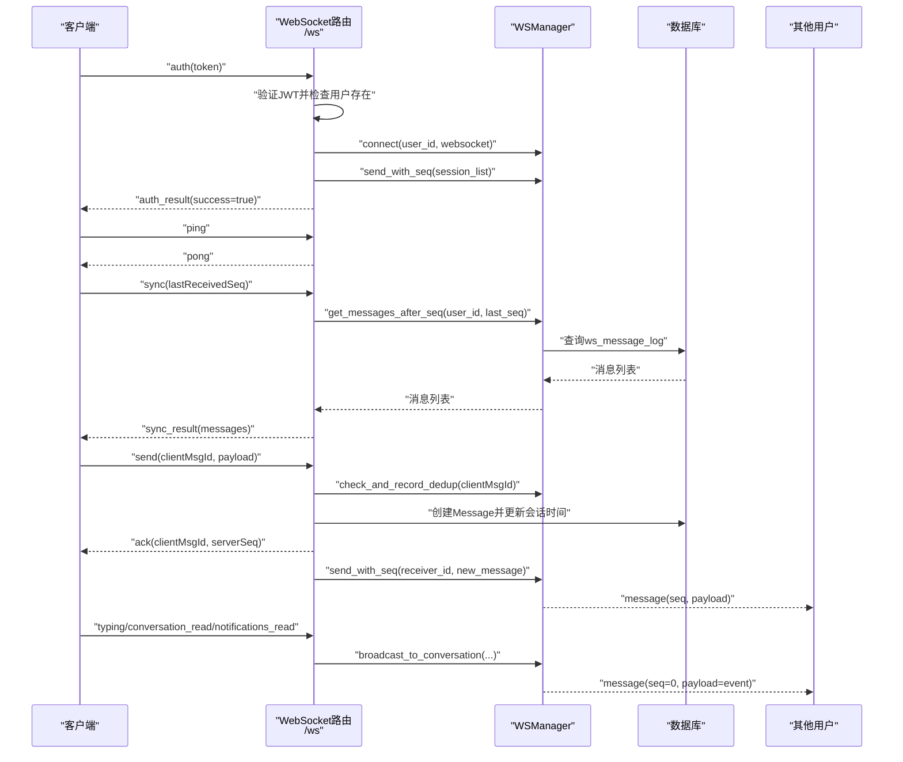
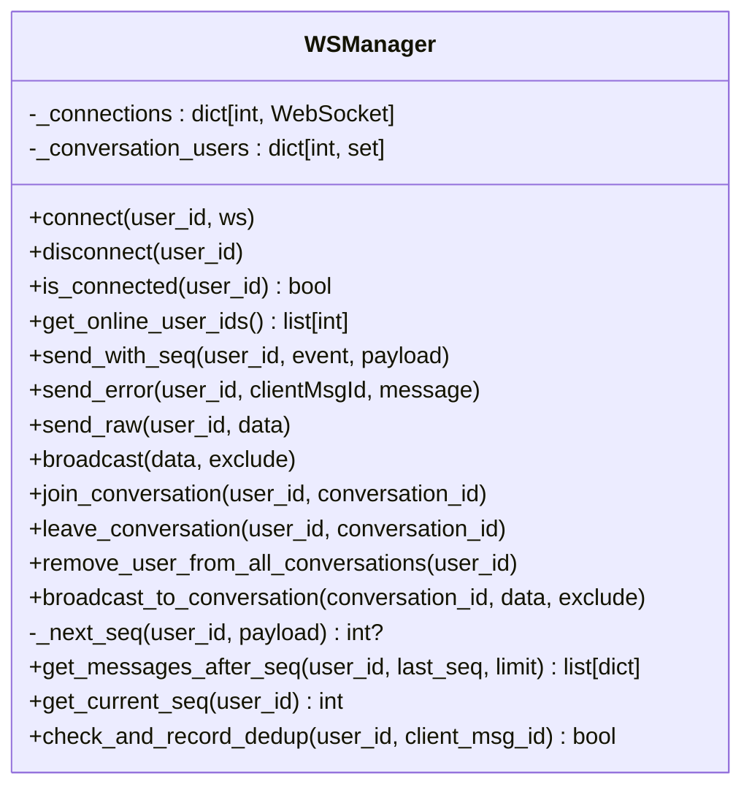
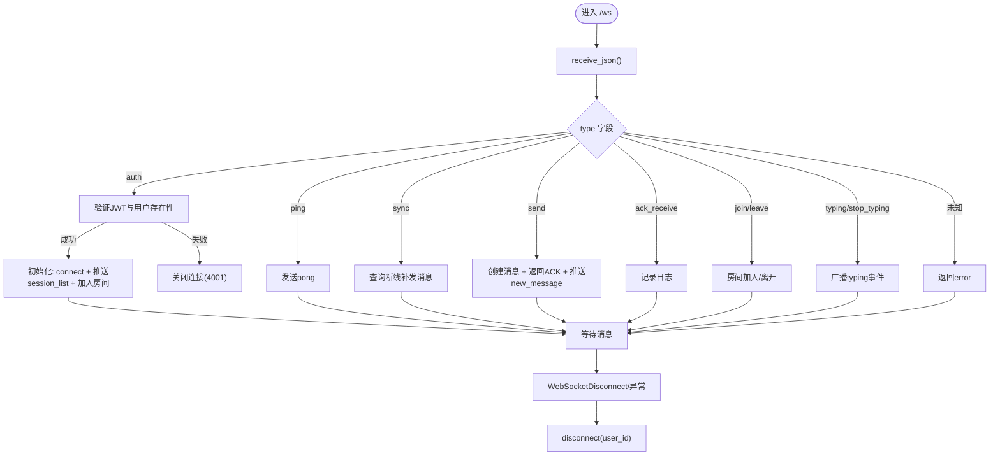
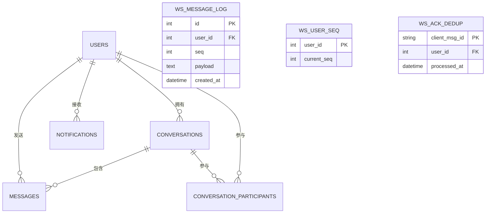
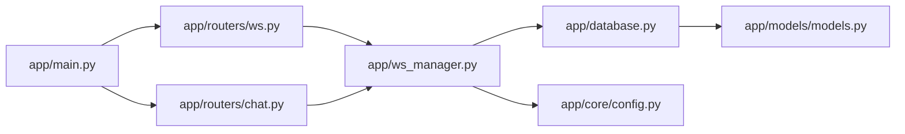

# 实时通信系统

<cite>
**本文档引用的文件**
- [app/ws_manager.py](file://app/ws_manager.py)
- [app/routers/ws.py](file://app/routers/ws.py)
- [app/main.py](file://app/main.py)
- [app/models/models.py](file://app/models/models.py)
- [migrations/add_ws_protocol_tables.sql](file://migrations/add_ws_protocol_tables.sql)
- [app/routers/chat.py](file://app/routers/chat.py)
- [tests/test_websocket.py](file://tests/test_websocket.py)
- [tests/diagnose_websocket.py](file://tests/diagnose_websocket.py)
- [tests/test_ws_connect.py](file://tests/test_ws_connect.py)
- [tests/test_ws_simple.py](file://tests/test_ws_simple.py)
- [app/core/config.py](file://app/core/config.py)
- [app/database.py](file://app/database.py)
- [requirements.txt](file://requirements.txt)
</cite>

## 目录
1. [简介](#简介)
2. [项目结构](#项目结构)
3. [核心组件](#核心组件)
4. [架构总览](#架构总览)
5. [详细组件分析](#详细组件分析)
6. [依赖关系分析](#依赖关系分析)
7. [性能考量](#性能考量)
8. [故障排查指南](#故障排查指南)
9. [结论](#结论)
10. [附录](#附录)

## 简介
本文件面向NanTuPy的实时通信系统，聚焦于WebSocket架构设计与连接管理机制，系统性阐述消息广播、在线状态跟踪、房间管理、私信聊天、群组通信与消息推送的技术实现；同时给出连接建立、心跳检测、断线重连的完整流程，并覆盖并发连接处理、内存管理与性能优化策略，以及消息序列化、事件处理与错误恢复机制。文末提供客户端集成指南与调试工具使用方法，帮助开发者快速落地与排障。

## 项目结构
NanTuPy采用FastAPI框架，实时通信模块主要由以下部分组成：
- WebSocket端点与消息处理：位于路由层，负责认证、消息分发与房间管理
- 连接管理器：集中维护用户连接、会话房间、消息序号与ACK去重
- 数据模型与迁移：定义会话、消息、通知等业务实体及WebSocket协议表
- 路由与服务：提供HTTP接口与WebSocket接口，统一对外暴露聊天能力
- 测试与诊断：包含连接测试、诊断工具与协议验证脚本

图表来源
- [app/main.py:84](file://app/main.py#L84)
- [app/routers/ws.py:434-538](file://app/routers/ws.py#L434-L538)
- [app/routers/chat.py:1-538](file://app/routers/chat.py#L1-L538)
- [app/ws_manager.py:20-308](file://app/ws_manager.py#L20-L308)
- [app/models/models.py:625-655](file://app/models/models.py#L625-L655)
- [migrations/add_ws_protocol_tables.sql:1-32](file://migrations/add_ws_protocol_tables.sql#L1-L32)

章节来源
- [app/main.py:84](file://app/main.py#L84)
- [app/routers/ws.py:434-538](file://app/routers/ws.py#L434-L538)
- [app/routers/chat.py:1-538](file://app/routers/chat.py#L1-L538)
- [app/ws_manager.py:20-308](file://app/ws_manager.py#L20-L308)
- [app/models/models.py:625-655](file://app/models/models.py#L625-L655)
- [migrations/add_ws_protocol_tables.sql:1-32](file://migrations/add_ws_protocol_tables.sql#L1-L32)

## 核心组件
- 连接管理器（WSManager）：单例管理用户连接、会话房间、消息序号与ACK去重，提供发送、广播、同步等能力
- WebSocket路由（/ws）：认证、消息分发、房间管理、心跳、断线补发、ACK接收
- 数据模型：会话、消息、通知、WebSocket协议表（序号日志、用户序号、ACK去重）
- HTTP聊天路由：会话列表、消息历史、标记已读、在线状态查询等
- 应用入口：注册路由、CORS与安全头、WebSocket端点挂载

章节来源
- [app/ws_manager.py:20-308](file://app/ws_manager.py#L20-L308)
- [app/routers/ws.py:27-538](file://app/routers/ws.py#L27-L538)
- [app/models/models.py:286-356](file://app/models/models.py#L286-L356)
- [app/routers/chat.py:23-538](file://app/routers/chat.py#L23-L538)
- [app/main.py:84](file://app/main.py#L84)

## 架构总览
WebSocket实时通信采用“认证-初始化-消息分发-房间广播-断线补发”的闭环流程。认证通过JWT校验，初始化阶段推送会话列表并自动加入既有会话房间；消息发送采用带序号的可靠投递，支持ACK去重与断线补发；房间管理用于typing等非持久化事件广播；心跳通过ping/pong维持连接活性。

图表来源
- [app/routers/ws.py:446-538](file://app/routers/ws.py#L446-L538)
- [app/ws_manager.py:45-117](file://app/ws_manager.py#L45-L117)
- [app/ws_manager.py:170-213](file://app/ws_manager.py#L170-L213)
- [app/ws_manager.py:214-247](file://app/ws_manager.py#L214-L247)
- [app/ws_manager.py:361-373](file://app/ws_manager.py#L361-L373)

## 详细组件分析

### 连接管理器（WSManager）
- 单例模式：确保全局唯一连接池与房间集合
- 连接管理：注册/断开连接、重复连接关闭、在线用户查询
- 发送机制：send_with_seq分配用户维度单调递增序号，持久化到ws_message_log，离线用户通过sync补发
- 广播：向所有在线用户广播，自动清理断连用户
- 房间管理：join/leave会话房间，支持typing等非持久化事件广播
- 序号系统：原子递增用户序号，持久化消息日志，提供断线补发查询
- ACK去重：基于clientMsgId的幂等检查，定期清理24小时前记录

图表来源
- [app/ws_manager.py:20-308](file://app/ws_manager.py#L20-L308)

章节来源
- [app/ws_manager.py:20-308](file://app/ws_manager.py#L20-L308)

### WebSocket路由（/ws）
- 认证：接收auth消息，验证JWT与用户存在性，成功后初始化：注册连接、推送会话列表、自动加入房间
- 心跳：ping/pong维持连接活性
- 断线补发：sync请求返回seq > lastReceivedSeq的消息
- 消息发送：send消息创建消息、返回ACK、向接收方推送带序号的新消息
- 房间管理：join/leave会话房间，typing/stop_typing广播
- 特殊事件：conversation_read、notifications_read等payload事件路由
- 错误处理：未认证消息拒绝、异常捕获与断开连接

图表来源
- [app/routers/ws.py:434-538](file://app/routers/ws.py#L434-L538)
- [app/routers/ws.py:182-213](file://app/routers/ws.py#L182-L213)
- [app/routers/ws.py:317-330](file://app/routers/ws.py#L317-L330)
- [app/routers/ws.py:215-315](file://app/routers/ws.py#L215-L315)
- [app/routers/ws.py:332-373](file://app/routers/ws.py#L332-L373)

章节来源
- [app/routers/ws.py:27-538](file://app/routers/ws.py#L27-L538)

### 数据模型与协议表
- 会话与消息：Conversation、ConversationParticipant、Message
- 通知：Notification
- WebSocket协议表：WSMessageLog（断线补发）、WSUserSeq（用户序号计数器）、WSAckDedup（ACK去重）

图表来源
- [app/models/models.py:286-356](file://app/models/models.py#L286-L356)
- [app/models/models.py:625-655](file://app/models/models.py#L625-L655)
- [migrations/add_ws_protocol_tables.sql:1-32](file://migrations/add_ws_protocol_tables.sql#L1-L32)

章节来源
- [app/models/models.py:286-356](file://app/models/models.py#L286-L356)
- [app/models/models.py:625-655](file://app/models/models.py#L625-L655)
- [migrations/add_ws_protocol_tables.sql:1-32](file://migrations/add_ws_protocol_tables.sql#L1-L32)

### HTTP聊天路由（补充）
- 会话列表：与WebSocket推送的session_list同构，支持在线状态查询
- 消息历史：分页获取会话消息
- 标记已读：会话与通知的已读状态更新
- 在线状态：查询用户在线状态

章节来源
- [app/routers/chat.py:23-538](file://app/routers/chat.py#L23-L538)

## 依赖关系分析
- 应用入口注册WebSocket端点与各路由
- WebSocket路由依赖WSManager与配置
- WSManager依赖数据库会话与模型
- 聊天HTTP路由依赖WSManager进行在线状态与推送

图表来源
- [app/main.py:84](file://app/main.py#L84)
- [app/routers/ws.py:16](file://app/routers/ws.py#L16)
- [app/routers/chat.py:12](file://app/routers/chat.py#L12)
- [app/ws_manager.py:15](file://app/ws_manager.py#L15)
- [app/database.py:7](file://app/database.py#L7)
- [app/core/config.py:7-43](file://app/core/config.py#L7-L43)

章节来源
- [app/main.py:84](file://app/main.py#L84)
- [app/routers/ws.py:16](file://app/routers/ws.py#L16)
- [app/routers/chat.py:12](file://app/routers/chat.py#L12)
- [app/ws_manager.py:15](file://app/ws_manager.py#L15)
- [app/database.py:7](file://app/database.py#L7)
- [app/core/config.py:7-43](file://app/core/config.py#L7-L43)

## 性能考量
- 连接池与数据库连接
  - 使用SQLAlchemy同步引擎与连接池配置，预热连接、回收周期与预检，减少连接开销
  - 会话房间采用内存集合，避免频繁数据库查询
- 序号与持久化
  - 原子递增用户序号与消息日志分离，降低锁竞争
  - 断线补发限制查询上限，避免一次性拉取过多消息
- 广播与去重
  - 广播时捕获异常并清理断连用户，避免阻塞
  - ACK去重表定期清理，防止膨胀
- 并发与内存
  - 单例WSManager集中管理，避免重复连接
  - typing等非持久化事件使用seq=0的轻量广播，降低存储压力

章节来源
- [app/database.py:9-19](file://app/database.py#L9-L19)
- [app/ws_manager.py:170-213](file://app/ws_manager.py#L170-L213)
- [app/ws_manager.py:214-247](file://app/ws_manager.py#L214-L247)
- [app/ws_manager.py:118-131](file://app/ws_manager.py#L118-L131)
- [app/ws_manager.py:265-304](file://app/ws_manager.py#L265-L304)

## 故障排查指南
- 服务器运行与端口监听
  - 使用诊断脚本检查健康状态、端口监听、WebSocket端点可达性
- 连接与认证
  - 未认证消息会被拒绝；无效或过期token会导致连接关闭（代码4001）
- 心跳与断线
  - 客户端应周期性发送ping，服务端返回pong；断线后通过sync补发
- 幂等与去重
  - 相同clientMsgId重复发送将被识别为重复请求并返回duplicate标志
- 日志与监控
  - 关注WS与WS SEND FAIL等日志，定位连接异常与发送失败

章节来源
- [tests/diagnose_websocket.py:12-92](file://tests/diagnose_websocket.py#L12-L92)
- [app/routers/ws.py:446-538](file://app/routers/ws.py#L446-L538)
- [app/ws_manager.py:107-117](file://app/ws_manager.py#L107-L117)
- [tests/test_ws_connect.py:179-195](file://tests/test_ws_connect.py#L179-L195)

## 结论
NanTuPy的实时通信系统以WSManager为核心，结合FastAPI路由与SQLAlchemy持久化，实现了可靠的认证、消息序号、断线补发、ACK去重、房间广播与在线状态跟踪。通过严格的连接管理与性能优化策略，系统在高并发场景下仍能保持稳定与低延迟。配合完善的测试与诊断工具，开发者可快速集成与排障。

## 附录

### 客户端集成指南
- 连接与认证
  - 建议使用WebSocket直连，携带JWT token进行认证
  - 认证成功后会收到auth_result与可能的session_list
- 心跳与重连
  - 周期性发送ping，收到pong确认连接正常
  - 断线后使用sync(lastReceivedSeq)补发消息
- 消息发送
  - 发送send消息时提供clientMsgId，服务端返回ack并推送new_message
  - 对于重复请求，服务端会返回duplicate标志
- 房间与状态
  - 通过join/leave加入/离开会话房间，接收typing/stop_typing事件
  - 使用HTTP接口查询在线状态与会话列表

章节来源
- [app/routers/ws.py:446-538](file://app/routers/ws.py#L446-L538)
- [tests/test_ws_connect.py:33-177](file://tests/test_ws_connect.py#L33-L177)
- [app/routers/chat.py:483-509](file://app/routers/chat.py#L483-L509)

### 调试工具使用
- WebSocket连接测试：登录获取token，使用Socket.IO或WebSocket客户端连接，观察连接确认与错误事件
- 连接诊断：检查服务器运行、端口监听、WebSocket端点与Socket.IO连接
- 协议验证：使用协议测试脚本验证auth/ping/sync/send/idempotency等流程

章节来源
- [tests/test_websocket.py:23-78](file://tests/test_websocket.py#L23-L78)
- [tests/diagnose_websocket.py:12-92](file://tests/diagnose_websocket.py#L12-L92)
- [tests/test_ws_connect.py:261-319](file://tests/test_ws_connect.py#L261-L319)
- [tests/test_ws_simple.py:14-57](file://tests/test_ws_simple.py#L14-L57)