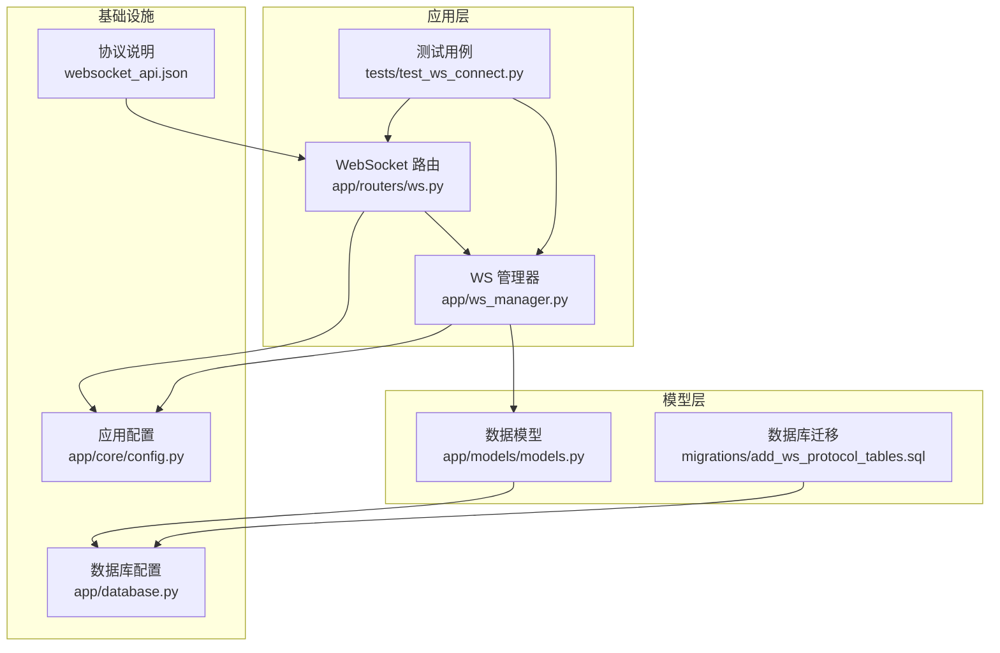
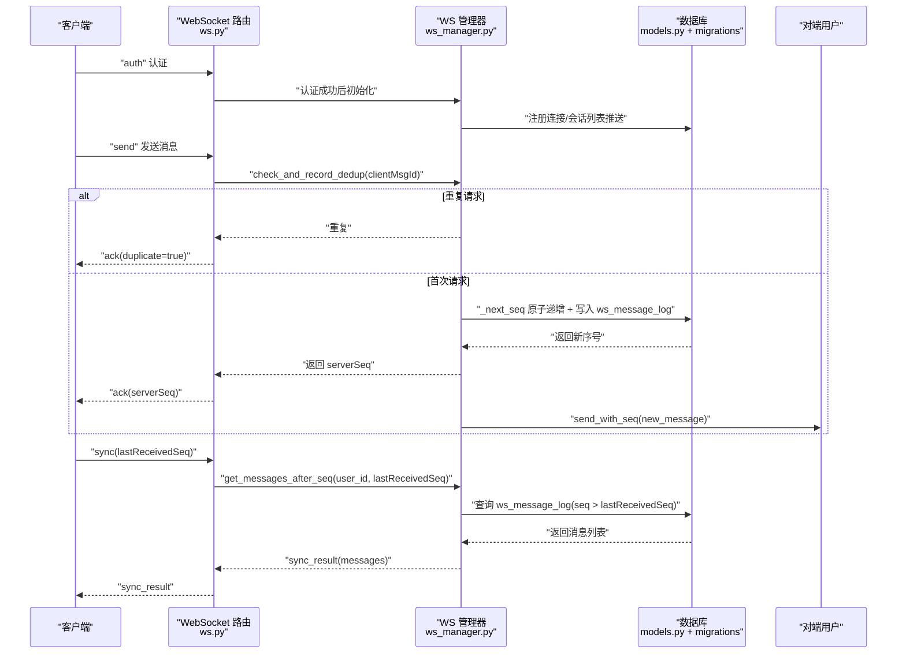
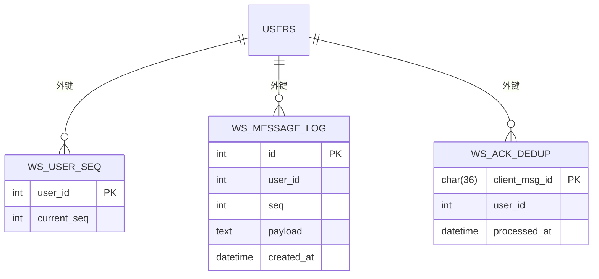
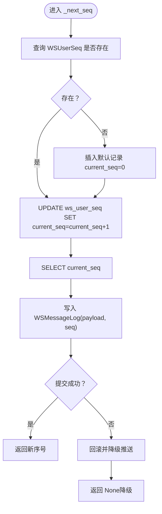
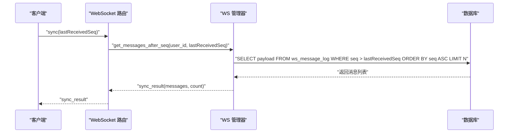
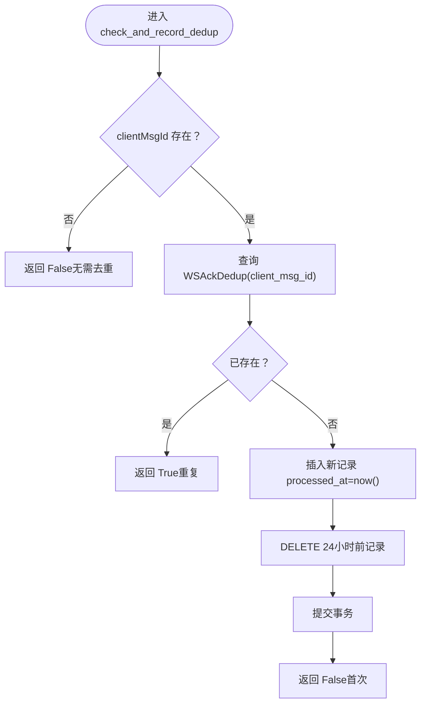
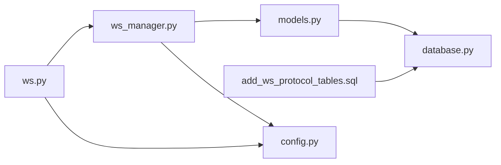

# 消息序号系统

<cite>
**本文引用的文件**
- [models.py](file://app/models/models.py)
- [ws.py](file://app/routers/ws.py)
- [ws_manager.py](file://app/ws_manager.py)
- [add_ws_protocol_tables.sql](file://migrations/add_ws_protocol_tables.sql)
- [database.py](file://app/database.py)
- [config.py](file://app/core/config.py)
- [test_ws_connect.py](file://tests/test_ws_connect.py)
- [websocket_api.json](file://websocket_api.json)
</cite>

## 目录
1. [简介](#简介)
2. [项目结构](#项目结构)
3. [核心组件](#核心组件)
4. [架构总览](#架构总览)
5. [详细组件分析](#详细组件分析)
6. [依赖分析](#依赖分析)
7. [性能考虑](#性能考虑)
8. [故障排查指南](#故障排查指南)
9. [结论](#结论)
10. [附录](#附录)

## 简介
本文件面向消息序号系统，围绕 WebSocket 序号协议 v3.0 的设计与实现，系统性阐述以下主题：
- WSUserSeq 和 WSMessageLog 模型的设计原理与数据库结构
- 消息序号的生成机制、原子递增与持久化策略
- 断线补发（sync）功能的实现原理与使用方式
- 消息去重机制（clientMsgId 检查与 WSAckDedup 表）
- 性能优化策略与故障恢复机制
- 实际使用场景与代码示例路径

## 项目结构
消息序号系统主要分布在以下模块：
- WebSocket 路由与消息处理：app/routers/ws.py
- 连接管理与序号系统：app/ws_manager.py
- 数据模型定义：app/models/models.py
- 数据库迁移脚本：migrations/add_ws_protocol_tables.sql
- 数据库配置：app/database.py
- 应用配置：app/core/config.py
- 单元测试与集成测试：tests/test_ws_connect.py
- 协议与数据库表说明：websocket_api.json

图表来源
- [ws.py:434-538](file://app/routers/ws.py#L434-L538)
- [ws_manager.py:20-308](file://app/ws_manager.py#L20-L308)
- [models.py:625-655](file://app/models/models.py#L625-L655)
- [add_ws_protocol_tables.sql:1-32](file://migrations/add_ws_protocol_tables.sql#L1-L32)
- [database.py:1-38](file://app/database.py#L1-L38)
- [config.py:1-43](file://app/core/config.py#L1-L43)
- [websocket_api.json:557-589](file://websocket_api.json#L557-L589)

章节来源
- [ws.py:1-538](file://app/routers/ws.py#L1-L538)
- [ws_manager.py:1-308](file://app/ws_manager.py#L1-L308)
- [models.py:1-655](file://app/models/models.py#L1-L655)
- [add_ws_protocol_tables.sql:1-32](file://migrations/add_ws_protocol_tables.sql#L1-L32)
- [database.py:1-38](file://app/database.py#L1-L38)
- [config.py:1-43](file://app/core/config.py#L1-L43)
- [websocket_api.json:557-589](file://websocket_api.json#L557-L589)

## 核心组件
- WSUserSeq：每用户序号计数器，确保每个用户的消息序号单调递增。
- WSMessageLog：消息日志表，持久化每条推送消息的序号与负载，支持断线补发。
- WSAckDedup：ACK 去重表，基于 clientMsgId 的幂等保障，定期清理过期记录。
- WSManager：连接池与序号系统的核心实现，负责原子递增、持久化、补发与去重。
- WebSocket 路由：处理认证、发送、补发、心跳、会话房间等消息类型。

章节来源
- [models.py:625-655](file://app/models/models.py#L625-L655)
- [ws_manager.py:20-308](file://app/ws_manager.py#L20-L308)
- [ws.py:1-538](file://app/routers/ws.py#L1-L538)

## 架构总览
消息序号系统采用“序号计数器 + 消息日志 + 去重表”的三元组设计，结合 WebSocket 路由与管理器，形成可靠的有序推送与断线补发能力。

图表来源
- [ws.py:434-538](file://app/routers/ws.py#L434-L538)
- [ws_manager.py:74-247](file://app/ws_manager.py#L74-L247)
- [models.py:625-655](file://app/models/models.py#L625-L655)
- [add_ws_protocol_tables.sql:1-32](file://migrations/add_ws_protocol_tables.sql#L1-L32)

## 详细组件分析

### 数据模型与数据库结构
- WSUserSeq
  - 主键：user_id
  - 字段：current_seq（默认 0）
  - 作用：维护每个用户的当前序号，作为原子递增的基础
- WSMessageLog
  - 主键：自增 id
  - 索引：(user_id, seq) 唯一索引与普通索引
  - 字段：user_id、seq、payload(JSON)、created_at
  - 作用：持久化每条推送消息，支持断线补发
- WSAckDedup
  - 主键：client_msg_id（UUID）
  - 字段：user_id、processed_at
  - 作用：基于 clientMsgId 的幂等保障，定期清理过期记录

图表来源
- [models.py:625-655](file://app/models/models.py#L625-L655)
- [add_ws_protocol_tables.sql:4-26](file://migrations/add_ws_protocol_tables.sql#L4-L26)

章节来源
- [models.py:625-655](file://app/models/models.py#L625-L655)
- [add_ws_protocol_tables.sql:1-32](file://migrations/add_ws_protocol_tables.sql#L1-L32)

### 消息序号生成机制与原子递增
- 初始化：若用户首次使用，WSUserSeq 记录不存在则插入默认值 0
- 原子递增：通过 UPDATE + SELECT 的组合实现，保证并发安全
- 持久化：将新序号与消息负载写入 WSMessageLog，确保可补发
- 回退策略：若持久化失败，降级为直接推送（无序号），避免阻塞

图表来源
- [ws_manager.py:170-213](file://app/ws_manager.py#L170-L213)
- [models.py:625-655](file://app/models/models.py#L625-L655)

章节来源
- [ws_manager.py:170-213](file://app/ws_manager.py#L170-L213)

### 断线补发（sync）实现原理
- 客户端发送 sync 请求，携带 lastReceivedSeq
- 服务端查询 WSMessageLog 中 seq > lastReceivedSeq 的消息
- 返回 sync_result，包含消息数组与数量
- 客户端按序号顺序消费，完成断线期间的消息补齐

图表来源
- [ws.py:317-329](file://app/routers/ws.py#L317-L329)
- [ws_manager.py:214-247](file://app/ws_manager.py#L214-L247)
- [models.py:625-655](file://app/models/models.py#L625-L655)

章节来源
- [ws.py:317-329](file://app/routers/ws.py#L317-L329)
- [ws_manager.py:214-247](file://app/ws_manager.py#L214-L247)

### 消息去重机制（clientMsgId + WSAckDedup）
- 客户端在发送消息时提供 clientMsgId（UUID）
- 服务端检查 WSAckDedup 是否已存在该 clientMsgId
- 若存在，判定为重复请求，返回 ack(duplicate=true)
- 若不存在，记录 clientMsgId 并继续处理
- 定期清理 24 小时前的去重记录，避免表膨胀

图表来源
- [ws_manager.py:265-303](file://app/ws_manager.py#L265-L303)
- [models.py:648-655](file://app/models/models.py#L648-L655)
- [add_ws_protocol_tables.sql:21-26](file://migrations/add_ws_protocol_tables.sql#L21-L26)

章节来源
- [ws_manager.py:265-303](file://app/ws_manager.py#L265-L303)

### WebSocket 路由与消息处理
- 认证：校验 JWT，成功后初始化连接、推送会话列表、加入会话房间
- 发送：幂等检查、权限校验、创建消息、返回 ack（含 serverSeq）、向对端推送带序号消息
- 补发：处理 sync 请求，返回断线期间的消息
- 心跳：ping/pong 保持连接活跃
- 房间：typing/stop_typing 广播

章节来源
- [ws.py:182-538](file://app/routers/ws.py#L182-L538)

## 依赖分析
- 组件耦合
  - ws.py 依赖 ws_manager.py 提供的序号与去重能力
  - ws_manager.py 依赖 models.py 的三个表模型与 database.py 的 SessionLocal
  - migrations 脚本定义了表结构与约束，确保唯一性与索引
- 外部依赖
  - 数据库：MySQL（InnoDB 引擎）
  - 序列化：JSON 字符串存储 payload
  - 认证：JWT HS256

图表来源
- [ws.py:1-538](file://app/routers/ws.py#L1-L538)
- [ws_manager.py:1-308](file://app/ws_manager.py#L1-L308)
- [models.py:1-655](file://app/models/models.py#L1-L655)
- [database.py:1-38](file://app/database.py#L1-L38)
- [add_ws_protocol_tables.sql:1-32](file://migrations/add_ws_protocol_tables.sql#L1-L32)
- [config.py:1-43](file://app/core/config.py#L1-L43)

## 性能考虑
- 原子递增的数据库访问
  - 使用 UPDATE + SELECT 的组合，避免锁竞争；如需更高吞吐，可考虑序列（SERIAL）或自增列配合唯一索引
- 查询优化
  - WSMessageLog 的 (user_id, seq) 唯一索引与普通索引，确保 sync 查询高效
  - 限制 sync 结果数量（默认 200），避免一次性传输过多数据
- 去重表清理
  - 定期清理 24 小时前的 WSAckDedup 记录，控制表大小
- 连接池与网络
  - 使用 FastAPI 的 SessionLocal，合理配置池大小与回收策略
  - 心跳间隔建议 30 秒，避免频繁 ping/pong

[本节为通用性能建议，不直接分析具体文件]

## 故障排查指南
- 认证失败
  - 检查 JWT 密钥与算法配置，确认 token 有效
- 序号异常
  - 核查 WSUserSeq 是否存在默认记录；确认原子递增是否成功提交
  - 若出现降级推送（seq=0），检查数据库写入异常与回滚日志
- 补发结果为空
  - 确认客户端 lastReceivedSeq 是否正确；检查 WSMessageLog 中是否存在 seq > lastReceivedSeq 的记录
- 去重失效
  - 检查 clientMsgId 是否为空；确认 WSAckDedup 插入与清理逻辑是否正常
- 连接断开
  - 查看连接池日志，确认是否被新连接替换；检查广播与会话房间管理

章节来源
- [ws.py:434-538](file://app/routers/ws.py#L434-L538)
- [ws_manager.py:170-247](file://app/ws_manager.py#L170-L247)

## 结论
消息序号系统通过“序号计数器 + 消息日志 + 去重表”三元组，实现了可靠的消息有序推送与断线补发能力。其设计兼顾了并发安全性、持久化可靠性与性能优化，适合在高并发的实时通信场景中稳定运行。配合合理的清理策略与监控，可长期维持系统健康。

[本节为总结性内容，不直接分析具体文件]

## 附录

### 实际使用场景与代码示例路径
- 断线补发（sync）
  - 客户端发送 sync 请求，携带 lastReceivedSeq
  - 服务端返回 sync_result，包含消息数组与数量
  - 示例路径：[ws.py:317-329](file://app/routers/ws.py#L317-L329)，[ws_manager.py:214-247](file://app/ws_manager.py#L214-L247)
- 幂等发送（clientMsgId 去重）
  - 客户端在 send 消息时提供 clientMsgId
  - 服务端检查去重表，重复则返回 ack(duplicate=true)
  - 示例路径：[ws.py:215-315](file://app/routers/ws.py#L215-L315)，[ws_manager.py:265-303](file://app/ws_manager.py#L265-L303)
- 认证与初始化
  - 客户端发送 auth，服务端返回 auth_result，并推送会话列表与加入房间
  - 示例路径：[ws.py:182-213](file://app/routers/ws.py#L182-L213)
- 心跳与错误处理
  - 客户端发送 ping，服务端返回 pong；未知消息类型返回 error
  - 示例路径：[ws.py:481-529](file://app/routers/ws.py#L481-L529)

章节来源
- [ws.py:182-538](file://app/routers/ws.py#L182-L538)
- [ws_manager.py:20-308](file://app/ws_manager.py#L20-L308)
- [test_ws_connect.py:79-281](file://tests/test_ws_connect.py#L79-L281)