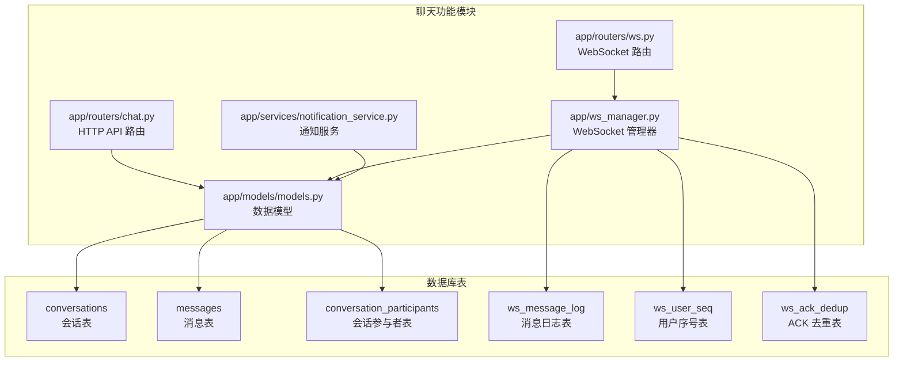
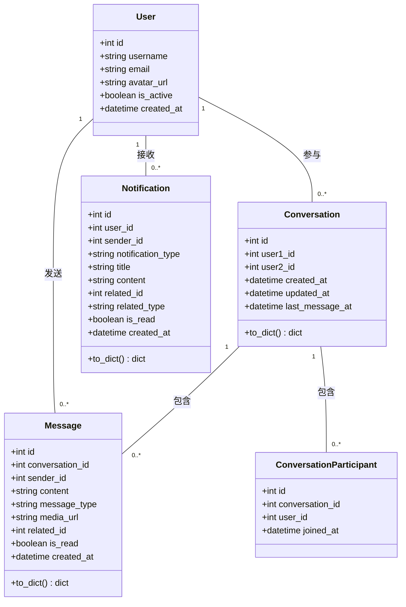
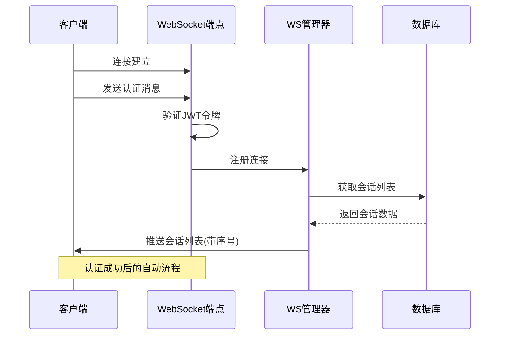
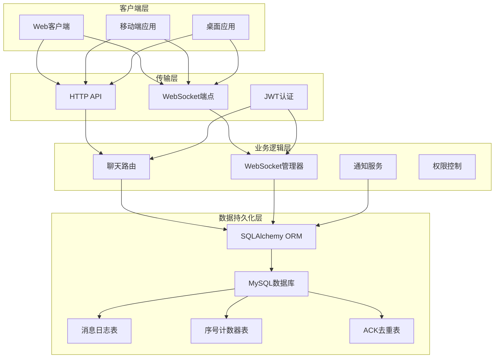
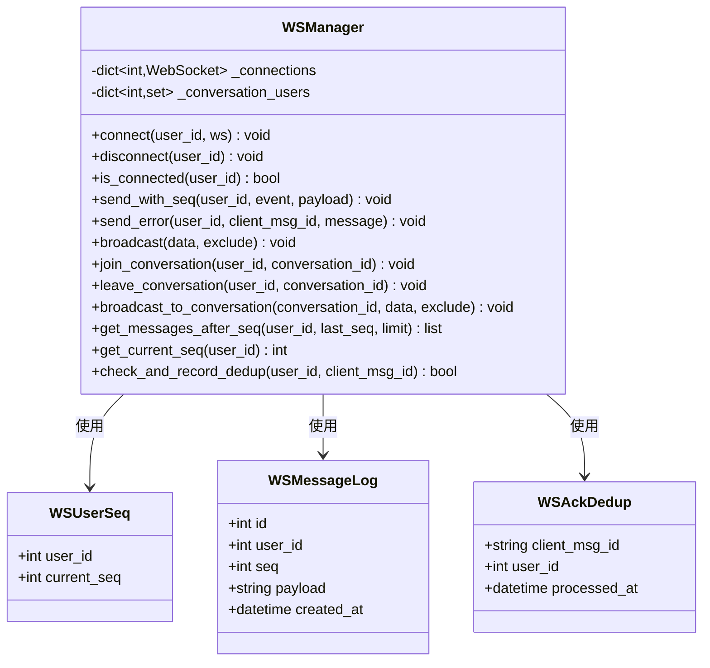
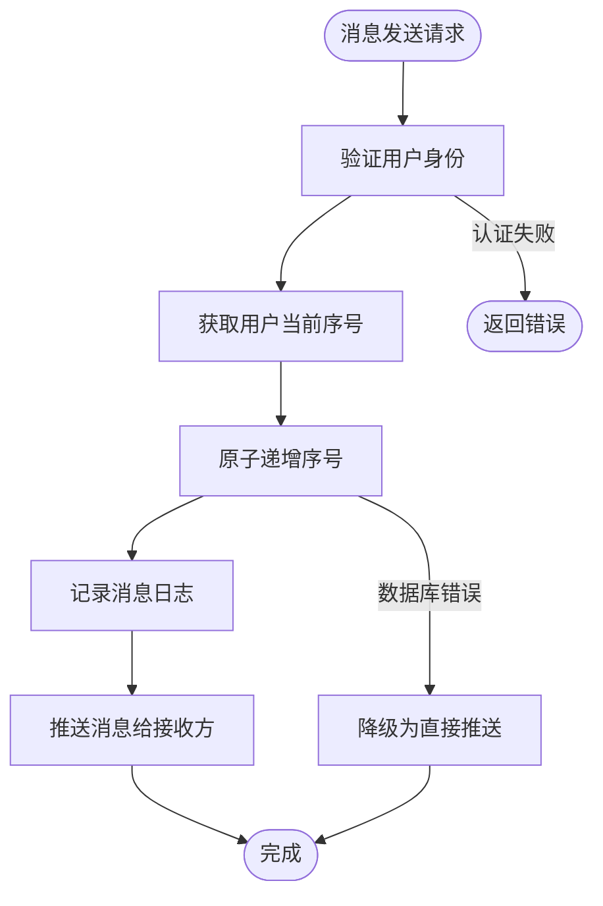
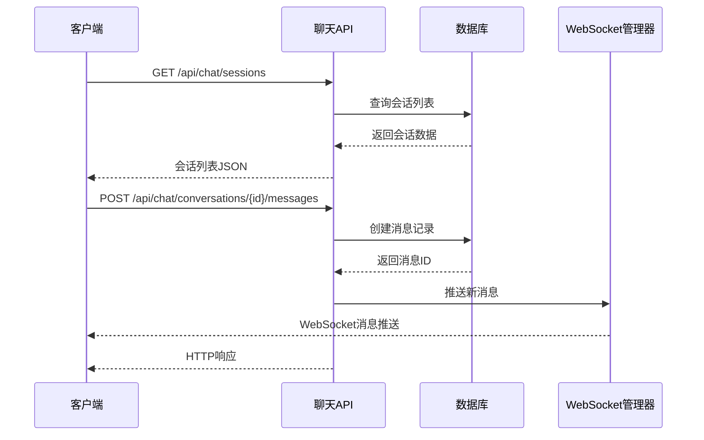
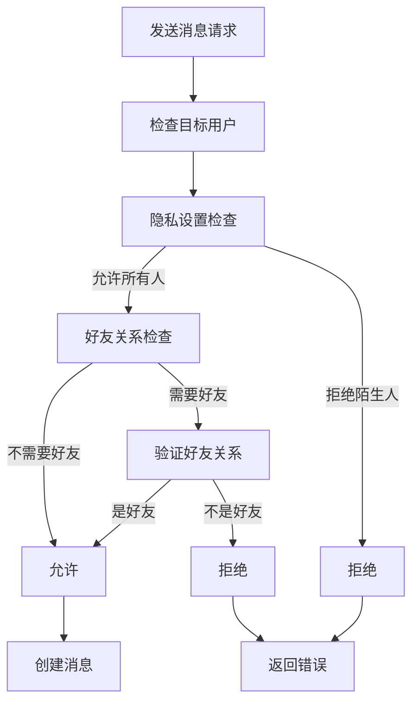
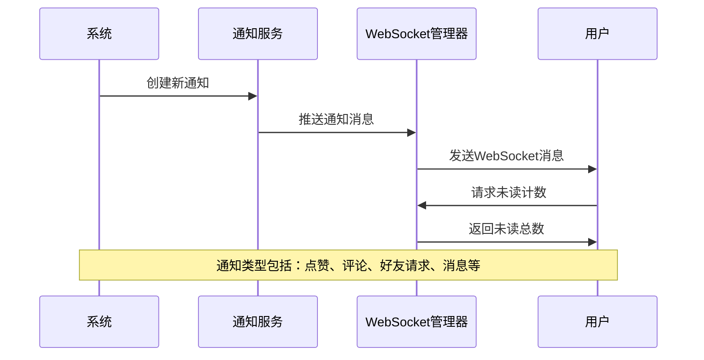
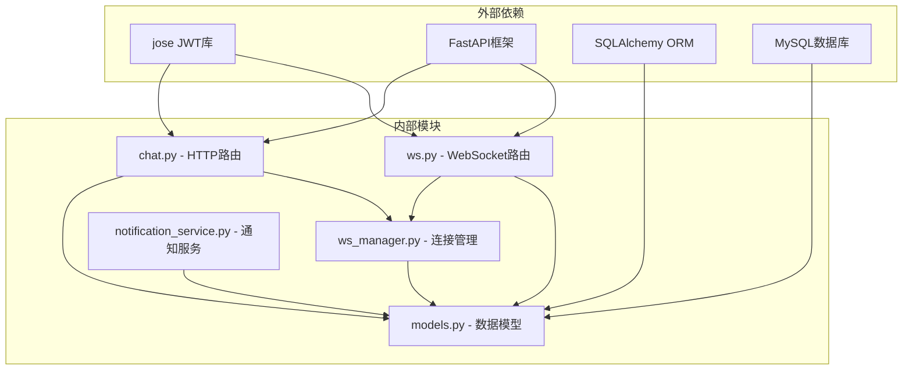

# 聊天功能实现

<cite>
**本文档引用的文件**
- [app/routers/chat.py](file://app/routers/chat.py)
- [app/routers/ws.py](file://app/routers/ws.py)
- [app/ws_manager.py](file://app/ws_manager.py)
- [app/models/models.py](file://app/models/models.py)
- [app/services/notification_service.py](file://app/services/notification_service.py)
- [websocket_api.json](file://websocket_api.json)
- [openapi.json](file://openapi.json)
- [migrations/add_ws_protocol_tables.sql](file://migrations/add_ws_protocol_tables.sql)
</cite>

## 目录
1. [简介](#简介)
2. [项目结构](#项目结构)
3. [核心组件](#核心组件)
4. [架构概览](#架构概览)
5. [详细组件分析](#详细组件分析)
6. [依赖关系分析](#依赖关系分析)
7. [性能考虑](#性能考虑)
8. [故障排除指南](#故障排除指南)
9. [结论](#结论)
10. [附录](#附录)

## 简介

NanTuPy 聊天功能模块是一个基于 FastAPI 和 WebSocket 的实时通信系统，提供了完整的私信聊天和群组聊天解决方案。该系统采用原生 WebSocket 序号协议，实现了可靠的消息传递、断线补发、ACK 去重和消息状态跟踪等功能。

系统支持多种消息类型（文本、图片、文件等），具备完善的权限控制机制，能够处理复杂的聊天场景，包括在线状态管理、消息历史查询、通知推送等高级功能。

## 项目结构

聊天功能模块主要分布在以下几个核心文件中：



**图表来源**
- [app/routers/chat.py:1-538](file://app/routers/chat.py#L1-L538)
- [app/routers/ws.py:1-538](file://app/routers/ws.py#L1-L538)
- [app/ws_manager.py:1-308](file://app/ws_manager.py#L1-L308)
- [app/models/models.py:1-655](file://app/models/models.py#L1-L655)

**章节来源**
- [app/routers/chat.py:1-538](file://app/routers/chat.py#L1-L538)
- [app/routers/ws.py:1-538](file://app/routers/ws.py#L1-L538)
- [app/ws_manager.py:1-308](file://app/ws_manager.py#L1-L308)
- [app/models/models.py:1-655](file://app/models/models.py#L1-L655)

## 核心组件

### 数据模型设计

聊天功能的核心数据模型包括会话、消息和参与者三个主要实体：



**图表来源**
- [app/models/models.py:286-357](file://app/models/models.py#L286-L357)
- [app/models/models.py:42-98](file://app/models/models.py#L42-L98)
- [app/models/models.py:359-389](file://app/models/models.py#L359-L389)

### WebSocket 序号协议

系统采用原生 WebSocket 序号协议，确保消息的可靠传递和顺序保证：



**图表来源**
- [app/routers/ws.py:434-538](file://app/routers/ws.py#L434-L538)
- [app/ws_manager.py:45-64](file://app/ws_manager.py#L45-L64)

**章节来源**
- [app/models/models.py:286-357](file://app/models/models.py#L286-L357)
- [app/ws_manager.py:170-213](file://app/ws_manager.py#L170-L213)

## 架构概览

聊天功能采用分层架构设计，将业务逻辑、传输层和数据持久化清晰分离：



**图表来源**
- [app/routers/chat.py:1-538](file://app/routers/chat.py#L1-L538)
- [app/routers/ws.py:1-538](file://app/routers/ws.py#L1-L538)
- [app/ws_manager.py:1-308](file://app/ws_manager.py#L1-L308)

## 详细组件分析

### WebSocket 管理器

WSManager 是聊天系统的核心组件，负责管理 WebSocket 连接、消息序号分配和断线补发：



**图表来源**
- [app/ws_manager.py:20-307](file://app/ws_manager.py#L20-L307)
- [app/models/models.py:640-655](file://app/models/models.py#L640-L655)

#### 序号系统实现

序号系统是 WebSocket 协议的核心特性，确保消息的可靠传递：



**图表来源**
- [app/ws_manager.py:170-213](file://app/ws_manager.py#L170-L213)

**章节来源**
- [app/ws_manager.py:20-307](file://app/ws_manager.py#L20-L307)

### HTTP 聊天 API

HTTP 路由提供了传统 RESTful 接口，作为 WebSocket 的降级备选方案：



**图表来源**
- [app/routers/chat.py:23-131](file://app/routers/chat.py#L23-L131)
- [app/routers/chat.py:351-428](file://app/routers/chat.py#L351-L428)

#### 消息类型支持

系统支持多种消息类型，满足不同的聊天需求：

| 消息类型 | 描述 | 使用场景 | 示例 |
|---------|------|----------|------|
| text | 文本消息 | 普通聊天内容 | "你好，今天过得怎么样？" |
| image | 图片消息 | 分享图片内容 | "https://example.com/image.jpg" |
| file | 文件消息 | 传输文件附件 | "https://example.com/document.pdf" |
| post | 帖子引用 | 引用平台内容 | 引用帖子ID |
| comment | 评论引用 | 回复特定评论 | 引用评论ID |

**章节来源**
- [app/routers/chat.py:351-428](file://app/routers/chat.py#L351-L428)
- [app/models/models.py:328-357](file://app/models/models.py#L328-L357)

### 权限控制机制

系统实现了多层次的权限控制，确保聊天的安全性：



**图表来源**
- [app/routers/ws.py:84-108](file://app/routers/ws.py#L84-L108)

**章节来源**
- [app/routers/ws.py:84-108](file://app/routers/ws.py#L84-L108)

### 通知推送系统

通知服务与聊天功能深度集成，提供实时的通知推送：



**图表来源**
- [app/services/notification_service.py:21-53](file://app/services/notification_service.py#L21-L53)

**章节来源**
- [app/services/notification_service.py:14-233](file://app/services/notification_service.py#L14-L233)

## 依赖关系分析

聊天功能模块的依赖关系如下：



**图表来源**
- [app/routers/chat.py:1-16](file://app/routers/chat.py#L1-L16)
- [app/routers/ws.py:1-18](file://app/routers/ws.py#L1-L18)
- [app/ws_manager.py:1-17](file://app/ws_manager.py#L1-L17)

**章节来源**
- [app/routers/chat.py:1-16](file://app/routers/chat.py#L1-L16)
- [app/routers/ws.py:1-18](file://app/routers/ws.py#L1-L18)
- [app/ws_manager.py:1-17](file://app/ws_manager.py#L1-L17)

## 性能考虑

### 数据库优化策略

1. **索引优化**
   - 为 `messages.conversation_id` 和 `messages.created_at` 建立复合索引
   - 为 `conversations.user1_id` 和 `conversations.user2_id` 建立索引
   - 为 `users.id` 建立主键索引

2. **查询优化**
   - 使用子查询获取最后一条消息，避免 N+1 查询问题
   - 批量获取用户信息，减少数据库往返次数
   - 使用聚合查询计算未读消息数量

3. **缓存策略**
   - 在内存中缓存在线用户状态
   - 缓存最近的会话列表数据

### WebSocket 性能优化

1. **连接管理**
   - 单用户多连接时自动关闭旧连接
   - 连接断开时及时清理资源

2. **消息序列化**
   - 使用高效的 JSON 序列化
   - 避免不必要的数据传输

3. **内存管理**
   - 及时清理过期的消息日志
   - 定期清理 ACK 去重记录

## 故障排除指南

### 常见问题及解决方案

#### WebSocket 连接问题

**问题**: 客户端无法连接到 WebSocket 服务器
**原因**: 
- JWT 令牌无效或过期
- 用户不存在
- 同用户重复连接

**解决方案**:
1. 检查 JWT 令牌的有效性
2. 验证用户账户状态
3. 确认没有重复的连接

#### 消息丢失问题

**问题**: 消息在传输过程中丢失
**原因**:
- 网络中断导致断线
- 客户端未正确处理断线重连

**解决方案**:
1. 实现断线重连机制
2. 使用 `sync` 消息请求补发
3. 确保客户端正确维护 `lastReceivedSeq`

#### 权限验证失败

**问题**: 发送消息时出现权限错误
**原因**:
- 目标用户设置了隐私限制
- 发送者与接收者不是好友关系

**解决方案**:
1. 检查目标用户的隐私设置
2. 确认好友关系状态
3. 提供合适的错误提示

**章节来源**
- [websocket_api.json:36-44](file://websocket_api.json#L36-L44)
- [app/routers/ws.py:446-478](file://app/routers/ws.py#L446-L478)

## 结论

NanTuPy 聊天功能模块是一个设计精良、功能完整的实时通信系统。其核心优势包括：

1. **可靠性**: 基于序号协议的消息传递，确保消息的可靠性和顺序性
2. **扩展性**: 清晰的模块化设计，便于功能扩展和维护
3. **安全性**: 多层次的权限控制和认证机制
4. **性能**: 优化的数据库查询和连接管理策略
5. **用户体验**: 完善的断线重连和消息状态跟踪

该系统为构建现代社交平台提供了坚实的技术基础，能够支持从小规模应用到大规模用户场景的各种需求。

## 附录

### API 接口文档

#### HTTP 聊天 API

| 端点 | 方法 | 描述 | 认证要求 |
|------|------|------|----------|
| `/api/chat/sessions` | GET | 获取会话列表 | Bearer Token |
| `/api/chat/conversations` | GET | 获取会话列表 | Bearer Token |
| `/api/chat/conversations/{user_id}` | GET | 获取与特定用户的会话 | Bearer Token |
| `/api/chat/conversations/{conversation_id}/messages` | GET | 获取消息历史 | Bearer Token |
| `/api/chat/conversations/{conversation_id}/messages` | POST | 发送消息（HTTP降级） | Bearer Token |
| `/api/chat/conversations/{conversation_id}/read` | PUT | 标记会话已读 | Bearer Token |
| `/api/chat/users/online` | GET | 获取在线用户列表 | Bearer Token |
| `/api/chat/users/{user_id}/status` | GET | 获取用户在线状态 | Bearer Token |
| `/api/chat/unread-count` | GET | 获取未读消息总数 | Bearer Token |

#### WebSocket 协议

| 消息类型 | 描述 | 必需字段 | 可选字段 |
|----------|------|----------|----------|
| auth | 认证消息 | type, token | - |
| send | 发送消息 | type, payload | clientMsgId |
| sync | 断线补发 | type, lastReceivedSeq | - |
| ack_receive | 接收确认 | type, seq | - |
| ping | 心跳消息 | type | - |
| join | 加入会话 | type, conversation_id | - |
| leave | 离开会话 | type, conversation_id | - |
| typing | 正在输入 | type, conversation_id | - |
| stop_typing | 停止输入 | type, conversation_id | - |

### 客户端集成指南

#### WebSocket 连接步骤

1. **建立连接**
   ```javascript
   const ws = new WebSocket('ws://localhost:5000/ws');
   ```

2. **发送认证消息**
   ```javascript
   ws.onopen = () => {
       ws.send(JSON.stringify({
           type: 'auth',
           token: jwtToken
       }));
   };
   ```

3. **处理认证结果**
   ```javascript
   ws.onmessage = (e) => {
       const msg = JSON.parse(e.data);
       if (msg.type === 'auth_result' && msg.success) {
           console.log('认证成功');
       }
   };
   ```

4. **接收会话列表**
   ```javascript
   ws.onmessage = (e) => {
       const msg = JSON.parse(e.data);
       if (msg.type === 'message' && msg.payload.event === 'session_list') {
           handleSessionList(msg.payload.sessions);
       }
   };
   ```

5. **发送消息**
   ```javascript
   const sendMessage = (conversationId, content) => {
       const clientMsgId = generateUUID();
       ws.send(JSON.stringify({
           type: 'send',
           clientMsgId: clientMsgId,
           payload: {
               conversation_id: conversationId,
               content: content,
               message_type: 'text'
           }
       }));
   };
   ```

6. **断线重连**
   ```javascript
   ws.onclose = () => {
       setTimeout(() => {
           reconnectWebSocket(lastReceivedSeq);
       }, 3000);
   };
   
   const reconnectWebSocket = (lastSeq) => {
       const ws = new WebSocket('ws://localhost:5000/ws');
       ws.onopen = () => {
           ws.send(JSON.stringify({
               type: 'auth',
               token: jwtToken
           }));
           ws.send(JSON.stringify({
               type: 'sync',
               lastReceivedSeq: lastSeq
           }));
       };
   };
   ```

#### 错误处理最佳实践

1. **网络错误处理**
   - 实现自动重连机制
   - 设置重连间隔和最大重试次数
   - 提供用户友好的错误提示

2. **认证错误处理**
   - 检测 JWT 过期情况
   - 引导用户重新登录
   - 保存必要的认证信息

3. **消息发送错误处理**
   - 实现乐观更新和回滚机制
   - 显示发送失败的用户界面
   - 提供重试选项

#### 性能优化建议

1. **连接池管理**
   - 复用 WebSocket 连接
   - 合理管理连接数量
   - 及时清理无效连接

2. **消息处理优化**
   - 批量处理消息
   - 实现消息去重
   - 优化消息渲染

3. **内存管理**
   - 及时清理历史消息
   - 限制消息缓存大小
   - 监控内存使用情况