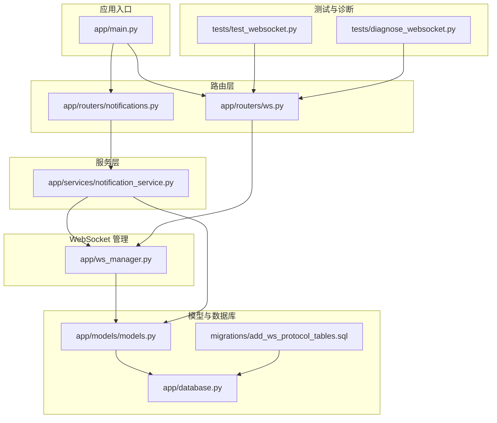
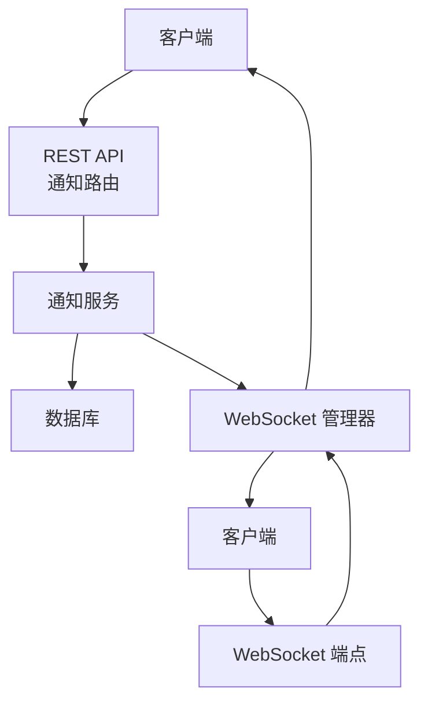
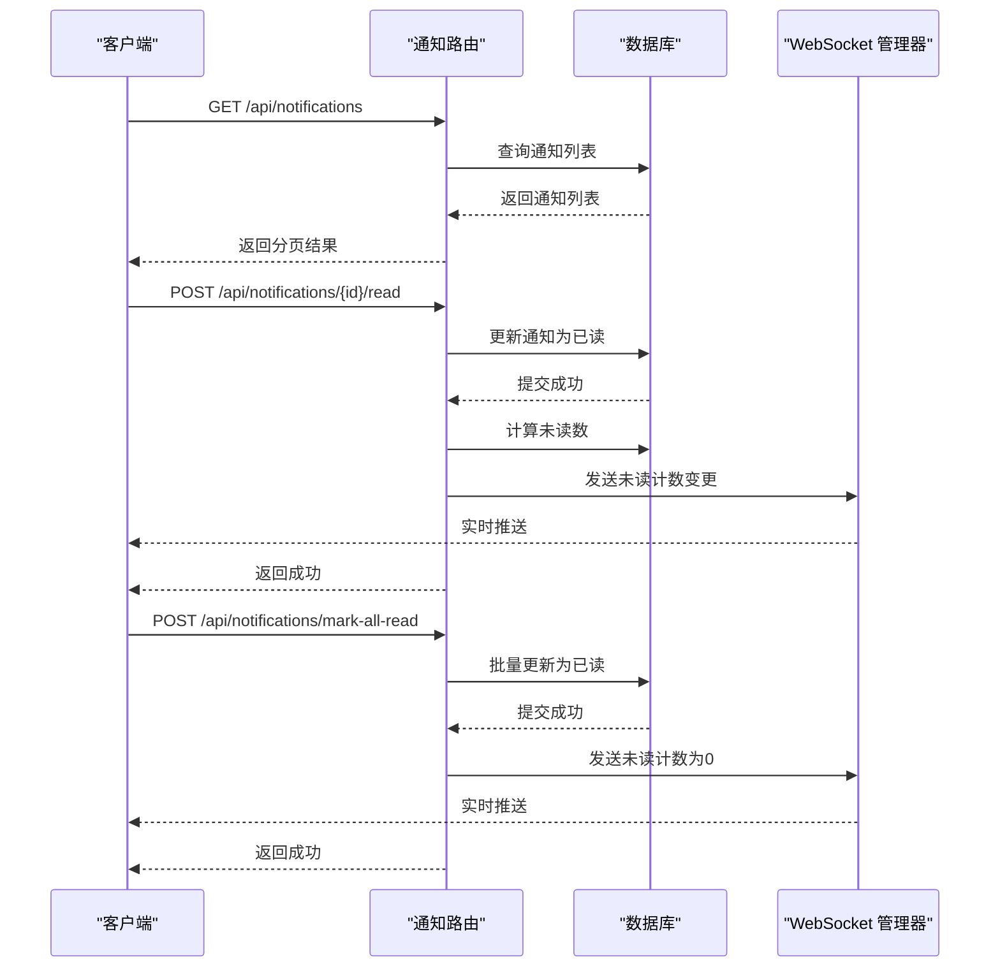
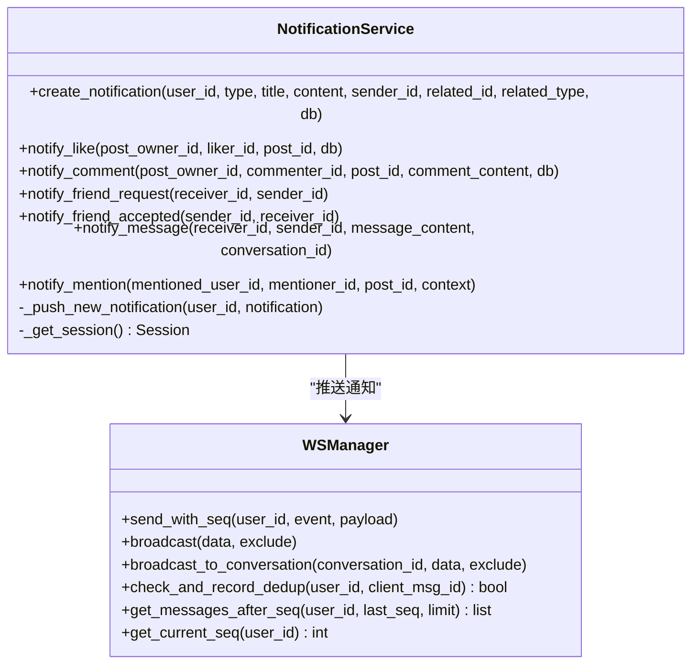
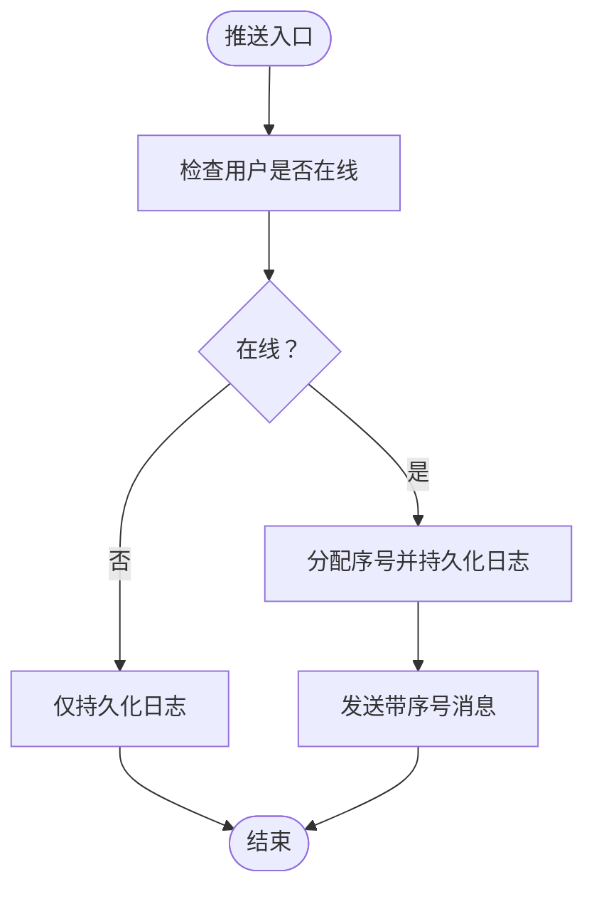
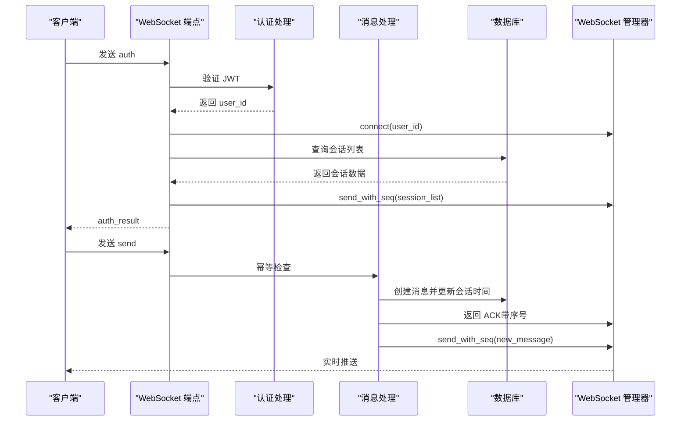
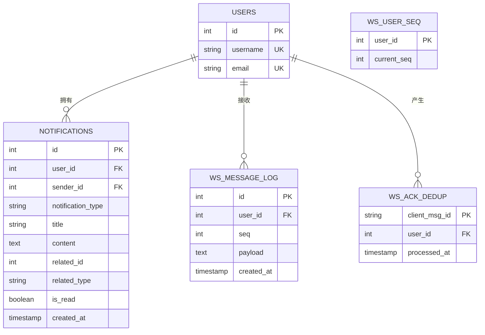
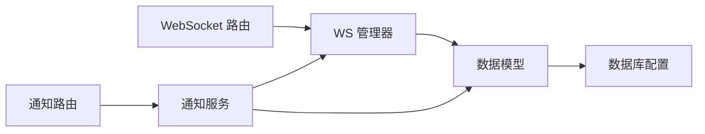

# 通知广播系统

<cite>
**本文档引用的文件**
- [app/routers/notifications.py](file://app/routers/notifications.py)
- [app/services/notification_service.py](file://app/services/notification_service.py)
- [app/ws_manager.py](file://app/ws_manager.py)
- [app/routers/ws.py](file://app/routers/ws.py)
- [app/models/models.py](file://app/models/models.py)
- [migrations/add_ws_protocol_tables.sql](file://migrations/add_ws_protocol_tables.sql)
- [app/main.py](file://app/main.py)
- [app/database.py](file://app/database.py)
- [tests/test_websocket.py](file://tests/test_websocket.py)
- [tests/diagnose_websocket.py](file://tests/diagnose_websocket.py)
</cite>

## 目录
1. [简介](#简介)
2. [项目结构](#项目结构)
3. [核心组件](#核心组件)
4. [架构总览](#架构总览)
5. [详细组件分析](#详细组件分析)
6. [依赖关系分析](#依赖关系分析)
7. [性能考虑](#性能考虑)
8. [故障排查指南](#故障排查指南)
9. [结论](#结论)
10. [附录](#附录)

## 简介
本文件面向通知广播系统，系统采用基于 WebSocket 的实时推送机制，结合数据库持久化的序号系统、ACK 去重与断线补发能力，确保消息的可靠投递。通知类型覆盖点赞、评论、好友请求/接受、消息、提及等场景，并通过通知服务统一创建与推送。同时，系统支持通知设置（推送、消息、声音）与批量广播、条件过滤（如按用户维度、会话房间）等能力，满足高并发与可靠性要求。

## 项目结构
通知广播系统主要由以下模块构成：
- 路由层：REST API 路由负责通知列表、未读统计、标记已读、删除与设置管理。
- 服务层：通知服务封装通知创建、类型化推送与异步推送逻辑。
- WebSocket 层：连接管理、序号分配、断线补发、ACK 去重、广播与会话房间。
- 模型层：通知实体与 WebSocket 协议相关表（序号、日志、去重）。
- 数据库与配置：SQLAlchemy 引擎、会话管理与表初始化。
- 测试与诊断：WebSocket 连接测试与诊断工具。

**图表来源**
- [app/main.py:1-110](file://app/main.py#L1-L110)
- [app/routers/notifications.py:1-208](file://app/routers/notifications.py#L1-L208)
- [app/routers/ws.py:1-538](file://app/routers/ws.py#L1-L538)
- [app/services/notification_service.py:1-233](file://app/services/notification_service.py#L1-L233)
- [app/ws_manager.py:1-308](file://app/ws_manager.py#L1-L308)
- [app/models/models.py:1-655](file://app/models/models.py#L1-L655)
- [app/database.py:1-38](file://app/database.py#L1-L38)
- [migrations/add_ws_protocol_tables.sql:1-32](file://migrations/add_ws_protocol_tables.sql#L1-L32)
- [tests/test_websocket.py:1-203](file://tests/test_websocket.py#L1-L203)
- [tests/diagnose_websocket.py:1-239](file://tests/diagnose_websocket.py#L1-L239)

**章节来源**
- [app/main.py:1-110](file://app/main.py#L1-L110)
- [app/routers/notifications.py:1-208](file://app/routers/notifications.py#L1-L208)
- [app/routers/ws.py:1-538](file://app/routers/ws.py#L1-L538)
- [app/services/notification_service.py:1-233](file://app/services/notification_service.py#L1-L233)
- [app/ws_manager.py:1-308](file://app/ws_manager.py#L1-L308)
- [app/models/models.py:1-655](file://app/models/models.py#L1-L655)
- [app/database.py:1-38](file://app/database.py#L1-L38)
- [migrations/add_ws_protocol_tables.sql:1-32](file://migrations/add_ws_protocol_tables.sql#L1-L32)
- [tests/test_websocket.py:1-203](file://tests/test_websocket.py#L1-L203)
- [tests/diagnose_websocket.py:1-239](file://tests/diagnose_websocket.py#L1-L239)

## 核心组件
- 通知路由：提供通知列表分页、未读统计、单条/全部标记已读、删除与清空、通知偏好设置读取与更新。
- 通知服务：统一创建通知、计算未读数、异步推送 WebSocket 新通知事件；内置多种通知类型（点赞、评论、好友请求/接受、消息、提及）。
- WebSocket 管理器：连接池管理、序号分配与持久化、断线补发、ACK 去重、广播与会话房间广播。
- WebSocket 路由：认证、消息处理（发送、同步、会话房间、打字广播、ACK 接收）、通知标记已读处理。
- 数据模型：通知实体与 WebSocket 协议相关表（消息日志、用户序号、ACK 去重）。
- 数据库配置：SQLAlchemy 引擎、会话工厂与表初始化。

**章节来源**
- [app/routers/notifications.py:15-208](file://app/routers/notifications.py#L15-L208)
- [app/services/notification_service.py:14-233](file://app/services/notification_service.py#L14-L233)
- [app/ws_manager.py:20-308](file://app/ws_manager.py#L20-L308)
- [app/routers/ws.py:27-538](file://app/routers/ws.py#L27-L538)
- [app/models/models.py:359-390](file://app/models/models.py#L359-L390)
- [app/models/models.py:625-655](file://app/models/models.py#L625-L655)
- [app/database.py:1-38](file://app/database.py#L1-L38)

## 架构总览
通知广播系统采用“REST API + WebSocket”的双通道架构：
- REST API 负责通知的 CRUD 与设置管理，同时在关键操作后触发 WebSocket 实时推送。
- WebSocket 负责实时消息推送、断线补发、ACK 去重与会话房间广播。

**图表来源**
- [app/routers/notifications.py:15-208](file://app/routers/notifications.py#L15-L208)
- [app/services/notification_service.py:14-233](file://app/services/notification_service.py#L14-L233)
- [app/routers/ws.py:434-538](file://app/routers/ws.py#L434-L538)
- [app/ws_manager.py:20-308](file://app/ws_manager.py#L20-L308)

## 详细组件分析

### 通知路由与处理流程
- 列表与分页：支持按页查询、未读过滤、排序与未读计数。
- 标记已读：单条与全部标记已读，完成后通过 WebSocket 推送未读计数变更。
- 删除与清空：支持单条删除与全部清空。
- 设置管理：读取与更新通知偏好（推送、消息、声音）。

**图表来源**
- [app/routers/notifications.py:15-120](file://app/routers/notifications.py#L15-L120)
- [app/ws_manager.py:74-106](file://app/ws_manager.py#L74-L106)

**章节来源**
- [app/routers/notifications.py:15-120](file://app/routers/notifications.py#L15-L120)
- [app/ws_manager.py:74-106](file://app/ws_manager.py#L74-L106)

### 通知服务与类型化推送
- 统一创建：接收用户、类型、标题、内容、关联对象等参数，持久化后触发异步推送。
- 异步推送：在事件循环中异步获取未读数并推送 WebSocket 消息，失败时记录警告。
- 类型化通知：内置点赞、评论、好友请求/接受、消息、提及等场景，自动拼装标题与预览内容。

**图表来源**
- [app/services/notification_service.py:14-233](file://app/services/notification_service.py#L14-L233)
- [app/ws_manager.py:20-308](file://app/ws_manager.py#L20-L308)

**章节来源**
- [app/services/notification_service.py:14-233](file://app/services/notification_service.py#L14-L233)
- [app/ws_manager.py:20-308](file://app/ws_manager.py#L20-L308)

### WebSocket 管理器与序号机制
- 连接管理：注册/注销连接、在线用户查询、重复连接处理。
- 序号系统：为每个用户维护单调递增序号，持久化消息日志，支持断线补发。
- ACK 去重：基于 clientMsgId 的幂等检查与记录，定期清理过期记录。
- 广播与房间：支持全局广播与会话房间广播，便于打字状态等事件传播。

**图表来源**
- [app/ws_manager.py:74-106](file://app/ws_manager.py#L74-L106)
- [app/ws_manager.py:170-213](file://app/ws_manager.py#L170-L213)

**章节来源**
- [app/ws_manager.py:45-106](file://app/ws_manager.py#L45-L106)
- [app/ws_manager.py:170-213](file://app/ws_manager.py#L170-L213)
- [app/ws_manager.py:265-304](file://app/ws_manager.py#L265-L304)

### WebSocket 路由与消息处理
- 认证：JWT 解析与用户校验，认证成功后初始化会话列表与房间加入。
- 消息处理：send（含幂等检查与 ACK 返回）、sync（断线补发）、join/leave（房间）、typing/stop_typing（房间广播）、ack_receive（可选流量控制）。
- 通知处理：notifications_read（批量标记已读）。

**图表来源**
- [app/routers/ws.py:434-538](file://app/routers/ws.py#L434-L538)
- [app/routers/ws.py:182-213](file://app/routers/ws.py#L182-L213)
- [app/routers/ws.py:215-315](file://app/routers/ws.py#L215-L315)
- [app/ws_manager.py:74-106](file://app/ws_manager.py#L74-L106)

**章节来源**
- [app/routers/ws.py:434-538](file://app/routers/ws.py#L434-L538)
- [app/routers/ws.py:182-315](file://app/routers/ws.py#L182-L315)
- [app/ws_manager.py:74-106](file://app/ws_manager.py#L74-L106)

### 数据模型与协议表
- 通知模型：包含用户、发送者、类型、标题、内容、关联对象、是否已读与创建时间。
- WebSocket 协议表：消息日志（持久化）、用户序号（原子递增）、ACK 去重（幂等）。

**图表来源**
- [app/models/models.py:359-390](file://app/models/models.py#L359-L390)
- [app/models/models.py:625-655](file://app/models/models.py#L625-L655)

**章节来源**
- [app/models/models.py:359-390](file://app/models/models.py#L359-L390)
- [app/models/models.py:625-655](file://app/models/models.py#L625-L655)
- [migrations/add_ws_protocol_tables.sql:1-32](file://migrations/add_ws_protocol_tables.sql#L1-L32)

## 依赖关系分析
- 路由依赖：通知路由依赖数据库会话与当前用户依赖注入，WebSocket 路由依赖 JWT 验证与 WS 管理器。
- 服务依赖：通知服务依赖数据库会话与 WS 管理器，内部异步推送。
- WS 管理器依赖：数据库会话、消息日志与序号表、ACK 去重表。
- 数据库依赖：SQLAlchemy 引擎与会话工厂，表初始化在应用启动时执行。

**图表来源**
- [app/routers/notifications.py:1-208](file://app/routers/notifications.py#L1-L208)
- [app/routers/ws.py:1-538](file://app/routers/ws.py#L1-L538)
- [app/services/notification_service.py:1-233](file://app/services/notification_service.py#L1-L233)
- [app/ws_manager.py:1-308](file://app/ws_manager.py#L1-L308)
- [app/models/models.py:1-655](file://app/models/models.py#L1-L655)
- [app/database.py:1-38](file://app/database.py#L1-L38)

**章节来源**
- [app/routers/notifications.py:1-208](file://app/routers/notifications.py#L1-L208)
- [app/routers/ws.py:1-538](file://app/routers/ws.py#L1-L538)
- [app/services/notification_service.py:1-233](file://app/services/notification_service.py#L1-L233)
- [app/ws_manager.py:1-308](file://app/ws_manager.py#L1-L308)
- [app/models/models.py:1-655](file://app/models/models.py#L1-L655)
- [app/database.py:1-38](file://app/database.py#L1-L38)

## 性能考虑
- 消息队列与异步推送：通知服务通过异步方式推送 WebSocket 消息，避免阻塞主线程，提升吞吐。
- 序号与日志：消息持久化到日志表，支持断线补发；序号原子递增保证顺序性。
- ACK 去重：基于 clientMsgId 的幂等检查减少重复处理，降低数据库压力。
- 广播策略：支持按用户维度广播与会话房间广播，避免不必要的全量广播。
- 数据库连接池：SQLAlchemy 引擎配置连接池大小、溢出与回收参数，配合 pre_ping 与自动提交/回滚，提升稳定性。
- 缓存机制：可在应用层引入 Redis 缓存未读计数与最近通知列表，减少数据库查询压力。
- 负载均衡：WebSocket 连接可部署多实例，结合共享存储或消息中间件实现水平扩展。

[本节为通用性能建议，无需特定文件引用]

## 故障排查指南
- WebSocket 连接测试：使用测试脚本登录获取 Token，连接 WebSocket 端点，观察连接与断开日志。
- 诊断工具：检查服务器健康状态、端口监听、WebSocket 端点可达性与 Socket.IO 连接。
- 常见问题：
  - 认证失败：检查 Token 是否有效与用户是否存在。
  - 连接断开：查看 WS 管理器日志，确认连接池与断线补发逻辑。
  - 消息丢失：检查消息日志表与序号表，确认持久化与补发流程。
  - 幂等性问题：检查 ACK 去重表，确认重复请求被正确识别。

**章节来源**
- [tests/test_websocket.py:1-203](file://tests/test_websocket.py#L1-L203)
- [tests/diagnose_websocket.py:1-239](file://tests/diagnose_websocket.py#L1-L239)
- [app/routers/ws.py:434-538](file://app/routers/ws.py#L434-L538)
- [app/ws_manager.py:265-304](file://app/ws_manager.py#L265-L304)

## 结论
通知广播系统通过 REST API 与 WebSocket 的协同，实现了可靠、有序、可扩展的通知推送与广播能力。序号系统与断线补发保障消息不丢失，ACK 去重确保幂等性，类型化通知服务简化业务集成。配合数据库连接池与潜在的缓存/消息队列优化，系统可在高并发场景下保持稳定与高性能。

[本节为总结，无需特定文件引用]

## 附录
- 应用入口与路由注册：FastAPI 应用在启动时初始化数据库并注册通知与 WebSocket 路由。
- 数据库初始化：应用生命周期中创建所有表，包括通知与 WebSocket 协议相关表。

**章节来源**
- [app/main.py:1-110](file://app/main.py#L1-L110)
- [app/database.py:35-38](file://app/database.py#L35-L38)
- [migrations/add_ws_protocol_tables.sql:1-32](file://migrations/add_ws_protocol_tables.sql#L1-L32)